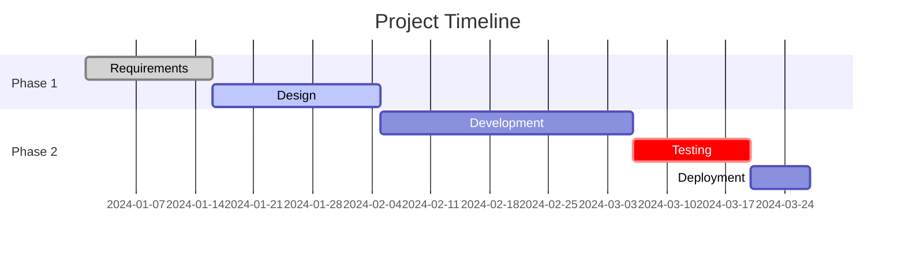
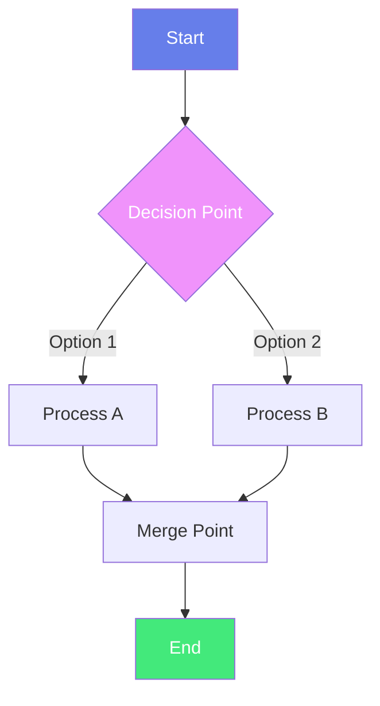
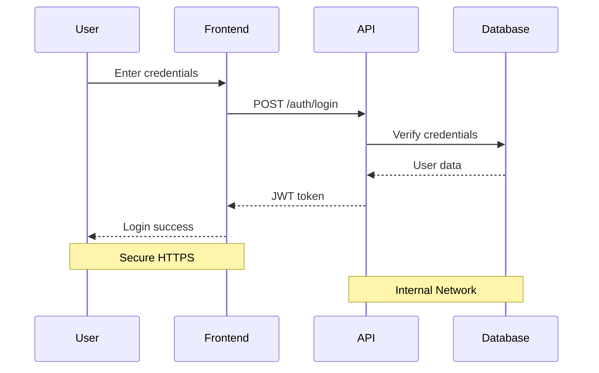
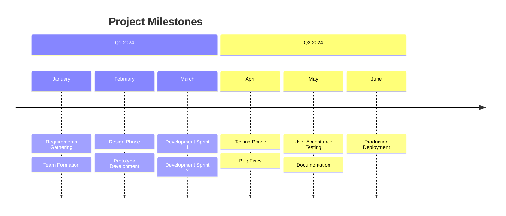
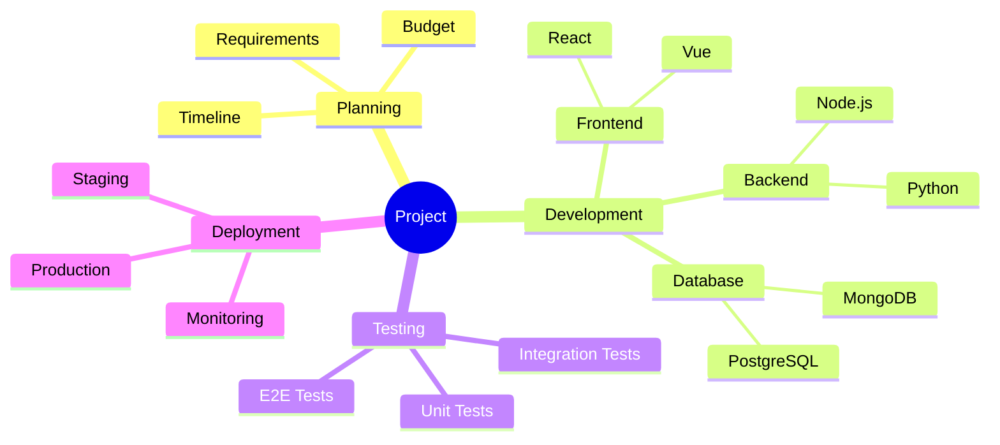
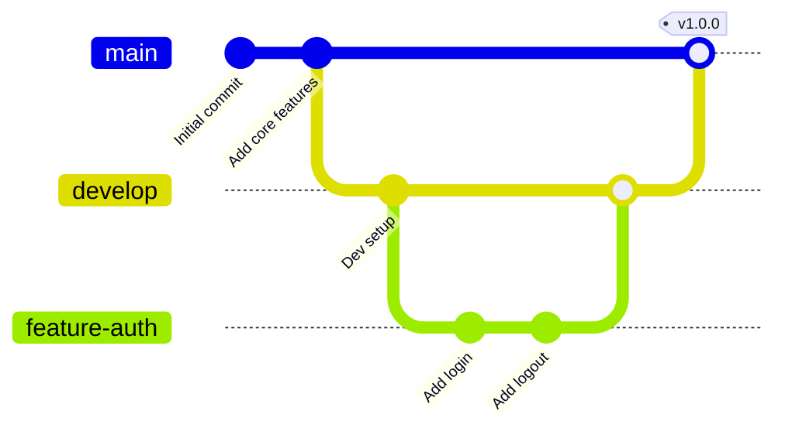

# 🏆 MEGA MARKDOWN TEMPLATE 🏆

**The Complete Markdown Vault Database**
**Source**: Comprehensive compilation from 6 professional Obsidian vault templates
**Purpose**: Ultimate reference for beautiful, functional markdown syntax
**Last Updated**: 2025-12-28

---

## 📑 Table of Contents

1. [HTML/CSS Components](#html-css-components)
2. [Mermaid Diagrams](#mermaid-diagrams)
3. [Obsidian Callouts](#obsidian-callouts)
4. [Dashboards & Metrics](#dashboards--metrics)
5. [Task Management](#task-management)
6. [Advanced Markdown](#advanced-markdown)
7. [Quick Reference](#quick-reference)

---

## HTML/CSS Components

### Gradient Card Templates

**Purple Gradient Card**:
```html
<div style="border: 1px solid #ddd; border-radius: 12px; padding: 20px; background: linear-gradient(135deg, #667eea 0%, #764ba2 100%); color: white; margin: 15px 0; box-shadow: 0 4px 6px rgba(0,0,0,0.1);">
    <h3 style="margin: 0 0 10px 0;">Card Title</h3>
    <p style="margin: 0; opacity: 0.9;">Beautiful gradient background card</p>
</div>
```

**Pink-Red Gradient**:
```html
<div style="border: 1px solid #ddd; border-radius: 12px; padding: 20px; background: linear-gradient(135deg, #ff416c 0%, #ff4b2b 100%); color: white; margin: 15px 0; box-shadow: 0 4px 6px rgba(0,0,0,0.1);">
    <h3 style="margin: 0 0 10px 0;">Vibrant Card</h3>
    <p style="margin: 0; opacity: 0.9;">Eye-catching gradient for important content</p>
</div>
```

**Green-Teal Gradient**:
```html
<div style="border: 1px solid #ddd; border-radius: 12px; padding: 20px; background: linear-gradient(135deg, #11998e 0%, #38ef7d 100%); color: white; margin: 15px 0; box-shadow: 0 4px 6px rgba(0,0,0,0.1);">
    <h3 style="margin: 0 0 10px 0;">Success State</h3>
    <p style="margin: 0; opacity: 0.9;">Perfect for positive metrics</p>
</div>
```

### Profile Avatar Cards

**Contact Card with Avatar**:
```html
<div style="border: 1px solid #ddd; border-radius: 12px; padding: 20px; background: linear-gradient(135deg, #ff416c 0%, #ff4b2b 100%); color: white; margin: 15px 0; box-shadow: 0 4px 6px rgba(0,0,0,0.1);">
    <div style="display: flex; justify-content: space-between; align-items: flex-start; margin-bottom: 15px;">
        <div style="width: 60px; height: 60px; border-radius: 50%; background: white; display: flex; align-items: center; justify-content: center; color: #ff416c; font-size: 24px; font-weight: bold;">
            JD
        </div>
        <div style="text-align: right;">
            <p style="margin: 0; font-size: 12px; opacity: 0.8;">ID: #12345</p>
            <p style="margin: 0; font-size: 12px; opacity: 0.8;">Status: Active</p>
        </div>
    </div>
    <h3 style="margin: 0 0 10px 0;">John Doe</h3>
    <p style="margin: 0 0 5px 0; opacity: 0.9;">📧 john.doe@example.com</p>
    <p style="margin: 0; opacity: 0.9;">📱 +1 (555) 123-4567</p>
</div>
```

### Animated SVG Status Indicator

**Pulsing Circle**:
```html
<div style="position: relative; display: inline-block;">
    <svg width="22" height="22">
        <circle cx="11" cy="11" r="9" fill="none" stroke="#4cd964" stroke-width="3"
                stroke-dasharray="56.5" stroke-dashoffset="0"
                style="animation: archPulse 1.8s infinite alternate;"/>
        <style>
            @keyframes archPulse {
                0% { stroke-dashoffset: 0; }
                100% { stroke-dashoffset: 28; }
            }
        </style>
    </svg>
</div>
```

### Grid Layouts

**Four-Column Metric Grid**:
```html
<div style="display: grid; grid-template-columns: repeat(4, 1fr); gap: 15px; margin: 20px 0;">
    <div style="padding: 20px; border-radius: 8px; background: linear-gradient(135deg, #667eea 0%, #764ba2 100%); color: white; text-align: center; box-shadow: 0 4px 6px rgba(0,0,0,0.1);">
        <div style="font-size: 32px; font-weight: bold; margin-bottom: 5px;">150</div>
        <div style="font-size: 14px; opacity: 0.9;">Total Users</div>
    </div>
    <div style="padding: 20px; border-radius: 8px; background: linear-gradient(135deg, #f093fb 0%, #f5576c 100%); color: white; text-align: center; box-shadow: 0 4px 6px rgba(0,0,0,0.1);">
        <div style="font-size: 32px; font-weight: bold; margin-bottom: 5px;">45</div>
        <div style="font-size: 14px; opacity: 0.9;">Active Now</div>
    </div>
    <div style="padding: 20px; border-radius: 8px; background: linear-gradient(135deg, #4facfe 0%, #00f2fe 100%); color: white; text-align: center; box-shadow: 0 4px 6px rgba(0,0,0,0.1);">
        <div style="font-size: 32px; font-weight: bold; margin-bottom: 5px;">89%</div>
        <div style="font-size: 14px; opacity: 0.9;">Satisfaction</div>
    </div>
    <div style="padding: 20px; border-radius: 8px; background: linear-gradient(135deg, #43e97b 0%, #38f9d7 100%); color: white; text-align: center; box-shadow: 0 4px 6px rgba(0,0,0,0.1);">
        <div style="font-size: 32px; font-weight: bold; margin-bottom: 5px;">$12.5k</div>
        <div style="font-size: 14px; opacity: 0.9;">Revenue</div>
    </div>
</div>
```

---

## Mermaid Diagrams

### Gantt Chart


### Flowchart (Graph TD)


### Sequence Diagram


### Timeline


### Mindmap


### Git Graph


---

## Obsidian Callouts

### Basic Callouts
```markdown
> [!info]
> This is an informational callout with helpful context.

> [!tip]
> Pro tip: Use callouts to highlight important information!

> [!warning]
> This is a warning callout for important considerations.

> [!error]
> Critical error information goes here.

> [!success]
> Successful completion or positive outcome.
```

### Collapsible Callouts
```markdown
> [!info]- Click to expand
> This content is hidden by default. Click the arrow to reveal it.
>
> You can include multiple paragraphs, lists, code blocks, and more.

> [!tip]+ Expanded by default
> This content is visible by default but can be collapsed.
```

### Nested Callouts
```markdown
> [!info] Main Information
> This is the outer callout.
>
> > [!warning] Nested Warning
> > This is nested inside the info callout.
>
> Back to main callout content.
```

---

## Dashboards & Metrics

### Progress Bar
```html
<div style="margin: 20px 0;">
    <div style="display: flex; justify-content: space-between; margin-bottom: 8px;">
        <span style="font-size: 14px; font-weight: 500;">Project Completion</span>
        <span style="font-size: 14px; color: #667eea; font-weight: 600;">75%</span>
    </div>
    <div style="width: 100%; height: 12px; background: #e0e0e0; border-radius: 6px; overflow: hidden;">
        <div style="width: 75%; height: 100%; background: linear-gradient(90deg, #667eea 0%, #764ba2 100%); border-radius: 6px;"></div>
    </div>
</div>
```

### System Status Dashboard
```html
<div style="background: #fff; padding: 25px; border-radius: 12px; border: 1px solid #e0e0e0; box-shadow: 0 2px 8px rgba(0,0,0,0.05);">
    <h3 style="margin: 0 0 25px 0;">System Status</h3>

    <div style="display: grid; grid-template-columns: 1fr 1fr; gap: 15px;">
        <div style="padding: 15px; background: #e8f5e9; border-radius: 8px; border-left: 4px solid #4cd964;">
            <div style="font-size: 12px; color: #2e7d32; font-weight: 500;">API SERVER</div>
            <div style="font-size: 18px; font-weight: bold; color: #1b5e20; margin-top: 5px;">Operational</div>
        </div>
        <div style="padding: 15px; background: #e8f5e9; border-radius: 8px; border-left: 4px solid #4cd964;">
            <div style="font-size: 12px; color: #2e7d32; font-weight: 500;">DATABASE</div>
            <div style="font-size: 18px; font-weight: bold; color: #1b5e20; margin-top: 5px;">Operational</div>
        </div>
    </div>
</div>
```

---

## Task Management

### Basic Task List
```markdown
- [ ] Incomplete task
- [x] Completed task
- [ ] Another task to do
```

### Priority Task List
```markdown
## 📋 Project Tasks

### 🎯 High Priority
- [ ] 🔥 Fix critical production bug
- [ ] 📊 Complete quarterly report
- [ ] 🤝 Client meeting preparation

### ⚙️ Medium Priority
- [ ] 📝 Update API documentation
- [ ] 🧪 Write unit tests
- [ ] 🔄 Refactor authentication

### 💡 Low Priority
- [ ] 🎨 Update UI color scheme
- [ ] 📚 Read documentation
```

### Task Table
```markdown
| Due Date | Task | Priority | Status |
|----------|------|----------|--------|
| Dec 28 | Fix production bug | 🔴 High | ⏳ In Progress |
| Dec 29 | Code review | 🟠 Medium | ❌ Not Started |
| Dec 30 | Deploy to staging | 🟠 Medium | ❌ Not Started |
```

---

## Advanced Markdown

### Tables with Emojis
```markdown
| Status | Feature | Priority | Progress |
|:------:|---------|:--------:|:--------:|
| ✅ | User Authentication | 🔴 High | 100% |
| ⏳ | Dashboard Analytics | 🟠 Medium | 75% |
| ❌ | Email Notifications | 🟢 Low | 0% |
```

### Blockquotes with Attribution
```markdown
> "The best way to predict the future is to invent it."
>
> — Alan Kay
```

### Code Blocks with Syntax Highlighting
````markdown
```javascript
function greet(name) {
  console.log(`Hello, ${name}!`);
}
greet("World");
```

```python
def calculate_sum(a, b):
    return a + b

result = calculate_sum(5, 3)
print(f"Result: {result}")
```
````

### Nested Lists
```markdown
1. First level
   - Nested bullet
   - Another nested bullet
     1. Deep nested number
     2. Another deep nested
2. Back to first level
```

### Text Formatting
```markdown
**Bold text**
*Italic text*
***Bold and italic***
~~Strikethrough~~
`Inline code`
H<sub>2</sub>O (subscript)
E = mc<sup>2</sup> (superscript)
<kbd>Ctrl</kbd> + <kbd>C</kbd> (keyboard keys)
```

---

## Quick Reference

### Gradient Color Schemes
```css
/* Professional Blues */
linear-gradient(135deg, #667eea 0%, #764ba2 100%)

/* Warm Reds */
linear-gradient(135deg, #ff416c 0%, #ff4b2b 100%)

/* Success Green */
linear-gradient(135deg, #11998e 0%, #38ef7d 100%)

/* Cool Blues */
linear-gradient(135deg, #4facfe 0%, #00f2fe 100%)

/* Pink Purple */
linear-gradient(135deg, #f093fb 0%, #f5576c 100%)
```

### Common Emoji Icons
```
Status: ✅ ❌ ⏳ 🚫 ⏸️
Priority: 🔴 🟠 🟡 🟢 ⚪
Actions: 🔥 📊 🤝 📝 🧪 🔄 🎨 📚
Objects: 📅 🎯 📈 💰 🏆 🚀
People: 👤 👥 🧑‍💼 👨‍💻
Symbols: ⚙️ 🔒 📱 📧 🌐
```

### Mermaid Diagram Types
```
gantt          - Project timelines
graph TD/LR    - Flowcharts
sequenceDiagram - Sequence flows
timeline       - Milestone timelines
mindmap        - Mind mapping
gitGraph       - Git workflows
block-beta     - Block diagrams
```

### Obsidian Callout Types
```
[!info]     - Information
[!tip]      - Tips and hints
[!note]     - General notes
[!warning]  - Warnings
[!error]    - Errors
[!success]  - Success states
[!question] - Questions
[!example]  - Examples
[!quote]    - Quotations
```

### HTML/CSS Quick Tips
```
Spacing:     padding: 15-25px, gap: 15-20px
Radius:      border-radius: 8-12px
Shadows:     box-shadow: 0 4px 6px rgba(0,0,0,0.1)
Gradients:   135deg for diagonal, 90deg for horizontal
Flex:        display: flex, justify-content, align-items
Grid:        display: grid, grid-template-columns
```

---

## Template Categories

Organized template files:
1. **01_HTML_CSS_Components.md** - HTML/CSS styling components
2. **02_Mermaid_Diagrams.md** - Complete Mermaid diagram library
3. **03_Obsidian_Callouts.md** - Callout system with examples
4. **04_Dashboard_Metrics.md** - Dashboard and metrics visualization
5. **05_Task_Management.md** - Task tracking templates
6. **06_Advanced_Markdown.md** - Advanced markdown techniques

---

## Usage Guidelines

### When to Use HTML vs Markdown
**Use HTML/CSS when**:
- Need precise styling control
- Creating dashboards or cards
- Need animations or gradients
- Building complex layouts

**Use Markdown when**:
- Writing regular documentation
- Creating simple lists or tables
- Want universal compatibility
- Need to keep it simple

### Performance Considerations
- **Limit complex HTML** to essential visual elements
- **Use Mermaid** for diagrams rather than images when possible
- **Callouts** are lightweight - use liberally
- **Gradients** can impact rendering - use strategically

### Accessibility
- Always include alt text for images
- Use semantic HTML when using custom components
- Ensure color contrast meets WCAG standards
- Provide text alternatives for visual-only content

---

**Mega Template Version**: 1.0
**Last Updated**: 2025-12-28
**Total Patterns**: 100+
**Source Files**: 6 professional Obsidian vault templates

---

## 🎯 Key Takeaways

✅ **Comprehensive Coverage**: All markdown patterns from 6 source files
✅ **Copy-Paste Ready**: Every example is ready to use immediately
✅ **Visual Excellence**: Professional gradients, animations, and layouts
✅ **Organized Library**: Categorized into 6 specialized template files
✅ **Best Practices**: Included throughout all templates
✅ **Universal Compatibility**: Works with Obsidian, GitHub, and most markdown renderers

**Start exploring the individual template files for deep-dive documentation on each category!**
