# Mermaid Diagrams Template

**Purpose**: Complete library of Mermaid diagram syntax for markdown
**Source**: Compiled from 6 Obsidian vault templates
**Usage**: Copy and customize these diagrams for your documentation

---

## Table of Contents
1. [Gantt Charts](#gantt-charts)
2. [Flowcharts (Graph TD)](#flowcharts-graph-td)
3. [Sequence Diagrams](#sequence-diagrams)
4. [Timeline Diagrams](#timeline-diagrams)
5. [Mindmaps](#mindmaps)
6. [Git Graphs](#git-graphs)
7. [Block Diagrams](#block-diagrams)

---

## Gantt Charts

### Basic Project Timeline
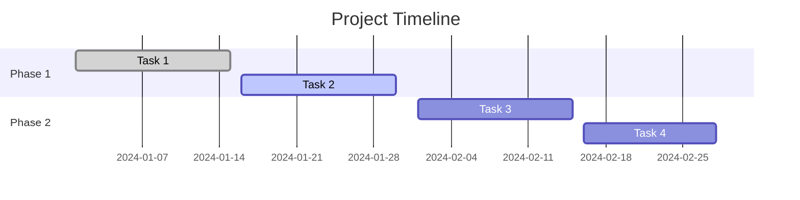

### Activity Schedule with Critical Path
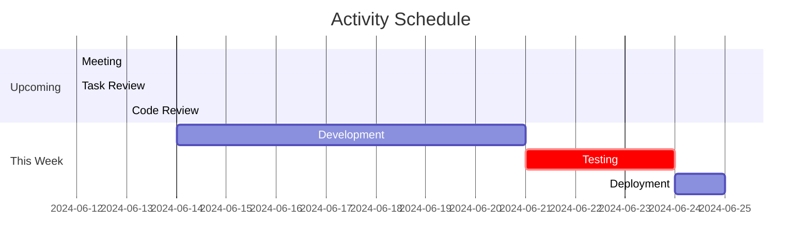

### Multi-Section Project Plan
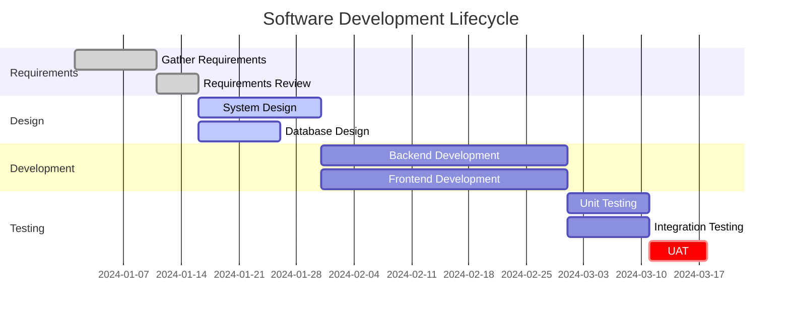

**Gantt Syntax Reference**:
- `done` - Completed task (grey)
- `active` - Currently in progress (blue)
- `crit` - Critical path task (red)
- `after taskID` - Start after another task
- Dates: `YYYY-MM-DD` or `YYYY-MM-DD, Xd` (X days duration)

---

## Flowcharts (Graph TD)

### Top-Down Decision Flow
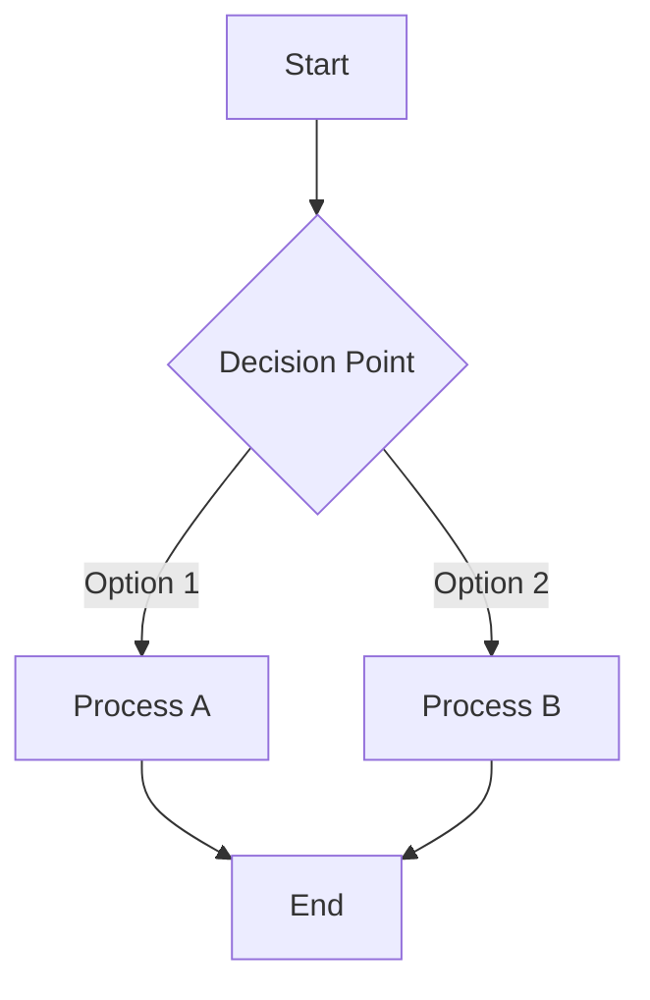

### Complex System Architecture
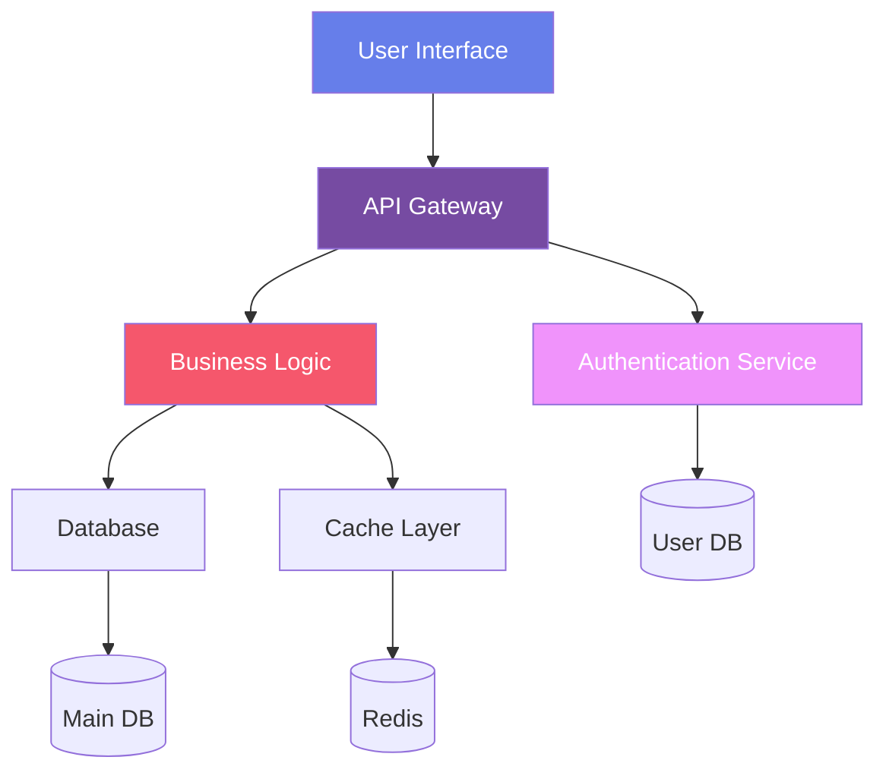

### Information Architecture Flow
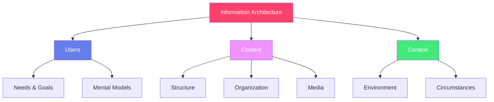

**Flowchart Syntax**:
- `graph TD` - Top to bottom
- `graph LR` - Left to right
- `[Text]` - Rectangle
- `{Text}` - Diamond (decision)
- `([Text])` - Stadium shape
- `[(Text)]` - Cylinder (database)
- `-->` - Arrow
- `-->|Label|` - Labeled arrow
- `style NodeID fill:#color,color:#textcolor` - Custom styling

---

## Sequence Diagrams

### Basic User Authentication
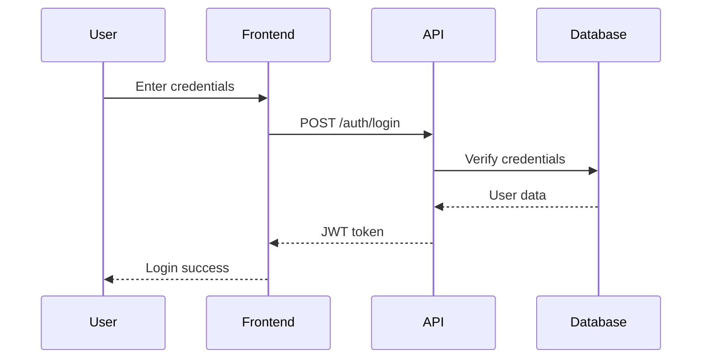

### Complex API Interaction
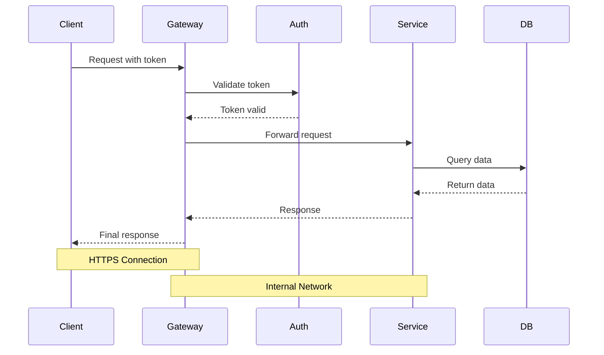

### Error Handling Flow
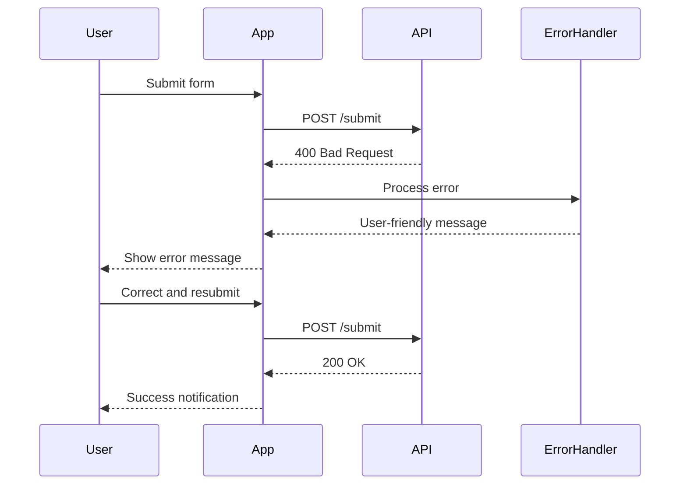

**Sequence Diagram Syntax**:
- `participant Name` - Define participants
- `->` - Solid line
- `-->` - Dotted line
- `->>` - Solid arrow
- `-->>` - Dotted arrow
- `Note over A,B: Text` - Add notes
- `activate/deactivate` - Show active periods

---

## Timeline Diagrams

### Project Milestones
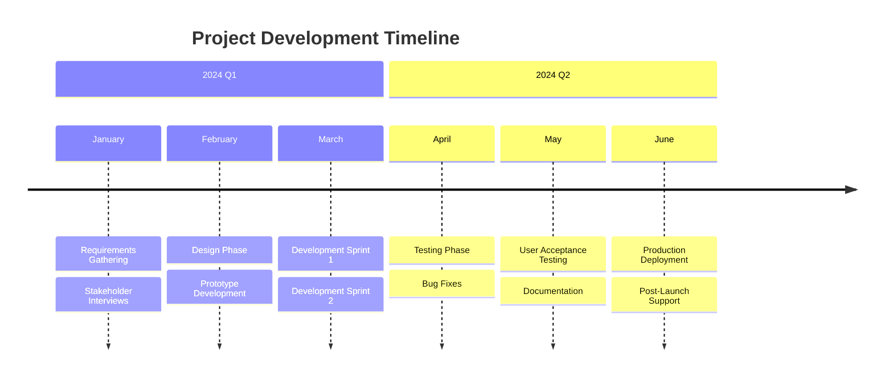

### Product Evolution
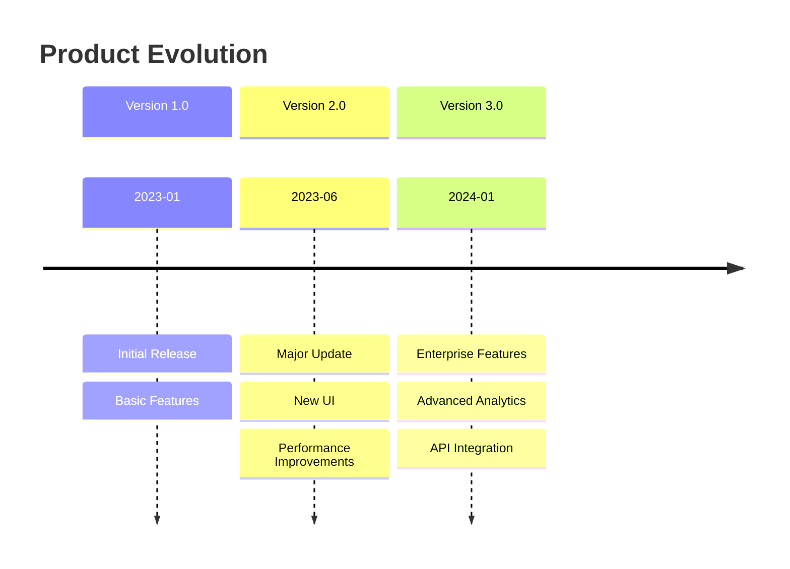

---

## Mindmaps

### Project Planning Mindmap
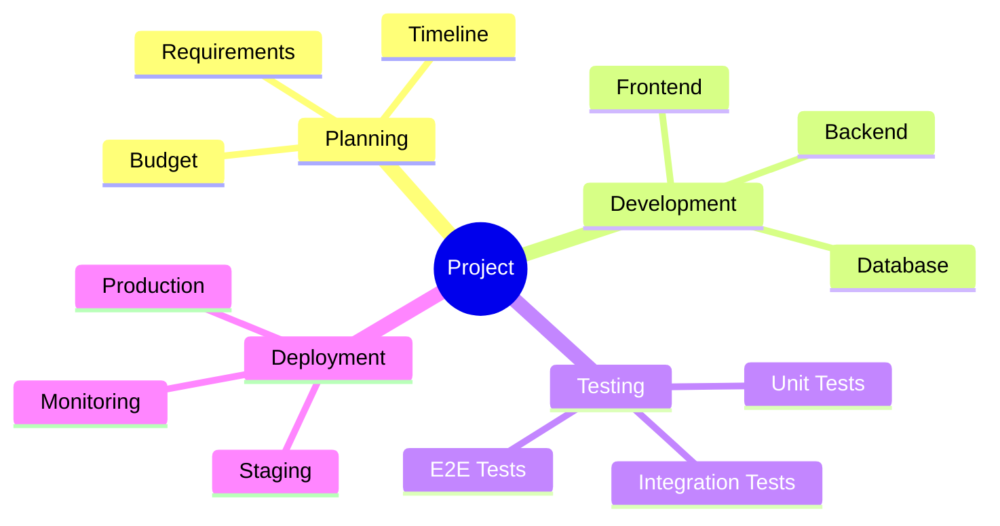

### Knowledge Organization
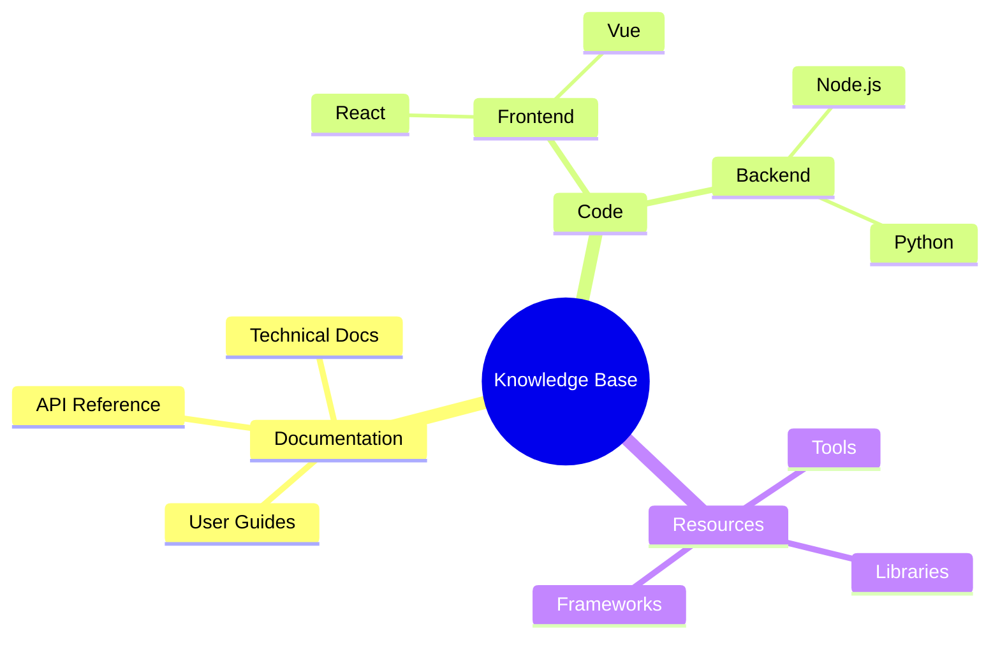

---

## Git Graphs

### Simple Git Workflow
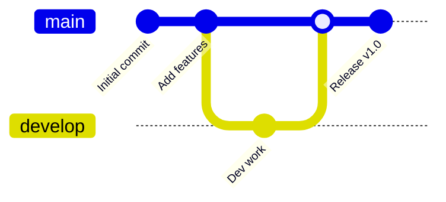

### Complex Branching Strategy
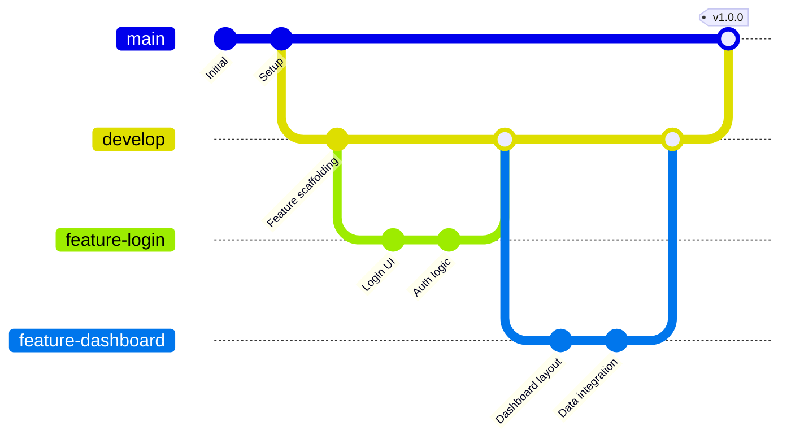

---

## Block Diagrams

### System Components (Beta Feature)
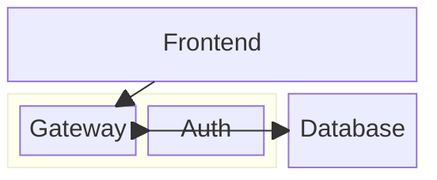

### Data Flow Architecture
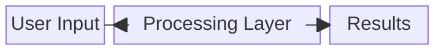

---

## Best Practices

### General Guidelines
1. **Use Descriptive IDs**: Name nodes clearly (e.g., `userAuth` instead of `n1`)
2. **Keep It Simple**: Don't overcomplicate diagrams - break complex flows into multiple diagrams
3. **Add Context**: Use notes and labels to explain non-obvious connections
4. **Consistent Styling**: Use color schemes consistently across related diagrams
5. **Test Rendering**: Always preview diagrams in your markdown renderer

### Gantt Charts
- Use `crit` for critical path items
- Group related tasks with sections
- Keep date format consistent
- Use `after` dependencies when tasks are sequential

### Flowcharts
- Use shape meanings consistently (diamond for decisions, cylinder for databases)
- Add styling to highlight important nodes
- Keep arrows flowing in one primary direction (top-down or left-right)
- Use subgraphs for complex subsystems

### Sequence Diagrams
- Order participants logically (user → frontend → backend → database)
- Use solid lines for requests, dotted for responses
- Add notes for important context
- Show error paths explicitly

### Color Schemes
```
Professional Blues: #667eea, #764ba2
Warm Gradients: #ff416c, #ff4b2b
Success Green: #11998e, #38ef7d
Cool Blues: #4facfe, #00f2fe
Pink Purple: #f093fb, #f5576c
```

---

## Mermaid Syntax Quick Reference

### Common Shapes
```
[Rectangle]
(Rounded Rectangle)
([Stadium])
{Diamond}
{{Hexagon}}
[(Database)]
((Circle))
```

### Arrow Types
```
-->  Solid line with arrow
---  Solid line without arrow
-.-> Dotted line with arrow
-.-  Dotted line without arrow
==>  Thick line with arrow
===  Thick line without arrow
```

### Styling
```
style nodeId fill:#color,stroke:#color,color:#textcolor
classDef className fill:#color,stroke:#color
class nodeId className
```

---

**Template Version**: 1.0
**Last Updated**: 2025-12-28
**Mermaid Version**: Compatible with v10+
**Source Files**: 6 Obsidian markdown templates
