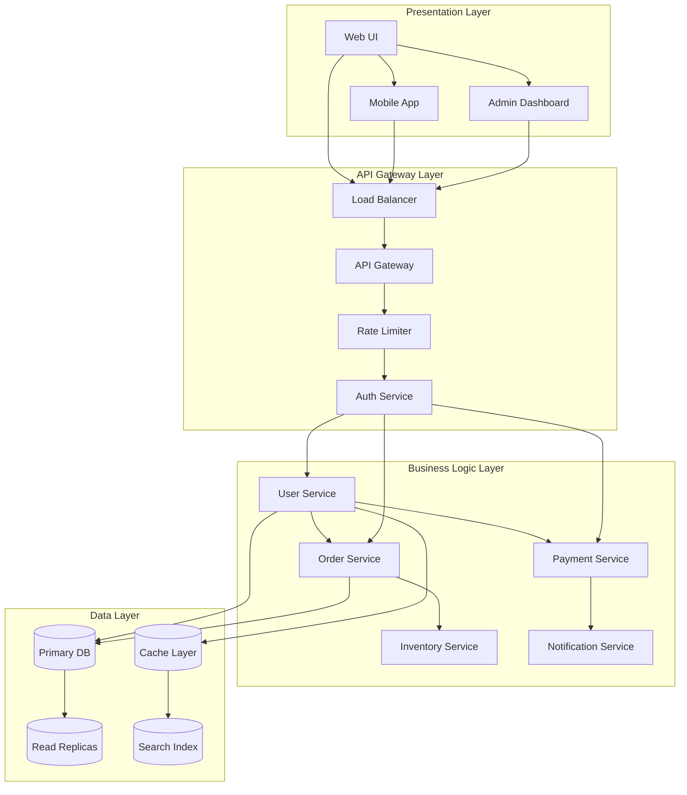
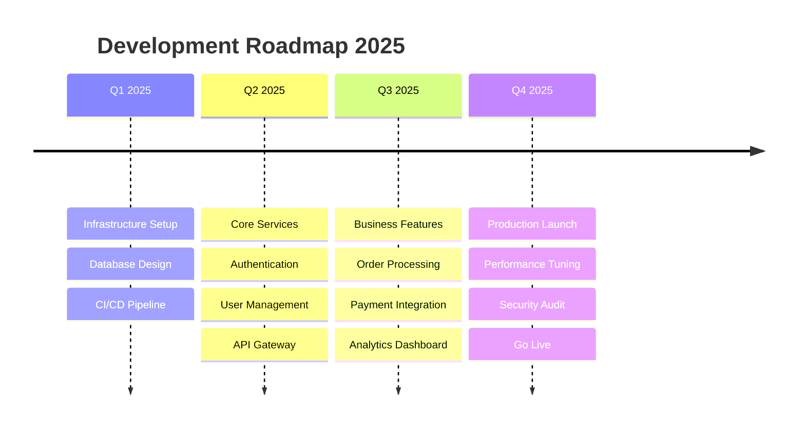
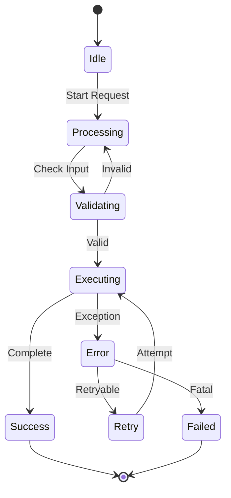
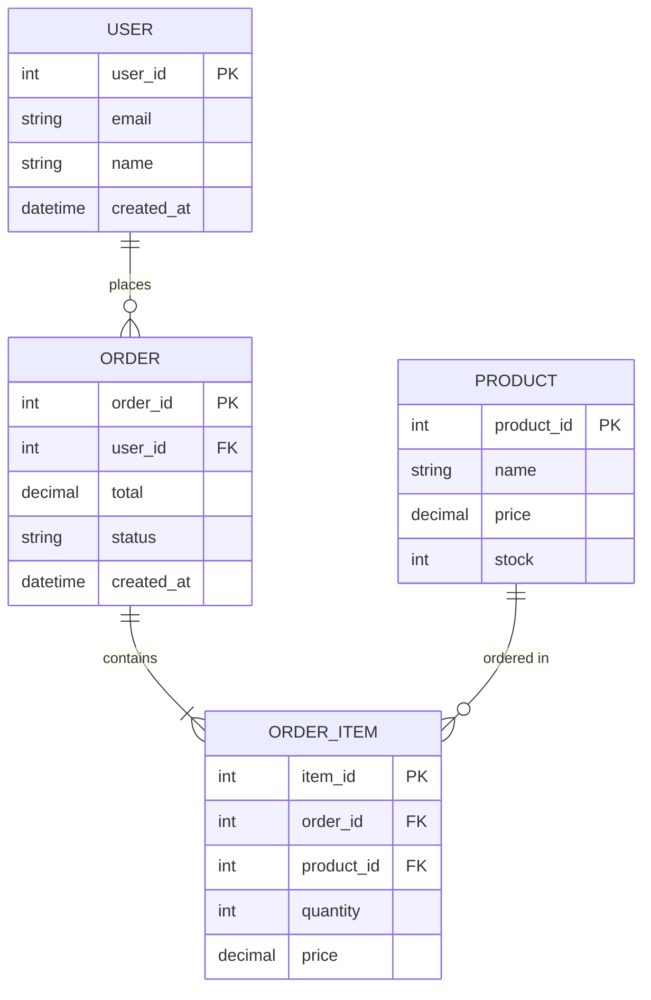
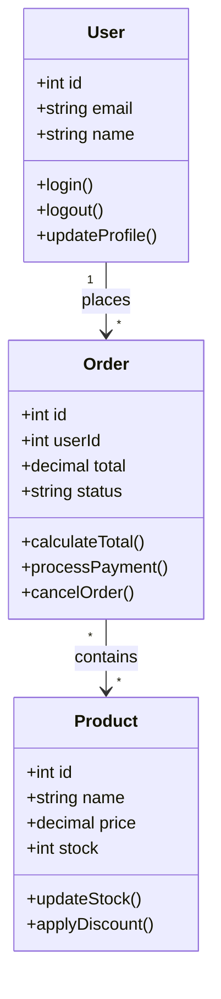
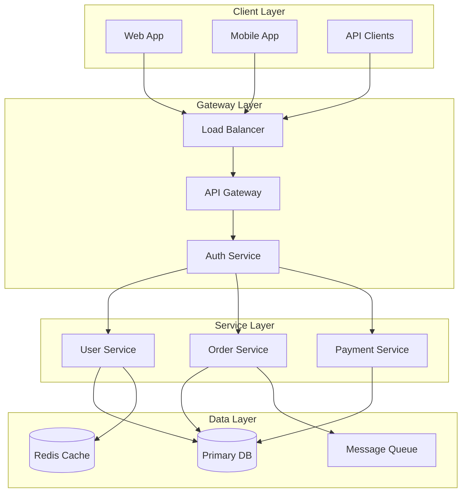
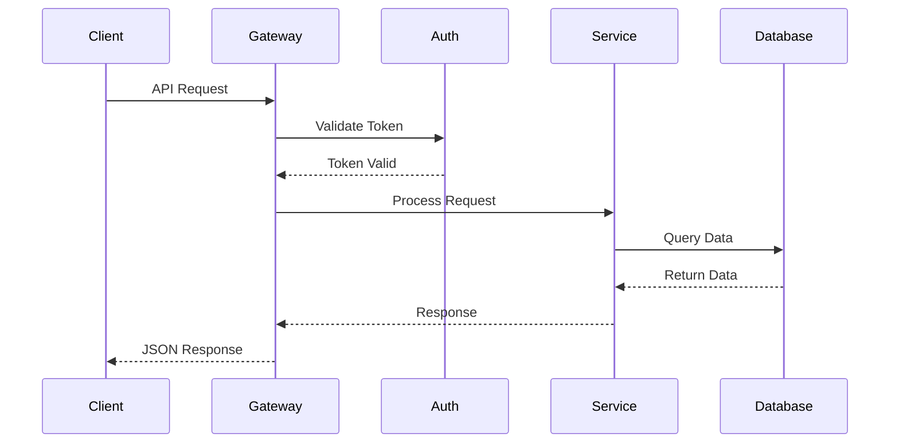

# Advanced GitHub Markdown Formatting Techniques

**Version**: 2.0 Enhanced
**Last Updated**: 2025-12-28
**Purpose**: Professional-grade formatting for technical documentation, dashboards, and system architecture

---

## Table of Contents

1. [HTML/CSS Enhanced Cards](#htmlcss-enhanced-cards)
2. [Dashboard Status Grids](#dashboard-status-grids)
3. [Animated Progress Indicators](#animated-progress-indicators)
4. [System Architecture Cards](#system-architecture-cards)
5. [Advanced Mermaid Diagrams](#advanced-mermaid-diagrams)
6. [Interactive-Style Elements](#interactive-style-elements)
7. [Multi-Column Layouts](#multi-column-layouts)
8. [Performance Metrics Dashboards](#performance-metrics-dashboards)
9. [Timeline Visualizations](#timeline-visualizations)
10. [Complete Documentation Templates](#complete-documentation-templates)

---

## HTML/CSS Enhanced Cards

### Basic System Card

```html
<div style="border: 1px solid #e0e0e0; border-radius: 8px; padding: 15px; margin: 10px 0; background-color: #f9f9f9;">
    <div style="display: flex; align-items: center; margin-bottom: 10px;">
        <div style="width: 40px; height: 40px; border-radius: 50%; background: #ddd; margin-right: 10px; display: flex; align-items: center; justify-content: center; color: #555; font-weight: bold; font-size: 16px;">
            <span style="font-family: monospace;">#</span>
        </div>
        <div>
            <h4 style="margin: 0; color: #333; font-size: 18px;">System Name</h4>
            <p style="margin: 3px 0; color: #777; font-size: 12px;">Type • Target</p>
        </div>
    </div>
    <div style="display: flex; justify-content: space-between; font-size: 14px;">
        <div>
            <small style="color: #888;">COMPLEXITY</small><br>
            <strong style="color: #333;">HIGH</strong>
        </div>
        <div>
            <small style="color: #888;">TIMELINE</small><br>
            <span style="color: #555;">2 weeks</span>
        </div>
    </div>
</div>
```

**Result**:

<div style="border: 1px solid #e0e0e0; border-radius: 8px; padding: 15px; margin: 10px 0; background-color: #f9f9f9;">
    <div style="display: flex; align-items: center; margin-bottom: 10px;">
        <div style="width: 40px; height: 40px; border-radius: 50%; background: #ddd; margin-right: 10px; display: flex; align-items: center; justify-content: center; color: #555; font-weight: bold; font-size: 16px;">
            <span style="font-family: monospace;">#</span>
        </div>
        <div>
            <h4 style="margin: 0; color: #333; font-size: 18px;">Authentication Service</h4>
            <p style="margin: 3px 0; color: #777; font-size: 12px;">Microservice • Production</p>
        </div>
    </div>
    <div style="display: flex; justify-content: space-between; font-size: 14px;">
        <div>
            <small style="color: #888;">COMPLEXITY</small><br>
            <strong style="color: #333;">HIGH</strong>
        </div>
        <div>
            <small style="color: #888;">TIMELINE</small><br>
            <span style="color: #555;">2 weeks</span>
        </div>
    </div>
</div>

### Premium Gradient Card with Progress

```html
<div style="border-radius: 22px; background: linear-gradient(120deg, #232526 0%, #414345 100%); color: #fff; margin: 24px 0; box-shadow: 0 8px 32px rgba(44,62,80,0.18); padding: 0;">
  <div style="display: flex; align-items: stretch; border-bottom: 1px solid rgba(255,255,255,0.08); padding: 0;">
    <div style="background: linear-gradient(135deg, #00c6ff 0%, #0072ff 100%); width: 90px; display: flex; flex-direction: column; align-items: center; justify-content: center; border-radius: 22px 0 0 0;">
      <span style="font-size: 48px; margin-bottom: 6px;">⚙️</span>
      <span style="font-size: 13px; font-weight: 700; letter-spacing: 1px; opacity: 0.8;">SYS</span>
    </div>
    <div style="flex: 1; padding: 24px 28px;">
      <div style="display: flex; align-items: center; gap: 12px;">
        <h2 style="margin: 0; font-size: 1.6em; font-weight: 700;">API Gateway</h2>
        <span style="background: #00c6ff; color: #fff; border-radius: 12px; padding: 2px 12px; font-size: 0.85em; font-weight: 600;">Core Service</span>
      </div>
      <div style="margin-top: 8px; display: flex; gap: 18px;">
        <span style="font-size: 1.1em; opacity: 0.7;">🚀 Status: <span style="color:#00e676;">Operational</span></span>
        <span style="font-size: 1.1em; opacity: 0.7;">⏳ ETA: <span style="color:#ffd600;">3 days</span></span>
      </div>
      <div style="margin-top: 18px; display: flex; align-items: center; gap: 12px;">
        <span style="font-size: 0.95em; opacity: 0.7;">Progress</span>
        <div style="flex:1; background: rgba(255,255,255,0.08); border-radius: 8px; height: 12px; overflow: hidden;">
          <div style="width: 75%; height: 100%; background: linear-gradient(90deg, #00e676 0%, #ffd600 100%);"></div>
        </div>
        <span style="font-size: 0.95em; font-weight: 700; color: #00e676;">75%</span>
      </div>
    </div>
  </div>
</div>
```

---

## Dashboard Status Grids

### Animated Status Grid

```html
<div style="display: grid; grid-template-columns: repeat(4, 1fr); gap: 24px; margin: 32px 0; padding: 32px 24px; background: linear-gradient(120deg, rgba(255,255,255,0.85) 60%, rgba(102,126,234,0.18) 100%); border-radius: 24px; box-shadow: 0 8px 32px rgba(102,126,234,0.12);">
  <!-- Architecture -->
  <div style="background: rgba(76, 217, 100, 0.12); border-radius: 16px; padding: 24px 12px; text-align: center; box-shadow: 0 2px 8px rgba(76,217,100,0.08); position: relative;">
    <div style="font-size: 2.2em; margin-bottom: 8px; color: #4cd964;">🏛️</div>
    <div style="font-size: 1.15em; font-weight: 700; color: #222;">Architecture</div>
    <div style="margin: 8px 0 2px 0; font-size: 1.1em; font-weight: 600; color: #4cd964;">
      <span style="vertical-align: middle; font-size: 1.2em;">🟢</span> Defined
    </div>
    <div style="font-size: 0.97em; color: #3d9970; opacity: 0.85;">Components mapped</div>
  </div>

  <!-- Dependencies -->
  <div style="background: rgba(255, 214, 10, 0.13); border-radius: 16px; padding: 24px 12px; text-align: center; box-shadow: 0 2px 8px rgba(255,214,10,0.08);">
    <div style="font-size: 2.2em; margin-bottom: 8px; color: #ffd60a;">🔗</div>
    <div style="font-size: 1.15em; font-weight: 700; color: #222;">Dependencies</div>
    <div style="margin: 8px 0 2px 0; font-size: 1.1em; font-weight: 600; color: #ffd60a;">
      <span style="vertical-align: middle; font-size: 1.2em;">🟡</span> In Progress
    </div>
    <div style="font-size: 0.97em; color: #bfa100; opacity: 0.85;">External services</div>
  </div>

  <!-- Security -->
  <div style="background: rgba(255, 82, 82, 0.13); border-radius: 16px; padding: 24px 12px; text-align: center; box-shadow: 0 2px 8px rgba(255,82,82,0.08);">
    <div style="font-size: 2.2em; margin-bottom: 8px; color: #ff5252;">🛡️</div>
    <div style="font-size: 1.15em; font-weight: 700; color: #222;">Security</div>
    <div style="margin: 8px 0 2px 0; font-size: 1.1em; font-weight: 600; color: #ff5252;">
      <span style="vertical-align: middle; font-size: 1.2em;">🔴</span> Pending
    </div>
    <div style="font-size: 0.97em; color: #c62828; opacity: 0.85;">Auth patterns</div>
  </div>

  <!-- Testing -->
  <div style="background: rgba(76, 217, 100, 0.12); border-radius: 16px; padding: 24px 12px; text-align: center; box-shadow: 0 2px 8px rgba(76,217,100,0.08);">
    <div style="font-size: 2.2em; margin-bottom: 8px; color: #4cd964;">🧪</div>
    <div style="font-size: 1.15em; font-weight: 700; color: #222;">Testing</div>
    <div style="margin: 8px 0 2px 0; font-size: 1.1em; font-weight: 600; color: #4cd964;">
      <span style="vertical-align: middle; font-size: 1.2em;">🟢</span> Complete
    </div>
    <div style="font-size: 0.97em; color: #388e3c; opacity: 0.85;">Coverage: 85%</div>
  </div>
</div>
```

### Simple Performance Metrics

```html
<div style="display: grid; grid-template-columns: repeat(auto-fit, minmax(200px, 1fr)); gap: 15px; margin: 20px 0;">
    <div style="border: 1px solid #ddd; padding: 15px; border-radius: 8px; background: #f8f9fa;">
        <h4>⚡ Response Time</h4>
        <div style="font-size: 24px; font-weight: bold; color: #28a745;">145 ms</div>
        <small>Avg API response</small>
    </div>
    <div style="border: 1px solid #ddd; padding: 15px; border-radius: 8px; background: #f8f9fa;">
        <h4>🎯 Throughput</h4>
        <div style="font-size: 24px; font-weight: bold; color: #007bff;">2.4k</div>
        <small>Requests/second</small>
    </div>
    <div style="border: 1px solid #ddd; padding: 15px; border-radius: 8px; background: #f8f9fa;">
        <h4>💾 Memory</h4>
        <div style="font-size: 24px; font-weight: bold; color: #ffc107;">68%</div>
        <small>Utilization</small>
    </div>
    <div style="border: 1px solid #ddd; padding: 15px; border-radius: 8px; background: #f8f9fa;">
        <h4>🔄 Uptime</h4>
        <div style="font-size: 24px; font-weight: bold; color: #28a745;">99.9%</div>
        <small>Last 30 days</small>
    </div>
</div>
```

---

## Animated Progress Indicators

### Progress Bar with Percentage

```html
<div style="margin: 20px 0;">
    <h4 style="margin-bottom: 10px;">🎯 Overall Progress: 65%</h4>
    <div style="background: #e0e0e0; border-radius: 8px; height: 20px; overflow: hidden; box-shadow: inset 0 2px 4px rgba(0,0,0,0.1);">
        <div style="width: 65%; height: 100%; background: linear-gradient(90deg, #00e676 0%, #00c853 100%); display: flex; align-items: center; justify-content: flex-end; padding-right: 10px; color: white; font-weight: bold; font-size: 12px;">
            65%
        </div>
    </div>
    <div style="margin-top: 10px; font-size: 14px;">
        <p><strong>✅ Completed:</strong> 2/4 phases</p>
        <p><strong>🔄 Current:</strong> Business Logic Implementation</p>
        <p><strong>⏰ Next:</strong> Testing & QA</p>
    </div>
</div>
```

### SVG Health Chart

```html
<div style="margin: 20px 0;">
    <h4>📊 System Health Trend</h4>
    <svg width="200" height="60" viewBox="0 0 200 60">
        <polyline fill="none" stroke="#00e676" stroke-width="3"
                  points="0,50 25,30 50,40 75,20 100,25 125,15 150,35 175,10 200,30"/>
        <circle cx="200" cy="30" r="4" fill="#ffd600"/>
    </svg>
    <p style="font-size: 14px; color: #00e676; margin: 5px 0;">
        <strong>Status:</strong> Healthy • Stable trend
    </p>
</div>
```

---

## Advanced Mermaid Diagrams

### Complex Architecture Diagram

````markdown

````

### Timeline with Milestones

````markdown

````

### State Machine Diagram

````markdown

````

### Entity Relationship Diagram

````markdown

````

### Class Diagram

````markdown

````

---

## Interactive-Style Elements

### Alert Boxes

```html
<!-- Success Alert -->
<div style="background: #d4edda; border-left: 5px solid #28a745; padding: 15px; border-radius: 4px; margin: 15px 0;">
    <strong style="color: #155724;">✅ System Healthy</strong><br>
    <span style="color: #155724;">All services operational</span>
</div>

<!-- Warning Alert -->
<div style="background: #fff3cd; border-left: 5px solid #ffc107; padding: 15px; border-radius: 4px; margin: 15px 0;">
    <strong style="color: #856404;">⚠️ Warning</strong><br>
    <span style="color: #856404;">API response time above 180ms threshold</span>
</div>

<!-- Error Alert -->
<div style="background: #f8d7da; border-left: 5px solid #dc3545; padding: 15px; border-radius: 4px; margin: 15px 0;">
    <strong style="color: #721c24;">🚨 Critical Error</strong><br>
    <span style="color: #721c24;">Database connection failures detected</span>
</div>

<!-- Info Alert -->
<div style="background: #d1ecf1; border-left: 5px solid #17a2b8; padding: 15px; border-radius: 4px; margin: 15px 0;">
    <strong style="color: #0c5460;">ℹ️ Information</strong><br>
    <span style="color: #0c5460;">Scheduled maintenance at 2AM UTC</span>
</div>
```

### Button-Style Links

```html
<div style="display: flex; gap: 10px; margin: 20px 0;">
    <a href="#" style="background: linear-gradient(90deg, #00e676, #00c853); color: white; text-decoration: none; padding: 10px 20px; border-radius: 8px; font-weight: bold; box-shadow: 0 2px 8px rgba(0,0,0,0.1);">
        📊 View Dashboard
    </a>
    <a href="#" style="background: linear-gradient(90deg, #ff1744, #f01440); color: white; text-decoration: none; padding: 10px 20px; border-radius: 8px; font-weight: bold; box-shadow: 0 2px 8px rgba(0,0,0,0.1);">
        🚨 Emergency Stop
    </a>
    <a href="#" style="background: linear-gradient(90deg, #0072ff, #00c6ff); color: white; text-decoration: none; padding: 10px 20px; border-radius: 8px; font-weight: bold; box-shadow: 0 2px 8px rgba(0,0,0,0.1);">
        📚 Documentation
    </a>
</div>
```

---

## Multi-Column Layouts

### Two-Column Feature List

```html
<div style="display: grid; grid-template-columns: 1fr 1fr; gap: 20px; margin: 20px 0;">
    <div>
        <h3>✨ Features</h3>
        <ul style="list-style: none; padding: 0;">
            <li>✅ Real-time analytics</li>
            <li>✅ Multi-user support</li>
            <li>✅ API integration</li>
            <li>✅ Custom dashboards</li>
        </ul>
    </div>
    <div>
        <h3>🚀 Benefits</h3>
        <ul style="list-style: none; padding: 0;">
            <li>⚡ 3x faster processing</li>
            <li>🔒 Bank-grade security</li>
            <li>📈 Scalable to millions</li>
            <li>🌐 99.9% uptime SLA</li>
        </ul>
    </div>
</div>
```

### Three-Column Stats

```html
<div style="display: grid; grid-template-columns: repeat(3, 1fr); gap: 15px; margin: 20px 0;">
    <div style="text-align: center; padding: 20px; background: #f8f9fa; border-radius: 8px;">
        <div style="font-size: 32px; font-weight: bold; color: #007bff;">10M+</div>
        <div style="color: #6c757d;">Active Users</div>
    </div>
    <div style="text-align: center; padding: 20px; background: #f8f9fa; border-radius: 8px;">
        <div style="font-size: 32px; font-weight: bold; color: #28a745;">99.9%</div>
        <div style="color: #6c757d;">Uptime</div>
    </div>
    <div style="text-align: center; padding: 20px; background: #f8f9fa; border-radius: 8px;">
        <div style="font-size: 32px; font-weight: bold; color: #dc3545;">24/7</div>
        <div style="color: #6c757d;">Support</div>
    </div>
</div>
```

---

## Performance Metrics Dashboards

### Complete Metrics Dashboard

```html
<div style="background: linear-gradient(135deg, #667eea 0%, #764ba2 100%); color: white; padding: 30px; border-radius: 16px; margin: 20px 0; box-shadow: 0 10px 40px rgba(102,126,234,0.3);">
    <h2 style="margin: 0 0 20px 0;">📊 System Performance Overview</h2>

    <div style="display: grid; grid-template-columns: repeat(auto-fit, minmax(150px, 1fr)); gap: 15px;">
        <div style="background: rgba(255,255,255,0.15); padding: 20px; border-radius: 12px; backdrop-filter: blur(10px);">
            <div style="opacity: 0.8; font-size: 12px; margin-bottom: 5px;">RESPONSE TIME</div>
            <div style="font-size: 28px; font-weight: bold;">145ms</div>
            <div style="opacity: 0.7; font-size: 12px;">↓ 12% from last week</div>
        </div>

        <div style="background: rgba(255,255,255,0.15); padding: 20px; border-radius: 12px; backdrop-filter: blur(10px);">
            <div style="opacity: 0.8; font-size: 12px; margin-bottom: 5px;">THROUGHPUT</div>
            <div style="font-size: 28px; font-weight: bold;">2.4k</div>
            <div style="opacity: 0.7; font-size: 12px;">req/sec average</div>
        </div>

        <div style="background: rgba(255,255,255,0.15); padding: 20px; border-radius: 12px; backdrop-filter: blur(10px);">
            <div style="opacity: 0.8; font-size: 12px; margin-bottom: 5px;">ERROR RATE</div>
            <div style="font-size: 28px; font-weight: bold;">0.3%</div>
            <div style="opacity: 0.7; font-size: 12px;">Well below 1% target</div>
        </div>

        <div style="background: rgba(255,255,255,0.15); padding: 20px; border-radius: 12px; backdrop-filter: blur(10px);">
            <div style="opacity: 0.8; font-size: 12px; margin-bottom: 5px;">UPTIME</div>
            <div style="font-size: 28px; font-weight: bold;">99.9%</div>
            <div style="opacity: 0.7; font-size: 12px;">30-day average</div>
        </div>
    </div>
</div>
```

---

## Complete Documentation Templates

### System Architecture Documentation

````markdown
# System Architecture Overview

## 🏗️ High-Level Architecture



## 📊 System Health Dashboard

<div style="display: grid; grid-template-columns: repeat(4, 1fr); gap: 15px; margin: 20px 0;">
    <div style="background: rgba(76, 217, 100, 0.12); border-radius: 12px; padding: 20px; text-align: center;">
        <div style="font-size: 2em; margin-bottom: 10px;">🏛️</div>
        <div style="font-weight: 700; font-size: 1.1em;">Architecture</div>
        <div style="margin: 8px 0; font-weight: 600; color: #4cd964;">🟢 Defined</div>
        <div style="font-size: 0.9em; color: #3d9970;">Components mapped</div>
    </div>

    <div style="background: rgba(255, 214, 10, 0.13); border-radius: 12px; padding: 20px; text-align: center;">
        <div style="font-size: 2em; margin-bottom: 10px;">🔗</div>
        <div style="font-weight: 700; font-size: 1.1em;">Dependencies</div>
        <div style="margin: 8px 0; font-weight: 600; color: #ffd60a;">🟡 In Progress</div>
        <div style="font-size: 0.9em; color: #bfa100;">External services</div>
    </div>

    <div style="background: rgba(76, 217, 100, 0.12); border-radius: 12px; padding: 20px; text-align: center;">
        <div style="font-size: 2em; margin-bottom: 10px;">🛡️</div>
        <div style="font-weight: 700; font-size: 1.1em;">Security</div>
        <div style="margin: 8px 0; font-weight: 600; color: #4cd964;">🟢 Implemented</div>
        <div style="font-size: 0.9em; color: #3d9970;">OAuth2 + JWT</div>
    </div>

    <div style="background: rgba(76, 217, 100, 0.12); border-radius: 12px; padding: 20px; text-align: center;">
        <div style="font-size: 2em; margin-bottom: 10px;">🧪</div>
        <div style="font-weight: 700; font-size: 1.1em;">Testing</div>
        <div style="margin: 8px 0; font-weight: 600; color: #4cd964;">🟢 Complete</div>
        <div style="font-size: 0.9em; color: #388e3c;">Coverage: 89%</div>
    </div>
</div>

## 🔄 Data Flow Sequence



## 📈 Implementation Progress

<div style="margin: 20px 0;">
    <h4>Overall Completion: 75%</h4>
    <div style="background: #e0e0e0; border-radius: 8px; height: 20px; overflow: hidden;">
        <div style="width: 75%; height: 100%; background: linear-gradient(90deg, #00e676 0%, #00c853 100%); display: flex; align-items: center; justify-content: flex-end; padding-right: 10px; color: white; font-weight: bold; font-size: 12px;">
            75%
        </div>
    </div>
</div>

### Checklist

- [x] Infrastructure setup
- [x] Authentication service
- [x] User management API
- [x] Database schema
- [ ] Payment integration (In Progress)
- [ ] Analytics dashboard
- [ ] Performance optimization
````

---

## Best Practices

### When to Use HTML/CSS

✅ **Use HTML/CSS for**:
- Dashboard-style documentation
- Status indicators and metrics
- System architecture overviews
- Project management documentation
- Technical specifications

❌ **Avoid HTML/CSS for**:
- Simple text documentation
- Code-heavy documentation
- Frequently edited content
- Collaborative editing scenarios

### GitHub Markdown Limitations

**Note**: HTML/CSS support varies by platform:
- **GitHub.com**: Limited HTML, no `<script>`, restricted CSS
- **GitHub Pages**: Full HTML/CSS support
- **VS Code Preview**: Full support
- **Obsidian**: Full support with plugins

### Accessibility Considerations

- Always include alt text for visual elements
- Use semantic HTML when possible
- Ensure sufficient color contrast
- Provide text alternatives for visual information
- Test with screen readers when creating complex layouts

---

## Quick Reference

### Color Palette

```css
/* Status Colors */
--success: #4cd964;     /* Green */
--warning: #ffd60a;     /* Yellow */
--error: #ff5252;       /* Red */
--info: #00c6ff;        /* Blue */

/* Gradients */
--gradient-primary: linear-gradient(135deg, #667eea 0%, #764ba2 100%);
--gradient-success: linear-gradient(90deg, #00e676 0%, #00c853 100%);
--gradient-dark: linear-gradient(120deg, #232526 0%, #414345 100%);
```

### Common Emojis

```
🏛️ Architecture    🔗 Dependencies    🛡️ Security
🧪 Testing         📊 Analytics       🚀 Performance
⚡ Speed           💾 Storage         🔄 Process
✅ Success         ⚠️ Warning         🔴 Error
📈 Growth          📉 Decline         🎯 Target
```

---

**Created**: 2025-12-28
**Enhanced from**: Markdown_Template_Pro.md
**Compatibility**: GitHub, GitHub Pages, Obsidian, VS Code
