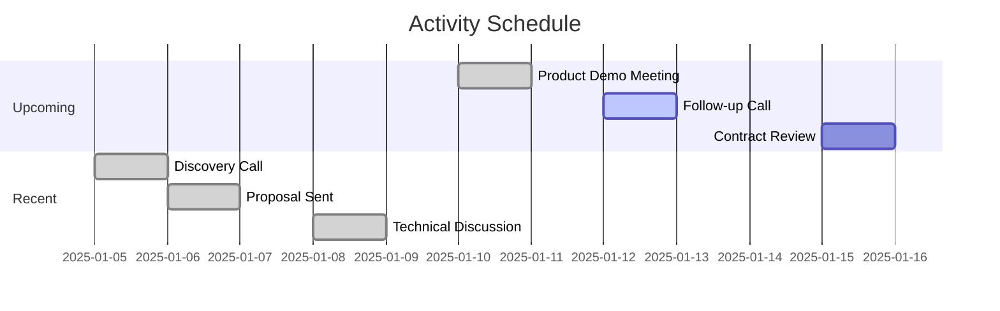
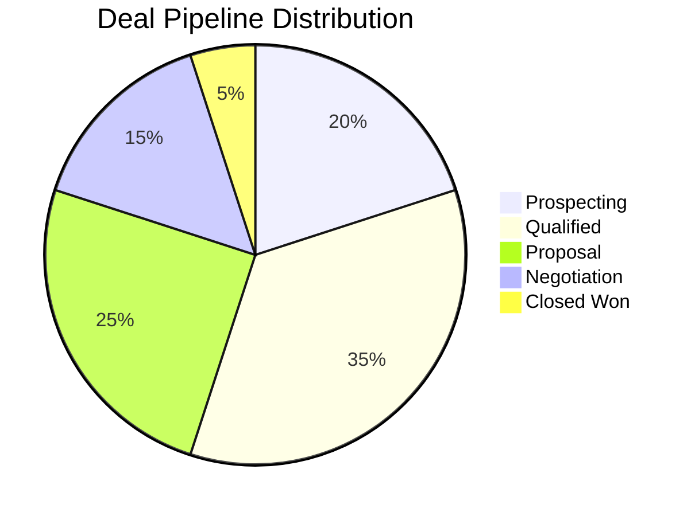
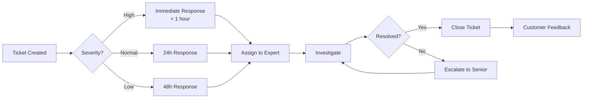
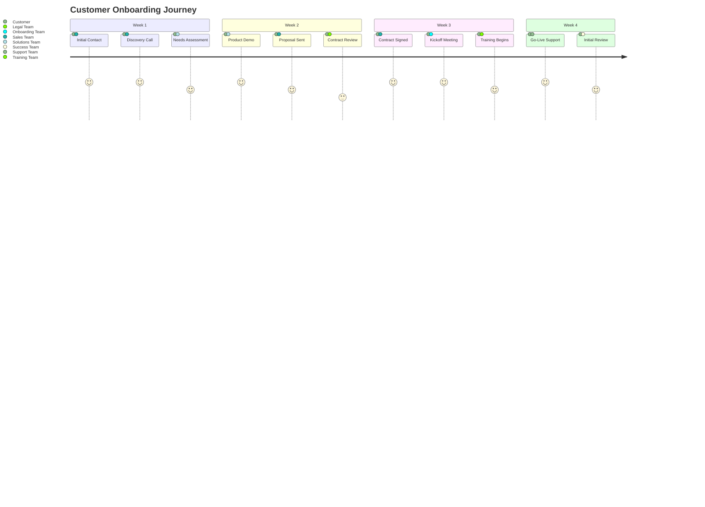

  <h1 style="margin: 0 0 20px 0; font-size: 3em; font-weight: 800; text-shadow: 2px 2px 4px rgba(0,0,0,0.2);">🎯 CRM Dashboard</h1>
  
Professional Contact Management · Deal Pipeline · Performance Analytics

  

    

      
360°

      
Contact View

    

    

      
Real-Time

      
Analytics

    

    

      
Pro

      
Template

    

  

---

## 📑 Quick Navigation

  <a href="#contact-overview" style="text-decoration: none;">
    

      
👤

      
Contact Overview

    

  </a>

  <a href="#activities" style="text-decoration: none;">
    

      
📅

      
Activities

    

  </a>

  <a href="#deals" style="text-decoration: none;">
    

      
💼

      
Deals

    

  </a>

  <a href="#tickets" style="text-decoration: none;">
    

      
🎫

      
Support Tickets

    

  </a>

  <a href="#playbooks" style="text-decoration: none;">
    

      
📋

      
Playbooks

    

  </a>

  <a href="#metrics" style="text-decoration: none;">
    

      
📊

      
Performance Metrics

    

  </a>

---

## 📈 Project Overview

<table style="width: 100%; border-collapse: collapse; box-shadow: 0 4px 15px rgba(0,0,0,0.1); border-radius: 10px; overflow: hidden;">
  <thead>
    <tr style="background: linear-gradient(135deg, #f59e0b 0%, #d97706 100%); color: white;">
      <th style="padding: 15px; text-align: left; font-weight: 600;">Phase</th>
      <th style="padding: 15px; text-align: center; font-weight: 600;">Status</th>
      <th style="padding: 15px; text-align: right; font-weight: 600;">Due Date</th>
    </tr>
  </thead>
  <tbody>
    <tr style="background: #fff7ed;">
      <td style="padding: 12px; border-bottom: 1px solid #fed7aa; font-weight: 600;">Planning</td>
      <td style="padding: 12px; text-align: center; border-bottom: 1px solid #fed7aa;">
        Complete
      </td>
      <td style="padding: 12px; text-align: right; border-bottom: 1px solid #fed7aa; color: #6b7280;">[DATE]</td>
    </tr>
    <tr style="background: white;">
      <td style="padding: 12px; border-bottom: 1px solid #fed7aa; font-weight: 600;">Development</td>
      <td style="padding: 12px; text-align: center; border-bottom: 1px solid #fed7aa;">
        In Progress
      </td>
      <td style="padding: 12px; text-align: right; border-bottom: 1px solid #fed7aa; color: #6b7280;">[DATE]</td>
    </tr>
    <tr style="background: #fff7ed;">
      <td style="padding: 12px; font-weight: 600;">Testing</td>
      <td style="padding: 12px; text-align: center;">
        Not Started
      </td>
      <td style="padding: 12px; text-align: right; color: #6b7280;">[DATE]</td>
    </tr>
  </tbody>
</table>

  <strong style="color: #d97706;">Overall Progress:</strong>
  

    

  

  
65% Complete

---

## 👤 Contact Overview

  

  

    Active
    VIP
  

  <h2 style="margin: 0 0 20px 0; color: #d97706; font-size: 2em;">[CONTACT_NAME]</h2>

  

    

      
📧 Email

      
[EMAIL]

    

    

      
📱 Phone

      
[PHONE]

    

    

      
👤 Owner

      
[OWNER]

    

    

      
🕐 Last Contacted

      
[DATE]

    

    

      
🎯 Lifecycle Stage

      
[STAGE]

    

    

      
✨ Lead Status

      
[STATUS]

    

  

  

    
📊 Account Snapshot

    

      

        
Segment

        
[SEGMENT]

      

      

        
ARR

        
$[ARR]

      

      

        
Health Score

        
[HEALTH]

      

    

  

---

## 📅 Activities & Timeline

  <h3 style="margin: 0 0 20px 0; color: #059669; display: flex; align-items: center; gap: 10px;">
    🔜 Upcoming Activities
  </h3>

  

    

      
📞 Meeting

      High Priority
    

    
[SUBJECT]

    
📅 [DATE]

  

  

    

      
✅ Task

      [STATUS]
    

    
[TASK]

    
📅 [DATE]

  

  <h3 style="margin: 0 0 20px 0; color: #2563eb; display: flex; align-items: center; gap: 10px;">
    📝 Recent Activity
  </h3>

  

    

      
📞 Call

      Completed
    

    
[DETAILS]

    
📅 [DATE]

  

  

    

      
📧 Email

      [STATUS]
    

    
[DETAILS]

    
📅 [DATE]

  

### 📋 Contact Notes

  

    

      

        
📧 Email

        
[EMAIL]

      

      

        
📱 Phone

        
[PHONE]

      

      

        
👤 Owner

        
[OWNER]

      

      

        
🎯 Stage

        
[STAGE]

      

      

        
✨ Status

        
[STATUS]

      

    

  

### 📅 Calendar View

### 🔍 Smart Search

  
🔎 Search Query

  <code style="background: #1f2937; color: #10b981; padding: 10px 15px; border-radius: 8px; display: block; font-family: 'Courier New', monospace;">
    line:(contact)
  </code>

---

## 📊 Performance Metrics

<table style="width: 100%; border-collapse: collapse; box-shadow: 0 4px 15px rgba(0,0,0,0.1); border-radius: 10px; overflow: hidden;">
  <thead>
    <tr style="background: linear-gradient(135deg, #f59e0b 0%, #d97706 100%); color: white;">
      <th style="padding: 15px; text-align: left; font-weight: 600;">Metric</th>
      <th style="padding: 15px; text-align: center; font-weight: 600;">Value</th>
      <th style="padding: 15px; text-align: right; font-weight: 600;">Trend</th>
    </tr>
  </thead>
  <tbody>
    <tr style="background: #fff7ed;">
      <td style="padding: 12px; border-bottom: 1px solid #fed7aa; font-weight: 600;">📞 Meetings</td>
      <td style="padding: 12px; text-align: center; border-bottom: 1px solid #fed7aa; color: #f59e0b; font-weight: 700; font-size: 1.2em;">[NUM]</td>
      <td style="padding: 12px; text-align: right; border-bottom: 1px solid #fed7aa;">
        ↗ +15%
      </td>
    </tr>
    <tr style="background: white;">
      <td style="padding: 12px; border-bottom: 1px solid #fed7aa; font-weight: 600;">✅ Tasks Completed</td>
      <td style="padding: 12px; text-align: center; border-bottom: 1px solid #fed7aa; color: #f59e0b; font-weight: 700; font-size: 1.2em;">[NUM]</td>
      <td style="padding: 12px; text-align: right; border-bottom: 1px solid #fed7aa;">
        ↗ +22%
      </td>
    </tr>
    <tr style="background: #fff7ed;">
      <td style="padding: 12px; border-bottom: 1px solid #fed7aa; font-weight: 600;">📞 Calls Made</td>
      <td style="padding: 12px; text-align: center; border-bottom: 1px solid #fed7aa; color: #f59e0b; font-weight: 700; font-size: 1.2em;">[NUM]</td>
      <td style="padding: 12px; text-align: right; border-bottom: 1px solid #fed7aa;">
        ↘ -5%
      </td>
    </tr>
    <tr style="background: white;">
      <td style="padding: 12px; border-bottom: 1px solid #fed7aa; font-weight: 600;">📧 Emails Sent</td>
      <td style="padding: 12px; text-align: center; border-bottom: 1px solid #fed7aa; color: #f59e0b; font-weight: 700; font-size: 1.2em;">[NUM]</td>
      <td style="padding: 12px; text-align: right; border-bottom: 1px solid #fed7aa;">
        ↗ +18%
      </td>
    </tr>
    <tr style="background: #fff7ed;">
      <td style="padding: 12px; border-bottom: 1px solid #fed7aa; font-weight: 600;">💬 Response Rate</td>
      <td style="padding: 12px; text-align: center; border-bottom: 1px solid #fed7aa; color: #10b981; font-weight: 700; font-size: 1.2em;">[PERCENT]%</td>
      <td style="padding: 12px; text-align: right; border-bottom: 1px solid #fed7aa;">
        ↗ +12%
      </td>
    </tr>
    <tr style="background: white;">
      <td style="padding: 12px; font-weight: 600;">🎯 Engagement Score</td>
      <td style="padding: 12px; text-align: center; color: #3b82f6; font-weight: 700; font-size: 1.2em;">[SCORE]/10</td>
      <td style="padding: 12px; text-align: right;">
        ↗ +0.8
      </td>
    </tr>
  </tbody>
</table>

  

    
92%

    
Email Open Rate

  

  

    
8.5

    
Customer Satisfaction

  

  

    
45min

    
Avg Response Time

  

### ⚡ Quick Actions

  <button style="background: linear-gradient(135deg, #3b82f6 0%, #2563eb 100%); color: white; border: none; padding: 18px; border-radius: 12px; font-weight: 700; font-size: 1.1em; cursor: pointer; box-shadow: 0 4px 15px rgba(59, 130, 246, 0.3); transition: transform 0.2s;">
    📞 Call Contact
  </button>
  <button style="background: linear-gradient(135deg, #10b981 0%, #059669 100%); color: white; border: none; padding: 18px; border-radius: 12px; font-weight: 700; font-size: 1.1em; cursor: pointer; box-shadow: 0 4px 15px rgba(16, 185, 129, 0.3); transition: transform 0.2s;">
    📧 Send Email
  </button>
  <button style="background: linear-gradient(135deg, #f59e0b 0%, #d97706 100%); color: white; border: none; padding: 18px; border-radius: 12px; font-weight: 700; font-size: 1.1em; cursor: pointer; box-shadow: 0 4px 15px rgba(245, 158, 11, 0.3); transition: transform 0.2s;">
    📅 Schedule Meeting
  </button>
  <button style="background: linear-gradient(135deg, #8b5cf6 0%, #7c3aed 100%); color: white; border: none; padding: 18px; border-radius: 12px; font-weight: 700; font-size: 1.1em; cursor: pointer; box-shadow: 0 4px 15px rgba(139, 92, 246, 0.3); transition: transform 0.2s;">
    📝 Log Activity
  </button>
  <button style="background: linear-gradient(135deg, #ec4899 0%, #db2777 100%); color: white; border: none; padding: 18px; border-radius: 12px; font-weight: 700; font-size: 1.1em; cursor: pointer; box-shadow: 0 4px 15px rgba(236, 72, 153, 0.3); transition: transform 0.2s;">
    📊 View Reports
  </button>
  <button style="background: linear-gradient(135deg, #06b6d4 0%, #0891b2 100%); color: white; border: none; padding: 18px; border-radius: 12px; font-weight: 700; font-size: 1.1em; cursor: pointer; box-shadow: 0 4px 15px rgba(6, 182, 212, 0.3); transition: transform 0.2s;">
    🔔 Set Reminder
  </button>

---

## 💼 Deal Pipeline

<table style="width: 100%; border-collapse: collapse; box-shadow: 0 4px 15px rgba(0,0,0,0.1); border-radius: 10px; overflow: hidden;">
  <thead>
    <tr style="background: linear-gradient(135deg, #f59e0b 0%, #d97706 100%); color: white;">
      <th style="padding: 15px; text-align: left; font-weight: 600;">Deal Name</th>
      <th style="padding: 15px; text-align: center; font-weight: 600;">Value</th>
      <th style="padding: 15px; text-align: center; font-weight: 600;">Stage</th>
      <th style="padding: 15px; text-align: center; font-weight: 600;">Close Date</th>
      <th style="padding: 15px; text-align: right; font-weight: 600;">Probability</th>
    </tr>
  </thead>
  <tbody>
    <tr style="background: #fff7ed;">
      <td style="padding: 12px; border-bottom: 1px solid #fed7aa; font-weight: 600;">[DEAL_1]</td>
      <td style="padding: 12px; text-align: center; border-bottom: 1px solid #fed7aa; color: #10b981; font-weight: 700;">$[AMOUNT]</td>
      <td style="padding: 12px; text-align: center; border-bottom: 1px solid #fed7aa;">
        [STAGE]
      </td>
      <td style="padding: 12px; text-align: center; border-bottom: 1px solid #fed7aa; color: #6b7280;">[DATE]</td>
      <td style="padding: 12px; text-align: right; border-bottom: 1px solid #fed7aa;">
        [PERCENT]%
      </td>
    </tr>
    <tr style="background: white;">
      <td style="padding: 12px; font-weight: 600;">[DEAL_2]</td>
      <td style="padding: 12px; text-align: center; color: #10b981; font-weight: 700;">$[AMOUNT]</td>
      <td style="padding: 12px; text-align: center;">
        [STAGE]
      </td>
      <td style="padding: 12px; text-align: center; color: #6b7280;">[DATE]</td>
      <td style="padding: 12px; text-align: right;">
        [PERCENT]%
      </td>
    </tr>
  </tbody>
</table>

  <h4 style="margin: 0 0 20px 0; color: #d97706; text-align: center; font-size: 1.3em;">📊 Pipeline by Stage</h4>

  

    

      
20%

      
Prospecting

    

    

      
35%

      
Qualified

    

    

      
25%

      
Proposal

    

    

      
15%

      
Negotiation

    

    

      
5%

      
Closed Won

    

  

---

## 🎫 Support Tickets

  

    <strong style="color: #dc2626; font-size: 1.2em;">🔴 High Priority</strong>
    URGENT
  

  

    
[ISSUE]

    
Created: [DATE]

    

      Assigned to:
      [OWNER]
    

  

  

    <strong style="color: #d97706; font-size: 1.2em;">🟡 Normal Priority</strong>
    OPEN
  

  

    
[ISSUE]

    
Created: [DATE]

    

      Assigned to:
      [OWNER]
    

  

  

    <strong style="color: #059669; font-size: 1.2em;">🟢 Low Priority</strong>
    RESOLVED
  

  

    
[ISSUE]

    
Created: [DATE]

    

      Resolved by:
      [OWNER]
    

  

### 🔄 Ticket Workflow

---

## 📋 Playbooks & Journey

  
📌 Current Stage: [STAGE_NAME]

  

    
✅ Completed Steps

    

      
✓ [STEP]

      
✓ [STEP]

      
✓ [STEP]

    

  

  

    
🎯 Next Steps

    

      

        <strong>[STEP]</strong>
        
Due: [DATE]

      

      

        <strong>[STEP]</strong>
        
Owner: [OWNER]

      

    

  

### 🗺️ Customer Journey Map

  <strong style="color: #d97706;">Journey Progress:</strong>
  

    

  

  

    Week 1
    Week 2
    Week 3
    Week 4 (Current)
  

---

## 🏷️ Contact Tags

  
    #HighValue
  
  
    #Champion
  
  
    #ActiveDeal
  
  
    #DecisionMaker
  
  
    #Influencer
  
  
    #Enterprise
  

---

## 💡 Key Insights

  
✨

  
Engagement Trend

  
Contact shows 22% increase in engagement over the last 30 days with consistent email opens and meeting attendance.

  
🎯

  
Deal Velocity

  
Active deals progressing 35% faster than average, indicating strong buying signals and decision-making momentum.

  
💎

  
Revenue Opportunity

  
Total pipeline value of $[AMOUNT] across 3 active deals with 75% weighted probability for Q1 close.

---

  <h2 style="margin: 0 0 20px 0; font-size: 2em;">🎉 CRM Dashboard Ready!</h2>
  
Professional contact management with comprehensive analytics and pipeline tracking

  

    

      
360°

      
Contact View

    

    

      
Live

      
Analytics

    

    

      
Pro

      
Template

    

  

---

  <strong>CRM Dashboard Template</strong> · Professional Edition · Orange/Amber Theme 
  Created: 2025-12-28 · Version 2.0 · Enhanced with Glassmorphism & Gradients

