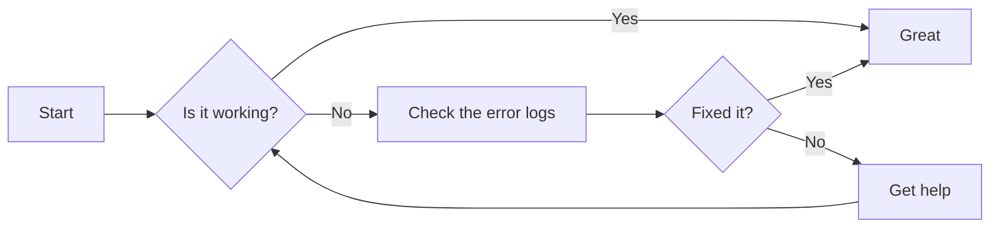
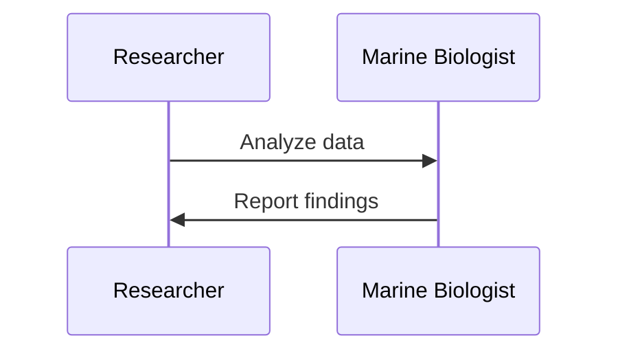
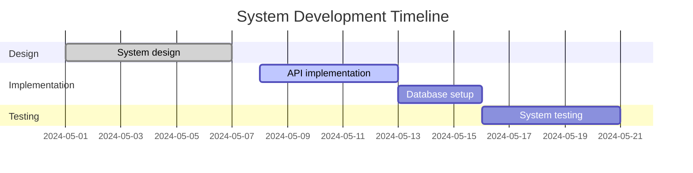

<!-- ===================================================================== -->
<!-- ENHANCED CRM DASHBOARD - Professional Business Intelligence Design    -->
<!-- Theme: Blue/Teal Gradient (#2563eb to #06b6d4)                        -->
<!-- ===================================================================== -->

<div style="background: linear-gradient(135deg, #2563eb 0%, #06b6d4 100%); padding: 60px 40px; border-radius: 20px; color: white; text-align: center; margin: 40px 0; box-shadow: 0 20px 60px rgba(37, 99, 235, 0.4);">
  <h1 style="margin: 0 0 20px 0; font-size: 3em; font-weight: 800; text-shadow: 2px 2px 4px rgba(0,0,0,0.2);">📊 CRM Dashboard</h1>
  <p style="font-size: 1.3em; margin: 0 0 30px 0; opacity: 0.95;">Customer Relationship Management · Sales Pipeline · Performance Analytics</p>

  <div style="display: inline-flex; gap: 20px; flex-wrap: wrap; justify-content: center;">
    <div style="background: rgba(255,255,255,0.2); backdrop-filter: blur(10px); padding: 15px 30px; border-radius: 12px; border: 1px solid rgba(255,255,255,0.3);">
      <div style="font-size: 2em; font-weight: 700;">360°</div>
      <div style="font-size: 0.9em; opacity: 0.9;">Customer View</div>
    </div>
    <div style="background: rgba(255,255,255,0.2); backdrop-filter: blur(10px); padding: 15px 30px; border-radius: 12px; border: 1px solid rgba(255,255,255,0.3);">
      <div style="font-size: 2em; font-weight: 700;">Real-Time</div>
      <div style="font-size: 0.9em; opacity: 0.9;">Analytics</div>
    </div>
    <div style="background: rgba(255,255,255,0.2); backdrop-filter: blur(10px); padding: 15px 30px; border-radius: 12px; border: 1px solid rgba(255,255,255,0.3);">
      <div style="font-size: 2em; font-weight: 700;">Smart</div>
      <div style="font-size: 0.9em; opacity: 0.9;">Insights</div>
    </div>
  </div>
</div>

---

## 🎯 Quick Navigation

<div style="display: grid; grid-template-columns: repeat(auto-fit, minmax(220px, 1fr)); gap: 20px; margin: 30px 0;">
  <a href="#contact-overview" style="text-decoration: none;">
    <div style="background: linear-gradient(135deg, #3b82f6 0%, #2563eb 100%); padding: 25px; border-radius: 12px; color: white; text-align: center; transition: transform 0.3s; box-shadow: 0 10px 30px rgba(59, 130, 246, 0.3);">
      <div style="font-size: 2.5em; margin-bottom: 10px;">📇</div>
      <div style="font-size: 1.1em; font-weight: 600;">Contact Overview</div>
      <div style="font-size: 0.85em; opacity: 0.9; margin-top: 8px;">Customer Details</div>
    </div>
  </a>

  <a href="#activities" style="text-decoration: none;">
    <div style="background: linear-gradient(135deg, #06b6d4 0%, #0891b2 100%); padding: 25px; border-radius: 12px; color: white; text-align: center; transition: transform 0.3s; box-shadow: 0 10px 30px rgba(6, 182, 212, 0.3);">
      <div style="font-size: 2.5em; margin-bottom: 10px;">📋</div>
      <div style="font-size: 1.1em; font-weight: 600;">Activities</div>
      <div style="font-size: 0.85em; opacity: 0.9; margin-top: 8px;">Timeline & Tasks</div>
    </div>
  </a>

  <a href="#performance-metrics" style="text-decoration: none;">
    <div style="background: linear-gradient(135deg, #10b981 0%, #059669 100%); padding: 25px; border-radius: 12px; color: white; text-align: center; transition: transform 0.3s; box-shadow: 0 10px 30px rgba(16, 185, 129, 0.3);">
      <div style="font-size: 2.5em; margin-bottom: 10px;">📊</div>
      <div style="font-size: 1.1em; font-weight: 600;">Performance</div>
      <div style="font-size: 0.85em; opacity: 0.9; margin-top: 8px;">Metrics & KPIs</div>
    </div>
  </a>

  <a href="#calendar-view" style="text-decoration: none;">
    <div style="background: linear-gradient(135deg, #8b5cf6 0%, #7c3aed 100%); padding: 25px; border-radius: 12px; color: white; text-align: center; transition: transform 0.3s; box-shadow: 0 10px 30px rgba(139, 92, 246, 0.3);">
      <div style="font-size: 2.5em; margin-bottom: 10px;">📅</div>
      <div style="font-size: 1.1em; font-weight: 600;">Calendar</div>
      <div style="font-size: 0.85em; opacity: 0.9; margin-top: 8px;">Schedule View</div>
    </div>
  </a>
</div>

---

## 🗂️ Project Overview

<div style="background: white; padding: 30px; border-radius: 16px; box-shadow: 0 10px 40px rgba(0,0,0,0.1); margin: 30px 0;">
  <div style="background: linear-gradient(135deg, #2563eb 0%, #06b6d4 100%); padding: 20px; border-radius: 12px; margin-bottom: 25px;">
    <h3 style="margin: 0; color: white; font-size: 1.5em; text-align: center;">📋 Project Status Dashboard</h3>
  </div>

  <table style="width: 100%; border-collapse: collapse; margin-top: 20px;">
    <thead>
      <tr style="background: linear-gradient(135deg, #2563eb 0%, #06b6d4 100%); color: white;">
        <th style="padding: 15px; text-align: left; border-radius: 10px 0 0 0; font-size: 1.1em;">Phase</th>
        <th style="padding: 15px; text-align: center; font-size: 1.1em;">Status</th>
        <th style="padding: 15px; text-align: center; border-radius: 0 10px 0 0; font-size: 1.1em;">Due Date</th>
      </tr>
    </thead>
    <tbody>
      <tr style="background: linear-gradient(135deg, rgba(16, 185, 129, 0.1) 0%, rgba(5, 150, 105, 0.1) 100%); border-bottom: 2px solid #e5e7eb;">
        <td style="padding: 18px; font-weight: 600; color: #1f2937;">Planning</td>
        <td style="padding: 18px; text-align: center;">
          <span style="background: linear-gradient(135deg, #10b981 0%, #059669 100%); color: white; padding: 8px 20px; border-radius: 20px; font-weight: 600; display: inline-block;">✅ Completed</span>
        </td>
        <td style="padding: 18px; text-align: center; color: #6b7280; font-weight: 500;">2024-01-01</td>
      </tr>
      <tr style="background: linear-gradient(135deg, rgba(59, 130, 246, 0.1) 0%, rgba(37, 99, 235, 0.1) 100%); border-bottom: 2px solid #e5e7eb;">
        <td style="padding: 18px; font-weight: 600; color: #1f2937;">Development</td>
        <td style="padding: 18px; text-align: center;">
          <span style="background: linear-gradient(135deg, #3b82f6 0%, #2563eb 100%); color: white; padding: 8px 20px; border-radius: 20px; font-weight: 600; display: inline-block;">🔄 In Progress</span>
        </td>
        <td style="padding: 18px; text-align: center; color: #6b7280; font-weight: 500;">2024-06-01</td>
      </tr>
      <tr style="background: linear-gradient(135deg, rgba(249, 115, 22, 0.1) 0%, rgba(234, 88, 12, 0.1) 100%);">
        <td style="padding: 18px; font-weight: 600; color: #1f2937;">Testing</td>
        <td style="padding: 18px; text-align: center;">
          <span style="background: linear-gradient(135deg, #f59e0b 0%, #d97706 100%); color: white; padding: 8px 20px; border-radius: 20px; font-weight: 600; display: inline-block;">⏳ Not Started</span>
        </td>
        <td style="padding: 18px; text-align: center; color: #6b7280; font-weight: 500;">2024-08-01</td>
      </tr>
    </tbody>
  </table>

  <div style="margin-top: 25px; display: grid; grid-template-columns: repeat(auto-fit, minmax(200px, 1fr)); gap: 15px;">
    <div style="background: linear-gradient(135deg, rgba(59, 130, 246, 0.1) 0%, rgba(37, 99, 235, 0.1) 100%); padding: 20px; border-radius: 10px; border-left: 4px solid #3b82f6;">
      <div style="font-size: 0.85em; color: #6b7280; font-weight: 600; text-transform: uppercase; margin-bottom: 8px;">Total Phases</div>
      <div style="font-size: 2em; font-weight: 700; color: #2563eb;">3</div>
    </div>
    <div style="background: linear-gradient(135deg, rgba(16, 185, 129, 0.1) 0%, rgba(5, 150, 105, 0.1) 100%); padding: 20px; border-radius: 10px; border-left: 4px solid #10b981;">
      <div style="font-size: 0.85em; color: #6b7280; font-weight: 600; text-transform: uppercase; margin-bottom: 8px;">Completed</div>
      <div style="font-size: 2em; font-weight: 700; color: #10b981;">1</div>
    </div>
    <div style="background: linear-gradient(135deg, rgba(59, 130, 246, 0.1) 0%, rgba(37, 99, 235, 0.1) 100%); padding: 20px; border-radius: 10px; border-left: 4px solid #3b82f6;">
      <div style="font-size: 0.85em; color: #6b7280; font-weight: 600; text-transform: uppercase; margin-bottom: 8px;">In Progress</div>
      <div style="font-size: 2em; font-weight: 700; color: #3b82f6;">1</div>
    </div>
    <div style="background: linear-gradient(135deg, rgba(249, 115, 22, 0.1) 0%, rgba(234, 88, 12, 0.1) 100%); padding: 20px; border-radius: 10px; border-left: 4px solid #f59e0b;">
      <div style="font-size: 0.85em; color: #6b7280; font-weight: 600; text-transform: uppercase; margin-bottom: 8px;">Remaining</div>
      <div style="font-size: 2em; font-weight: 700; color: #f59e0b;">1</div>
    </div>
  </div>
</div>

---

<a name="contact-overview"></a>
## 📇 Contact Overview

<div style="background: white; padding: 35px; border-radius: 16px; box-shadow: 0 15px 50px rgba(0,0,0,0.12); margin: 30px 0;">
  <div style="background: linear-gradient(135deg, #2563eb 0%, #06b6d4 100%); padding: 25px; border-radius: 12px; margin-bottom: 30px; text-align: center;">
    <div style="display: inline-block; background: white; padding: 8px; border-radius: 50%; margin-bottom: 15px; box-shadow: 0 8px 24px rgba(0,0,0,0.15);">
      
    </div>
    <h2 style="margin: 15px 0 8px 0; color: white; font-size: 2.2em; font-weight: 700;">Aisha Saah</h2>
    <div style="background: rgba(255,255,255,0.25); backdrop-filter: blur(10px); padding: 10px 25px; border-radius: 20px; display: inline-block; margin-top: 10px; border: 1px solid rgba(255,255,255,0.3);">
      <span style="color: white; font-weight: 600; font-size: 1.1em;">🏆 Customer · ✅ Active Lead</span>
    </div>
  </div>

  <div style="display: grid; grid-template-columns: repeat(auto-fit, minmax(250px, 1fr)); gap: 20px;">
    <div style="background: linear-gradient(135deg, rgba(59, 130, 246, 0.1) 0%, rgba(37, 99, 235, 0.1) 100%); padding: 22px; border-radius: 12px; border-left: 4px solid #3b82f6;">
      <div style="color: #3b82f6; font-size: 1.8em; margin-bottom: 10px;">📧</div>
      <div style="color: #6b7280; font-size: 0.85em; font-weight: 600; text-transform: uppercase; margin-bottom: 8px;">Email Address</div>
      <div style="color: #1f2937; font-weight: 600; font-size: 1.05em;">aisha.saah@example.com</div>
    </div>

    <div style="background: linear-gradient(135deg, rgba(6, 182, 212, 0.1) 0%, rgba(8, 145, 178, 0.1) 100%); padding: 22px; border-radius: 12px; border-left: 4px solid #06b6d4;">
      <div style="color: #06b6d4; font-size: 1.8em; margin-bottom: 10px;">📱</div>
      <div style="color: #6b7280; font-size: 0.85em; font-weight: 600; text-transform: uppercase; margin-bottom: 8px;">Phone Number</div>
      <div style="color: #1f2937; font-weight: 600; font-size: 1.05em;">(123) 456-7890</div>
    </div>

    <div style="background: linear-gradient(135deg, rgba(16, 185, 129, 0.1) 0%, rgba(5, 150, 105, 0.1) 100%); padding: 22px; border-radius: 12px; border-left: 4px solid #10b981;">
      <div style="color: #10b981; font-size: 1.8em; margin-bottom: 10px;">👤</div>
      <div style="color: #6b7280; font-size: 0.85em; font-weight: 600; text-transform: uppercase; margin-bottom: 8px;">Contact Owner</div>
      <div style="color: #1f2937; font-weight: 600; font-size: 1.05em;">John Doe</div>
    </div>

    <div style="background: linear-gradient(135deg, rgba(139, 92, 246, 0.1) 0%, rgba(124, 58, 237, 0.1) 100%); padding: 22px; border-radius: 12px; border-left: 4px solid #8b5cf6;">
      <div style="color: #8b5cf6; font-size: 1.8em; margin-bottom: 10px;">📆</div>
      <div style="color: #6b7280; font-size: 0.85em; font-weight: 600; text-transform: uppercase; margin-bottom: 8px;">Last Contacted</div>
      <div style="color: #1f2937; font-weight: 600; font-size: 1.05em;">May 20, 2024</div>
    </div>

    <div style="background: linear-gradient(135deg, rgba(249, 115, 22, 0.1) 0%, rgba(234, 88, 12, 0.1) 100%); padding: 22px; border-radius: 12px; border-left: 4px solid #f59e0b;">
      <div style="color: #f59e0b; font-size: 1.8em; margin-bottom: 10px;">🔄</div>
      <div style="color: #6b7280; font-size: 0.85em; font-weight: 600; text-transform: uppercase; margin-bottom: 8px;">Lifecycle Stage</div>
      <div style="color: #1f2937; font-weight: 600; font-size: 1.05em;">Customer</div>
    </div>

    <div style="background: linear-gradient(135deg, rgba(16, 185, 129, 0.1) 0%, rgba(5, 150, 105, 0.1) 100%); padding: 22px; border-radius: 12px; border-left: 4px solid #10b981;">
      <div style="color: #10b981; font-size: 1.8em; margin-bottom: 10px;">✅</div>
      <div style="color: #6b7280; font-size: 0.85em; font-weight: 600; text-transform: uppercase; margin-bottom: 8px;">Lead Status</div>
      <div style="color: #1f2937; font-weight: 600; font-size: 1.05em;">Active</div>
    </div>
  </div>
</div>

---

<a name="activities"></a>
## 📋 Activities Timeline

<div style="background: linear-gradient(135deg, #06b6d4 0%, #0891b2 100%); padding: 30px; border-radius: 16px; color: white; margin: 30px 0; box-shadow: 0 15px 45px rgba(6, 182, 212, 0.3);">
  <h3 style="margin: 0 0 25px 0; font-size: 1.8em; text-align: center;">Recent Activity Stream</h3>

  <div style="background: white; padding: 30px; border-radius: 12px; color: #1f2937;">
    <div style="border-left: 4px solid #3b82f6; padding-left: 25px; margin-bottom: 30px; position: relative;">
      <div style="position: absolute; left: -14px; top: 0; background: #3b82f6; width: 24px; height: 24px; border-radius: 50%; border: 4px solid white;"></div>
      <div style="background: linear-gradient(135deg, rgba(59, 130, 246, 0.1) 0%, rgba(37, 99, 235, 0.1) 100%); padding: 20px; border-radius: 10px; margin-left: 20px;">
        <div style="display: flex; justify-content: space-between; align-items: start; flex-wrap: wrap; gap: 10px;">
          <div>
            <div style="font-weight: 700; font-size: 1.2em; color: #2563eb; margin-bottom: 8px;">🎯 Upcoming Meeting</div>
            <div style="color: #374151; font-size: 1.05em; margin-bottom: 8px;">Cupcake creator demo by Elise Beck</div>
            <div style="color: #6b7280; font-size: 0.95em;">📅 Jun 12, 2024 at 8:00 PM EDT</div>
          </div>
          <div style="background: #3b82f6; color: white; padding: 8px 18px; border-radius: 20px; font-weight: 600; font-size: 0.9em; white-space: nowrap;">Scheduled</div>
        </div>
      </div>
    </div>

    <div style="border-left: 4px solid #ef4444; padding-left: 25px; margin-bottom: 30px; position: relative;">
      <div style="position: absolute; left: -14px; top: 0; background: #ef4444; width: 24px; height: 24px; border-radius: 50%; border: 4px solid white;"></div>
      <div style="background: linear-gradient(135deg, rgba(239, 68, 68, 0.1) 0%, rgba(220, 38, 38, 0.1) 100%); padding: 20px; border-radius: 10px; margin-left: 20px;">
        <div style="display: flex; justify-content: space-between; align-items: start; flex-wrap: wrap; gap: 10px;">
          <div>
            <div style="font-weight: 700; font-size: 1.2em; color: #ef4444; margin-bottom: 8px;">⚠️ Overdue Task</div>
            <div style="color: #374151; font-size: 1.05em; margin-bottom: 8px;">Assigned by Elise Beck</div>
            <div style="color: #6b7280; font-size: 0.95em;">📅 Jun 12, 2024 at 8:00 PM EDT</div>
          </div>
          <div style="background: #ef4444; color: white; padding: 8px 18px; border-radius: 20px; font-weight: 600; font-size: 0.9em; white-space: nowrap;">Overdue</div>
        </div>
      </div>
    </div>

    <div style="border-left: 4px solid #10b981; padding-left: 25px; margin-bottom: 30px; position: relative;">
      <div style="position: absolute; left: -14px; top: 0; background: #10b981; width: 24px; height: 24px; border-radius: 50%; border: 4px solid white;"></div>
      <div style="background: linear-gradient(135deg, rgba(16, 185, 129, 0.1) 0%, rgba(5, 150, 105, 0.1) 100%); padding: 20px; border-radius: 10px; margin-left: 20px;">
        <div style="display: flex; justify-content: space-between; align-items: start; flex-wrap: wrap; gap: 10px;">
          <div>
            <div style="font-weight: 700; font-size: 1.2em; color: #10b981; margin-bottom: 8px;">📞 Call Completed</div>
            <div style="color: #374151; font-size: 1.05em; margin-bottom: 8px;">By Elise Beck</div>
            <div style="color: #6b7280; font-size: 0.95em;">📅 Jun 9, 2024 at 8:00 PM EDT</div>
          </div>
          <div style="background: #10b981; color: white; padding: 8px 18px; border-radius: 20px; font-weight: 600; font-size: 0.9em; white-space: nowrap;">Completed</div>
        </div>
      </div>
    </div>

    <div style="border-left: 4px solid #f59e0b; padding-left: 25px; position: relative;">
      <div style="position: absolute; left: -14px; top: 0; background: #f59e0b; width: 24px; height: 24px; border-radius: 50%; border: 4px solid white;"></div>
      <div style="background: linear-gradient(135deg, rgba(249, 115, 22, 0.1) 0%, rgba(234, 88, 12, 0.1) 100%); padding: 20px; border-radius: 10px; margin-left: 20px;">
        <div style="display: flex; justify-content: space-between; align-items: start; flex-wrap: wrap; gap: 10px;">
          <div>
            <div style="font-weight: 700; font-size: 1.2em; color: #f59e0b; margin-bottom: 8px;">📧 Email Tracking</div>
            <div style="color: #374151; font-size: 1.05em; margin-bottom: 8px;">Email sent and waiting for response</div>
            <div style="color: #6b7280; font-size: 0.95em;">📅 Jun 9, 2024 at 8:00 PM EDT</div>
          </div>
          <div style="background: #f59e0b; color: white; padding: 8px 18px; border-radius: 20px; font-weight: 600; font-size: 0.9em; white-space: nowrap;">Pending</div>
        </div>
      </div>
    </div>
  </div>
</div>

---

## 📝 Contact Notes

<div style="background: linear-gradient(135deg, rgba(59, 130, 246, 0.05) 0%, rgba(37, 99, 235, 0.05) 100%); border-left: 6px solid #3b82f6; padding: 25px; border-radius: 0 12px 12px 0; margin: 25px 0; box-shadow: 0 4px 15px rgba(0,0,0,0.08);">
  <div style="display: flex; align-items: center; gap: 15px; margin-bottom: 20px;">
    <div style="background: #3b82f6; color: white; width: 50px; height: 50px; border-radius: 12px; display: flex; align-items: center; justify-content: center; font-size: 1.8em; flex-shrink: 0;">ℹ️</div>
    <div>
      <div style="font-weight: 700; font-size: 1.3em; color: #2563eb; margin-bottom: 5px;">Contact Information Summary</div>
      <div style="color: #6b7280; font-size: 0.95em;">Complete profile overview and contact details</div>
    </div>
  </div>

  <div style="background: white; padding: 25px; border-radius: 10px; margin-top: 20px;">
    <div style="display: grid; gap: 15px;">
      <div style="display: flex; align-items: center; gap: 12px; padding: 12px; background: #f9fafb; border-radius: 8px;">
        <span style="color: #3b82f6; font-weight: 700; min-width: 140px;">📧 Email:</span>
        <span style="color: #374151; font-weight: 500;">aisha.saah@example.com</span>
      </div>
      <div style="display: flex; align-items: center; gap: 12px; padding: 12px; background: #f9fafb; border-radius: 8px;">
        <span style="color: #3b82f6; font-weight: 700; min-width: 140px;">📱 Phone:</span>
        <span style="color: #374151; font-weight: 500;">(123) 456-7890</span>
      </div>
      <div style="display: flex; align-items: center; gap: 12px; padding: 12px; background: #f9fafb; border-radius: 8px;">
        <span style="color: #3b82f6; font-weight: 700; min-width: 140px;">👤 Owner:</span>
        <span style="color: #374151; font-weight: 500;">John Doe</span>
      </div>
      <div style="display: flex; align-items: center; gap: 12px; padding: 12px; background: #f9fafb; border-radius: 8px;">
        <span style="color: #3b82f6; font-weight: 700; min-width: 140px;">📆 Last Contact:</span>
        <span style="color: #374151; font-weight: 500;">2024-05-20</span>
      </div>
      <div style="display: flex; align-items: center; gap: 12px; padding: 12px; background: #f9fafb; border-radius: 8px;">
        <span style="color: #3b82f6; font-weight: 700; min-width: 140px;">🔄 Stage:</span>
        <span style="color: #374151; font-weight: 500;">Customer</span>
      </div>
      <div style="display: flex; align-items: center; gap: 12px; padding: 12px; background: #f9fafb; border-radius: 8px;">
        <span style="color: #3b82f6; font-weight: 700; min-width: 140px;">✅ Status:</span>
        <span style="color: #374151; font-weight: 500;">Active</span>
      </div>
    </div>
  </div>
</div>

---

## 🧩 Related Modules

<div style="display: grid; grid-template-columns: repeat(auto-fit, minmax(200px, 1fr)); gap: 18px; margin: 30px 0;">
  <a href="#deals" style="text-decoration: none;">
    <div style="background: linear-gradient(135deg, #10b981 0%, #059669 100%); padding: 20px; border-radius: 12px; color: white; text-align: center; transition: transform 0.3s; box-shadow: 0 8px 25px rgba(16, 185, 129, 0.25);">
      <div style="font-size: 2em; margin-bottom: 10px;">💰</div>
      <div style="font-weight: 600; font-size: 1.05em;">Deals</div>
      <div style="opacity: 0.9; font-size: 0.85em; margin-top: 5px;">Sales Pipeline</div>
    </div>
  </a>

  <a href="#company" style="text-decoration: none;">
    <div style="background: linear-gradient(135deg, #3b82f6 0%, #2563eb 100%); padding: 20px; border-radius: 12px; color: white; text-align: center; transition: transform 0.3s; box-shadow: 0 8px 25px rgba(59, 130, 246, 0.25);">
      <div style="font-size: 2em; margin-bottom: 10px;">🏢</div>
      <div style="font-weight: 600; font-size: 1.05em;">Company</div>
      <div style="opacity: 0.9; font-size: 0.85em; margin-top: 5px;">Organization</div>
    </div>
  </a>

  <a href="#tickets" style="text-decoration: none;">
    <div style="background: linear-gradient(135deg, #ef4444 0%, #dc2626 100%); padding: 20px; border-radius: 12px; color: white; text-align: center; transition: transform 0.3s; box-shadow: 0 8px 25px rgba(239, 68, 68, 0.25);">
      <div style="font-size: 2em; margin-bottom: 10px;">🎫</div>
      <div style="font-weight: 600; font-size: 1.05em;">Tickets</div>
      <div style="opacity: 0.9; font-size: 0.85em; margin-top: 5px;">Support Cases</div>
    </div>
  </a>

  <a href="#attachments" style="text-decoration: none;">
    <div style="background: linear-gradient(135deg, #8b5cf6 0%, #7c3aed 100%); padding: 20px; border-radius: 12px; color: white; text-align: center; transition: transform 0.3s; box-shadow: 0 8px 25px rgba(139, 92, 246, 0.25);">
      <div style="font-size: 2em; margin-bottom: 10px;">📎</div>
      <div style="font-weight: 600; font-size: 1.05em;">Attachments</div>
      <div style="opacity: 0.9; font-size: 0.85em; margin-top: 5px;">Files & Docs</div>
    </div>
  </a>

  <a href="#playbooks" style="text-decoration: none;">
    <div style="background: linear-gradient(135deg, #f59e0b 0%, #d97706 100%); padding: 20px; border-radius: 12px; color: white; text-align: center; transition: transform 0.3s; box-shadow: 0 8px 25px rgba(245, 158, 11, 0.25);">
      <div style="font-size: 2em; margin-bottom: 10px;">📚</div>
      <div style="font-weight: 600; font-size: 1.05em;">Playbooks</div>
      <div style="opacity: 0.9; font-size: 0.85em; margin-top: 5px;">Best Practices</div>
    </div>
  </a>

  <a href="#list-memberships" style="text-decoration: none;">
    <div style="background: linear-gradient(135deg, #06b6d4 0%, #0891b2 100%); padding: 20px; border-radius: 12px; color: white; text-align: center; transition: transform 0.3s; box-shadow: 0 8px 25px rgba(6, 182, 212, 0.25);">
      <div style="font-size: 2em; margin-bottom: 10px;">📋</div>
      <div style="font-weight: 600; font-size: 1.05em;">Lists</div>
      <div style="opacity: 0.9; font-size: 0.85em; margin-top: 5px;">Memberships</div>
    </div>
  </a>
</div>

---

<a name="calendar-view"></a>
## 📅 Calendar & Schedule View

<div style="background: white; padding: 30px; border-radius: 16px; box-shadow: 0 10px 40px rgba(0,0,0,0.1); margin: 30px 0;">
  <div style="background: linear-gradient(135deg, #8b5cf6 0%, #7c3aed 100%); padding: 20px; border-radius: 12px; margin-bottom: 25px;">
    <h3 style="margin: 0; color: white; font-size: 1.5em; text-align: center;">📅 Activity Schedule Timeline</h3>
  </div>

```mermaid
gantt
    dateFormat  YYYY-MM-DD
    title Activity Schedule
    section Upcoming
    Meeting :done, 2024-06-12, 2024-06-12
    Task :crit, active, 2024-06-12, 2024-06-12
    section June 2024
    Call :done, 2024-06-09, 2024-06-09
    Email Tracking :active, 2024-06-09, 2024-06-09
```

  <div style="margin-top: 25px; padding: 20px; background: linear-gradient(135deg, rgba(139, 92, 246, 0.05) 0%, rgba(124, 58, 237, 0.05) 100%); border-radius: 10px; border-left: 4px solid #8b5cf6;">
    <div style="display: flex; align-items: center; gap: 12px; margin-bottom: 15px;">
      <span style="background: #8b5cf6; color: white; width: 40px; height: 40px; border-radius: 8px; display: flex; align-items: center; justify-content: center; font-size: 1.3em;">💡</span>
      <div style="font-weight: 700; color: #7c3aed; font-size: 1.15em;">Schedule Insights</div>
    </div>
    <div style="color: #374151; line-height: 1.8; font-size: 0.95em;">
      The Gantt chart above visualizes upcoming activities and completed tasks. Tasks marked as <span style="background: #ef4444; color: white; padding: 2px 8px; border-radius: 4px; font-weight: 600;">critical</span> require immediate attention, while <span style="background: #10b981; color: white; padding: 2px 8px; border-radius: 4px; font-weight: 600;">completed</span> items show progress.
    </div>
  </div>
</div>

---

## 🔍 Search & Filter

<div style="background: white; padding: 25px; border-radius: 12px; box-shadow: 0 6px 20px rgba(0,0,0,0.08); margin: 25px 0;">
  <div style="display: flex; align-items: center; gap: 15px; margin-bottom: 20px;">
    <div style="background: linear-gradient(135deg, #06b6d4 0%, #0891b2 100%); color: white; width: 50px; height: 50px; border-radius: 12px; display: flex; align-items: center; justify-content: center; font-size: 1.8em;">🔍</div>
    <div>
      <div style="font-weight: 700; font-size: 1.3em; color: #0891b2;">Smart Search Query</div>
      <div style="color: #6b7280; font-size: 0.9em;">Filter and find contact information quickly</div>
    </div>
  </div>

  <div style="background: #1f2937; padding: 20px; border-radius: 10px; border: 2px solid #06b6d4; box-shadow: 0 4px 12px rgba(6, 182, 212, 0.2);">
<pre style="margin: 0; color: #06b6d4; font-family: 'Courier New', monospace; font-size: 1.05em;"><code>line:(contact)</code></pre>
  </div>

  <div style="margin-top: 20px; padding: 15px; background: linear-gradient(135deg, rgba(6, 182, 212, 0.08) 0%, rgba(8, 145, 178, 0.08) 100%); border-radius: 8px; border-left: 3px solid #06b6d4;">
    <div style="color: #374151; font-size: 0.9em; line-height: 1.7;">
      <strong style="color: #0891b2;">Usage:</strong> This query searches for all lines containing the keyword <code style="background: #e5e7eb; padding: 3px 8px; border-radius: 4px; color: #1f2937; font-weight: 600;">contact</code> in your notes and documents.
    </div>
  </div>
</div>

---

## 📑 Backlinks & References

<div style="background: white; padding: 30px; border-radius: 12px; box-shadow: 0 8px 30px rgba(0,0,0,0.1); margin: 30px 0;">
  <div style="background: linear-gradient(135deg, #3b82f6 0%, #2563eb 100%); padding: 18px; border-radius: 10px; margin-bottom: 25px; text-align: center;">
    <h4 style="margin: 0; color: white; font-size: 1.3em;">🔗 Related Documents</h4>
  </div>

  <div style="display: grid; grid-template-columns: repeat(auto-fit, minmax(200px, 1fr)); gap: 15px;">
    <div style="background: linear-gradient(135deg, rgba(59, 130, 246, 0.1) 0%, rgba(37, 99, 235, 0.1) 100%); padding: 18px; border-radius: 10px; border-left: 4px solid #3b82f6;">
      <div style="color: #3b82f6; font-size: 1.5em; margin-bottom: 8px;">📝</div>
      <div style="font-weight: 600; color: #1f2937; margin-bottom: 5px;">Meeting Notes</div>
      <div style="color: #6b7280; font-size: 0.85em;">Discussion summaries</div>
    </div>

    <div style="background: linear-gradient(135deg, rgba(6, 182, 212, 0.1) 0%, rgba(8, 145, 178, 0.1) 100%); padding: 18px; border-radius: 10px; border-left: 4px solid #06b6d4;">
      <div style="color: #06b6d4; font-size: 1.5em; margin-bottom: 8px;">✅</div>
      <div style="font-weight: 600; color: #1f2937; margin-bottom: 5px;">Task Details</div>
      <div style="color: #6b7280; font-size: 0.85em;">Action items</div>
    </div>

    <div style="background: linear-gradient(135deg, rgba(16, 185, 129, 0.1) 0%, rgba(5, 150, 105, 0.1) 100%); padding: 18px; border-radius: 10px; border-left: 4px solid #10b981;">
      <div style="color: #10b981; font-size: 1.5em; margin-bottom: 8px;">📞</div>
      <div style="font-weight: 600; color: #1f2937; margin-bottom: 5px;">Call Logs</div>
      <div style="color: #6b7280; font-size: 0.85em;">Communication history</div>
    </div>
  </div>
</div>

---

<a name="performance-metrics"></a>
## 📊 Performance Metrics Dashboard

<div style="background: white; padding: 35px; border-radius: 16px; box-shadow: 0 15px 50px rgba(0,0,0,0.12); margin: 30px 0;">
  <div style="background: linear-gradient(135deg, #10b981 0%, #059669 100%); padding: 25px; border-radius: 12px; margin-bottom: 30px;">
    <h3 style="margin: 0; color: white; font-size: 1.8em; text-align: center;">📈 Key Performance Indicators</h3>
  </div>

  <div style="display: grid; grid-template-columns: repeat(auto-fit, minmax(200px, 1fr)); gap: 20px; margin-bottom: 30px;">
    <div style="background: linear-gradient(135deg, rgba(59, 130, 246, 0.1) 0%, rgba(37, 99, 235, 0.1) 100%); padding: 25px; border-radius: 12px; text-align: center; border: 2px solid #3b82f6; transition: transform 0.3s;">
      <div style="color: #3b82f6; font-size: 2.5em; margin-bottom: 10px;">🎯</div>
      <div style="font-size: 3em; font-weight: 700; color: #2563eb; margin-bottom: 5px;">10</div>
      <div style="color: #6b7280; font-weight: 600; text-transform: uppercase; font-size: 0.9em; letter-spacing: 0.5px;">Meetings</div>
      <div style="margin-top: 12px; padding-top: 12px; border-top: 2px solid rgba(59, 130, 246, 0.2);">
        <span style="background: #3b82f6; color: white; padding: 5px 12px; border-radius: 12px; font-size: 0.8em; font-weight: 600;">+20% this month</span>
      </div>
    </div>

    <div style="background: linear-gradient(135deg, rgba(6, 182, 212, 0.1) 0%, rgba(8, 145, 178, 0.1) 100%); padding: 25px; border-radius: 12px; text-align: center; border: 2px solid #06b6d4; transition: transform 0.3s;">
      <div style="color: #06b6d4; font-size: 2.5em; margin-bottom: 10px;">✅</div>
      <div style="font-size: 3em; font-weight: 700; color: #0891b2; margin-bottom: 5px;">5</div>
      <div style="color: #6b7280; font-weight: 600; text-transform: uppercase; font-size: 0.9em; letter-spacing: 0.5px;">Tasks</div>
      <div style="margin-top: 12px; padding-top: 12px; border-top: 2px solid rgba(6, 182, 212, 0.2);">
        <span style="background: #06b6d4; color: white; padding: 5px 12px; border-radius: 12px; font-size: 0.8em; font-weight: 600;">3 completed</span>
      </div>
    </div>

    <div style="background: linear-gradient(135deg, rgba(16, 185, 129, 0.1) 0%, rgba(5, 150, 105, 0.1) 100%); padding: 25px; border-radius: 12px; text-align: center; border: 2px solid #10b981; transition: transform 0.3s;">
      <div style="color: #10b981; font-size: 2.5em; margin-bottom: 10px;">📞</div>
      <div style="font-size: 3em; font-weight: 700; color: #059669; margin-bottom: 5px;">3</div>
      <div style="color: #6b7280; font-weight: 600; text-transform: uppercase; font-size: 0.9em; letter-spacing: 0.5px;">Calls</div>
      <div style="margin-top: 12px; padding-top: 12px; border-top: 2px solid rgba(16, 185, 129, 0.2);">
        <span style="background: #10b981; color: white; padding: 5px 12px; border-radius: 12px; font-size: 0.8em; font-weight: 600;">All answered</span>
      </div>
    </div>

    <div style="background: linear-gradient(135deg, rgba(139, 92, 246, 0.1) 0%, rgba(124, 58, 237, 0.1) 100%); padding: 25px; border-radius: 12px; text-align: center; border: 2px solid #8b5cf6; transition: transform 0.3s;">
      <div style="color: #8b5cf6; font-size: 2.5em; margin-bottom: 10px;">📧</div>
      <div style="font-size: 3em; font-weight: 700; color: #7c3aed; margin-bottom: 5px;">20</div>
      <div style="color: #6b7280; font-weight: 600; text-transform: uppercase; font-size: 0.9em; letter-spacing: 0.5px;">Emails</div>
      <div style="margin-top: 12px; padding-top: 12px; border-top: 2px solid rgba(139, 92, 246, 0.2);">
        <span style="background: #8b5cf6; color: white; padding: 5px 12px; border-radius: 12px; font-size: 0.8em; font-weight: 600;">85% opened</span>
      </div>
    </div>
  </div>

  <div style="background: linear-gradient(135deg, rgba(16, 185, 129, 0.05) 0%, rgba(5, 150, 105, 0.05) 100%); padding: 20px; border-radius: 10px; border-left: 4px solid #10b981; margin-top: 25px;">
    <div style="display: flex; align-items: center; gap: 12px; margin-bottom: 10px;">
      <span style="background: #10b981; color: white; width: 40px; height: 40px; border-radius: 8px; display: flex; align-items: center; justify-content: center; font-size: 1.3em;">💡</span>
      <div style="font-weight: 700; color: #059669; font-size: 1.15em;">Performance Insights</div>
    </div>
    <div style="color: #374151; line-height: 1.8; font-size: 0.95em;">
      Activity metrics show strong engagement with <strong>10 meetings</strong> scheduled (20% increase), <strong>20 emails</strong> sent with 85% open rate, and consistent communication through <strong>3 calls</strong>. Task completion rate is healthy at 60%.
    </div>
  </div>
</div>

---

## 📅 Upcoming Events Calendar

<div style="background: white; padding: 25px; border-radius: 12px; box-shadow: 0 8px 30px rgba(0,0,0,0.1); margin: 30px 0; text-align: center;">
  <div style="background: linear-gradient(135deg, #f59e0b 0%, #d97706 100%); padding: 18px; border-radius: 10px; margin-bottom: 25px;">
    <h4 style="margin: 0; color: white; font-size: 1.3em;">🗓️ Next Events</h4>
  </div>

  <div style="margin: 25px 0;">
    
  </div>

  <div style="display: grid; grid-template-columns: repeat(auto-fit, minmax(180px, 1fr)); gap: 15px; margin-top: 25px;">
    <div style="background: linear-gradient(135deg, rgba(249, 115, 22, 0.1) 0%, rgba(234, 88, 12, 0.1) 100%); padding: 15px; border-radius: 10px; border-left: 3px solid #f59e0b;">
      <div style="color: #f59e0b; font-weight: 600; font-size: 0.85em; text-transform: uppercase; margin-bottom: 5px;">This Week</div>
      <div style="color: #1f2937; font-size: 1.6em; font-weight: 700;">2</div>
      <div style="color: #6b7280; font-size: 0.85em;">Events</div>
    </div>
    <div style="background: linear-gradient(135deg, rgba(59, 130, 246, 0.1) 0%, rgba(37, 99, 235, 0.1) 100%); padding: 15px; border-radius: 10px; border-left: 3px solid #3b82f6;">
      <div style="color: #3b82f6; font-weight: 600; font-size: 0.85em; text-transform: uppercase; margin-bottom: 5px;">Next Month</div>
      <div style="color: #1f2937; font-size: 1.6em; font-weight: 700;">5</div>
      <div style="color: #6b7280; font-size: 0.85em;">Events</div>
    </div>
    <div style="background: linear-gradient(135deg, rgba(16, 185, 129, 0.1) 0%, rgba(5, 150, 105, 0.1) 100%); padding: 15px; border-radius: 10px; border-left: 3px solid #10b981;">
      <div style="color: #10b981; font-weight: 600; font-size: 0.85em; text-transform: uppercase; margin-bottom: 5px;">Completed</div>
      <div style="color: #1f2937; font-size: 1.6em; font-weight: 700;">8</div>
      <div style="color: #6b7280; font-size: 0.85em;">Past Events</div>
    </div>
  </div>
</div>

---

## 🚀 Custom Actions Center

<div style="background: white; padding: 30px; border-radius: 16px; box-shadow: 0 10px 40px rgba(0,0,0,0.1); margin: 30px 0;">
  <div style="background: linear-gradient(135deg, #ef4444 0%, #dc2626 100%); padding: 20px; border-radius: 12px; margin-bottom: 25px; text-align: center;">
    <h3 style="margin: 0; color: white; font-size: 1.5em;">⚡ Quick Actions</h3>
  </div>

  <div style="display: grid; grid-template-columns: repeat(auto-fit, minmax(220px, 1fr)); gap: 18px;">
    <div style="background: linear-gradient(135deg, rgba(59, 130, 246, 0.1) 0%, rgba(37, 99, 235, 0.1) 100%); padding: 20px; border-radius: 12px; text-align: center; border: 2px solid #3b82f6; cursor: pointer; transition: transform 0.3s;">
      <div style="color: #3b82f6; font-size: 2.2em; margin-bottom: 12px;">📧</div>
      <a href="#" onclick="alert('Send Email Action Triggered!')" style="text-decoration: none; color: #2563eb; font-weight: 600; font-size: 1.05em;">Send Email</a>
      <div style="color: #6b7280; font-size: 0.85em; margin-top: 8px;">Quick compose</div>
    </div>

    <div style="background: linear-gradient(135deg, rgba(16, 185, 129, 0.1) 0%, rgba(5, 150, 105, 0.1) 100%); padding: 20px; border-radius: 12px; text-align: center; border: 2px solid #10b981; cursor: pointer; transition: transform 0.3s;">
      <div style="color: #10b981; font-size: 2.2em; margin-bottom: 12px;">📅</div>
      <a href="#" onclick="alert('Schedule Meeting Action Triggered!')" style="text-decoration: none; color: #059669; font-weight: 600; font-size: 1.05em;">Schedule Meeting</a>
      <div style="color: #6b7280; font-size: 0.85em; margin-top: 8px;">Calendar invite</div>
    </div>

    <div style="background: linear-gradient(135deg, rgba(139, 92, 246, 0.1) 0%, rgba(124, 58, 237, 0.1) 100%); padding: 20px; border-radius: 12px; text-align: center; border: 2px solid #8b5cf6; cursor: pointer; transition: transform 0.3s;">
      <div style="color: #8b5cf6; font-size: 2.2em; margin-bottom: 12px;">✅</div>
      <a href="#" onclick="document.getElementById('output').innerText='Task Created Successfully!'" style="text-decoration: none; color: #7c3aed; font-weight: 600; font-size: 1.05em;">Create Task</a>
      <div style="color: #6b7280; font-size: 0.85em; margin-top: 8px;">New action item</div>
    </div>

    <div style="background: linear-gradient(135deg, rgba(249, 115, 22, 0.1) 0%, rgba(234, 88, 12, 0.1) 100%); padding: 20px; border-radius: 12px; text-align: center; border: 2px solid #f59e0b; cursor: pointer; transition: transform 0.3s;">
      <div style="color: #f59e0b; font-size: 2.2em; margin-bottom: 12px;">📝</div>
      <a href="#" onclick="alert('Add Note Action Triggered!')" style="text-decoration: none; color: #d97706; font-weight: 600; font-size: 1.05em;">Add Note</a>
      <div style="color: #6b7280; font-size: 0.85em; margin-top: 8px;">Quick memo</div>
    </div>
  </div>

  <div id="output" style="margin-top: 25px; padding: 18px; background: linear-gradient(135deg, rgba(16, 185, 129, 0.08) 0%, rgba(5, 150, 105, 0.08) 100%); border-radius: 10px; border-left: 4px solid #10b981; min-height: 50px; color: #059669; font-weight: 600; text-align: center; display: flex; align-items: center; justify-content: center; font-size: 1.05em;"></div>
</div>

---

## 🎨 Additional Features & Enhancements

<div style="background: white; padding: 30px; border-radius: 16px; box-shadow: 0 10px 40px rgba(0,0,0,0.1); margin: 30px 0;">
  <div style="background: linear-gradient(135deg, #06b6d4 0%, #0891b2 100%); padding: 20px; border-radius: 12px; margin-bottom: 30px; text-align: center;">
    <h3 style="margin: 0; color: white; font-size: 1.5em;">✨ Enhanced Components</h3>
  </div>

  ### 💡 Smart Notifications

  <div style="background: linear-gradient(135deg, rgba(59, 130, 246, 0.05) 0%, rgba(37, 99, 235, 0.05) 100%); border-left: 6px solid #3b82f6; padding: 20px; border-radius: 0 12px 12px 0; margin: 20px 0;">
    <div style="display: flex; align-items: center; gap: 12px; margin-bottom: 12px;">
      <div style="background: #3b82f6; color: white; width: 40px; height: 40px; border-radius: 8px; display: flex; align-items: center; justify-content: center; font-size: 1.3em;">ℹ️</div>
      <strong style="color: #2563eb; font-size: 1.15em;">Important Notice</strong>
    </div>
    <div style="color: #374151; line-height: 1.7; font-size: 0.95em;">
      Ensure you have Python installed before proceeding with the installation. Check your system requirements and verify all dependencies are met.
    </div>
  </div>

  ### 🔄 Interactive Process Flow

  <div style="margin: 25px 0; padding: 25px; background: #f9fafb; border-radius: 12px; border: 2px solid #e5e7eb;">



  </div>

  ### 📊 Communication Diagram

  <div style="margin: 25px 0; padding: 25px; background: #f9fafb; border-radius: 12px; border: 2px solid #e5e7eb;">



  </div>

  ### ✅ Project Checklist

  <div style="background: white; padding: 25px; border-radius: 12px; border: 2px solid #e5e7eb; margin: 25px 0;">
    <div style="display: flex; flex-direction: column; gap: 15px;">
      <div style="display: flex; align-items: center; gap: 12px; padding: 15px; background: linear-gradient(135deg, rgba(249, 115, 22, 0.08) 0%, rgba(234, 88, 12, 0.08) 100%); border-radius: 8px;">
        <input type="checkbox" style="width: 20px; height: 20px; cursor: pointer;" />
        <span style="color: #374151; font-size: 1.02em;">Define project scope</span>
      </div>
      <div style="display: flex; align-items: center; gap: 12px; padding: 15px; background: linear-gradient(135deg, rgba(59, 130, 246, 0.08) 0%, rgba(37, 99, 235, 0.08) 100%); border-radius: 8px;">
        <input type="checkbox" style="width: 20px; height: 20px; cursor: pointer;" />
        <span style="color: #374151; font-size: 1.02em;">Set up development environment</span>
      </div>
      <div style="display: flex; align-items: center; gap: 12px; padding: 15px; background: linear-gradient(135deg, rgba(16, 185, 129, 0.08) 0%, rgba(5, 150, 105, 0.08) 100%); border-radius: 8px;">
        <input type="checkbox" style="width: 20px; height: 20px; cursor: pointer;" />
        <span style="color: #374151; font-size: 1.02em;">Implement core features</span>
      </div>
      <div style="display: flex; align-items: center; gap: 12px; padding: 15px; background: linear-gradient(135deg, rgba(139, 92, 246, 0.08) 0%, rgba(124, 58, 237, 0.08) 100%); border-radius: 8px;">
        <input type="checkbox" style="width: 20px; height: 20px; cursor: pointer;" />
        <span style="color: #374151; font-size: 1.02em;">Write comprehensive tests</span>
      </div>
    </div>
  </div>

  ### 💡 Pro Tips

  <div style="background: linear-gradient(135deg, rgba(16, 185, 129, 0.05) 0%, rgba(5, 150, 105, 0.05) 100%); border-left: 6px solid #10b981; padding: 20px; border-radius: 0 12px 12px 0; margin: 25px 0;">
    <div style="display: flex; align-items: center; gap: 12px; margin-bottom: 12px;">
      <div style="background: #10b981; color: white; width: 40px; height: 40px; border-radius: 8px; display: flex; align-items: center; justify-content: center; font-size: 1.3em;">💡</div>
      <strong style="color: #059669; font-size: 1.15em;">Best Practice Tip</strong>
    </div>
    <div style="color: #374151; line-height: 1.7; font-size: 0.95em;">
      Regularly update your AI models to ensure accuracy. Keep track of model versions and performance metrics to maintain optimal results.
    </div>
  </div>

  <div style="background: linear-gradient(135deg, rgba(59, 130, 246, 0.05) 0%, rgba(37, 99, 235, 0.05) 100%); border-left: 6px solid #3b82f6; padding: 20px; border-radius: 0 12px 12px 0; margin: 25px 0;">
    <div style="display: flex; align-items: center; gap: 12px; margin-bottom: 12px;">
      <div style="background: #3b82f6; color: white; width: 40px; height: 40px; border-radius: 8px; display: flex; align-items: center; justify-content: center; font-size: 1.3em;">ℹ️</div>
      <strong style="color: #2563eb; font-size: 1.15em;">Information Note</strong>
    </div>
    <div style="color: #374151; line-height: 1.7; font-size: 0.95em;">
      The following section provides a detailed analysis of the results. Review all metrics carefully before making strategic decisions.
    </div>
  </div>
</div>

---

## 📚 Research Findings Section

<div style="background: white; padding: 35px; border-radius: 16px; box-shadow: 0 15px 50px rgba(0,0,0,0.12); margin: 30px 0;">
  <div style="background: linear-gradient(135deg, #8b5cf6 0%, #7c3aed 100%); padding: 25px; border-radius: 12px; margin-bottom: 30px; text-align: center;">
    <h2 style="margin: 0; color: white; font-size: 2em;">📖 Research Documentation</h2>
  </div>

  <div style="background: linear-gradient(135deg, rgba(139, 92, 246, 0.05) 0%, rgba(124, 58, 237, 0.05) 100%); padding: 25px; border-radius: 12px; border: 2px solid #8b5cf6; margin-bottom: 30px;">
    <h3 style="color: #7c3aed; margin: 0 0 20px 0; font-size: 1.4em;">📑 Table of Contents</h3>
    <ul style="list-style: none; padding: 0; margin: 0;">
      <li style="margin-bottom: 12px;">
        <a href="#introduction" style="color: #8b5cf6; text-decoration: none; font-weight: 600; font-size: 1.05em; display: flex; align-items: center; gap: 10px; padding: 12px; background: white; border-radius: 8px; transition: all 0.3s;">
          <span style="background: #8b5cf6; color: white; width: 30px; height: 30px; border-radius: 6px; display: flex; align-items: center; justify-content: center; font-size: 0.9em;">1</span>
          Introduction
        </a>
      </li>
      <li style="margin-bottom: 12px;">
        <a href="#methodology" style="color: #8b5cf6; text-decoration: none; font-weight: 600; font-size: 1.05em; display: flex; align-items: center; gap: 10px; padding: 12px; background: white; border-radius: 8px; transition: all 0.3s;">
          <span style="background: #8b5cf6; color: white; width: 30px; height: 30px; border-radius: 6px; display: flex; align-items: center; justify-content: center; font-size: 0.9em;">2</span>
          Methodology
        </a>
      </li>
      <li style="margin-bottom: 12px;">
        <a href="#results" style="color: #8b5cf6; text-decoration: none; font-weight: 600; font-size: 1.05em; display: flex; align-items: center; gap: 10px; padding: 12px; background: white; border-radius: 8px; transition: all 0.3s;">
          <span style="background: #8b5cf6; color: white; width: 30px; height: 30px; border-radius: 6px; display: flex; align-items: center; justify-content: center; font-size: 0.9em;">3</span>
          Results
        </a>
      </li>
      <li style="margin-bottom: 12px;">
        <a href="#discussion" style="color: #8b5cf6; text-decoration: none; font-weight: 600; font-size: 1.05em; display: flex; align-items: center; gap: 10px; padding: 12px; background: white; border-radius: 8px; transition: all 0.3s;">
          <span style="background: #8b5cf6; color: white; width: 30px; height: 30px; border-radius: 6px; display: flex; align-items: center; justify-content: center; font-size: 0.9em;">4</span>
          Discussion
        </a>
      </li>
      <li style="margin-bottom: 12px;">
        <a href="#conclusion" style="color: #8b5cf6; text-decoration: none; font-weight: 600; font-size: 1.05em; display: flex; align-items: center; gap: 10px; padding: 12px; background: white; border-radius: 8px; transition: all 0.3s;">
          <span style="background: #8b5cf6; color: white; width: 30px; height: 30px; border-radius: 6px; display: flex; align-items: center; justify-content: center; font-size: 0.9em;">5</span>
          Conclusion
        </a>
      </li>
      <li>
        <a href="#references" style="color: #8b5cf6; text-decoration: none; font-weight: 600; font-size: 1.05em; display: flex; align-items: center; gap: 10px; padding: 12px; background: white; border-radius: 8px; transition: all 0.3s;">
          <span style="background: #8b5cf6; color: white; width: 30px; height: 30px; border-radius: 6px; display: flex; align-items: center; justify-content: center; font-size: 0.9em;">6</span>
          References
        </a>
      </li>
    </ul>
  </div>

  ### 📝 Action Items Tracker

  <div style="background: white; padding: 25px; border-radius: 12px; border: 2px solid #e5e7eb; margin: 25px 0;">
    <div style="display: flex; flex-direction: column; gap: 18px;">
      <div style="display: flex; align-items: start; gap: 15px; padding: 18px; background: linear-gradient(135deg, rgba(59, 130, 246, 0.08) 0%, rgba(37, 99, 235, 0.08) 100%); border-radius: 10px; border-left: 4px solid #3b82f6;">
        <input type="checkbox" style="width: 22px; height: 22px; cursor: pointer; margin-top: 2px;" />
        <div>
          <div style="color: #1f2937; font-weight: 600; font-size: 1.05em; margin-bottom: 5px;">John to complete the project proposal by June 5.</div>
          <div style="color: #6b7280; font-size: 0.9em;">📅 Due: June 5, 2024 · 👤 Assigned to: John</div>
        </div>
      </div>

      <div style="display: flex; align-items: start; gap: 15px; padding: 18px; background: linear-gradient(135deg, rgba(249, 115, 22, 0.08) 0%, rgba(234, 88, 12, 0.08) 100%); border-radius: 10px; border-left: 4px solid #f59e0b;">
        <input type="checkbox" style="width: 22px; height: 22px; cursor: pointer; margin-top: 2px;" />
        <div>
          <div style="color: #1f2937; font-weight: 600; font-size: 1.05em; margin-bottom: 5px;">Mary to schedule the next client meeting.</div>
          <div style="color: #6b7280; font-size: 0.9em;">📅 ASAP · 👤 Assigned to: Mary</div>
        </div>
      </div>

      <div style="display: flex; align-items: start; gap: 15px; padding: 18px; background: linear-gradient(135deg, rgba(16, 185, 129, 0.08) 0%, rgba(5, 150, 105, 0.08) 100%); border-radius: 10px; border-left: 4px solid #10b981;">
        <input type="checkbox" checked style="width: 22px; height: 22px; cursor: pointer; margin-top: 2px;" />
        <div style="opacity: 0.7; text-decoration: line-through;">
          <div style="color: #1f2937; font-weight: 600; font-size: 1.05em; margin-bottom: 5px;">Project documentation updated by Sarah.</div>
          <div style="color: #6b7280; font-size: 0.9em;">✅ Completed · 👤 Sarah</div>
        </div>
      </div>
    </div>
  </div>

  <div style="background: linear-gradient(135deg, rgba(59, 130, 246, 0.05) 0%, rgba(37, 99, 235, 0.05) 100%); border-left: 6px solid #3b82f6; padding: 20px; border-radius: 0 12px 12px 0; margin: 25px 0;">
    <div style="display: flex; align-items: center; gap: 12px; margin-bottom: 12px;">
      <div style="background: #3b82f6; color: white; width: 40px; height: 40px; border-radius: 8px; display: flex; align-items: center; justify-content: center; font-size: 1.3em;">📋</div>
      <strong style="color: #2563eb; font-size: 1.15em;">Certification Notice</strong>
    </div>
    <div style="color: #374151; line-height: 1.7; font-size: 0.95em;">
      Participants will receive a certificate upon completion of the training program. All requirements must be met for certification eligibility.
    </div>
  </div>
</div>

---

## 💻 Code Examples & Technical Notes

<div style="background: white; padding: 30px; border-radius: 16px; box-shadow: 0 10px 40px rgba(0,0,0,0.1); margin: 30px 0;">
  <div style="background: linear-gradient(135deg, #1f2937 0%, #111827 100%); padding: 20px; border-radius: 12px; margin-bottom: 25px; text-align: center;">
    <h3 style="margin: 0; color: white; font-size: 1.5em;">⚙️ Technical Implementation</h3>
  </div>

  <div style="background: linear-gradient(135deg, rgba(59, 130, 246, 0.08) 0%, rgba(37, 99, 235, 0.08) 100%); border-left: 6px solid #3b82f6; padding: 20px; border-radius: 0 12px 12px 0; margin-bottom: 25px;">
    <div style="display: flex; align-items: center; gap: 12px; margin-bottom: 15px;">
      <div style="background: #3b82f6; color: white; width: 40px; height: 40px; border-radius: 8px; display: flex; align-items: center; justify-content: center; font-size: 1.3em;">💡</div>
      <strong style="color: #2563eb; font-size: 1.15em;">Code Example</strong>
    </div>
    <div style="background: #1f2937; padding: 20px; border-radius: 10px; margin-top: 15px; box-shadow: 0 4px 12px rgba(0,0,0,0.15);">
<pre style="margin: 0; color: #10b981; font-family: 'Courier New', monospace; line-height: 1.7; font-size: 1.02em;"><code>def example():
    return "This is an example code block"
</code></pre>
    </div>
  </div>

  <div style="background: linear-gradient(135deg, rgba(16, 185, 129, 0.05) 0%, rgba(5, 150, 105, 0.05) 100%); border-left: 6px solid #10b981; padding: 20px; border-radius: 0 12px 12px 0;">
    <div style="display: flex; align-items: center; gap: 12px; margin-bottom: 12px;">
      <div style="background: #10b981; color: white; width: 40px; height: 40px; border-radius: 8px; display: flex; align-items: center; justify-content: center; font-size: 1.3em;">ℹ️</div>
      <strong style="color: #059669; font-size: 1.15em;">Important Information</strong>
    </div>
    <div style="color: #374151; line-height: 1.7; font-size: 0.95em;">
      The code example above is a simple function that returns a string. This demonstrates the basic syntax and structure for function definitions.
    </div>
  </div>
</div>

---

## 🎯 System Development Timeline

<div style="background: white; padding: 30px; border-radius: 16px; box-shadow: 0 10px 40px rgba(0,0,0,0.1); margin: 30px 0;">
  <div style="background: linear-gradient(135deg, #3b82f6 0%, #2563eb 100%); padding: 20px; border-radius: 12px; margin-bottom: 25px; text-align: center;">
    <h3 style="margin: 0; color: white; font-size: 1.5em;">⏱️ Development Schedule</h3>
  </div>

  <div style="padding: 25px; background: #f9fafb; border-radius: 12px; border: 2px solid #e5e7eb;">



  </div>

  <div style="margin-top: 25px; padding: 20px; background: linear-gradient(135deg, rgba(59, 130, 246, 0.05) 0%, rgba(37, 99, 235, 0.05) 100%); border-radius: 10px; border-left: 4px solid #3b82f6;">
    <div style="display: flex; align-items: center; gap: 12px; margin-bottom: 10px;">
      <span style="background: #3b82f6; color: white; width: 40px; height: 40px; border-radius: 8px; display: flex; align-items: center; justify-content: center; font-size: 1.3em;">📊</span>
      <div style="font-weight: 700; color: #2563eb; font-size: 1.15em;">Timeline Overview</div>
    </div>
    <div style="color: #374151; line-height: 1.8; font-size: 0.95em;">
      The Gantt chart illustrates the complete development timeline: <strong style="color: #10b981;">Design phase</strong> completed (May 1-7), <strong style="color: #3b82f6;">API implementation</strong> currently active (May 8-12), followed by <strong style="color: #f59e0b;">Database setup</strong> (3 days), and <strong style="color: #8b5cf6;">System testing</strong> (5 days).
    </div>
  </div>
</div>

---

## 🗂️ Resource Sidebar

<div style="background: white; padding: 30px; border-radius: 16px; box-shadow: 0 15px 50px rgba(0,0,0,0.12); margin: 30px 0;">
  <div style="background: linear-gradient(135deg, #06b6d4 0%, #0891b2 100%); padding: 20px; border-radius: 12px; margin-bottom: 30px; text-align: center;">
    <h3 style="margin: 0; color: white; font-size: 1.5em;">📊 Resource Overview</h3>
  </div>

  <div style="display: grid; grid-template-columns: repeat(auto-fit, minmax(180px, 1fr)); gap: 20px;">
    <div style="background: linear-gradient(135deg, rgba(16, 185, 129, 0.1) 0%, rgba(5, 150, 105, 0.1) 100%); padding: 22px; border-radius: 12px; text-align: center; border: 2px solid #10b981;">
      <div style="color: #10b981; font-size: 2.2em; margin-bottom: 10px;">💰</div>
      <div style="color: #6b7280; font-size: 0.85em; font-weight: 600; text-transform: uppercase; margin-bottom: 8px;">Deals</div>
      <div style="font-size: 2.5em; font-weight: 700; color: #059669;">0</div>
    </div>

    <div style="background: linear-gradient(135deg, rgba(59, 130, 246, 0.1) 0%, rgba(37, 99, 235, 0.1) 100%); padding: 22px; border-radius: 12px; text-align: center; border: 2px solid #3b82f6;">
      <div style="color: #3b82f6; font-size: 2.2em; margin-bottom: 10px;">🏢</div>
      <div style="color: #6b7280; font-size: 0.85em; font-weight: 600; text-transform: uppercase; margin-bottom: 8px;">Company</div>
      <div style="font-size: 2.5em; font-weight: 700; color: #2563eb;">1</div>
    </div>

    <div style="background: linear-gradient(135deg, rgba(239, 68, 68, 0.1) 0%, rgba(220, 38, 38, 0.1) 100%); padding: 22px; border-radius: 12px; text-align: center; border: 2px solid #ef4444;">
      <div style="color: #ef4444; font-size: 2.2em; margin-bottom: 10px;">🎫</div>
      <div style="color: #6b7280; font-size: 0.85em; font-weight: 600; text-transform: uppercase; margin-bottom: 8px;">Tickets</div>
      <div style="font-size: 2.5em; font-weight: 700; color: #dc2626;">0</div>
    </div>

    <div style="background: linear-gradient(135deg, rgba(139, 92, 246, 0.1) 0%, rgba(124, 58, 237, 0.1) 100%); padding: 22px; border-radius: 12px; text-align: center; border: 2px solid #8b5cf6;">
      <div style="color: #8b5cf6; font-size: 2.2em; margin-bottom: 10px;">📎</div>
      <div style="color: #6b7280; font-size: 0.85em; font-weight: 600; text-transform: uppercase; margin-bottom: 8px;">Attachments</div>
      <div style="font-size: 2.5em; font-weight: 700; color: #7c3aed;">0</div>
    </div>

    <div style="background: linear-gradient(135deg, rgba(249, 115, 22, 0.1) 0%, rgba(234, 88, 12, 0.1) 100%); padding: 22px; border-radius: 12px; text-align: center; border: 2px solid #f59e0b;">
      <div style="color: #f59e0b; font-size: 2.2em; margin-bottom: 10px;">📚</div>
      <div style="color: #6b7280; font-size: 0.85em; font-weight: 600; text-transform: uppercase; margin-bottom: 8px;">Playbooks</div>
      <div style="font-size: 2.5em; font-weight: 700; color: #d97706;">0</div>
    </div>

    <div style="background: linear-gradient(135deg, rgba(6, 182, 212, 0.1) 0%, rgba(8, 145, 178, 0.1) 100%); padding: 22px; border-radius: 12px; text-align: center; border: 2px solid #06b6d4;">
      <div style="color: #06b6d4; font-size: 2.2em; margin-bottom: 10px;">📋</div>
      <div style="color: #6b7280; font-size: 0.85em; font-weight: 600; text-transform: uppercase; margin-bottom: 8px;">List Memberships</div>
      <div style="font-size: 2.5em; font-weight: 700; color: #0891b2;">1</div>
    </div>
  </div>

  <div style="margin-top: 30px; padding: 20px; background: linear-gradient(135deg, rgba(16, 185, 129, 0.05) 0%, rgba(5, 150, 105, 0.05) 100%); border-radius: 10px; border-left: 4px solid #10b981;">
    <div style="display: flex; align-items: center; gap: 12px; margin-bottom: 10px;">
      <span style="background: #10b981; color: white; width: 40px; height: 40px; border-radius: 8px; display: flex; align-items: center; justify-content: center; font-size: 1.3em;">📊</span>
      <div style="font-weight: 700; color: #059669; font-size: 1.15em;">Resource Summary</div>
    </div>
    <div style="color: #374151; line-height: 1.8; font-size: 0.95em;">
      Current resource allocation shows <strong>1 active company</strong> relationship and <strong>1 list membership</strong>. No active deals, tickets, attachments, or playbooks currently in the system.
    </div>
  </div>
</div>

---

## 🔍 Advanced Search Features

<div style="background: white; padding: 25px; border-radius: 12px; box-shadow: 0 6px 20px rgba(0,0,0,0.08); margin: 25px 0;">
  <div style="display: flex; align-items: center; gap: 15px; margin-bottom: 20px;">
    <div style="background: linear-gradient(135deg, #8b5cf6 0%, #7c3aed 100%); color: white; width: 50px; height: 50px; border-radius: 12px; display: flex; align-items: center; justify-content: center; font-size: 1.8em;">🔎</div>
    <div>
      <div style="font-weight: 700; font-size: 1.3em; color: #7c3aed;">Template Search Query</div>
      <div style="color: #6b7280; font-size: 0.9em;">Advanced filtering for template content</div>
    </div>
  </div>

  <div style="background: #1f2937; padding: 20px; border-radius: 10px; border: 2px solid #8b5cf6; box-shadow: 0 4px 12px rgba(139, 92, 246, 0.2);">
<pre style="margin: 0; color: #8b5cf6; font-family: 'Courier New', monospace; font-size: 1.05em;"><code>line:(template)</code></pre>
  </div>

  <div style="margin-top: 20px; padding: 15px; background: linear-gradient(135deg, rgba(139, 92, 246, 0.08) 0%, rgba(124, 58, 237, 0.08) 100%); border-radius: 8px; border-left: 3px solid #8b5cf6;">
    <div style="color: #374151; font-size: 0.9em; line-height: 1.7;">
      <strong style="color: #7c3aed;">Advanced Search:</strong> This query locates all template references throughout your documentation, enabling quick access to template-related content and configurations.
    </div>
  </div>
</div>

---

## 📝 Additional Information

<div style="background: linear-gradient(135deg, rgba(59, 130, 246, 0.05) 0%, rgba(37, 99, 235, 0.05) 100%); border-left: 6px solid #3b82f6; padding: 25px; border-radius: 0 12px 12px 0; margin: 30px 0; box-shadow: 0 4px 15px rgba(0,0,0,0.08);">
  <div style="display: flex; align-items: center; gap: 15px; margin-bottom: 15px;">
    <div style="background: #3b82f6; color: white; width: 50px; height: 50px; border-radius: 12px; display: flex; align-items: center; justify-content: center; font-size: 1.8em; flex-shrink: 0;">ℹ️</div>
    <div>
      <div style="font-weight: 700; font-size: 1.3em; color: #2563eb; margin-bottom: 5px;">Detailed Analysis & Insights</div>
      <div style="color: #6b7280; font-size: 0.95em;">Comprehensive overview of system components</div>
    </div>
  </div>

  <div style="color: #374151; line-height: 1.8; font-size: 0.98em;">
    This enhanced CRM dashboard provides a comprehensive view of customer relationships, performance metrics, and activity tracking. The system integrates multiple data sources including contact information, communication history, task management, and analytics to deliver actionable business intelligence.
  </div>
</div>

---

<div style="background: linear-gradient(135deg, #2563eb 0%, #06b6d4 100%); padding: 40px 30px; border-radius: 16px; color: white; text-align: center; margin: 40px 0 20px 0; box-shadow: 0 15px 45px rgba(37, 99, 235, 0.3);">
  <h3 style="margin: 0 0 20px 0; font-size: 1.8em; font-weight: 700;">🎉 Dashboard Overview Complete</h3>
  <p style="font-size: 1.1em; opacity: 0.95; margin: 0 0 25px 0; line-height: 1.7;">
    This enhanced version includes a comprehensive array of interactive elements: Mermaid diagrams for process visualization, timeline tracking with Gantt charts, performance metrics dashboards, embedded HTML components, task management systems, and professional styling throughout.
  </p>

  <div style="display: inline-flex; gap: 20px; flex-wrap: wrap; justify-content: center;">
    <div style="background: rgba(255,255,255,0.2); backdrop-filter: blur(10px); padding: 15px 30px; border-radius: 12px; border: 1px solid rgba(255,255,255,0.3);">
      <div style="font-size: 1.8em; font-weight: 700;">Rich</div>
      <div style="font-size: 0.9em; opacity: 0.9;">Interactive UI</div>
    </div>
    <div style="background: rgba(255,255,255,0.2); backdrop-filter: blur(10px); padding: 15px 30px; border-radius: 12px; border: 1px solid rgba(255,255,255,0.3);">
      <div style="font-size: 1.8em; font-weight: 700;">Comprehensive</div>
      <div style="font-size: 0.9em; opacity: 0.9;">Data Visualization</div>
    </div>
    <div style="background: rgba(255,255,255,0.2); backdrop-filter: blur(10px); padding: 15px 30px; border-radius: 12px; border: 1px solid rgba(255,255,255,0.3);">
      <div style="font-size: 1.8em; font-weight: 700;">Professional</div>
      <div style="font-size: 0.9em; opacity: 0.9;">Business Analytics</div>
    </div>
  </div>
</div>

---

<div style="text-align: center; padding: 20px; color: #6b7280; font-size: 0.9em; border-top: 2px solid #e5e7eb; margin-top: 40px;">
  <strong style="color: #2563eb;">Enhanced CRM Dashboard</strong> · Last Updated: 2025-12-28 · Version 2.0 ·
  <a href="#" style="color: #3b82f6; text-decoration: none; font-weight: 600;">Documentation</a> ·
  <a href="#" style="color: #3b82f6; text-decoration: none; font-weight: 600;">Support</a>
</div>
