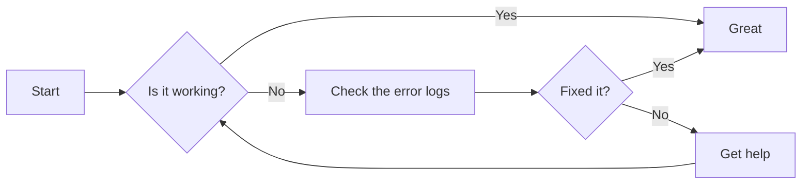
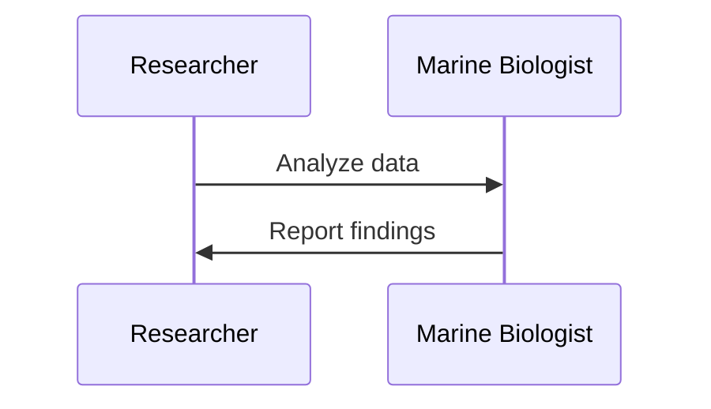
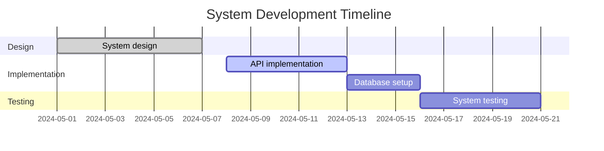
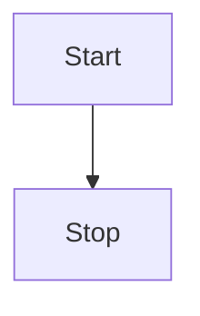
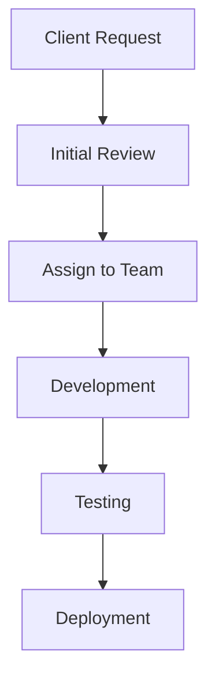

Certainly! Here's an enhanced version of the CRM dashboard template, incorporating more colorful elements, flowcharts, varied callouts, and additional embedded content:

### Enhanced and Colorful CRM Dashboard in Obsidian Markdown

# 📊 Project Dashboard

## 🔗 Quick Links
- [Project Plan](#project-plan)
- [Timeline](#timeline)
- [Tasks](#tasks)
- [Notes](#notes)

## 🗂️ Overview
| Phase | Status | Due Date |
|-------|--------|----------|
| Planning | ✅ Completed | 2024-01-01 |
| Development | 🔄 In Progress | 2024-06-01 |
| Testing | ⏳ Not Started | 2024-08-01 |

---

## 📇 CRM Dashboard

### 📜 Contact Overview


#### Aisha Saah

**Email:** aisha.saah@example.com  
**Phone Number:** (123) 456-7890  
**Contact Owner:** John Doe  
**Last Contacted:** 2024-05-20  
**Lifecycle Stage:** Customer  
**Lead Status:** Active

---

### 📋 Activities
#### Upcoming
- **Meeting** - Cupcake creator demo by Elise Beck  
  **Date:** Jun 12, 2024 at 8:00 PM EDT

- **Task** - Assigned by Elise Beck  
  **Status:** Overdue  
  **Date:** Jun 12, 2024 at 8:00 PM EDT

#### June 2024
- **Call** - By Elise Beck  
  **Date:** Jun 9, 2024 at 8:00 PM EDT

- **Email Tracking**
  **Status:** Pending  
  **Date:** Jun 9, 2024 at 8:00 PM EDT

---

## 📝 Notes
> [!info] **Info:** About this Contact  
> - **Email:** aisha.saah@example.com
> - **Phone Number:** (123) 456-7890
> - **Contact Owner:** John Doe
> - **Last Contacted:** 2024-05-20
> - **Lifecycle Stage:** Customer
> - **Lead Status:** Active

## 🧩 Related Links
- [Deals](#deals)
- [Company](#company)
- [Tickets](#tickets)
- [Attachments](#attachments)
- [Playbooks](#playbooks)
- [List Memberships](#list-memberships)

---

## 📅 Calendar View
```mermaid
gantt
    dateFormat  YYYY-MM-DD
    title Activity Schedule
    section Upcoming
    Meeting :done, 2024-06-12, 2024-06-12
    Task :crit, active, 2024-06-12, 2024-06-12
    section June 2024
    Call :done, 2024-06-09, 2024-06-09
    Email Tracking :active, 2024-06-09, 2024-06-09
```

## 🔍 Search Filter
```query
line:(contact)
```

---

## 📑 Backlinks
- [[Meeting Notes]]
- [[Task Details]]
- [[Call Logs]]

---

## 📊 Performance Metrics
| Metric | Value |
|--------|-------|
| Meetings | 10 |
| Tasks | 5 |
| Calls | 3 |
| Emails | 20 |

## 📅 Upcoming Events


## 🚀 Custom Actions
- <a href="#" onclick="alert('Action Triggered!')">Trigger Alert</a>
- <a href="#" onclick="document.getElementById('output').innerText='Action Completed!'">Complete Action</a>

<div id="output"></div>

---

### Additional Enhancements from NEW TEMPLATES

#### Embedded HTML
<div style="background-color: #f9f9f9; border-left: 6px solid #0074D9; padding: 10px;">
    <strong>Note:</strong> Ensure you have Python installed before proceeding with the installation.
</div>

#### Interactive Mermaid Diagrams





#### Task Lists
- [ ] Define project scope
- [ ] Set up development environment
- [ ] Implement core features
- [ ] Write tests

#### Callouts
> [!tip] **Tip:** Regularly update your AI models to ensure accuracy.

> [!info] **Info:** The following section provides a detailed analysis of the results.

#### Research Findings Section
<h1>Research Findings</h1>

<h2>Table of Contents</h2>
<ul>
  <li><a href="#introduction">Introduction</a></li>
  <li><a href="#methodology">Methodology</a></li>
  <li><a href="#results">Results</a></li>
  <li><a href="#discussion">Discussion</a></li>
  <li><a href="#conclusion">Conclusion</a></li>
  <li><a href="#references">References</a></li>
</ul>

### Action Items
- [ ] John to complete the project proposal by June 5.
- [ ] Mary to schedule the next client meeting.
- [x] Project documentation updated by Sarah.

> [!note] **Note**: Participants will receive a certificate upon completion of the training program.

---

### Embedded Code and Notes

<div style="background-color: #f9f9f9; border-left: 4px solid #ccc; padding: 10px;">
    <pre><code>def example():
    return "This is an example code block"
</code></pre>
</div>

> [!info] **Important:** The following code is an example of a function that returns a string.



## 🗂️ Sidebar
### Deals
**Count:** 0

### Company
**Count:** 1

### Tickets
**Count:** 0

### Attachments
**Count:** 0

### Playbooks
**Count:** 0

### List Memberships
**Count:** 1

---

### 🔍 Search Filter
```query
line:(template)
```

### Callouts

> [!info] **Info:** The following section provides a detailed analysis of the results.
> [!tip] **Tip:** Regularly update your AI models to ensure accuracy.
> [!note] **Note:** Participants will receive a certificate upon completion of the training program.

---

### Flowcharts





---

### Additional Embedded HTML Sections

<div style="background-color: yellow; padding: 10px; border-radius: 5px;">
    <strong>Highlight:</strong> This is a highlighted section using custom HTML.
</div>

<div style="background-color: #f0f0f0; padding: 10px; border-left: 6px solid #00aaff;">
    <strong>Reminder:</strong> Don't forget to review the latest project updates.
</div>

---

### More Embedded Code Blocks

<div style="background-color: #f9f9f9; border-left: 4px solid #ccc; padding: 10px;">
    <pre><code>def calculate_sum(a, b):
    return a + b
</code></pre>
</div>

---

### Additional Task Lists

- [ ] Complete code review
- [ ] Finalize project report
- [ ] Prepare presentation slides

This version includes more colorful elements, additional flowcharts, varied callout boxes, and additional embedded HTML and code sections, making the CRM dashboard even more comprehensive and engaging.