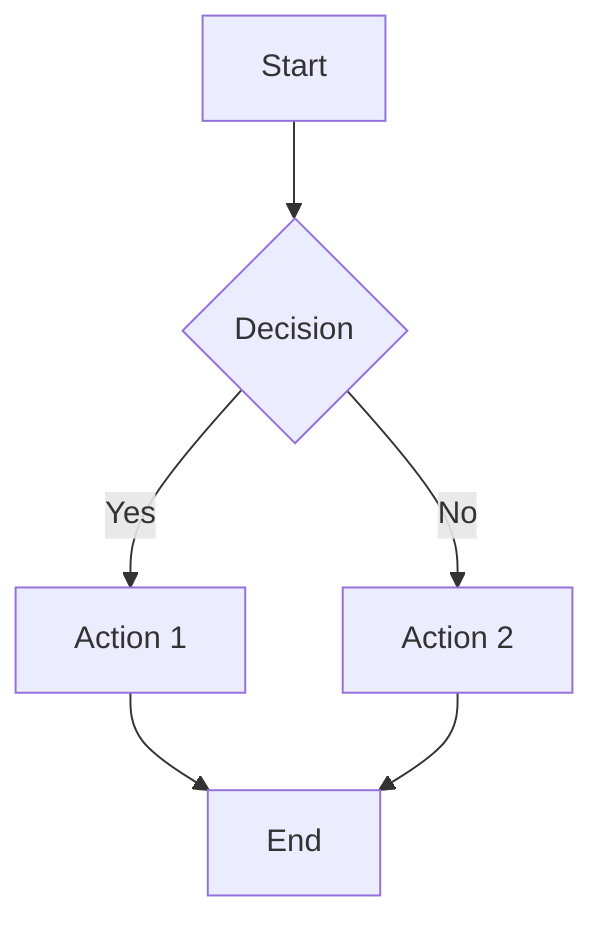
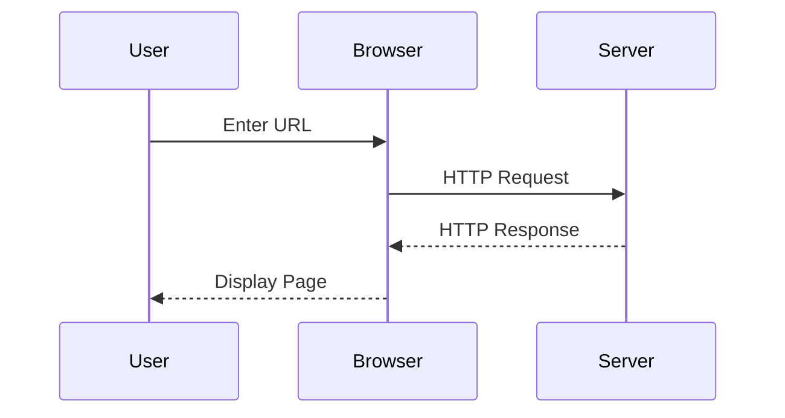
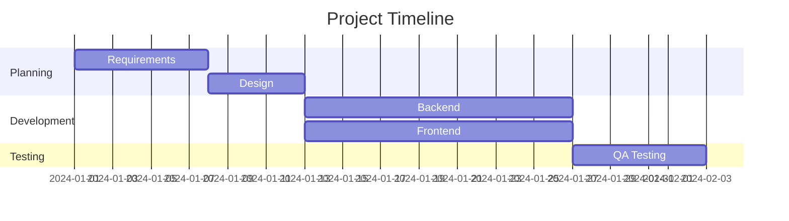
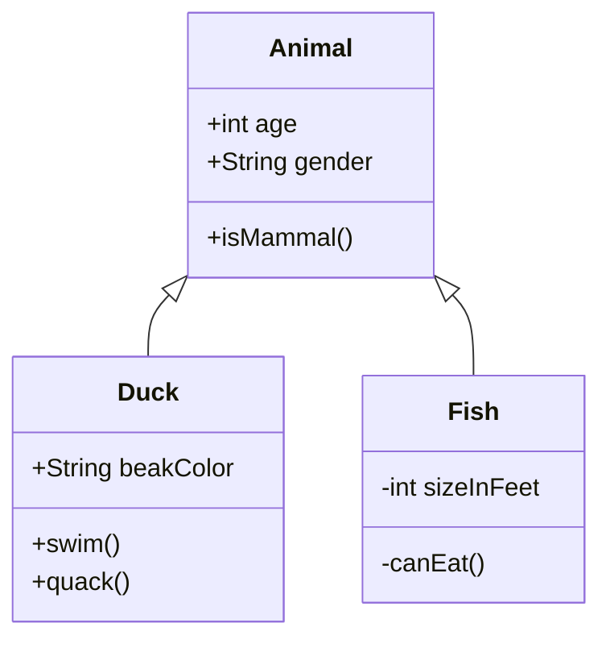
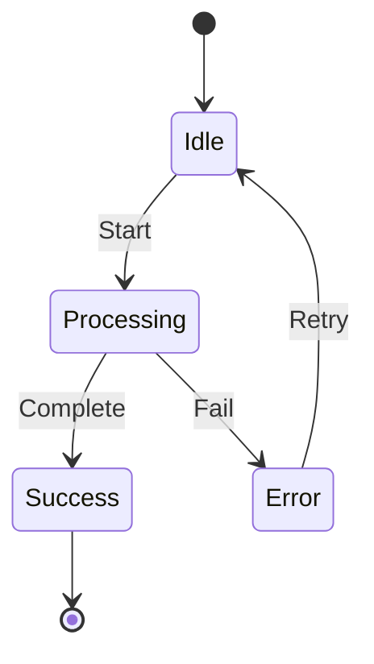
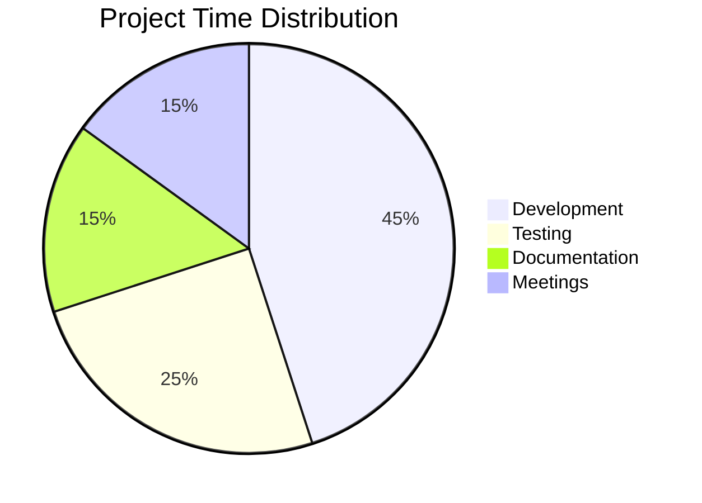
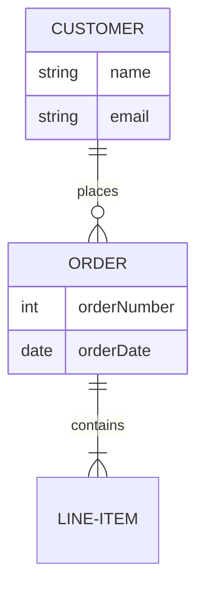
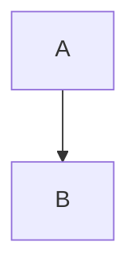

# GitHub Flavored Markdown (GFM) - Complete Guide

**Version**: 1.0
**Last Updated**: 2025-12-28
**Source**: [GitHub Documentation](https://docs.github.com/en/get-started/writing-on-github)

---

## Table of Contents

1. [Basic Formatting](#basic-formatting)
2. [Headers](#headers)
3. [Text Styling](#text-styling)
4. [Lists](#lists)
5. [Links](#links)
6. [Images](#images)
7. [Code and Syntax Highlighting](#code-and-syntax-highlighting)
8. [Tables](#tables)
9. [Task Lists](#task-lists)
10. [Blockquotes](#blockquotes)
11. [Alerts](#alerts)
12. [Collapsed Sections](#collapsed-sections)
13. [Diagrams (Mermaid)](#diagrams-mermaid)
14. [Mathematical Expressions](#mathematical-expressions)
15. [Footnotes](#footnotes)
16. [Advanced Features](#advanced-features)

---

## Basic Formatting

### Paragraphs

Separate paragraphs with a blank line:

```markdown
This is the first paragraph.

This is the second paragraph.
```

### Line Breaks

End a line with two or more spaces, or use `<br>`:

```markdown
First line
Second line

Or use HTML:<br>
New line
```

### Horizontal Rules

Create horizontal rules with three or more hyphens, asterisks, or underscores:

```markdown
---
***
___
```

**Result**:

---

---

## Headers

Use `#` symbols for headers (1-6 levels):

```markdown
# Header 1
## Header 2
### Header 3
#### Header 4
##### Header 5
###### Header 6
```

**Alternative syntax** (for H1 and H2):

```markdown
Header 1
========

Header 2
--------
```

### Header with ID (for linking)

```markdown
### My Header {#custom-id}
```

---

## Text Styling

### Emphasis

```markdown
*Italic* or _Italic_
**Bold** or __Bold__
***Bold and Italic*** or ___Bold and Italic___
~~Strikethrough~~
<sub>Subscript</sub>
<sup>Superscript</sup>
```

**Result**:
- *Italic* or _Italic_
- **Bold** or __Bold__
- ***Bold and Italic***
- ~~Strikethrough~~
- H<sub>2</sub>O (subscript)
- X<sup>2</sup> (superscript)

### Highlighting

```markdown
==Highlighted text== (not supported in all renderers)
<mark>Highlighted text</mark> (HTML alternative)
```

---

## Lists

### Unordered Lists

```markdown
- Item 1
- Item 2
  - Nested item 2.1
  - Nested item 2.2
- Item 3

* Alternative
* Bullet style

+ Another
+ Alternative
```

**Result**:
- Item 1
- Item 2
  - Nested item 2.1
  - Nested item 2.2
- Item 3

### Ordered Lists

```markdown
1. First item
2. Second item
   1. Nested item
   2. Another nested item
3. Third item
```

**Result**:
1. First item
2. Second item
   1. Nested item
   2. Another nested item
3. Third item

### Mixed Lists

```markdown
1. First ordered item
2. Second ordered item
   - Unordered nested
   - Another unordered
3. Third ordered item
```

---

## Links

### Basic Links

```markdown
[Link text](https://example.com)
[Link with title](https://example.com "Hover title")
```

### Reference-Style Links

```markdown
[Link text][reference]
[Another link][ref2]

[reference]: https://example.com
[ref2]: https://example.com "Optional title"
```

### Auto-Linking

```markdown
https://github.com
user@example.com
```

### Relative Links

```markdown
[Documentation](../docs/README.md)
[File in same directory](./file.md)
```

### Section Links (Anchors)

```markdown
[Go to Headers section](#headers)
```

### GitHub-Specific Links

```markdown
@username - Mention a user
#123 - Link to issue/PR number
GH-123 - Alternative issue reference
org/repo#123 - Reference issue in another repo
```

---

## Images

### Basic Image

```markdown


```

### Image with Link

```markdown
[](https://example.com)
```

### Reference-Style Images

```markdown
![Alt text][logo]

[logo]: https://example.com/logo.png "Logo title"
```

### Image Sizing (HTML)

```markdown

```

### Align Images (HTML)

```markdown
<p align="center">
  
</p>
```

---

## Code and Syntax Highlighting

### Inline Code

```markdown
Use `inline code` for short snippets.
```

**Result**: Use `inline code` for short snippets.

### Code Blocks

#### Fenced Code Blocks

````markdown
```
Plain code block
No syntax highlighting
```

```javascript
// JavaScript with syntax highlighting
function hello() {
  console.log("Hello, World!");
}
```

```python
# Python example
def greet(name):
    print(f"Hello, {name}!")
```
````

#### Supported Languages

```markdown
```bash
```c
```cpp
```csharp
```css
```diff
```go
```html
```java
```javascript
```json
```kotlin
```markdown
```php
```python
```ruby
```rust
```sql
```swift
```typescript
```yaml
```xml
... and 100+ more
```

#### Code Block with Filename

````markdown
```javascript:app.js
const app = require('express')();
```
````

#### Diff Highlighting

````markdown
```diff
- Old line (removed)
+ New line (added)
  Unchanged line
```
````

---

## Tables

### Basic Table

```markdown
| Header 1 | Header 2 | Header 3 |
|----------|----------|----------|
| Row 1    | Data     | Data     |
| Row 2    | Data     | Data     |
```

**Result**:

| Header 1 | Header 2 | Header 3 |
|----------|----------|----------|
| Row 1    | Data     | Data     |
| Row 2    | Data     | Data     |

### Column Alignment

```markdown
| Left Aligned | Center Aligned | Right Aligned |
|:-------------|:--------------:|--------------:|
| Left         | Center         | Right         |
| Data         | Data           | Data          |
```

**Result**:

| Left Aligned | Center Aligned | Right Aligned |
|:-------------|:--------------:|--------------:|
| Left         | Center         | Right         |
| Data         | Data           | Data          |

### Inline Formatting in Tables

```markdown
| Feature | Status | Notes |
|---------|--------|-------|
| **Bold** | ✅ | `code` works |
| *Italic* | ⚠️ | [Links](url) work |
| ~~Strike~~ | ❌ | Limited HTML |
```

---

## Task Lists

### Interactive Checkboxes

```markdown
- [x] Completed task
- [ ] Incomplete task
- [ ] Another task
  - [x] Nested completed
  - [ ] Nested incomplete
```

**Result**:

- [x] Completed task
- [ ] Incomplete task
- [ ] Another task
  - [x] Nested completed
  - [ ] Nested incomplete

---

## Blockquotes

### Basic Blockquote

```markdown
> This is a blockquote.
> It can span multiple lines.
```

**Result**:
> This is a blockquote.
> It can span multiple lines.

### Nested Blockquotes

```markdown
> Level 1
>> Level 2
>>> Level 3
```

### Blockquotes with Formatting

```markdown
> **Note**: This is important.
> - Item 1
> - Item 2
>
> ```javascript
> const code = "works too";
> ```
```

---

## Alerts

GitHub supports special alert blockquotes (callouts):

```markdown
> [!NOTE]
> Useful information that users should know.

> [!TIP]
> Helpful advice for doing things better.

> [!IMPORTANT]
> Key information users need to know.

> [!WARNING]
> Urgent info that needs immediate attention.

> [!CAUTION]
> Advises about risks or negative outcomes.
```

**Result**:

> [!NOTE]
> Useful information that users should know.

> [!TIP]
> Helpful advice for doing things better.

> [!IMPORTANT]
> Key information users need to know.

> [!WARNING]
> Urgent info that needs immediate attention.

> [!CAUTION]
> Advises about risks or negative outcomes.

---

## Collapsed Sections

Create collapsible content using `<details>` and `<summary>`:

```markdown
<details>
<summary>Click to expand</summary>

### Hidden Content

This content is hidden until expanded.

- Item 1
- Item 2

```javascript
console.log("Code works too!");
```

</details>
```

**Result**:

<details>
<summary>Click to expand</summary>

### Hidden Content

This content is hidden until expanded.

- Item 1
- Item 2

```javascript
console.log("Code works too!");
```

</details>

---

## Diagrams (Mermaid)

GitHub supports Mermaid diagrams natively:

### Flowchart

````markdown

````

### Sequence Diagram

````markdown

````

### Gantt Chart

````markdown

````

### Class Diagram

````markdown

````

### State Diagram

````markdown

````

### Pie Chart

````markdown

````

### Entity Relationship Diagram

````markdown

````

---

## Mathematical Expressions

GitHub supports LaTeX-style math expressions:

### Inline Math

```markdown
This is inline math: $E = mc^2$
```

**Result**: This is inline math: $E = mc^2$

### Block Math

```markdown
$$
\frac{-b \pm \sqrt{b^2 - 4ac}}{2a}
$$
```

**Result**:

$$
\frac{-b \pm \sqrt{b^2 - 4ac}}{2a}
$$

### Common Math Examples

```markdown
$$
\begin{aligned}
  \nabla \cdot \mathbf{E} &= \frac{\rho}{\epsilon_0} \\
  \nabla \times \mathbf{E} &= -\frac{\partial \mathbf{B}}{\partial t} \\
  \nabla \cdot \mathbf{B} &= 0 \\
  \nabla \times \mathbf{B} &= \mu_0\mathbf{J} + \mu_0\epsilon_0\frac{\partial \mathbf{E}}{\partial t}
\end{aligned}
$$
```

---

## Footnotes

Create footnotes with reference-style syntax:

```markdown
Here's a sentence with a footnote.[^1]

Here's another with a longer note.[^bignote]

[^1]: This is the footnote.

[^bignote]: Here's one with multiple paragraphs.

    Indent paragraphs to include them in the footnote.

    Add as many as you like.
```

---

## Advanced Features

### Keyboard Keys

```markdown
Press <kbd>Ctrl</kbd> + <kbd>C</kbd> to copy.
Press <kbd>Cmd</kbd> + <kbd>V</kbd> to paste.
```

**Result**: Press <kbd>Ctrl</kbd> + <kbd>C</kbd> to copy.

### Emojis

```markdown
:smile: :heart: :rocket: :tada:
```

**Result**: :smile: :heart: :rocket: :tada:

[Full emoji list](https://github.com/ikatyang/emoji-cheat-sheet)

### Comments

```markdown
<!-- This is a comment and won't be visible -->
```

### Escaping Characters

```markdown
Use backslash to escape: \* \_ \# \[ \]
```

### Color Swatches

```markdown
`#0969DA` - Blue
`rgb(9, 105, 218)` - Blue (RGB)
`hsl(212, 92%, 45%)` - Blue (HSL)
```

**Result**:
- `#0969DA` - Blue
- `rgb(9, 105, 218)` - Blue (RGB)
- `hsl(212, 92%, 45%)` - Blue (HSL)

### GeoJSON/TopoJSON Maps

````markdown
```geojson
{
  "type": "FeatureCollection",
  "features": [
    {
      "type": "Feature",
      "geometry": {
        "type": "Point",
        "coordinates": [0, 0]
      }
    }
  ]
}
```
````

### STL 3D Models

````markdown
```stl
solid cube_corner
  facet normal 0.0 -1.0 0.0
    outer loop
      vertex 0.0 0.0 0.0
      vertex 1.0 0.0 0.0
      vertex 0.0 0.0 1.0
    endloop
  endfacet
endsolid
```
````

### HTML Support

GitHub allows limited HTML:

```markdown
<div align="center">
  <h3>Centered Heading</h3>
  <p>Centered paragraph</p>
</div>

<table>
  <tr>
    <td>HTML tables work</td>
    <td>With more control</td>
  </tr>
</table>
```

### Badges

```markdown


```

---

## Best Practices

### Document Structure

1. **Start with a clear title** (H1)
2. **Add a table of contents** for long documents
3. **Use descriptive headers** for sections
4. **Keep paragraphs concise** (3-5 sentences)
5. **Use lists** for better readability

### Formatting Guidelines

- **Consistent header hierarchy** (don't skip levels)
- **Blank lines** around headers, lists, code blocks
- **Indentation** for nested lists (2 or 4 spaces)
- **Alt text** for all images
- **Meaningful link text** (avoid "click here")

### Code Documentation

- **Language identifier** for syntax highlighting
- **Inline code** for variable/function names
- **Code blocks** for multi-line examples
- **Comments** to explain complex logic

### Accessibility

- **Alt text** for images
- **Semantic HTML** when using HTML
- **Descriptive link text**
- **Proper header hierarchy**
- **Color contrast** (don't rely on color alone)

---

## Quick Reference

### Headers
```
# H1
## H2
### H3
```

### Emphasis
```
*italic* **bold** ***both***
~~strikethrough~~
```

### Lists
```
- Unordered
1. Ordered
- [ ] Task
```

### Links & Images
```
[text](url)

```

### Code
```
`inline code`
```lang
code block
```
```

### Tables
```
| Col1 | Col2 |
|------|------|
| Data | Data |
```

### Alerts
```
> [!NOTE]
> Content
```

### Diagrams
````

````

---

## Resources

- [GitHub Docs - Writing on GitHub](https://docs.github.com/en/get-started/writing-on-github)
- [GitHub Flavored Markdown Spec](https://github.github.com/gfm/)
- [Mermaid Documentation](https://mermaid.js.org/)
- [Emoji Cheat Sheet](https://github.com/ikatyang/emoji-cheat-sheet)
- [Shields.io - Badges](https://shields.io/)

---

**License**: Public Domain
**Maintained by**: ENHANCED_SECOND_BRAIN_ENTERPRISE
**Last Review**: 2025-12-28
