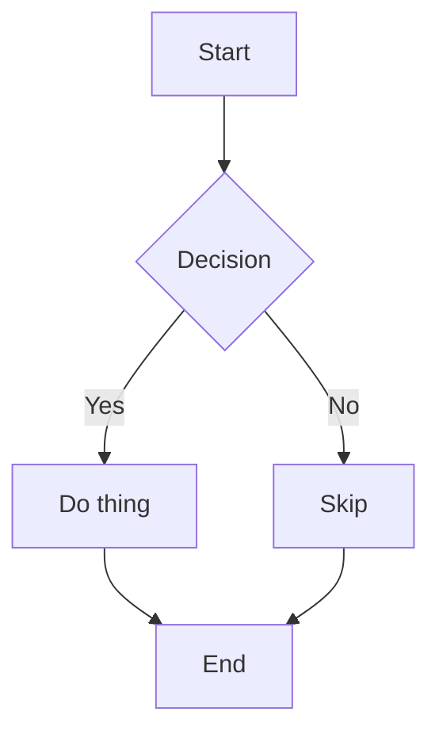
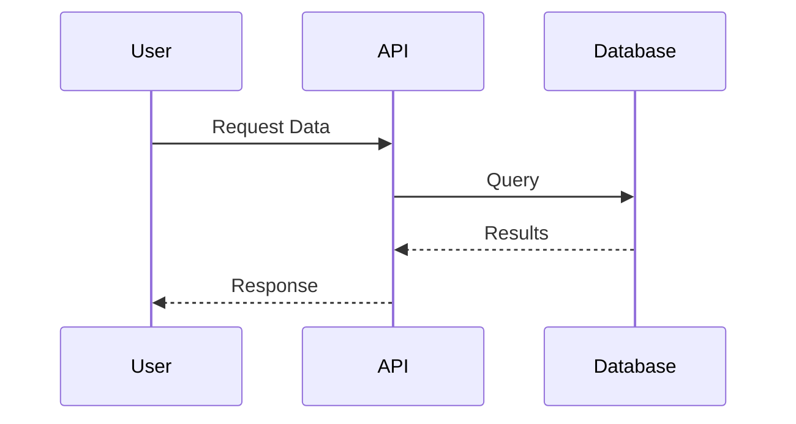
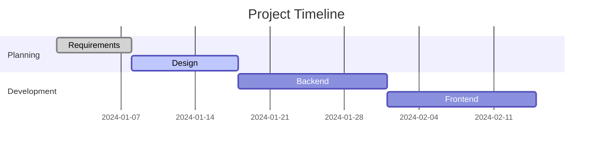

# GitHub Advanced Markdown Formatting Guide

<div style="background: linear-gradient(135deg, #10b981 0%, #059669 100%); padding: 60px 40px; border-radius: 20px; color: white; text-align: center; margin: 40px 0; box-shadow: 0 20px 60px rgba(16, 185, 129, 0.4);">
  <h1 style="margin: 0 0 20px 0; font-size: 3em; font-weight: 800; text-shadow: 2px 2px 4px rgba(0,0,0,0.2);">📝 GitHub Advanced Formatting</h1>
  <p style="font-size: 1.3em; margin: 0 0 30px 0; opacity: 0.95;">Master GitHub Flavored Markdown · Professional Documentation · Rich Visual Content</p>

  <div style="display: inline-flex; gap: 20px; flex-wrap: wrap; justify-content: center;">
    <div style="background: rgba(255,255,255,0.2); backdrop-filter: blur(10px); padding: 15px 30px; border-radius: 12px; border: 1px solid rgba(255,255,255,0.3);">
      <div style="font-size: 2em; font-weight: 700;">15+</div>
      <div style="font-size: 0.9em; opacity: 0.9;">Advanced Features</div>
    </div>
    <div style="background: rgba(255,255,255,0.2); backdrop-filter: blur(10px); padding: 15px 30px; border-radius: 12px; border: 1px solid rgba(255,255,255,0.3);">
      <div style="font-size: 2em; font-weight: 700;">100%</div>
      <div style="font-size: 0.9em; opacity: 0.9;">GitHub Compatible</div>
    </div>
    <div style="background: rgba(255,255,255,0.2); backdrop-filter: blur(10px); padding: 15px 30px; border-radius: 12px; border: 1px solid rgba(255,255,255,0.3);">
      <div style="font-size: 2em; font-weight: 700;">Pro</div>
      <div style="font-size: 0.9em; opacity: 0.9;">Documentation</div>
    </div>
  </div>
</div>

---

## 🗂️ Quick Navigation

<div style="display: grid; grid-template-columns: repeat(auto-fit, minmax(280px, 1fr)); gap: 20px; margin: 30px 0;">
  <a href="#tables" style="text-decoration: none;">
    <div style="background: linear-gradient(135deg, rgba(16, 185, 129, 0.1) 0%, rgba(5, 150, 105, 0.1) 100%); padding: 25px; border-radius: 12px; border: 2px solid #10b981; transition: transform 0.3s, box-shadow 0.3s;">
      <div style="color: #10b981; font-size: 2em; margin-bottom: 10px;">📊</div>
      <div style="color: #059669; font-weight: 700; font-size: 1.2em; margin-bottom: 8px;">Tables</div>
      <div style="color: #6b7280; font-size: 0.95em;">Organize data with alignment</div>
    </div>
  </a>

  <a href="#collapsed-sections" style="text-decoration: none;">
    <div style="background: linear-gradient(135deg, rgba(16, 185, 129, 0.1) 0%, rgba(5, 150, 105, 0.1) 100%); padding: 25px; border-radius: 12px; border: 2px solid #10b981; transition: transform 0.3s, box-shadow 0.3s;">
      <div style="color: #10b981; font-size: 2em; margin-bottom: 10px;">📁</div>
      <div style="color: #059669; font-weight: 700; font-size: 1.2em; margin-bottom: 8px;">Collapsed Sections</div>
      <div style="color: #6b7280; font-size: 0.95em;">Hide & reveal content</div>
    </div>
  </a>

  <a href="#code-blocks" style="text-decoration: none;">
    <div style="background: linear-gradient(135deg, rgba(16, 185, 129, 0.1) 0%, rgba(5, 150, 105, 0.1) 100%); padding: 25px; border-radius: 12px; border: 2px solid #10b981; transition: transform 0.3s, box-shadow 0.3s;">
      <div style="color: #10b981; font-size: 2em; margin-bottom: 10px;">💻</div>
      <div style="color: #059669; font-weight: 700; font-size: 1.2em; margin-bottom: 8px;">Code Blocks</div>
      <div style="color: #6b7280; font-size: 0.95em;">Syntax highlighting</div>
    </div>
  </a>

  <a href="#diagrams" style="text-decoration: none;">
    <div style="background: linear-gradient(135deg, rgba(16, 185, 129, 0.1) 0%, rgba(5, 150, 105, 0.1) 100%); padding: 25px; border-radius: 12px; border: 2px solid #10b981; transition: transform 0.3s, box-shadow 0.3s;">
      <div style="color: #10b981; font-size: 2em; margin-bottom: 10px;">📈</div>
      <div style="color: #059669; font-weight: 700; font-size: 1.2em; margin-bottom: 8px;">Diagrams</div>
      <div style="color: #6b7280; font-size: 0.95em;">Mermaid, GeoJSON, STL</div>
    </div>
  </a>

  <a href="#math" style="text-decoration: none;">
    <div style="background: linear-gradient(135deg, rgba(16, 185, 129, 0.1) 0%, rgba(5, 150, 105, 0.1) 100%); padding: 25px; border-radius: 12px; border: 2px solid #10b981; transition: transform 0.3s, box-shadow 0.3s;">
      <div style="color: #10b981; font-size: 2em; margin-bottom: 10px;">🔢</div>
      <div style="color: #059669; font-weight: 700; font-size: 1.2em; margin-bottom: 8px;">Math Expressions</div>
      <div style="color: #6b7280; font-size: 0.95em;">LaTeX via MathJax</div>
    </div>
  </a>

  <a href="#autolinks" style="text-decoration: none;">
    <div style="background: linear-gradient(135deg, rgba(16, 185, 129, 0.1) 0%, rgba(5, 150, 105, 0.1) 100%); padding: 25px; border-radius: 12px; border: 2px solid #10b981; transition: transform 0.3s, box-shadow 0.3s;">
      <div style="color: #10b981; font-size: 2em; margin-bottom: 10px;">🔗</div>
      <div style="color: #059669; font-weight: 700; font-size: 1.2em; margin-bottom: 8px;">Autolinks</div>
      <div style="color: #6b7280; font-size: 0.95em;">URLs, issues, PRs, SHAs</div>
    </div>
  </a>

  <a href="#task-lists" style="text-decoration: none;">
    <div style="background: linear-gradient(135deg, rgba(16, 185, 129, 0.1) 0%, rgba(5, 150, 105, 0.1) 100%); padding: 25px; border-radius: 12px; border: 2px solid #10b981; transition: transform 0.3s, box-shadow 0.3s;">
      <div style="color: #10b981; font-size: 2em; margin-bottom: 10px;">✅</div>
      <div style="color: #059669; font-weight: 700; font-size: 1.2em; margin-bottom: 8px;">Task Lists</div>
      <div style="color: #6b7280; font-size: 0.95em;">Interactive checkboxes</div>
    </div>
  </a>

  <a href="#permalinks" style="text-decoration: none;">
    <div style="background: linear-gradient(135deg, rgba(16, 185, 129, 0.1) 0%, rgba(5, 150, 105, 0.1) 100%); padding: 25px; border-radius: 12px; border: 2px solid #10b981; transition: transform 0.3s, box-shadow 0.3s;">
      <div style="color: #10b981; font-size: 2em; margin-bottom: 10px;">🎯</div>
      <div style="color: #059669; font-weight: 700; font-size: 1.2em; margin-bottom: 8px;">Permalinks</div>
      <div style="color: #6b7280; font-size: 0.95em;">Link to specific lines</div>
    </div>
  </a>
</div>

---

<a name="tables"></a>
## 📊 Tables

<div style="background: white; padding: 35px; border-radius: 16px; box-shadow: 0 15px 50px rgba(0,0,0,0.12); margin: 30px 0;">

### Basic Table Structure

<div style="background: linear-gradient(135deg, rgba(16, 185, 129, 0.1) 0%, rgba(5, 150, 105, 0.1) 100%); padding: 20px; border-radius: 12px; border-left: 4px solid #10b981; margin: 20px 0;">
  <strong style="color: #059669;">💡 Pro Tip:</strong> Always leave a blank line before the table for proper rendering.
</div>

**Syntax:**
```md
| Name | Description |
| --- | --- |
| Alpha | First item |
| Beta | Second item |
```

**Result:**

<div style="background: #f9fafb; padding: 20px; border-radius: 10px; margin: 20px 0;">

| Name | Description |
| --- | --- |
| Alpha | First item |
| Beta | Second item |

</div>

### Table Alignment

<div style="display: grid; grid-template-columns: repeat(auto-fit, minmax(300px, 1fr)); gap: 20px; margin: 30px 0;">
  <div style="background: linear-gradient(135deg, rgba(239, 68, 68, 0.1) 0%, rgba(220, 38, 38, 0.1) 100%); padding: 20px; border-radius: 12px; border: 2px solid #ef4444;">
    <div style="color: #ef4444; font-weight: 700; font-size: 1.1em; margin-bottom: 12px;">⬅️ Left Aligned</div>
    <code style="background: #1f2937; color: #10b981; padding: 4px 8px; border-radius: 4px; font-size: 0.9em;">:---</code>
    <div style="color: #6b7280; font-size: 0.9em; margin-top: 8px;">Default alignment</div>
  </div>

  <div style="background: linear-gradient(135deg, rgba(16, 185, 129, 0.1) 0%, rgba(5, 150, 105, 0.1) 100%); padding: 20px; border-radius: 12px; border: 2px solid #10b981;">
    <div style="color: #10b981; font-weight: 700; font-size: 1.1em; margin-bottom: 12px;">↔️ Center Aligned</div>
    <code style="background: #1f2937; color: #10b981; padding: 4px 8px; border-radius: 4px; font-size: 0.9em;">:---:</code>
    <div style="color: #6b7280; font-size: 0.9em; margin-top: 8px;">Centered content</div>
  </div>

  <div style="background: linear-gradient(135deg, rgba(59, 130, 246, 0.1) 0%, rgba(37, 99, 235, 0.1) 100%); padding: 20px; border-radius: 12px; border: 2px solid #3b82f6;">
    <div style="color: #3b82f6; font-weight: 700; font-size: 1.1em; margin-bottom: 12px;">➡️ Right Aligned</div>
    <code style="background: #1f2937; color: #10b981; padding: 4px 8px; border-radius: 4px; font-size: 0.9em;">---:</code>
    <div style="color: #6b7280; font-size: 0.9em; margin-top: 8px;">Right-aligned numbers</div>
  </div>
</div>

**Syntax:**
```md
| Left | Center | Right |
| :--- | :---: | ---: |
| a | b | c |
```

**Result:**

<div style="overflow-x: auto;">

| Left | Center | Right |
| :--- | :---: | ---: |
| a | b | c |
| Apple | Orange | Banana |
| 123 | 456 | 789 |

</div>

### Escaping Special Characters

<div style="background: linear-gradient(135deg, rgba(245, 158, 11, 0.1) 0%, rgba(217, 119, 6, 0.1) 100%); padding: 20px; border-radius: 12px; border-left: 4px solid #f59e0b; margin: 20px 0;">
  <strong style="color: #d97706;">⚠️ Important:</strong> Escape literal pipes with a backslash <code>\|</code>
</div>

**Syntax:**
```md
| Symbol | Example |
| --- | --- |
| Pipe | \| |
```

**Result:**

| Symbol | Example |
| --- | --- |
| Pipe | \| |

### Professional Table Example

<div style="margin: 30px 0; overflow-x: auto;">

<table style="width: 100%; border-collapse: collapse; box-shadow: 0 4px 15px rgba(0,0,0,0.1); border-radius: 10px; overflow: hidden;">
  <thead>
    <tr style="background: linear-gradient(135deg, #10b981 0%, #059669 100%); color: white;">
      <th style="padding: 15px; text-align: left; font-weight: 600;">Feature</th>
      <th style="padding: 15px; text-align: center; font-weight: 600;">Support</th>
      <th style="padding: 15px; text-align: right; font-weight: 600;">Version</th>
    </tr>
  </thead>
  <tbody>
    <tr style="background: #f9fafb;">
      <td style="padding: 12px; border-bottom: 1px solid #e5e7eb;">Tables</td>
      <td style="padding: 12px; text-align: center; border-bottom: 1px solid #e5e7eb;">✅</td>
      <td style="padding: 12px; text-align: right; border-bottom: 1px solid #e5e7eb;">GFM 0.29</td>
    </tr>
    <tr style="background: white;">
      <td style="padding: 12px; border-bottom: 1px solid #e5e7eb;">Task Lists</td>
      <td style="padding: 12px; text-align: center; border-bottom: 1px solid #e5e7eb;">✅</td>
      <td style="padding: 12px; text-align: right; border-bottom: 1px solid #e5e7eb;">GFM 0.28</td>
    </tr>
    <tr style="background: #f9fafb;">
      <td style="padding: 12px; border-bottom: 1px solid #e5e7eb;">Mermaid</td>
      <td style="padding: 12px; text-align: center; border-bottom: 1px solid #e5e7eb;">✅</td>
      <td style="padding: 12px; text-align: right; border-bottom: 1px solid #e5e7eb;">2022+</td>
    </tr>
    <tr style="background: white;">
      <td style="padding: 12px;">Math (LaTeX)</td>
      <td style="padding: 12px; text-align: center;">✅</td>
      <td style="padding: 12px; text-align: right;">2022+</td>
    </tr>
  </tbody>
</table>

</div>

</div>

---

<a name="collapsed-sections"></a>
## 📁 Collapsed Sections (Details/Summary)

<div style="background: white; padding: 35px; border-radius: 16px; box-shadow: 0 15px 50px rgba(0,0,0,0.12); margin: 30px 0;">

### Basic Collapsed Content

Use HTML `<details>` and `<summary>` to create collapsible sections.

**Syntax:**
```html
<details>
<summary>Show details</summary>

### Inside the collapsed area
You can include Markdown, images, and code blocks here.

```ruby
puts "Hello World"
```

</details>
```

**Result:**

<details style="background: linear-gradient(135deg, rgba(16, 185, 129, 0.05) 0%, rgba(5, 150, 105, 0.05) 100%); padding: 20px; border-radius: 10px; border: 2px solid #10b981; margin: 20px 0;">
<summary style="cursor: pointer; font-weight: 700; color: #059669; font-size: 1.1em; padding: 10px;">🔽 Click to expand details</summary>

### Inside the collapsed area
You can include **Markdown**, *images*, and code blocks here.

```ruby
puts "Hello World"
```

Here's a list:
- Item 1
- Item 2
- Item 3

</details>

### Open by Default

**Syntax:**
```html
<details open>
<summary>Open by default</summary>

This content is visible immediately.
</details>
```

**Result:**

<details open style="background: linear-gradient(135deg, rgba(16, 185, 129, 0.05) 0%, rgba(5, 150, 105, 0.05) 100%); padding: 20px; border-radius: 10px; border: 2px solid #10b981; margin: 20px 0;">
<summary style="cursor: pointer; font-weight: 700; color: #059669; font-size: 1.1em; padding: 10px;">🔽 This section is open by default</summary>

This content is **visible immediately** when the page loads.

<div style="background: #f9fafb; padding: 15px; border-radius: 8px; margin-top: 15px;">
  <strong style="color: #059669;">💡 Use Case:</strong> Great for important information that should be visible by default but can be collapsed to save space.
</div>

</details>

### Nested Collapsed Sections

<details style="background: linear-gradient(135deg, rgba(16, 185, 129, 0.05) 0%, rgba(5, 150, 105, 0.05) 100%); padding: 20px; border-radius: 10px; border: 2px solid #10b981; margin: 20px 0;">
<summary style="cursor: pointer; font-weight: 700; color: #059669; font-size: 1.1em; padding: 10px;">🔽 Main Section</summary>

This is the main content area.

<details style="background: rgba(59, 130, 246, 0.1); padding: 15px; border-radius: 8px; margin: 15px 0; border: 1px solid #3b82f6;">
<summary style="cursor: pointer; font-weight: 600; color: #2563eb; padding: 8px;">🔽 Subsection 1</summary>

Nested content in subsection 1.

</details>

<details style="background: rgba(139, 92, 246, 0.1); padding: 15px; border-radius: 8px; margin: 15px 0; border: 1px solid #8b5cf6;">
<summary style="cursor: pointer; font-weight: 600; color: #7c3aed; padding: 8px;">🔽 Subsection 2</summary>

Nested content in subsection 2.

</details>

</details>

</div>

---

<a name="code-blocks"></a>
## 💻 Fenced Code Blocks + Syntax Highlighting

<div style="background: white; padding: 35px; border-radius: 16px; box-shadow: 0 15px 50px rgba(0,0,0,0.12); margin: 30px 0;">

### Syntax Highlighting

<div style="background: linear-gradient(135deg, rgba(16, 185, 129, 0.1) 0%, rgba(5, 150, 105, 0.1) 100%); padding: 20px; border-radius: 12px; border-left: 4px solid #10b981; margin: 20px 0;">
  <strong style="color: #059669;">💡 Pro Tip:</strong> Add a language identifier for automatic syntax highlighting.
</div>

**Syntax:**
````md
```python
def greet(name):
    print(f"Hello, {name}")
```
````

**Result:**

```python
def greet(name):
    print(f"Hello, {name}")

greet("World")
```

### Supported Languages

<div style="display: grid; grid-template-columns: repeat(auto-fit, minmax(150px, 1fr)); gap: 15px; margin: 30px 0;">
  <div style="background: linear-gradient(135deg, rgba(16, 185, 129, 0.1) 0%, rgba(5, 150, 105, 0.1) 100%); padding: 15px; border-radius: 10px; text-align: center; border: 2px solid #10b981;">
    <code style="color: #059669; font-weight: 600;">python</code>
  </div>
  <div style="background: linear-gradient(135deg, rgba(59, 130, 246, 0.1) 0%, rgba(37, 99, 235, 0.1) 100%); padding: 15px; border-radius: 10px; text-align: center; border: 2px solid #3b82f6;">
    <code style="color: #2563eb; font-weight: 600;">javascript</code>
  </div>
  <div style="background: linear-gradient(135deg, rgba(245, 158, 11, 0.1) 0%, rgba(217, 119, 6, 0.1) 100%); padding: 15px; border-radius: 10px; text-align: center; border: 2px solid #f59e0b;">
    <code style="color: #d97706; font-weight: 600;">java</code>
  </div>
  <div style="background: linear-gradient(135deg, rgba(239, 68, 68, 0.1) 0%, rgba(220, 38, 38, 0.1) 100%); padding: 15px; border-radius: 10px; text-align: center; border: 2px solid #ef4444;">
    <code style="color: #dc2626; font-weight: 600;">ruby</code>
  </div>
  <div style="background: linear-gradient(135deg, rgba(139, 92, 246, 0.1) 0%, rgba(124, 58, 237, 0.1) 100%); padding: 15px; border-radius: 10px; text-align: center; border: 2px solid #8b5cf6;">
    <code style="color: #7c3aed; font-weight: 600;">typescript</code>
  </div>
  <div style="background: linear-gradient(135deg, rgba(6, 182, 212, 0.1) 0%, rgba(8, 145, 178, 0.1) 100%); padding: 15px; border-radius: 10px; text-align: center; border: 2px solid #06b6d4;">
    <code style="color: #0891b2; font-weight: 600;">go</code>
  </div>
  <div style="background: linear-gradient(135deg, rgba(236, 72, 153, 0.1) 0%, rgba(219, 39, 119, 0.1) 100%); padding: 15px; border-radius: 10px; text-align: center; border: 2px solid #ec4899;">
    <code style="color: #db2777; font-weight: 600;">rust</code>
  </div>
  <div style="background: linear-gradient(135deg, rgba(16, 185, 129, 0.1) 0%, rgba(5, 150, 105, 0.1) 100%); padding: 15px; border-radius: 10px; text-align: center; border: 2px solid #10b981;">
    <code style="color: #059669; font-weight: 600;">bash</code>
  </div>
</div>

### Multi-Language Examples

<div style="display: grid; grid-template-columns: repeat(auto-fit, minmax(350px, 1fr)); gap: 20px; margin: 30px 0;">
  <div>
    <div style="background: linear-gradient(135deg, #3b82f6 0%, #2563eb 100%); color: white; padding: 12px 20px; border-radius: 10px 10px 0 0; font-weight: 600;">
      JavaScript
    </div>
    <div style="background: #1f2937; padding: 0; border-radius: 0 0 10px 10px; overflow: hidden;">

```javascript
const fetchData = async (url) => {
  const response = await fetch(url);
  return await response.json();
};
```

</div>
  </div>

  <div>
    <div style="background: linear-gradient(135deg, #10b981 0%, #059669 100%); color: white; padding: 12px 20px; border-radius: 10px 10px 0 0; font-weight: 600;">
      Python
    </div>
    <div style="background: #1f2937; padding: 0; border-radius: 0 0 10px 10px; overflow: hidden;">

```python
async def fetch_data(url):
    async with aiohttp.ClientSession() as session:
        async with session.get(url) as response:
            return await response.json()
```

</div>
  </div>
</div>

### Showing Triple Backticks in Code

<div style="background: linear-gradient(135deg, rgba(245, 158, 11, 0.1) 0%, rgba(217, 119, 6, 0.1) 100%); padding: 20px; border-radius: 12px; border-left: 4px solid #f59e0b; margin: 20px 0;">
  <strong style="color: #d97706;">⚠️ Advanced:</strong> Use quadruple backticks to show triple backticks inside a code block.
</div>

**Syntax:**
`````md
````md
```
Look! Backticks.
```
````
`````

</div>

---

<a name="diagrams"></a>
## 📈 Diagrams

<div style="background: white; padding: 35px; border-radius: 16px; box-shadow: 0 15px 50px rgba(0,0,0,0.12); margin: 30px 0;">

### Mermaid Diagrams

<div style="background: linear-gradient(135deg, rgba(16, 185, 129, 0.1) 0%, rgba(5, 150, 105, 0.1) 100%); padding: 20px; border-radius: 12px; border-left: 4px solid #10b981; margin: 20px 0;">
  <strong style="color: #059669;">🎨 Visual Power:</strong> Create flowcharts, sequence diagrams, Gantt charts, and more directly in Markdown.
</div>

#### Flowchart Example

**Syntax:**
````md

````

**Result:**


#### Sequence Diagram Example

````md

````

**Result:**


#### Gantt Chart Example

````md

````

**Result:**


### GeoJSON / TopoJSON

<div style="background: linear-gradient(135deg, rgba(59, 130, 246, 0.1) 0%, rgba(37, 99, 235, 0.1) 100%); padding: 20px; border-radius: 12px; border-left: 4px solid #3b82f6; margin: 20px 0;">
  <strong style="color: #2563eb;">🗺️ Maps:</strong> Embed interactive maps with GeoJSON data.
</div>

**Syntax:**
````md
```geojson
{
  "type": "FeatureCollection",
  "features": [
    {
      "type": "Feature",
      "geometry": {
        "type": "Point",
        "coordinates": [0, 0]
      }
    }
  ]
}
```
````

### ASCII STL (3D Models)

<div style="background: linear-gradient(135deg, rgba(139, 92, 246, 0.1) 0%, rgba(124, 58, 237, 0.1) 100%); padding: 20px; border-radius: 12px; border-left: 4px solid #8b5cf6; margin: 20px 0;">
  <strong style="color: #7c3aed;">🧊 3D Models:</strong> Render 3D STL files directly in GitHub.
</div>

**Syntax:**
````md
```stl
solid cube
  facet normal 0 0 1
    outer loop
      vertex 0 0 1
      vertex 1 0 1
      vertex 1 1 1
    endloop
  endfacet
endsolid cube
```
````

</div>

---

<a name="math"></a>
## 🔢 Math Expressions (LaTeX)

<div style="background: white; padding: 35px; border-radius: 16px; box-shadow: 0 15px 50px rgba(0,0,0,0.12); margin: 30px 0;">

### Inline Math

<div style="background: linear-gradient(135deg, rgba(16, 185, 129, 0.1) 0%, rgba(5, 150, 105, 0.1) 100%); padding: 20px; border-radius: 12px; border-left: 4px solid #10b981; margin: 20px 0;">
  <strong style="color: #059669;">📐 LaTeX Support:</strong> GitHub renders math expressions using MathJax.
</div>

**Syntax:**
```md
This is inline math: $\sqrt{3x-1}+(1+x)^2$
```

**Result:**

This is inline math: $\sqrt{3x-1}+(1+x)^2$

### Block Math

**Syntax:**
```md
$$
\left( \sum_{k=1}^n a_k b_k \right)^2 \leq
\left( \sum_{k=1}^n a_k^2 \right) \left( \sum_{k=1}^n b_k^2 \right)
$$
```

**Result:**

$$
\left( \sum_{k=1}^n a_k b_k \right)^2 \leq
\left( \sum_{k=1}^n a_k^2 \right) \left( \sum_{k=1}^n b_k^2 \right)
$$

### Common Math Examples

<div style="display: grid; grid-template-columns: repeat(auto-fit, minmax(300px, 1fr)); gap: 20px; margin: 30px 0;">
  <div style="background: #f9fafb; padding: 20px; border-radius: 10px; border: 2px solid #10b981;">
    <div style="color: #059669; font-weight: 700; margin-bottom: 10px;">Quadratic Formula</div>
    <code style="font-size: 0.9em;">$x = \frac{-b \pm \sqrt{b^2-4ac}}{2a}$</code>
    <div style="margin-top: 15px; padding-top: 15px; border-top: 1px solid #e5e7eb;">
      $x = \frac{-b \pm \sqrt{b^2-4ac}}{2a}$
    </div>
  </div>

  <div style="background: #f9fafb; padding: 20px; border-radius: 10px; border: 2px solid #3b82f6;">
    <div style="color: #2563eb; font-weight: 700; margin-bottom: 10px;">Integral</div>
    <code style="font-size: 0.9em;">$\int_a^b f(x) dx$</code>
    <div style="margin-top: 15px; padding-top: 15px; border-top: 1px solid #e5e7eb;">
      $\int_a^b f(x) dx$
    </div>
  </div>

  <div style="background: #f9fafb; padding: 20px; border-radius: 10px; border: 2px solid #8b5cf6;">
    <div style="color: #7c3aed; font-weight: 700; margin-bottom: 10px;">Matrix</div>
    <code style="font-size: 0.9em;">$\begin{bmatrix} a & b \\ c & d \end{bmatrix}$</code>
    <div style="margin-top: 15px; padding-top: 15px; border-top: 1px solid #e5e7eb;">
      $\begin{bmatrix} a & b \\ c & d \end{bmatrix}$
    </div>
  </div>
</div>

### Escaping Dollar Signs

**Syntax:**
```md
$`\sqrt{\$4}`$
```

**Result:** $`\sqrt{\$4}`$

</div>

---

<a name="autolinks"></a>
## 🔗 Autolinked References and URLs

<div style="background: white; padding: 35px; border-radius: 16px; box-shadow: 0 15px 50px rgba(0,0,0,0.12); margin: 30px 0;">

### Automatic Linking

<div style="background: linear-gradient(135deg, rgba(16, 185, 129, 0.1) 0%, rgba(5, 150, 105, 0.1) 100%); padding: 20px; border-radius: 12px; border-left: 4px solid #10b981; margin: 20px 0;">
  <strong style="color: #059669;">🔗 Smart Links:</strong> GitHub automatically converts references to clickable links in conversations.
</div>

<div style="display: grid; grid-template-columns: repeat(auto-fit, minmax(280px, 1fr)); gap: 20px; margin: 30px 0;">
  <div style="background: linear-gradient(135deg, rgba(16, 185, 129, 0.1) 0%, rgba(5, 150, 105, 0.1) 100%); padding: 20px; border-radius: 10px; border: 2px solid #10b981;">
    <div style="color: #10b981; font-size: 1.5em; margin-bottom: 10px;">🌐</div>
    <div style="font-weight: 700; color: #059669; margin-bottom: 8px;">URLs</div>
    <code style="background: #1f2937; color: #10b981; padding: 4px 8px; border-radius: 4px; font-size: 0.85em; display: block;">https://github.com</code>
  </div>

  <div style="background: linear-gradient(135deg, rgba(59, 130, 246, 0.1) 0%, rgba(37, 99, 235, 0.1) 100%); padding: 20px; border-radius: 10px; border: 2px solid #3b82f6;">
    <div style="color: #3b82f6; font-size: 1.5em; margin-bottom: 10px;">🎫</div>
    <div style="font-weight: 700; color: #2563eb; margin-bottom: 8px;">Issues/PRs</div>
    <code style="background: #1f2937; color: #3b82f6; padding: 4px 8px; border-radius: 4px; font-size: 0.85em; display: block;">#26 or GH-26</code>
  </div>

  <div style="background: linear-gradient(135deg, rgba(139, 92, 246, 0.1) 0%, rgba(124, 58, 237, 0.1) 100%); padding: 20px; border-radius: 10px; border: 2px solid #8b5cf6;">
    <div style="color: #8b5cf6; font-size: 1.5em; margin-bottom: 10px;">📦</div>
    <div style="font-weight: 700; color: #7c3aed; margin-bottom: 8px;">Cross-repo</div>
    <code style="background: #1f2937; color: #8b5cf6; padding: 4px 8px; border-radius: 4px; font-size: 0.85em; display: block;">org/repo#26</code>
  </div>

  <div style="background: linear-gradient(135deg, rgba(245, 158, 11, 0.1) 0%, rgba(217, 119, 6, 0.1) 100%); padding: 20px; border-radius: 10px; border: 2px solid #f59e0b;">
    <div style="color: #f59e0b; font-size: 1.5em; margin-bottom: 10px;">🔑</div>
    <div style="font-weight: 700; color: #d97706; margin-bottom: 8px;">Commit SHAs</div>
    <code style="background: #1f2937; color: #f59e0b; padding: 4px 8px; border-radius: 4px; font-size: 0.85em; display: block;">a5c3785...</code>
  </div>
</div>

<div style="background: linear-gradient(135deg, rgba(239, 68, 68, 0.1) 0%, rgba(220, 38, 38, 0.1) 100%); padding: 20px; border-radius: 12px; border-left: 4px solid #ef4444; margin: 20px 0;">
  <strong style="color: #dc2626;">⚠️ Note:</strong> Autolinks do not render in wikis or repository files. They work in issues, PRs, and discussions.
</div>

### Avoiding Backlinks

To prevent automatic backlinks, use `redirect.github.com` in your reference URLs:

```md
https://redirect.github.com/org/repo/issues/123
```

</div>

---

<a name="task-lists"></a>
## ✅ Task Lists

<div style="background: white; padding: 35px; border-radius: 16px; box-shadow: 0 15px 50px rgba(0,0,0,0.12); margin: 30px 0;">

### Interactive Checkboxes

<div style="background: linear-gradient(135deg, rgba(16, 185, 129, 0.1) 0%, rgba(5, 150, 105, 0.1) 100%); padding: 20px; border-radius: 12px; border-left: 4px solid #10b981; margin: 20px 0;">
  <strong style="color: #059669;">✓ Interactive:</strong> Task lists are clickable in GitHub issues and PRs.
</div>

**Syntax:**
```md
- [ ] Write draft
- [x] Review
- [ ] Publish
```

**Result:**

<div style="background: #f9fafb; padding: 20px; border-radius: 10px; margin: 20px 0;">

- [ ] Write draft
- [x] Review
- [ ] Publish

</div>

### Advanced Task List

**Project Setup Checklist:**

<div style="background: linear-gradient(135deg, rgba(16, 185, 129, 0.05) 0%, rgba(5, 150, 105, 0.05) 100%); padding: 25px; border-radius: 12px; border: 2px solid #10b981; margin: 20px 0;">

- [x] ✅ Initialize repository
- [x] ✅ Set up CI/CD
- [ ] 🚧 Write documentation
  - [x] ✅ README.md
  - [ ] 🚧 CONTRIBUTING.md
  - [ ] 📋 API docs
- [ ] 📋 Create tests
- [ ] 📋 Deploy to production

<div style="margin-top: 20px; padding: 15px; background: white; border-radius: 8px;">
  <strong style="color: #059669;">Progress:</strong>
  <div style="background: #e5e7eb; height: 8px; border-radius: 10px; margin-top: 8px; overflow: hidden;">
    <div style="background: linear-gradient(90deg, #10b981 0%, #059669 100%); height: 100%; width: 40%;"></div>
  </div>
  <div style="text-align: right; color: #6b7280; font-size: 0.9em; margin-top: 5px;">40% Complete</div>
</div>

</div>

### Escaping Parentheses

**Syntax:**
```md
- [ ] \(Optional) Follow up
```

**Result:**

- [ ] \(Optional) Follow up

</div>

---

<a name="permalinks"></a>
## 🎯 Permalinks to Code and Files

<div style="background: white; padding: 35px; border-radius: 16px; box-shadow: 0 15px 50px rgba(0,0,0,0.12); margin: 30px 0;">

### Code Snippet Permalinks

<div style="background: linear-gradient(135deg, rgba(16, 185, 129, 0.1) 0%, rgba(5, 150, 105, 0.1) 100%); padding: 20px; border-radius: 12px; border-left: 4px solid #10b981; margin: 20px 0;">
  <strong style="color: #059669;">🔗 Permanent Links:</strong> Create links to specific lines of code that won't change even if the file is updated.
</div>

<div style="display: grid; grid-template-columns: repeat(auto-fit, minmax(300px, 1fr)); gap: 20px; margin: 30px 0;">
  <div style="background: linear-gradient(135deg, rgba(16, 185, 129, 0.1) 0%, rgba(5, 150, 105, 0.1) 100%); padding: 25px; border-radius: 12px; border: 2px solid #10b981;">
    <div style="color: #059669; font-weight: 700; font-size: 1.2em; margin-bottom: 15px;">📍 Step 1</div>
    <div style="color: #374151; line-height: 1.6;">Select lines in GitHub's code viewer</div>
  </div>

  <div style="background: linear-gradient(135deg, rgba(16, 185, 129, 0.1) 0%, rgba(5, 150, 105, 0.1) 100%); padding: 25px; border-radius: 12px; border: 2px solid #10b981;">
    <div style="color: #059669; font-weight: 700; font-size: 1.2em; margin-bottom: 15px;">📍 Step 2</div>
    <div style="color: #374151; line-height: 1.6;">Click <code>...</code> menu</div>
  </div>

  <div style="background: linear-gradient(135deg, rgba(16, 185, 129, 0.1) 0%, rgba(5, 150, 105, 0.1) 100%); padding: 25px; border-radius: 12px; border: 2px solid #10b981;">
    <div style="color: #059669; font-weight: 700; font-size: 1.2em; margin-bottom: 15px;">📍 Step 3</div>
    <div style="color: #374151; line-height: 1.6;">Choose <strong>Copy permalink</strong></div>
  </div>
</div>

### File Permalinks

<div style="background: linear-gradient(135deg, rgba(59, 130, 246, 0.1) 0%, rgba(37, 99, 235, 0.1) 100%); padding: 20px; border-radius: 12px; border-left: 4px solid #3b82f6; margin: 20px 0;">
  <strong style="color: #2563eb;">⌨️ Keyboard Shortcut:</strong> Press <kbd style="background: white; padding: 4px 8px; border-radius: 4px; border: 1px solid #e5e7eb; font-weight: 600;">Y</kbd> while viewing a file to convert URL to commit-specific permalink.
</div>

### Linking to Specific Lines

**For Markdown files:**

1. Add `?plain=1` to view unrendered text
2. Append `#L<line>` to link to a specific line

**Example URL structure:**
```
https://github.com/user/repo/blob/commit-sha/file.md?plain=1#L25
```

</div>

---

## 📎 Attaching Files in Issues and PRs

<div style="background: white; padding: 35px; border-radius: 16px; box-shadow: 0 15px 50px rgba(0,0,0,0.12); margin: 30px 0;">

### Upload Methods

<div style="display: grid; grid-template-columns: repeat(auto-fit, minmax(250px, 1fr)); gap: 20px; margin: 30px 0;">
  <div style="background: linear-gradient(135deg, rgba(16, 185, 129, 0.1) 0%, rgba(5, 150, 105, 0.1) 100%); padding: 25px; border-radius: 12px; text-align: center; border: 2px solid #10b981;">
    <div style="color: #10b981; font-size: 2.5em; margin-bottom: 15px;">🖱️</div>
    <div style="font-weight: 700; color: #059669; font-size: 1.1em; margin-bottom: 8px;">Drag & Drop</div>
    <div style="color: #6b7280; font-size: 0.9em;">Drop files into comment box</div>
  </div>

  <div style="background: linear-gradient(135deg, rgba(59, 130, 246, 0.1) 0%, rgba(37, 99, 235, 0.1) 100%); padding: 25px; border-radius: 12px; text-align: center; border: 2px solid #3b82f6;">
    <div style="color: #3b82f6; font-size: 2.5em; margin-bottom: 15px;">📎</div>
    <div style="font-weight: 700; color: #2563eb; font-size: 1.1em; margin-bottom: 8px;">Attach Button</div>
    <div style="color: #6b7280; font-size: 0.9em;">Click paperclip icon</div>
  </div>
</div>

### Security Considerations

<div style="background: linear-gradient(135deg, rgba(239, 68, 68, 0.1) 0%, rgba(220, 38, 38, 0.1) 100%); padding: 20px; border-radius: 12px; border-left: 4px solid #ef4444; margin: 20px 0;">
  <strong style="color: #dc2626;">🔒 Important:</strong>
  <ul style="margin: 10px 0 0 20px; color: #374151;">
    <li>Public repo files: <strong>accessible without authentication</strong></li>
    <li>Private/internal repo files: <strong>require access permissions</strong></li>
    <li>Files uploaded get anonymized URLs</li>
  </ul>
</div>

</div>

---

## 📚 Reference Links

<div style="background: white; padding: 35px; border-radius: 16px; box-shadow: 0 15px 50px rgba(0,0,0,0.12); margin: 30px 0;">

### Official GitHub Documentation

<div style="display: grid; grid-template-columns: repeat(auto-fit, minmax(300px, 1fr)); gap: 15px; margin: 30px 0;">
  <a href="https://docs.github.com/en/get-started/writing-on-github/working-with-advanced-formatting" style="text-decoration: none;">
    <div style="background: linear-gradient(135deg, rgba(16, 185, 129, 0.1) 0%, rgba(5, 150, 105, 0.1) 100%); padding: 20px; border-radius: 10px; border: 2px solid #10b981; transition: transform 0.3s;">
      <div style="color: #059669; font-weight: 700; margin-bottom: 8px;">📖 Advanced Formatting</div>
      <div style="color: #6b7280; font-size: 0.9em;">Complete formatting guide</div>
    </div>
  </a>

  <a href="https://docs.github.com/en/get-started/writing-on-github/working-with-advanced-formatting/organizing-information-with-tables" style="text-decoration: none;">
    <div style="background: linear-gradient(135deg, rgba(16, 185, 129, 0.1) 0%, rgba(5, 150, 105, 0.1) 100%); padding: 20px; border-radius: 10px; border: 2px solid #10b981; transition: transform 0.3s;">
      <div style="color: #059669; font-weight: 700; margin-bottom: 8px;">📊 Tables</div>
      <div style="color: #6b7280; font-size: 0.9em;">Organizing information</div>
    </div>
  </a>

  <a href="https://docs.github.com/en/get-started/writing-on-github/working-with-advanced-formatting/creating-diagrams" style="text-decoration: none;">
    <div style="background: linear-gradient(135deg, rgba(16, 185, 129, 0.1) 0%, rgba(5, 150, 105, 0.1) 100%); padding: 20px; border-radius: 10px; border: 2px solid #10b981; transition: transform 0.3s;">
      <div style="color: #059669; font-weight: 700; margin-bottom: 8px;">📈 Diagrams</div>
      <div style="color: #6b7280; font-size: 0.9em;">Mermaid, GeoJSON, STL</div>
    </div>
  </a>

  <a href="https://docs.github.com/en/enterprise-server@3.15/get-started/writing-on-github/working-with-advanced-formatting/writing-mathematical-expressions" style="text-decoration: none;">
    <div style="background: linear-gradient(135deg, rgba(16, 185, 129, 0.1) 0%, rgba(5, 150, 105, 0.1) 100%); padding: 20px; border-radius: 10px; border: 2px solid #10b981; transition: transform 0.3s;">
      <div style="color: #059669; font-weight: 700; margin-bottom: 8px;">🔢 Math Expressions</div>
      <div style="color: #6b7280; font-size: 0.9em;">LaTeX and MathJax</div>
    </div>
  </a>

  <a href="https://github.github.io/gfm/" style="text-decoration: none;">
    <div style="background: linear-gradient(135deg, rgba(16, 185, 129, 0.1) 0%, rgba(5, 150, 105, 0.1) 100%); padding: 20px; border-radius: 10px; border: 2px solid #10b981; transition: transform 0.3s;">
      <div style="color: #059669; font-weight: 700; margin-bottom: 8px;">📜 GFM Specification</div>
      <div style="color: #6b7280; font-size: 0.9em;">Official spec</div>
    </div>
  </a>

  <a href="https://docs.github.com/en/repositories/working-with-files/using-files/getting-permanent-links-to-files" style="text-decoration: none;">
    <div style="background: linear-gradient(135deg, rgba(16, 185, 129, 0.1) 0%, rgba(5, 150, 105, 0.1) 100%); padding: 20px; border-radius: 10px; border: 2px solid #10b981; transition: transform 0.3s;">
      <div style="color: #059669; font-weight: 700; margin-bottom: 8px;">🎯 Permalinks</div>
      <div style="color: #6b7280; font-size: 0.9em;">Permanent file links</div>
    </div>
  </a>
</div>

</div>

---

## 💡 Pro Tips & Best Practices

<div style="background: white; padding: 35px; border-radius: 16px; box-shadow: 0 15px 50px rgba(0,0,0,0.12); margin: 30px 0;">

<div style="display: grid; grid-template-columns: repeat(auto-fit, minmax(300px, 1fr)); gap: 20px; margin: 30px 0;">
  <div style="background: linear-gradient(135deg, rgba(16, 185, 129, 0.1) 0%, rgba(5, 150, 105, 0.1) 100%); padding: 25px; border-radius: 12px; border-left: 4px solid #10b981;">
    <div style="color: #10b981; font-size: 1.8em; margin-bottom: 12px;">💡</div>
    <div style="font-weight: 700; color: #059669; font-size: 1.1em; margin-bottom: 10px;">Use Preview</div>
    <div style="color: #374151; line-height: 1.6;">Always preview your Markdown before submitting. Click the "Preview" tab in GitHub editors.</div>
  </div>

  <div style="background: linear-gradient(135deg, rgba(59, 130, 246, 0.1) 0%, rgba(37, 99, 235, 0.1) 100%); padding: 25px; border-radius: 12px; border-left: 4px solid #3b82f6;">
    <div style="color: #3b82f6; font-size: 1.8em; margin-bottom: 12px;">📏</div>
    <div style="font-weight: 700; color: #2563eb; font-size: 1.1em; margin-bottom: 10px;">Keep It Simple</div>
    <div style="color: #374151; line-height: 1.6;">Don't overuse advanced features. Use them when they add value, not complexity.</div>
  </div>

  <div style="background: linear-gradient(135deg, rgba(139, 92, 246, 0.1) 0%, rgba(124, 58, 237, 0.1) 100%); padding: 25px; border-radius: 12px; border-left: 4px solid #8b5cf6;">
    <div style="color: #8b5cf6; font-size: 1.8em; margin-bottom: 12px;">🎨</div>
    <div style="font-weight: 700; color: #7c3aed; font-size: 1.1em; margin-bottom: 10px;">Consistent Style</div>
    <div style="color: #374151; line-height: 1.6;">Maintain consistent formatting throughout your documentation for better readability.</div>
  </div>

  <div style="background: linear-gradient(135deg, rgba(245, 158, 11, 0.1) 0%, rgba(217, 119, 6, 0.1) 100%); padding: 25px; border-radius: 12px; border-left: 4px solid #f59e0b;">
    <div style="color: #f59e0b; font-size: 1.8em; margin-bottom: 12px;">📱</div>
    <div style="font-weight: 700; color: #d97706; font-size: 1.1em; margin-bottom: 10px;">Mobile Friendly</div>
    <div style="color: #374151; line-height: 1.6;">Remember that many users view on mobile. Keep tables narrow and use collapsible sections.</div>
  </div>

  <div style="background: linear-gradient(135deg, rgba(236, 72, 153, 0.1) 0%, rgba(219, 39, 119, 0.1) 100%); padding: 25px; border-radius: 12px; border-left: 4px solid #ec4899;">
    <div style="color: #ec4899; font-size: 1.8em; margin-bottom: 12px;">♿</div>
    <div style="font-weight: 700; color: #db2777; font-size: 1.1em; margin-bottom: 10px;">Accessibility</div>
    <div style="color: #374151; line-height: 1.6;">Add descriptive alt text to images and diagrams for screen reader users.</div>
  </div>

  <div style="background: linear-gradient(135deg, rgba(6, 182, 212, 0.1) 0%, rgba(8, 145, 178, 0.1) 100%); padding: 25px; border-radius: 12px; border-left: 4px solid #06b6d4;">
    <div style="color: #06b6d4; font-size: 1.8em; margin-bottom: 12px;">🔗</div>
    <div style="font-weight: 700; color: #0891b2; font-size: 1.1em; margin-bottom: 10px;">Use Permalinks</div>
    <div style="color: #374151; line-height: 1.6;">When linking to code, always use permalinks (press Y) to ensure links don't break.</div>
  </div>
</div>

</div>

---

<div style="background: linear-gradient(135deg, #10b981 0%, #059669 100%); padding: 40px; border-radius: 20px; color: white; text-align: center; margin: 40px 0; box-shadow: 0 20px 60px rgba(16, 185, 129, 0.4);">
  <h2 style="margin: 0 0 15px 0; font-size: 2em; font-weight: 700;">🎉 You're now a GFM expert!</h2>
  <p style="font-size: 1.1em; margin: 0 0 25px 0; opacity: 0.95;">Start creating beautiful, professional documentation with GitHub Flavored Markdown.</p>

  <div style="display: inline-flex; gap: 20px; flex-wrap: wrap; justify-content: center;">
    <div style="background: rgba(255,255,255,0.2); backdrop-filter: blur(10px); padding: 12px 25px; border-radius: 10px; border: 1px solid rgba(255,255,255,0.3);">
      <div style="font-size: 1.5em; font-weight: 700;">15+</div>
      <div style="font-size: 0.85em; opacity: 0.9;">Features Mastered</div>
    </div>
    <div style="background: rgba(255,255,255,0.2); backdrop-filter: blur(10px); padding: 12px 25px; border-radius: 10px; border: 1px solid rgba(255,255,255,0.3);">
      <div style="font-size: 1.5em; font-weight: 700;">∞</div>
      <div style="font-size: 0.85em; opacity: 0.9;">Possibilities</div>
    </div>
    <div style="background: rgba(255,255,255,0.2); backdrop-filter: blur(10px); padding: 12px 25px; border-radius: 10px; border: 1px solid rgba(255,255,255,0.3);">
      <div style="font-size: 1.5em; font-weight: 700;">💯</div>
      <div style="font-size: 0.85em; opacity: 0.9;">Pro Level</div>
    </div>
  </div>
</div>

---

<div style="text-align: center; color: #6b7280; font-size: 0.9em; margin: 30px 0;">
  <strong>GitHub Advanced Formatting Guide</strong> · Version 2.0 · Last Updated: 2025-12-28
  <br>
  <a href="https://github.github.io/gfm/" style="color: #10b981; text-decoration: none;">GFM Spec</a> ·
  <a href="https://docs.github.com/en/get-started/writing-on-github" style="color: #10b981; text-decoration: none;">GitHub Docs</a>
</div>
