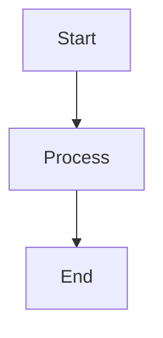

# Markdown Templates Index

**Location**: `05_DOCUMENTATION/MARKDOWN_TEMPLATES/`
**Purpose**: Comprehensive collection of GitHub Flavored Markdown templates and guides
**Last Updated**: 2025-12-28

---

## 📚 Available Templates

### 1. Complete Markdown Guide

**File**: [GITHUB_MARKDOWN_GUIDE.md](GITHUB_MARKDOWN_GUIDE.md)

**Purpose**: Comprehensive reference for GitHub Flavored Markdown syntax and advanced features

**Contents**:
- Basic formatting (headers, emphasis, lists)
- Advanced features (tables, code blocks, diagrams)
- GitHub-specific features (alerts, task lists, mentions)
- Mermaid diagrams (flowcharts, sequence, Gantt, class diagrams)
- Mathematical expressions (LaTeX)
- Collapsed sections, footnotes, emojis
- Best practices and quick reference

**Use When**: Learning GFM, creating complex documentation, reference guide

---

### 2. README Template

**File**: [README_TEMPLATE.md](README_TEMPLATE.md)

**Purpose**: Professional README template for GitHub repositories

**Includes**:
- Project badges (license, version, status)
- About section with features
- Installation instructions
- Usage examples (basic and advanced)
- Documentation links
- Contributing guidelines
- License and contact information

**Use When**: Starting new projects, improving existing READMEs

---

### 3. API Documentation Template

**File**: [API_DOCUMENTATION_TEMPLATE.md](API_DOCUMENTATION_TEMPLATE.md)

**Purpose**: Complete API documentation template with examples

**Includes**:
- Authentication methods
- Endpoint documentation (GET, POST, PUT, DELETE)
- Request/response examples
- Error handling and status codes
- Rate limiting information
- SDK examples (JavaScript, Python)

**Use When**: Documenting REST APIs, creating developer guides

---

### 4. Contributing Guidelines Template

**File**: [CONTRIBUTING_TEMPLATE.md](CONTRIBUTING_TEMPLATE.md)

**Purpose**: Comprehensive contributing guidelines for open-source projects

**Includes**:
- Code of conduct reference
- Bug reporting template
- Feature request template
- Pull request process and template
- Development setup instructions
- Style guidelines and code standards
- Commit message conventions
- Testing requirements

**Use When**: Setting up open-source projects, defining contribution standards

---

### 5. Changelog Template

**File**: [CHANGELOG_TEMPLATE.md](CHANGELOG_TEMPLATE.md)

**Purpose**: Structured changelog following Keep a Changelog format

**Includes**:
- Semantic versioning guide
- Change categories (Added, Changed, Deprecated, Removed, Fixed, Security)
- Version history examples
- Best practices for writing changelog entries
- Breaking change documentation
- Pre-release version formatting

**Use When**: Documenting releases, tracking project history

---

## 🎯 Quick Start

### Using Templates

1. **Copy the template** to your project directory
2. **Customize** sections relevant to your project
3. **Remove** placeholder text and examples
4. **Update** with your specific information

### Example Workflow

```bash
# Copy README template
cp MARKDOWN_TEMPLATES/README_TEMPLATE.md /your-project/README.md

# Edit with your project details
code /your-project/README.md

# Commit
git add README.md
git commit -m "docs: add project README"
```

---

## 📖 Template Usage Guide

### For New Projects

**Recommended Templates**:
1. README_TEMPLATE.md (required)
2. CONTRIBUTING_TEMPLATE.md (for open source)
3. CHANGELOG_TEMPLATE.md (for tracking releases)
4. API_DOCUMENTATION_TEMPLATE.md (if building API)

### For Existing Projects

**Improvement Priority**:
1. Update README with badges and better structure
2. Add CONTRIBUTING guidelines if missing
3. Start maintaining CHANGELOG
4. Document API if applicable

### For Documentation Sites

**Reference Guide**:
- Use GITHUB_MARKDOWN_GUIDE.md as syntax reference
- Implement advanced features (alerts, diagrams, math)
- Follow best practices for accessibility

---

## 🔧 Customization Tips

### Badges

Update badge URLs in README:

```markdown
[](LICENSE)
[](CHANGELOG.md)
```

Generate more at [shields.io](https://shields.io/)

### Mermaid Diagrams

Use diagrams for visual documentation:

````markdown

````

### Alerts

Highlight important information:

```markdown
> [!WARNING]
> This is a critical warning

> [!TIP]
> Helpful advice here
```

### Tables

Organize information clearly:

```markdown
| Feature | Status | Notes |
|---------|--------|-------|
| Auth    | ✅     | Complete |
| API     | 🚧     | In progress |
```

---

## 📋 Checklists

### Before Publishing README

- [ ] Project title and description clear
- [ ] Installation instructions complete
- [ ] Usage examples provided
- [ ] Contributing guidelines linked
- [ ] License specified
- [ ] Contact information included
- [ ] All links working
- [ ] Badges accurate and up-to-date

### Before Publishing API Docs

- [ ] All endpoints documented
- [ ] Authentication method explained
- [ ] Request/response examples included
- [ ] Error codes documented
- [ ] Rate limits specified
- [ ] SDK examples provided
- [ ] Postman collection available

### Before Publishing CHANGELOG

- [ ] All changes categorized correctly
- [ ] Version numbers follow semver
- [ ] Breaking changes highlighted
- [ ] Issue/PR numbers linked
- [ ] Release dates included
- [ ] Migration guides for breaking changes

---

## 🎨 Markdown Best Practices

### Readability

- Use **headers** to structure content
- Add **blank lines** between sections
- Keep **paragraphs short** (3-5 sentences)
- Use **lists** for better scanning
- Add **code blocks** for examples

### Accessibility

- Provide **alt text** for all images
- Use **semantic headers** (don't skip levels)
- Make **link text descriptive**
- Ensure **color contrast** in diagrams
- Test with **screen readers** when possible

### Maintenance

- **Review regularly** for outdated information
- **Update examples** to match current code
- **Fix broken links** promptly
- **Archive old versions** appropriately
- **Version documentation** with releases

---

## 🔗 External Resources

### Official Documentation

- [GitHub Docs - Writing on GitHub](https://docs.github.com/en/get-started/writing-on-github)
- [GitHub Flavored Markdown Spec](https://github.github.com/gfm/)
- [Keep a Changelog](https://keepachangelog.com/)
- [Semantic Versioning](https://semver.org/)

### Tools

- [Mermaid Live Editor](https://mermaid.live/) - Create diagrams
- [Shields.io](https://shields.io/) - Generate badges
- [Markdown Table Generator](https://www.tablesgenerator.com/markdown_tables) - Create tables
- [grip](https://github.com/joeyespo/grip) - Preview GitHub Markdown locally

### Style Guides

- [Google Developer Documentation Style Guide](https://developers.google.com/style)
- [Microsoft Writing Style Guide](https://learn.microsoft.com/en-us/style-guide/welcome/)
- [GitLab Documentation Style Guide](https://docs.gitlab.com/ee/development/documentation/styleguide/)

---

## 💡 Tips & Tricks

### Quick Formatting

```markdown
**Bold**: Ctrl/Cmd + B
*Italic*: Ctrl/Cmd + I
`Code`: Ctrl/Cmd + E
[Link]: Ctrl/Cmd + K
```

### Emoji Shortcuts

```markdown
:rocket: → 🚀
:tada: → 🎉
:bug: → 🐛
:sparkles: → ✨
```

[Full emoji list](https://github.com/ikatyang/emoji-cheat-sheet)

### Table Alignment

```markdown
| Left | Center | Right |
|:-----|:------:|------:|
| L    |   C    |     R |
```

### Collapsible Sections

```markdown
<details>
<summary>Click to expand</summary>
Hidden content here
</details>
```

---

## 📞 Support

**Questions about templates?**
- Create an issue in the project repository
- Reference the specific template in your question
- Include examples of what you're trying to achieve

**Template improvements?**
- Submit a pull request with your enhancements
- Follow the CONTRIBUTING guidelines
- Document your changes in the PR description

---

## 📝 Template Changelog

### 2025-12-28
- Initial template collection created
- 5 comprehensive templates added
- Index documentation completed

---

**Maintained by**: ENHANCED_SECOND_BRAIN_ENTERPRISE
**License**: Public Domain
**Feedback**: Welcome via issues or pull requests
