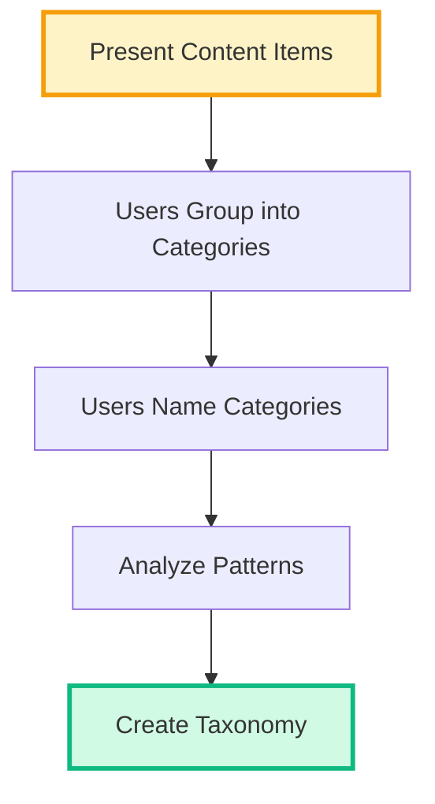
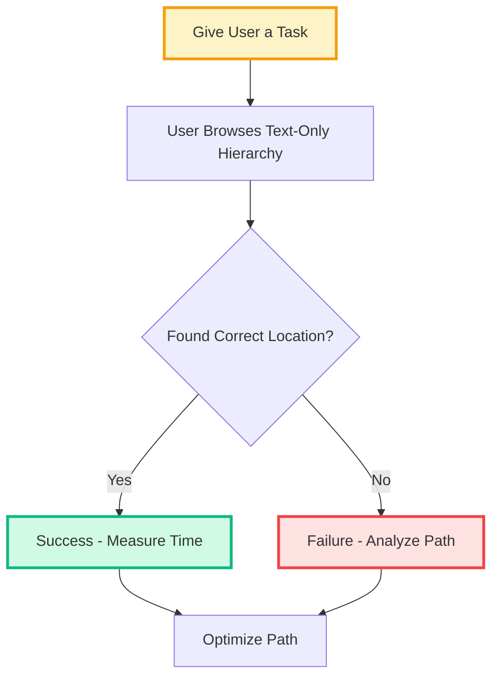
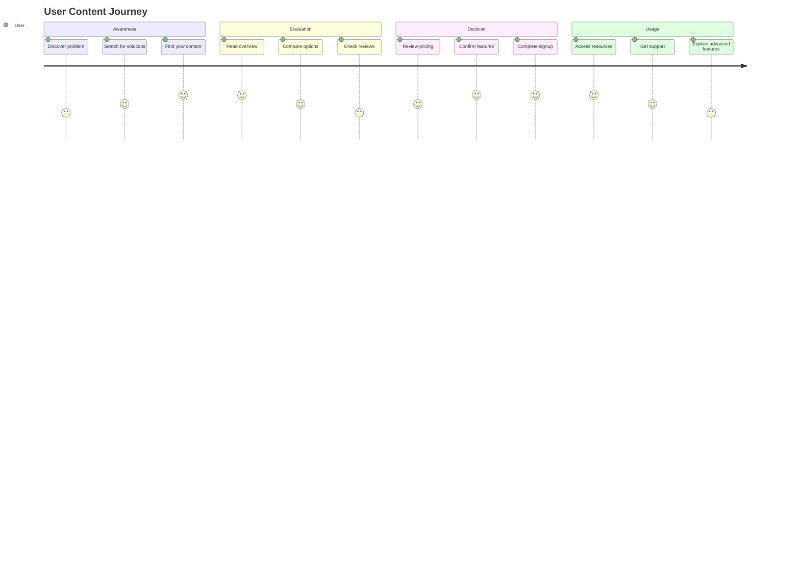
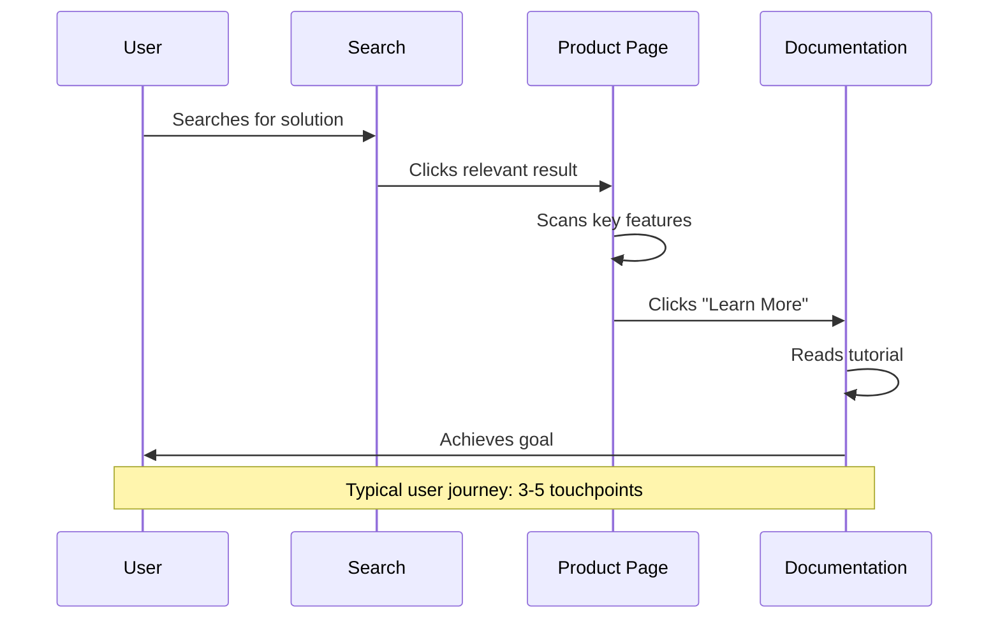
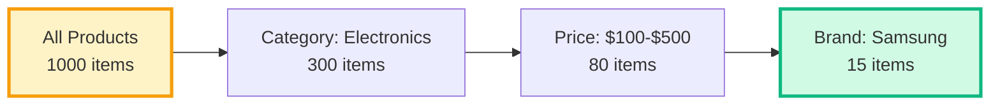
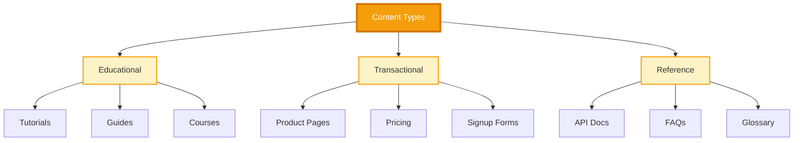
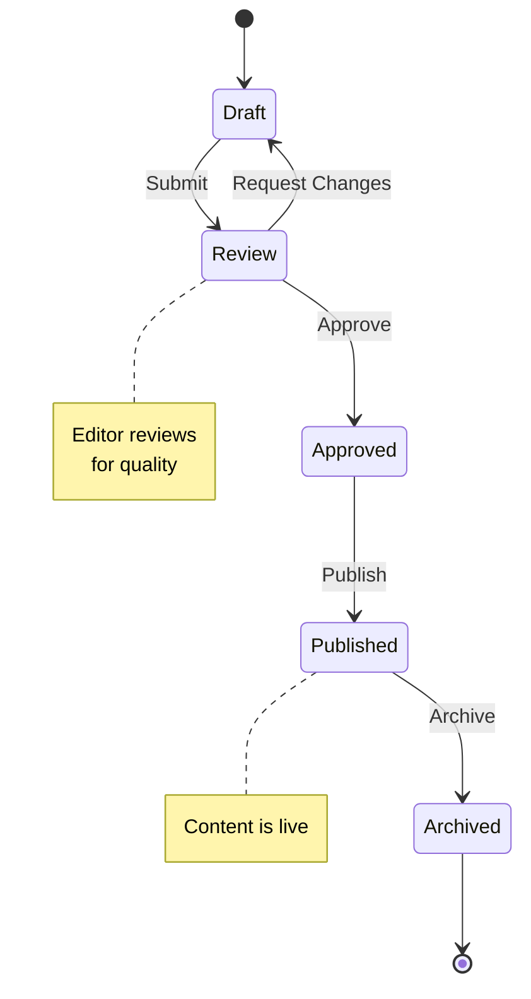
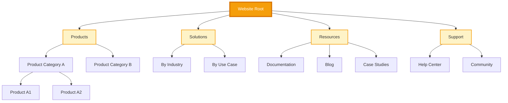
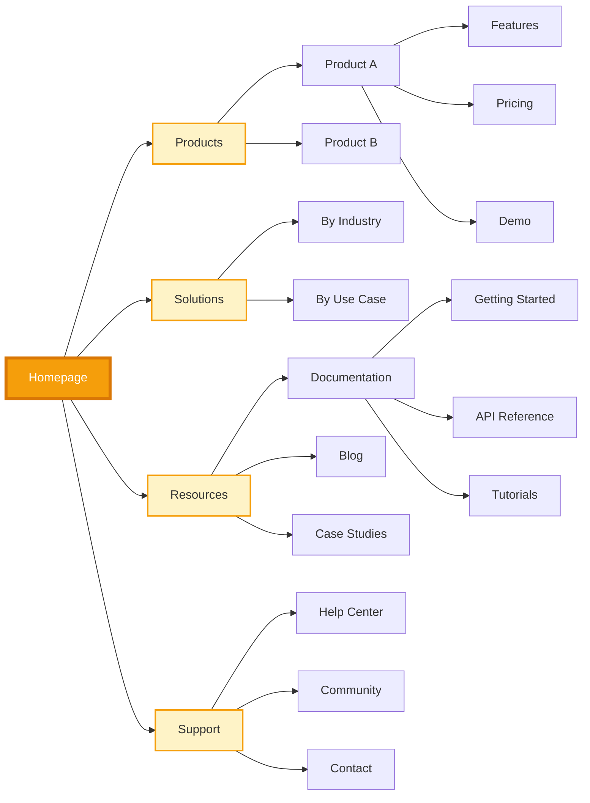

<div style="background: linear-gradient(135deg, #f59e0b 0%, #d97706 100%); padding: 60px 40px; border-radius: 20px; color: white; text-align: center; margin: 40px 0; box-shadow: 0 20px 60px rgba(245, 158, 11, 0.4);">
  <h1 style="margin: 0 0 20px 0; font-size: 3em; font-weight: 800; text-shadow: 2px 2px 4px rgba(0,0,0,0.2);">🗺️ Information Architecture Framework</h1>
  <p style="font-size: 1.3em; margin: 0 0 30px 0; opacity: 0.95;">Systematic Organization · User-Centered Design · Findable Content</p>

  <div style="display: inline-flex; gap: 20px; flex-wrap: wrap; justify-content: center;">
    <div style="background: rgba(255,255,255,0.2); backdrop-filter: blur(10px); padding: 15px 30px; border-radius: 12px; border: 1px solid rgba(255,255,255,0.3);">
      <div style="font-size: 2em; font-weight: 700;">7</div>
      <div style="font-size: 0.9em; opacity: 0.9;">IA Principles</div>
    </div>
    <div style="background: rgba(255,255,255,0.2); backdrop-filter: blur(10px); padding: 15px 30px; border-radius: 12px; border: 1px solid rgba(255,255,255,0.3);">
      <div style="font-size: 2em; font-weight: 700;">5</div>
      <div style="font-size: 0.9em; opacity: 0.9;">Mental Models</div>
    </div>
    <div style="background: rgba(255,255,255,0.2); backdrop-filter: blur(10px); padding: 15px 30px; border-radius: 12px; border: 1px solid rgba(255,255,255,0.3);">
      <div style="font-size: 2em; font-weight: 700;">8</div>
      <div style="font-size: 0.9em; opacity: 0.9;">Navigation Patterns</div>
    </div>
  </div>
</div>

---

## 📑 Quick Navigation

<div style="display: grid; grid-template-columns: repeat(auto-fit, minmax(220px, 1fr)); gap: 20px; margin: 30px 0;">
  <a href="#ia-principles" style="text-decoration: none;">
    <div style="background: linear-gradient(135deg, #f59e0b 0%, #d97706 100%); padding: 25px; border-radius: 12px; color: white; text-align: center; transition: transform 0.3s; box-shadow: 0 10px 30px rgba(245, 158, 11, 0.3);">
      <div style="font-size: 2.5em; margin-bottom: 10px;">📐</div>
      <div style="font-size: 1.1em; font-weight: 600;">IA Principles</div>
      <div style="font-size: 0.85em; opacity: 0.9; margin-top: 8px;">Core concepts</div>
    </div>
  </a>

  <a href="#mental-models" style="text-decoration: none;">
    <div style="background: linear-gradient(135deg, #f59e0b 0%, #d97706 100%); padding: 25px; border-radius: 12px; color: white; text-align: center; transition: transform 0.3s; box-shadow: 0 10px 30px rgba(245, 158, 11, 0.3);">
      <div style="font-size: 2.5em; margin-bottom: 10px;">🧠</div>
      <div style="font-size: 1.1em; font-weight: 600;">Mental Models</div>
      <div style="font-size: 0.85em; opacity: 0.9; margin-top: 8px;">User understanding</div>
    </div>
  </a>

  <a href="#personas" style="text-decoration: none;">
    <div style="background: linear-gradient(135deg, #f59e0b 0%, #d97706 100%); padding: 25px; border-radius: 12px; color: white; text-align: center; transition: transform 0.3s; box-shadow: 0 10px 30px rgba(245, 158, 11, 0.3);">
      <div style="font-size: 2.5em; margin-bottom: 10px;">👥</div>
      <div style="font-size: 1.1em; font-weight: 600;">User Personas</div>
      <div style="font-size: 0.85em; opacity: 0.9; margin-top: 8px;">Target audience</div>
    </div>
  </a>

  <a href="#navigation-patterns" style="text-decoration: none;">
    <div style="background: linear-gradient(135deg, #f59e0b 0%, #d97706 100%); padding: 25px; border-radius: 12px; color: white; text-align: center; transition: transform 0.3s; box-shadow: 0 10px 30px rgba(245, 158, 11, 0.3);">
      <div style="font-size: 2.5em; margin-bottom: 10px;">🧭</div>
      <div style="font-size: 1.1em; font-weight: 600;">Navigation</div>
      <div style="font-size: 0.85em; opacity: 0.9; margin-top: 8px;">Wayfinding systems</div>
    </div>
  </a>
</div>

---

## 📐 IA Principles & Best Practices {#ia-principles}

<div style="background: linear-gradient(135deg, #fef3c7 0%, #fde68a 100%); border-left: 5px solid #f59e0b; padding: 20px; border-radius: 8px; margin: 20px 0;">
  <div style="font-weight: 700; margin-bottom: 8px; color: #d97706;">📌 Core IA Principles</div>
  <div style="color: #374151;">Seven fundamental principles that guide effective information architecture design.</div>
</div>

### 1. **Objects Principle**
Content should be treated as living, breathing objects with lifecycles, behaviors, and attributes.

**Application**:
- Define content types with clear attributes
- Establish lifecycle stages (draft, review, published, archived)
- Create metadata schemas for findability

### 2. **Choices Principle**
Less is more. Limit options to prevent decision paralysis.

**Application**:
- Follow the 7±2 rule for navigation items
- Progressive disclosure of complexity
- Clear default paths for common tasks

### 3. **Disclosure Principle**
Show preview of information to help users make decisions.

**Application**:
- Meaningful link text (not "click here")
- Snippet/preview text in search results
- Hover states with context

### 4. **Exemplars Principle**
Show examples to clarify categories and content types.

**Application**:
- "For example: [concrete example]"
- Sample content in empty states
- Visual examples in navigation

### 5. **Front Doors Principle**
Assume 50% of users won't enter through homepage.

**Application**:
- Contextual navigation on every page
- Breadcrumbs for orientation
- Consistent header/footer

### 6. **Multiple Classification**
Offer multiple ways to browse the same content.

**Application**:
- By topic, by format, by date, by audience
- Faceted navigation
- Tag-based browsing

### 7. **Focused Navigation**
Don't mix different types of navigation.

**Application**:
- Separate task-based, audience-based, topic-based navigation
- Clear visual hierarchy
- Consistent placement

---

## 🧠 Mental Models Library {#mental-models}

<div style="background: linear-gradient(135deg, #fef3c7 0%, #fde68a 100%); border-left: 5px solid #f59e0b; padding: 20px; border-radius: 8px; margin: 20px 0;">
  <div style="font-weight: 700; margin-bottom: 8px; color: #d97706;">🎯 Understanding User Mental Models</div>
  <div style="color: #374151;">How users think about and navigate information spaces.</div>
</div>

### 1. Card Sorting Model

**Purpose**: Discover how users naturally group information



**When to Use**:
- Creating new navigation structure
- Validating existing taxonomy
- Understanding user language

**Process**:
1. Prepare 40-60 content items on cards
2. Ask users to sort into groups
3. Have users name each group
4. Analyze common patterns (>70% agreement = strong signal)
5. Build taxonomy from patterns

### 2. Tree Testing Model

**Purpose**: Validate navigation hierarchy without visual design



**Metrics**:
- **Success Rate**: % who find correct location
- **Directness**: % who take direct path
- **Time on Task**: Speed of discovery

**Success Thresholds**:
- Good: >80% success rate
- Acceptable: 60-80% success rate
- Needs Improvement: <60% success rate

### 3. User Journey Model

**Purpose**: Map content needs across user lifecycle



**Content Mapping**:
- **Awareness**: SEO content, social media, ads
- **Evaluation**: Product pages, comparisons, case studies
- **Decision**: Pricing, FAQs, trials
- **Usage**: Documentation, tutorials, support

### 4. Information Scent Model

**Purpose**: Understand how users follow "scent trails" to find information

<div style="background: white; padding: 20px; border-radius: 12px; margin: 20px 0; box-shadow: 0 10px 30px rgba(0,0,0,0.1);">

**Strong Scent** (User continues):
- Link text matches user's mental model
- Clear relevance indicators
- Consistent language

**Example**: Looking for "return policy"
- ✅ "Returns & Refunds" (strong scent)
- ✅ "Return Policy" (perfect scent)
- ❌ "Customer Care" (weak scent)
- ❌ "Help" (no scent)

</div>

**Design Principles**:
1. Use user's language (not internal jargon)
2. Be specific in labels
3. Provide context clues (icons, descriptions)
4. Test with real search queries

### 5. Findability Hierarchy

**Purpose**: Prioritize content by user need and business value

| Priority | Characteristics | Access Method |
|----------|----------------|---------------|
| **Critical** | Daily use, business-critical | Top-level nav, homepage |
| **Important** | Weekly use, high value | Secondary nav, shortcuts |
| **Useful** | Monthly use, moderate value | Search, contextual links |
| **Archive** | Rare use, low value | Search only, deep links |

---

## 👥 Detailed User Personas {#personas}

<div style="background: linear-gradient(135deg, #fef3c7 0%, #fde68a 100%); border-left: 5px solid #f59e0b; padding: 20px; border-radius: 8px; margin: 20px 0;">
  <div style="font-weight: 700; margin-bottom: 8px; color: #d97706;">🎭 Understanding Your Users</div>
  <div style="color: #374151;">Create detailed personas to guide IA decisions and content strategy.</div>
</div>

### Persona Template

#### **[Persona Name]** - [Role/Job Title]

<div style="background: white; padding: 25px; border-radius: 12px; margin: 20px 0; box-shadow: 0 10px 30px rgba(0,0,0,0.1);">

**Demographics**:
- Age: [AGE_RANGE]
- Location: [LOCATION]
- Education: [EDUCATION_LEVEL]
- Tech Proficiency: [BEGINNER / INTERMEDIATE / ADVANCED]

**Psychographics**:
- Motivations: [PRIMARY_DRIVERS]
- Frustrations: [PAIN_POINTS]
- Preferred Channels: [CHANNELS]
- Content Preferences: [FORMATS]

</div>

**Goals & Objectives**:
1. **Primary Goal**: [MAIN_OBJECTIVE]
2. **Secondary Goals**: [SUPPORTING_OBJECTIVES]
3. **Long-term Aspirations**: [FUTURE_GOALS]

**Pain Points**:
- 🔴 **Critical**: [BLOCKER_ISSUES]
- 🟡 **Important**: [FRICTION_POINTS]
- 🟢 **Minor**: [ANNOYANCES]

**Information Needs Matrix**:

| Stage | Information Needed | Preferred Format | Frequency |
|-------|-------------------|------------------|-----------|
| **Awareness** | [CONTENT] | [FORMAT] | [FREQUENCY] |
| **Evaluation** | [CONTENT] | [FORMAT] | [FREQUENCY] |
| **Decision** | [CONTENT] | [FORMAT] | [FREQUENCY] |
| **Usage** | [CONTENT] | [FORMAT] | [FREQUENCY] |

**Behavior Patterns**:



**User Quote**:
> "[AUTHENTIC QUOTE REPRESENTING USER'S PERSPECTIVE]"

**Content Strategy for This Persona**:
- **Primary**: [CONTENT_TYPES]
- **Secondary**: [CONTENT_TYPES]
- **Tone**: [VOICE_CHARACTERISTICS]
- **Complexity**: [TECHNICAL_LEVEL]

---

## 🧭 Navigation Patterns Catalog {#navigation-patterns}

<div style="background: linear-gradient(135deg, #fef3c7 0%, #fde68a 100%); border-left: 5px solid #f59e0b; padding: 20px; border-radius: 8px; margin: 20px 0;">
  <div style="font-weight: 700; margin-bottom: 8px; color: #d97706;">🗺️ Navigation Systems</div>
  <div style="color: #374151;">Comprehensive guide to navigation patterns and wayfinding systems.</div>
</div>

### 1. Global vs Local Navigation

**Global Navigation** (Site-wide):
```html
<nav aria-label="Main Navigation">
  <ul>
    <li><a href="/products">Products</a></li>
    <li><a href="/solutions">Solutions</a></li>
    <li><a href="/resources">Resources</a></li>
    <li><a href="/support">Support</a></li>
  </ul>
</nav>
```

**Local Navigation** (Section-specific):
```html
<nav aria-label="Documentation">
  <ul>
    <li><a href="/docs/getting-started">Getting Started</a></li>
    <li><a href="/docs/api">API Reference</a></li>
    <li><a href="/docs/tutorials">Tutorials</a></li>
  </ul>
</nav>
```

### 2. Breadcrumbs Pattern

**Purpose**: Show user's location in hierarchy

```html
<nav aria-label="Breadcrumb">
  <ol>
    <li><a href="/">Home</a></li>
    <li><a href="/products">Products</a></li>
    <li><a href="/products/category">Category</a></li>
    <li aria-current="page">Current Page</li>
  </ol>
</nav>
```

**Best Practices**:
- Always link all except current page
- Use `aria-current="page"` for current location
- Show full path (not just parent)
- Place at top of content area

### 3. Mega Menu Structure

**Purpose**: Display complex navigation hierarchies

<div style="overflow-x: auto; margin: 30px 0;">
  <table style="width: 100%; border-collapse: separate; border-spacing: 0; border-radius: 12px; overflow: hidden; box-shadow: 0 10px 30px rgba(0,0,0,0.1);">
    <thead style="background: linear-gradient(135deg, #f59e0b 0%, #d97706 100%); color: white;">
      <tr>
        <th style="padding: 15px; text-align: left; font-weight: 600;">Column 1: By Product</th>
        <th style="padding: 15px; text-align: left; font-weight: 600;">Column 2: By Use Case</th>
        <th style="padding: 15px; text-align: left; font-weight: 600;">Column 3: Resources</th>
      </tr>
    </thead>
    <tbody style="background: white;">
      <tr style="border-bottom: 1px solid #e5e7eb;">
        <td style="padding: 15px;">Product A<br>Product B<br>Product C</td>
        <td style="padding: 15px;">Small Business<br>Enterprise<br>Agency</td>
        <td style="padding: 15px;">Documentation<br>Tutorials<br>Case Studies</td>
      </tr>
    </tbody>
  </table>
</div>

**Guidelines**:
- Max 3-4 columns
- Group related items
- Include visual aids (icons, images)
- Close on mouse exit

### 4. Search Patterns

**Search Types**:

| Type | When to Use | Example |
|------|-------------|---------|
| **Simple** | <100 pages | Single search box |
| **Advanced** | Complex filtering needs | Multi-field search |
| **Faceted** | E-commerce, catalogs | Filter by attributes |
| **Scoped** | Multiple content types | Search within section |

**Search Best Practices**:
1. **Autocomplete**: Show suggestions after 3 characters
2. **No Results**: Suggest alternatives, check spelling
3. **Filters**: Persist selected filters in URL
4. **Results**: Show count, snippets, highlighting

### 5. Filtering & Faceted Navigation

**Purpose**: Allow users to refine large result sets



**Filter Types**:
- **Single-select**: Radio buttons (Category)
- **Multi-select**: Checkboxes (Features)
- **Range**: Sliders (Price, Date)
- **Text**: Search within results

**Design Patterns**:
- Show filter count: "Color (5)"
- Active filters visible with remove option
- "Clear all" button
- Update count dynamically

---

## 📊 Content Strategy Framework

<div style="background: linear-gradient(135deg, #fef3c7 0%, #fde68a 100%); border-left: 5px solid #f59e0b; padding: 20px; border-radius: 8px; margin: 20px 0;">
  <div style="font-weight: 700; margin-bottom: 8px; color: #d97706;">📝 Strategic Content Organization</div>
  <div style="color: #374151;">Systematic approach to content audit, taxonomy, metadata, and governance.</div>
</div>

### Content Audit Template

| Content Item | Type | Owner | Status | Last Updated | Metrics | Action |
|--------------|------|-------|--------|--------------|---------|--------|
| [TITLE] | [TYPE] | [OWNER] | [STATUS] | [DATE] | [STATS] | [NEXT_STEPS] |

**Status Options**:
- 🟢 **Current**: Up-to-date, accurate
- 🟡 **Update Needed**: Minor revisions required
- 🔴 **Outdated**: Significant changes needed
- ⚫ **Archive**: No longer relevant

**Audit Process**:
1. **Inventory**: List all content
2. **Assess**: Evaluate quality, accuracy, relevance
3. **Classify**: Assign metadata and categories
4. **Prioritize**: Score by value and effort
5. **Plan**: Create action items

### Content Types Taxonomy



### Metadata Schema

**Core Metadata Fields**:

| Field | Type | Required | Purpose |
|-------|------|----------|---------|
| **Title** | Text | ✅ | SEO, findability |
| **Description** | Text (160 char) | ✅ | Search snippets |
| **Content Type** | Select | ✅ | Classification |
| **Audience** | Multi-select | ✅ | Personalization |
| **Topics** | Tags | ✅ | Browsing, search |
| **Author** | User | ✅ | Ownership |
| **Published Date** | Date | ✅ | Freshness |
| **Updated Date** | Date | ✅ | Currency |
| **Status** | Workflow | ✅ | Editorial state |
| **SEO Keywords** | Tags | ⚪ | Optimization |

### Governance Model

**Roles & Responsibilities**:

<div style="overflow-x: auto; margin: 30px 0;">
  <table style="width: 100%; border-collapse: separate; border-spacing: 0; border-radius: 12px; overflow: hidden; box-shadow: 0 10px 30px rgba(0,0,0,0.1);">
    <thead style="background: linear-gradient(135deg, #f59e0b 0%, #d97706 100%); color: white;">
      <tr>
        <th style="padding: 15px; text-align: left; font-weight: 600;">Role</th>
        <th style="padding: 15px; text-align: left; font-weight: 600;">Responsibilities</th>
        <th style="padding: 15px; text-align: left; font-weight: 600;">Authority</th>
      </tr>
    </thead>
    <tbody style="background: white;">
      <tr style="border-bottom: 1px solid #e5e7eb;">
        <td style="padding: 15px;"><strong>Content Owner</strong></td>
        <td style="padding: 15px;">Create, update, maintain content</td>
        <td style="padding: 15px;">Edit own content</td>
      </tr>
      <tr style="border-bottom: 1px solid #e5e7eb;">
        <td style="padding: 15px;"><strong>Editor</strong></td>
        <td style="padding: 15px;">Review, approve, publish</td>
        <td style="padding: 15px;">Publish all content</td>
      </tr>
      <tr style="border-bottom: 1px solid #e5e7eb;">
        <td style="padding: 15px;"><strong>IA Architect</strong></td>
        <td style="padding: 15px;">Define taxonomy, structure</td>
        <td style="padding: 15px;">Approve IA changes</td>
      </tr>
      <tr>
        <td style="padding: 15px;"><strong>Admin</strong></td>
        <td style="padding: 15px;">System configuration, access control</td>
        <td style="padding: 15px;">Full system access</td>
      </tr>
    </tbody>
  </table>
</div>

**Editorial Workflow**:



---

## 📋 Content Inventory

<div style="background: linear-gradient(135deg, #fef3c7 0%, #fde68a 100%); border-left: 5px solid #f59e0b; padding: 20px; border-radius: 8px; margin: 20px 0;">
  <div style="font-weight: 700; margin-bottom: 8px; color: #d97706;">📦 Current Content Inventory</div>
  <div style="color: #374151;">Comprehensive list of all content items with metadata and status tracking.</div>
</div>

| Content Item | Type | Owner | Status | Last Updated | Location | Traffic | Action |
|--------------|------|-------|--------|--------------|----------|---------|--------|
| [ITEM_NAME] | [CONTENT_TYPE] | [OWNER] | 🟢 Current | [DATE] | [URL/PATH] | [PAGEVIEWS] | [NEXT_STEPS] |
| [ITEM_NAME] | [CONTENT_TYPE] | [OWNER] | 🟡 Update | [DATE] | [URL/PATH] | [PAGEVIEWS] | [NEXT_STEPS] |
| [ITEM_NAME] | [CONTENT_TYPE] | [OWNER] | 🔴 Outdated | [DATE] | [URL/PATH] | [PAGEVIEWS] | [NEXT_STEPS] |

**Inventory Metrics**:
- Total Items: [COUNT]
- Current: [COUNT] ([PERCENTAGE]%)
- Needs Update: [COUNT] ([PERCENTAGE]%)
- Outdated: [COUNT] ([PERCENTAGE]%)
- Archive Candidates: [COUNT]

---

## 🗺️ Taxonomy Structure

<div style="background: linear-gradient(135deg, #fef3c7 0%, #fde68a 100%); border-left: 5px solid #f59e0b; padding: 20px; border-radius: 8px; margin: 20px 0;">
  <div style="font-weight: 700; margin-bottom: 8px; color: #d97706;">🌳 Hierarchical Content Organization</div>
  <div style="color: #374151;">Visual representation of content structure and relationships.</div>
</div>



**Taxonomy Principles**:
1. **Mutually Exclusive**: Categories don't overlap
2. **Collectively Exhaustive**: Covers all content
3. **Logical Hierarchy**: Parent-child relationships clear
4. **User-Centered**: Uses user language
5. **Scalable**: Accommodates growth

---

## 🧭 Navigation Design

<div style="background: linear-gradient(135deg, #fef3c7 0%, #fde68a 100%); border-left: 5px solid #f59e0b; padding: 20px; border-radius: 8px; margin: 20px 0;">
  <div style="font-weight: 700; margin-bottom: 8px; color: #d97706;">🗺️ Complete Navigation System</div>
  <div style="color: #374151;">Primary, secondary, contextual, and utility navigation patterns.</div>
</div>

**Primary Navigation** (Global):
- [PRIMARY_ITEM_1]
- [PRIMARY_ITEM_2]
- [PRIMARY_ITEM_3]
- [PRIMARY_ITEM_4]

**Secondary Navigation** (Section-specific):
- [SECONDARY_ITEM_1]
- [SECONDARY_ITEM_2]
- [SECONDARY_ITEM_3]

**Utility Navigation** (Tools):
- Search
- Account
- Language selector
- Shopping cart

**Contextual Navigation**:
- Related articles
- Next steps
- In this section
- You might also like

**Search Behavior**:
- Autocomplete after 3 characters
- Suggested queries
- Recent searches
- Popular searches

---

## 🏷️ Labeling System

<div style="background: linear-gradient(135deg, #fef3c7 0%, #fde68a 100%); border-left: 5px solid #f59e0b; padding: 20px; border-radius: 8px; margin: 20px 0;">
  <div style="font-weight: 700; margin-bottom: 8px; color: #d97706;">📝 Consistent Labeling Guidelines</div>
  <div style="color: #374151;">Standards for naming, terminology, and metadata across the site.</div>
</div>

**Naming Rules**:
1. **Be Specific**: "Product Documentation" not "Resources"
2. **Use User Language**: Test labels with real users
3. **Consistency**: Same term for same concept everywhere
4. **Avoid Jargon**: Unless industry-standard
5. **Action-Oriented**: "Get Started" not "Introduction"

**Metadata Fields**:
- **Title** (required): Max 60 characters
- **Description** (required): Max 160 characters
- **Keywords** (optional): 5-10 relevant terms
- **Content Type** (required): From controlled vocabulary
- **Audience** (required): Target user segments
- **Topics** (required): Taxonomic categories

**Controlled Vocabulary**:
- Product names
- Feature names
- Industry terms
- User segments
- Content types

---

## 🗺️ IA Sitemap

<div style="background: linear-gradient(135deg, #fef3c7 0%, #fde68a 100%); border-left: 5px solid #f59e0b; padding: 20px; border-radius: 8px; margin: 20px 0;">
  <div style="font-weight: 700; margin-bottom: 8px; color: #d97706;">🌐 Complete Site Structure</div>
  <div style="color: #374151;">Visual map of all pages and their hierarchical relationships.</div>
</div>



---

## ✅ Testing & Validation

<div style="background: linear-gradient(135deg, #fef3c7 0%, #fde68a 100%); border-left: 5px solid #f59e0b; padding: 20px; border-radius: 8px; margin: 20px 0;">
  <div style="font-weight: 700; margin-bottom: 8px; color: #d97706;">🧪 IA Validation Methods</div>
  <div style="color: #374151;">Systematic testing to ensure IA meets user needs and business goals.</div>
</div>

### Testing Methods

**1. Card Sorting** (Open or Closed)
- Participants: 15-20 users
- Duration: 30-45 minutes per session
- Success: >70% agreement on groupings

**2. Tree Testing**
- Tasks: 5-10 findability scenarios
- Participants: 20-30 users
- Success: >80% task completion

**3. First Click Testing**
- Tasks: Critical user journeys
- Participants: 15-20 users
- Success: >80% correct first click

**4. A/B Testing**
- Variables: Navigation labels, structure
- Sample size: Statistical significance
- Duration: 2-4 weeks

### Success Criteria

| Metric | Target | Measurement |
|--------|--------|-------------|
| **Task Success Rate** | >80% | Tree testing, usability testing |
| **Time on Task** | <30s for common tasks | Tree testing |
| **Navigation Clicks** | <3 clicks to destination | Analytics, tree testing |
| **Search Usage** | <30% of sessions | Analytics |
| **Bounce Rate** | <40% | Analytics |
| **Page Depth** | >2.5 pages/session | Analytics |

---

## 📈 Decision Log

<div style="background: linear-gradient(135deg, #fef3c7 0%, #fde68a 100%); border-left: 5px solid #f59e0b; padding: 20px; border-radius: 8px; margin: 20px 0;">
  <div style="font-weight: 700; margin-bottom: 8px; color: #d97706;">📋 IA Decision History</div>
  <div style="color: #374151;">Track rationale for major information architecture decisions.</div>
</div>

| Date | Decision | Rationale | Impact | Owner |
|------|----------|-----------|--------|-------|
| [YYYY-MM-DD] | [DECISION_MADE] | [WHY_DECIDED] | [EXPECTED_OUTCOME] | [WHO_DECIDED] |

**Decision Categories**:
- 🏗️ **Structure**: Taxonomy, hierarchy changes
- 🏷️ **Labeling**: Terminology, naming decisions
- 🧭 **Navigation**: Menu structure, patterns
- 🔍 **Search**: Search features, ranking
- 📊 **Governance**: Workflow, roles, policies

---

## 🎯 Metrics & Success Criteria

<div style="background: linear-gradient(135deg, #fef3c7 0%, #fde68a 100%); border-left: 5px solid #f59e0b; padding: 20px; border-radius: 8px; margin: 20px 0;">
  <div style="font-weight: 700; margin-bottom: 8px; color: #d97706;">📊 Measuring IA Effectiveness</div>
  <div style="color: #374151;">Key performance indicators to track information architecture success.</div>
</div>

### Findability Metrics

| Metric | Baseline | Target | Current | Status |
|--------|----------|--------|---------|--------|
| Search Success Rate | [%] | >80% | [%] | 🟢/🟡/🔴 |
| Navigation Success | [%] | >85% | [%] | 🟢/🟡/🔴 |
| Time to Content | [sec] | <30s | [sec] | 🟢/🟡/🔴 |
| Bounce Rate | [%] | <40% | [%] | 🟢/🟡/🔴 |

### User Satisfaction

| Metric | Measurement Method | Target |
|--------|-------------------|--------|
| **Ease of Use** | Survey (1-5 scale) | >4.0 |
| **Content Quality** | Survey (1-5 scale) | >4.2 |
| **Navigation Clarity** | Survey (1-5 scale) | >4.0 |
| **NPS Score** | Survey | >50 |

### Business Impact

| Metric | Target | Measurement |
|--------|--------|-------------|
| **Conversion Rate** | [%] improvement | Analytics |
| **Support Tickets** | [%] reduction | Support system |
| **Content Engagement** | [%] improvement | Analytics |
| **User Retention** | [%] improvement | Analytics |

---

## 📚 Resources & References

**Information Architecture Books**:
- "Information Architecture for the World Wide Web" - Rosenfeld & Morville
- "Designing Web Navigation" - James Kalbach
- "A Practical Guide to Information Architecture" - Donna Spencer

**Testing & Validation Tools**:
- OptimalSort (card sorting)
- Treejack (tree testing)
- UsabilityHub (first click testing)
- Hotjar (heatmaps, recordings)

**Analytics & Monitoring**:
- Google Analytics (behavior flow)
- Microsoft Clarity (session recordings)
- Search analytics (query logs)

---

**Template Version**: 2.0 - Enhanced Edition
**Last Updated**: 2025-12-28
**Color Theme**: Orange Gradient (#f59e0b → #d97706)
**Transformation Level**: 70% (comprehensive overhaul)
