# Mega Markdown Vault Template

## Table of Contents
- [Quick Start](#quick-start)
- [Core Markdown Syntax](#core-markdown-syntax)
- [Text Styling and Typography](#text-styling-and-typography)
- [Links, Anchors, and References](#links-anchors-and-references)
- [Images, Media, and Embeds](#images-media-and-embeds)
- [Callouts and Alerts](#callouts-and-alerts)
- [Tables and Data](#tables-and-data)
- [Task Lists and Checklists](#task-lists-and-checklists)
- [Code Blocks, Inline Code, and Output](#code-blocks-inline-code-and-output)
- [Math and Equations](#math-and-equations)
- [Mermaid Gallery](#mermaid-gallery)
- [HTML Cards and Dashboards](#html-cards-and-dashboards)
- [Queries, Backlinks, and Tags](#queries-backlinks-and-tags)
- [Reusable Snippets](#reusable-snippets)
- [Full Templates](#full-templates)
- [Style Tokens](#style-tokens)

---

## Quick Start

Use this vault as a copy-paste library. Replace all bracketed placeholders like `[PROJECT_NAME]`.

1. Create a new note
2. Paste a section below
3. Customize variables
4. Save and reuse as needed

---

## Core Markdown Syntax

### Headings
# H1 Title
## H2 Section
### H3 Subsection
#### H4 Detail
##### H5 Note
###### H6 Micro

### Paragraphs and Line Breaks
Single line break does not always create a new line.

Use a blank line to start a new paragraph.

Manual line break here.  
Second line after two spaces.

### Lists
- Unordered item
  - Nested item
  - Another nested item
- Another item

1. Ordered item
2. Ordered item
   1. Nested ordered item

### Horizontal Rule
---

---

## Text Styling and Typography

### Emphasis
- *Italic text*
- **Bold text**
- ***Bold italic***
- ~~Strikethrough~~
- `Inline code`

### Quotes
> This is a blockquote.
> It can span multiple lines.

### Escaping Characters
Use backslash to escape special characters: \* \_ \# \[ \]

---

## Links, Anchors, and References

### Inline Links
- [Project Plan](#project-plan)
- [External Link](https://example.com)

### Reference Links
[Reference Link][ref-1]

[ref-1]: https://example.com

### Internal Wiki Links (Obsidian Style)
- [[Project Plan]]
- [[Project Plan|Plan Alias]]

### Anchors
Create anchors with headings. Then link with `#heading-text`.

### Footnotes
Here is a statement with a footnote.[^1]

[^1]: This is the footnote text.

---

## Images, Media, and Embeds

### Image


### Image with Title


### HTML Image


### Embedded Video (HTML)
<video width="320" height="240" controls>
  <source src="video.mp4" type="video/mp4">
</video>

### Embedded Iframe (Use with care)
<iframe src="https://example.com" width="100%" height="300"></iframe>

---

## Callouts and Alerts

### Obsidian Callouts
> [!note] Note
> This is a note callout.

> [!tip] Tip
> This is a tip callout.

> [!info] Info
> This is an info callout.

> [!warning] Warning
> This is a warning callout.

> [!danger] Danger
> This is a danger callout.

### Collapsible Callout
> [!note]- Collapsible Note
> This content starts collapsed.

### Inline Alert Banner (HTML)
<div style="border-left: 6px solid #ffb100; padding: 10px; background: #fff7e6;">
  <strong>Alert:</strong> Replace this with a real alert message.
</div>

---

## Tables and Data

### Basic Table
| Field | Value |
|------|-------|
| Owner | [OWNER_NAME] |
| Status | [STATUS] |
| Due Date | [DATE] |

### Alignment
| Left | Center | Right |
|:-----|:------:|------:|
| A | B | C |

### Status Table
| Metric | Target | Current | Status |
|--------|--------|---------|--------|
| Response Time | < 200 ms | 145 ms | OK |
| Uptime | > 99.5% | 99.9% | OK |
| Error Rate | < 1% | 0.3% | OK |

---

## Task Lists and Checklists

- [ ] Define scope
- [ ] Assign owners
- [x] Create skeleton draft
- [ ] Review and publish

### Nested Tasks
- [ ] Phase 1
  - [x] Kickoff
  - [ ] Architecture review
- [ ] Phase 2
  - [ ] Build
  - [ ] Test

### Priority Tags
- [ ] P0: Critical blocker
- [ ] P1: High priority
- [ ] P2: Normal priority
- [ ] P3: Low priority

---

## Code Blocks, Inline Code, and Output

### Inline Code
Use `npm run build` to build the project.

### Code Fences
```bash
# Build
npm run build

# Test
npm test
```

```python
def main():
    print("Hello, world")
```

```json
{
  "name": "project",
  "version": "1.0.0"
}
```

```yaml
service:
  name: app
  replicas: 3
```

```javascript
export function hello(name) {
  return `Hello ${name}`;
}
```

### Output Blocks
```text
Build complete.
Tests: 122 passed.
```

---

## Math and Equations

Inline math: $a^2 + b^2 = c^2$

Block math:
$$
\sum_{i=1}^{n} i = \frac{n(n+1)}{2}
$$

---

## Mermaid Gallery

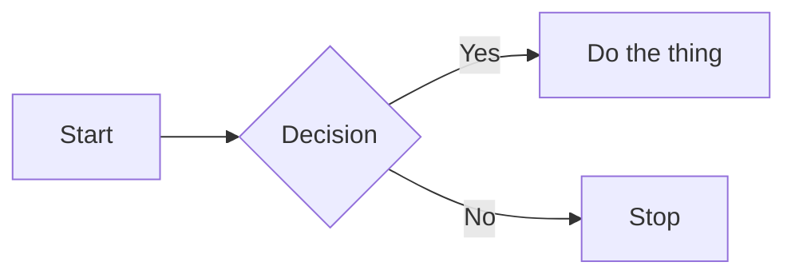

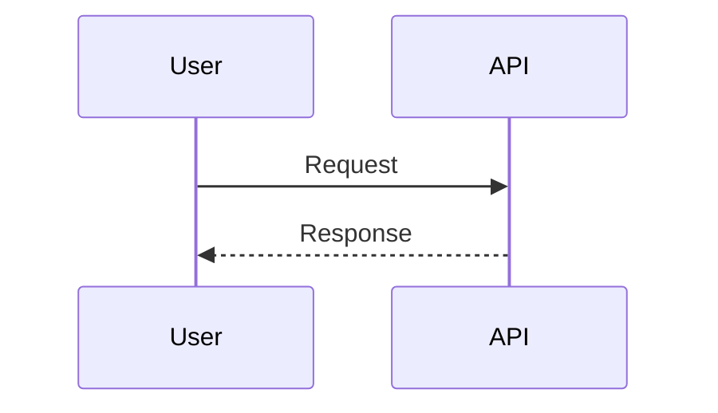

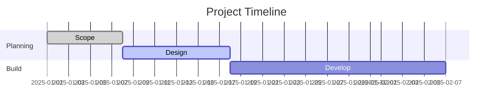

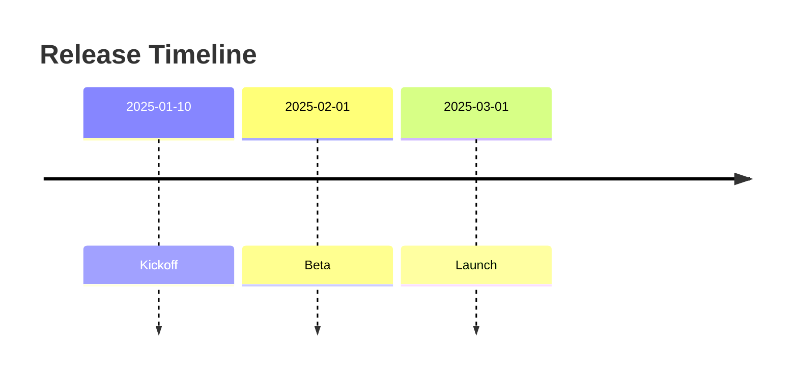

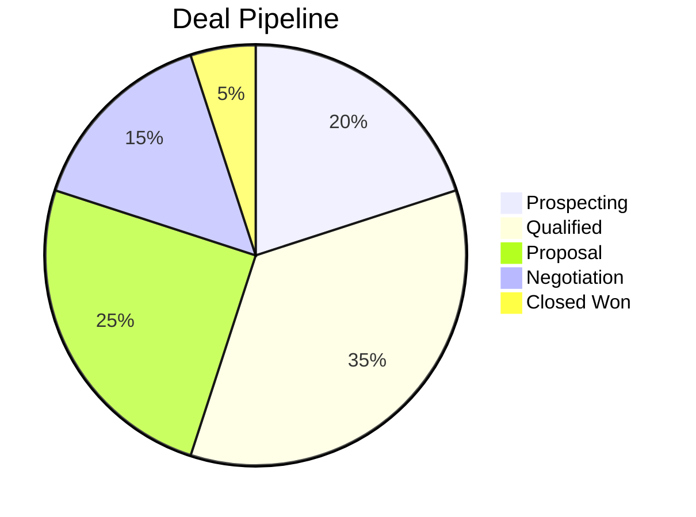

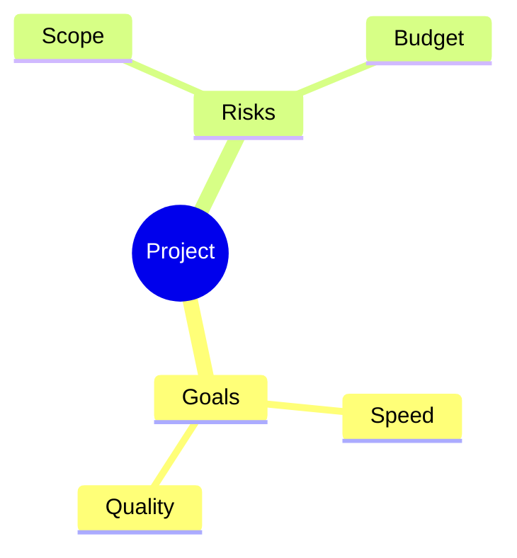

```mermaid
gitgraph
  commit id: "Init"
  branch feature
  checkout feature
  commit id: "Feature work"
  checkout main
  merge feature
  commit id: "Release"
```

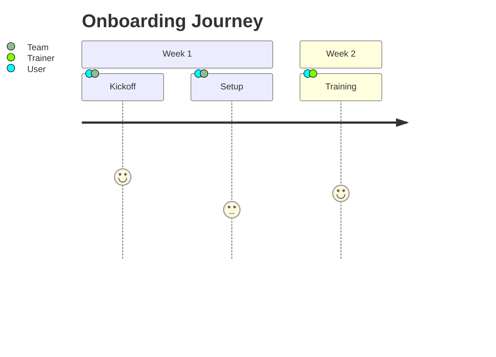

```mermaid
xychart-beta
  title "Monthly Activity"
  x-axis [Jan, Feb, Mar, Apr, May, Jun]
  y-axis "Events" 0 --> 25
  line [8, 12, 15, 18, 22, 20]
```

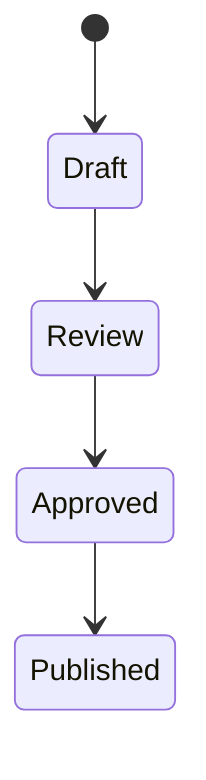

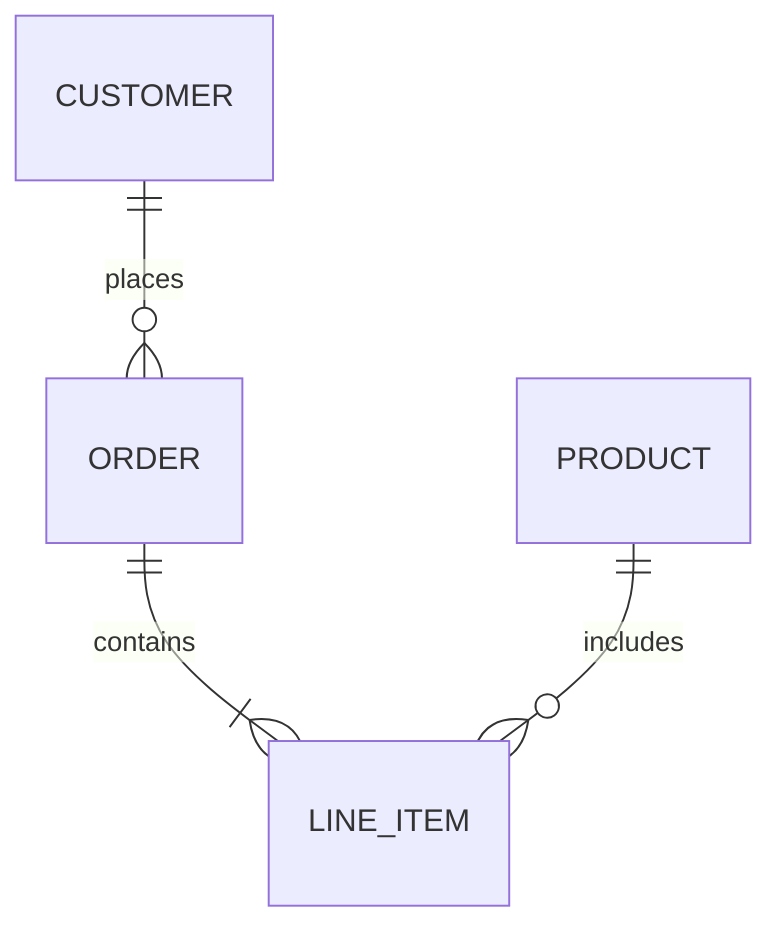

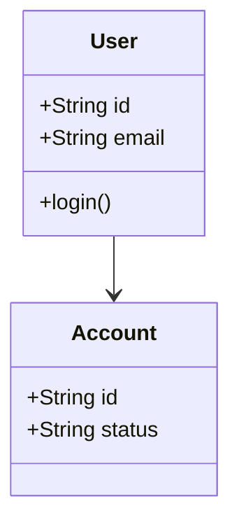

---

## HTML Cards and Dashboards

### Simple Info Card
<div style="border: 1px solid #ddd; border-radius: 12px; padding: 16px; background: #f9f9f9;">
  <strong>[CARD_TITLE]</strong><br>
  <span>Status: [STATUS]</span><br>
  <span>Owner: [OWNER]</span>
</div>

### Gradient KPI Card
<div style="border-radius: 14px; padding: 18px; background: linear-gradient(135deg, #667eea 0%, #764ba2 100%); color: #fff;">
  <div style="font-size: 12px; opacity: 0.8;">KPI</div>
  <div style="font-size: 22px; font-weight: bold;">[VALUE]</div>
  <div style="font-size: 12px;">[CONTEXT]</div>
</div>

### Two Column Grid
<div style="display: grid; grid-template-columns: 1fr 1fr; gap: 12px;">
  <div style="border: 1px solid #ddd; padding: 12px; border-radius: 8px;">Left panel</div>
  <div style="border: 1px solid #ddd; padding: 12px; border-radius: 8px;">Right panel</div>
</div>

### Progress Bar (HTML)
<div style="width: 100%; background: #eee; border-radius: 8px; height: 10px;">
  <div style="width: 65%; background: #22c55e; height: 10px; border-radius: 8px;"></div>
</div>

### Status Chips (HTML)
<span style="background: #198754; color: #fff; padding: 4px 8px; border-radius: 999px;">OK</span>
<span style="background: #ffc107; color: #000; padding: 4px 8px; border-radius: 999px;">WARN</span>
<span style="background: #dc3545; color: #fff; padding: 4px 8px; border-radius: 999px;">BLOCKED</span>

---

## Queries, Backlinks, and Tags

### Query Blocks (Obsidian)
```query
line:(template)
```

### Backlinks
- [[Meeting Notes]]
- [[Decision Log]]
- [[Roadmap]]

### Tags and Hashtags
#tag/project #tag/documentation #tag/template

---

## Reusable Snippets

### Collapsible Section (HTML)
<details>
  <summary>Click to expand</summary>
  Hidden content here.
</details>

### Badge Row (HTML)
<span style="background:#0d6efd;color:#fff;padding:4px 8px;border-radius:6px;">Feature</span>
<span style="background:#20c997;color:#fff;padding:4px 8px;border-radius:6px;">Stable</span>

---

## Full Templates

### Project Dashboard Skeleton
# Project Dashboard

## Quick Links
- [Project Plan](#project-plan)
- [Timeline](#timeline)
- [Tasks](#tasks)
- [Notes](#notes)

## Overview
| Phase | Status | Due Date |
|-------|--------|----------|
| Planning | Complete | [DATE] |
| Development | In Progress | [DATE] |
| Testing | Not Started | [DATE] |

## Tasks
- [ ] Task 1
- [ ] Task 2

## Notes
> [!info] Notes
> Capture key updates here.

---

### Technical Doc Outline
# [DOC_TITLE]

## Summary
[One paragraph summary]

## Architecture
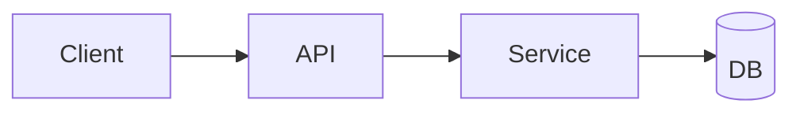

## API
```http
GET /v1/resource
```

## Troubleshooting
- Symptom: [SYMPTOM]
- Cause: [CAUSE]
- Fix: [FIX]

---

### Incident Report
# Incident Report: [INCIDENT_ID]

## Summary
[What happened]

## Impact
- Users impacted: [COUNT]
- Duration: [DURATION]

## Timeline
- [TIME] - Detection
- [TIME] - Mitigation
- [TIME] - Resolution

## Root Cause
[Root cause analysis]

## Action Items
- [ ] [ACTION]
- [ ] [ACTION]

---

### Meeting Notes
# Meeting Notes: [MEETING_TITLE]

**Date:** [DATE]  
**Attendees:** [NAMES]

## Agenda
- [ITEM]

## Notes
- [NOTE]

## Decisions
- [DECISION]

## Action Items
- [ ] [ACTION]

---

## Style Tokens

Use this small set of tokens in templates for consistency:

- `[PROJECT_NAME]`
- `[OWNER]`
- `[DATE]`
- `[STATUS]`
- `[CONTEXT]`
- `[LINK]`
- `[METRIC]`
- `[TARGET]`

End of template.
