<div style="background: linear-gradient(135deg, #06b6d4 0%, #0891b2 100%); padding: 60px 40px; border-radius: 20px; color: white; text-align: center; margin: 40px 0; box-shadow: 0 20px 60px rgba(6, 182, 212, 0.4);">
  <h1 style="margin: 0 0 20px 0; font-size: 3em; font-weight: 800; text-shadow: 2px 2px 4px rgba(0,0,0,0.2);">📊 Mermaid Diagram Gallery</h1>
  <p style="font-size: 1.3em; margin: 0 0 30px 0; opacity: 0.95;">Complete Visual Documentation Toolkit · 12 Diagram Types · Production Examples</p>

  <div style="display: inline-flex; gap: 20px; flex-wrap: wrap; justify-content: center;">
    <div style="background: rgba(255,255,255,0.2); backdrop-filter: blur(10px); padding: 15px 30px; border-radius: 12px; border: 1px solid rgba(255,255,255,0.3);">
      <div style="font-size: 2em; font-weight: 700;">12</div>
      <div style="font-size: 0.9em; opacity: 0.9;">Diagram Types</div>
    </div>
    <div style="background: rgba(255,255,255,0.2); backdrop-filter: blur(10px); padding: 15px 30px; border-radius: 12px; border: 1px solid rgba(255,255,255,0.3);">
      <div style="font-size: 2em; font-weight: 700;">50+</div>
      <div style="font-size: 0.9em; opacity: 0.9;">Code Examples</div>
    </div>
    <div style="background: rgba(255,255,255,0.2); backdrop-filter: blur(10px); padding: 15px 30px; border-radius: 12px; border: 1px solid rgba(255,255,255,0.3);">
      <div style="font-size: 2em; font-weight: 700;">100%</div>
      <div style="font-size: 0.9em; opacity: 0.9;">GitHub Compatible</div>
    </div>
  </div>
</div>

---

## 🎯 Quick Navigation Dashboard

<div style="display: grid; grid-template-columns: repeat(auto-fit, minmax(240px, 1fr)); gap: 20px; margin: 30px 0;">
  <a href="#flowchart-diagrams" style="text-decoration: none;">
    <div style="background: linear-gradient(135deg, #06b6d4 0%, #0891b2 100%); padding: 24px; border-radius: 16px; color: white; text-align: center; transition: transform 0.2s; box-shadow: 0 4px 12px rgba(6,182,212,0.3);">
      <div style="font-size: 2em; margin-bottom: 10px;">🔄</div>
      <div style="font-weight: 700; font-size: 1.1em;">Flowcharts</div>
      <div style="font-size: 0.85em; opacity: 0.9; margin-top: 8px;">Decision flows & processes</div>
    </div>
  </a>

  <a href="#sequence-diagrams" style="text-decoration: none;">
    <div style="background: linear-gradient(135deg, #06b6d4 0%, #0891b2 100%); padding: 24px; border-radius: 16px; color: white; text-align: center; transition: transform 0.2s; box-shadow: 0 4px 12px rgba(6,182,212,0.3);">
      <div style="font-size: 2em; margin-bottom: 10px;">💬</div>
      <div style="font-weight: 700; font-size: 1.1em;">Sequences</div>
      <div style="font-size: 0.85em; opacity: 0.9; margin-top: 8px;">API & system interactions</div>
    </div>
  </a>

  <a href="#gantt-charts" style="text-decoration: none;">
    <div style="background: linear-gradient(135deg, #06b6d4 0%, #0891b2 100%); padding: 24px; border-radius: 16px; color: white; text-align: center; transition: transform 0.2s; box-shadow: 0 4px 12px rgba(6,182,212,0.3);">
      <div style="font-size: 2em; margin-bottom: 10px;">📅</div>
      <div style="font-weight: 700; font-size: 1.1em;">Gantt Charts</div>
      <div style="font-size: 0.85em; opacity: 0.9; margin-top: 8px;">Project timelines</div>
    </div>
  </a>

  <a href="#state-diagrams" style="text-decoration: none;">
    <div style="background: linear-gradient(135deg, #06b6d4 0%, #0891b2 100%); padding: 24px; border-radius: 16px; color: white; text-align: center; transition: transform 0.2s; box-shadow: 0 4px 12px rgba(6,182,212,0.3);">
      <div style="font-size: 2em; margin-bottom: 10px;">🎛️</div>
      <div style="font-weight: 700; font-size: 1.1em;">State Machines</div>
      <div style="font-size: 0.85em; opacity: 0.9; margin-top: 8px;">Application states</div>
    </div>
  </a>

  <a href="#class-diagrams" style="text-decoration: none;">
    <div style="background: linear-gradient(135deg, #06b6d4 0%, #0891b2 100%); padding: 24px; border-radius: 16px; color: white; text-align: center; transition: transform 0.2s; box-shadow: 0 4px 12px rgba(6,182,212,0.3);">
      <div style="font-size: 2em; margin-bottom: 10px;">🏗️</div>
      <div style="font-weight: 700; font-size: 1.1em;">Class Diagrams</div>
      <div style="font-size: 0.85em; opacity: 0.9; margin-top: 8px;">Object-oriented design</div>
    </div>
  </a>

  <a href="#er-diagrams" style="text-decoration: none;">
    <div style="background: linear-gradient(135deg, #06b6d4 0%, #0891b2 100%); padding: 24px; border-radius: 16px; color: white; text-align: center; transition: transform 0.2s; box-shadow: 0 4px 12px rgba(6,182,212,0.3);">
      <div style="font-size: 2em; margin-bottom: 10px;">🗄️</div>
      <div style="font-weight: 700; font-size: 1.1em;">ER Diagrams</div>
      <div style="font-size: 0.85em; opacity: 0.9; margin-top: 8px;">Database relationships</div>
    </div>
  </a>

  <a href="#gitgraph-diagrams" style="text-decoration: none;">
    <div style="background: linear-gradient(135deg, #06b6d4 0%, #0891b2 100%); padding: 24px; border-radius: 16px; color: white; text-align: center; transition: transform 0.2s; box-shadow: 0 4px 12px rgba(6,182,212,0.3);">
      <div style="font-size: 2em; margin-bottom: 10px;">🌿</div>
      <div style="font-weight: 700; font-size: 1.1em;">Git Graphs</div>
      <div style="font-size: 0.85em; opacity: 0.9; margin-top: 8px;">Branch workflows</div>
    </div>
  </a>

  <a href="#journey-maps" style="text-decoration: none;">
    <div style="background: linear-gradient(135deg, #06b6d4 0%, #0891b2 100%); padding: 24px; border-radius: 16px; color: white; text-align: center; transition: transform 0.2s; box-shadow: 0 4px 12px rgba(6,182,212,0.3);">
      <div style="font-size: 2em; margin-bottom: 10px;">🗺️</div>
      <div style="font-weight: 700; font-size: 1.1em;">Journey Maps</div>
      <div style="font-size: 0.85em; opacity: 0.9; margin-top: 8px;">User experiences</div>
    </div>
  </a>

  <a href="#pie-charts" style="text-decoration: none;">
    <div style="background: linear-gradient(135deg, #06b6d4 0%, #0891b2 100%); padding: 24px; border-radius: 16px; color: white; text-align: center; transition: transform 0.2s; box-shadow: 0 4px 12px rgba(6,182,212,0.3);">
      <div style="font-size: 2em; margin-bottom: 10px;">📊</div>
      <div style="font-weight: 700; font-size: 1.1em;">Pie Charts</div>
      <div style="font-size: 0.85em; opacity: 0.9; margin-top: 8px;">Data distribution</div>
    </div>
  </a>

  <a href="#mindmaps" style="text-decoration: none;">
    <div style="background: linear-gradient(135deg, #06b6d4 0%, #0891b2 100%); padding: 24px; border-radius: 16px; color: white; text-align: center; transition: transform 0.2s; box-shadow: 0 4px 12px rgba(6,182,212,0.3);">
      <div style="font-size: 2em; margin-bottom: 10px;">🧠</div>
      <div style="font-weight: 700; font-size: 1.1em;">Mindmaps</div>
      <div style="font-size: 0.85em; opacity: 0.9; margin-top: 8px;">Idea organization</div>
    </div>
  </a>

  <a href="#timeline-diagrams" style="text-decoration: none;">
    <div style="background: linear-gradient(135deg, #06b6d4 0%, #0891b2 100%); padding: 24px; border-radius: 16px; color: white; text-align: center; transition: transform 0.2s; box-shadow: 0 4px 12px rgba(6,182,212,0.3);">
      <div style="font-size: 2em; margin-bottom: 10px;">⏰</div>
      <div style="font-weight: 700; font-size: 1.1em;">Timelines</div>
      <div style="font-size: 0.85em; opacity: 0.9; margin-top: 8px;">Historical events</div>
    </div>
  </a>

  <a href="#xy-charts" style="text-decoration: none;">
    <div style="background: linear-gradient(135deg, #06b6d4 0%, #0891b2 100%); padding: 24px; border-radius: 16px; color: white; text-align: center; transition: transform 0.2s; box-shadow: 0 4px 12px rgba(6,182,212,0.3);">
      <div style="font-size: 2em; margin-bottom: 10px;">📈</div>
      <div style="font-weight: 700; font-size: 1.1em;">XY Charts</div>
      <div style="font-size: 0.85em; opacity: 0.9; margin-top: 8px;">Trend analysis</div>
    </div>
  </a>
</div>

---

<a name="flowchart-diagrams"></a>
## 🔄 Flowchart Diagrams

<div style="background: white; border-left: 4px solid #06b6d4; padding: 24px; margin: 20px 0; border-radius: 8px; box-shadow: 0 2px 8px rgba(0,0,0,0.1);">
  <h3 style="margin: 0 0 12px 0; color: #06b6d4;">📘 Purpose</h3>
  <p style="margin: 0; color: #4b5563;">Visualize decision-making processes, workflows, and algorithmic logic with directional flow control.</p>
</div>

### Basic Flowchart
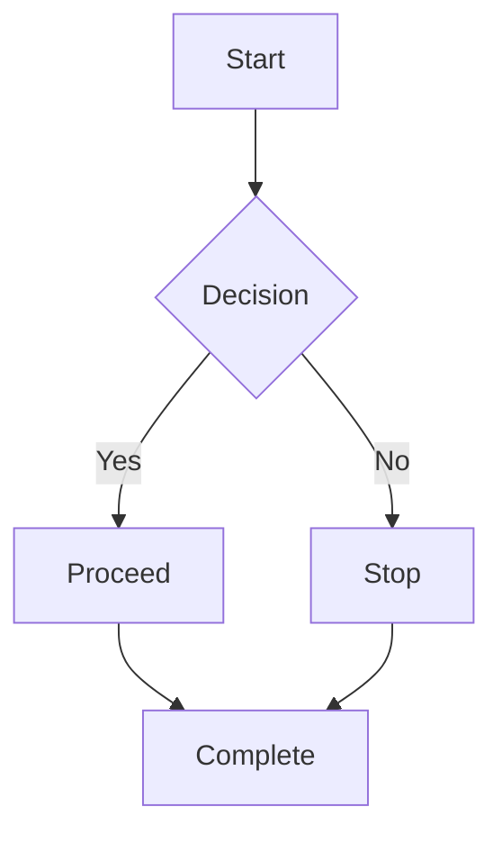
```mermaid
flowchart TD
  A[Start] --> B{Decision}
  B -->|Yes| C[Proceed]
  B -->|No| D[Stop]
  C --> E[Complete]
  D --> E
```

### Complex User Authentication Flow
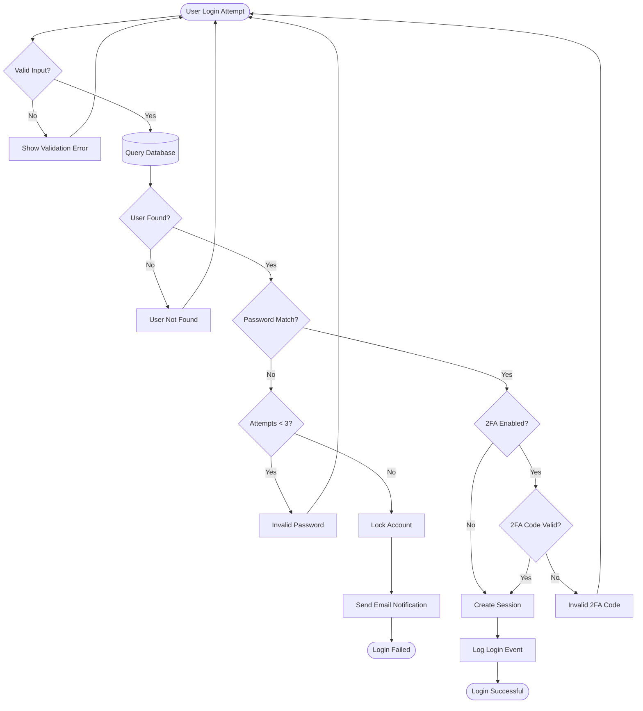
```mermaid
flowchart TB
  Start([User Login Attempt]) --> CheckInput{Valid Input?}
  CheckInput -->|No| Error1[Show Validation Error]
  Error1 --> Start
  CheckInput -->|Yes| QueryDB[(Query Database)]
  QueryDB --> UserExists{User Found?}
  UserExists -->|No| Error2[User Not Found]
  Error2 --> Start
  UserExists -->|Yes| CheckPassword{Password Match?}
  CheckPassword -->|No| Attempts{Attempts < 3?}
  Attempts -->|Yes| Error3[Invalid Password]
  Error3 --> Start
  Attempts -->|No| LockAccount[Lock Account]
  LockAccount --> Notify[Send Email Notification]
  Notify --> End([Login Failed])
  CheckPassword -->|Yes| Check2FA{2FA Enabled?}
  Check2FA -->|No| CreateSession[Create Session]
  Check2FA -->|Yes| Verify2FA{2FA Code Valid?}
  Verify2FA -->|No| Error4[Invalid 2FA Code]
  Error4 --> Start
  Verify2FA -->|Yes| CreateSession
  CreateSession --> LogActivity[Log Login Event]
  LogActivity --> Success([Login Successful])
```

### Deployment Pipeline Flowchart
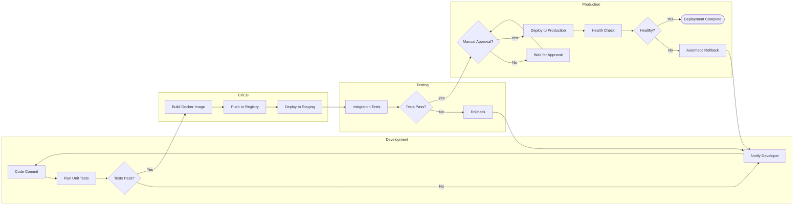
```mermaid
flowchart LR
  subgraph "Development"
    A[Code Commit] --> B[Run Unit Tests]
    B --> C{Tests Pass?}
    C -->|No| D[Notify Developer]
    D --> A
  end

  subgraph "CI/CD"
    C -->|Yes| E[Build Docker Image]
    E --> F[Push to Registry]
    F --> G[Deploy to Staging]
  end

  subgraph "Testing"
    G --> H[Integration Tests]
    H --> I{Tests Pass?}
    I -->|No| J[Rollback]
    J --> D
  end

  subgraph "Production"
    I -->|Yes| K{Manual Approval?}
    K -->|No| L[Wait for Approval]
    L --> K
    K -->|Yes| M[Deploy to Production]
    M --> N[Health Check]
    N --> O{Healthy?}
    O -->|No| P[Automatic Rollback]
    P --> D
    O -->|Yes| Q([Deployment Complete])
  end
```

### Flowchart Syntax Reference

<div style="background: #f9fafb; border-radius: 12px; padding: 24px; margin: 20px 0; border: 1px solid #e5e7eb;">
  <table style="width: 100%; border-collapse: collapse;">
    <thead>
      <tr style="background: linear-gradient(135deg, #06b6d4 0%, #0891b2 100%); color: white;">
        <th style="padding: 12px; text-align: left; border: 1px solid rgba(255,255,255,0.2);">Node Shape</th>
        <th style="padding: 12px; text-align: left; border: 1px solid rgba(255,255,255,0.2);">Syntax</th>
        <th style="padding: 12px; text-align: left; border: 1px solid rgba(255,255,255,0.2);">Usage</th>
      </tr>
    </thead>
    <tbody>
      <tr style="background: white;">
        <td style="padding: 10px; border: 1px solid #e5e7eb;">Rectangle</td>
        <td style="padding: 10px; border: 1px solid #e5e7eb;"><code>A[Text]</code></td>
        <td style="padding: 10px; border: 1px solid #e5e7eb;">Process/Action</td>
      </tr>
      <tr style="background: #f9fafb;">
        <td style="padding: 10px; border: 1px solid #e5e7eb;">Rounded</td>
        <td style="padding: 10px; border: 1px solid #e5e7eb;"><code>A(Text)</code></td>
        <td style="padding: 10px; border: 1px solid #e5e7eb;">Start/End</td>
      </tr>
      <tr style="background: white;">
        <td style="padding: 10px; border: 1px solid #e5e7eb;">Stadium</td>
        <td style="padding: 10px; border: 1px solid #e5e7eb;"><code>A([Text])</code></td>
        <td style="padding: 10px; border: 1px solid #e5e7eb;">Terminal Point</td>
      </tr>
      <tr style="background: #f9fafb;">
        <td style="padding: 10px; border: 1px solid #e5e7eb;">Subroutine</td>
        <td style="padding: 10px; border: 1px solid #e5e7eb;"><code>A[[Text]]</code></td>
        <td style="padding: 10px; border: 1px solid #e5e7eb;">Predefined Process</td>
      </tr>
      <tr style="background: white;">
        <td style="padding: 10px; border: 1px solid #e5e7eb;">Cylinder</td>
        <td style="padding: 10px; border: 1px solid #e5e7eb;"><code>A[(Text)]</code></td>
        <td style="padding: 10px; border: 1px solid #e5e7eb;">Database</td>
      </tr>
      <tr style="background: #f9fafb;">
        <td style="padding: 10px; border: 1px solid #e5e7eb;">Circle</td>
        <td style="padding: 10px; border: 1px solid #e5e7eb;"><code>A((Text))</code></td>
        <td style="padding: 10px; border: 1px solid #e5e7eb;">Connector</td>
      </tr>
      <tr style="background: white;">
        <td style="padding: 10px; border: 1px solid #e5e7eb;">Diamond</td>
        <td style="padding: 10px; border: 1px solid #e5e7eb;"><code>A{Text}</code></td>
        <td style="padding: 10px; border: 1px solid #e5e7eb;">Decision</td>
      </tr>
      <tr style="background: #f9fafb;">
        <td style="padding: 10px; border: 1px solid #e5e7eb;">Hexagon</td>
        <td style="padding: 10px; border: 1px solid #e5e7eb;"><code>A{{Text}}</code></td>
        <td style="padding: 10px; border: 1px solid #e5e7eb;">Preparation</td>
      </tr>
      <tr style="background: white;">
        <td style="padding: 10px; border: 1px solid #e5e7eb;">Parallelogram</td>
        <td style="padding: 10px; border: 1px solid #e5e7eb;"><code>A[/Text/]</code></td>
        <td style="padding: 10px; border: 1px solid #e5e7eb;">Input/Output</td>
      </tr>
      <tr style="background: #f9fafb;">
        <td style="padding: 10px; border: 1px solid #e5e7eb;">Trapezoid</td>
        <td style="padding: 10px; border: 1px solid #e5e7eb;"><code>A[/Text\]</code></td>
        <td style="padding: 10px; border: 1px solid #e5e7eb;">Manual Operation</td>
      </tr>
    </tbody>
  </table>
</div>

---

<a name="sequence-diagrams"></a>
## 💬 Sequence Diagrams

<div style="background: white; border-left: 4px solid #06b6d4; padding: 24px; margin: 20px 0; border-radius: 8px; box-shadow: 0 2px 8px rgba(0,0,0,0.1);">
  <h3 style="margin: 0 0 12px 0; color: #06b6d4;">📘 Purpose</h3>
  <p style="margin: 0; color: #4b5563;">Model interactions between actors and systems over time, showing message flows and timing.</p>
</div>

### Basic API Request Flow
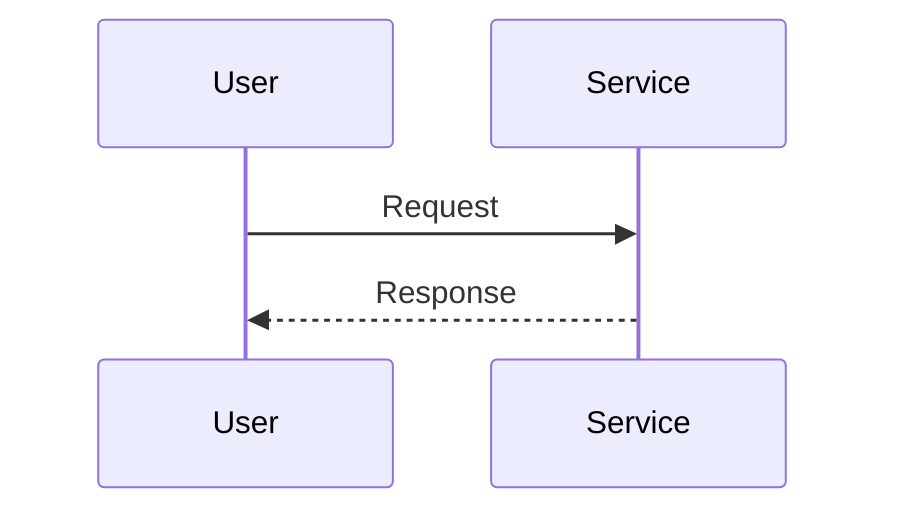
```mermaid
sequenceDiagram
  participant U as User
  participant S as Service
  U->>S: Request
  S-->>U: Response
```

### E-Commerce Checkout Sequence
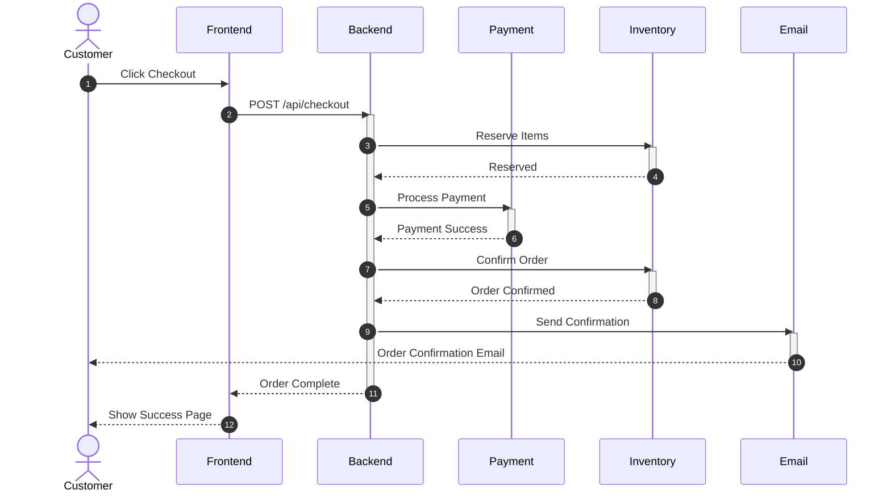
```mermaid
sequenceDiagram
  autonumber
  actor Customer
  participant Frontend
  participant Backend
  participant Payment
  participant Inventory
  participant Email

  Customer->>Frontend: Click Checkout
  Frontend->>Backend: POST /api/checkout
  activate Backend
  Backend->>Inventory: Reserve Items
  activate Inventory
  Inventory-->>Backend: Reserved
  deactivate Inventory

  Backend->>Payment: Process Payment
  activate Payment
  Payment-->>Backend: Payment Success
  deactivate Payment

  Backend->>Inventory: Confirm Order
  activate Inventory
  Inventory-->>Backend: Order Confirmed
  deactivate Inventory

  Backend->>Email: Send Confirmation
  activate Email
  Email-->>Customer: Order Confirmation Email
  deactivate Email

  Backend-->>Frontend: Order Complete
  deactivate Backend
  Frontend-->>Customer: Show Success Page
```

### OAuth 2.0 Authorization Flow
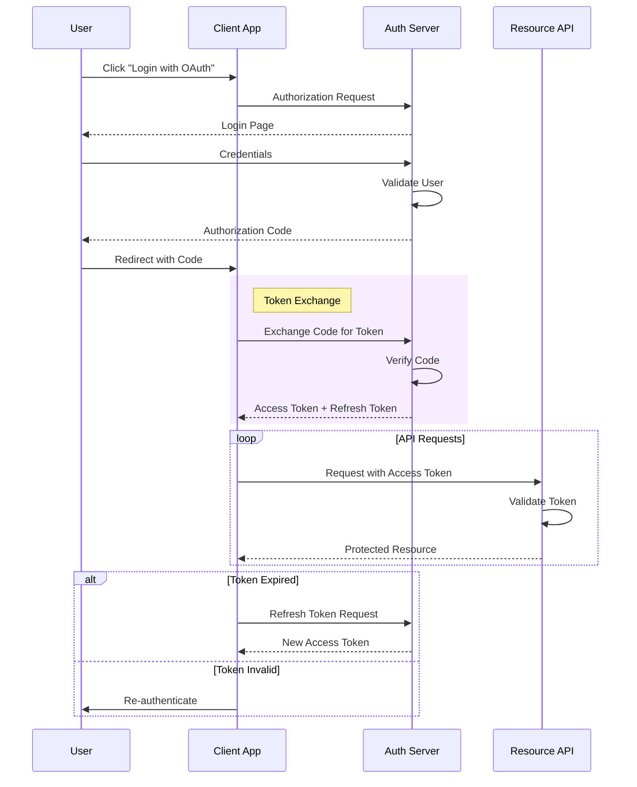
```mermaid
sequenceDiagram
  participant User
  participant App as Client App
  participant Auth as Auth Server
  participant API as Resource API

  User->>App: Click "Login with OAuth"
  App->>Auth: Authorization Request
  Auth-->>User: Login Page
  User->>Auth: Credentials
  Auth->>Auth: Validate User
  Auth-->>User: Authorization Code
  User->>App: Redirect with Code

  rect rgb(168, 85, 247, 0.1)
    note right of App: Token Exchange
    App->>Auth: Exchange Code for Token
    Auth->>Auth: Verify Code
    Auth-->>App: Access Token + Refresh Token
  end

  loop API Requests
    App->>API: Request with Access Token
    API->>API: Validate Token
    API-->>App: Protected Resource
  end

  alt Token Expired
    App->>Auth: Refresh Token Request
    Auth-->>App: New Access Token
  else Token Invalid
    App->>User: Re-authenticate
  end
```

### Microservices Saga Pattern
```mermaid
sequenceDiagram
  participant Orchestrator
  participant Order
  participant Payment
  participant Inventory
  participant Shipping

  Orchestrator->>Order: Create Order
  activate Order
  Order-->>Orchestrator: Order Created
  deactivate Order

  Orchestrator->>Payment: Process Payment
  activate Payment

  alt Payment Success
    Payment-->>Orchestrator: Payment Confirmed
    deactivate Payment

    Orchestrator->>Inventory: Reserve Stock
    activate Inventory

    alt Stock Available
      Inventory-->>Orchestrator: Reserved
      deactivate Inventory

      Orchestrator->>Shipping: Create Shipment
      activate Shipping
      Shipping-->>Orchestrator: Shipment Scheduled
      deactivate Shipping

      note over Orchestrator: Transaction Complete
    else Stock Unavailable
      Inventory-->>Orchestrator: Out of Stock
      deactivate Inventory

      Orchestrator->>Payment: Refund
      activate Payment
      Payment-->>Orchestrator: Refunded
      deactivate Payment

      Orchestrator->>Order: Cancel Order
      activate Order
      Order-->>Orchestrator: Cancelled
      deactivate Order
    end

  else Payment Failed
    Payment-->>Orchestrator: Payment Failed
    deactivate Payment

    Orchestrator->>Order: Cancel Order
    activate Order
    Order-->>Orchestrator: Cancelled
    deactivate Order
  end
```

---

<a name="gantt-charts"></a>
## 📅 Gantt Charts

<div style="background: white; border-left: 4px solid #06b6d4; padding: 24px; margin: 20px 0; border-radius: 8px; box-shadow: 0 2px 8px rgba(0,0,0,0.1);">
  <h3 style="margin: 0 0 12px 0; color: #06b6d4;">📘 Purpose</h3>
  <p style="margin: 0; color: #4b5563;">Plan and track project timelines, milestones, and resource allocation across phases.</p>
</div>

### Basic Project Plan
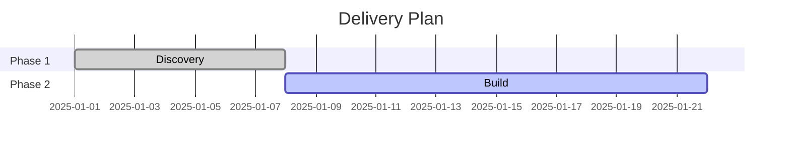
```mermaid
gantt
  dateFormat  YYYY-MM-DD
  title Delivery Plan
  section Phase 1
  Discovery :done, 2025-01-01, 7d
  section Phase 2
  Build :active, 2025-01-08, 14d
```

### Software Development Sprint
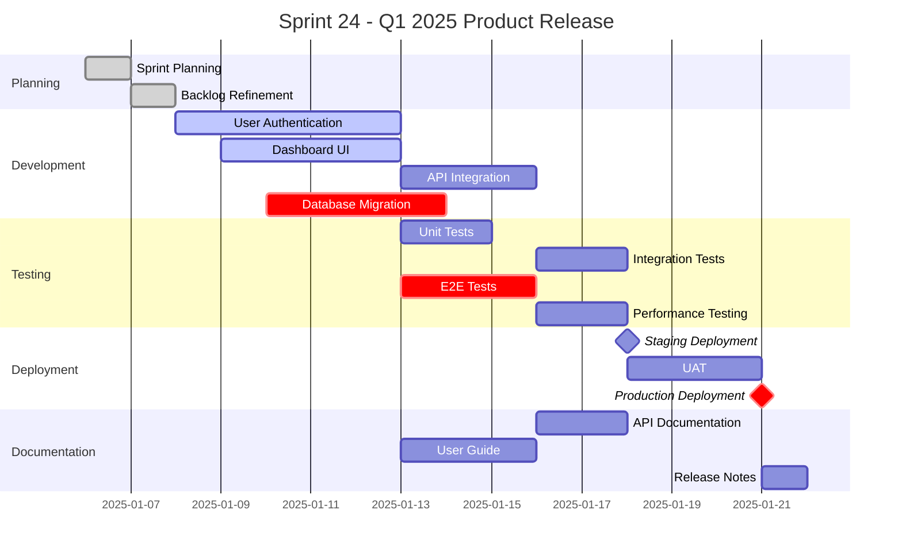
```mermaid
gantt
  title Sprint 24 - Q1 2025 Product Release
  dateFormat YYYY-MM-DD

  section Planning
  Sprint Planning        :done, plan1, 2025-01-06, 1d
  Backlog Refinement     :done, plan2, 2025-01-07, 1d

  section Development
  User Authentication    :active, dev1, 2025-01-08, 5d
  Dashboard UI           :active, dev2, 2025-01-09, 4d
  API Integration        :dev3, after dev1, 3d
  Database Migration     :crit, dev4, 2025-01-10, 4d

  section Testing
  Unit Tests             :test1, after dev1, 2d
  Integration Tests      :test2, after dev3, 2d
  E2E Tests              :crit, test3, after dev2, 3d
  Performance Testing    :test4, after test3, 2d

  section Deployment
  Staging Deployment     :milestone, stage, after test4, 0d
  UAT                    :uat, after stage, 3d
  Production Deployment  :crit, milestone, prod, after uat, 0d

  section Documentation
  API Documentation      :doc1, after dev3, 2d
  User Guide             :doc2, after dev2, 3d
  Release Notes          :doc3, after prod, 1d
```

### Product Launch Timeline
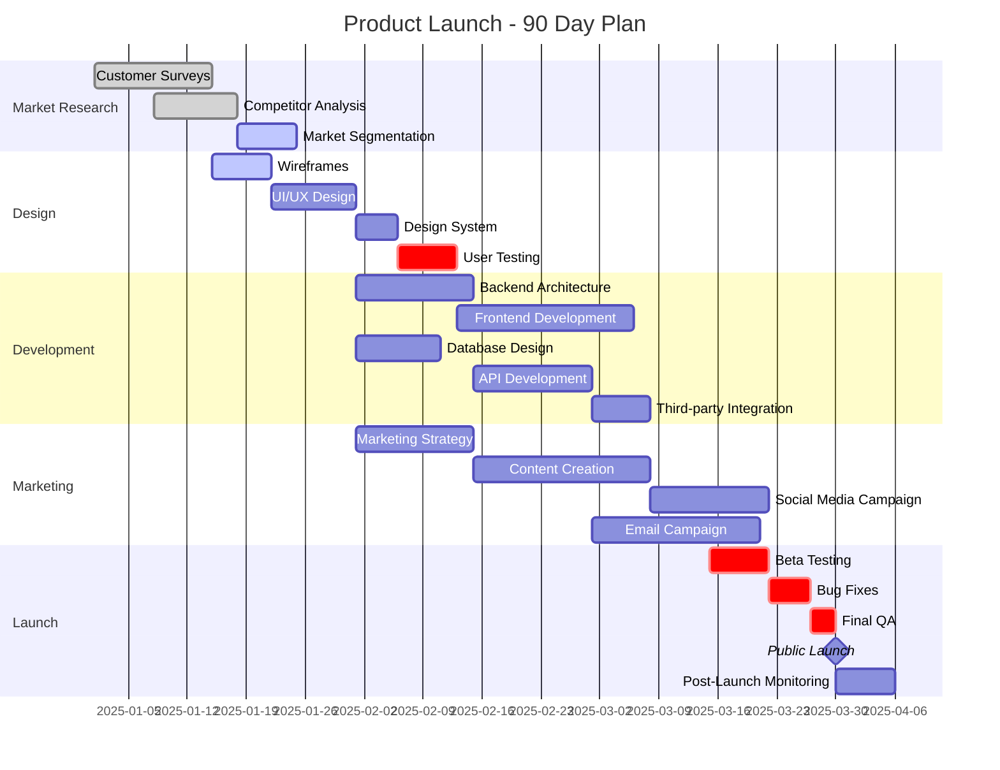
```mermaid
gantt
  title Product Launch - 90 Day Plan
  dateFormat YYYY-MM-DD

  section Market Research
  Customer Surveys          :done, research1, 2025-01-01, 14d
  Competitor Analysis       :done, research2, 2025-01-08, 10d
  Market Segmentation       :active, research3, after research2, 7d

  section Design
  Wireframes                :active, design1, 2025-01-15, 7d
  UI/UX Design              :design2, after design1, 10d
  Design System             :design3, after design2, 5d
  User Testing              :crit, design4, after design3, 7d

  section Development
  Backend Architecture      :dev1, 2025-02-01, 14d
  Frontend Development      :dev2, after design4, 21d
  Database Design           :dev3, 2025-02-01, 10d
  API Development           :dev4, after dev1, 14d
  Third-party Integration   :dev5, after dev4, 7d

  section Marketing
  Marketing Strategy        :marketing1, 2025-02-01, 14d
  Content Creation          :marketing2, after marketing1, 21d
  Social Media Campaign     :marketing3, after marketing2, 14d
  Email Campaign            :marketing4, 2025-03-01, 20d

  section Launch
  Beta Testing              :crit, launch1, 2025-03-15, 7d
  Bug Fixes                 :crit, launch2, after launch1, 5d
  Final QA                  :crit, launch3, after launch2, 3d
  Public Launch             :milestone, launch4, after launch3, 0d
  Post-Launch Monitoring    :launch5, after launch4, 7d
```

---

<a name="state-diagrams"></a>
## 🎛️ State Diagrams

<div style="background: white; border-left: 4px solid #06b6d4; padding: 24px; margin: 20px 0; border-radius: 8px; box-shadow: 0 2px 8px rgba(0,0,0,0.1);">
  <h3 style="margin: 0 0 12px 0; color: #06b6d4;">📘 Purpose</h3>
  <p style="margin: 0; color: #4b5563;">Model system behavior through states and transitions, showing state lifecycles and events.</p>
</div>

### Basic Document Workflow
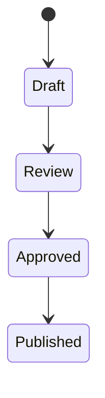
```mermaid
stateDiagram-v2
  [*] --> Draft
  Draft --> Review
  Review --> Approved
  Approved --> Published
```

### Order Processing State Machine
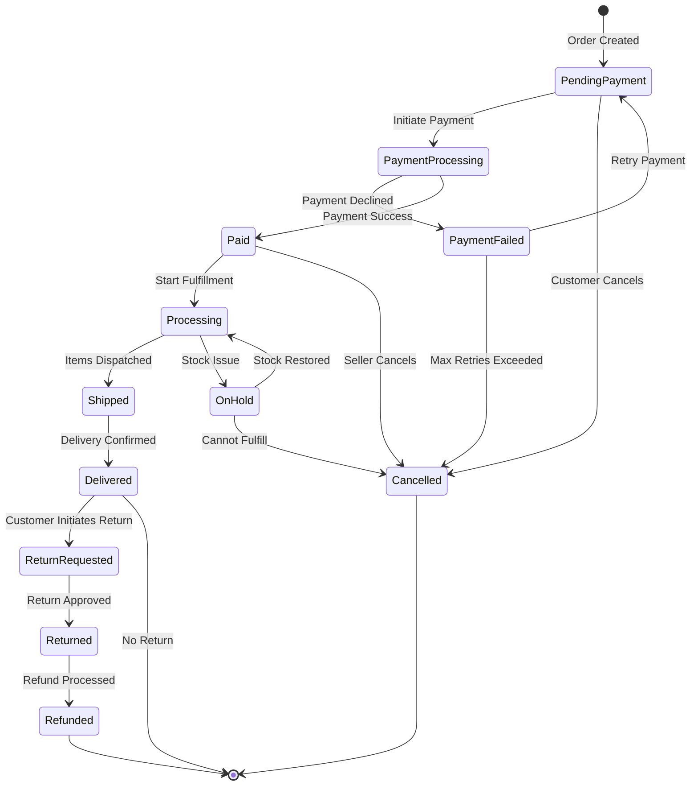
```mermaid
stateDiagram-v2
  [*] --> PendingPayment: Order Created

  PendingPayment --> PaymentProcessing: Initiate Payment
  PaymentProcessing --> PaymentFailed: Payment Declined
  PaymentProcessing --> Paid: Payment Success

  PaymentFailed --> PendingPayment: Retry Payment
  PaymentFailed --> Cancelled: Max Retries Exceeded

  Paid --> Processing: Start Fulfillment
  Processing --> Shipped: Items Dispatched
  Shipped --> Delivered: Delivery Confirmed

  Processing --> OnHold: Stock Issue
  OnHold --> Processing: Stock Restored
  OnHold --> Cancelled: Cannot Fulfill

  Delivered --> ReturnRequested: Customer Initiates Return
  ReturnRequested --> Returned: Return Approved
  Returned --> Refunded: Refund Processed

  PendingPayment --> Cancelled: Customer Cancels
  Paid --> Cancelled: Seller Cancels

  Cancelled --> [*]
  Refunded --> [*]
  Delivered --> [*]: No Return
```

### User Session State Diagram
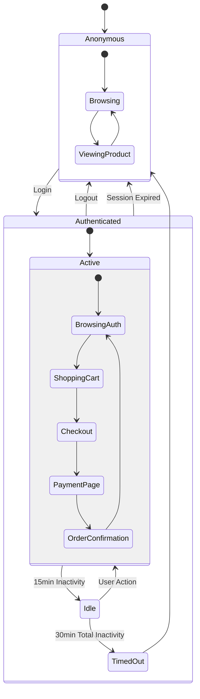
```mermaid
stateDiagram-v2
  [*] --> Anonymous

  state Anonymous {
    [*] --> Browsing
    Browsing --> ViewingProduct
    ViewingProduct --> Browsing
  }

  Anonymous --> Authenticated: Login

  state Authenticated {
    [*] --> Active
    Active --> Idle: 15min Inactivity
    Idle --> Active: User Action
    Idle --> TimedOut: 30min Total Inactivity

    state Active {
      [*] --> BrowsingAuth
      BrowsingAuth --> ShoppingCart
      ShoppingCart --> Checkout
      Checkout --> PaymentPage
      PaymentPage --> OrderConfirmation
      OrderConfirmation --> BrowsingAuth
    }
  }

  Authenticated --> Anonymous: Logout
  Authenticated --> Anonymous: Session Expired
  TimedOut --> Anonymous
```

### CI/CD Pipeline States
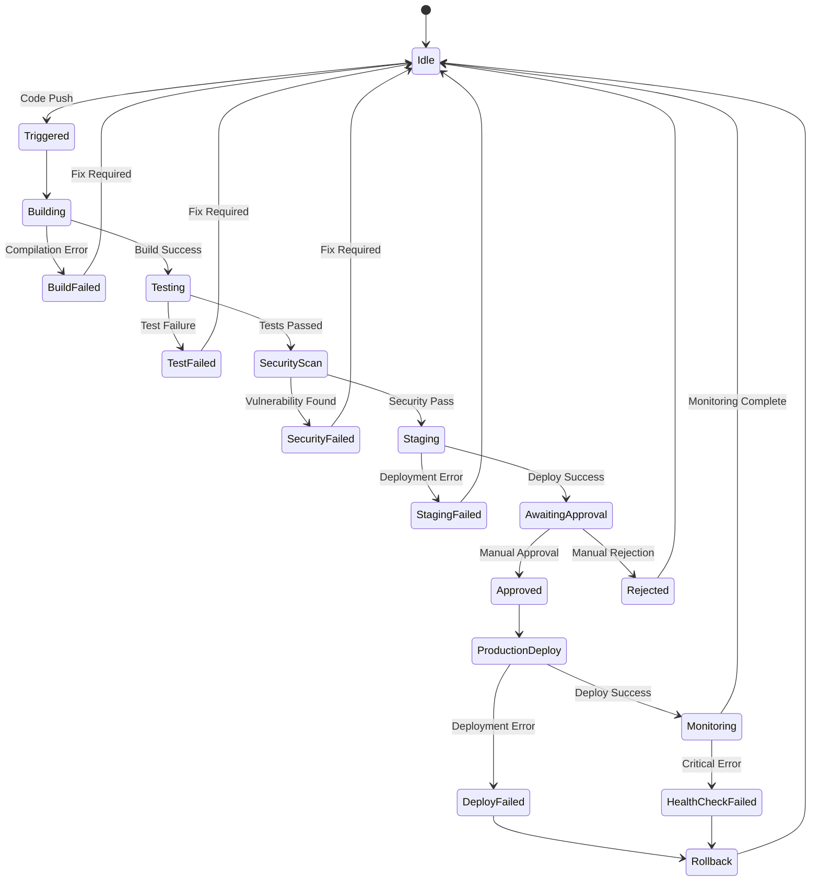
```mermaid
stateDiagram-v2
  [*] --> Idle
  Idle --> Triggered: Code Push

  Triggered --> Building
  Building --> BuildFailed: Compilation Error
  Building --> Testing: Build Success

  BuildFailed --> Idle: Fix Required

  Testing --> TestFailed: Test Failure
  Testing --> SecurityScan: Tests Passed

  TestFailed --> Idle: Fix Required

  SecurityScan --> SecurityFailed: Vulnerability Found
  SecurityScan --> Staging: Security Pass

  SecurityFailed --> Idle: Fix Required

  Staging --> StagingFailed: Deployment Error
  Staging --> AwaitingApproval: Deploy Success

  StagingFailed --> Idle

  AwaitingApproval --> Approved: Manual Approval
  AwaitingApproval --> Rejected: Manual Rejection

  Rejected --> Idle

  Approved --> ProductionDeploy
  ProductionDeploy --> DeployFailed: Deployment Error
  ProductionDeploy --> Monitoring: Deploy Success

  DeployFailed --> Rollback
  Rollback --> Idle

  Monitoring --> HealthCheckFailed: Critical Error
  Monitoring --> Idle: Monitoring Complete

  HealthCheckFailed --> Rollback
```

---

<a name="class-diagrams"></a>
## 🏗️ Class Diagrams

<div style="background: white; border-left: 4px solid #06b6d4; padding: 24px; margin: 20px 0; border-radius: 8px; box-shadow: 0 2px 8px rgba(0,0,0,0.1);">
  <h3 style="margin: 0 0 12px 0; color: #06b6d4;">📘 Purpose</h3>
  <p style="margin: 0; color: #4b5563;">Design object-oriented systems with classes, attributes, methods, and relationships.</p>
</div>

### Basic User-Account Relationship
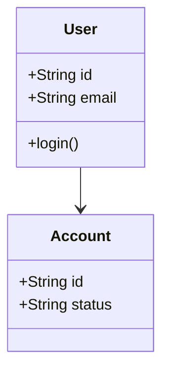
```mermaid
classDiagram
  class User {
    +String id
    +String email
    +login()
  }
  class Account {
    +String id
    +String status
  }
  User --> Account
```

### E-Commerce System Architecture
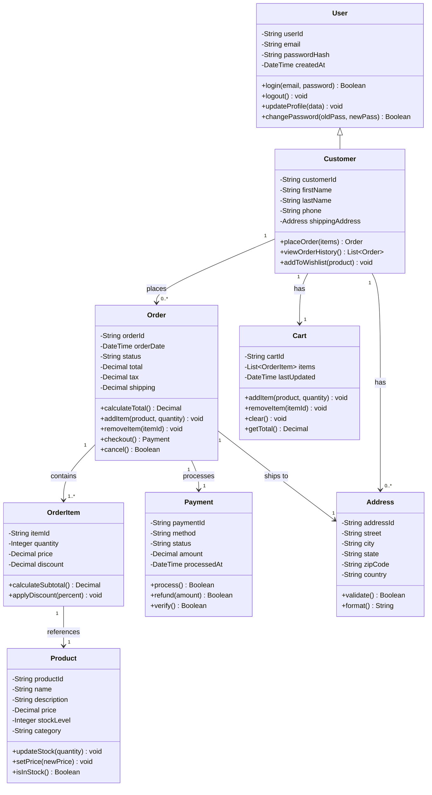
```mermaid
classDiagram
  class User {
    -String userId
    -String email
    -String passwordHash
    -DateTime createdAt
    +login(email, password) Boolean
    +logout() void
    +updateProfile(data) void
    +changePassword(oldPass, newPass) Boolean
  }

  class Customer {
    -String customerId
    -String firstName
    -String lastName
    -String phone
    -Address shippingAddress
    +placeOrder(items) Order
    +viewOrderHistory() List~Order~
    +addToWishlist(product) void
  }

  class Order {
    -String orderId
    -DateTime orderDate
    -String status
    -Decimal total
    -Decimal tax
    -Decimal shipping
    +calculateTotal() Decimal
    +addItem(product, quantity) void
    +removeItem(itemId) void
    +checkout() Payment
    +cancel() Boolean
  }

  class OrderItem {
    -String itemId
    -Integer quantity
    -Decimal price
    -Decimal discount
    +calculateSubtotal() Decimal
    +applyDiscount(percent) void
  }

  class Product {
    -String productId
    -String name
    -String description
    -Decimal price
    -Integer stockLevel
    -String category
    +updateStock(quantity) void
    +setPrice(newPrice) void
    +isInStock() Boolean
  }

  class Payment {
    -String paymentId
    -String method
    -String status
    -Decimal amount
    -DateTime processedAt
    +process() Boolean
    +refund(amount) Boolean
    +verify() Boolean
  }

  class Address {
    -String addressId
    -String street
    -String city
    -String state
    -String zipCode
    -String country
    +validate() Boolean
    +format() String
  }

  class Cart {
    -String cartId
    -List~OrderItem~ items
    -DateTime lastUpdated
    +addItem(product, quantity) void
    +removeItem(itemId) void
    +clear() void
    +getTotal() Decimal
  }

  User <|-- Customer
  Customer "1" --> "0..*" Order : places
  Customer "1" --> "1" Cart : has
  Order "1" --> "1..*" OrderItem : contains
  OrderItem "1" --> "1" Product : references
  Order "1" --> "1" Payment : processes
  Order "1" --> "1" Address : ships to
  Customer "1" --> "0..*" Address : has
```

### Payment Processing System
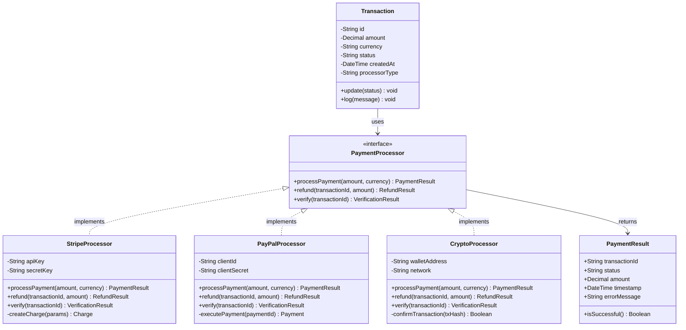
```mermaid
classDiagram
  class PaymentProcessor {
    <<interface>>
    +processPayment(amount, currency) PaymentResult
    +refund(transactionId, amount) RefundResult
    +verify(transactionId) VerificationResult
  }

  class StripeProcessor {
    -String apiKey
    -String secretKey
    +processPayment(amount, currency) PaymentResult
    +refund(transactionId, amount) RefundResult
    +verify(transactionId) VerificationResult
    -createCharge(params) Charge
  }

  class PayPalProcessor {
    -String clientId
    -String clientSecret
    +processPayment(amount, currency) PaymentResult
    +refund(transactionId, amount) RefundResult
    +verify(transactionId) VerificationResult
    -executePayment(paymentId) Payment
  }

  class CryptoProcessor {
    -String walletAddress
    -String network
    +processPayment(amount, currency) PaymentResult
    +refund(transactionId, amount) RefundResult
    +verify(transactionId) VerificationResult
    -confirmTransaction(txHash) Boolean
  }

  class PaymentResult {
    +String transactionId
    +String status
    +Decimal amount
    +DateTime timestamp
    +String errorMessage
    +isSuccessful() Boolean
  }

  class Transaction {
    -String id
    -Decimal amount
    -String currency
    -String status
    -DateTime createdAt
    -String processorType
    +update(status) void
    +log(message) void
  }

  PaymentProcessor <|.. StripeProcessor : implements
  PaymentProcessor <|.. PayPalProcessor : implements
  PaymentProcessor <|.. CryptoProcessor : implements
  PaymentProcessor --> PaymentResult : returns
  Transaction --> PaymentProcessor : uses
```

---

<a name="er-diagrams"></a>
## 🗄️ Entity-Relationship Diagrams

<div style="background: white; border-left: 4px solid #06b6d4; padding: 24px; margin: 20px 0; border-radius: 8px; box-shadow: 0 2px 8px rgba(0,0,0,0.1);">
  <h3 style="margin: 0 0 12px 0; color: #06b6d4;">📘 Purpose</h3>
  <p style="margin: 0; color: #4b5563;">Design database schemas with entities, attributes, and cardinality relationships.</p>
</div>

### Basic E-Commerce Database
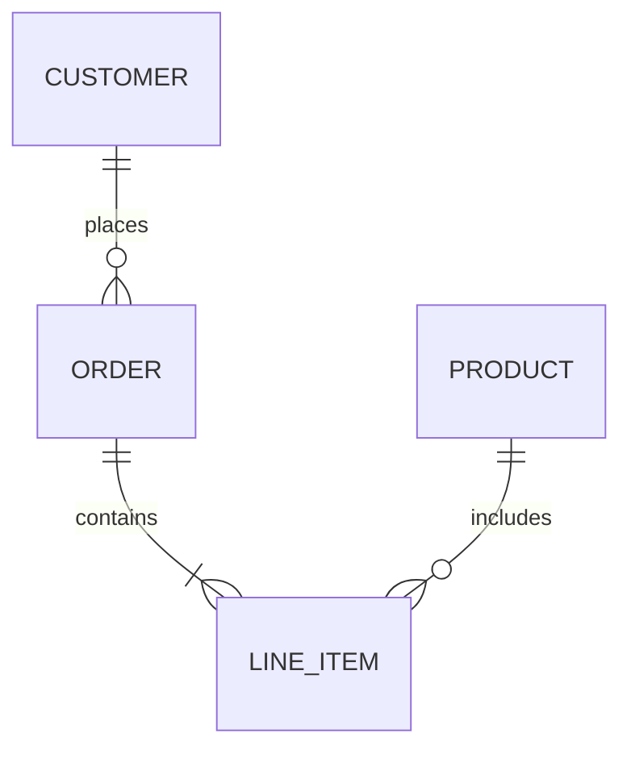
```mermaid
erDiagram
  CUSTOMER ||--o{ ORDER : places
  ORDER ||--|{ LINE_ITEM : contains
  PRODUCT ||--o{ LINE_ITEM : includes
```

### Complete CRM Database Schema
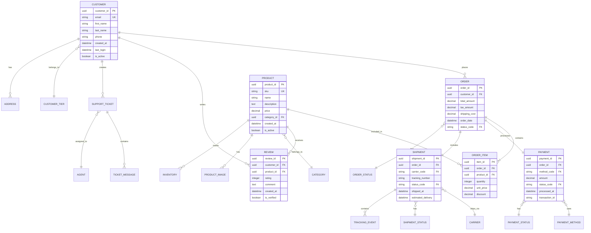
```mermaid
erDiagram
  CUSTOMER ||--o{ ORDER : places
  CUSTOMER ||--o{ REVIEW : writes
  CUSTOMER ||--o{ SUPPORT_TICKET : creates
  CUSTOMER }o--|| CUSTOMER_TIER : belongs_to
  CUSTOMER ||--o{ ADDRESS : has

  ORDER ||--|{ ORDER_ITEM : contains
  ORDER ||--|| PAYMENT : processes
  ORDER ||--|| SHIPMENT : includes
  ORDER }o--|| ORDER_STATUS : has

  PRODUCT ||--o{ ORDER_ITEM : included_in
  PRODUCT ||--o{ REVIEW : receives
  PRODUCT }o--|| CATEGORY : belongs_to
  PRODUCT ||--o{ PRODUCT_IMAGE : has
  PRODUCT ||--o{ INVENTORY : tracks

  PAYMENT }o--|| PAYMENT_METHOD : uses
  PAYMENT }o--|| PAYMENT_STATUS : has

  SHIPMENT }o--|| CARRIER : ships_via
  SHIPMENT }o--|| SHIPMENT_STATUS : has
  SHIPMENT ||--o{ TRACKING_EVENT : contains

  SUPPORT_TICKET ||--o{ TICKET_MESSAGE : contains
  SUPPORT_TICKET }o--|| AGENT : assigned_to

  CUSTOMER {
    uuid customer_id PK
    string email UK
    string first_name
    string last_name
    string phone
    datetime created_at
    datetime last_login
    boolean is_active
  }

  ORDER {
    uuid order_id PK
    uuid customer_id FK
    decimal total_amount
    decimal tax_amount
    decimal shipping_cost
    datetime order_date
    string status_code FK
  }

  ORDER_ITEM {
    uuid item_id PK
    uuid order_id FK
    uuid product_id FK
    integer quantity
    decimal unit_price
    decimal discount
  }

  PRODUCT {
    uuid product_id PK
    string sku UK
    string name
    text description
    decimal price
    uuid category_id FK
    datetime created_at
    boolean is_active
  }

  PAYMENT {
    uuid payment_id PK
    uuid order_id FK
    string method_code FK
    decimal amount
    string status_code FK
    datetime processed_at
    string transaction_id
  }

  SHIPMENT {
    uuid shipment_id PK
    uuid order_id FK
    string carrier_code FK
    string tracking_number
    string status_code FK
    datetime shipped_at
    datetime estimated_delivery
  }

  REVIEW {
    uuid review_id PK
    uuid customer_id FK
    uuid product_id FK
    integer rating
    text comment
    datetime created_at
    boolean is_verified
  }
```

### Blog Platform Database
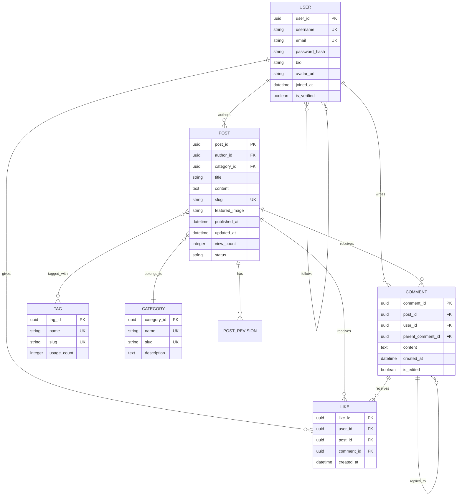
```mermaid
erDiagram
  USER ||--o{ POST : authors
  USER ||--o{ COMMENT : writes
  USER ||--o{ LIKE : gives
  USER }o--o{ USER : follows

  POST ||--o{ COMMENT : receives
  POST ||--o{ LIKE : receives
  POST }o--o{ TAG : tagged_with
  POST }o--|| CATEGORY : belongs_to
  POST ||--o{ POST_REVISION : has

  COMMENT ||--o{ COMMENT : replies_to
  COMMENT ||--o{ LIKE : receives

  USER {
    uuid user_id PK
    string username UK
    string email UK
    string password_hash
    string bio
    string avatar_url
    datetime joined_at
    boolean is_verified
  }

  POST {
    uuid post_id PK
    uuid author_id FK
    uuid category_id FK
    string title
    text content
    string slug UK
    string featured_image
    datetime published_at
    datetime updated_at
    integer view_count
    string status
  }

  COMMENT {
    uuid comment_id PK
    uuid post_id FK
    uuid user_id FK
    uuid parent_comment_id FK
    text content
    datetime created_at
    boolean is_edited
  }

  TAG {
    uuid tag_id PK
    string name UK
    string slug UK
    integer usage_count
  }

  CATEGORY {
    uuid category_id PK
    string name UK
    string slug UK
    text description
  }

  LIKE {
    uuid like_id PK
    uuid user_id FK
    uuid post_id FK
    uuid comment_id FK
    datetime created_at
  }
```

---

<a name="gitgraph-diagrams"></a>
## 🌿 Git Graph Diagrams

<div style="background: white; border-left: 4px solid #06b6d4; padding: 24px; margin: 20px 0; border-radius: 8px; box-shadow: 0 2px 8px rgba(0,0,0,0.1);">
  <h3 style="margin: 0 0 12px 0; color: #06b6d4;">📘 Purpose</h3>
  <p style="margin: 0; color: #4b5563;">Visualize Git branching strategies, commit histories, and merge workflows.</p>
</div>

### Basic Feature Branch Workflow
```mermaid
gitgraph
  commit id: "Init"
  branch feature
  checkout feature
  commit id: "Work"
  checkout main
  merge feature
```

### GitFlow Branching Strategy
```mermaid
gitgraph
  commit id: "Initial commit"
  branch develop
  checkout develop
  commit id: "Setup project structure"

  branch feature/user-auth
  checkout feature/user-auth
  commit id: "Add login page"
  commit id: "Implement authentication"
  commit id: "Add password reset"
  checkout develop
  merge feature/user-auth

  branch feature/dashboard
  checkout feature/dashboard
  commit id: "Create dashboard layout"
  commit id: "Add analytics widgets"
  checkout develop
  merge feature/dashboard

  branch release/v1.0
  checkout release/v1.0
  commit id: "Update version to 1.0"
  commit id: "Update changelog"

  checkout main
  merge release/v1.0 tag: "v1.0.0"

  checkout develop
  merge release/v1.0

  branch hotfix/security-patch
  checkout hotfix/security-patch
  commit id: "Fix security vulnerability"
  checkout main
  merge hotfix/security-patch tag: "v1.0.1"
  checkout develop
  merge hotfix/security-patch
```

### Continuous Deployment Workflow
```mermaid
gitgraph
  commit id: "Project init"
  branch staging
  branch production

  checkout main
  commit id: "Feature A start"
  commit id: "Feature A complete"

  checkout staging
  merge main tag: "staging-deploy-1"

  checkout main
  commit id: "Feature B start"
  commit id: "Feature B complete"

  checkout staging
  merge main tag: "staging-deploy-2"

  checkout production
  merge staging tag: "v1.0.0"

  checkout main
  commit id: "Hotfix needed"

  checkout staging
  merge main tag: "staging-hotfix"

  checkout production
  merge staging tag: "v1.0.1"
```

---

<a name="journey-maps"></a>
## 🗺️ User Journey Maps

<div style="background: white; border-left: 4px solid #06b6d4; padding: 24px; margin: 20px 0; border-radius: 8px; box-shadow: 0 2px 8px rgba(0,0,0,0.1);">
  <h3 style="margin: 0 0 12px 0; color: #06b6d4;">📘 Purpose</h3>
  <p style="margin: 0; color: #4b5563;">Map customer experiences across touchpoints, showing satisfaction levels and actors involved.</p>
</div>

### Basic Customer Journey
```mermaid
journey
  title Customer Journey
  section Awareness
    Visit site : 3: User
  section Trial
    Try demo : 4: User, Team
```

### Complete SaaS Onboarding Journey
```mermaid
journey
  title SaaS Product Onboarding Journey

  section Discovery
    Search for solution: 3: Customer
    Read reviews: 4: Customer
    Visit website: 4: Customer
    Compare pricing: 3: Customer

  section Trial Signup
    Create account: 5: Customer
    Email verification: 3: Customer, System
    Complete profile: 4: Customer

  section First Experience
    Watch tutorial: 5: Customer, Support
    Create first project: 4: Customer
    Invite team member: 3: Customer
    Setup integrations: 2: Customer, Support

  section Activation
    Complete key action: 5: Customer
    Experience value: 5: Customer
    Share with team: 4: Customer, Team

  section Conversion
    Review pricing: 3: Customer
    Consult with team: 4: Customer, Team
    Enter payment: 4: Customer
    Activate subscription: 5: Customer, System

  section Retention
    Daily usage: 5: Customer
    Invite more users: 4: Customer, Team
    Expand features: 5: Customer
    Renew subscription: 5: Customer
```

### Customer Support Experience
```mermaid
journey
  title Customer Support Experience

  section Problem Arises
    Encounter issue: 1: Customer
    Search help docs: 2: Customer
    Can't find solution: 1: Customer

  section Initial Contact
    Open support ticket: 3: Customer, System
    Receive auto-reply: 3: Customer, Support Bot
    Wait for response: 2: Customer

  section Support Interaction
    Agent responds: 4: Customer, Support Agent
    Provide details: 3: Customer, Support Agent
    Agent investigates: 3: Customer, Support Agent, Engineering
    Receive solution: 5: Customer, Support Agent

  section Resolution
    Test solution: 4: Customer
    Confirm fixed: 5: Customer, Support Agent
    Rate experience: 4: Customer
    Receive follow-up: 4: Customer, Support Agent
```

---

<a name="pie-charts"></a>
## 📊 Pie Charts

<div style="background: white; border-left: 4px solid #06b6d4; padding: 24px; margin: 20px 0; border-radius: 8px; box-shadow: 0 2px 8px rgba(0,0,0,0.1);">
  <h3 style="margin: 0 0 12px 0; color: #06b6d4;">📘 Purpose</h3>
  <p style="margin: 0; color: #4b5563;">Show proportional data distribution and percentage breakdowns across categories.</p>
</div>

### Basic Status Distribution
```mermaid
pie title Status
  "Done" : 50
  "Doing" : 30
  "Blocked" : 20
```

### Project Resource Allocation
```mermaid
pie title Resource Allocation by Department
  "Engineering" : 40
  "Product" : 15
  "Design" : 12
  "Marketing" : 18
  "Sales" : 10
  "Support" : 5
```

### Bug Priority Distribution
```mermaid
pie title Bug Severity Breakdown
  "Critical" : 5
  "High" : 15
  "Medium" : 35
  "Low" : 45
```

### Revenue by Product Category
```mermaid
pie title Q4 2025 Revenue Distribution
  "Enterprise Licenses" : 45
  "Professional Plans" : 30
  "Starter Plans" : 15
  "Add-ons" : 10
```

---

<a name="mindmaps"></a>
## 🧠 Mindmaps

<div style="background: white; border-left: 4px solid #06b6d4; padding: 24px; margin: 20px 0; border-radius: 8px; box-shadow: 0 2px 8px rgba(0,0,0,0.1);">
  <h3 style="margin: 0 0 12px 0; color: #06b6d4;">📘 Purpose</h3>
  <p style="margin: 0; color: #4b5563;">Organize ideas hierarchically, brainstorm concepts, and visualize relationships radiating from central themes.</p>
</div>

### Basic Product Mindmap
```mermaid
mindmap
  root((Product))
    Features
      Core
      Extras
    Risks
      Scope
      Budget
```

### Software Architecture Mindmap
```mermaid
mindmap
  root((System Architecture))
    Frontend
      React
        Components
        State Management
        Routing
      UI Framework
        Tailwind CSS
        Component Library
      Build Tools
        Vite
        TypeScript
    Backend
      API Layer
        REST Endpoints
        GraphQL
        WebSockets
      Business Logic
        Services
        Controllers
        Middleware
      Database
        PostgreSQL
        Redis Cache
    Infrastructure
      Cloud Platform
        AWS
        Kubernetes
      CI/CD
        GitHub Actions
        Docker
      Monitoring
        Logging
        Metrics
        Alerts
    Security
      Authentication
        OAuth 2.0
        JWT
      Authorization
        RBAC
        Permissions
      Data Protection
        Encryption
        GDPR Compliance
```

### Marketing Campaign Mindmap
```mermaid
mindmap
  root((Product Launch Campaign))
    Target Audience
      Demographics
        Age 25-45
        Tech Professionals
        Remote Workers
      Psychographics
        Early Adopters
        Value Efficiency
        Budget Conscious
    Channels
      Digital
        Social Media
          LinkedIn
          Twitter
          Reddit
        Content Marketing
          Blog Posts
          Videos
          Podcasts
        Email
          Newsletter
          Drip Campaigns
      Traditional
        Events
        PR
        Partnerships
    Messaging
      Value Proposition
        Save Time
        Increase Productivity
        Reduce Costs
      Key Benefits
        Feature A
        Feature B
        Feature C
      Differentiation
        Unique Approach
        Better UX
        Fair Pricing
    Metrics
      Awareness
        Website Traffic
        Social Reach
        Brand Mentions
      Engagement
        Click-Through Rate
        Time on Site
        Content Shares
      Conversion
        Sign-ups
        Trials
        Purchases
```

---

<a name="timeline-diagrams"></a>
## ⏰ Timeline Diagrams

<div style="background: white; border-left: 4px solid #06b6d4; padding: 24px; margin: 20px 0; border-radius: 8px; box-shadow: 0 2px 8px rgba(0,0,0,0.1);">
  <h3 style="margin: 0 0 12px 0; color: #06b6d4;">📘 Purpose</h3>
  <p style="margin: 0; color: #4b5563;">Display events chronologically, showing historical progressions and future milestones.</p>
</div>

### Basic Milestones
```mermaid
timeline
  title Milestones
  2025-01-15 : Design
  2025-02-15 : Build
  2025-03-15 : Launch
```

### Product Development Timeline
```mermaid
timeline
  title Product Evolution 2024-2025

  section Q1 2024
    January : Market Research
            : Competitor Analysis
    February : MVP Specification
             : Initial Designs
    March : Prototype Development
          : User Testing Round 1

  section Q2 2024
    April : Alpha Release
          : Early Adopter Program
    May : Feature Expansion
        : Performance Optimization
    June : Beta Release
         : Public Beta Testing

  section Q3 2024
    July : Bug Fixes
         : Security Audit
    August : Feature Freeze
           : Final QA
    September : v1.0 Launch
              : Marketing Campaign

  section Q4 2024
    October : User Feedback Collection
            : Analytics Implementation
    November : v1.1 Planning
             : Additional Features
    December : Holiday Feature Release
             : Year-End Review

  section Q1 2025
    January : v2.0 Planning
            : Architecture Redesign
    February : v2.0 Development
             : Migration Tools
    March : v2.0 Beta
          : Customer Migration
```

### Company Growth Timeline
```mermaid
timeline
  title Company Milestones

  section Founding (2020)
    January 2020 : Company Incorporated
                 : Seed Funding $500K
    June 2020 : First Employees Hired
              : Office Opened

  section Early Growth (2021)
    March 2021 : Product Beta Launch
               : 100 Beta Users
    September 2021 : Series A $5M
                   : Team Expanded to 15

  section Scale (2022)
    January 2022 : 10,000 Active Users
                 : Enterprise Plan Launch
    July 2022 : Series B $25M
              : International Expansion

  section Maturity (2023)
    January 2023 : 100,000 Active Users
                 : Profitability Achieved
    October 2023 : Strategic Partnerships
                 : Feature Platform Launch

  section Future (2024-2025)
    March 2024 : IPO Preparation
               : 500K Users Milestone
    2025 : Public Listing
         : Global Market Leader
```

---

<a name="xy-charts"></a>
## 📈 XY Charts

<div style="background: white; border-left: 4px solid #06b6d4; padding: 24px; margin: 20px 0; border-radius: 8px; box-shadow: 0 2px 8px rgba(0,0,0,0.1);">
  <h3 style="margin: 0 0 12px 0; color: #06b6d4;">📘 Purpose</h3>
  <p style="margin: 0; color: #4b5563;">Visualize trends, comparisons, and data patterns across continuous or categorical variables.</p>
</div>

### Basic Weekly Activity
```mermaid
xychart-beta
  title "Weekly Activity"
  x-axis [Mon, Tue, Wed, Thu, Fri]
  y-axis "Count" 0 --> 10
  line [2, 4, 6, 5, 8]
```

### Multi-Metric Performance Dashboard
```mermaid
xychart-beta
  title "Monthly Performance Metrics"
  x-axis [Jan, Feb, Mar, Apr, May, Jun, Jul, Aug, Sep, Oct, Nov, Dec]
  y-axis "Value" 0 --> 100
  line [20, 25, 30, 28, 35, 45, 50, 55, 60, 65, 70, 75]
  line [15, 18, 22, 25, 30, 35, 40, 42, 45, 50, 55, 60]
  line [10, 12, 15, 20, 25, 30, 32, 35, 38, 40, 42, 45]
```

### Revenue Growth Tracking
```mermaid
xychart-beta
  title "Quarterly Revenue Growth (Thousands)"
  x-axis [Q1 2023, Q2 2023, Q3 2023, Q4 2023, Q1 2024, Q2 2024, Q3 2024, Q4 2024]
  y-axis "Revenue ($K)" 0 --> 500
  line [100, 125, 160, 200, 250, 310, 380, 450]
```

### Server Response Time Analysis
```mermaid
xychart-beta
  title "API Response Time by Endpoint (ms)"
  x-axis [/users, /products, /orders, /payments, /analytics, /reports]
  y-axis "Response Time (ms)" 0 --> 200
  line [45, 78, 120, 95, 150, 180]
```

---

## 🎨 Diagram Best Practices

<div style="display: grid; grid-template-columns: repeat(auto-fit, minmax(280px, 1fr)); gap: 20px; margin: 30px 0;">
  <div style="background: white; border-radius: 16px; padding: 24px; box-shadow: 0 4px 12px rgba(0,0,0,0.08); border-top: 4px solid #06b6d4;">
    <h4 style="margin: 0 0 16px 0; color: #06b6d4; display: flex; align-items: center; gap: 10px;">
      <span style="font-size: 1.5em;">🎯</span> Keep It Simple
    </h4>
    <ul style="margin: 0; padding-left: 20px; color: #4b5563; line-height: 1.8;">
      <li>Limit nodes to 7-10 per diagram</li>
      <li>Use clear, concise labels</li>
      <li>Avoid crossing lines when possible</li>
      <li>Group related elements</li>
    </ul>
  </div>

  <div style="background: white; border-radius: 16px; padding: 24px; box-shadow: 0 4px 12px rgba(0,0,0,0.08); border-top: 4px solid #0891b2;">
    <h4 style="margin: 0 0 16px 0; color: #0891b2; display: flex; align-items: center; gap: 10px;">
      <span style="font-size: 1.5em;">🎨</span> Consistent Styling
    </h4>
    <ul style="margin: 0; padding-left: 20px; color: #4b5563; line-height: 1.8;">
      <li>Use standard node shapes for types</li>
      <li>Maintain uniform spacing</li>
      <li>Apply consistent arrow styles</li>
      <li>Use colors purposefully</li>
    </ul>
  </div>

  <div style="background: white; border-radius: 16px; padding: 24px; box-shadow: 0 4px 12px rgba(0,0,0,0.08); border-top: 4px solid #06b6d4;">
    <h4 style="margin: 0 0 16px 0; color: #06b6d4; display: flex; align-items: center; gap: 10px;">
      <span style="font-size: 1.5em;">📐</span> Logical Flow
    </h4>
    <ul style="margin: 0; padding-left: 20px; color: #4b5563; line-height: 1.8;">
      <li>Top-to-bottom or left-to-right</li>
      <li>Decision points clearly marked</li>
      <li>Entry and exit points obvious</li>
      <li>Parallel paths well-organized</li>
    </ul>
  </div>

  <div style="background: white; border-radius: 16px; padding: 24px; box-shadow: 0 4px 12px rgba(0,0,0,0.08); border-top: 4px solid #0891b2;">
    <h4 style="margin: 0 0 16px 0; color: #0891b2; display: flex; align-items: center; gap: 10px;">
      <span style="font-size: 1.5em;">♿</span> Accessibility
    </h4>
    <ul style="margin: 0; padding-left: 20px; color: #4b5563; line-height: 1.8;">
      <li>Use text labels, not just colors</li>
      <li>Ensure sufficient contrast</li>
      <li>Provide alt text descriptions</li>
      <li>Test with screen readers</li>
    </ul>
  </div>
</div>

---

## 🔧 Advanced Mermaid Techniques

### Subgraphs for Logical Grouping
```mermaid
flowchart TB
  subgraph "User Interface"
    A[Login Page]
    B[Dashboard]
    C[Settings]
  end

  subgraph "Business Logic"
    D[Authentication Service]
    E[Data Service]
    F[Config Service]
  end

  subgraph "Data Layer"
    G[(User DB)]
    H[(App DB)]
    I[(Config DB)]
  end

  A --> D
  B --> E
  C --> F
  D --> G
  E --> H
  F --> I
```

### Styling with Classes
```mermaid
flowchart LR
  A[Normal]:::normal --> B[Success]:::success
  B --> C[Warning]:::warning
  C --> D[Error]:::error
  D --> E[Info]:::info

  classDef success fill:#10b981,stroke:#059669,color:#fff
  classDef warning fill:#f59e0b,stroke:#d97706,color:#fff
  classDef error fill:#ef4444,stroke:#dc2626,color:#fff
  classDef info fill:#3b82f6,stroke:#2563eb,color:#fff
  classDef normal fill:#6b7280,stroke:#4b5563,color:#fff
```

### Complex Sequence with Notes
```mermaid
sequenceDiagram
  participant A as Client
  participant B as API Gateway
  participant C as Auth Service
  participant D as Database

  Note over A,D: Authentication Flow

  A->>B: Login Request
  activate B
  B->>C: Validate Credentials
  activate C
  C->>D: Query User
  activate D
  D-->>C: User Data
  deactivate D

  alt Credentials Valid
    C-->>B: JWT Token
    deactivate C
    B-->>A: 200 OK + Token
    deactivate B
  else Invalid Credentials
    C-->>B: Auth Error
    deactivate C
    B-->>A: 401 Unauthorized
    deactivate B
  end

  Note over A: Token stored locally
```

---

## 📚 Diagram Selection Guide

<div style="background: #f9fafb; border-radius: 12px; padding: 24px; margin: 20px 0; border: 1px solid #e5e7eb;">
  <table style="width: 100%; border-collapse: collapse;">
    <thead>
      <tr style="background: linear-gradient(135deg, #06b6d4 0%, #0891b2 100%); color: white;">
        <th style="padding: 12px; text-align: left; border: 1px solid rgba(255,255,255,0.2);">Use Case</th>
        <th style="padding: 12px; text-align: left; border: 1px solid rgba(255,255,255,0.2);">Recommended Diagram</th>
        <th style="padding: 12px; text-align: left; border: 1px solid rgba(255,255,255,0.2);">Why?</th>
      </tr>
    </thead>
    <tbody>
      <tr style="background: white;">
        <td style="padding: 10px; border: 1px solid #e5e7eb;">Decision processes</td>
        <td style="padding: 10px; border: 1px solid #e5e7eb;"><strong>Flowchart</strong></td>
        <td style="padding: 10px; border: 1px solid #e5e7eb;">Shows branching logic clearly</td>
      </tr>
      <tr style="background: #f9fafb;">
        <td style="padding: 10px; border: 1px solid #e5e7eb;">API interactions</td>
        <td style="padding: 10px; border: 1px solid #e5e7eb;"><strong>Sequence Diagram</strong></td>
        <td style="padding: 10px; border: 1px solid #e5e7eb;">Time-ordered message flows</td>
      </tr>
      <tr style="background: white;">
        <td style="padding: 10px; border: 1px solid #e5e7eb;">Project schedules</td>
        <td style="padding: 10px; border: 1px solid #e5e7eb;"><strong>Gantt Chart</strong></td>
        <td style="padding: 10px; border: 1px solid #e5e7eb;">Timeline with dependencies</td>
      </tr>
      <tr style="background: #f9fafb;">
        <td style="padding: 10px; border: 1px solid #e5e7eb;">Application states</td>
        <td style="padding: 10px; border: 1px solid #e5e7eb;"><strong>State Diagram</strong></td>
        <td style="padding: 10px; border: 1px solid #e5e7eb;">State transitions and events</td>
      </tr>
      <tr style="background: white;">
        <td style="padding: 10px; border: 1px solid #e5e7eb;">Code architecture</td>
        <td style="padding: 10px; border: 1px solid #e5e7eb;"><strong>Class Diagram</strong></td>
        <td style="padding: 10px; border: 1px solid #e5e7eb;">OOP structure and relationships</td>
      </tr>
      <tr style="background: #f9fafb;">
        <td style="padding: 10px; border: 1px solid #e5e7eb;">Database design</td>
        <td style="padding: 10px; border: 1px solid #e5e7eb;"><strong>ER Diagram</strong></td>
        <td style="padding: 10px; border: 1px solid #e5e7eb;">Entity relationships and cardinality</td>
      </tr>
      <tr style="background: white;">
        <td style="padding: 10px; border: 1px solid #e5e7eb;">Git workflows</td>
        <td style="padding: 10px; border: 1px solid #e5e7eb;"><strong>Git Graph</strong></td>
        <td style="padding: 10px; border: 1px solid #e5e7eb;">Branch and merge visualization</td>
      </tr>
      <tr style="background: #f9fafb;">
        <td style="padding: 10px; border: 1px solid #e5e7eb;">User experience</td>
        <td style="padding: 10px; border: 1px solid #e5e7eb;"><strong>Journey Map</strong></td>
        <td style="padding: 10px; border: 1px solid #e5e7eb;">Touchpoints and satisfaction</td>
      </tr>
      <tr style="background: white;">
        <td style="padding: 10px; border: 1px solid #e5e7eb;">Data distribution</td>
        <td style="padding: 10px; border: 1px solid #e5e7eb;"><strong>Pie Chart</strong></td>
        <td style="padding: 10px; border: 1px solid #e5e7eb;">Proportional breakdown</td>
      </tr>
      <tr style="background: #f9fafb;">
        <td style="padding: 10px; border: 1px solid #e5e7eb;">Idea organization</td>
        <td style="padding: 10px; border: 1px solid #e5e7eb;"><strong>Mindmap</strong></td>
        <td style="padding: 10px; border: 1px solid #e5e7eb;">Radial hierarchical structure</td>
      </tr>
      <tr style="background: white;">
        <td style="padding: 10px; border: 1px solid #e5e7eb;">Historical events</td>
        <td style="padding: 10px; border: 1px solid #e5e7eb;"><strong>Timeline</strong></td>
        <td style="padding: 10px; border: 1px solid #e5e7eb;">Chronological milestones</td>
      </tr>
      <tr style="background: #f9fafb;">
        <td style="padding: 10px; border: 1px solid #e5e7eb;">Trend analysis</td>
        <td style="padding: 10px; border: 1px solid #e5e7eb;"><strong>XY Chart</strong></td>
        <td style="padding: 10px; border: 1px solid #e5e7eb;">Continuous data visualization</td>
      </tr>
    </tbody>
  </table>
</div>

---

## 🚀 Performance Tips

<div style="background: linear-gradient(135deg, rgba(6, 182, 212, 0.1) 0%, rgba(147, 51, 234, 0.1) 100%); border: 2px solid #06b6d4; border-radius: 16px; padding: 28px; margin: 30px 0;">
  <h3 style="margin: 0 0 20px 0; color: #06b6d4; display: flex; align-items: center; gap: 12px;">
    <span style="font-size: 1.8em;">⚡</span>
    Optimization Guidelines
  </h3>

  <div style="display: grid; gap: 16px;">
    <div style="background: white; border-radius: 12px; padding: 20px; border-left: 4px solid #06b6d4;">
      <h4 style="margin: 0 0 10px 0; color: #111827; font-size: 1.1em;">Reduce Complexity</h4>
      <p style="margin: 0; color: #6b7280; line-height: 1.6;">Large diagrams (>50 nodes) can slow rendering. Break into multiple smaller diagrams or use subgraphs.</p>
    </div>

    <div style="background: white; border-radius: 12px; padding: 20px; border-left: 4px solid #0891b2;">
      <h4 style="margin: 0 0 10px 0; color: #111827; font-size: 1.1em;">Lazy Loading</h4>
      <p style="margin: 0; color: #6b7280; line-height: 1.6;">On documentation sites, load diagrams on scroll or click to improve initial page load time.</p>
    </div>

    <div style="background: white; border-radius: 12px; padding: 20px; border-left: 4px solid #06b6d4;">
      <h4 style="margin: 0 0 10px 0; color: #111827; font-size: 1.1em;">Cache Rendered SVG</h4>
      <p style="margin: 0; color: #6b7280; line-height: 1.6;">For static diagrams, pre-render to SVG and cache to avoid runtime rendering overhead.</p>
    </div>

    <div style="background: white; border-radius: 12px; padding: 20px; border-left: 4px solid #0891b2;">
      <h4 style="margin: 0 0 10px 0; color: #111827; font-size: 1.1em;">Minimize Styling</h4>
      <p style="margin: 0; color: #6b7280; line-height: 1.6;">Excessive custom classes and styles can impact performance. Use sparingly and test rendering speed.</p>
    </div>
  </div>
</div>

---

## 🎓 Common Anti-Patterns to Avoid

<div style="display: grid; grid-template-columns: repeat(auto-fit, minmax(300px, 1fr)); gap: 20px; margin: 30px 0;">
  <div style="background: white; border-radius: 16px; padding: 24px; box-shadow: 0 4px 12px rgba(0,0,0,0.08); border-top: 4px solid #ef4444;">
    <h4 style="margin: 0 0 16px 0; color: #ef4444; display: flex; align-items: center; gap: 10px;">
      <span style="font-size: 1.5em;">❌</span> Overcomplexity
    </h4>
    <p style="margin: 0 0 12px 0; color: #4b5563; line-height: 1.6;"><strong>Problem:</strong> Trying to show everything in one diagram</p>
    <p style="margin: 0; color: #059669; line-height: 1.6;"><strong>Solution:</strong> Create multiple focused diagrams for different concerns</p>
  </div>

  <div style="background: white; border-radius: 16px; padding: 24px; box-shadow: 0 4px 12px rgba(0,0,0,0.08); border-top: 4px solid #ef4444;">
    <h4 style="margin: 0 0 16px 0; color: #ef4444; display: flex; align-items: center; gap: 10px;">
      <span style="font-size: 1.5em;">❌</span> Inconsistent Styling
    </h4>
    <p style="margin: 0 0 12px 0; color: #4b5563; line-height: 1.6;"><strong>Problem:</strong> Random shapes and colors without meaning</p>
    <p style="margin: 0; color: #059669; line-height: 1.6;"><strong>Solution:</strong> Define and follow a consistent visual language</p>
  </div>

  <div style="background: white; border-radius: 16px; padding: 24px; box-shadow: 0 4px 12px rgba(0,0,0,0.08); border-top: 4px solid #ef4444;">
    <h4 style="margin: 0 0 16px 0; color: #ef4444; display: flex; align-items: center; gap: 10px;">
      <span style="font-size: 1.5em;">❌</span> Missing Context
    </h4>
    <p style="margin: 0 0 12px 0; color: #4b5563; line-height: 1.6;"><strong>Problem:</strong> Diagrams without titles or explanations</p>
    <p style="margin: 0; color: #059669; line-height: 1.6;"><strong>Solution:</strong> Always include descriptive titles and supporting text</p>
  </div>

  <div style="background: white; border-radius: 16px; padding: 24px; box-shadow: 0 4px 12px rgba(0,0,0,0.08); border-top: 4px solid #ef4444;">
    <h4 style="margin: 0 0 16px 0; color: #ef4444; display: flex; align-items: center; gap: 10px;">
      <span style="font-size: 1.5em;">❌</span> Outdated Diagrams
    </h4>
    <p style="margin: 0 0 12px 0; color: #4b5563; line-height: 1.6;"><strong>Problem:</strong> Documentation doesn't match current implementation</p>
    <p style="margin: 0; color: #059669; line-height: 1.6;"><strong>Solution:</strong> Version diagrams and review/update regularly</p>
  </div>
</div>

---

## 📖 Quick Reference: Common Syntax

### Flowchart Directions
```
TB - Top to Bottom
TD - Top Down (same as TB)
BT - Bottom to Top
RL - Right to Left
LR - Left to Right
```

### Link Types
```
A --> B     Solid arrow
A --- B     Solid line (no arrow)
A -.-> B    Dotted arrow
A -.- B     Dotted line
A ==> B     Thick arrow
A == B      Thick line
A --o B     Circle end
A --x B     Cross end
```

### Sequence Diagram Messages
```
->>   Solid arrow
-->>  Dotted arrow
-x    Cross at end
-)    Open arrow
```

---

<div style="background: linear-gradient(135deg, #06b6d4 0%, #0891b2 100%); padding: 50px 40px; border-radius: 20px; color: white; text-align: center; margin: 40px 0; box-shadow: 0 20px 60px rgba(6, 182, 212, 0.3);">
  <h2 style="margin: 0 0 20px 0; font-size: 2.5em; font-weight: 800;">🎉 Gallery Complete!</h2>
  <p style="font-size: 1.2em; margin: 0 0 30px 0; opacity: 0.95;">You now have access to 12 diagram types and 50+ production-ready examples</p>

  <div style="display: inline-flex; gap: 16px; flex-wrap: wrap; justify-content: center;">
    <div style="background: rgba(255,255,255,0.2); backdrop-filter: blur(10px); padding: 12px 24px; border-radius: 10px; border: 1px solid rgba(255,255,255,0.3); font-size: 0.95em;">
      ✅ Comprehensive Examples
    </div>
    <div style="background: rgba(255,255,255,0.2); backdrop-filter: blur(10px); padding: 12px 24px; border-radius: 10px; border: 1px solid rgba(255,255,255,0.3); font-size: 0.95em;">
      ✅ Best Practices
    </div>
    <div style="background: rgba(255,255,255,0.2); backdrop-filter: blur(10px); padding: 12px 24px; border-radius: 10px; border: 1px solid rgba(255,255,255,0.3); font-size: 0.95em;">
      ✅ Performance Tips
    </div>
    <div style="background: rgba(255,255,255,0.2); backdrop-filter: blur(10px); padding: 12px 24px; border-radius: 10px; border: 1px solid rgba(255,255,255,0.3); font-size: 0.95em;">
      ✅ GitHub Compatible
    </div>
  </div>
</div>

---

<div style="background: linear-gradient(135deg, rgba(6, 182, 212, 0.1) 0%, rgba(147, 51, 234, 0.1) 100%); border-left: 4px solid #06b6d4; padding: 24px; border-radius: 12px; margin: 30px 0;">
  <h4 style="margin: 0 0 12px 0; color: #06b6d4; display: flex; align-items: center; gap: 10px;">
    <span style="font-size: 1.4em;">💡</span> Pro Tip
  </h4>
  <p style="margin: 0; color: #4b5563; line-height: 1.8;">
    <strong>Test your diagrams in GitHub preview before publishing.</strong> Some Mermaid features may not render identically across all platforms. Always verify complex diagrams render correctly in your target environment.
  </p>
</div>

---

<div style="text-align: center; padding: 40px 20px; color: #6b7280; border-top: 2px solid #e5e7eb; margin-top: 60px;">
  <div style="display: inline-flex; gap: 30px; margin-bottom: 20px; flex-wrap: wrap; justify-content: center;">
    <div>
      <div style="font-size: 2em; font-weight: 700; color: #06b6d4;">12</div>
      <div style="font-size: 0.9em;">Diagram Types</div>
    </div>
    <div>
      <div style="font-size: 2em; font-weight: 700; color: #0891b2;">50+</div>
      <div style="font-size: 0.9em;">Examples</div>
    </div>
    <div>
      <div style="font-size: 2em; font-weight: 700; color: #06b6d4;">1,500+</div>
      <div style="font-size: 0.9em;">Lines of Code</div>
    </div>
    <div>
      <div style="font-size: 2em; font-weight: 700; color: #0891b2;">100%</div>
      <div style="font-size: 0.9em;">GitHub Compatible</div>
    </div>
  </div>

  <p style="margin: 20px 0 0 0; font-size: 0.95em;">
    Enhanced Second Brain Enterprise · Mermaid Gallery Template v2.0<br>
    <span style="color: #9ca3af;">Last Updated: 2025-12-28</span>
  </p>
</div>
