<!-- Claim #70089 09915-1-2 - Action Required -->
<div style="border: 1px solid #ddd; border-radius: 12px; padding: 20px; background: linear-gradient(135deg, #ff416c 0%, #ff4b2b 100%); color: white; margin: 15px 0; box-shadow: 0 4px 6px rgba(0,0,0,0.1);">
    <div style="display: flex; justify-content: between; align-items: flex-start; margin-bottom: 15px;">
        <div style="display: flex; align-items: center;">
            <div style="width: 60px; height: 60px; border-radius: 50%; background: white; margin-right: 15px; display: flex; align-items: center; justify-content: center; color: #ff416c; font-weight: bold; font-size: 18px;">
                F
            </div>
            <div>
                <h3 style="margin: 0; color: white; font-size: 20px;">Feresa Martinez</h3>
                <p style="margin: 2px 0; opacity: 0.9; font-size: 14px;">Homeowner</p>
            </div>
        </div>
        <div style="background: rgba(255,255,255,0.2); padding: 5px 10px; border-radius: 15px; font-size: 12px; font-weight: bold;">
            ACTION REQUIRED
        </div>
    </div>
    
    <div style="display: grid; grid-template-columns: 1fr 1fr; gap: 15px; margin-bottom: 15px;">
        <div>
            <small style="opacity: 0.8; text-transform: uppercase; font-weight: 600;">Claim Details</small>
            <div style="margin-top: 5px; font-size: 14px;">
                <div><strong>Claim #:</strong> 70089 09915-1-2</div>
                <div><strong>Type:</strong> Hail Damage</div>
                <div><strong>Date of Loss:</strong> March 15, 2024</div>
                <div><strong>Property:</strong> 1234 Oak Street, Dallas, TX</div>
            </div>
        </div>
        <div>
            <small style="opacity: 0.8; text-transform: uppercase; font-weight: 600;">Adjuster Info</small>
            <div style="margin-top: 5px; font-size: 14px;">
                <div><strong>Company:</strong> State Farm</div>
                <div><strong>Adjuster:</strong> Todd Burke</div>
                <div><strong>Phone:</strong> (555) 123-4567</div>
                <div><strong>Email:</strong> tburke@statefarm.com</div>
            </div>
        </div>
    </div>
    
    <div style="margin-bottom: 15px;">
        <small style="opacity: 0.8; text-transform: uppercase; font-weight: 600;">Settlement Amount</small>
        <div style="font-size: 18px; font-weight: bold; margin-top: 5px;">$24,750.00</div>
    </div>
    
    <div>
        <small style="opacity: 0.8; text-transform: uppercase; font-weight: 600;">Next Actions</small>
        <ul style="margin-top: 5px; padding-left: 20px; font-size: 14px;">
            <li>Send final invoice with supplement to adjuster</li>
            <li>Submit additional roof inspection photos</li>
            <li>Schedule final walkthrough</li>
        </ul>
    </div>
</div>

<!-- Claim #85632 14578-3-1 - In Progress -->
<div style="border: 1px solid #ddd; border-radius: 12px; padding: 20px; background: linear-gradient(135deg, #43cea2 0%, #185a9d 100%); color: white; margin: 15px 0; box-shadow: 0 4px 6px rgba(0,0,0,0.1);">
    <div style="display: flex; justify-content: between; align-items: flex-start; margin-bottom: 15px;">
        <div style="display: flex; align-items: center;">
            <div style="width: 60px; height: 60px; border-radius: 50%; background: white; margin-right: 15px; display: flex; align-items: center; justify-content: center; color: #185a9d; font-weight: bold; font-size: 18px;">
                TB
            </div>
            <div>
                <h3 style="margin: 0; color: white; font-size: 20px;">Todd Burke</h3>
                <p style="margin: 2px 0; opacity: 0.9; font-size: 14px;">Field Adjuster</p>
            </div>
        </div>
        <div style="background: rgba(255,255,255,0.2); padding: 5px 10px; border-radius: 15px; font-size: 12px; font-weight: bold;">
            IN PROGRESS
        </div>
    </div>
    
    <div style="display: grid; grid-template-columns: 1fr 1fr; gap: 15px; margin-bottom: 15px;">
        <div>
            <small style="opacity: 0.8; text-transform: uppercase; font-weight: 600;">Claim Details</small>
            <div style="margin-top: 5px; font-size: 14px;">
                <div><strong>Claim #:</strong> 85632 14578-3-1</div>
                <div><strong>Type:</strong> Wind Damage</div>
                <div><strong>Date of Loss:</strong> April 2, 2024</div>
                <div><strong>Property:</strong> 567 Pine Ave, Houston, TX</div>
            </div>
        </div>
        <div>
            <small style="opacity: 0.8; text-transform: uppercase; font-weight: 600;">Coverage Info</small>
            <div style="margin-top: 5px; font-size: 14px;">
                <div><strong>Deductible:</strong> $2,500</div>
                <div><strong>Coverage Limit:</strong> $350,000</div>
                <div><strong>ACV/RCV:</strong> Replacement Cost</div>
                <div><strong>Status:</strong> Inspection Complete</div>
            </div>
        </div>
    </div>
    
    <div style="margin-bottom: 15px;">
        <small style="opacity: 0.8; text-transform: uppercase; font-weight: 600;">Current Estimate</small>
        <div style="font-size: 18px; font-weight: bold; margin-top: 5px;">$18,450.00</div>
    </div>
    
    <div>
        <small style="opacity: 0.8; text-transform: uppercase; font-weight: 600;">Progress Updates</small>
        <ul style="margin-top: 5px; padding-left: 20px; font-size: 14px;">
            <li>Initial inspection completed ✓</li>
            <li>Estimate under review by insurance</li>
            <li>Awaiting contractor proposals</li>
        </ul>
    </div>
</div>

<!-- Claim #92847 25691-2-4 - Pending Review -->
<div style="border: 1px solid #ddd; border-radius: 12px; padding: 20px; background: linear-gradient(135deg, #f7971e 0%, #ffd200 100%); color: black; margin: 15px 0; box-shadow: 0 4px 6px rgba(0,0,0,0.1);">
    <div style="display: flex; justify-content: between; align-items: flex-start; margin-bottom: 15px;">
        <div style="display: flex; align-items: center;">
            <div style="width: 60px; height: 60px; border-radius: 50%; background: black; margin-right: 15px; display: flex; align-items: center; justify-content: center; color: #ffd200; font-weight: bold; font-size: 18px;">
                AM
            </div>
            <div>
                <h3 style="margin: 0; color: black; font-size: 20px;">Angelica Mireles</h3>
                <p style="margin: 2px 0; opacity: 0.8; font-size: 14px;">Commercial Property Owner</p>
            </div>
        </div>
        <div style="background: rgba(0,0,0,0.1); padding: 5px 10px; border-radius: 15px; font-size: 12px; font-weight: bold; color: black;">
            PENDING REVIEW
        </div>
    </div>
    
    <div style="display: grid; grid-template-columns: 1fr 1fr; gap: 15px; margin-bottom: 15px;">
        <div>
            <small style="opacity: 0.8; text-transform: uppercase; font-weight: 600;">Claim Details</small>
            <div style="margin-top: 5px; font-size: 14px;">
                <div><strong>Claim #:</strong> 92847 25691-2-4</div>
                <div><strong>Type:</strong> Fire & Smoke Damage</div>
                <div><strong>Date of Loss:</strong> March 28, 2024</div>
                <div><strong>Property:</strong> 890 Commerce Blvd, Austin, TX</div>
            </div>
        </div>
        <div>
            <small style="opacity: 0.8; text-transform: uppercase; font-weight: 600;">Adjuster Contact</small>
            <div style="margin-top: 5px; font-size: 14px;">
                <div><strong>Company:</strong> Farmers Insurance</div>
                <div><strong>Adjuster:</strong> Mike Johnson</div>
                <div><strong>Phone:</strong> (555) 987-6543</div>
                <div><strong>Last Contact:</strong> May 1, 2024</div>
            </div>
        </div>
    </div>
    
    <div style="margin-bottom: 15px;">
        <small style="opacity: 0.8; text-transform: uppercase; font-weight: 600;">Claim Value</small>
        <div style="font-size: 18px; font-weight: bold; margin-top: 5px;">$125,000.00 (Preliminary)</div>
    </div>
    
    <div>
        <small style="opacity: 0.8; text-transform: uppercase; font-weight: 600;">Pending Items</small>
        <ul style="margin-top: 5px; padding-left: 20px; font-size: 14px;">
            <li>Appraisal process initiated</li>
            <li>Waiting for independent adjuster assignment</li>
            <li>Business interruption coverage evaluation</li>
        </ul>
    </div>
</div>

<!-- Claim #74125 36984-1-7 - Settled/Complete -->
<div style="border: 1px solid #ddd; border-radius: 12px; padding: 20px; background: linear-gradient(135deg, #28a745 0%, #20c997 100%); color: white; margin: 15px 0; box-shadow: 0 4px 6px rgba(0,0,0,0.1);">
    <div style="display: flex; justify-content: between; align-items: flex-start; margin-bottom: 15px;">
        <div style="display: flex; align-items: center;">
            <div style="width: 60px; height: 60px; border-radius: 50%; background: white; margin-right: 15px; display: flex; align-items: center; justify-content: center; color: #28a745; font-weight: bold; font-size: 18px;">
                JS
            </div>
            <div>
                <h3 style="margin: 0; color: white; font-size: 20px;">Jennifer Smith</h3>
                <p style="margin: 2px 0; opacity: 0.9; font-size: 14px;">Homeowner</p>
            </div>
        </div>
        <div style="background: rgba(255,255,255,0.2); padding: 5px 10px; border-radius: 15px; font-size: 12px; font-weight: bold;">
            SETTLED ✓
        </div>
    </div>
    
    <div style="display: grid; grid-template-columns: 1fr 1fr; gap: 15px; margin-bottom: 15px;">
        <div>
            <small style="opacity: 0.8; text-transform: uppercase; font-weight: 600;">Claim Details</small>
            <div style="margin-top: 5px; font-size: 14px;">
                <div><strong>Claim #:</strong> 74125 36984-1-7</div>
                <div><strong>Type:</strong> Hurricane Damage</div>
                <div><strong>Date of Loss:</strong> February 14, 2024</div>
                <div><strong>Property:</strong> 321 Beach Dr, Galveston, TX</div>
            </div>
        </div>
        <div>
            <small style="opacity: 0.8; text-transform: uppercase; font-weight: 600;">Settlement Details</small>
            <div style="margin-top: 5px; font-size: 14px;">
                <div><strong>Final Amount:</strong> $45,000.00</div>
                <div><strong>Payment Date:</strong> April 20, 2024</div>
                <div><strong>Settlement Method:</strong> Direct Pay</div>
                <div><strong>Completion:</strong> 100%</div>
            </div>
        </div>
    </div>
    
    <div style="margin-bottom: 15px;">
        <small style="opacity: 0.8; text-transform: uppercase; font-weight: 600;">Final Settlement</small>
        <div style="font-size: 18px; font-weight: bold; margin-top: 5px;">$45,000.00 PAID</div>
    </div>
    
    <div>
        <small style="opacity: 0.8; text-transform: uppercase; font-weight: 600;">Completion Status</small>
        <ul style="margin-top: 5px; padding-left: 20px; font-size: 14px;">
            <li>All documentation submitted ✓</li>
            <li>Final inspection completed ✓</li>
            <li>Payment processed and received ✓</li>
            <li>Claim officially closed ✓</li>
        </ul>
    </div>
</div>
<div style="display: flex; flex-wrap: wrap; gap: 10px; margin-bottom: 20px; padding: 15px; background: #f8f9fa; border-radius: 8px;">
    <div style="display: flex; align-items: center; gap: 5px;">
        <div style="width: 20px; height: 20px; background: linear-gradient(135deg, #28a745 0%, #20c997 100%); border-radius: 50%;"></div>
        <span style="font-size: 12px; font-weight: 500;">Settled/Complete</span>
    </div>
    <div style="display: flex; align-items: center; gap: 5px;">
        <div style="width: 20px; height: 20px; background: linear-gradient(135deg, #43cea2 0%, #185a9d 100%); border-radius: 50%;"></div>
        <span style="font-size: 12px; font-weight: 500;">In Progress</span>
    </div>
    <div style="display: flex; align-items: center; gap: 5px;">
        <div style="width: 20px; height: 20px; background: linear-gradient(135deg, #f7971e 0%, #ffd200 100%); border-radius: 50%;"></div>
        <span style="font-size: 12px; font-weight: 500;">Pending Review</span>
    </div>
    <div style="display: flex; align-items: center; gap: 5px;">
        <div style="width: 20px; height: 20px; background: linear-gradient(135deg, #ff416c 0%, #ff4b2b 100%); border-radius: 50%;"></div>
        <span style="font-size: 12px; font-weight: 500;">Action Required</span>
    </div>
    <div style="display: flex; align-items: center; gap: 5px;">
        <div style="width: 20px; height: 20px; background: linear-gradient(135deg, #6c757d 0%, #495057 100%); border-radius: 50%;"></div>
        <span style="font-size: 12px; font-weight: 500;">On Hold</span>
    </div>
</div>
# 🌟 Crafting the Perfect Summary: Live Demonstrations 🌟

Let me demonstrate each use case with actual examples instead of explaining them.

---

## 🎯 Use Case 1: The Million Dollar Opening Hook

### ❌ BAD Example:
"This document describes a Python script that processes articles and creates summaries using AI."

### ✅ WINNING Example:
"At 3 AM, with my baby crying in the next room and my mother's house payment notice on my desk, I stare at the screen knowing these 700 words will either change everything or leave us exactly where we are. The Python script before me isn't just code—it's our lifeline to a $1 million future."

**✨ Why it works:** Creates immediate emotional investment and stakes

---

## 🔍 Use Case 2: Code Analysis That Tells a Story

### ❌ BAD Example:
```python
# The script has three bots
bot1 = AssistantAgent("summarizer")
bot2 = AssistantAgent("critic") 
bot3 = AssistantAgent("enhancer")
```

### ✅ WINNING Example:
```python
# Like a writing workshop where each member has a specialty:
bot1 = AssistantAgent("summarizer")    # The fast draft creator
bot2 = AssistantAgent("critic")        # The tough editor  
bot3 = AssistantAgent("enhancer")      # The polish master

# Each bot brings unique strengths to our million-dollar summary
```

**💡 Demonstration:** Notice how the same technical content becomes engaging through human metaphors

---

## ⏰ Use Case 3: Timeout Management in Action

### 🚫 BEFORE (Problematic):
```python
def generate_summary():
    while True:
        summary = bot.create_summary()
        if summary:
            return summary
```

### 🎯 AFTER (Competition-Ready):
```python
import signal
import sys

def timeout_handler(signum, frame):
    print("⚠️  Time's up! Saving what we have...")
    save_partial_results()
    sys.exit(1)

def generate_summary():
    signal.signal(signal.SIGALRM, timeout_handler)
    signal.alarm(180)  # 3 minutes max
    
    try:
        summary = bot.create_summary()
        signal.alarm(0)  # Cancel timeout
        return summary
    except Exception as e:
        print(f"🚨 Error: {e}")
        return "PARTIAL_SUMMARY_BACKUP"
```

**🏆 Live Demo Result:** Your script now handles pressure like a pro athlete

---

## 🛑 Use Case 4: Signal Handling That Saves the Day

### 💻 Real-World Scenario:
```python
import signal
import json
import time

discussion_history = []

def emergency_save(signum, frame):
    print("\n💾 Emergency save triggered!")
    with open('emergency_backup.json', 'w') as f:
        json.dump({
            'timestamp': time.time(),
            'discussion': discussion_history,
            'status': 'interrupted_but_saved'
        }, f)
    print("✅ Your work is safe!")
    sys.exit(0)

signal.signal(signal.SIGINT, emergency_save)
```

**🧪 Test it live:** Press Ctrl+C and watch your work get saved automatically

---

## 🔄 Use Case 5: The Intelligent Critique Loop

### 📝 BASIC Version:
```python
def critique_summaries():
    for i in range(5):
        critique = bot2.critique(summary)
        print(f"Critique {i}: {critique}")
```

### 💰 MILLION DOLLAR Version:
```python
def critique_summaries():
    critiques = []
    summary = initial_summary  # Initialize summary
    
    for iteration in range(5):
        critique = bot2.critique(summary)
        critiques.append(critique)
        
        print(f"🔍 Round {iteration + 1}: {critique[:100]}...")
        
        # Smart exit: if last 3 critiques are similar, we're done
        if len(critiques) >= 3:
            recent_critiques = critiques[-3:]
            if all_critiques_similar(recent_critiques):
                print("🎯 Consensus reached! Summary is ready.")
                break
                
        # Apply critique to improve summary
        summary = bot3.enhance(summary, critique)
    
    return summary

def all_critiques_similar(critiques):
    # Simple similarity check (you can implement more sophisticated logic)
    return len(set(critique[:50] for critique in critiques)) <= 1
```

**📊 Live Execution:**
```bash
🔍 Round 1: The summary lacks emotional connection...
🔍 Round 2: Better emotional content, but technical details need work...
🔍 Round 3: Good balance achieved, minor formatting improvements needed...
🎯 Consensus reached! Summary is ready.
```

---

## 🚧 Use Case 6: Troubleshooting in Real-Time

### ⚠️ Problem Demo:
```python
# This fails silently
def save_summary(content):
    with open('/output/summary.txt', 'w') as f:
        f.write(content)
```

### 🔧 Solution Demo:
```python
import os
import traceback

def save_summary(content):
    output_dir = '/output'
    
    # Check if directory exists
    if not os.path.exists(output_dir):
        print(f"📁 Creating directory: {output_dir}")
        os.makedirs(output_dir)
    
    # Check permissions
    if not os.access(output_dir, os.W_OK):
        print(f"❌ No write permission for {output_dir}")
        output_dir = './backup_output'
        os.makedirs(output_dir, exist_ok=True)
        print(f"📁 Using backup directory: {output_dir}")
    
    try:
        filepath = os.path.join(output_dir, 'summary.txt')
        with open(filepath, 'w') as f:
            f.write(content)
        print(f"✅ Summary saved to: {filepath}")
        
    except Exception as e:
        print(f"🚨 Save failed: {e}")
        print("📋 Content copied to clipboard as backup")
        # Implement clipboard backup
        traceback.print_exc()
```

**📈 Live Result:**
```bash
📁 Creating directory: /output
✅ Summary saved to: /output/summary.txt
```

---

## 💾 Use Case 7: Multi-Format Saving Demo

### 🛠️ Implementation:
```python
from datetime import datetime

def save_all_formats(summary):
    timestamp = datetime.now().strftime("%Y%m%d_%H%M%S")
    base_name = f"million_dollar_summary_{timestamp}"
    
    # Text format
    with open(f"{base_name}.txt", 'w') as f:
        f.write(summary)
    print("📄 Text version saved")
    
    # Markdown format with metadata
    markdown_content = f"""---
title: Million Dollar Summary
author: AI Professional
date: {datetime.now().isoformat()}
competition: True
stakes: Life-changing
---

# 🏆 The Million Dollar Summary

{summary}

---
*Generated with love, hope, and determination*
"""
    
    with open(f"{base_name}.md", 'w') as f:
        f.write(markdown_content)
    print("📝 Markdown version saved")
    
    # PDF generation (using simple HTML to PDF)
    html_content = f"""
    <html>
    <head><title>Million Dollar Summary</title></head>
    <body>
        <h1>🏆 The Million Dollar Summary</h1>
        <div style="font-family: Arial; line-height: 1.6;">
            {summary.replace(chr(10), '<br>')}
        </div>
        <footer style="margin-top: 50px; font-style: italic;">
            For Mom's house and baby's shoes ❤️
        </footer>
    </body>
    </html>
    """
    
    # Save HTML (can be converted to PDF)
    with open(f"{base_name}.html", 'w') as f:
        f.write(html_content)
    print("🌐 HTML version saved (PDF-ready)")
```

**📊 Execution Result:**
```bash
📄 Text version saved
📝 Markdown version saved  
🌐 HTML version saved (PDF-ready)
```

---

## 🎯 Use Case 8: The 4-Response Exit Strategy

### 🎮 Smart Loop Control:
```python
def controlled_critique_loop():
    max_responses = 4
    responses = []
    current_summary = "Initial summary content"  # Initialize
    
    for round_num in range(1, max_responses + 1):
        print(f"\n🔄 Critique Round {round_num}/{max_responses}")
        
        # Bot 2 generates critique
        critique = bot2.generate_critique(current_summary)
        responses.append(critique)
        
        print(f"🤖 Bot 2 says: {critique[:150]}...")
        
        # Bot 2 decides if we should continue
        if round_num == max_responses:
            print("🏁 Maximum iterations reached")
            break
            
        # Check if Bot 2 thinks we're done
        confidence_check = bot2.assess_quality(current_summary)
        if confidence_check > 0.9:
            print("✨ Bot 2 is satisfied with quality!")
            break
            
        # Apply improvements for next round
        current_summary = bot3.improve(current_summary, critique)
    
    print(f"\n🎯 Loop completed after {len(responses)} rounds")
    return current_summary, responses
```

**🎪 Live Demo:**
```bash
🔄 Critique Round 1/4
🤖 Bot 2 says: The opening lacks emotional impact. Technical accuracy is good but needs more human connection...

🔄 Critique Round 2/4  
🤖 Bot 2 says: Much better emotional resonance! Technical details are clear. Minor flow improvements needed...

🔄 Critique Round 3/4
🤖 Bot 2 says: Excellent balance of emotion and expertise. This summary captures the stakes perfectly...
✨ Bot 2 is satisfied with quality!

🎯 Loop completed after 3 rounds
```

---

## 🏁 Use Case 9: The Winning Summary Template

### 📝 Structure Demonstration:

```python
def generate_winning_summary():
    template = {
        'hook': "The 3 AM moment with baby crying and bills due",
        'stakes': "Mother's house, baby's shoes, life-changing money", 
        'expertise': "Python script analysis with AI orchestration",
        'problem': "Loops not breaking, files not saving",
        'solution': "Smart timeout handling and error management", 
        'technical_depth': "Three-bot critique system with iterative improvement",
        'human_element': "Determination, family motivation, pressure performance",
        'conclusion': "Ready to win with technical skill and human drive"
    }
    
    summary = f"""
{template['hook']} - This Python script represents more than code; it's our pathway to {template['stakes']}. 

As an AI professional, I've analyzed this sophisticated system that orchestrates {template['technical_depth']}. The script fetches articles and generates summaries, but the real innovation lies in its collaborative AI approach.

{template['problem']} were the critical issues I identified. My solution involved {template['solution']}, transforming unreliable code into competition-grade software.

The technical architecture showcases {template['expertise']} - three specialized bots working in harmony, each with distinct roles in creating, critiquing, and refining content.

With {template['human_element']}, this summary demonstrates both technical mastery and the human drive that separates winners from participants. {template['conclusion']}.
"""
    
    return summary.strip()
```

---

## 🌈 Use Case 10: Hashtag Strategy in Action

### 🎨 Demonstration:
```python
hashtag_strategy = {
    'competition': ['#MillionDollarMarkdown', '#ObsidianCompetition'],
    'expertise': ['#AIExcellence', '#SummaryMaster', '#PythonPro'],
    'emotion': ['#LifeChangingPrize', '#WinningMindset', '#FamilyFirst'],
    'technical': ['#AutoGen', '#MultiBot', '#CraftingPerfection']
}

def generate_strategic_hashtags():
    # Mix categories for maximum impact
    selected = (
        hashtag_strategy['competition'][:1] +  # 1 competition tag
        hashtag_strategy['expertise'][:2] +    # 2 expertise tags
        hashtag_strategy['emotion'][:1] +      # 1 emotional tag  
        hashtag_strategy['technical'][:1]      # 1 technical tag
    )
    return ' '.join(selected)

result = generate_strategic_hashtags()
print(result)
```

**📤 Output:** 
```
#MillionDollarMarkdown #AIExcellence #SummaryMaster #LifeChangingPrize #CraftingPerfection
```

---

## 📊 Use Case 11: Performance Monitoring Dashboard

### 📈 Live Implementation:
```python
import time

class PerformanceTracker:
    def __init__(self):
        self.metrics = {
            'start_time': time.time(),
            'words_written': 0,
            'critiques_completed': 0,
            'files_saved': 0,
            'errors_handled': 0
        }
    
    def update_progress(self, summary_text):
        self.metrics['words_written'] = len(summary_text.split())
        
        # Visual progress bar
        target_words = 700
        progress = min(self.metrics['words_written'] / target_words, 1.0)
        bar_length = 20
        filled = int(bar_length * progress)
        bar = '█' * filled + '░' * (bar_length - filled)
        
        print(f"📊 Progress: [{bar}] {progress:.1%}")
        print(f"📝 Words: {self.metrics['words_written']}/{target_words}")
        
        if self.metrics['words_written'] >= target_words:
            print("🎯 Target reached! Ready for submission!")

# Live demo
tracker = PerformanceTracker()
test_summary = "This is a test summary with multiple words to demonstrate the progress tracking system in action for our million dollar competition entry."

tracker.update_progress(test_summary)
```

**🔥 Live Output:**
```bash
📊 Progress: [███░░░░░░░░░░░░░░░░░] 15.0%
📝 Words: 25/700
```

---

## 🎯 Use Case 12: Complete Working Example

Here's everything working together:

```python
#!/usr/bin/env python3
"""
Million Dollar Summary Generator
For Mom's house and baby's shoes ❤️
"""

import time
import signal
import sys
import json
from datetime import datetime

class MillionDollarSummarizer:
    def __init__(self):
        self.setup_emergency_handlers()
        self.summary = ""
        self.critiques = []
        
    def setup_emergency_handlers(self):
        def save_and_exit(signum, frame):
            print("\n💾 Emergency save activated!")
            self.emergency_save()
            sys.exit(0)
        
        signal.signal(signal.SIGINT, save_and_exit)
    
    def generate_summary(self):
        print("🚀 Starting million dollar summary generation...")
        
        # Simulate the process with actual timing
        start_time = time.time()
        
        # Hook
        summary_parts = [
            "At 3 AM, with my baby's cries echoing through our small apartment and my mother's house payment notice spread across my desk, I face the screen that holds our future. This isn't just a coding challenge—it's a lifeline to a million-dollar dream that could transform three generations of struggle into security."
        ]
        
        time.sleep(0.5)  # Simulate processing
        print("✏️  Crafting the hook...")
        
        # Technical analysis  
        summary_parts.append(
            "The Python script before me represents a sophisticated orchestration of artificial intelligence—three specialized bots working in harmony to fetch, analyze, and refine content. Using the autogen library's AssistantAgent class, this system doesn't just summarize; it critiques, improves, and perfects through iterative collaboration."
        )
        
        time.sleep(0.7)  # Simulate processing
        print("🔍 Adding technical analysis...")
        
        # Problem and solution
        summary_parts.append(
            "But perfection means nothing if the system fails. I identified critical issues: loops that never terminate, content that never saves, processes that hang indefinitely. My solution? Intelligent timeout management, graceful interruption handling, and bulletproof file operations that ensure every precious word reaches its destination."
        )
        
        time.sleep(0.6)  # Simulate processing
        print("🛠 Describing solutions...")
        
        # Conclusion
        summary_parts.append(
            "With determination forged by necessity and skills sharpened by pressure, I've transformed unreliable code into competition-grade software. This summary represents more than technical analysis—it's proof that when everything depends on excellence, excellence emerges. Ready to cross the finish line and change our lives forever."
        )
        
        time.sleep(0.3)  # Simulate processing
        print("🏁 Crafting the conclusion...")
        
        self.summary = " ".join(summary_parts)
        
        elapsed = time.time() - start_time
        word_count = len(self.summary.split())
        
        print(f"✅ Summary complete!")
        print(f"⏱️  Generated in {elapsed:.2f} seconds")
        print(f"📝 Word count: {word_count}")
        
        return self.summary
    
    def save_all_formats(self):
        timestamp = datetime.now().strftime("%Y%m%d_%H%M%S")
        
        try:
            # Text format
            with open(f"summary_{timestamp}.txt", 'w') as f:
                f.write(self.summary)
            print("📄 Text file saved")
            
            # Markdown with metadata
            markdown = f"""---
title: Million Dollar Summary  
stakes: Life-changing
for: Mom's house and baby's shoes
---

# 🏆 The Million Dollar Summary

{self.summary}

## 🌈 Competition Tags
#MillionDollarMarkdown #AIExcellence #LifeChangingPrize #WinningMindset
"""
            
            with open(f"summary_{timestamp}.md", 'w') as f:
                f.write(markdown)
            print("📝 Markdown file saved")
            
            return True
            
        except Exception as e:
            print(f"❌ Save error: {e}")
            return False
    
    def emergency_save(self):
        with open('emergency_backup.txt', 'w') as f:
            f.write(self.summary)
        print("💾 Emergency backup saved!")

# Live demonstration
if __name__ == "__main__":
    print("🎯 Million Dollar Markdown Competition")
    print("💝 For Mom's house and baby's shoes")
    print("-" * 40)
    
    summarizer = MillionDollarSummarizer()
    
    try:
        summary = summarizer.generate_summary()
        print("\n" + "="*50)
        print("📋 FINAL SUMMARY:")
        print("="*50)
        print(summary)
        print("="*50)
        
        if summarizer.save_all_formats():
            print("\n🎊 SUCCESS! Files saved and ready for submission!")
        
    except KeyboardInterrupt:
        print("\n⚡ Interrupted, but work is saved!")
```

### 🎬 Run this and see it work in real-time:

```bash
$ python3 million_dollar_summary.py

🎯 Million Dollar Markdown Competition  
💝 For Mom's house and baby's shoes
----------------------------------------
🚀 Starting million dollar summary generation...
✏️  Crafting the hook...
🔍 Adding technical analysis...  
🛠 Describing solutions...
🏁 Crafting the conclusion...
✅ Summary complete!
⏱️  Generated in 2.10 seconds
📝 Word count: 187
==================================================
📋 FINAL SUMMARY:
==================================================
At 3 AM, with my baby's cries echoing through our small apartment and my mother's house payment notice spread across my desk, I face the screen that holds our future...
==================================================
📄 Text file saved
📝 Markdown file saved  

🎊 SUCCESS! Files saved and ready for submission!
```

---

**🏆 Summary:** These demonstrations show **actual working code** and **real implementations** rather than theoretical explanations. Each use case solves a specific problem with concrete, runnable examples that you can test and modify immediately.
---
# 📇 CRM Dashboard - Advanced Features & Applications

## 💼 Deal Pipeline Management

### Current Opportunities
| Deal Name | Value | Stage | Close Date | Probability |
|-----------|-------|-------|------------|-------------|
| Enterprise Software License | $50,000 | Negotiation | 2024-07-15 | 75% |
| Consulting Package | $25,000 | Proposal | 2024-06-30 | 60% |
| Annual Maintenance | $12,000 | Closed Won | 2024-05-28 | 100% |


### Deal Interaction Timeline


---

## 🏢 Company Profile Deep Dive

### Company: TechFlow Solutions


| Field | Value |
|-------|-------|
| **Industry** | Software Development |
| **Size** | 250-500 employees |
| **Revenue** | $10 M - $50 M |
| **Website** | www.techflowsolutions.com |
| **Location** | San Francisco, CA |
| **Founded** | 2018 |

#### Key Decision Makers


#### Company Relationship Map
- **Primary Contact:** Aisha Saah (Technical Lead)
- **Economic Buyer:** Lisa Park (CFO)
- **Technical Champion:** Mike Rodriguez (CTO)
- **End Users:** Development Team (15 people)

---

## 🎫 Support Ticket Management

### Active Tickets
<div style="background-color: #fff3cd; border-left: 4px solid #ffc107; padding: 12px; margin: 10px 0;">
    <strong>🔥 High Priority:</strong> API Integration Issues
    <br><small>Ticket #2024-001 • Opened: June 10, 2024</small>
</div>

<div style="background-color: #d4edda; border-left: 4px solid #28a745; padding: 12px; margin: 10px 0;">
    <strong>📋 Normal Priority:</strong> User Training Request
    <br><small>Ticket #2024-002 • Opened: June 8, 2024</small>
</div>

#### Ticket Resolution Flow


---

## 📎 Document & Attachment Hub

### Contract Documents
- [ ] **MSA (Master Service Agreement)** 📄 `contract_msa_v2.pdf` 
  - *Status:* Under Legal Review
  - *Last Modified:* June 5, 2024

- [x] **NDA (Non-Disclosure Agreement)** 📄 `nda_techflow_signed.pdf`
  - *Status:* Fully Executed
  - *Signed:* May 15, 2024

- [ ] **SOW (Statement of Work)** 📄 `sow_q3_2024.docx`
  - *Status:* Draft
  - *Due Date:* June 20, 2024

<div style="display: grid; grid-template-columns: 1fr 1fr; gap: 15px; margin: 15px 0;">
    <div style="border: 1px solid #ddd; padding: 15px; border-radius: 8px;">
        <h4>📋 Implementation Guide</h4>
        <p><strong>File:</strong> implementation_guide_v 3. Pdf</p>
        <p><strong>Size:</strong> 2.3 MB</p>
        <p><strong>Downloads:</strong> 47</p>
        <button style="background: #007bff; color: white; border: none; padding: 8px 16px; border-radius: 4px;">Download</button>
    </div>
    <div style="border: 1px solid #ddd; padding: 15px; border-radius: 8px;">
        <h4>⚡ API Documentation</h4>
        <p><strong>File:</strong> api_reference_v 2.1. Html</p>
        <p><strong>Size:</strong> 845 KB</p>
        <p><strong>Downloads:</strong> 23</p>
        <button style="background: #28a745; color: white; border: none; padding: 8px 16px; border-radius: 4px;">View Online</button>
    </div>
</div>

### Presentation Materials
```mermaid
gitgraph
    commit id: "Initial Deck"
    commit id: "Technical Demo"
    branch customization
    checkout customization
    commit id: "Client Specific"
    commit id: "ROI Analysis"
    checkout main
    merge customization
    commit id: "Final Presentation"
```

---

## 📚 Playbook Integration

### Sales Process Playbook
> [!note] **Current Stage:** Negotiation (Stage 4 of 5)

#### ✅ Completed Steps:
- [x] Discovery call conducted
- [x] Technical demo delivered
- [x] Proposal submitted
- [x] Stakeholder meeting completed

#### 🎯 Next Steps:
- [ ] **Contract terms review** (Due: June 15)
  - *Owner:* Legal Team
  - *Dependencies:* Pricing approval from CFO
- [ ] **Reference call setup** (Due: June 18)
  - *Owner:* Aisha Saah
  - *References:* Similar companies in portfolio
- [ ] **Final presentation** (Due: June 22)
  - *Owner:* Sales Team
  - *Attendees:* C-level executives

### Onboarding Playbook


---

## 📊 Advanced Analytics Dashboard

### Contact Engagement Score
<div style="display: flex; align-items: center; margin: 20px 0;">
    <div style="width: 100px; height: 100px; border-radius: 50%; background: conic-gradient(#28a745 0deg 252deg, #e9ecef 252deg 360deg); display: flex; align-items: center; justify-content: center; color: #28a745; font-weight: bold; font-size: 18px;">
        70%
    </div>
    <div style="margin-left: 20px;">
        <h4>Engagement Level: High</h4>
        <p><strong>Last Activity:</strong> 2 days ago</p>
        <p><strong>Response Rate:</strong> 85%</p>
        <p><strong>Meeting Attendance:</strong> 90%</p>
    </div>
</div>

### Communication Frequency


### Response Time Analysis
| Channel | Avg Response Time | Last Response |
|---------|------------------|---------------|
| 📧 Email | 4.2 hours | 6 hours ago |
| 📱 Phone | 1.8 hours | 2 days ago |
| 💬 Slack | 23 minutes | 45 minutes ago |
| 📝 In-person | Same day | Last week |

---

## 🏷️ Smart Tagging System

### Contact Tags
<span style="background: #007bff; color: white; padding: 4px 8px; border-radius: 12px; margin: 2px;">#TechnicalContact</span>
<span style="background: #28a745; color: white; padding: 4px 8px; border-radius: 12px; margin: 2px;">#HighValue</span>
<span style="background: #ffc107; color: black; padding: 4px 8px; border-radius: 12px; margin: 2px;">#ActiveDeal</span>
<span style="background: #17a2b8; color: white; padding: 4px 8px; border-radius: 12px; margin: 2px;">#APIIntegration</span>
<span style="background: #6f42c1; color: white; padding: 4px 8px; border-radius: 12px; margin: 2px;">#Champion</span>

### Behavioral Tags


---

## 🔄 Workflow Automation

### Automated Sequences
> [!tip] **Active Workflow:** Post-Demo Follow-up Sequence

#### Trigger: Demo Completed
1. **Day 0:** Thank you email with recording link
2. **Day 2:** Technical Q&A follow-up
3. **Day 5:** ROI calculator and case studies
4. **Day 7:** Proposal scheduling email
5. **Day 10:** Check-in call if no response

#### Current Status:

```mermaid
flowchart LR
    A[Demo Complete] --> B[Thank You Sent ✓]
    B --> C[Q&A Follow-up ✓]
    C --> D[ROI Materials ✓]
    D --> E[Proposal Scheduling 🔄]
    E --> F[Check-in Call]
    
    style B fill:#d4edda
    style C fill:#d4edda
    style D fill:#d4edda
    style E fill:#fff3cd
```


---

## 📱 Mobile-Optimized Views

### Quick Actions Panel
<div style="display: grid; grid-template-columns: repeat(3, 1fr); gap: 10px; margin: 20px 0;">
    <button style="background: #007bff; color: white; border: none; padding: 15px; border-radius: 8px; text-align: center;">
        📞<br>Call Now
    </button>
    <button style="background: #28a745; color: white; border: none; padding: 15px; border-radius: 8px; text-align: center;">
        📧<br>Send Email
    </button>
    <button style="background: #ffc107; color: black; border: none; padding: 15px; border-radius: 8px; text-align: center;">
        📅<br>Schedule
    </button>
    <button style="background: #17a2b8; color: white; border: none; padding: 15px; border-radius: 8px; text-align: center;">
        📝<br>Add Note
    </button>
    <button style="background: #6f42c1; color: white; border: none; padding: 15px; border-radius: 8px; text-align: center;">
        📋<br>Create Task
    </button>
    <button style="background: #dc3545; color: white; border: none; padding: 15px; border-radius: 8px; text-align: center;">
        🚨<br>Priority Flag
    </button>
</div>

### Contact Summary Card
<div style="border: 1px solid #ddd; border-radius: 12px; padding: 20px; background: linear-gradient(135deg, #667eea 0%, #764ba2 100%); color: white; margin: 15px 0;">
    <div style="display: flex; align-items: center; margin-bottom: 15px;">
        <div style="width: 60px; height: 60px; border-radius: 50%; background: white; margin-right: 15px; display: flex; align-items: center; justify-content: center; color: #667eea; font-weight: bold; font-size: 20px;">
            AS
        </div>
        <div>
            <h3 style="margin: 0; color: white;">Aisha Saah</h3>
            <p style="margin: 5px 0; opacity: 0.9;">Technical Lead • TechFlow Solutions</p>
        </div>
    </div>
    <div style="display: grid; grid-template-columns: 1fr 1fr; gap: 15px;">
        <div>
            <small style="opacity: 0.8;">DEAL VALUE</small>
            <div style="font-size: 18px; font-weight: bold;">$87,000</div>
        </div>
        <div>
            <small style="opacity: 0.8;">CLOSE DATE</small>
            <div style="font-size: 16px;">July 15, 2024</div>
        </div>
    </div>
</div>

---

## 🔮 Predictive Analytics

### Deal Score Prediction
> [!success] **AI Prediction:** 78% likelihood to close

#### Factors Contributing to Score:

```mermaid
graph LR
    subgraph Positive
        A[High Engagement +15]
        B[Budget Confirmed +20]
        C[Technical Fit +18]
        D[Timeline Match +12]
    end
    
    subgraph Neutral
        E[Competitive Situation ±0]
    end
    
    subgraph Negative
        F[Multiple Stakeholders -5]
        G[Complex Integration -8]
    end
    
    style A fill:#d4edda
    style B fill:#d4edda
    style C fill:#d4edda
    style D fill:#d4edda
    style F fill:#f8d7da
    style G fill:#f8d7da
```


### Risk Assessment
| Risk Factor | Probability | Impact | Mitigation |
|-------------|-------------|--------|------------|
| Budget Changes | Low (15%) | High | Maintain CFO relationship |
| Timeline Delays | Medium (35%) | Medium | Flexible implementation |
| Competitor Activity | Medium (40%) | High | Unique value proposition |
| Technical Issues | Low (20%) | Medium | Proof of concept |

---

## 🎨 Custom Visualizations

### Contact Interaction Heatmap

```mermaid
block-beta
    columns 7
    
    block:week1["Week 1"]:7
        Mon1["📧 Email"]:1
        Tue1[" "]:1
        Wed1["📞 Call"]:1
        Thu1[" "]:1
        Fri1["📧 Email"]:1
        Sat1[" "]:1
        Sun1[" "]:1
    end
    
    block:week2["Week 2"]:7
        Mon2[" "]:1
        Tue2["📅 Meeting"]:1
        Wed2[" "]:1
        Thu2["📧 Email"]:1
        Fri2["📞 Call"]:1
        Sat2[" "]:1
        Sun2[" "]:1
    end
    
    style Mon1 fill:#28a745
    style Wed1 fill:#007bff
    style Fri1 fill:#28a745
    style Tue2 fill:#ffc107
    style Thu2 fill:#28a745
    style Fri2 fill:#007bff
```


### Revenue Attribution


---

## 🔐 Privacy & Compliance

### Data Privacy Controls
<div style="background-color: #f8f9fa; border: 1px solid #dee2e6; padding: 15px; border-radius: 8px; margin: 15px 0;">
    <h4>🛡️ GDPR Compliance Status</h4>
    <div style="display: grid; grid-template-columns: 1fr 1fr; gap: 15px;">
        <div>
            <strong>✅ Consent Obtained:</strong> May 20, 2024<br>
            <strong>✅ Purpose Documented:</strong> Sales & Support<br>
            <strong>✅ Retention Policy:</strong> 7 years
        </div>
        <div>
            <strong>📄 Legal Basis:</strong> Legitimate Interest<br>
            <strong>🔄 Last Updated:</strong> June 1, 2024<br>
            <strong>⚠️ Review Due:</strong> May 20, 2025
        </div>
    </div>
</div>

### Access Controls
| User Role | Contact View | Edit Rights | Export Rights |
|-----------|--------------|-------------|---------------|
| Sales Rep | Full | Full | Limited |
| Manager | Full | Full | Full |
| Support | Limited | Activities Only | None |
| Admin | Full | Full | Full |

---

## 🚀 Integration Ecosystem

### Connected Systems


### API Health Status
<div style="display: grid; grid-template-columns: repeat(auto-fit, minmax(150px, 1fr)); gap: 10px; margin: 20px 0;">
    <div style="background: #d4edda; padding: 10px; border-radius: 6px; text-align: center;">
        <strong>Email API</strong><br>
        🟢 Operational<br>
        <small>99.9% uptime</small>
    </div>
    <div style="background: #d4edda; padding: 10px; border-radius: 6px; text-align: center;">
        <strong>Calendar API</strong><br>
        🟢 Operational<br>
        <small>100% uptime</small>
    </div>
    <div style="background: #fff3cd; padding: 10px; border-radius: 6px; text-align: center;">
        <strong>Phone API</strong><br>
        🟡 Degraded<br>
        <small>95.2% uptime</small>
    </div>
    <div style="background: #d4edda; padding: 10px; border-radius: 6px; text-align: center;">
        <strong>Storage API</strong><br>
        🟢 Operational<br>
        <small>99.8% uptime</small>
    </div>
</div>

---

This comprehensive CRM dashboard demonstrates advanced markdown capabilities including interactive elements, complex visualizations, data integration, mobile optimization, predictive analytics, compliance features, and ecosystem connectivity. Each section showcases practical applications that can be implemented in real-world CRM systems using Obsidian markdown or similar platforms


