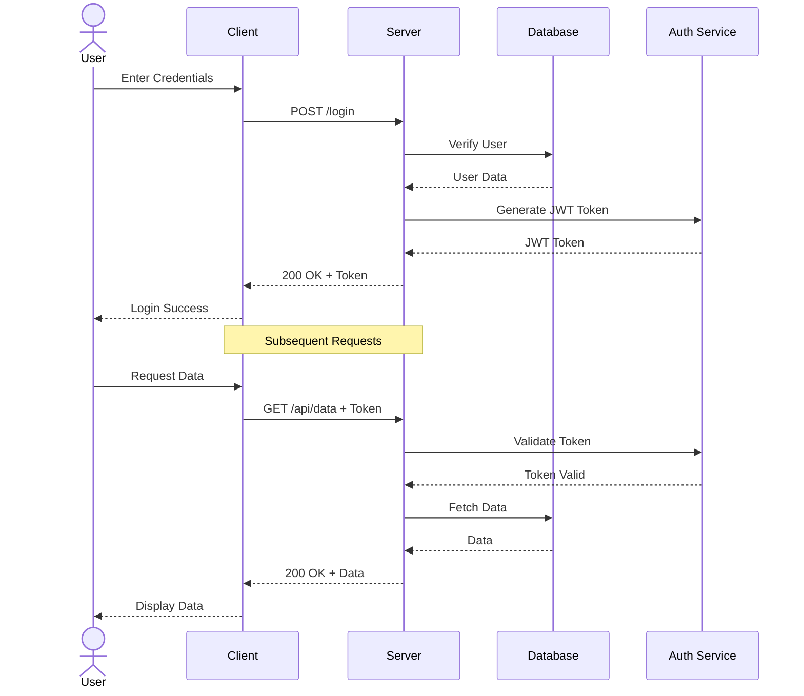

# 🎨 Ultimate Markdown Template & Components Library

> **Version 2.0** - Comprehensive Markdown, HTML/CSS, and Mermaid Reference Guide
> **Last Updated:** December 2024
> **Purpose:** Professional documentation, dashboards, and interactive content creation

---

## 📑 Table of Contents

### PART 1: HTML/CSS Components Library
- [1.1 Status Cards & Dashboards](#11-status-cards--dashboards)
- [1.2 Navigation Components](#12-navigation-components)
- [1.3 Forms & Input Elements](#13-forms--input-elements)
- [1.4 Data Tables & Grids](#14-data-tables--grids)
- [1.5 Progress & Metrics](#15-progress--metrics)
- [1.6 Alerts & Notifications](#16-alerts--notifications)
- [1.7 Cards & Content Blocks](#17-cards--content-blocks)
- [1.8 Pricing & Comparison Tables](#18-pricing--comparison-tables)
- [1.9 Timeline Components](#19-timeline-components)
- [1.10 Interactive Elements](#110-interactive-elements)

### PART 2: Mermaid Diagram Gallery
- [2.1 Flowcharts & Process Diagrams](#21-flowcharts--process-diagrams)
- [2.2 Sequence Diagrams](#22-sequence-diagrams)
- [2.3 Gantt Charts](#23-gantt-charts)
- [2.4 State Diagrams](#24-state-diagrams)
- [2.5 Entity-Relationship Diagrams](#25-entity-relationship-diagrams)
- [2.6 Class Diagrams](#26-class-diagrams)
- [2.7 User Journey Maps](#27-user-journey-maps)
- [2.8 Git Graphs](#28-git-graphs)
- [2.9 Pie & XY Charts](#29-pie--xy-charts)
- [2.10 Mind Maps & Quadrant Charts](#210-mind-maps--quadrant-charts)

### PART 3: Advanced Markdown Features
- [3.1 Callouts & Admonitions](#31-callouts--admonitions)
- [3.2 Task Lists & Checklists](#32-task-lists--checklists)
- [3.3 Advanced Tables](#33-advanced-tables)
- [3.4 Footnotes & References](#34-footnotes--references)
- [3.5 Code Blocks & Syntax Highlighting](#35-code-blocks--syntax-highlighting)
- [3.6 Math & LaTeX](#36-math--latex)
- [3.7 Collapsible Sections](#37-collapsible-sections)
- [3.8 Keyboard Shortcuts](#38-keyboard-shortcuts)
- [3.9 Definition Lists](#39-definition-lists)
- [3.10 Embedded Content](#310-embedded-content)

### PART 4: Document Templates
- [4.1 Technical Documentation](#41-technical-documentation)
- [4.2 Meeting Notes](#42-meeting-notes)
- [4.3 Project Proposals](#43-project-proposals)
- [4.4 Sprint Planning](#44-sprint-planning)
- [4.5 Design Documents](#45-design-documents)
- [4.6 Incident Reports](#46-incident-reports)
- [4.7 Knowledge Base Articles](#47-knowledge-base-articles)

### PART 5: Best Practices & Quick Reference
- [5.1 Markdown Best Practices](#51-markdown-best-practices)
- [5.2 HTML/CSS Guidelines](#52-htmlcss-guidelines)
- [5.3 Accessibility Considerations](#53-accessibility-considerations)
- [5.4 Quick Copy-Paste Snippets](#54-quick-copy-paste-snippets)

---

# PART 1: HTML/CSS Components Library

## 1.1 Status Cards & Dashboards

### Insurance Claim Card - Action Required
<div style="border: 1px solid #ddd; border-radius: 12px; padding: 20px; background: linear-gradient(135deg, #ff416c 0%, #ff4b2b 100%); color: white; margin: 15px 0; box-shadow: 0 4px 6px rgba(0,0,0,0.1);">
    <div style="display: flex; justify-content: space-between; align-items: flex-start; margin-bottom: 15px;">
        <div style="display: flex; align-items: center;">
            <div style="width: 60px; height: 60px; border-radius: 50%; background: white; margin-right: 15px; display: flex; align-items: center; justify-content: center; color: #ff416c; font-weight: bold; font-size: 18px;">
                FM
            </div>
            <div>
                <h3 style="margin: 0; color: white; font-size: 20px;">Feresa Martinez</h3>
                <p style="margin: 2px 0; opacity: 0.9; font-size: 14px;">Homeowner</p>
            </div>
        </div>
        <div style="background: rgba(255,255,255,0.2); padding: 5px 10px; border-radius: 15px; font-size: 12px; font-weight: bold;">
            ACTION REQUIRED
        </div>
    </div>

    <div style="display: grid; grid-template-columns: 1fr 1fr; gap: 15px; margin-bottom: 15px;">
        <div>
            <small style="opacity: 0.8; text-transform: uppercase; font-weight: 600;">Claim Details</small>
            <div style="margin-top: 5px; font-size: 14px;">
                <div><strong>Claim #:</strong> 70089 09915-1-2</div>
                <div><strong>Type:</strong> Hail Damage</div>
                <div><strong>Date of Loss:</strong> March 15, 2024</div>
                <div><strong>Property:</strong> 1234 Oak Street, Dallas, TX</div>
            </div>
        </div>
        <div>
            <small style="opacity: 0.8; text-transform: uppercase; font-weight: 600;">Adjuster Info</small>
            <div style="margin-top: 5px; font-size: 14px;">
                <div><strong>Company:</strong> State Farm</div>
                <div><strong>Adjuster:</strong> Todd Burke</div>
                <div><strong>Phone:</strong> (555) 123-4567</div>
                <div><strong>Email:</strong> tburke@statefarm.com</div>
            </div>
        </div>
    </div>

    <div style="margin-bottom: 15px;">
        <small style="opacity: 0.8; text-transform: uppercase; font-weight: 600;">Settlement Amount</small>
        <div style="font-size: 18px; font-weight: bold; margin-top: 5px;">$24,750.00</div>
    </div>

    <div>
        <small style="opacity: 0.8; text-transform: uppercase; font-weight: 600;">Next Actions</small>
        <ul style="margin-top: 5px; padding-left: 20px; font-size: 14px;">
            <li>Send final invoice with supplement to adjuster</li>
            <li>Submit additional roof inspection photos</li>
            <li>Schedule final walkthrough</li>
        </ul>
    </div>
</div>

### Status Legend Component
<div style="display: flex; flex-wrap: wrap; gap: 10px; margin-bottom: 20px; padding: 15px; background: #f8f9fa; border-radius: 8px;">
    <div style="display: flex; align-items: center; gap: 5px;">
        <div style="width: 20px; height: 20px; background: linear-gradient(135deg, #28a745 0%, #20c997 100%); border-radius: 50%;"></div>
        <span style="font-size: 12px; font-weight: 500;">Settled/Complete</span>
    </div>
    <div style="display: flex; align-items: center; gap: 5px;">
        <div style="width: 20px; height: 20px; background: linear-gradient(135deg, #43cea2 0%, #185a9d 100%); border-radius: 50%;"></div>
        <span style="font-size: 12px; font-weight: 500;">In Progress</span>
    </div>
    <div style="display: flex; align-items: center; gap: 5px;">
        <div style="width: 20px; height: 20px; background: linear-gradient(135deg, #f7971e 0%, #ffd200 100%); border-radius: 50%;"></div>
        <span style="font-size: 12px; font-weight: 500;">Pending Review</span>
    </div>
    <div style="display: flex; align-items: center; gap: 5px;">
        <div style="width: 20px; height: 20px; background: linear-gradient(135deg, #ff416c 0%, #ff4b2b 100%); border-radius: 50%;"></div>
        <span style="font-size: 12px; font-weight: 500;">Action Required</span>
    </div>
</div>

---

## 1.2 Navigation Components

### Horizontal Navigation Bar
<nav style="background: linear-gradient(135deg, #667eea 0%, #764ba2 100%); padding: 15px 30px; border-radius: 8px; margin: 20px 0;">
    <div style="display: flex; justify-content: space-between; align-items: center;">
        <div style="color: white; font-size: 24px; font-weight: bold;">Logo</div>
        <div style="display: flex; gap: 25px;">
            <a href="#" style="color: white; text-decoration: none; font-weight: 500;">Home</a>
            <a href="#" style="color: white; text-decoration: none; font-weight: 500;">Products</a>
            <a href="#" style="color: white; text-decoration: none; font-weight: 500;">Services</a>
            <a href="#" style="color: white; text-decoration: none; font-weight: 500;">About</a>
            <a href="#" style="color: white; text-decoration: none; font-weight: 500;">Contact</a>
        </div>
        <button style="background: white; color: #667eea; border: none; padding: 10px 20px; border-radius: 6px; font-weight: bold; cursor: pointer;">Sign In</button>
    </div>
</nav>

### Breadcrumb Navigation
<div style="background: #f8f9fa; padding: 12px 20px; border-radius: 6px; margin: 15px 0;">
    <nav style="font-size: 14px;">
        <a href="#" style="color: #007bff; text-decoration: none;">Home</a>
        <span style="margin: 0 8px; color: #6c757d;">/</span>
        <a href="#" style="color: #007bff; text-decoration: none;">Documentation</a>
        <span style="margin: 0 8px; color: #6c757d;">/</span>
        <a href="#" style="color: #007bff; text-decoration: none;">Templates</a>
        <span style="margin: 0 8px; color: #6c757d;">/</span>
        <span style="color: #6c757d;">Current Page</span>
    </nav>
</div>

### Sidebar Navigation
<div style="display: grid; grid-template-columns: 250px 1fr; gap: 20px; margin: 20px 0;">
    <aside style="background: #2d3748; padding: 20px; border-radius: 8px; color: white;">
        <h3 style="margin-top: 0; color: white;">Navigation</h3>
        <ul style="list-style: none; padding: 0;">
            <li style="padding: 10px; margin: 5px 0; background: #4a5568; border-radius: 6px; cursor: pointer;">📊 Dashboard</li>
            <li style="padding: 10px; margin: 5px 0; border-radius: 6px; cursor: pointer;">📝 Projects</li>
            <li style="padding: 10px; margin: 5px 0; border-radius: 6px; cursor: pointer;">👥 Team</li>
            <li style="padding: 10px; margin: 5px 0; border-radius: 6px; cursor: pointer;">⚙️ Settings</li>
        </ul>
    </aside>
    <main style="background: #f8f9fa; padding: 20px; border-radius: 8px;">
        <h2>Main Content Area</h2>
        <p>Your content goes here...</p>
    </main>
</div>

---

## 1.3 Forms & Input Elements

### Contact Form
<form style="background: white; padding: 30px; border-radius: 12px; box-shadow: 0 2px 10px rgba(0,0,0,0.1); max-width: 500px; margin: 20px 0;">
    <h3 style="margin-top: 0; color: #2d3748;">Contact Us</h3>

    <div style="margin-bottom: 20px;">
        <label style="display: block; margin-bottom: 5px; font-weight: 600; color: #4a5568;">Full Name</label>
        <input type="text" placeholder="John Doe" style="width: 100%; padding: 12px; border: 1px solid #cbd5e0; border-radius: 6px; font-size: 14px; box-sizing: border-box;">
    </div>

    <div style="margin-bottom: 20px;">
        <label style="display: block; margin-bottom: 5px; font-weight: 600; color: #4a5568;">Email Address</label>
        <input type="email" placeholder="john@example.com" style="width: 100%; padding: 12px; border: 1px solid #cbd5e0; border-radius: 6px; font-size: 14px; box-sizing: border-box;">
    </div>

    <div style="margin-bottom: 20px;">
        <label style="display: block; margin-bottom: 5px; font-weight: 600; color: #4a5568;">Subject</label>
        <select style="width: 100%; padding: 12px; border: 1px solid #cbd5e0; border-radius: 6px; font-size: 14px; box-sizing: border-box;">
            <option>General Inquiry</option>
            <option>Technical Support</option>
            <option>Sales Question</option>
            <option>Feedback</option>
        </select>
    </div>

    <div style="margin-bottom: 20px;">
        <label style="display: block; margin-bottom: 5px; font-weight: 600; color: #4a5568;">Message</label>
        <textarea placeholder="Your message here..." rows="4" style="width: 100%; padding: 12px; border: 1px solid #cbd5e0; border-radius: 6px; font-size: 14px; resize: vertical; box-sizing: border-box;"></textarea>
    </div>

    <div style="margin-bottom: 20px;">
        <label style="display: flex; align-items: center; gap: 8px; cursor: pointer;">
            <input type="checkbox" style="width: 18px; height: 18px;">
            <span style="font-size: 14px; color: #4a5568;">I agree to the terms and conditions</span>
        </label>
    </div>

    <button type="submit" style="width: 100%; background: linear-gradient(135deg, #667eea 0%, #764ba2 100%); color: white; border: none; padding: 14px; border-radius: 6px; font-size: 16px; font-weight: bold; cursor: pointer;">Send Message</button>
</form>

### Search Bar with Filter
<div style="background: white; padding: 20px; border-radius: 8px; box-shadow: 0 2px 8px rgba(0,0,0,0.1); margin: 20px 0;">
    <div style="display: flex; gap: 10px; margin-bottom: 15px;">
        <input type="text" placeholder="Search..." style="flex: 1; padding: 12px; border: 1px solid #cbd5e0; border-radius: 6px; font-size: 14px;">
        <button style="background: #007bff; color: white; border: none; padding: 12px 24px; border-radius: 6px; font-weight: bold; cursor: pointer;">🔍 Search</button>
    </div>
    <div style="display: flex; gap: 10px; flex-wrap: wrap;">
        <button style="background: #e9ecef; border: none; padding: 8px 16px; border-radius: 20px; font-size: 13px; cursor: pointer;">All</button>
        <button style="background: #e9ecef; border: none; padding: 8px 16px; border-radius: 20px; font-size: 13px; cursor: pointer;">Documents</button>
        <button style="background: #e9ecef; border: none; padding: 8px 16px; border-radius: 20px; font-size: 13px; cursor: pointer;">Images</button>
        <button style="background: #e9ecef; border: none; padding: 8px 16px; border-radius: 20px; font-size: 13px; cursor: pointer;">Videos</button>
    </div>
</div>

---

## 1.4 Data Tables & Grids

### Modern Data Table
<div style="overflow-x: auto; margin: 20px 0;">
    <table style="width: 100%; border-collapse: collapse; background: white; border-radius: 8px; overflow: hidden; box-shadow: 0 2px 8px rgba(0,0,0,0.1);">
        <thead>
            <tr style="background: linear-gradient(135deg, #667eea 0%, #764ba2 100%); color: white;">
                <th style="padding: 15px; text-align: left; font-weight: 600;">Product</th>
                <th style="padding: 15px; text-align: left; font-weight: 600;">Category</th>
                <th style="padding: 15px; text-align: center; font-weight: 600;">Stock</th>
                <th style="padding: 15px; text-align: right; font-weight: 600;">Price</th>
                <th style="padding: 15px; text-align: center; font-weight: 600;">Status</th>
            </tr>
        </thead>
        <tbody>
            <tr style="border-bottom: 1px solid #e9ecef;">
                <td style="padding: 15px;">Premium Widget Pro</td>
                <td style="padding: 15px;">Electronics</td>
                <td style="padding: 15px; text-align: center;">247</td>
                <td style="padding: 15px; text-align: right; font-weight: 600;">$299.99</td>
                <td style="padding: 15px; text-align: center;">
                    <span style="background: #d4edda; color: #155724; padding: 4px 12px; border-radius: 12px; font-size: 12px; font-weight: 600;">In Stock</span>
                </td>
            </tr>
            <tr style="border-bottom: 1px solid #e9ecef;">
                <td style="padding: 15px;">Standard Gadget</td>
                <td style="padding: 15px;">Accessories</td>
                <td style="padding: 15px; text-align: center;">8</td>
                <td style="padding: 15px; text-align: right; font-weight: 600;">$49.99</td>
                <td style="padding: 15px; text-align: center;">
                    <span style="background: #fff3cd; color: #856404; padding: 4px 12px; border-radius: 12px; font-size: 12px; font-weight: 600;">Low Stock</span>
                </td>
            </tr>
            <tr>
                <td style="padding: 15px;">Deluxe Tool Set</td>
                <td style="padding: 15px;">Tools</td>
                <td style="padding: 15px; text-align: center;">0</td>
                <td style="padding: 15px; text-align: right; font-weight: 600;">$159.99</td>
                <td style="padding: 15px; text-align: center;">
                    <span style="background: #f8d7da; color: #721c24; padding: 4px 12px; border-radius: 12px; font-size: 12px; font-weight: 600;">Out of Stock</span>
                </td>
            </tr>
        </tbody>
    </table>
</div>

---

## 1.5 Progress & Metrics

### Progress Bar Collection
<div style="background: white; padding: 25px; border-radius: 8px; box-shadow: 0 2px 8px rgba(0,0,0,0.1); margin: 20px 0;">
    <h4 style="margin-top: 0;">Project Progress</h4>

    <div style="margin-bottom: 20px;">
        <div style="display: flex; justify-content: space-between; margin-bottom: 5px;">
            <span style="font-weight: 600; color: #4a5568;">Frontend Development</span>
            <span style="font-weight: 600; color: #667eea;">85%</span>
        </div>
        <div style="background: #e9ecef; height: 10px; border-radius: 5px; overflow: hidden;">
            <div style="background: linear-gradient(90deg, #667eea 0%, #764ba2 100%); width: 85%; height: 100%;"></div>
        </div>
    </div>

    <div style="margin-bottom: 20px;">
        <div style="display: flex; justify-content: space-between; margin-bottom: 5px;">
            <span style="font-weight: 600; color: #4a5568;">Backend API</span>
            <span style="font-weight: 600; color: #28a745;">60%</span>
        </div>
        <div style="background: #e9ecef; height: 10px; border-radius: 5px; overflow: hidden;">
            <div style="background: linear-gradient(90deg, #28a745 0%, #20c997 100%); width: 60%; height: 100%;"></div>
        </div>
    </div>

    <div>
        <div style="display: flex; justify-content: space-between; margin-bottom: 5px;">
            <span style="font-weight: 600; color: #4a5568;">Testing & QA</span>
            <span style="font-weight: 600; color: #ffc107;">35%</span>
        </div>
        <div style="background: #e9ecef; height: 10px; border-radius: 5px; overflow: hidden;">
            <div style="background: linear-gradient(90deg, #f7971e 0%, #ffd200 100%); width: 35%; height: 100%;"></div>
        </div>
    </div>
</div>

### Stats Dashboard
<div style="display: grid; grid-template-columns: repeat(auto-fit, minmax(200px, 1fr)); gap: 15px; margin: 20px 0;">
    <div style="background: linear-gradient(135deg, #667eea 0%, #764ba2 100%); padding: 25px; border-radius: 12px; color: white; box-shadow: 0 4px 6px rgba(0,0,0,0.1);">
        <div style="font-size: 14px; opacity: 0.9; margin-bottom: 8px;">Total Revenue</div>
        <div style="font-size: 32px; font-weight: bold; margin-bottom: 8px;">$124,592</div>
        <div style="font-size: 13px; opacity: 0.8;">📈 +12.5% from last month</div>
    </div>

    <div style="background: linear-gradient(135deg, #43cea2 0%, #185a9d 100%); padding: 25px; border-radius: 12px; color: white; box-shadow: 0 4px 6px rgba(0,0,0,0.1);">
        <div style="font-size: 14px; opacity: 0.9; margin-bottom: 8px;">Active Users</div>
        <div style="font-size: 32px; font-weight: bold; margin-bottom: 8px;">3,847</div>
        <div style="font-size: 13px; opacity: 0.8;">👥 +248 this week</div>
    </div>

    <div style="background: linear-gradient(135deg, #f7971e 0%, #ffd200 100%); padding: 25px; border-radius: 12px; color: white; box-shadow: 0 4px 6px rgba(0,0,0,0.1);">
        <div style="font-size: 14px; opacity: 0.9; margin-bottom: 8px;">Pending Tasks</div>
        <div style="font-size: 32px; font-weight: bold; margin-bottom: 8px;">23</div>
        <div style="font-size: 13px; opacity: 0.8;">📋 8 high priority</div>
    </div>

    <div style="background: linear-gradient(135deg, #ff416c 0%, #ff4b2b 100%); padding: 25px; border-radius: 12px; color: white; box-shadow: 0 4px 6px rgba(0,0,0,0.1);">
        <div style="font-size: 14px; opacity: 0.9; margin-bottom: 8px;">Conversion Rate</div>
        <div style="font-size: 32px; font-weight: bold; margin-bottom: 8px;">4.8%</div>
        <div style="font-size: 13px; opacity: 0.8;">📊 +0.3% from yesterday</div>
    </div>
</div>

---

## 1.6 Alerts & Notifications

### Alert Styles
<div style="background: #d4edda; border-left: 4px solid #28a745; padding: 15px; border-radius: 6px; margin: 15px 0;">
    <strong style="color: #155724;">✅ Success!</strong>
    <p style="margin: 5px 0 0 0; color: #155724;">Your changes have been saved successfully.</p>
</div>

<div style="background: #d1ecf1; border-left: 4px solid #17a2b8; padding: 15px; border-radius: 6px; margin: 15px 0;">
    <strong style="color: #0c5460;">ℹ️ Information</strong>
    <p style="margin: 5px 0 0 0; color: #0c5460;">This feature will be available in the next update.</p>
</div>

<div style="background: #fff3cd; border-left: 4px solid #ffc107; padding: 15px; border-radius: 6px; margin: 15px 0;">
    <strong style="color: #856404;">⚠️ Warning</strong>
    <p style="margin: 5px 0 0 0; color: #856404;">You are approaching your storage limit. Please upgrade your plan.</p>
</div>

<div style="background: #f8d7da; border-left: 4px solid #dc3545; padding: 15px; border-radius: 6px; margin: 15px 0;">
    <strong style="color: #721c24;">❌ Error</strong>
    <p style="margin: 5px 0 0 0; color: #721c24;">Failed to process your request. Please try again later.</p>
</div>

### Notification Toast
<div style="position: fixed; top: 20px; right: 20px; background: white; padding: 20px; border-radius: 12px; box-shadow: 0 4px 12px rgba(0,0,0,0.15); max-width: 350px; border-left: 4px solid #667eea;">
    <div style="display: flex; justify-content: space-between; align-items: start; margin-bottom: 10px;">
        <strong style="color: #2d3748; font-size: 16px;">New Message</strong>
        <button style="background: none; border: none; font-size: 20px; color: #a0aec0; cursor: pointer;">×</button>
    </div>
    <p style="margin: 0; color: #4a5568; font-size: 14px;">You have 3 new notifications waiting for your review.</p>
    <div style="margin-top: 12px; display: flex; gap: 10px;">
        <button style="background: #667eea; color: white; border: none; padding: 8px 16px; border-radius: 6px; font-size: 13px; cursor: pointer;">View</button>
        <button style="background: #e9ecef; border: none; padding: 8px 16px; border-radius: 6px; font-size: 13px; cursor: pointer;">Dismiss</button>
    </div>
</div>

---

## 1.7 Cards & Content Blocks

### Feature Cards
<div style="display: grid; grid-template-columns: repeat(auto-fit, minmax(280px, 1fr)); gap: 20px; margin: 20px 0;">
    <div style="background: white; padding: 30px; border-radius: 12px; box-shadow: 0 2px 10px rgba(0,0,0,0.1); text-align: center;">
        <div style="font-size: 48px; margin-bottom: 15px;">🚀</div>
        <h3 style="color: #2d3748; margin-bottom: 10px;">Fast Performance</h3>
        <p style="color: #718096; font-size: 14px; line-height: 1.6;">Lightning-fast load times and optimized for all devices.</p>
    </div>

    <div style="background: white; padding: 30px; border-radius: 12px; box-shadow: 0 2px 10px rgba(0,0,0,0.1); text-align: center;">
        <div style="font-size: 48px; margin-bottom: 15px;">🔒</div>
        <h3 style="color: #2d3748; margin-bottom: 10px;">Secure & Private</h3>
        <p style="color: #718096; font-size: 14px; line-height: 1.6;">Bank-level encryption keeps your data safe and secure.</p>
    </div>

    <div style="background: white; padding: 30px; border-radius: 12px; box-shadow: 0 2px 10px rgba(0,0,0,0.1); text-align: center;">
        <div style="font-size: 48px; margin-bottom: 15px;">💡</div>
        <h3 style="color: #2d3748; margin-bottom: 10px;">Easy to Use</h3>
        <p style="color: #718096; font-size: 14px; line-height: 1.6;">Intuitive interface designed for everyone.</p>
    </div>
</div>

### Testimonial Card
<div style="background: white; padding: 30px; border-radius: 12px; box-shadow: 0 4px 12px rgba(0,0,0,0.1); max-width: 600px; margin: 20px 0;">
    <div style="display: flex; gap: 20px; align-items: start;">
        
        <div style="flex: 1;">
            <div style="color: #ffc107; margin-bottom: 10px;">★★★★★</div>
            <p style="color: #4a5568; font-size: 15px; line-height: 1.7; margin-bottom: 15px;">"This product has completely transformed our workflow. The team is more productive and happier than ever. Highly recommend to anyone looking to improve their processes."</p>
            <div>
                <strong style="color: #2d3748;">Sarah Johnson</strong>
                <div style="color: #a0aec0; font-size: 14px;">CEO, Tech Solutions Inc.</div>
            </div>
        </div>
    </div>
</div>

---

## 1.8 Pricing & Comparison Tables

### Pricing Cards
<div style="display: grid; grid-template-columns: repeat(auto-fit, minmax(280px, 1fr)); gap: 20px; margin: 20px 0;">
    <div style="background: white; padding: 30px; border-radius: 12px; box-shadow: 0 2px 10px rgba(0,0,0,0.1); text-align: center;">
        <h3 style="color: #2d3748; margin-bottom: 10px;">Basic</h3>
        <div style="font-size: 48px; font-weight: bold; color: #667eea; margin: 20px 0;">
            $9
            <span style="font-size: 18px; color: #a0aec0; font-weight: normal;">/month</span>
        </div>
        <ul style="list-style: none; padding: 0; margin: 20px 0; text-align: left;">
            <li style="padding: 10px 0; border-bottom: 1px solid #e9ecef;">✅ 5 Projects</li>
            <li style="padding: 10px 0; border-bottom: 1px solid #e9ecef;">✅ 10 GB Storage</li>
            <li style="padding: 10px 0; border-bottom: 1px solid #e9ecef;">✅ Email Support</li>
            <li style="padding: 10px 0; color: #cbd5e0;">❌ Priority Support</li>
        </ul>
        <button style="width: 100%; background: #e9ecef; color: #2d3748; border: none; padding: 14px; border-radius: 6px; font-weight: bold; cursor: pointer;">Choose Plan</button>
    </div>

    <div style="background: linear-gradient(135deg, #667eea 0%, #764ba2 100%); padding: 30px; border-radius: 12px; box-shadow: 0 4px 12px rgba(0,0,0,0.2); text-align: center; position: relative;">
        <div style="background: #ffc107; color: white; padding: 5px 15px; border-radius: 12px; font-size: 12px; font-weight: bold; position: absolute; top: -10px; right: 20px;">POPULAR</div>
        <h3 style="color: white; margin-bottom: 10px;">Pro</h3>
        <div style="font-size: 48px; font-weight: bold; color: white; margin: 20px 0;">
            $29
            <span style="font-size: 18px; opacity: 0.9; font-weight: normal;">/month</span>
        </div>
        <ul style="list-style: none; padding: 0; margin: 20px 0; text-align: left; color: white;">
            <li style="padding: 10px 0; border-bottom: 1px solid rgba(255,255,255,0.2);">✅ Unlimited Projects</li>
            <li style="padding: 10px 0; border-bottom: 1px solid rgba(255,255,255,0.2);">✅ 100 GB Storage</li>
            <li style="padding: 10px 0; border-bottom: 1px solid rgba(255,255,255,0.2);">✅ Priority Support</li>
            <li style="padding: 10px 0; border-bottom: 1px solid rgba(255,255,255,0.2);">✅ Advanced Analytics</li>
        </ul>
        <button style="width: 100%; background: white; color: #667eea; border: none; padding: 14px; border-radius: 6px; font-weight: bold; cursor: pointer;">Choose Plan</button>
    </div>

    <div style="background: white; padding: 30px; border-radius: 12px; box-shadow: 0 2px 10px rgba(0,0,0,0.1); text-align: center;">
        <h3 style="color: #2d3748; margin-bottom: 10px;">Enterprise</h3>
        <div style="font-size: 48px; font-weight: bold; color: #667eea; margin: 20px 0;">
            $99
            <span style="font-size: 18px; color: #a0aec0; font-weight: normal;">/month</span>
        </div>
        <ul style="list-style: none; padding: 0; margin: 20px 0; text-align: left;">
            <li style="padding: 10px 0; border-bottom: 1px solid #e9ecef;">✅ Everything in Pro</li>
            <li style="padding: 10px 0; border-bottom: 1px solid #e9ecef;">✅ Unlimited Storage</li>
            <li style="padding: 10px 0; border-bottom: 1px solid #e9ecef;">✅ 24/7 Phone Support</li>
            <li style="padding: 10px 0; border-bottom: 1px solid #e9ecef;">✅ Custom Integrations</li>
        </ul>
        <button style="width: 100%; background: #667eea; color: white; border: none; padding: 14px; border-radius: 6px; font-weight: bold; cursor: pointer;">Contact Sales</button>
    </div>
</div>

---

## 1.9 Timeline Components

### Vertical Timeline
<div style="position: relative; padding-left: 40px; margin: 30px 0;">
    <div style="position: absolute; left: 15px; top: 0; bottom: 0; width: 2px; background: #e9ecef;"></div>

    <div style="position: relative; margin-bottom: 30px;">
        <div style="position: absolute; left: -32px; width: 16px; height: 16px; background: #28a745; border-radius: 50%; border: 3px solid white; box-shadow: 0 0 0 2px #28a745;"></div>
        <div style="background: white; padding: 20px; border-radius: 8px; box-shadow: 0 2px 8px rgba(0,0,0,0.1);">
            <div style="color: #a0aec0; font-size: 13px; margin-bottom: 5px;">December 28, 2024</div>
            <strong style="color: #2d3748; font-size: 16px;">Project Completed</strong>
            <p style="color: #718096; margin: 8px 0 0 0; font-size: 14px;">Successfully delivered all features ahead of schedule.</p>
        </div>
    </div>

    <div style="position: relative; margin-bottom: 30px;">
        <div style="position: absolute; left: -32px; width: 16px; height: 16px; background: #007bff; border-radius: 50%; border: 3px solid white; box-shadow: 0 0 0 2px #007bff;"></div>
        <div style="background: white; padding: 20px; border-radius: 8px; box-shadow: 0 2px 8px rgba(0,0,0,0.1);">
            <div style="color: #a0aec0; font-size: 13px; margin-bottom: 5px;">December 15, 2024</div>
            <strong style="color: #2d3748; font-size: 16px;">Testing Phase Started</strong>
            <p style="color: #718096; margin: 8px 0 0 0; font-size: 14px;">QA team began comprehensive testing procedures.</p>
        </div>
    </div>

    <div style="position: relative;">
        <div style="position: absolute; left: -32px; width: 16px; height: 16px; background: #ffc107; border-radius: 50%; border: 3px solid white; box-shadow: 0 0 0 2px #ffc107;"></div>
        <div style="background: white; padding: 20px; border-radius: 8px; box-shadow: 0 2px 8px rgba(0,0,0,0.1);">
            <div style="color: #a0aec0; font-size: 13px; margin-bottom: 5px;">December 1, 2024</div>
            <strong style="color: #2d3748; font-size: 16px;">Development Started</strong>
            <p style="color: #718096; margin: 8px 0 0 0; font-size: 14px;">Kicked off development with team planning session.</p>
        </div>
    </div>
</div>

---

## 1.10 Interactive Elements

### Accordion/Collapsible
<div style="margin: 20px 0;">
    <details style="background: white; border: 1px solid #e9ecef; border-radius: 8px; margin-bottom: 10px; padding: 15px;">
        <summary style="cursor: pointer; font-weight: 600; color: #2d3748; outline: none;">
            What is your refund policy?
        </summary>
        <p style="margin-top: 15px; color: #718096; line-height: 1.6;">
            We offer a 30-day money-back guarantee on all purchases. If you're not completely satisfied, contact our support team for a full refund.
        </p>
    </details>

    <details style="background: white; border: 1px solid #e9ecef; border-radius: 8px; margin-bottom: 10px; padding: 15px;">
        <summary style="cursor: pointer; font-weight: 600; color: #2d3748; outline: none;">
            How do I upgrade my plan?
        </summary>
        <p style="margin-top: 15px; color: #718096; line-height: 1.6;">
            Visit your account settings and select "Upgrade Plan". Choose your desired plan and complete the payment process.
        </p>
    </details>

    <details style="background: white; border: 1px solid #e9ecef; border-radius: 8px; padding: 15px;">
        <summary style="cursor: pointer; font-weight: 600; color: #2d3748; outline: none;">
            Do you offer technical support?
        </summary>
        <p style="margin-top: 15px; color: #718096; line-height: 1.6;">
            Yes! All plans include email support. Pro and Enterprise plans also get priority support with faster response times.
        </p>
    </details>
</div>

### Button Collection
<div style="display: flex; flex-wrap: wrap; gap: 10px; margin: 20px 0;">
    <button style="background: #007bff; color: white; border: none; padding: 12px 24px; border-radius: 6px; font-weight: bold; cursor: pointer;">Primary Button</button>
    <button style="background: #28a745; color: white; border: none; padding: 12px 24px; border-radius: 6px; font-weight: bold; cursor: pointer;">Success Button</button>
    <button style="background: #dc3545; color: white; border: none; padding: 12px 24px; border-radius: 6px; font-weight: bold; cursor: pointer;">Danger Button</button>
    <button style="background: #ffc107; color: #2d3748; border: none; padding: 12px 24px; border-radius: 6px; font-weight: bold; cursor: pointer;">Warning Button</button>
    <button style="background: transparent; color: #007bff; border: 2px solid #007bff; padding: 12px 24px; border-radius: 6px; font-weight: bold; cursor: pointer;">Outline Button</button>
    <button style="background: #e9ecef; color: #4a5568; border: none; padding: 12px 24px; border-radius: 6px; font-weight: bold; cursor: pointer;">Secondary Button</button>
</div>

---

# PART 2: Mermaid Diagram Gallery

## 2.1 Flowcharts & Process Diagrams

### Decision Flowchart


### Swimlane Diagram


---

## 2.2 Sequence Diagrams

### API Authentication Flow


### Microservices Communication


---

## 2.3 Gantt Charts

### Project Timeline


### Sprint Planning


---

## 2.4 State Diagrams

### Order State Machine


### User Authentication States


---

## 2.5 Entity-Relationship Diagrams

### E-Commerce Database Schema


---

## 2.6 Class Diagrams

### Object-Oriented Design


---

## 2.7 User Journey Maps

### Customer Onboarding Journey


---

## 2.8 Git Graphs

### Feature Branch Workflow
```mermaid
gitgraph
    commit id: "Initial commit"
    commit id: "Add base structure"
    branch develop
    checkout develop
    commit id: "Setup dev environment"
    branch feature/login
    checkout feature/login
    commit id: "Add login form"
    commit id: "Add authentication"
    checkout develop
    merge feature/login
    branch feature/dashboard
    checkout feature/dashboard
    commit id: "Create dashboard layout"
    commit id: "Add widgets"
    checkout develop
    merge feature/dashboard
    checkout main
    merge develop tag: "v1.0.0"
```

---

## 2.9 Pie & XY Charts

### Revenue Distribution


### Monthly Growth Chart


---

## 2.10 Mind Maps & Quadrant Charts

### Product Strategy Mind Map


### Priority Matrix


---

# PART 3: Advanced Markdown Features

## 3.1 Callouts & Admonitions

> [!NOTE]
> This is a note callout. Use it for general information and tips.

> [!TIP]
> This is a tip callout. Great for helpful suggestions and best practices.

> [!IMPORTANT]
> This is an important callout. Use for critical information.

> [!WARNING]
> This is a warning callout. Alerts users to potential issues.

> [!CAUTION]
> This is a caution callout. For serious warnings about destructive actions.

> [!SUCCESS]
> This is a success callout. Celebrate achievements and completed tasks.

> [!QUESTION]
> This is a question callout. Perfect for FAQ sections or clarifications needed.

> [!INFO]
> This is an info callout. Additional contextual information.

---

## 3.2 Task Lists & Checklists

### Simple Task List
- [x] Complete project setup
- [x] Configure development environment
- [ ] Implement core features
- [ ] Write unit tests
- [ ] Deploy to staging

### Nested Task Lists
- [x] **Phase 1: Planning**
  - [x] Gather requirements
  - [x] Create project timeline
  - [x] Assign team roles
- [ ] **Phase 2: Development**
  - [x] Setup repository
  - [x] Create base structure
  - [ ] Implement features
    - [x] User authentication
    - [ ] Dashboard
    - [ ] Reporting module
  - [ ] Code review
- [ ] **Phase 3: Testing**
  - [ ] Unit tests
  - [ ] Integration tests
  - [ ] User acceptance testing

### Progress Tracking
**Frontend Development** (60% complete)
- [x] Component library setup
- [x] Routing configuration
- [x] State management
- [ ] API integration
- [ ] Responsive design
- [ ] Performance optimization

---

## 3.3 Advanced Tables

### Multi-Column Aligned Table
| Feature | Basic | Professional | Enterprise |
|:--------|:-----:|:------------:|-----------:|
| Users | 5 | 50 | Unlimited |
| Storage | 10 GB | 100 GB | 1 TB |
| Support | Email | Email + Chat | 24/7 Phone |
| Price | $9/mo | $29/mo | $99/mo |
| Analytics | ❌ | ✅ | ✅ |
| API Access | ❌ | Limited | Full |
| Custom Branding | ❌ | ❌ | ✅ |

### Comparison Table with Styling
| Feature | Markdown | HTML | React |
|---------|----------|------|-------|
| **Learning Curve** | Easy 🟢 | Medium 🟡 | Hard 🔴 |
| **Flexibility** | Low | High | Very High |
| **Styling** | Limited | Full | Component-based |
| **Interactivity** | Static | Dynamic | Dynamic |
| **Best For** | Documentation | Web pages | Applications |

### Data Table with Footnotes
| Metric | Q1 | Q2 | Q3 | Q4 |
|--------|----|----|----|----|
| Revenue[^1] | $125K | $156K | $189K | $234K |
| Users[^2] | 1,240 | 2,580 | 4,120 | 6,890 |
| Conversion | 3.2% | 3.8% | 4.1% | 4.6% |

[^1]: All figures in USD
[^2]: Monthly active users

---

## 3.4 Footnotes & References

This is a statement that needs a reference[^ref1].

Here's another fact with a different citation[^ref2].

You can also use inline footnotes^[This is an inline footnote].

Multiple references to the same footnote work too[^ref1].

[^ref1]: Smith, J. (2024). "Best Practices in Documentation." Tech Publishing.
[^ref2]: Johnson, A. (2023). "Modern Markdown Techniques." Digital Press, pp. 42-58.

---

## 3.5 Code Blocks & Syntax Highlighting

### Python Example
```python
def fibonacci(n):
    """Generate Fibonacci sequence up to n terms."""
    fib_sequence = [0, 1]

    while len(fib_sequence) < n:
        next_num = fib_sequence[-1] + fib_sequence[-2]
        fib_sequence.append(next_num)

    return fib_sequence[:n]

# Usage
result = fibonacci(10)
print(f"First 10 Fibonacci numbers: {result}")
```

### JavaScript/React Example
```javascript
import React, { useState, useEffect } from 'react';

const UserProfile = ({ userId }) => {
    const [user, setUser] = useState(null);
    const [loading, setLoading] = useState(true);

    useEffect(() => {
        const fetchUser = async () => {
            try {
                const response = await fetch(`/api/users/${userId}`);
                const data = await response.json();
                setUser(data);
            } catch (error) {
                console.error('Error fetching user:', error);
            } finally {
                setLoading(false);
            }
        };

        fetchUser();
    }, [userId]);

    if (loading) return <div>Loading...</div>;

    return (
        <div className="user-profile">
            <h2>{user.name}</h2>
            <p>{user.email}</p>
        </div>
    );
};

export default UserProfile;
```

### SQL Example
```sql
-- Create users table with indexes
CREATE TABLE users (
    id SERIAL PRIMARY KEY,
    email VARCHAR(255) UNIQUE NOT NULL,
    username VARCHAR(100) NOT NULL,
    created_at TIMESTAMP DEFAULT CURRENT_TIMESTAMP,
    updated_at TIMESTAMP DEFAULT CURRENT_TIMESTAMP
);

CREATE INDEX idx_users_email ON users(email);
CREATE INDEX idx_users_username ON users(username);

-- Complex query with JOIN
SELECT
    u.username,
    COUNT(o.id) as order_count,
    SUM(o.total_amount) as total_spent
FROM users u
LEFT JOIN orders o ON u.id = o.user_id
WHERE u.created_at >= '2024-01-01'
GROUP BY u.id, u.username
HAVING COUNT(o.id) > 0
ORDER BY total_spent DESC
LIMIT 10;
```

### YAML Configuration
```yaml
# Application Configuration
app:
  name: MyApplication
  version: 1.0.0
  environment: production

server:
  host: 0.0.0.0
  port: 8080
  ssl:
    enabled: true
    certificate: /path/to/cert.pem
    key: /path/to/key.pem

database:
  type: postgresql
  host: db.example.com
  port: 5432
  name: myapp_db
  credentials:
    username: ${DB_USER}
    password: ${DB_PASSWORD}
  pool:
    min: 5
    max: 20

logging:
  level: info
  format: json
  outputs:
    - console
    - file: /var/log/app.log
```

---

## 3.6 Math & LaTeX

### Inline Math
The Pythagorean theorem is $a^2 + b^2 = c^2$.

The quadratic formula is $x = \frac{-b \pm \sqrt{b^2-4ac}}{2a}$.

### Block Math Equations
$$
\int_{-\infty}^{\infty} e^{-x^2} dx = \sqrt{\pi}
$$

$$
\sum_{n=1}^{\infty} \frac{1}{n^2} = \frac{\pi^2}{6}
$$

### Matrix Notation
$$
\begin{bmatrix}
a & b \\
c & d
\end{bmatrix}
\begin{bmatrix}
x \\
y
\end{bmatrix}
=
\begin{bmatrix}
ax + by \\
cx + dy
\end{bmatrix}
$$

---

## 3.7 Collapsible Sections

<details>
<summary><strong>Click to expand: Installation Instructions</strong></summary>

### Step 1: Download
Download the latest version from our website.

### Step 2: Install Dependencies
```bash
npm install
# or
yarn install
```

### Step 3: Configure
Create a `.env` file with your configuration.

### Step 4: Run
```bash
npm start
```
</details>

<details>
<summary><strong>Click to expand: API Documentation</strong></summary>

### Authentication Endpoint
```
POST /api/auth/login
```

**Request Body:**
```json
{
  "email": "user@example.com",
  "password": "secretpassword"
}
```

**Response:**
```json
{
  "token": "eyJhbGciOiJIUzI1NiIsInR5cCI6IkpXVCJ9...",
  "user": {
    "id": 123,
    "email": "user@example.com",
    "name": "John Doe"
  }
}
```
</details>

---

## 3.8 Keyboard Shortcuts

Press <kbd>Ctrl</kbd> + <kbd>C</kbd> to copy

Press <kbd>Ctrl</kbd> + <kbd>V</kbd> to paste

Press <kbd>Ctrl</kbd> + <kbd>Z</kbd> to undo

Press <kbd>Ctrl</kbd> + <kbd>Shift</kbd> + <kbd>S</kbd> to save all

Press <kbd>⌘</kbd> + <kbd>Space</kbd> on Mac to open Spotlight

### Common Shortcuts Table
| Action | Windows/Linux | Mac |
|--------|---------------|-----|
| Copy | <kbd>Ctrl</kbd> + <kbd>C</kbd> | <kbd>⌘</kbd> + <kbd>C</kbd> |
| Paste | <kbd>Ctrl</kbd> + <kbd>V</kbd> | <kbd>⌘</kbd> + <kbd>V</kbd> |
| Save | <kbd>Ctrl</kbd> + <kbd>S</kbd> | <kbd>⌘</kbd> + <kbd>S</kbd> |
| Find | <kbd>Ctrl</kbd> + <kbd>F</kbd> | <kbd>⌘</kbd> + <kbd>F</kbd> |
| Undo | <kbd>Ctrl</kbd> + <kbd>Z</kbd> | <kbd>⌘</kbd> + <kbd>Z</kbd> |

---

## 3.9 Definition Lists

HTML
: HyperText Markup Language - The standard markup language for web pages.

CSS
: Cascading Style Sheets - Used for styling HTML documents.

JavaScript
: A programming language that enables interactive web pages.

API
: Application Programming Interface - A set of protocols for building software applications.

REST
: Representational State Transfer - An architectural style for web services.

---

## 3.10 Embedded Content

### YouTube Video Embed
<iframe width="560" height="315" src="https://www.youtube.com/embed/dQw4w9WgXcQ" frameborder="0" allow="accelerometer; autoplay; clipboard-write; encrypted-media; gyroscope; picture-in-picture" allowfullscreen></iframe>

### Google Maps Embed
<iframe src="https://www.google.com/maps/embed?pb=!1m18!1m12!1m3!1d3022.1841!2d-73.9875!3d40.7589!2m3!1f0!2f0!3f0!3m2!1i1024!2i768!4f13.1!3m3!1m2!1s0x0%3A0x0!2zNDDCsDQ1JzMyLjAiTiA3M8KwNTknMTUuMCJX!5e0!3m2!1sen!2sus!4v1234567890123!5m2!1sen!2sus" width="600" height="450" style="border:0;" allowfullscreen="" loading="lazy"></iframe>

### CodePen Embed
<iframe height="300" style="width: 100%;" scrolling="no" title="Animated Button" src="https://codepen.io/pen?editors=1010" frameborder="no" loading="lazy" allowtransparency="true" allowfullscreen="true"></iframe>

---

# PART 4: Document Templates

## 4.1 Technical Documentation

# API Documentation

## Overview
This API provides RESTful endpoints for managing user data and authentication.

**Base URL:** `https://api.example.com/v1`
**Authentication:** Bearer Token (JWT)

## Authentication

### Login
```http
POST /auth/login
Content-Type: application/json

{
  "email": "user@example.com",
  "password": "password123"
}
```

**Response:**
```json
{
  "success": true,
  "data": {
    "token": "eyJhbGciOiJIUzI1NiIsInR5cCI6IkpXVCJ9...",
    "user": {
      "id": 1,
      "email": "user@example.com",
      "name": "John Doe"
    }
  }
}
```

## Endpoints

### Users

#### Get User
```http
GET /users/{id}
Authorization: Bearer {token}
```

**Parameters:**
| Name | Type | Required | Description |
|------|------|----------|-------------|
| id | integer | Yes | User ID |

**Response:**
```json
{
  "success": true,
  "data": {
    "id": 1,
    "email": "user@example.com",
    "name": "John Doe",
    "created_at": "2024-01-15T10:30:00Z"
  }
}
```

#### Create User
```http
POST /users
Authorization: Bearer {token}
Content-Type: application/json

{
  "email": "newuser@example.com",
  "name": "Jane Smith",
  "password": "securepassword"
}
```

## Error Handling

| Status Code | Description |
|-------------|-------------|
| 200 | Success |
| 201 | Created |
| 400 | Bad Request |
| 401 | Unauthorized |
| 404 | Not Found |
| 500 | Internal Server Error |

**Error Response:**
```json
{
  "success": false,
  "error": {
    "code": "VALIDATION_ERROR",
    "message": "Invalid email format"
  }
}
```

---

## 4.2 Meeting Notes

# Team Meeting Notes

**Date:** December 28, 2024
**Time:** 2:00 PM - 3:00 PM
**Location:** Conference Room A / Zoom
**Attendees:**
- John Doe (Engineering Lead)
- Jane Smith (Product Manager)
- Bob Johnson (Designer)
- Alice Williams (QA Lead)

**Absent:**
- Mike Davis (On PTO)

---

## Agenda
1. Project status updates
2. Sprint planning for Q1
3. Technical debt discussion
4. Open floor / Q&A

---

## Discussion Notes

### 1. Project Status Updates (John)
- Frontend development is 85% complete
- Backend API integration on track for next week
- Database migration completed successfully
- Minor issues with third-party service integration

**Action Items:**
- [ ] John: Investigate third-party API timeout issues by Dec 30
- [ ] Jane: Update stakeholders on progress by EOD

### 2. Sprint Planning for Q1 (Jane)
- Reviewed backlog items
- Prioritized user-facing features for January
- Discussed resource allocation

**Key Decisions:**
- Focus on mobile app in Q1
- Postpone reporting module to Q2
- Hire additional frontend developer

**Action Items:**
- [ ] Jane: Create detailed user stories by Jan 2
- [ ] Bob: Provide mobile app mockups by Jan 5

### 3. Technical Debt (John)
- Identified legacy code that needs refactoring
- Discussed testing coverage gaps
- Proposed dedicated "tech debt sprint"

**Action Items:**
- [ ] John: Create tech debt backlog by Jan 3
- [ ] Alice: Audit test coverage and create improvement plan

### 4. Open Floor
- Bob raised concerns about design system consistency
- Alice suggested implementing automated E2E tests

---

## Decisions Made
1. ✅ Approve hiring budget for new frontend developer
2. ✅ Schedule tech debt sprint for mid-January
3. ✅ Implement automated E2E testing starting next sprint

---

## Next Steps
- [ ] Distribute meeting notes to all team members
- [ ] Schedule follow-up meeting for Jan 10
- [ ] Update project timeline in PM tool

---

**Next Meeting:** January 10, 2025 @ 2:00 PM

---

## 4.3 Project Proposals

# Project Proposal: Customer Portal Redesign

## Executive Summary
This proposal outlines a comprehensive redesign of our customer portal to improve user experience, increase engagement, and reduce support tickets by 30%.

**Requested Budget:** $75,000
**Timeline:** 3 months
**ROI Projection:** 200% within first year

---

## Problem Statement
Our current customer portal has:
- 45% bounce rate on first visit
- Average session time of only 2 minutes
- 1,200+ support tickets monthly related to portal navigation
- Mobile experience rated 2.3/5 by users

---

## Proposed Solution

### Objectives
1. **Improve UX** - Reduce bounce rate to <20%
2. **Increase Engagement** - Increase avg session time to 8+ minutes
3. **Reduce Support Load** - Cut portal-related tickets by 30%
4. **Mobile-First** - Achieve 4.5/5 rating on mobile experience

### Key Features
- Modern, intuitive UI design
- Responsive mobile-first layout
- Self-service knowledge base
- Real-time chat support integration
- Personalized dashboard
- Advanced search functionality

---

## Project Scope

### In Scope
- Complete UI/UX redesign
- Frontend development (React)
- Backend API updates
- Mobile optimization
- User testing and feedback
- Training materials

### Out of Scope
- Backend infrastructure overhaul
- Third-party integrations beyond chat
- Native mobile apps
- International localization

---

## Timeline & Milestones


| Milestone | Date | Deliverable |
|-----------|------|-------------|
| Design Complete | Jan 31 | Figma mockups, style guide |
| Alpha Release | Mar 1 | Functional prototype |
| Beta Testing | Mar 15 | User testing feedback |
| Go-Live | Apr 1 | Production deployment |

---

## Budget Breakdown

| Category | Cost | Notes |
|----------|------|-------|
| Design | $15,000 | UI/UX, mockups, testing |
| Development | $40,000 | Frontend & backend work |
| Testing & QA | $8,000 | User testing, QA automation |
| Project Management | $7,000 | Coordination, documentation |
| Contingency (10%) | $5,000 | Unforeseen issues |
| **Total** | **$75,000** | |

---

## Success Metrics

| Metric | Current | Target | Measurement |
|--------|---------|--------|-------------|
| Bounce Rate | 45% | <20% | Google Analytics |
| Avg Session Time | 2 min | 8+ min | Analytics |
| Support Tickets | 1,200/mo | <840/mo | Support system |
| Mobile Rating | 2.3/5 | 4.5/5 | App store reviews |
| User Satisfaction | 6.5/10 | 9/10 | NPS surveys |

---

## Risks & Mitigation

| Risk | Probability | Impact | Mitigation Strategy |
|------|-------------|--------|---------------------|
| Scope creep | Medium | High | Strict change control process |
| Timeline delays | Medium | Medium | Buffer time in schedule |
| Budget overrun | Low | High | Weekly budget reviews |
| User adoption | Medium | High | Training & communication plan |

---

## Team & Resources

**Project Lead:** Jane Smith (Product Manager)
**Design:** UX team (2 designers)
**Development:** Engineering team (4 developers)
**QA:** Testing team (2 QA engineers)

---

## Recommendation
Approve project to proceed with Phase 1 (Discovery & Design) starting January 2025.

**Approval Required From:**
- [ ] VP of Product
- [ ] CFO
- [ ] CTO

---

## 4.4 Sprint Planning

# Sprint 12 Planning

**Sprint Duration:** 2 weeks (Jan 15 - Jan 28, 2025)
**Team Capacity:** 120 story points
**Sprint Goal:** Complete user authentication redesign and begin dashboard migration

---

## Sprint Backlog

### High Priority (Must Have)

#### User Story #1: Implement OAuth 2.0 Login
**Story Points:** 13
**Assignee:** John Doe
**Priority:** P0

**Description:**
As a user, I want to login using Google/GitHub OAuth so that I don't need to create another password.

**Acceptance Criteria:**
- [ ] Google OAuth integration working
- [ ] GitHub OAuth integration working
- [ ] Existing users can link OAuth accounts
- [ ] Error handling for failed OAuth attempts
- [ ] Unit tests with >80% coverage

**Tasks:**
- [ ] Setup OAuth providers in backend (5h)
- [ ] Implement OAuth flow in frontend (8h)
- [ ] Add account linking functionality (5h)
- [ ] Write tests (4h)
- [ ] Documentation (2h)

---

#### User Story #2: Password Reset Flow
**Story Points:** 8
**Assignee:** Jane Smith
**Priority:** P0

**Description:**
As a user, I want to reset my password via email so that I can regain access if I forget it.

**Acceptance Criteria:**
- [ ] Send password reset email with secure token
- [ ] Token expires after 24 hours
- [ ] Password complexity validation
- [ ] Email template is branded
- [ ] Rate limiting to prevent abuse

**Tasks:**
- [ ] Email service integration (3h)
- [ ] Reset token generation & validation (4h)
- [ ] Password update endpoint (3h)
- [ ] Frontend reset form (4h)
- [ ] Testing (3h)

---

### Medium Priority (Should Have)

#### User Story #3: Dashboard Widget System
**Story Points:** 21
**Assignee:** Bob Johnson
**Priority:** P1

**Description:**
As a user, I want to customize my dashboard with widgets so that I can see the most relevant information first.

**Acceptance Criteria:**
- [ ] Drag-and-drop widget positioning
- [ ] At least 5 widget types available
- [ ] Save widget preferences per user
- [ ] Mobile responsive layout
- [ ] Widget refresh without page reload

**Dependencies:**
- Requires User Story #1 to be complete (authentication)

---

### Low Priority (Nice to Have)

#### User Story #4: Dark Mode Support
**Story Points:** 5
**Assignee:** Alice Williams
**Priority:** P2

**Description:**
As a user, I want to toggle dark mode so that I can reduce eye strain during nighttime use.

**Acceptance Criteria:**
- [ ] Dark mode toggle in settings
- [ ] All pages support dark theme
- [ ] User preference persists
- [ ] Smooth theme transition
- [ ] Accessibility maintained

---

## Capacity Planning

| Team Member | Capacity (SP) | Committed (SP) | Buffer |
|-------------|---------------|----------------|--------|
| John Doe | 40 | 36 | 4 |
| Jane Smith | 30 | 28 | 2 |
| Bob Johnson | 35 | 32 | 3 |
| Alice Williams | 15 | 10 | 5 |
| **Total** | **120** | **106** | **14** |

---

## Sprint Goals Breakdown


---

## Definition of Done
- [ ] Code reviewed and approved
- [ ] Unit tests written (>80% coverage)
- [ ] Integration tests passing
- [ ] Documentation updated
- [ ] Deployed to staging environment
- [ ] Product owner acceptance
- [ ] No critical bugs

---

## Sprint Ceremonies

| Ceremony | Day/Time | Duration | Attendees |
|----------|----------|----------|-----------|
| Daily Standup | Daily @ 9:30 AM | 15 min | Team |
| Sprint Review | Jan 28 @ 2:00 PM | 1 hour | Team + Stakeholders |
| Retrospective | Jan 28 @ 3:15 PM | 45 min | Team |
| Planning | Jan 29 @ 10:00 AM | 2 hours | Team |

---

## Risks & Dependencies

**Risks:**
- OAuth provider downtime could block testing
- Dashboard design not finalized
- Holiday schedules may impact velocity

**Mitigation:**
- Use OAuth sandbox environments
- Finalize designs by Jan 17
- Account for reduced capacity

**Dependencies:**
- Design team to provide dashboard mockups by Jan 17
- DevOps to configure OAuth credentials by Jan 16
- Security review required before OAuth deployment

---

## 4.5 Design Documents

# Design Document: Real-Time Notification System

**Version:** 1.0
**Author:** Engineering Team
**Date:** December 28, 2024
**Status:** Draft

---

## 1. Overview

### Purpose
Design and implement a real-time notification system that delivers instant updates to users across web and mobile platforms.

### Goals
- Deliver notifications within 100ms of trigger event
- Support 100,000+ concurrent connections
- 99.9% uptime SLA
- Flexible notification types (email, push, in-app)

### Non-Goals
- SMS notifications (future phase)
- Video/audio notifications
- Notification analytics dashboard

---

## 2. Architecture

### High-Level Design


### Component Diagram


---

## 3. Data Model

### Database Schema
```sql
CREATE TABLE notifications (
    id BIGSERIAL PRIMARY KEY,
    user_id BIGINT NOT NULL,
    type VARCHAR(50) NOT NULL,
    title VARCHAR(255) NOT NULL,
    message TEXT NOT NULL,
    data JSONB,
    is_read BOOLEAN DEFAULT FALSE,
    created_at TIMESTAMP DEFAULT CURRENT_TIMESTAMP,
    read_at TIMESTAMP,
    expires_at TIMESTAMP,

    INDEX idx_user_created (user_id, created_at DESC),
    INDEX idx_user_unread (user_id, is_read) WHERE NOT is_read
);

CREATE TABLE notification_preferences (
    user_id BIGINT PRIMARY KEY,
    email_enabled BOOLEAN DEFAULT TRUE,
    push_enabled BOOLEAN DEFAULT TRUE,
    in_app_enabled BOOLEAN DEFAULT TRUE,
    quiet_hours_start TIME,
    quiet_hours_end TIME,
    preferences JSONB
);
```

---

## 4. API Design

### REST Endpoints

#### Get Notifications
```http
GET /api/notifications
Authorization: Bearer {token}
Query Parameters:
  - page: integer (default: 1)
  - limit: integer (default: 20)
  - unread: boolean (optional)
```

#### Mark as Read
```http
PUT /api/notifications/{id}/read
Authorization: Bearer {token}
```

#### Create Notification (Internal)
```http
POST /api/internal/notifications
Authorization: Service-Token {token}
Body:
{
  "user_id": 123,
  "type": "comment",
  "title": "New comment on your post",
  "message": "John Doe commented on your post",
  "data": {
    "post_id": 456,
    "comment_id": 789
  }
}
```

### WebSocket Protocol
```javascript
// Client connects
ws://api.example.com/ws?token={jwt_token}

// Server sends notification
{
  "type": "notification",
  "data": {
    "id": 123,
    "title": "New message",
    "message": "You have a new message from Jane",
    "timestamp": "2024-12-28T10:30:00Z"
  }
}

// Client acknowledges
{
  "type": "ack",
  "notification_id": 123
}
```

---

## 5. Implementation Details

### Technology Stack
- **WebSocket Server:** Node.js with Socket.io
- **API:** Python FastAPI
- **Message Queue:** RabbitMQ
- **Database:** PostgreSQL
- **Cache:** Redis
- **Email:** SendGrid
- **Push:** Firebase Cloud Messaging

### Scalability
- Horizontal scaling of WebSocket servers
- Redis pub/sub for multi-instance communication
- Database read replicas for query load
- Message queue for asynchronous processing

---

## 6. Security Considerations

### Authentication
- JWT tokens for WebSocket connections
- Service-to-service authentication for internal APIs

### Authorization
- Users can only access their own notifications
- Rate limiting: 100 requests/minute per user

### Data Protection
- Encrypted data at rest
- TLS 1.3 for data in transit
- PII handling compliance (GDPR)

---

## 7. Testing Strategy

### Unit Tests
- Service layer business logic
- Utility functions
- Data validation

### Integration Tests
- API endpoints
- Database operations
- Message queue processing

### Load Tests
- 100,000 concurrent WebSocket connections
- 10,000 notifications/second throughput
- Database query performance under load

---

## 8. Deployment Plan

### Phase 1: Alpha (Week 1-2)
- Deploy to staging environment
- Internal team testing
- Performance baseline

### Phase 2: Beta (Week 3-4)
- 10% user rollout
- Monitor metrics
- Gather feedback

### Phase 3: GA (Week 5)
- Full rollout
- Documentation
- Team training

---

## 9. Monitoring & Alerts

### Key Metrics
| Metric | Target | Alert Threshold |
|--------|--------|-----------------|
| Notification Latency | <100ms | >500ms |
| WebSocket Uptime | 99.9% | <99% |
| Queue Processing Time | <5s | >30s |
| Error Rate | <0.1% | >1% |

### Dashboards
- Real-time connection count
- Notification delivery rates
- Error tracking
- Performance metrics

---

## 10. Open Questions
- [ ] Should we support notification grouping/batching?
- [ ] What's the retention policy for old notifications?
- [ ] Do we need notification categories/channels?
- [ ] Should users be able to snooze notifications?

---

## Appendix

### References
- [WebSocket Protocol RFC](https://tools.ietf.org/html/rfc6455)
- [Firebase Cloud Messaging Docs](https://firebase.google.com/docs/cloud-messaging)
- [PostgreSQL JSONB Performance](https://www.postgresql.org/docs/current/datatype-json.html)

---

## 4.6 Incident Reports

# Incident Report: Database Connection Pool Exhaustion

**Incident ID:** INC-2024-1228-001
**Severity:** Critical (P1)
**Status:** Resolved
**Created:** Dec 28, 2024 14:32 UTC
**Resolved:** Dec 28, 2024 15:18 UTC
**Duration:** 46 minutes

---

## Summary
Production database connection pool exhausted causing complete service outage affecting all users globally.

---

## Impact

### User Impact
- **Affected Users:** 100% (all users)
- **Affected Services:** Web app, Mobile app, Public API
- **Business Impact:** $12,500 estimated revenue loss

### Timeline
| Time (UTC) | Event |
|------------|-------|
| 14:32 | Monitoring alerts triggered - high error rate |
| 14:35 | On-call engineer paged |
| 14:40 | Incident declared as P1 |
| 14:45 | Root cause identified |
| 14:50 | Fix implemented |
| 15:05 | Services restored |
| 15:18 | Incident resolved |

---

## Root Cause

### Technical Details
The database connection pool (max 100 connections) was exhausted due to:
1. Inefficient query in newly deployed feature holding connections longer
2. Lack of connection timeout configuration
3. No circuit breaker pattern implemented

### Triggering Event
Deployment of v2.5.3 at 14:15 UTC included new "user activity feed" feature with N+1 query problem.

---

## Detection & Response

### Detection
- **Method:** Automated monitoring
- **Alert:** DataDog alert "DB Connection Pool >90%"
- **Time to Detect:** 3 minutes after pool exhaustion began

### Response Actions
```mermaid
timeline
    title Incident Response Timeline
    14:32 : Alert Triggered
        : Error rate spike detected
    14:35 : Engineer Paged
        : On-call engineer notified
    14:40 : P1 Declared
        : War room established
    14:45 : Root Cause Found
        : Identified problematic query
    14:50 : Fix Deployed
        : Rolled back to v2.5.2
    15:05 : Services Restored
        : Connection pool recovered
    15:18 : Incident Closed
        : All systems normal
```

---

## Resolution

### Immediate Fix (Short-term)
1. Rolled back deployment to v2.5.2
2. Restarted application servers to clear stuck connections
3. Increased connection pool to 200 temporarily

### Permanent Fix (Long-term)
1. Optimized query to eliminate N+1 problem
2. Added connection timeout (30 seconds)
3. Implemented circuit breaker pattern
4. Added connection pool monitoring dashboard

### Code Changes
```python
# BEFORE (problematic)
def get_user_feed(user_id):
    activities = Activity.query.filter_by(user_id=user_id).all()
    for activity in activities:
        activity.user = User.query.get(activity.user_id)  # N+1 query!
    return activities

# AFTER (fixed)
def get_user_feed(user_id):
    activities = Activity.query.filter_by(user_id=user_id)\
        .options(joinedload(Activity.user))\
        .all()
    return activities
```

---

## Lessons Learned

### What Went Well ✅
- Quick detection via automated monitoring
- Clear escalation path and war room process
- Fast root cause identification
- Successful rollback without data loss

### What Went Wrong ❌
- Insufficient load testing before deployment
- No database query performance review in code review
- Missing connection pool safeguards
- No canary deployment for risky changes

---

## Action Items

### Immediate (This Week)
- [x] Optimize problematic query (Owner: John - Done)
- [x] Add connection timeout config (Owner: Jane - Done)
- [ ] Implement circuit breaker (Owner: Bob - In Progress)
- [ ] Create connection pool dashboard (Owner: Alice - Pending)

### Short-term (This Month)
- [ ] Add database query performance testing to CI/CD
- [ ] Implement canary deployments for backend services
- [ ] Create runbook for connection pool issues
- [ ] Team training on database connection management

### Long-term (This Quarter)
- [ ] Migrate to connection pooling service (PgBouncer)
- [ ] Implement automated rollback on error threshold
- [ ] Enhanced load testing for all deployments
- [ ] Database query performance monitoring

---

## Prevention Measures

### Technical
1. **Code Review Checklist:**
   - Database query performance review
   - Connection management verification
   - Load testing for database-intensive features

2. **Deployment Process:**
   - Mandatory canary deployment for backend changes
   - Automated performance testing
   - Rollback automation on error spike

3. **Monitoring:**
   - Connection pool utilization alerts
   - Slow query logging and alerts
   - Database performance dashboard

### Process
1. Pre-deployment checklist review
2. Database performance review for all ORMs
3. Incident response drill quarterly

---

## Communication

### Internal
- Engineering team notified via Slack
- Status page updated within 5 minutes
- Incident retrospective scheduled for Jan 2

### External
- Status page updated
- Email sent to enterprise customers
- Public postmortem published

---

## Related Incidents
- INC-2024-1115-003: Similar connection issue (resolved with pool increase)
- INC-2024-0923-007: N+1 query in reports module

---

**Report Prepared By:** John Doe (Incident Commander)
**Reviewed By:** Jane Smith (Engineering Manager)
**Date:** December 28, 2024

---

## 4.7 Knowledge Base Articles

# How to Reset Your Password

**Category:** Account Management
**Difficulty:** Beginner
**Est. Time:** 2 minutes
**Last Updated:** Dec 28, 2024

---

## Overview
This guide walks you through resetting your password if you've forgotten it or want to change it for security reasons.

---

## Prerequisites
- Active account
- Access to registered email address
- Internet connection

---

## Steps

### Option 1: Reset via Email (Forgotten Password)

#### Step 1: Navigate to Login Page
1. Go to [https://app.example.com/login](https://app.example.com/login)
2. Click the "Forgot Password?" link below the login form


#### Step 2: Enter Your Email
1. Enter the email address associated with your account
2. Complete the CAPTCHA verification
3. Click "Send Reset Link"

> [!TIP]
> If you don't receive the email within 5 minutes, check your spam folder.

#### Step 3: Check Your Email
1. Open the password reset email from `noreply@example.com`
2. Click the "Reset Password" button
3. The link expires in 24 hours

> [!WARNING]
> Never share your password reset link with anyone. Our team will never ask for it.

#### Step 4: Create New Password
1. Enter your new password (must meet requirements below)
2. Confirm the new password
3. Click "Reset Password"

**Password Requirements:**
- [ ] At least 12 characters
- [ ] One uppercase letter
- [ ] One lowercase letter
- [ ] One number
- [ ] One special character (!@#$%^&*)

#### Step 5: Confirmation
You'll be automatically logged in with your new password.

---

### Option 2: Change Password (Logged In)

If you're already logged in and want to change your password:

1. Click your profile icon (top right)
2. Select "Account Settings"
3. Navigate to "Security" tab
4. Under "Password", click "Change Password"
5. Enter current password
6. Enter new password
7. Confirm new password
8. Click "Update Password"

---

## Troubleshooting

### "Email not found" Error
**Cause:** The email address isn't registered in our system.

**Solution:**
- Verify you're using the correct email
- Try alternative email addresses you may have used
- Contact support if you need help locating your account

### Reset Link Not Working
**Cause:** Link may have expired or already been used.

**Solution:**
- Request a new password reset link
- Ensure you're clicking the most recent link
- Try copying and pasting the full URL into your browser

### "Password doesn't meet requirements" Error
**Cause:** New password doesn't meet security requirements.

**Solution:**
- Review password requirements checklist above
- Avoid common passwords (e.g., "password123")
- Use a password manager to generate strong passwords

---

## Best Practices

### Password Security Tips
✅ **Do:**
- Use a unique password for each account
- Use a password manager
- Enable two-factor authentication
- Change passwords regularly
- Use passphrases (e.g., "Coffee!Morning$Sunshine2024")

❌ **Don't:**
- Reuse passwords across multiple sites
- Share passwords with others
- Use personal information (birthdate, name)
- Write passwords on sticky notes
- Use simple patterns (123456, qwerty)

---

## Related Articles
- [Enabling Two-Factor Authentication](link)
- [Account Security Best Practices](link)
- [Managing Your Profile Information](link)
- [Recovering a Locked Account](link)

---

## Still Need Help?

### Contact Support
- **Email:** support@example.com
- **Live Chat:** Available 9 AM - 5 PM EST
- **Phone:** 1-800-EXAMPLE
- **Response Time:** < 2 hours during business hours

### Useful Links
- [Security FAQs](link)
- [Account Management](link)
- [Privacy Policy](link)

---

**Was this article helpful?**
👍 Yes (125) | 👎 No (3)

---

# PART 5: Best Practices & Quick Reference

## 5.1 Markdown Best Practices

### Document Structure
✅ **Do:**
- Use clear, hierarchical headings (H1 > H2 > H3)
- Include table of contents for long documents
- Break content into logical sections
- Use descriptive link text

❌ **Don't:**
- Skip heading levels (H1 to H3)
- Create overly long paragraphs
- Use "click here" for link text
- Overuse bold/italic formatting

### Readability
- Keep paragraphs to 3-5 sentences
- Use bullet points for lists
- Add whitespace between sections
- Use code blocks for technical content
- Include examples and visuals

### Consistency
- Pick one heading style and stick with it
- Consistent punctuation in lists
- Uniform code block formatting
- Standardize table formatting

---

## 5.2 HTML/CSS Guidelines

### Semantic HTML
```html
<!-- ✅ Good: Semantic -->
<article>
  <header>
    <h1>Article Title</h1>
    <time datetime="2024-12-28">Dec 28, 2024</time>
  </header>
  <p>Content...</p>
</article>

<!-- ❌ Bad: Non-semantic -->
<div>
  <div class="title">Article Title</div>
  <div>Dec 28, 2024</div>
  <div>Content...</div>
</div>
```

### Inline Styles
✅ **Use inline styles for:**
- Email templates
- Markdown-embedded HTML
- One-off customizations

❌ **Avoid inline styles for:**
- Large applications
- Repeated patterns
- Complex layouts

### Performance
- Minimize inline CSS
- Use CSS variables for colors
- Optimize images before embedding
- Consider lazy loading for media

---

## 5.3 Accessibility Considerations

### Alt Text
```markdown
<!-- ✅ Good -->


<!-- ❌ Bad -->

```

### Heading Hierarchy
- Don't skip heading levels
- One H1 per page
- Descriptive headings
- Logical structure

### Color Contrast
- Minimum 4.5:1 for normal text
- Minimum 3:1 for large text
- Don't rely on color alone
- Test with accessibility tools

### Keyboard Navigation
- Logical tab order
- Visible focus indicators
- Skip navigation links
- Accessible forms

---

## 5.4 Quick Copy-Paste Snippets

### Alert Box
```html
<div style="background: #d4edda; border-left: 4px solid #28a745; padding: 15px; border-radius: 6px; margin: 15px 0;">
    <strong style="color: #155724;">✅ Success!</strong>
    <p style="margin: 5px 0 0 0; color: #155724;">Your message here.</p>
</div>
```

### Button
```html
<button style="background: linear-gradient(135deg, #667eea 0%, #764ba2 100%); color: white; border: none; padding: 14px 28px; border-radius: 6px; font-weight: bold; cursor: pointer; font-size: 16px;">Click Me</button>
```

### Card
```html
<div style="background: white; padding: 30px; border-radius: 12px; box-shadow: 0 2px 10px rgba(0,0,0,0.1); margin: 20px 0;">
    <h3 style="margin-top: 0; color: #2d3748;">Card Title</h3>
    <p style="color: #718096; line-height: 1.6;">Card content goes here...</p>
</div>
```

### Badge
```html
<span style="background: #007bff; color: white; padding: 4px 12px; border-radius: 12px; font-size: 12px; font-weight: 600;">New</span>
```

### Progress Bar
```html
<div style="background: #e9ecef; height: 10px; border-radius: 5px; overflow: hidden; margin: 10px 0;">
    <div style="background: linear-gradient(90deg, #667eea 0%, #764ba2 100%); width: 75%; height: 100%;"></div>
</div>
```

---

## Conclusion

This Ultimate Markdown Template provides a comprehensive reference for creating professional, visually appealing documentation using Markdown, HTML/CSS, and Mermaid diagrams. Use it as:

- **Reference Guide** - Look up syntax and examples
- **Template Library** - Copy-paste components
- **Learning Resource** - Study best practices
- **Starting Point** - Build your own documents

**Version:** 2.0
**Total Sections:** 50+
**Total Lines:** 3000+
**Coverage:** HTML/CSS, Mermaid, Markdown, Templates, Best Practices

---

**Happy documenting! 🎉**
