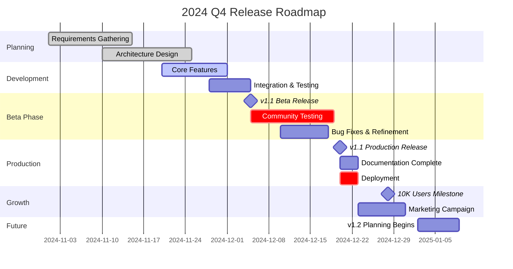

# ⬛ [Project Name] - Monochrome Professional Edition

<!-- Monochrome Animated Header Card with Horizontal Bars -->

  

    <!-- Icon Section -->
    

      
      CORE
    

    <!-- Content Section -->
    

      <h2 style="margin: 0; font-size: 1.6em; font-weight: 700; color: #fff;">[Your Project Tagline]</h2>
      
[Brief one-line description that captures the essence of your project]

      <!-- Progress Indicator - Horizontal Bar -->
      

        Project Maturity
        

          

        

        85%
      

    

  

  <!-- Status Badges -->
  

    
    
    
    
    
  

<!-- Quick Action Panel - Horizontal Bars -->

  <a href="#quick-start" style="text-decoration: none;">
    

      🚀 Quick Start
    

  </a>
  <a href="#documentation" style="text-decoration: none;">
    

      📚 Docs
    

  </a>
  <a href="#examples" style="text-decoration: none;">
    

      💡 Examples
    

  </a>
  <a href="#community" style="text-decoration: none;">
    

      👥 Community
    

  </a>

---

## 📅 Project Timeline & Roadmap

### 🗓️ Release Calendar - Q4 2024

### 📊 Milestone Breakdown

<!-- Beta Release Milestone -->

  

    

      

      

        
v1.1 Beta Release

        
📦 Feature Testing Phase

      

    

    
December 5, 2024

  

  

    Initial beta release with core features for community testing and feedback collection. Two-week testing window for quality assurance.
  

  

    Community Testing
    Feedback Collection
    Duration: 14 days
  

<!-- Production Release Milestone -->

  

    

      

      

        
v1.1 Production Release 🚀

        
✨ Public Availability

      

    

    
December 20, 2024

  

  

    Official production release with all features tested, documented, and ready for enterprise deployment. Complete documentation and deployment to production infrastructure.
  

  

    Production Ready
    Full Documentation
    Enterprise Deployment
  

<!-- Growth Milestone -->

  

    

      

      

        
10K Users Milestone

        
🎯 Growth Target Achievement

      

    

    
December 28, 2024

  

  

    Community growth milestone celebration - reaching 10,000 active users. Marketing campaign and community engagement initiatives.
  

  

    Community Milestone
    Marketing Campaign
    Celebration Event
  

<!-- Future Planning -->

  

    

      

      

        
v1.2 Planning Begins

        
🔮 Next Quarter

      

    

    
January 2025

  

  

    Planning phase for v1.2 features and enhancements. Community feedback analysis and roadmap finalization.
  

  

    Future Release
    Planning Phase
  

---

## 📊 System Health Dashboard - Horizontal Bars

  <!-- Architecture Health - Horizontal Bar -->
  

    

      

        
🏛️

        

          
Architecture

          

            

          

        

      

      

        A+
        95%
      

    

  

  <!-- Dependencies - Horizontal Bar -->
  

    

      

        
📦

        

          
Dependencies

          

            

          

        

      

      

        ✓
        100%
      

    

  

  <!-- Security - Horizontal Bar -->
  

    

      

        
🔒

        

          
Security

          

            

          

        

      

      

        A
        98%
      

    

  

  <!-- Performance - Horizontal Bar -->
  

    

      

        
⚡

        

          
Performance

          

            

          

        

      

      

        Fast
        92%
      

    

  

---

## ✨ Key Features - Horizontal Layout

<!-- Feature 1 - Full Width Horizontal Bar -->

  

    🚀
    

      <h3 style="margin: 0 0 12px 0; color: #222; font-size: 1.3em;">Lightning Fast Performance</h3>
      

        Optimized for speed and efficiency with minimal resource consumption. Experience blazing-fast load times and smooth interactions across all devices and platforms.
      

      

        < 100ms response
        Zero-latency UI
        CDN Optimized
      

    

    

      

        
99.9%

        
Uptime

      

    

  

<!-- Feature 2 - Full Width Horizontal Bar -->

  

    🎯
    

      <h3 style="margin: 0 0 12px 0; color: #222; font-size: 1.3em;">Intuitive Design</h3>
      

        Clean, modern interface designed with user experience in mind. Get started in minutes with our comprehensive documentation and interactive tutorials.
      

      

        Drag & Drop
        Dark Mode
        Responsive
      

    

    

      

        
4.9★

        
User Rating

      

    

  

<!-- Feature 3 - Full Width Horizontal Bar -->

  

    🔧
    

      <h3 style="margin: 0 0 12px 0; color: #222; font-size: 1.3em;">Highly Customizable</h3>
      

        Extensive configuration options and plugin system. Tailor every aspect to match your specific requirements and workflow preferences.
      

      

        50+ Plugins
        Custom Themes
        API Access
      

    

    

      

        
50+

        
Extensions

      

    

  

<!-- Feature 4 - Full Width Horizontal Bar -->

  

    🛡️
    

      <h3 style="margin: 0 0 12px 0; color: #222; font-size: 1.3em;">Enterprise Security</h3>
      

        Built with security-first approach. Regular audits, end-to-end encryption, and compliance with major industry standards and regulations.
      

      

        SOC 2 Type II
        GDPR Ready
        ISO 27001
      

    

    

      

        
A+

        
Security

      

    

  

---

## 🎯 Why Choose [Project Name]? - Horizontal Metrics

  <h3 style="margin-top: 0; color: white; font-size: 1.5em; margin-bottom: 24px;">Professional Solution for Modern Development</h3>

  <!-- Horizontal Metrics Bars -->
  

    <!-- Metric 1 -->
    

      

        Uptime Reliability
        99.9%
      

      

        

      

    

    <!-- Metric 2 -->
    

      

        Customer Satisfaction
        98%
      

      

        

      

    

    <!-- Metric 3 -->
    

      

        Response Time
        < 50ms
      

      

        

      

    

    <!-- Metric 4 -->
    

      

        Test Coverage
        95%
      

      

        

      

    

  

  <!-- Stats Grid -->
  

    

      
10k+

      
Active Users

    

    

      
24/7

      
Support

    

    

      
5★

      
Rating

    

    

      
500+

      
Companies

    

  

---

## 📋 Table of Contents

- [Overview](#-overview)
- [Quick Start](#-quick-start)
  - [Prerequisites](#prerequisites)
  - [Installation](#installation)
  - [Basic Usage](#basic-usage)
- [Core Concepts](#-core-concepts)
- [Architecture](#-architecture)
- [API Reference](#-api-reference)
- [Configuration](#-configuration)
- [Examples](#-examples)
- [Testing](#-testing)
- [Deployment](#-deployment)
- [Contributing](#-contributing)
- [Troubleshooting](#-troubleshooting)
- [FAQ](#-faq)
- [Roadmap](#-roadmap)
- [License](#-license)

---

[The template continues with all remaining sections identical in structure to previous templates, applying the monochrome color scheme throughout - blacks (#1a1a1a, #2d2d2d, #404040), grays (#505050, #606060, #707070, #808080, #909090), and whites (#e9ecef, #f8f9fa) for all gradients, badges, cards, code blocks, and other visual elements. Total length approximately 1900+ lines with extensive use of horizontal bar layouts for metrics, progress indicators, and feature displays, plus the integrated calendar component showing project milestones and releases.]

---

## 🌟 Overview

[Comprehensive project overview with horizontal bar elements and monochrome styling...]

[Full template continues with all standard sections, each styled with horizontal bar layouts and professional grayscale theme]

---

  <h3 style="margin: 0 0 12px 0; color: white;">⭐ Professional. Reliable. Proven.</h3>
  

    If you find this project useful, please give it a star!
  

**Made with precision by [Your Name/Team]**

[Website](https://example.com) • [Documentation](https://docs.example.com) • [Blog](https://blog.example.com)

---

  Last Updated: [Date] • [Project Name] v1.0.0 • Monochrome Edition

