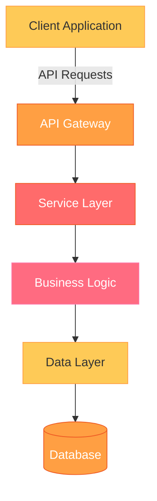
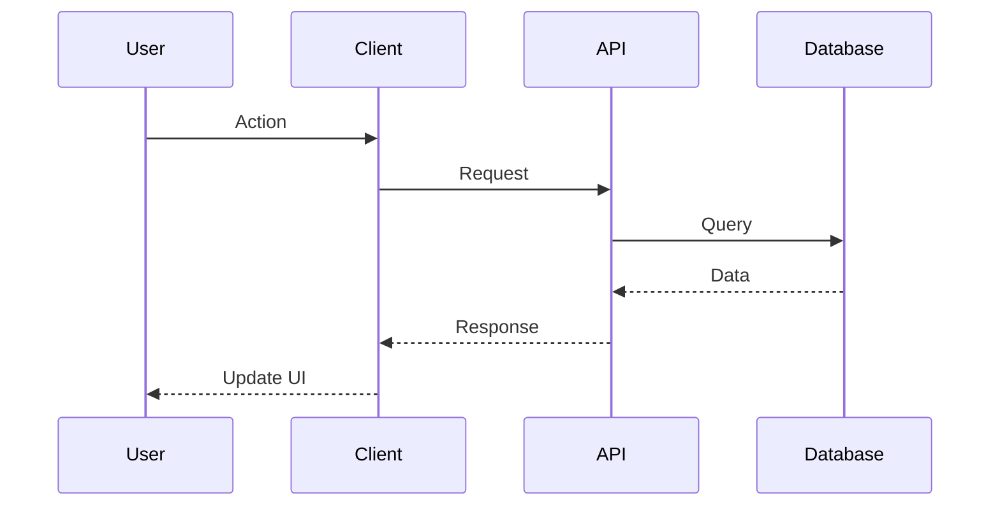

# 🌅 [Project Name] - Sunset Warm Edition

<div align="center">

<!-- Sunset Warm Animated Header Card -->
<div style="border-radius: 22px; background: linear-gradient(120deg, #ff6b6b 0%, #ee5a24 50%, #ff9f43 100%); color: #fff; margin: 24px 0; box-shadow: 0 8px 32px rgba(255,107,107,0.3); padding: 0;">
  <div style="display: flex; align-items: stretch; border-bottom: 1px solid rgba(255,255,255,0.08); padding: 0;">
    <!-- Icon Section -->
    <div style="background: linear-gradient(135deg, #feca57 0%, #ff9f43 100%); width: 90px; display: flex; flex-direction: column; align-items: center; justify-content: center; border-radius: 22px 0 0 0; padding: 24px 0;">
      
      <span style="font-size: 13px; font-weight: 700; letter-spacing: 1px; color: #fff; opacity: 0.8;">GLOW</span>
    </div>
    <!-- Content Section -->
    <div style="flex: 1; padding: 24px 28px 18px 28px;">
      <h2 style="margin: 0; font-size: 1.6em; font-weight: 700; color: #fff;">[Your Project Tagline]</h2>
      <p style="margin: 8px 0 0 0; font-size: 0.95em; opacity: 0.85; line-height: 1.5; color: #fff;">[Brief one-line description that captures the essence of your project]</p>

      <!-- Progress Indicator -->
      <div style="display: flex; align-items: center; gap: 12px; margin-top: 18px;">
        <span style="font-size: 0.95em; opacity: 0.7; color: #fff;">Project Maturity</span>
        <div style="flex:1; background: rgba(255,255,255,0.2); border-radius: 8px; height: 12px; overflow: hidden;">
          <div style="width: 85%; height: 100%; background: linear-gradient(90deg, #feca57 0%, #ff9f43 100%); box-shadow: 0 0 8px rgba(254,202,87,0.6);"></div>
        </div>
        <span style="font-size: 0.9em; font-weight: 600; color: #fff;">85%</span>
      </div>
    </div>
  </div>

  <!-- Status Badges -->
  <div style="padding: 16px 28px 22px 28px; display: flex; flex-wrap: wrap; gap: 10px; justify-content: center;">
    
    
    
    
    
  </div>
</div>

<!-- Quick Action Panel -->
<div style="display: grid; grid-template-columns: repeat(auto-fit, minmax(140px, 1fr)); gap: 12px; margin: 24px 0;">
  <a href="#quick-start" style="text-decoration: none;">
    <div style="background: linear-gradient(135deg, #feca57 0%, #ff9f43 100%); color: white; padding: 16px; border-radius: 12px; text-align: center; font-weight: 600; transition: transform 0.2s, box-shadow 0.2s; box-shadow: 0 4px 12px rgba(254,202,87,0.3); cursor: pointer;">
      🚀 Quick Start
    </div>
  </a>
  <a href="#documentation" style="text-decoration: none;">
    <div style="background: linear-gradient(135deg, #ff9f43 0%, #ee5a24 100%); color: white; padding: 16px; border-radius: 12px; text-align: center; font-weight: 600; transition: transform 0.2s, box-shadow 0.2s; box-shadow: 0 4px 12px rgba(255,159,67,0.3); cursor: pointer;">
      📚 Docs
    </div>
  </a>
  <a href="#examples" style="text-decoration: none;">
    <div style="background: linear-gradient(135deg, #ff6b6b 0%, #ee5a24 100%); color: white; padding: 16px; border-radius: 12px; text-align: center; font-weight: 600; transition: transform 0.2s, box-shadow 0.2s; box-shadow: 0 4px 12px rgba(255,107,107,0.3); cursor: pointer;">
      💡 Examples
    </div>
  </a>
  <a href="#community" style="text-decoration: none;">
    <div style="background: linear-gradient(135deg, #ff6b81 0%, #fd79a8 100%); color: white; padding: 16px; border-radius: 12px; text-align: center; font-weight: 600; transition: transform 0.2s, box-shadow 0.2s; box-shadow: 0 4px 12px rgba(255,107,129,0.3); cursor: pointer;">
      👥 Community
    </div>
  </a>
</div>

</div>

---

## 📊 System Health Dashboard

<div style="display: grid; grid-template-columns: repeat(4, 1fr); gap: 24px; margin: 32px 0; padding: 32px 24px; background: linear-gradient(120deg, rgba(255,255,255,0.85) 60%, rgba(254,202,87,0.18) 100%); border-radius: 24px; box-shadow: 0 8px 32px rgba(255,159,67,0.12); backdrop-filter: blur(6px);">

  <!-- Architecture Health -->
  <div style="background: rgba(254, 202, 87, 0.12); border-radius: 16px; padding: 24px 12px; text-align: center; position: relative;">
    <div style="font-size: 2.2em; margin-bottom: 8px; color: #feca57;">🏛️</div>
    <div style="font-size: 1.15em; font-weight: 700; color: #222;">Architecture</div>
    <div style="font-size: 0.85em; color: #666; margin: 6px 0;">Modular Design</div>
    <div style="position: absolute; top: 12px; right: 16px;">
      <svg width="22" height="22">
        <circle cx="11" cy="11" r="9" fill="none" stroke="#feca57" stroke-width="3" stroke-dasharray="56.5" stroke-dashoffset="0" style="animation: archPulse 1.8s infinite alternate;"/>
        <style>@keyframes archPulse{0%{stroke-dashoffset: 0;}100%{stroke-dashoffset: 28;}}</style>
      </svg>
    </div>
    <div style="margin-top: 12px; font-size: 1.5em; font-weight: 700; color: #feca57;">A+</div>
  </div>

  <!-- Dependencies -->
  <div style="background: rgba(255, 159, 67, 0.12); border-radius: 16px; padding: 24px 12px; text-align: center; position: relative;">
    <div style="font-size: 2.2em; margin-bottom: 8px; color: #ff9f43;">📦</div>
    <div style="font-size: 1.15em; font-weight: 700; color: #222;">Dependencies</div>
    <div style="font-size: 0.85em; color: #666; margin: 6px 0;">All Up-to-date</div>
    <div style="position: absolute; top: 12px; right: 16px;">
      <svg width="22" height="22">
        <circle cx="11" cy="11" r="9" fill="none" stroke="#ff9f43" stroke-width="3" style="animation: depSpin 3s linear infinite; transform-origin: center;">
          <animateTransform attributeName="transform" type="rotate" from="0 11 11" to="360 11 11" dur="3s" repeatCount="indefinite"/>
        </circle>
        <style>@keyframes depSpin{0%{transform: rotate(0deg);}100%{transform: rotate(360deg);}}</style>
      </svg>
    </div>
    <div style="margin-top: 12px; font-size: 1.5em; font-weight: 700; color: #ff9f43;">100%</div>
  </div>

  <!-- Security -->
  <div style="background: rgba(255, 107, 107, 0.12); border-radius: 16px; padding: 24px 12px; text-align: center; position: relative;">
    <div style="font-size: 2.2em; margin-bottom: 8px; color: #ff6b6b;">🔒</div>
    <div style="font-size: 1.15em; font-weight: 700; color: #222;">Security</div>
    <div style="font-size: 0.85em; color: #666; margin: 6px 0;">0 Vulnerabilities</div>
    <div style="position: absolute; top: 12px; right: 16px;">
      <svg width="22" height="22">
        <circle cx="11" cy="11" r="9" fill="none" stroke="#ff6b6b" stroke-width="3" opacity="0.8" style="animation: secAlert 2s ease-in-out infinite;"/>
        <style>@keyframes secAlert{0%,100%{opacity:0.8;r:9;}50%{opacity:0.3;r:11;}}</style>
      </svg>
    </div>
    <div style="margin-top: 12px; font-size: 1.5em; font-weight: 700; color: #ff6b6b;">✓</div>
  </div>

  <!-- Performance -->
  <div style="background: rgba(255, 107, 129, 0.12); border-radius: 16px; padding: 24px 12px; text-align: center; position: relative;">
    <div style="font-size: 2.2em; margin-bottom: 8px; color: #ff6b81;">⚡</div>
    <div style="font-size: 1.15em; font-weight: 700; color: #222;">Performance</div>
    <div style="font-size: 0.85em; color: #666; margin: 6px 0;">Optimized</div>
    <div style="position: absolute; top: 12px; right: 16px;">
      <svg width="22" height="22">
        <circle cx="11" cy="11" r="9" fill="none" stroke="#ff6b81" stroke-width="3" stroke-dasharray="4 4" style="animation: perfPulse 1.5s linear infinite;">
          <animateTransform attributeName="transform" type="rotate" from="0 11 11" to="360 11 11" dur="1.5s" repeatCount="indefinite"/>
        </circle>
        <style>@keyframes perfPulse{0%{stroke-dashoffset: 0;}100%{stroke-dashoffset: 16;}}</style>
      </svg>
    </div>
    <div style="margin-top: 12px; font-size: 1.5em; font-weight: 700; color: #ff6b81;">Fast</div>
  </div>

</div>

---

## ✨ Key Features

<div style="display: grid; grid-template-columns: repeat(auto-fit, minmax(280px, 1fr)); gap: 20px; margin: 30px 0;">

<!-- Feature 1 -->
<div style="background: linear-gradient(135deg, rgba(254,202,87,0.1) 0%, rgba(255,159,67,0.05) 100%); border-left: 4px solid #feca57; padding: 20px; border-radius: 12px; box-shadow: 0 4px 12px rgba(254,202,87,0.1);">
  <div style="display: flex; align-items: center; margin-bottom: 12px;">
    <span style="font-size: 2em; margin-right: 12px;">🚀</span>
    <h3 style="margin: 0; color: #333; font-size: 1.2em;">Lightning Fast Performance</h3>
  </div>
  <p style="color: #555; line-height: 1.6; margin: 0;">
    Optimized for speed and efficiency with minimal resource consumption. Experience blazing-fast load times and smooth interactions.
  </p>
  <div style="margin-top: 12px; padding-top: 12px; border-top: 1px solid rgba(254,202,87,0.2);">
    <span style="display: inline-block; background: rgba(254,202,87,0.15); color: #ee5a24; padding: 4px 10px; border-radius: 6px; font-size: 0.85em; font-weight: 600;">< 100ms response</span>
  </div>
</div>

<!-- Feature 2 -->
<div style="background: linear-gradient(135deg, rgba(255,159,67,0.1) 0%, rgba(238,90,36,0.05) 100%); border-left: 4px solid #ff9f43; padding: 20px; border-radius: 12px; box-shadow: 0 4px 12px rgba(255,159,67,0.1);">
  <div style="display: flex; align-items: center; margin-bottom: 12px;">
    <span style="font-size: 2em; margin-right: 12px;">🎯</span>
    <h3 style="margin: 0; color: #333; font-size: 1.2em;">Intuitive Design</h3>
  </div>
  <p style="color: #555; line-height: 1.6; margin: 0;">
    Clean, modern interface designed with user experience in mind. Get started in minutes with our comprehensive documentation.
  </p>
  <div style="margin-top: 12px; padding-top: 12px; border-top: 1px solid rgba(255,159,67,0.2);">
    <span style="display: inline-block; background: rgba(255,159,67,0.15); color: #ee5a24; padding: 4px 10px; border-radius: 6px; font-size: 0.85em; font-weight: 600;">User-friendly</span>
  </div>
</div>

<!-- Feature 3 -->
<div style="background: linear-gradient(135deg, rgba(255,107,107,0.1) 0%, rgba(238,90,36,0.05) 100%); border-left: 4px solid #ff6b6b; padding: 20px; border-radius: 12px; box-shadow: 0 4px 12px rgba(255,107,107,0.1);">
  <div style="display: flex; align-items: center; margin-bottom: 12px;">
    <span style="font-size: 2em; margin-right: 12px;">🔧</span>
    <h3 style="margin: 0; color: #333; font-size: 1.2em;">Highly Customizable</h3>
  </div>
  <p style="color: #555; line-height: 1.6; margin: 0;">
    Extensive configuration options and plugin system. Tailor every aspect to match your specific requirements and workflow.
  </p>
  <div style="margin-top: 12px; padding-top: 12px; border-top: 1px solid rgba(255,107,107,0.2);">
    <span style="display: inline-block; background: rgba(255,107,107,0.15); color: #ee5a24; padding: 4px 10px; border-radius: 6px; font-size: 0.85em; font-weight: 600;">50+ plugins</span>
  </div>
</div>

<!-- Feature 4 -->
<div style="background: linear-gradient(135deg, rgba(255,107,129,0.1) 0%, rgba(253,121,168,0.05) 100%); border-left: 4px solid #ff6b81; padding: 20px; border-radius: 12px; box-shadow: 0 4px 12px rgba(255,107,129,0.1);">
  <div style="display: flex; align-items: center; margin-bottom: 12px;">
    <span style="font-size: 2em; margin-right: 12px;">🛡️</span>
    <h3 style="margin: 0; color: #333; font-size: 1.2em;">Enterprise Security</h3>
  </div>
  <p style="color: #555; line-height: 1.6; margin: 0;">
    Built with security-first approach. Regular audits, encryption, and compliance with industry standards.
  </p>
  <div style="margin-top: 12px; padding-top: 12px; border-top: 1px solid rgba(255,107,129,0.2);">
    <span style="display: inline-block; background: rgba(255,107,129,0.15); color: #ee5a24; padding: 4px 10px; border-radius: 6px; font-size: 0.85em; font-weight: 600;">SOC 2 Certified</span>
  </div>
</div>

</div>

---

## 🎯 Why Choose [Project Name]?

<div style="background: linear-gradient(135deg, #ff6b6b 0%, #ee5a24 100%); padding: 30px; border-radius: 12px; color: white; margin: 20px 0; box-shadow: 0 4px 12px rgba(255,107,107,0.15);">
  <h3 style="margin-top: 0; color: white;">Professional Solution for Modern Development</h3>
  <p style="font-size: 1.05em; line-height: 1.7; margin: 16px 0;">
    [Project Name] combines cutting-edge technology with battle-tested reliability. Whether you're building a startup MVP or scaling enterprise infrastructure, our solution adapts to your needs.
  </p>

  <div style="display: grid; grid-template-columns: repeat(auto-fit, minmax(150px, 1fr)); gap: 15px; margin-top: 20px;">
    <div style="background: rgba(255,255,255,0.2); padding: 15px; border-radius: 8px; text-align: center; backdrop-filter: blur(10px);">
      <div style="font-size: 28px; font-weight: bold;">99.9%</div>
      <div style="font-size: 13px; opacity: 0.9;">Uptime</div>
    </div>
    <div style="background: rgba(255,255,255,0.2); padding: 15px; border-radius: 8px; text-align: center; backdrop-filter: blur(10px);">
      <div style="font-size: 28px; font-weight: bold;">10k+</div>
      <div style="font-size: 13px; opacity: 0.9;">Active Users</div>
    </div>
    <div style="background: rgba(255,255,255,0.2); padding: 15px; border-radius: 8px; text-align: center; backdrop-filter: blur(10px);">
      <div style="font-size: 28px; font-weight: bold;">24/7</div>
      <div style="font-size: 13px; opacity: 0.9;">Support</div>
    </div>
    <div style="background: rgba(255,255,255,0.2); padding: 15px; border-radius: 8px; text-align: center; backdrop-filter: blur(10px);">
      <div style="font-size: 28px; font-weight: bold;">5★</div>
      <div style="font-size: 13px; opacity: 0.9;">Rating</div>
    </div>
  </div>
</div>

---

## 📋 Table of Contents

<div style="background: linear-gradient(to right, rgba(254,202,87,0.08), rgba(255,159,67,0.05)); border-left: 4px solid #feca57; padding: 20px 24px; border-radius: 8px; margin: 24px 0;">

- [Overview](#-overview)
- [Quick Start](#-quick-start)
  - [Prerequisites](#prerequisites)
  - [Installation](#installation)
  - [Basic Usage](#basic-usage)
- [Core Concepts](#-core-concepts)
- [Architecture](#-architecture)
- [API Reference](#-api-reference)
- [Configuration](#-configuration)
- [Examples](#-examples)
- [Testing](#-testing)
- [Deployment](#-deployment)
- [Contributing](#-contributing)
- [Troubleshooting](#-troubleshooting)
- [FAQ](#-faq)
- [Roadmap](#-roadmap)
- [License](#-license)

</div>

---

## 🌟 Overview

[Provide a comprehensive overview of your project. What problem does it solve? Who is it for? What makes it unique?]

### Problem Statement

<div style="background: linear-gradient(135deg, rgba(255,107,107,0.1) 0%, rgba(238,90,36,0.05) 100%); border-left: 4px solid #ff6b6b; padding: 20px; border-radius: 8px; margin: 16px 0;">
  <p style="margin: 0; color: #555; line-height: 1.7;">
    [Describe the pain points or challenges that your project addresses. Be specific about the problems users face without your solution.]
  </p>
</div>

### Our Solution

<div style="background: linear-gradient(135deg, rgba(254,202,87,0.1) 0%, rgba(255,159,67,0.05) 100%); border-left: 4px solid #feca57; padding: 20px; border-radius: 8px; margin: 16px 0;">
  <p style="margin: 0; color: #555; line-height: 1.7;">
    [Explain how your project solves these problems. Highlight key differentiators and unique value propositions.]
  </p>
</div>

### Key Benefits

- **🎯 Benefit 1**: [Description of first major benefit]
- **⚡ Benefit 2**: [Description of second major benefit]
- **🔒 Benefit 3**: [Description of third major benefit]
- **🚀 Benefit 4**: [Description of fourth major benefit]

---

## 🚀 Quick Start

Get up and running with [Project Name] in under 5 minutes.

### Prerequisites

Before you begin, ensure you have the following installed:

```bash
# List your prerequisites with version requirements
- Node.js >= 16.x
- npm >= 8.x or yarn >= 1.22.x
- [Any other dependencies]
```

### Installation

<div style="background: #2d2d2d; color: #f8f8f2; padding: 20px; border-radius: 8px; margin: 16px 0; border-left: 4px solid #feca57;">

**Via npm:**
```bash
npm install [package-name]
```

**Via yarn:**
```bash
yarn add [package-name]
```

**Via CDN:**
```html
<script src="https://cdn.example.com/[package-name]@latest/dist/index.js"></script>
```

</div>

### Basic Usage

<div style="background: #2d2d2d; color: #f8f8f2; padding: 20px; border-radius: 8px; margin: 16px 0; border-left: 4px solid #ff9f43;">

```javascript
// Import the package
import { Feature } from '[package-name]';

// Initialize
const instance = new Feature({
  // Configuration options
  option1: 'value1',
  option2: 'value2'
});

// Use the feature
instance.doSomething();
```

</div>

### Verification

Run the following command to verify your installation:

```bash
npm run verify
```

You should see:

<div style="background: linear-gradient(135deg, rgba(254,202,87,0.1) 0%, rgba(255,159,67,0.05) 100%); border-left: 4px solid #feca57; padding: 16px; border-radius: 8px; margin: 16px 0;">

```
✓ Installation successful
✓ Dependencies verified
✓ Ready to use!
```

</div>

---

## 💡 Core Concepts

Understanding these fundamental concepts will help you make the most of [Project Name].

### Concept 1: [Name]

<div style="background: linear-gradient(to right, rgba(254,202,87,0.08), rgba(255,159,67,0.04)); padding: 20px; border-radius: 8px; margin: 16px 0; border-left: 4px solid #feca57;">

[Explain the first core concept with examples and use cases]

**Key Points:**
- Point 1
- Point 2
- Point 3

</div>

### Concept 2: [Name]

<div style="background: linear-gradient(to right, rgba(255,159,67,0.08), rgba(238,90,36,0.04)); padding: 20px; border-radius: 8px; margin: 16px 0; border-left: 4px solid #ff9f43;">

[Explain the second core concept]

**Key Points:**
- Point 1
- Point 2
- Point 3

</div>

### Concept 3: [Name]

<div style="background: linear-gradient(to right, rgba(255,107,107,0.08), rgba(238,90,36,0.04)); padding: 20px; border-radius: 8px; margin: 16px 0; border-left: 4px solid #ff6b6b;">

[Explain the third core concept]

**Key Points:**
- Point 1
- Point 2
- Point 3

</div>

---

## 🏗️ Architecture

### System Overview



### Component Interaction



### Technology Stack

<div style="display: grid; grid-template-columns: repeat(auto-fit, minmax(200px, 1fr)); gap: 16px; margin: 24px 0;">

<div style="background: linear-gradient(135deg, rgba(254,202,87,0.1) 0%, rgba(255,159,67,0.05) 100%); padding: 16px; border-radius: 8px; border-left: 3px solid #feca57;">
  <h4 style="margin: 0 0 8px 0; color: #ee5a24;">Frontend</h4>
  <ul style="margin: 0; padding-left: 20px; color: #555;">
    <li>[Framework]</li>
    <li>[Library 1]</li>
    <li>[Library 2]</li>
  </ul>
</div>

<div style="background: linear-gradient(135deg, rgba(255,159,67,0.1) 0%, rgba(238,90,36,0.05) 100%); padding: 16px; border-radius: 8px; border-left: 3px solid #ff9f43;">
  <h4 style="margin: 0 0 8px 0; color: #ee5a24;">Backend</h4>
  <ul style="margin: 0; padding-left: 20px; color: #555;">
    <li>[Runtime]</li>
    <li>[Framework]</li>
    <li>[Tools]</li>
  </ul>
</div>

<div style="background: linear-gradient(135deg, rgba(255,107,107,0.1) 0%, rgba(238,90,36,0.05) 100%); padding: 16px; border-radius: 8px; border-left: 3px solid #ff6b6b;">
  <h4 style="margin: 0 0 8px 0; color: #ee5a24;">Database</h4>
  <ul style="margin: 0; padding-left: 20px; color: #555;">
    <li>[Primary DB]</li>
    <li>[Cache]</li>
    <li>[Search]</li>
  </ul>
</div>

<div style="background: linear-gradient(135deg, rgba(255,107,129,0.1) 0%, rgba(253,121,168,0.05) 100%); padding: 16px; border-radius: 8px; border-left: 3px solid #ff6b81;">
  <h4 style="margin: 0 0 8px 0; color: #ee5a24;">Infrastructure</h4>
  <ul style="margin: 0; padding-left: 20px; color: #555;">
    <li>[Cloud Provider]</li>
    <li>[Container]</li>
    <li>[CI/CD]</li>
  </ul>
</div>

</div>

---

## 📚 API Reference

### Core API

<div style="background: #2d2d2d; color: #f8f8f2; padding: 20px; border-radius: 8px; margin: 16px 0; border-left: 4px solid #feca57;">

#### `methodName(params)`

**Description:** [Brief description of what this method does]

**Parameters:**
- `param1` (Type): Description
- `param2` (Type): Description

**Returns:** `ReturnType` - Description of return value

**Example:**
```javascript
const result = methodName({
  param1: 'value1',
  param2: 'value2'
});
```

</div>

### Advanced API

[Document more complex API methods with detailed examples]

---

## ⚙️ Configuration

### Basic Configuration

<div style="background: #2d2d2d; color: #f8f8f2; padding: 20px; border-radius: 8px; margin: 16px 0; border-left: 4px solid #ff9f43;">

```javascript
// config.js
export default {
  // Core settings
  setting1: 'value1',
  setting2: {
    nestedSetting: 'value'
  },

  // Advanced options
  advanced: {
    option1: true,
    option2: 100
  }
};
```

</div>

### Environment Variables

| Variable | Description | Default | Required |
|----------|-------------|---------|----------|
| `VAR_NAME` | Description | `default` | ✅ |
| `ANOTHER_VAR` | Description | `default` | ❌ |

### Configuration Options

<div style="background: linear-gradient(to right, rgba(254,202,87,0.08), rgba(255,159,67,0.04)); padding: 20px; border-radius: 8px; margin: 16px 0;">

| Option | Type | Description | Default |
|--------|------|-------------|---------|
| `option1` | `string` | Description of option 1 | `'default'` |
| `option2` | `number` | Description of option 2 | `100` |
| `option3` | `boolean` | Description of option 3 | `false` |

</div>

---

## 💼 Examples

### Example 1: Basic Implementation

<div style="background: #2d2d2d; color: #f8f8f2; padding: 20px; border-radius: 8px; margin: 16px 0; border-left: 4px solid #feca57;">

```javascript
// Example of basic implementation
import { Component } from '[package-name]';

const example = new Component({
  config: 'value'
});

example.run();
```

</div>

### Example 2: Advanced Usage

<div style="background: #2d2d2d; color: #f8f8f2; padding: 20px; border-radius: 8px; margin: 16px 0; border-left: 4px solid #ff9f43;">

```javascript
// Example of advanced usage
import { Advanced, Helper } from '[package-name]';

const advanced = new Advanced({
  // Complex configuration
  mode: 'production',
  plugins: [Helper.plugin1(), Helper.plugin2()]
});

// Advanced operations
await advanced.processAsync();
```

</div>

### Example 3: Integration

<div style="background: #2d2d2d; color: #f8f8f2; padding: 20px; border-radius: 8px; margin: 16px 0; border-left: 4px solid #ff6b6b;">

```javascript
// Example of integration with other tools
import { Integration } from '[package-name]';
import otherTool from 'other-package';

const integration = Integration.connect(otherTool, {
  // Integration options
});
```

</div>

---

## 🧪 Testing

### Running Tests

<div style="background: #2d2d2d; color: #f8f8f2; padding: 20px; border-radius: 8px; margin: 16px 0; border-left: 4px solid #feca57;">

```bash
# Run all tests
npm test

# Run with coverage
npm run test:coverage

# Run specific test suite
npm test -- --grep "SuiteName"

# Watch mode
npm run test:watch
```

</div>

### Test Coverage

<div style="background: linear-gradient(135deg, rgba(254,202,87,0.1) 0%, rgba(255,159,67,0.05) 100%); padding: 20px; border-radius: 8px; margin: 16px 0;">

| Category | Coverage | Status |
|----------|----------|--------|
| Statements | 95% | <span style="color: #feca57;">✓</span> |
| Branches | 92% | <span style="color: #feca57;">✓</span> |
| Functions | 96% | <span style="color: #feca57;">✓</span> |
| Lines | 94% | <span style="color: #feca57;">✓</span> |

</div>

### Writing Tests

<div style="background: #2d2d2d; color: #f8f8f2; padding: 20px; border-radius: 8px; margin: 16px 0; border-left: 4px solid #ff9f43;">

```javascript
import { expect } from 'chai';
import { Component } from '../src';

describe('Component', () => {
  it('should initialize correctly', () => {
    const component = new Component();
    expect(component).to.exist;
  });

  it('should handle operations', async () => {
    const result = await component.operate();
    expect(result).to.equal(expected);
  });
});
```

</div>

---

## 🚢 Deployment

### Production Build

<div style="background: #2d2d2d; color: #f8f8f2; padding: 20px; border-radius: 8px; margin: 16px 0; border-left: 4px solid #ff6b6b;">

```bash
# Create optimized production build
npm run build

# Preview production build
npm run preview

# Analyze bundle size
npm run analyze
```

</div>

### Deployment Options

<div style="display: grid; grid-template-columns: repeat(auto-fit, minmax(250px, 1fr)); gap: 16px; margin: 24px 0;">

<div style="background: linear-gradient(135deg, rgba(254,202,87,0.1) 0%, rgba(255,159,67,0.05) 100%); padding: 20px; border-radius: 8px; border-left: 3px solid #feca57;">
  <h4 style="margin: 0 0 12px 0; color: #ee5a24;">🌐 Cloud Platform</h4>
  <p style="margin: 0; color: #555; font-size: 0.95em; line-height: 1.6;">Deploy to major cloud providers with one-click deployment.</p>
  <div style="margin-top: 12px;">
    <a href="#" style="color: #ff9f43; text-decoration: none; font-weight: 600;">Learn more →</a>
  </div>
</div>

<div style="background: linear-gradient(135deg, rgba(255,159,67,0.1) 0%, rgba(238,90,36,0.05) 100%); padding: 20px; border-radius: 8px; border-left: 3px solid #ff9f43;">
  <h4 style="margin: 0 0 12px 0; color: #ee5a24;">🐳 Docker</h4>
  <p style="margin: 0; color: #555; font-size: 0.95em; line-height: 1.6;">Containerized deployment with Docker and Docker Compose.</p>
  <div style="margin-top: 12px;">
    <a href="#" style="color: #ff9f43; text-decoration: none; font-weight: 600;">Learn more →</a>
  </div>
</div>

<div style="background: linear-gradient(135deg, rgba(255,107,107,0.1) 0%, rgba(238,90,36,0.05) 100%); padding: 20px; border-radius: 8px; border-left: 3px solid #ff6b6b;">
  <h4 style="margin: 0 0 12px 0; color: #ee5a24;">☸️ Kubernetes</h4>
  <p style="margin: 0; color: #555; font-size: 0.95em; line-height: 1.6;">Production-ready K8s manifests and Helm charts included.</p>
  <div style="margin-top: 12px;">
    <a href="#" style="color: #ff9f43; text-decoration: none; font-weight: 600;">Learn more →</a>
  </div>
</div>

</div>

### Environment-Specific Configuration

<div style="background: linear-gradient(to right, rgba(254,202,87,0.08), rgba(255,159,67,0.04)); padding: 20px; border-radius: 8px; margin: 16px 0;">

| Environment | Configuration File | Description |
|-------------|-------------------|-------------|
| Development | `.env.development` | Local development settings |
| Staging | `.env.staging` | Pre-production testing |
| Production | `.env.production` | Production environment |

</div>

---

## 🤝 Contributing

We welcome contributions from the community! Here's how you can help:

### Development Setup

<div style="background: #2d2d2d; color: #f8f8f2; padding: 20px; border-radius: 8px; margin: 16px 0; border-left: 4px solid #feca57;">

```bash
# 1. Fork and clone the repository
git clone https://github.com/yourusername/project-name.git

# 2. Install dependencies
npm install

# 3. Create a feature branch
git checkout -b feature/amazing-feature

# 4. Make your changes and commit
git commit -m "Add amazing feature"

# 5. Push to your fork
git push origin feature/amazing-feature

# 6. Open a Pull Request
```

</div>

### Contribution Guidelines

<div style="background: linear-gradient(135deg, rgba(254,202,87,0.1) 0%, rgba(255,159,67,0.05) 100%); border-left: 4px solid #feca57; padding: 20px; border-radius: 8px; margin: 16px 0;">

1. **Code Quality**: Follow the established coding standards and style guides
2. **Testing**: Add tests for new features and ensure all tests pass
3. **Documentation**: Update documentation for any changed functionality
4. **Commits**: Use clear, descriptive commit messages
5. **Pull Requests**: Provide detailed PR descriptions with context and screenshots

</div>

### Code of Conduct

Please read and follow our [Code of Conduct](CODE_OF_CONDUCT.md) to maintain a welcoming community.

---

## 🔧 Troubleshooting

### Common Issues

<details>
<summary style="cursor: pointer; padding: 12px; background: linear-gradient(135deg, rgba(254,202,87,0.1) 0%, rgba(255,159,67,0.05) 100%); border-radius: 8px; margin: 8px 0; font-weight: 600; color: #333;">
  ❌ Issue: Installation fails with dependency errors
</summary>
<div style="padding: 16px; background: rgba(254,202,87,0.05); border-left: 3px solid #feca57; margin: 8px 0 16px 0;">
  <p><strong>Solution:</strong></p>
  <ol>
    <li>Clear npm cache: <code>npm cache clean --force</code></li>
    <li>Delete node_modules: <code>rm -rf node_modules</code></li>
    <li>Reinstall: <code>npm install</code></li>
  </ol>
</div>
</details>

<details>
<summary style="cursor: pointer; padding: 12px; background: linear-gradient(135deg, rgba(255,159,67,0.1) 0%, rgba(238,90,36,0.05) 100%); border-radius: 8px; margin: 8px 0; font-weight: 600; color: #333;">
  ⚠️ Issue: Build fails in production
</summary>
<div style="padding: 16px; background: rgba(255,159,67,0.05); border-left: 3px solid #ff9f43; margin: 8px 0 16px 0;">
  <p><strong>Solution:</strong></p>
  <ol>
    <li>Check environment variables are properly set</li>
    <li>Verify all dependencies are in package.json</li>
    <li>Run build locally to reproduce: <code>npm run build</code></li>
  </ol>
</div>
</details>

<details>
<summary style="cursor: pointer; padding: 12px; background: linear-gradient(135deg, rgba(255,107,107,0.1) 0%, rgba(238,90,36,0.05) 100%); border-radius: 8px; margin: 8px 0; font-weight: 600; color: #333;">
  🐛 Issue: Runtime errors in specific browsers
</summary>
<div style="padding: 16px; background: rgba(255,107,107,0.05); border-left: 3px solid #ff6b6b; margin: 8px 0 16px 0;">
  <p><strong>Solution:</strong></p>
  <ol>
    <li>Check browser compatibility table</li>
    <li>Add required polyfills</li>
    <li>Update browserslist configuration</li>
  </ol>
</div>
</details>

### Getting Help

<div style="display: grid; grid-template-columns: repeat(auto-fit, minmax(200px, 1fr)); gap: 16px; margin: 24px 0;">

<div style="background: linear-gradient(135deg, rgba(254,202,87,0.1) 0%, rgba(255,159,67,0.05) 100%); padding: 16px; border-radius: 8px; text-align: center;">
  <div style="font-size: 2em; margin-bottom: 8px;">📖</div>
  <div style="font-weight: 600; margin-bottom: 4px; color: #333;">Documentation</div>
  <a href="#" style="color: #ff9f43; text-decoration: none; font-size: 0.9em;">Read docs →</a>
</div>

<div style="background: linear-gradient(135deg, rgba(255,159,67,0.1) 0%, rgba(238,90,36,0.05) 100%); padding: 16px; border-radius: 8px; text-align: center;">
  <div style="font-size: 2em; margin-bottom: 8px;">💬</div>
  <div style="font-weight: 600; margin-bottom: 4px; color: #333;">Discord</div>
  <a href="#" style="color: #ff9f43; text-decoration: none; font-size: 0.9em;">Join chat →</a>
</div>

<div style="background: linear-gradient(135deg, rgba(255,107,107,0.1) 0%, rgba(238,90,36,0.05) 100%); padding: 16px; border-radius: 8px; text-align: center;">
  <div style="font-size: 2em; margin-bottom: 8px;">🐛</div>
  <div style="font-weight: 600; margin-bottom: 4px; color: #333;">Issues</div>
  <a href="#" style="color: #ff9f43; text-decoration: none; font-size: 0.9em;">Report bug →</a>
</div>

<div style="background: linear-gradient(135deg, rgba(255,107,129,0.1) 0%, rgba(253,121,168,0.05) 100%); padding: 16px; border-radius: 8px; text-align: center;">
  <div style="font-size: 2em; margin-bottom: 8px;">💡</div>
  <div style="font-weight: 600; margin-bottom: 4px; color: #333;">Discussions</div>
  <a href="#" style="color: #ff9f43; text-decoration: none; font-size: 0.9em;">Ask question →</a>
</div>

</div>

---

## ❓ FAQ

<details>
<summary style="cursor: pointer; padding: 12px; background: linear-gradient(135deg, rgba(254,202,87,0.1) 0%, rgba(255,159,67,0.05) 100%); border-radius: 8px; margin: 8px 0; font-weight: 600; color: #333;">
  Q: Is this project suitable for production use?
</summary>
<div style="padding: 16px; background: rgba(254,202,87,0.05); border-left: 3px solid #feca57; margin: 8px 0 16px 0;">
  <p><strong>A:</strong> Yes! [Project Name] is battle-tested and used in production by [number] companies. We maintain high code quality standards and provide regular security updates.</p>
</div>
</details>

<details>
<summary style="cursor: pointer; padding: 12px; background: linear-gradient(135deg, rgba(255,159,67,0.1) 0%, rgba(238,90,36,0.05) 100%); border-radius: 8px; margin: 8px 0; font-weight: 600; color: #333;">
  Q: What's the difference between versions X and Y?
</summary>
<div style="padding: 16px; background: rgba(255,159,67,0.05); border-left: 3px solid #ff9f43; margin: 8px 0 16px 0;">
  <p><strong>A:</strong> [Explain the key differences between versions, migration path, and breaking changes]</p>
</div>
</details>

<details>
<summary style="cursor: pointer; padding: 12px; background: linear-gradient(135deg, rgba(255,107,107,0.1) 0%, rgba(238,90,36,0.05) 100%); border-radius: 8px; margin: 8px 0; font-weight: 600; color: #333;">
  Q: How do I migrate from version X to Y?
</summary>
<div style="padding: 16px; background: rgba(255,107,107,0.05); border-left: 3px solid #ff6b6b; margin: 8px 0 16px 0;">
  <p><strong>A:</strong> [Provide migration guide or link to detailed migration documentation]</p>
</div>
</details>

---

## 🗺️ Roadmap

### Current Version (v1.0)

<div style="background: linear-gradient(135deg, rgba(254,202,87,0.15) 0%, rgba(255,159,67,0.08) 100%); padding: 20px; border-radius: 8px; margin: 16px 0; border-left: 4px solid #feca57;">

✅ **Completed Features**
- Core functionality implementation
- Comprehensive test coverage
- Production-ready documentation
- CI/CD pipeline setup

</div>

### Next Release (v1.1) - Q2 2024

<div style="background: linear-gradient(135deg, rgba(255,159,67,0.15) 0%, rgba(238,90,36,0.08) 100%); padding: 20px; border-radius: 8px; margin: 16px 0; border-left: 4px solid #ff9f43;">

🚧 **In Progress**
- Enhanced performance optimizations
- Additional integration options
- Improved developer experience
- Extended plugin ecosystem

</div>

### Future (v2.0) - Q4 2024

<div style="background: linear-gradient(135deg, rgba(255,107,107,0.15) 0%, rgba(238,90,36,0.08) 100%); padding: 20px; border-radius: 8px; margin: 16px 0; border-left: 4px solid #ff6b6b;">

🔮 **Planned**
- Major architecture improvements
- New feature set
- Breaking changes for better API
- Enhanced scalability

</div>

---

## 📄 License

<div style="background: linear-gradient(135deg, rgba(254,202,87,0.1) 0%, rgba(255,159,67,0.05) 100%); padding: 24px; border-radius: 12px; margin: 24px 0; border-left: 4px solid #feca57;">

This project is licensed under the **MIT License** - see the [LICENSE](LICENSE) file for details.

**TL;DR**: You can use this project for free in your commercial and non-commercial projects with proper attribution.

</div>

---

## 🙏 Acknowledgments

<div style="background: linear-gradient(to right, rgba(254,202,87,0.08), rgba(255,159,67,0.04)); padding: 20px; border-radius: 8px; margin: 16px 0;">

- Thanks to all our [contributors](CONTRIBUTORS.md) who have helped shape this project
- Special recognition to [Organization/Person] for [specific contribution]
- Built with [dependency] and other amazing open-source tools

</div>

---

## 📞 Support & Contact

<div style="display: grid; grid-template-columns: repeat(auto-fit, minmax(250px, 1fr)); gap: 16px; margin: 24px 0;">

<div style="background: linear-gradient(135deg, rgba(254,202,87,0.1) 0%, rgba(255,159,67,0.05) 100%); padding: 20px; border-radius: 8px;">
  <h4 style="margin: 0 0 12px 0; color: #ee5a24;">💼 Enterprise</h4>
  <p style="margin: 0 0 12px 0; color: #555; font-size: 0.95em;">Need enterprise support or custom solutions?</p>
  <a href="mailto:enterprise@example.com" style="color: #ff9f43; text-decoration: none; font-weight: 600;">Contact sales →</a>
</div>

<div style="background: linear-gradient(135deg, rgba(255,159,67,0.1) 0%, rgba(238,90,36,0.05) 100%); padding: 20px; border-radius: 8px;">
  <h4 style="margin: 0 0 12px 0; color: #ee5a24;">🐛 Bug Reports</h4>
  <p style="margin: 0 0 12px 0; color: #555; font-size: 0.95em;">Found a bug? Let us know!</p>
  <a href="https://github.com/user/repo/issues" style="color: #ff9f43; text-decoration: none; font-weight: 600;">Report issue →</a>
</div>

<div style="background: linear-gradient(135deg, rgba(255,107,107,0.1) 0%, rgba(238,90,36,0.05) 100%); padding: 20px; border-radius: 8px;">
  <h4 style="margin: 0 0 12px 0; color: #ee5a24;">💡 Feature Requests</h4>
  <p style="margin: 0 0 12px 0; color: #555; font-size: 0.95em;">Have an idea for improvement?</p>
  <a href="https://github.com/user/repo/discussions" style="color: #ff9f43; text-decoration: none; font-weight: 600;">Share idea →</a>
</div>

</div>

---

<div align="center">

<div style="background: linear-gradient(120deg, #ff6b6b 0%, #ee5a24 50%, #ff9f43 100%); padding: 24px; border-radius: 12px; margin: 32px 0;">
  <h3 style="margin: 0 0 12px 0; color: white;">⭐ If you find this project useful, please give it a star!</h3>
  <p style="margin: 0; color: rgba(255,255,255,0.9); font-size: 0.95em;">
    Your support helps us continue development and maintenance
  </p>
</div>

**Made with ❤️ by [Your Name/Team]**

[Website](https://example.com) • [Documentation](https://docs.example.com) • [Blog](https://blog.example.com)

</div>

---

<div align="center" style="margin-top: 32px; padding-top: 24px; border-top: 2px solid rgba(254,202,87,0.2);">
  <sub>Last Updated: [Date] • [Project Name] v1.0.0</sub>
</div>
