  <h1 style="margin: 0 0 20px 0; font-size: 3em; font-weight: 800; text-shadow: 2px 2px 4px rgba(0,0,0,0.2);">🏗️ System Architecture</h1>
  
Professional Technical Documentation · Scalable Design · Enterprise Architecture

  

    

      
Enterprise

      
Grade System

    

    

      
99.9%

      
Target Uptime

    

    

      
Scalable

      
Architecture

    

  

---

## 📑 Quick Navigation

  <a href="#overview" style="text-decoration: none;">
    

      
📊

      
Executive Overview

      
System goals and context

    

  </a>

  <a href="#topology" style="text-decoration: none;">
    

      
🗺️

      
System Topology

      
Architecture diagram

    

  </a>

  <a href="#components" style="text-decoration: none;">
    

      
🧩

      
Components

      
System components matrix

    

  </a>

  <a href="#dataflow" style="text-decoration: none;">
    

      
🔄

      
Data Flow

      
Request lifecycle

    

  </a>

  <a href="#security" style="text-decoration: none;">
    

      
🔒

      
Security

      
Security architecture

    

  </a>

  <a href="#performance" style="text-decoration: none;">
    

      
⚡

      
Performance

      
Metrics and targets

    

  </a>

  <a href="#deployment" style="text-decoration: none;">
    

      
🚀

      
Deployment

      
CI/CD pipeline

    

  </a>

  <a href="#monitoring" style="text-decoration: none;">
    

      
📈

      
Monitoring

      
Observability stack

    

  </a>

---

## 📊 Executive Overview

  

    
🏗️

    

      
[SYSTEM_NAME]

      
[SYSTEM_TYPE] · [DEPLOYMENT_TARGET]

      

        Status: [STATUS]
        ETA: [ETA]
        Complexity: [LEVEL]
      

    

  

### 🎯 Context and Goals

  

    
🯠BUSINESS GOAL

    
[GOAL]

  

  

    
👥 PRIMARY USERS

    
[USERS]

  

  

    
📊 SUCCESS METRICS

    
[METRICS]

  

---

## 🗺️ System Topology

### Architecture Overview

### 🎯 Layer Responsibilities

<table style="width: 100%; border-collapse: collapse; box-shadow: 0 4px 15px rgba(0,0,0,0.1); border-radius: 10px; overflow: hidden; margin: 25px 0;">
  <thead>
    <tr style="background: linear-gradient(135deg, #8b5cf6 0%, #7c3aed 100%); color: white;">
      <th style="padding: 15px; text-align: left; font-weight: 600;">Layer</th>
      <th style="padding: 15px; text-align: left; font-weight: 600;">Responsibility</th>
      <th style="padding: 15px; text-align: center; font-weight: 600;">Technology</th>
      <th style="padding: 15px; text-align: right; font-weight: 600;">Scale</th>
    </tr>
  </thead>
  <tbody>
    <tr style="background: #faf5ff;">
      <td style="padding: 12px; border-bottom: 1px solid #e9d5ff; font-weight: 600;">🎨 Presentation</td>
      <td style="padding: 12px; border-bottom: 1px solid #e9d5ff;">User interface, rendering, client-side logic</td>
      <td style="padding: 12px; text-align: center; border-bottom: 1px solid #e9d5ff;">React, Vue, Mobile</td>
      <td style="padding: 12px; text-align: right; border-bottom: 1px solid #e9d5ff;">100K users</td>
    </tr>
    <tr style="background: white;">
      <td style="padding: 12px; border-bottom: 1px solid #e9d5ff; font-weight: 600;">🌐 API Gateway</td>
      <td style="padding: 12px; border-bottom: 1px solid #e9d5ff;">Routing, load balancing, rate limiting</td>
      <td style="padding: 12px; text-align: center; border-bottom: 1px solid #e9d5ff;">Kong, Nginx</td>
      <td style="padding: 12px; text-align: right; border-bottom: 1px solid #e9d5ff;">10K RPS</td>
    </tr>
    <tr style="background: #faf5ff;">
      <td style="padding: 12px; border-bottom: 1px solid #e9d5ff; font-weight: 600;">🔐 Security</td>
      <td style="padding: 12px; border-bottom: 1px solid #e9d5ff;">Authentication, authorization, secrets</td>
      <td style="padding: 12px; text-align: center; border-bottom: 1px solid #e9d5ff;">OAuth2, JWT, Vault</td>
      <td style="padding: 12px; text-align: right; border-bottom: 1px solid #e9d5ff;">5K auth/s</td>
    </tr>
    <tr style="background: white;">
      <td style="padding: 12px; border-bottom: 1px solid #e9d5ff; font-weight: 600;">⚙️ Business Logic</td>
      <td style="padding: 12px; border-bottom: 1px solid #e9d5ff;">Core business operations, workflows</td>
      <td style="padding: 12px; text-align: center; border-bottom: 1px solid #e9d5ff;">Microservices</td>
      <td style="padding: 12px; text-align: right; border-bottom: 1px solid #e9d5ff;">8K RPS</td>
    </tr>
    <tr style="background: #faf5ff;">
      <td style="padding: 12px; border-bottom: 1px solid #e9d5ff; font-weight: 600;">💾 Data</td>
      <td style="padding: 12px; border-bottom: 1px solid #e9d5ff;">Persistence, caching, messaging</td>
      <td style="padding: 12px; text-align: center; border-bottom: 1px solid #e9d5ff;">PostgreSQL, Redis</td>
      <td style="padding: 12px; text-align: right; border-bottom: 1px solid #e9d5ff;">10TB data</td>
    </tr>
    <tr style="background: white;">
      <td style="padding: 12px; font-weight: 600;">📊 Analytics</td>
      <td style="padding: 12px;">Data processing, ML, insights</td>
      <td style="padding: 12px; text-align: center;">Spark, TensorFlow</td>
      <td style="padding: 12px; text-align: right;">50TB processed</td>
    </tr>
  </tbody>
</table>

---

## 🧩 Component Responsibility Matrix

<table style="width: 100%; border-collapse: collapse; box-shadow: 0 4px 15px rgba(0,0,0,0.1); border-radius: 10px; overflow: hidden; margin: 25px 0;">
  <thead>
    <tr style="background: linear-gradient(135deg, #8b5cf6 0%, #7c3aed 100%); color: white;">
      <th style="padding: 15px; text-align: left; font-weight: 600;">Component</th>
      <th style="padding: 15px; text-align: left; font-weight: 600;">Function</th>
      <th style="padding: 15px; text-align: left; font-weight: 600;">Dependencies</th>
      <th style="padding: 15px; text-align: right; font-weight: 600;">Scale Target</th>
    </tr>
  </thead>
  <tbody>
    <tr style="background: #faf5ff;">
      <td style="padding: 12px; border-bottom: 1px solid #e9d5ff; font-weight: 600;">API Gateway</td>
      <td style="padding: 12px; border-bottom: 1px solid #e9d5ff;">Request routing, authentication, rate limiting</td>
      <td style="padding: 12px; border-bottom: 1px solid #e9d5ff;">Auth Service, Load Balancer</td>
      <td style="padding: 12px; text-align: right; border-bottom: 1px solid #e9d5ff; color: #10b981; font-weight: 700;">10,000 RPS</td>
    </tr>
    <tr style="background: white;">
      <td style="padding: 12px; border-bottom: 1px solid #e9d5ff; font-weight: 600;">User Service</td>
      <td style="padding: 12px; border-bottom: 1px solid #e9d5ff;">User profiles, preferences, session management</td>
      <td style="padding: 12px; border-bottom: 1px solid #e9d5ff;">Primary DB, Redis Cache</td>
      <td style="padding: 12px; text-align: right; border-bottom: 1px solid #e9d5ff; color: #10b981; font-weight: 700;">5,000 users</td>
    </tr>
    <tr style="background: #faf5ff;">
      <td style="padding: 12px; border-bottom: 1px solid #e9d5ff; font-weight: 600;">Order Service</td>
      <td style="padding: 12px; border-bottom: 1px solid #e9d5ff;">Order processing, inventory, fulfillment</td>
      <td style="padding: 12px; border-bottom: 1px solid #e9d5ff;">Payment Service, Message Queue</td>
      <td style="padding: 12px; text-align: right; border-bottom: 1px solid #e9d5ff; color: #10b981; font-weight: 700;">1,000 orders/min</td>
    </tr>
    <tr style="background: white;">
      <td style="padding: 12px; border-bottom: 1px solid #e9d5ff; font-weight: 600;">Payment Service</td>
      <td style="padding: 12px; border-bottom: 1px solid #e9d5ff;">Payment processing, refunds, billing</td>
      <td style="padding: 12px; border-bottom: 1px solid #e9d5ff;">External Payment Gateway</td>
      <td style="padding: 12px; text-align: right; border-bottom: 1px solid #e9d5ff; color: #10b981; font-weight: 700;">500 transactions/min</td>
    </tr>
    <tr style="background: #faf5ff;">
      <td style="padding: 12px; font-weight: 600;">Notification Service</td>
      <td style="padding: 12px;">Email, SMS, push notifications</td>
      <td style="padding: 12px;">Message Queue, External APIs</td>
      <td style="padding: 12px; text-align: right; color: #10b981; font-weight: 700;">2,000 notifications/min</td>
    </tr>
  </tbody>
</table>

### 📦 Component Details

  

    
🌐

    
API Gateway

    

      <strong>Technology:</strong> Kong/Nginx 
      <strong>Replicas:</strong> 5 instances 
      <strong>CPU:</strong> 4 cores 
      <strong>Memory:</strong> 8GB
    

  

  

    
👤

    
User Service

    

      <strong>Technology:</strong> Node.js 
      <strong>Replicas:</strong> 3 instances 
      <strong>CPU:</strong> 2 cores 
      <strong>Memory:</strong> 4GB
    

  

  

    
📦

    
Order Service

    

      <strong>Technology:</strong> Python 
      <strong>Replicas:</strong> 4 instances 
      <strong>CPU:</strong> 4 cores 
      <strong>Memory:</strong> 8GB
    

  

  

    
💳

    
Payment Service

    

      <strong>Technology:</strong> Java 
      <strong>Replicas:</strong> 3 instances 
      <strong>CPU:</strong> 4 cores 
      <strong>Memory:</strong> 8GB
    

  

---

## 🔄 Data Flow & Request Lifecycle

### Request Flow Sequence

```mermaid
sequenceDiagram
    participant U as 👤 User
    participant LB as ⚖️ Load Balancer
    participant G as 🌐 Gateway
    participant A as 🔐 Auth Service
    participant S as ⚙️ Business Service
    participant C as 💾 Cache
    participant D as 🗄️ Database
    participant Q as 📬 Message Queue
    participant N as 📧 Notification

    U->>LB: HTTP Request
    LB->>G: Route to Gateway
    G->>A: Validate Token
    A-->>G: Token Valid ✅
    G->>S: Execute Business Logic

    alt Cache Hit
        S->>C: Check Cache
        C-->>S: Return Cached Data
    else Cache Miss
        S->>D: Query Database
        D-->>S: Return Data
        S->>C: Update Cache
    end

    S->>Q: Publish Event
    Q->>N: Process Notification
    N-->>U: Send Email/SMS

    S-->>G: Response Data
    G-->>LB: Format Response
    LB-->>U: HTTP Response 200 OK

    Note over U,N: Average Response Time: 145ms
```

### 📊 Request Lifecycle Stages

<table style="width: 100%; border-collapse: collapse; box-shadow: 0 4px 15px rgba(0,0,0,0.1); border-radius: 10px; overflow: hidden; margin: 25px 0;">
  <thead>
    <tr style="background: linear-gradient(135deg, #8b5cf6 0%, #7c3aed 100%); color: white;">
      <th style="padding: 15px; text-align: left; font-weight: 600;">Stage</th>
      <th style="padding: 15px; text-align: left; font-weight: 600;">Action</th>
      <th style="padding: 15px; text-align: center; font-weight: 600;">Latency</th>
      <th style="padding: 15px; text-align: right; font-weight: 600;">Status</th>
    </tr>
  </thead>
  <tbody>
    <tr style="background: #faf5ff;">
      <td style="padding: 12px; border-bottom: 1px solid #e9d5ff; font-weight: 600;">1. Load Balancer</td>
      <td style="padding: 12px; border-bottom: 1px solid #e9d5ff;">Route incoming request to available gateway</td>
      <td style="padding: 12px; text-align: center; border-bottom: 1px solid #e9d5ff;">~5ms</td>
      <td style="padding: 12px; text-align: right; border-bottom: 1px solid #e9d5ff;">✅ Active</td>
    </tr>
    <tr style="background: white;">
      <td style="padding: 12px; border-bottom: 1px solid #e9d5ff; font-weight: 600;">2. Authentication</td>
      <td style="padding: 12px; border-bottom: 1px solid #e9d5ff;">Validate JWT token, check permissions</td>
      <td style="padding: 12px; text-align: center; border-bottom: 1px solid #e9d5ff;">~15ms</td>
      <td style="padding: 12px; text-align: right; border-bottom: 1px solid #e9d5ff;">✅ Active</td>
    </tr>
    <tr style="background: #faf5ff;">
      <td style="padding: 12px; border-bottom: 1px solid #e9d5ff; font-weight: 600;">3. Business Logic</td>
      <td style="padding: 12px; border-bottom: 1px solid #e9d5ff;">Execute service logic, process request</td>
      <td style="padding: 12px; text-align: center; border-bottom: 1px solid #e9d5ff;">~80ms</td>
      <td style="padding: 12px; text-align: right; border-bottom: 1px solid #e9d5ff;">✅ Active</td>
    </tr>
    <tr style="background: white;">
      <td style="padding: 12px; border-bottom: 1px solid #e9d5ff; font-weight: 600;">4. Data Access</td>
      <td style="padding: 12px; border-bottom: 1px solid #e9d5ff;">Query cache or database for data</td>
      <td style="padding: 12px; text-align: center; border-bottom: 1px solid #e9d5ff;">~30ms</td>
      <td style="padding: 12px; text-align: right; border-bottom: 1px solid #e9d5ff;">✅ Active</td>
    </tr>
    <tr style="background: #faf5ff;">
      <td style="padding: 12px; font-weight: 600;">5. Response</td>
      <td style="padding: 12px;">Format and return response to client</td>
      <td style="padding: 12px; text-align: center;">~15ms</td>
      <td style="padding: 12px; text-align: right;">✅ Active</td>
    </tr>
  </tbody>
</table>

### 📋 Data Contracts & API Specifications

<table style="width: 100%; border-collapse: collapse; box-shadow: 0 4px 15px rgba(0,0,0,0.1); border-radius: 10px; overflow: hidden; margin: 25px 0;">
  <thead>
    <tr style="background: linear-gradient(135deg, #8b5cf6 0%, #7c3aed 100%); color: white;">
      <th style="padding: 15px; text-align: left; font-weight: 600;">API Endpoint</th>
      <th style="padding: 15px; text-align: center; font-weight: 600;">Method</th>
      <th style="padding: 15px; text-align: left; font-weight: 600;">Request Schema</th>
      <th style="padding: 15px; text-align: left; font-weight: 600;">Response Schema</th>
    </tr>
  </thead>
  <tbody>
    <tr style="background: #faf5ff;">
      <td style="padding: 12px; border-bottom: 1px solid #e9d5ff; font-weight: 600;">/v1/users</td>
      <td style="padding: 12px; text-align: center; border-bottom: 1px solid #e9d5ff;">GET</td>
      <td style="padding: 12px; border-bottom: 1px solid #e9d5ff;"><code>[QUERY_PARAMS]</code></td>
      <td style="padding: 12px; border-bottom: 1px solid #e9d5ff;"><code>[USER_LIST_RESPONSE]</code></td>
    </tr>
    <tr style="background: white;">
      <td style="padding: 12px; border-bottom: 1px solid #e9d5ff; font-weight: 600;">/v1/orders</td>
      <td style="padding: 12px; text-align: center; border-bottom: 1px solid #e9d5ff;">POST</td>
      <td style="padding: 12px; border-bottom: 1px solid #e9d5ff;"><code>[ORDER_CREATE_REQUEST]</code></td>
      <td style="padding: 12px; border-bottom: 1px solid #e9d5ff;"><code>[ORDER_ID_RESPONSE]</code></td>
    </tr>
    <tr style="background: #faf5ff;">
      <td style="padding: 12px; border-bottom: 1px solid #e9d5ff; font-weight: 600;">/v1/payments</td>
      <td style="padding: 12px; text-align: center; border-bottom: 1px solid #e9d5ff;">POST</td>
      <td style="padding: 12px; border-bottom: 1px solid #e9d5ff;"><code>[PAYMENT_REQUEST]</code></td>
      <td style="padding: 12px; border-bottom: 1px solid #e9d5ff;"><code>[PAYMENT_CONFIRMATION]</code></td>
    </tr>
    <tr style="background: white;">
      <td style="padding: 12px; font-weight: 600;">/v1/users/{id}</td>
      <td style="padding: 12px; text-align: center;">PUT</td>
      <td style="padding: 12px;"><code>[USER_UPDATE_REQUEST]</code></td>
      <td style="padding: 12px;"><code>[USER_RESPONSE]</code></td>
    </tr>
  </tbody>
</table>

---

## 🔒 Security Architecture

### Security Checklist

  

    

      ✅
      JWT Token Authentication
    

    
Stateless authentication with 15-minute expiry

  

  

    

      ✅
      Role-Based Access Control
    

    
Granular permissions with least privilege

  

  

    

      🚧
      Multi-Factor Authentication
    

    
In progress: TOTP and SMS verification

  

  

    

      📋
      API Key Rotation
    

    
Planned: Automated 90-day rotation

  

  

    

      ✅
      TLS 1.3 Encryption
    

    
End-to-end encryption for all traffic

  

  

    

      ✅
      Secrets Management
    

    
HashiCorp Vault for credential storage

  

### Security Data Flow

```mermaid
graph TD
    A[🌐 Client Request] --> B{🔐 TLS Termination}
    B -->|Encrypted| C[🛡️ WAF Layer]
    C -->|Validated| D{🔑 Auth Check}
    D -->|Valid Token| E[👮 RBAC Guards]
    D -->|Invalid| F[❌ 401 Unauthorized]
    E -->|Authorized| G[⚙️ Business Logic]
    E -->|Denied| H[❌ 403 Forbidden]
    G --> I{💾 Data Access}
    I -->|Encrypted| J[(🔒 Encrypted Data)]
    J -->|Decrypted| K[📊 Response Data]
    K --> L[🔐 Response Encryption]
    L --> M[✅ Secure Response]

    style B fill:#10b981,color:#fff
    style D fill:#3b82f6,color:#fff
    style E fill:#8b5cf6,color:#fff
    style F fill:#ef4444,color:#fff
    style H fill:#ef4444,color:#fff
    style J fill:#f59e0b,color:#fff
```

### 🛡️ Security Layers

  

    
🛡️

    
Network Security

    

      • WAF (ModSecurity) 
      • DDoS Protection 
      • IP Whitelisting 
      • Rate Limiting
    

  

  

    
ğŸ”

    
Application Security

    

      • Input Validation 
      • SQL Injection Prevention 
      • XSS Protection 
      • CSRF Tokens
    

  

  

    
🔑

    
Access Control

    

      • OAuth 2.0 
      • JWT Tokens 
      • RBAC Policies 
      • Session Management
    

  

  

    
💾

    
Data Security

    

      • Encryption at Rest 
      • Encryption in Transit 
      • Database Encryption 
      • Backup Encryption
    

  

---

## ⚡ Performance Dashboard

### Current Performance Metrics

<table style="width: 100%; border-collapse: collapse; box-shadow: 0 4px 15px rgba(0,0,0,0.1); border-radius: 10px; overflow: hidden; margin: 25px 0;">
  <thead>
    <tr style="background: linear-gradient(135deg, #8b5cf6 0%, #7c3aed 100%); color: white;">
      <th style="padding: 15px; text-align: left; font-weight: 600;">Metric</th>
      <th style="padding: 15px; text-align: center; font-weight: 600;">Target</th>
      <th style="padding: 15px; text-align: center; font-weight: 600;">Current</th>
      <th style="padding: 15px; text-align: right; font-weight: 600;">Status</th>
    </tr>
  </thead>
  <tbody>
    <tr style="background: #faf5ff;">
      <td style="padding: 12px; border-bottom: 1px solid #e9d5ff; font-weight: 600;">⚡ Response Time (P95)</td>
      <td style="padding: 12px; text-align: center; border-bottom: 1px solid #e9d5ff;">< 200ms</td>
      <td style="padding: 12px; text-align: center; border-bottom: 1px solid #e9d5ff; color: #10b981; font-weight: 700; font-size: 1.2em;">145ms</td>
      <td style="padding: 12px; text-align: right; border-bottom: 1px solid #e9d5ff;">✅ Excellent</td>
    </tr>
    <tr style="background: white;">
      <td style="padding: 12px; border-bottom: 1px solid #e9d5ff; font-weight: 600;">🔄 Throughput</td>
      <td style="padding: 12px; text-align: center; border-bottom: 1px solid #e9d5ff;">2,500 RPS</td>
      <td style="padding: 12px; text-align: center; border-bottom: 1px solid #e9d5ff; color: #10b981; font-weight: 700; font-size: 1.2em;">2,400 RPS</td>
      <td style="padding: 12px; text-align: right; border-bottom: 1px solid #e9d5ff;">✅ Good</td>
    </tr>
    <tr style="background: #faf5ff;">
      <td style="padding: 12px; border-bottom: 1px solid #e9d5ff; font-weight: 600;">📈 Uptime</td>
      <td style="padding: 12px; text-align: center; border-bottom: 1px solid #e9d5ff;">> 99.5%</td>
      <td style="padding: 12px; text-align: center; border-bottom: 1px solid #e9d5ff; color: #10b981; font-weight: 700; font-size: 1.2em;">99.9%</td>
      <td style="padding: 12px; text-align: right; border-bottom: 1px solid #e9d5ff;">✅ Excellent</td>
    </tr>
    <tr style="background: white;">
      <td style="padding: 12px; border-bottom: 1px solid #e9d5ff; font-weight: 600;">💾 Cache Hit Rate</td>
      <td style="padding: 12px; text-align: center; border-bottom: 1px solid #e9d5ff;">> 80%</td>
      <td style="padding: 12px; text-align: center; border-bottom: 1px solid #e9d5ff; color: #10b981; font-weight: 700; font-size: 1.2em;">85%</td>
      <td style="padding: 12px; text-align: right; border-bottom: 1px solid #e9d5ff;">✅ Excellent</td>
    </tr>
    <tr style="background: #faf5ff;">
      <td style="padding: 12px; font-weight: 600;">❌ Error Rate</td>
      <td style="padding: 12px; text-align: center;">< 0.1%</td>
      <td style="padding: 12px; text-align: center; color: #10b981; font-weight: 700; font-size: 1.2em;">0.05%</td>
      <td style="padding: 12px; text-align: right;">✅ Excellent</td>
    </tr>
  </tbody>
</table>

### 📊 Performance Breakdown

  

    
145ms

    
P95 Response Time

    

      

    

    
Target: 200ms

  

  

    
2,400

    
Requests/Second

    

      

    

    
Target: 2,500 RPS

  

  

    
99.9%

    
Uptime

    

      

    

    
Target: 99.5%

  

  

    
85%

    
Cache Hit Rate

    

      

    

    
Target: 80%

  

---

## 📈 Observability & Monitoring

### Monitoring Stack

  

    
📊

    
Logs

    

      <strong>System:</strong> ELK Stack 
      <strong>Location:</strong> [LOG_LOCATION] 
      <strong>Retention:</strong> 30 days 
      <strong>Volume:</strong> 500GB/day
    

  

  

    
📈

    
Metrics

    

      <strong>System:</strong> Prometheus 
      <strong>Dashboard:</strong> [DASHBOARD_URL] 
      <strong>Interval:</strong> 15 seconds 
      <strong>Metrics:</strong> 10K+ series
    

  

  

    
ğŸ”

    
Traces

    

      <strong>System:</strong> Jaeger 
      <strong>Location:</strong> [TRACING_URL] 
      <strong>Sampling:</strong> 10% 
      <strong>Latency:</strong> <50ms
    

  

  

    
🚨

    
Alerts

    

      <strong>System:</strong> PagerDuty 
      <strong>Channel:</strong> [ALERT_CHANNEL] 
      <strong>Rules:</strong> 50+ alerts 
      <strong>Response:</strong> <5min
    

  

### 🎯 Key Observability Metrics

<table style="width: 100%; border-collapse: collapse; box-shadow: 0 4px 15px rgba(0,0,0,0.1); border-radius: 10px; overflow: hidden; margin: 25px 0;">
  <thead>
    <tr style="background: linear-gradient(135deg, #8b5cf6 0%, #7c3aed 100%); color: white;">
      <th style="padding: 15px; text-align: left; font-weight: 600;">Category</th>
      <th style="padding: 15px; text-align: left; font-weight: 600;">Metric</th>
      <th style="padding: 15px; text-align: center; font-weight: 600;">Tool</th>
      <th style="padding: 15px; text-align: right; font-weight: 600;">Alert Threshold</th>
    </tr>
  </thead>
  <tbody>
    <tr style="background: #faf5ff;">
      <td style="padding: 12px; border-bottom: 1px solid #e9d5ff; font-weight: 600;">⚡ Performance</td>
      <td style="padding: 12px; border-bottom: 1px solid #e9d5ff;">Response time P95</td>
      <td style="padding: 12px; text-align: center; border-bottom: 1px solid #e9d5ff;">Prometheus</td>
      <td style="padding: 12px; text-align: right; border-bottom: 1px solid #e9d5ff;">> 300ms</td>
    </tr>
    <tr style="background: white;">
      <td style="padding: 12px; border-bottom: 1px solid #e9d5ff; font-weight: 600;">📊 Availability</td>
      <td style="padding: 12px; border-bottom: 1px solid #e9d5ff;">Service uptime</td>
      <td style="padding: 12px; text-align: center; border-bottom: 1px solid #e9d5ff;">Pingdom</td>
      <td style="padding: 12px; text-align: right; border-bottom: 1px solid #e9d5ff;">< 99.5%</td>
    </tr>
    <tr style="background: #faf5ff;">
      <td style="padding: 12px; border-bottom: 1px solid #e9d5ff; font-weight: 600;">❌ Error Rate</td>
      <td style="padding: 12px; border-bottom: 1px solid #e9d5ff;">5xx responses</td>
      <td style="padding: 12px; text-align: center; border-bottom: 1px solid #e9d5ff;">ELK</td>
      <td style="padding: 12px; text-align: right; border-bottom: 1px solid #e9d5ff;">> 0.5%</td>
    </tr>
    <tr style="background: white;">
      <td style="padding: 12px; font-weight: 600;">💾 Database</td>
      <td style="padding: 12px;">Query duration P95</td>
      <td style="padding: 12px; text-align: center;">Datadog</td>
      <td style="padding: 12px; text-align: right;">> 100ms</td>
    </tr>
  </tbody>
</table>

---

## ❌ Error Handling & Recovery

### Error Handling Flow

```mermaid
flowchart TD
    A[📥 Request] --> B{✅ Valid Input?}
    B -->|No| C[❌ 400 Bad Request]
    B -->|Yes| D[⚙️ Process Request]
    D --> E{🗄️ DB Available?}
    E -->|No| F[❌ 503 Service Unavailable]
    E -->|Yes| G{💾 Data Exists?}
    G -->|No| H[❌ 404 Not Found]
    G -->|Yes| I{🔐 Authorized?}
    I -->|No| J[❌ 403 Forbidden]
    I -->|Yes| K[✅ 200 Success]

    C --> L[📊 Log Error]
    F --> L
    H --> L
    J --> L
    L --> M[📈 Update Metrics]
    M --> N[🚨 Send Alert if Critical]

    style C fill:#ef4444,color:#fff
    style F fill:#ef4444,color:#fff
    style H fill:#ef4444,color:#fff
    style J fill:#ef4444,color:#fff
    style K fill:#10b981,color:#fff
```

### 🔧 Error Recovery Strategies

  

    
🔄

    
Retry Logic

    

      <strong>Strategy:</strong> Exponential backoff 
      <strong>Max Retries:</strong> 3 attempts 
      <strong>Initial Delay:</strong> 100ms 
      <strong>Max Delay:</strong> 2 seconds
    

  

  

    
⚡

    
Circuit Breaker

    

      <strong>Threshold:</strong> 50% error rate 
      <strong>Window:</strong> 10 seconds 
      <strong>Timeout:</strong> 30 seconds 
      <strong>Half-Open:</strong> 1 request
    

  

  

    
🛡️

    
Fallback

    

      <strong>Primary:</strong> Live database 
      <strong>Fallback:</strong> Cache layer 
      <strong>Emergency:</strong> Static data 
      <strong>Timeout:</strong> 5 seconds
    

  

  

    
📊

    
Rate Limiting

    

      <strong>Global:</strong> 10,000 req/min 
      <strong>Per User:</strong> 100 req/min 
      <strong>Burst:</strong> 200 requests 
      <strong>Response:</strong> 429 status
    

  

---

## 🚀 Deployment Pipeline

### CI/CD Workflow

```mermaid
flowchart LR
    A[📝 Commit] --> B[🧪 Unit Tests]
    B --> C[🔒 Security Scan]
    C --> D[🏗️ Build]
    D --> E[📦 Package]
    E --> F[🚀 Deploy to Staging]
    F --> G{✅ Tests Pass?}
    G -->|Yes| H[🎯 Deploy to Production]
    G -->|No| I[❌ Rollback]
    I --> J[🐛 Fix Issues]
    J --> A
    H --> K[📊 Monitor]
    K --> L{🚨 Issues?}
    L -->|Yes| M[⚡ Auto-Rollback]
    L -->|No| N[✅ Success]

    style A fill:#8b5cf6,color:#fff
    style H fill:#10b981,color:#fff
    style I fill:#ef4444,color:#fff
    style M fill:#ef4444,color:#fff
    style N fill:#10b981,color:#fff
```

### 🎯 Deployment Stages

<table style="width: 100%; border-collapse: collapse; box-shadow: 0 4px 15px rgba(0,0,0,0.1); border-radius: 10px; overflow: hidden; margin: 25px 0;">
  <thead>
    <tr style="background: linear-gradient(135deg, #8b5cf6 0%, #7c3aed 100%); color: white;">
      <th style="padding: 15px; text-align: left; font-weight: 600;">Stage</th>
      <th style="padding: 15px; text-align: left; font-weight: 600;">Action</th>
      <th style="padding: 15px; text-align: center; font-weight: 600;">Duration</th>
      <th style="padding: 15px; text-align: right; font-weight: 600;">Gate</th>
    </tr>
  </thead>
  <tbody>
    <tr style="background: #faf5ff;">
      <td style="padding: 12px; border-bottom: 1px solid #e9d5ff; font-weight: 600;">1. Build</td>
      <td style="padding: 12px; border-bottom: 1px solid #e9d5ff;">Compile, bundle, optimize assets</td>
      <td style="padding: 12px; text-align: center; border-bottom: 1px solid #e9d5ff;">~3 min</td>
      <td style="padding: 12px; text-align: right; border-bottom: 1px solid #e9d5ff;">✅ Auto</td>
    </tr>
    <tr style="background: white;">
      <td style="padding: 12px; border-bottom: 1px solid #e9d5ff; font-weight: 600;">2. Test</td>
      <td style="padding: 12px; border-bottom: 1px solid #e9d5ff;">Run unit, integration, E2E tests</td>
      <td style="padding: 12px; text-align: center; border-bottom: 1px solid #e9d5ff;">~5 min</td>
      <td style="padding: 12px; text-align: right; border-bottom: 1px solid #e9d5ff;">✅ Auto</td>
    </tr>
    <tr style="background: #faf5ff;">
      <td style="padding: 12px; border-bottom: 1px solid #e9d5ff; font-weight: 600;">3. Security</td>
      <td style="padding: 12px; border-bottom: 1px solid #e9d5ff;">Vulnerability scan, SAST, DAST</td>
      <td style="padding: 12px; text-align: center; border-bottom: 1px solid #e9d5ff;">~4 min</td>
      <td style="padding: 12px; text-align: right; border-bottom: 1px solid #e9d5ff;">✅ Auto</td>
    </tr>
    <tr style="background: white;">
      <td style="padding: 12px; border-bottom: 1px solid #e9d5ff; font-weight: 600;">4. Staging</td>
      <td style="padding: 12px; border-bottom: 1px solid #e9d5ff;">Deploy to staging environment</td>
      <td style="padding: 12px; text-align: center; border-bottom: 1px solid #e9d5ff;">~2 min</td>
      <td style="padding: 12px; text-align: right; border-bottom: 1px solid #e9d5ff;">✅ Auto</td>
    </tr>
    <tr style="background: #faf5ff;">
      <td style="padding: 12px; border-bottom: 1px solid #e9d5ff; font-weight: 600;">5. Validation</td>
      <td style="padding: 12px; border-bottom: 1px solid #e9d5ff;">Smoke tests, health checks</td>
      <td style="padding: 12px; text-align: center; border-bottom: 1px solid #e9d5ff;">~3 min</td>
      <td style="padding: 12px; text-align: right; border-bottom: 1px solid #e9d5ff;">👤 Manual</td>
    </tr>
    <tr style="background: white;">
      <td style="padding: 12px; font-weight: 600;">6. Production</td>
      <td style="padding: 12px;">Rolling deployment to production</td>
      <td style="padding: 12px; text-align: center;">~5 min</td>
      <td style="padding: 12px; text-align: right;">👤 Approval</td>
    </tr>
  </tbody>
</table>

### 🌍 Environments

<table style="width: 100%; border-collapse: collapse; box-shadow: 0 4px 15px rgba(0,0,0,0.1); border-radius: 10px; overflow: hidden; margin: 25px 0;">
  <thead>
    <tr style="background: linear-gradient(135deg, #8b5cf6 0%, #7c3aed 100%); color: white;">
      <th style="padding: 15px; text-align: left; font-weight: 600;">Environment</th>
      <th style="padding: 15px; text-align: left; font-weight: 600;">URL</th>
      <th style="padding: 15px; text-align: center; font-weight: 600;">Last Deploy</th>
      <th style="padding: 15px; text-align: right; font-weight: 600;">Owner</th>
    </tr>
  </thead>
  <tbody>
    <tr style="background: #faf5ff;">
      <td style="padding: 12px; border-bottom: 1px solid #e9d5ff; font-weight: 600;">🛠️ Development</td>
      <td style="padding: 12px; border-bottom: 1px solid #e9d5ff;"><code>[DEV_URL]</code></td>
      <td style="padding: 12px; text-align: center; border-bottom: 1px solid #e9d5ff;">[DATE]</td>
      <td style="padding: 12px; text-align: right; border-bottom: 1px solid #e9d5ff;">[DEV_OWNER]</td>
    </tr>
    <tr style="background: white;">
      <td style="padding: 12px; border-bottom: 1px solid #e9d5ff; font-weight: 600;">🧪 Staging</td>
      <td style="padding: 12px; border-bottom: 1px solid #e9d5ff;"><code>[STAGING_URL]</code></td>
      <td style="padding: 12px; text-align: center; border-bottom: 1px solid #e9d5ff;">[DATE]</td>
      <td style="padding: 12px; text-align: right; border-bottom: 1px solid #e9d5ff;">[STAGING_OWNER]</td>
    </tr>
    <tr style="background: #faf5ff;">
      <td style="padding: 12px; font-weight: 600;">🚀 Production</td>
      <td style="padding: 12px;"><code>[PROD_URL]</code></td>
      <td style="padding: 12px; text-align: center;">[DATE]</td>
      <td style="padding: 12px; text-align: right;">[PROD_OWNER]</td>
    </tr>
  </tbody>
</table>

---

## 📋 Architecture Decision Records (ADRs)

  
📌 About ADRs

  
Architecture Decision Records document significant architectural decisions made during system design and evolution. Each ADR captures the context, decision, and consequences to provide historical insight and rationale for future maintainers.

### ADR Template Structure

  

    
📝

    
Context

    
Why was this decision needed?

  

  

    
🎯

    
Decision

    
What was decided and why?

  

  

    
⚖️

    
Consequences

    
What are the trade-offs?

  

  

    
📊

    
Status

    
Proposed, Accepted, Deprecated

  

### Example ADRs

#### ADR-001: Database Selection (PostgreSQL)

  

    
PostgreSQL as Primary Database

    Accepted
  

  

    <strong style="color: #8b5cf6;">📝 Context:</strong> Need reliable ACID-compliant database for transactional workloads with complex querying requirements.
  

  

    <strong style="color: #8b5cf6;">🎯 Decision:</strong> Selected PostgreSQL over MySQL, MongoDB for ACID compliance, JSON support, advanced indexing, and proven scalability.
  

  

    <strong style="color: #8b5cf6;">⚖️ Consequences:</strong>
    <ul style="margin: 10px 0; padding-left: 25px;">
      <li>✅ Pros: ACID guarantees, rich feature set, strong community, excellent tooling</li>
      <li>⌠Cons: Higher resource usage vs NoSQL, steeper learning curve, complex replication setup</li>
    </ul>
  

  

    <strong>Date:</strong> 2024-01-15 | <strong>Author:</strong> [ARCHITECT_NAME] | <strong>Reviewers:</strong> [TEAM_NAMES]
  

#### ADR-002: Microservices Architecture

  

    
Microservices Over Monolith

    Accepted
  

  

    <strong style="color: #8b5cf6;">📝 Context:</strong> Scaling challenges with monolithic architecture, need for independent deployment cycles, team autonomy requirements.
  

  

    <strong style="color: #8b5cf6;">🎯 Decision:</strong> Adopt microservices architecture with service mesh (Istio), API gateway (Kong), and event-driven communication (RabbitMQ).
  

  

    <strong style="color: #8b5cf6;">⚖️ Consequences:</strong>
    <ul style="margin: 10px 0; padding-left: 25px;">
      <li>✅ Pros: Independent scaling, faster deployments, team autonomy, fault isolation</li>
      <li>⌠Cons: Increased operational complexity, distributed debugging challenges, network overhead</li>
    </ul>
  

  

    <strong>Date:</strong> 2024-02-10 | <strong>Author:</strong> [ARCHITECT_NAME] | <strong>Reviewers:</strong> [TEAM_NAMES]
  

#### ADR-003: Caching Strategy (Redis)

  

    
Redis for Distributed Caching

    Accepted
  

  

    <strong style="color: #8b5cf6;">📝 Context:</strong> High database load from repeated queries, need sub-10ms response times for frequently accessed data, session management requirements.
  

  

    <strong style="color: #8b5cf6;">🎯 Decision:</strong> Implement Redis Cluster for distributed caching with 80%+ hit rate target, TTL-based invalidation, and write-through pattern.
  

  

    <strong style="color: #8b5cf6;">⚖️ Consequences:</strong>
    <ul style="margin: 10px 0; padding-left: 25px;">
      <li>✅ Pros: Sub-ms latency, reduced DB load, persistence support, rich data structures</li>
      <li>⌠Cons: Cache invalidation complexity, memory costs, potential stale data issues</li>
    </ul>
  

  

    <strong>Date:</strong> 2024-03-05 | <strong>Author:</strong> [ARCHITECT_NAME] | <strong>Reviewers:</strong> [TEAM_NAMES]
  

### ADR Decision Timeline

---

## 🛡️ Disaster Recovery & Business Continuity

  
⚠️ Critical Business Protection

  
Disaster Recovery Plan ensures business continuity during catastrophic failures. This section defines Recovery Time Objectives (RTO), Recovery Point Objectives (RPO), backup strategies, and incident response procedures.

### 🎯 RTO/RPO Targets

<table style="width: 100%; border-collapse: collapse; box-shadow: 0 4px 15px rgba(0,0,0,0.1); border-radius: 10px; overflow: hidden; margin: 25px 0;">
  <thead>
    <tr style="background: linear-gradient(135deg, #ef4444 0%, #dc2626 100%); color: white;">
      <th style="padding: 15px; text-align: left; font-weight: 600;">Service Tier</th>
      <th style="padding: 15px; text-align: center; font-weight: 600;">RTO (Recovery Time)</th>
      <th style="padding: 15px; text-align: center; font-weight: 600;">RPO (Data Loss)</th>
      <th style="padding: 15px; text-align: left; font-weight: 600;">Impact</th>
    </tr>
  </thead>
  <tbody>
    <tr style="background: #fef2f2;">
      <td style="padding: 12px; border-bottom: 1px solid #fecaca; font-weight: 600;">🔴 Critical (Tier 1)</td>
      <td style="padding: 12px; text-align: center; border-bottom: 1px solid #fecaca;">< 1 hour</td>
      <td style="padding: 12px; text-align: center; border-bottom: 1px solid #fecaca;">< 5 min</td>
      <td style="padding: 12px; border-bottom: 1px solid #fecaca;">Payment processing, user authentication, core transactions</td>
    </tr>
    <tr style="background: white;">
      <td style="padding: 12px; border-bottom: 1px solid #fecaca; font-weight: 600;">🟠 High (Tier 2)</td>
      <td style="padding: 12px; text-align: center; border-bottom: 1px solid #fecaca;">< 4 hours</td>
      <td style="padding: 12px; text-align: center; border-bottom: 1px solid #fecaca;">< 30 min</td>
      <td style="padding: 12px; border-bottom: 1px solid #fecaca;">Order management, inventory, notifications</td>
    </tr>
    <tr style="background: #fef2f2;">
      <td style="padding: 12px; font-weight: 600;">🟢 Medium (Tier 3)</td>
      <td style="padding: 12px; text-align: center;">< 24 hours</td>
      <td style="padding: 12px; text-align: center;">< 4 hours</td>
      <td style="padding: 12px;">Analytics, reporting, admin tools</td>
    </tr>
  </tbody>
</table>

### 💾 Backup Strategy

  

    
🗄️

    
Database Backups

    

      <strong>Frequency:</strong> Every 6 hours 
      <strong>Retention:</strong> 30 days 
      <strong>Location:</strong> Multi-region S3 
      <strong>Encryption:</strong> AES-256
    

  

  

    
📸

    
System Snapshots

    

      <strong>Frequency:</strong> Daily 
      <strong>Retention:</strong> 7 days 
      <strong>Location:</strong> Cloud snapshots 
      <strong>Type:</strong> Incremental
    

  

  

    
📋

    
Config Backups

    

      <strong>Frequency:</strong> On change 
      <strong>Retention:</strong> Indefinite 
      <strong>Location:</strong> Git repository 
      <strong>Type:</strong> Version controlled
    

  

### ⚡ Failover Procedures

```mermaid
flowchart TD
    A[🚨 Disaster Detected] --> B{Severity?}
    B -->|Critical| C[📢 Page On-Call Team]
    B -->|High| D[📧 Alert Team]
    B -->|Medium| E[📊 Log & Monitor]

    C --> F[🔄 Initiate Failover]
    D --> F

    F --> G{Service Tier?}
    G -->|Tier 1| H[⚡ Immediate Failover<br/>Target: 15 min]
    G -->|Tier 2| I[🔧 Planned Failover<br/>Target: 2 hours]
    G -->|Tier 3| J[📅 Scheduled Recovery<br/>Target: 24 hours]

    H --> K[🔍 Verify Primary Failure]
    I --> K
    J --> K

    K --> L[🔀 Promote Replica]
    L --> M[✅ Health Checks]
    M --> N{Healthy?}

    N -->|Yes| O[📊 Monitor Performance]
    N -->|No| P[🔧 Troubleshoot Issues]
    P --> M

    O --> Q[📝 Update DNS/Load Balancer]
    Q --> R[✅ Service Restored]
    R --> S[📋 Post-Incident Review]

    style A fill:#ef4444,color:#fff
    style C fill:#ef4444,color:#fff
    style R fill:#10b981,color:#fff
    style H fill:#8b5cf6,color:#fff
```

### 🎯 Incident Response Playbook

  
🔥 Critical Incident Response (< 1 hour RTO)

  

    <strong style="color: #1f2937;">Phase 1: Detection & Alert (0-5 min)</strong>
    <ol style="margin: 10px 0; padding-left: 25px;">
      <li>Automated monitoring detects failure</li>
      <li>PagerDuty alerts on-call engineer</li>
      <li>Incident commander acknowledges alert</li>
      <li>War room channel created (Slack #incident-YYYYMMDD)</li>
    </ol>

    <strong style="color: #1f2937;">Phase 2: Assessment (5-15 min)</strong>
    <ol style="margin: 10px 0; padding-left: 25px;">
      <li>Check service health dashboards</li>
      <li>Review error logs and traces</li>
      <li>Assess scope: single service vs multi-service</li>
      <li>Determine if failover is required</li>
    </ol>

    <strong style="color: #1f2937;">Phase 3: Mitigation (15-45 min)</strong>
    <ol style="margin: 10px 0; padding-left: 25px;">
      <li>Execute automated failover runbook</li>
      <li>Verify replica health before promotion</li>
      <li>Update DNS/load balancer configuration</li>
      <li>Monitor for cascading failures</li>
    </ol>

    <strong style="color: #1f2937;">Phase 4: Verification (45-60 min)</strong>
    <ol style="margin: 10px 0; padding-left: 25px;">
      <li>Run smoke tests on recovered service</li>
      <li>Verify customer-facing functionality</li>
      <li>Check SLA compliance metrics</li>
      <li>All-clear declaration to stakeholders</li>
    </ol>
  

### 📊 Recovery Validation Checklist

  

    

      ✅
      Service Availability
    

    
All critical services responding to health checks

  

  

    

      ✅
      Data Integrity
    

    
Database checksums verified, no corruption detected

  

  

    

      ✅
      Performance Metrics
    

    
Response times within SLA targets

  

  

    

      ✅
      User Impact
    

    
Customer-facing functionality fully restored

  

---

## ⚠️ Risk Register

<table style="width: 100%; border-collapse: collapse; box-shadow: 0 4px 15px rgba(0,0,0,0.1); border-radius: 10px; overflow: hidden;">
  <thead>
    <tr style="background: linear-gradient(135deg, #ef4444 0%, #dc2626 100%); color: white;">
      <th style="padding: 15px; text-align: left; font-weight: 600;">Risk</th>
      <th style="padding: 15px; text-align: center; font-weight: 600;">Probability</th>
      <th style="padding: 15px; text-align: center; font-weight: 600;">Impact</th>
      <th style="padding: 15px; text-align: left; font-weight: 600;">Mitigation Strategy</th>
    </tr>
  </thead>
  <tbody>
    <tr style="background: #fef2f2;">
      <td style="padding: 12px; border-bottom: 1px solid #fecaca; font-weight: 600;">Database Outage</td>
      <td style="padding: 12px; text-align: center; border-bottom: 1px solid #fecaca;">MEDIUM</td>
      <td style="padding: 12px; text-align: center; border-bottom: 1px solid #fecaca;">HIGH</td>
      <td style="padding: 12px; border-bottom: 1px solid #fecaca;">Multi-region replicas, automated failover, backup every 6 hours</td>
    </tr>
    <tr style="background: white;">
      <td style="padding: 12px; border-bottom: 1px solid #fecaca; font-weight: 600;">DDoS Attack</td>
      <td style="padding: 12px; text-align: center; border-bottom: 1px solid #fecaca;">MEDIUM</td>
      <td style="padding: 12px; text-align: center; border-bottom: 1px solid #fecaca;">MEDIUM</td>
      <td style="padding: 12px; border-bottom: 1px solid #fecaca;">CloudFlare protection, rate limiting, auto-scaling, CDN caching</td>
    </tr>
    <tr style="background: #fef2f2;">
      <td style="padding: 12px; border-bottom: 1px solid #fecaca; font-weight: 600;">Security Breach</td>
      <td style="padding: 12px; text-align: center; border-bottom: 1px solid #fecaca;">LOW</td>
      <td style="padding: 12px; text-align: center; border-bottom: 1px solid #fecaca;">HIGH</td>
      <td style="padding: 12px; border-bottom: 1px solid #fecaca;">WAF, penetration testing, SOC monitoring, incident response plan</td>
    </tr>
    <tr style="background: white;">
      <td style="padding: 12px; font-weight: 600;">Third-Party API Failure</td>
      <td style="padding: 12px; text-align: center;">HIGH</td>
      <td style="padding: 12px; text-align: center;">MEDIUM</td>
      <td style="padding: 12px;">Circuit breakers, fallback mechanisms, multiple providers, caching</td>
    </tr>
  </tbody>
</table>

---

## 🔧 Troubleshooting Guide

### Common Issues & Solutions

  

    
⌠High Response Time

    

      <strong style="color: #1f2937;">Symptom:</strong> API response time > 500ms 
      <strong style="color: #1f2937;">Cause:</strong> Database query inefficiency, cache miss, network latency 
      <strong style="color: #1f2937;">Fix:</strong>
      <ol style="margin: 10px 0; padding-left: 25px;">
        <li>Check slow query logs in database</li>
        <li>Verify cache hit rate (target: >80%)</li>
        <li>Review connection pool settings</li>
        <li>Enable query result caching</li>
      </ol>
    

  

  

    
⚠️ Service Unavailable

    

      <strong style="color: #1f2937;">Symptom:</strong> 503 errors, service health check failing 
      <strong style="color: #1f2937;">Cause:</strong> Service crash, resource exhaustion, deployment issue 
      <strong style="color: #1f2937;">Fix:</strong>
      <ol style="margin: 10px 0; padding-left: 25px;">
        <li>Check service logs for error messages</li>
        <li>Verify CPU/memory usage (alerts if >80%)</li>
        <li>Restart service pods/containers</li>
        <li>Rollback to previous stable version if needed</li>
      </ol>
    

  

  

    
🔠Authentication Failures

    

      <strong style="color: #1f2937;">Symptom:</strong> 401 Unauthorized errors, token validation failing 
      <strong style="color: #1f2937;">Cause:</strong> Expired tokens, secret rotation, clock skew 
      <strong style="color: #1f2937;">Fix:</strong>
      <ol style="margin: 10px 0; padding-left: 25px;">
        <li>Verify JWT secret matches across services</li>
        <li>Check token expiration time (default: 15 min)</li>
        <li>Sync server time with NTP</li>
        <li>Review auth service logs for details</li>
      </ol>
    

  

---

## ✅ Validation Criteria

### Documentation Validation Checklist

  

    

      ✅
      Executable Procedures
    

    
All deployment and troubleshooting steps are actionable and complete

  

  

    

      ✅
      Runnable Code Samples
    

    
All code examples are correct, tested, and production-ready

  

  

    

      ✅
      Clear Recovery Steps
    

    
Troubleshooting guides provide step-by-step recovery procedures

  

  

    

      ✅
      Measurable Criteria
    

    
Success metrics are quantifiable and verifiable

  

  

    

      ✅
      Up-to-Date Diagrams
    

    
All Mermaid diagrams accurately reflect current architecture

  

  

    

      ✅
      Security Validated
    

    
All security measures documented and implemented

  

---

  
🉠Architecture Documentation Complete! ğŸ‰

  
Professional system architecture with comprehensive technical documentation

  

    🏗️ Enterprise Architecture
    ⚡ High Performance
    🔒 Security First
    📊 Observable
  

---

  

    <strong style="color: #8b5cf6;">Enhanced System Architecture Template</strong> 
    Created: 2025-12-28 | Enhanced with Indigo/Violet Theme 
    <em>Professional technical documentation for enterprise systems</em>
  

