  <h1 style="margin: 0 0 20px 0; font-size: 3em; font-weight: 800; text-shadow: 2px 2px 4px rgba(0,0,0,0.2);">📚 Technical Writing Excellence</h1>
  
Master Documentation · Clear Communication · Professional Standards

  

    

      
8

      
Core Modules

    

    

      
Professional

      
Best Practices

    

    

      
World-Class

      
Documentation

    

  

---

## 🧭 Quick Navigation

  <a href="#information-architecture" style="text-decoration: none;">
    

      
🏗️

      
Information Architecture

      
Structure & Organization

    

  </a>

  <a href="#audience-and-personas" style="text-decoration: none;">
    

      
👥

      
Audience & Personas

      
Know Your Readers

    

  </a>

  <a href="#editing-types" style="text-decoration: none;">
    

      
✏️

      
Editing Types

      
3 Levels of Review

    

  </a>

  <a href="#clarity-conciseness-correctness" style="text-decoration: none;">
    

      
💎

      
3 C's of Writing

      
Clarity, Conciseness, Correctness

    

  </a>

  <a href="#style-guide" style="text-decoration: none;">
    

      
📖

      
Style Guide

      
Consistency Standards

    

  </a>

  <a href="#accessibility" style="text-decoration: none;">
    

      
♿

      
Accessibility

      
Inclusive Documentation

    

  </a>

  <a href="#qa-and-maintenance" style="text-decoration: none;">
    

      
✅

      
QA & Maintenance

      
Quality Assurance

    

  </a>

  <a href="#user-feedback" style="text-decoration: none;">
    

      
💬

      
User Feedback

      
Continuous Improvement

    

  </a>

  <a href="#practical-exercises" style="text-decoration: none;">
    

      
📝

      
Practical Exercises

      
Apply Your Skills

    

  </a>

---

## 🏗️ Information Architecture

  <h3 style="color: #0891b2; margin-top: 0;">📐 What is Information Architecture?</h3>
  

    Information Architecture (IA) focuses on organizing and labeling content to maximize findability and usability. It's the structural design of shared information environments, ensuring users can discover what they need efficiently.
  

### Core IA Elements

  

    
👥

    
Users

    

      <strong>Who are they?</strong> 
      • Technical level and background 
      • Goals and motivations 
      • Context of use 
      • Accessibility needs
    

  

  

    
📄

    
Content

    

      <strong>What information?</strong> 
      • Type and format 
      • Volume and complexity 
      • Update frequency 
      • Relationships and dependencies
    

  

  

    
🌍

    
Context

    

      <strong>Where and when?</strong> 
      • Business objectives 
      • Technology constraints 
      • Cultural considerations 
      • Resource limitations
    

  

### IA Relationship Model

```mermaid
graph TD
  IA[🏗️ Information Architecture] --> U[👥 Users<br/>Personas & Goals]
  IA --> C[📄 Content<br/>Structure & Format]
  IA --> X[🌍 Context<br/>Business & Tech]

  U --> UG[User Goals]
  U --> UP[Pain Points]
  U --> UB[Behaviors]

  C --> CT[Content Types]
  C --> CM[Metadata]
  C --> CR[Relationships]

  X --> BO[Business Objectives]
  X --> TC[Tech Constraints]
  X --> RC[Resources]

  style IA fill:#06b6d4,color:#fff,stroke:#0891b2,stroke-width:3px
  style U fill:#f0fdfa,stroke:#06b6d4,stroke-width:2px
  style C fill:#f0fdfa,stroke:#06b6d4,stroke-width:2px
  style X fill:#f0fdfa,stroke:#06b6d4,stroke-width:2px
```

### IA Best Practices Checklist

  

    

      
✅ Organization

      <ul style="color: #6b7280; margin: 0; padding-left: 20px; line-height: 1.8;">
        <li>Logical hierarchical structure</li>
        <li>Consistent categorization scheme</li>
        <li>Clear navigation paths</li>
        <li>Intuitive labeling system</li>
      </ul>
    

    

      
✅ Findability

      <ul style="color: #6b7280; margin: 0; padding-left: 20px; line-height: 1.8;">
        <li>Effective search functionality</li>
        <li>Comprehensive metadata</li>
        <li>Cross-references and links</li>
        <li>Table of contents</li>
      </ul>
    

    

      
✅ Usability

      <ul style="color: #6b7280; margin: 0; padding-left: 20px; line-height: 1.8;">
        <li>Minimal clicks to content</li>
        <li>Progressive disclosure</li>
        <li>Contextual navigation</li>
        <li>Breadcrumb trails</li>
      </ul>
    

  

---

## 👥 Audience and Personas

  <h3 style="color: #06b6d4; margin-top: 0;">🎯 Know Your Readers</h3>
  

    Understanding your audience is the foundation of effective technical writing. Create detailed personas to guide content decisions, tone, and technical depth.
  

### Persona Development Framework

<table style="width: 100%; border-collapse: collapse; margin: 25px 0; box-shadow: 0 4px 15px rgba(0,0,0,0.1); border-radius: 12px; overflow: hidden;">
  <thead>
    <tr style="background: linear-gradient(135deg, #06b6d4 0%, #0891b2 100%); color: white;">
      <th style="padding: 15px; text-align: left; font-weight: 700;">Persona</th>
      <th style="padding: 15px; text-align: left; font-weight: 700;">Goals</th>
      <th style="padding: 15px; text-align: left; font-weight: 700;">Pain Points</th>
      <th style="padding: 15px; text-align: left; font-weight: 700;">Technical Level</th>
      <th style="padding: 15px; text-align: left; font-weight: 700;">Content Needs</th>
    </tr>
  </thead>
  <tbody>
    <tr style="background: #f9fafb;">
      <td style="padding: 15px; font-weight: 600; color: #06b6d4;">[PERSONA_NAME]</td>
      <td style="padding: 15px; color: #374151;">[PRIMARY_GOALS]</td>
      <td style="padding: 15px; color: #374151;">[FRUSTRATIONS]</td>
      <td style="padding: 15px;">
        [LEVEL]
      </td>
      <td style="padding: 15px; color: #374151;">[CONTENT_TYPE]</td>
    </tr>
    <tr style="background: white;">
      <td style="padding: 15px; font-weight: 600; color: #0891b2;">Junior Developer</td>
      <td style="padding: 15px; color: #374151;">Learn new framework quickly</td>
      <td style="padding: 15px; color: #374151;">Overwhelming complexity</td>
      <td style="padding: 15px;">
        Beginner
      </td>
      <td style="padding: 15px; color: #374151;">Tutorials, Examples</td>
    </tr>
    <tr style="background: #f9fafb;">
      <td style="padding: 15px; font-weight: 600; color: #06b6d4;">Senior Engineer</td>
      <td style="padding: 15px; color: #374151;">Deep technical reference</td>
      <td style="padding: 15px; color: #374151;">Lack of edge case docs</td>
      <td style="padding: 15px;">
        Expert
      </td>
      <td style="padding: 15px; color: #374151;">API Specs, Architecture</td>
    </tr>
    <tr style="background: white;">
      <td style="padding: 15px; font-weight: 600; color: #0891b2;">Product Manager</td>
      <td style="padding: 15px; color: #374151;">Understand capabilities</td>
      <td style="padding: 15px; color: #374151;">Too much technical jargon</td>
      <td style="padding: 15px;">
        Non-Technical
      </td>
      <td style="padding: 15px; color: #374151;">Overviews, Use Cases</td>
    </tr>
  </tbody>
</table>

### Audience Profiling Questions

  

    
🎓 Knowledge Level

    <ul style="color: #6b7280; margin: 0; padding-left: 20px; line-height: 1.8;">
      <li>What is their technical background?</li>
      <li>How familiar are they with the domain?</li>
      <li>What prerequisites should they have?</li>
      <li>What can we assume they know?</li>
    </ul>
  

  

    
🎯 Goals & Tasks

    <ul style="color: #6b7280; margin: 0; padding-left: 20px; line-height: 1.8;">
      <li>What are they trying to accomplish?</li>
      <li>What decisions are they making?</li>
      <li>What problems are they solving?</li>
      <li>What success metrics matter?</li>
    </ul>
  

  

    
⚡ Context & Constraints

    <ul style="color: #6b7280; margin: 0; padding-left: 20px; line-height: 1.8;">
      <li>Where will they access the docs?</li>
      <li>How much time do they have?</li>
      <li>What tools are they using?</li>
      <li>What limitations exist?</li>
    </ul>
  

### Common Use Cases Template

  
📋 Use Case Scenarios

  

    
Use Case #1

    

      <strong>[USE_CASE_TITLE]</strong> 
      <em>Persona:</em> [PERSONA_NAME] 
      <em>Goal:</em> [WHAT_THEY_WANT_TO_ACHIEVE] 
      <em>Success Criteria:</em> [HOW_THEY_KNOW_IT_WORKED]
    

  

  

    
Use Case #2

    

      <strong>[USE_CASE_TITLE]</strong> 
      <em>Persona:</em> [PERSONA_NAME] 
      <em>Goal:</em> [WHAT_THEY_WANT_TO_ACHIEVE] 
      <em>Success Criteria:</em> [HOW_THEY_KNOW_IT_WORKED]
    

  

  

    
Use Case #3

    

      <strong>[USE_CASE_TITLE]</strong> 
      <em>Persona:</em> [PERSONA_NAME] 
      <em>Goal:</em> [WHAT_THEY_WANT_TO_ACHIEVE] 
      <em>Success Criteria:</em> [HOW_THEY_KNOW_IT_WORKED]
    

  

---

## ✏️ Editing Types

  <h3 style="color: #0891b2; margin-top: 0;">🔍 Three Levels of Review</h3>
  

    Professional editing involves multiple passes at different levels. Each editing type focuses on specific quality dimensions, from surface errors to structural improvements.
  

### Editing Hierarchy

  

    

      🔤
      Level 1: Proofreading
    

    

      <strong>Focus:</strong> Surface-level errors 
      <strong>Time:</strong> Quick pass (5-10 min/page) 
      <strong>Impact:</strong> Polish and professionalism
    

    
Checks:

    <ul style="color: #6b7280; margin: 0; padding-left: 20px; line-height: 1.8;">
      <li>Typos and spelling errors</li>
      <li>Punctuation mistakes</li>
      <li>Capitalization issues</li>
      <li>Formatting inconsistencies</li>
      <li>Missing spaces or line breaks</li>
    </ul>
  

  

    

      ✂️
      Level 2: Copy Editing
    

    

      <strong>Focus:</strong> Style and consistency 
      <strong>Time:</strong> Medium pass (15-20 min/page) 
      <strong>Impact:</strong> Readability and flow
    

    
Checks:

    <ul style="color: #6b7280; margin: 0; padding-left: 20px; line-height: 1.8;">
      <li>Style guide compliance</li>
      <li>Voice and tone consistency</li>
      <li>Redundancy elimination</li>
      <li>Sentence structure variety</li>
      <li>Terminology standardization</li>
    </ul>
  

  

    

      🏗️
      Level 3: Substantive
    

    

      <strong>Focus:</strong> Structure and content 
      <strong>Time:</strong> Deep pass (30-45 min/page) 
      <strong>Impact:</strong> Clarity and effectiveness
    

    
Checks:

    <ul style="color: #6b7280; margin: 0; padding-left: 20px; line-height: 1.8;">
      <li>Logical flow and organization</li>
      <li>Technical accuracy verification</li>
      <li>Completeness assessment</li>
      <li>Clarity improvements</li>
      <li>Structural reorganization</li>
    </ul>
  

### Editing Workflow Process

```mermaid
graph TD
  V[📝 Draft Complete] --> P[🔤 Proofreading<br/>Surface Errors]
  P --> C[✂️ Copy Editing<br/>Style & Consistency]
  C --> S[🏗️ Substantive Editing<br/>Structure & Content]

  S --> R{✅ Review<br/>Passes?}
  R -->|Yes| A[👍 Approved]
  R -->|No| F[🔄 Revise]
  F --> P

  A --> PUB[🚀 Publish]

  style V fill:#06b6d4,color:#fff,stroke:#0891b2,stroke-width:2px
  style P fill:#10b981,color:#fff,stroke:#059669,stroke-width:2px
  style C fill:#f59e0b,color:#fff,stroke:#d97706,stroke-width:2px
  style S fill:#ef4444,color:#fff,stroke:#dc2626,stroke-width:2px
  style A fill:#10b981,color:#fff,stroke:#059669,stroke-width:2px
  style PUB fill:#8b5cf6,color:#fff,stroke:#7c3aed,stroke-width:2px
```

### Editing Checklist

  <table style="width: 100%; border-collapse: collapse;">
    <thead>
      <tr style="background: #f0fdfa;">
        <th style="padding: 12px; text-align: left; color: #06b6d4; font-weight: 700;">Editing Pass</th>
        <th style="padding: 12px; text-align: left; color: #06b6d4; font-weight: 700;">Key Focus Areas</th>
        <th style="padding: 12px; text-align: center; color: #06b6d4; font-weight: 700;">Est. Time/Page</th>
      </tr>
    </thead>
    <tbody>
      <tr style="border-bottom: 1px solid #e5e7eb;">
        <td style="padding: 12px; font-weight: 600; color: #10b981;">Proofreading</td>
        <td style="padding: 12px; color: #6b7280;">Spelling, grammar, punctuation, formatting</td>
        <td style="padding: 12px; text-align: center; color: #6b7280;">5-10 min</td>
      </tr>
      <tr style="border-bottom: 1px solid #e5e7eb;">
        <td style="padding: 12px; font-weight: 600; color: #f59e0b;">Copy Editing</td>
        <td style="padding: 12px; color: #6b7280;">Style consistency, voice, redundancy, flow</td>
        <td style="padding: 12px; text-align: center; color: #6b7280;">15-20 min</td>
      </tr>
      <tr>
        <td style="padding: 12px; font-weight: 600; color: #ef4444;">Substantive</td>
        <td style="padding: 12px; color: #6b7280;">Structure, accuracy, clarity, completeness</td>
        <td style="padding: 12px; text-align: center; color: #6b7280;">30-45 min</td>
      </tr>
    </tbody>
  </table>

---

## 💎 Clarity, Conciseness, Correctness

  <h3 style="color: #06b6d4; margin-top: 0;">🎯 The 3 C's of Technical Writing</h3>
  

    Master these three fundamental principles to create professional, effective technical documentation that serves your audience's needs.
  

### The 3 C's Framework

  

    
💡

    
Clarity

    
Principles:

    <ul style="color: #6b7280; margin: 0 0 15px 0; padding-left: 20px; line-height: 1.8;">
      <li>Use plain language</li>
      <li>Define technical terms</li>
      <li>Avoid ambiguity</li>
      <li>Use concrete examples</li>
      <li>Structure information logically</li>
    </ul>

    

      
❌ Unclear:

      
"The system may experience degradation."

      
✅ Clear:

      
"Response time may increase from 100ms to 500ms during peak hours."

    

  

  

    
⚡

    
Conciseness

    
Principles:

    <ul style="color: #6b7280; margin: 0 0 15px 0; padding-left: 20px; line-height: 1.8;">
      <li>Remove redundancy</li>
      <li>Prefer active voice</li>
      <li>Eliminate filler words</li>
      <li>Use strong verbs</li>
      <li>Combine related ideas</li>
    </ul>

    

      
❌ Wordy:

      
"Due to the fact that the system was overloaded, the process terminated."

      
✅ Concise:

      
"Because the system was overloaded, the process terminated."

    

  

  

    
✅

    
Correctness

    
Principles:

    <ul style="color: #6b7280; margin: 0 0 15px 0; padding-left: 20px; line-height: 1.8;">
      <li>Validate all facts</li>
      <li>Verify technical accuracy</li>
      <li>Test code examples</li>
      <li>Check version compatibility</li>
      <li>Update outdated content</li>
    </ul>

    

      
❌ Incorrect:

      
"This feature works in all browsers."

      
✅ Correct:

      
"Supported in Chrome 90+, Firefox 88+, Safari 14.1+."

    

  

### Common Writing Issues and Fixes

<table style="width: 100%; border-collapse: collapse; margin: 25px 0; box-shadow: 0 4px 15px rgba(0,0,0,0.1); border-radius: 12px; overflow: hidden;">
  <thead>
    <tr style="background: linear-gradient(135deg, #06b6d4 0%, #0891b2 100%); color: white;">
      <th style="padding: 15px; text-align: left; font-weight: 700;">Issue Type</th>
      <th style="padding: 15px; text-align: left; font-weight: 700;">❌ Problem Example</th>
      <th style="padding: 15px; text-align: left; font-weight: 700;">✅ Better Version</th>
    </tr>
  </thead>
  <tbody>
    <tr style="background: #f9fafb;">
      <td style="padding: 15px; font-weight: 600; color: #06b6d4;">Passive Voice</td>
      <td style="padding: 15px; color: #6b7280;">"The file was deleted by the user."</td>
      <td style="padding: 15px; color: #059669;">"The user deleted the file."</td>
    </tr>
    <tr style="background: white;">
      <td style="padding: 15px; font-weight: 600; color: #06b6d4;">Nominalizations</td>
      <td style="padding: 15px; color: #6b7280;">"Make a decision about implementation."</td>
      <td style="padding: 15px; color: #059669;">"Decide how to implement."</td>
    </tr>
    <tr style="background: #f9fafb;">
      <td style="padding: 15px; font-weight: 600; color: #06b6d4;">Redundancy</td>
      <td style="padding: 15px; color: #6b7280;">"Completely eliminate all errors."</td>
      <td style="padding: 15px; color: #059669;">"Eliminate errors."</td>
    </tr>
    <tr style="background: white;">
      <td style="padding: 15px; font-weight: 600; color: #06b6d4;">Vagueness</td>
      <td style="padding: 15px; color: #6b7280;">"The API is fast."</td>
      <td style="padding: 15px; color: #059669;">"The API responds in <50ms."</td>
    </tr>
    <tr style="background: #f9fafb;">
      <td style="padding: 15px; font-weight: 600; color: #06b6d4;">Jargon Overuse</td>
      <td style="padding: 15px; color: #6b7280;">"Leverage synergistic paradigms."</td>
      <td style="padding: 15px; color: #059669;">"Use coordinated approaches."</td>
    </tr>
  </tbody>
</table>

### Active vs Passive Voice Comparison

  

    
❌ Passive Voice (Avoid)

    <ul style="color: #6b7280; margin: 0; padding-left: 20px; line-height: 2;">
      <li>"The database was queried by the service."</li>
      <li>"An error was encountered during processing."</li>
      <li>"The configuration should be updated."</li>
      <li>"Results are returned to the client."</li>
    </ul>
  

  

    
✅ Active Voice (Prefer)

    <ul style="color: #6b7280; margin: 0; padding-left: 20px; line-height: 2;">
      <li>"The service queries the database."</li>
      <li>"Processing encountered an error."</li>
      <li>"Update the configuration."</li>
      <li>"The API returns results to the client."</li>
    </ul>
  

---

## 📖 Style Guide

  <h3 style="color: #0891b2; margin-top: 0;">📏 Consistency Standards</h3>
  

    A comprehensive style guide ensures consistency across all documentation, from voice and tone to formatting and terminology standards.
  

### Style Guide Components

  

    
🗣️ Voice & Tone

    

      
Voice (Consistent):

      <ul style="color: #6b7280; margin: 0; padding-left: 20px; line-height: 1.8;">
        <li>Professional but approachable</li>
        <li>Direct and clear</li>
        <li>Helpful and supportive</li>
        <li>Authoritative on technical topics</li>
      </ul>
    

    

      
Tone (Context-Dependent):

      <ul style="color: #6b7280; margin: 0; padding-left: 20px; line-height: 1.8;">
        <li><strong>Tutorials:</strong> Encouraging, patient</li>
        <li><strong>References:</strong> Precise, factual</li>
        <li><strong>Troubleshooting:</strong> Calm, solution-focused</li>
        <li><strong>Release Notes:</strong> Informative, straightforward</li>
      </ul>
    

  

  

    
📝 Terminology Standards

    
Best Practices:

    <ul style="color: #6b7280; margin: 0 0 15px 0; padding-left: 20px; line-height: 1.8;">
      <li>Define technical terms on first use</li>
      <li>Maintain a glossary of terms</li>
      <li>Use industry-standard terminology</li>
      <li>Be consistent with naming</li>
      <li>Avoid unnecessary jargon</li>
    </ul>

    

      
Example Glossary Entry:

      

        <strong>API (Application Programming Interface):</strong> A set of definitions and protocols for building and integrating application software.
      

    

  

  

    
🎨 Formatting Conventions

    
Structural Elements:

    <ul style="color: #6b7280; margin: 0; padding-left: 20px; line-height: 1.8;">
      <li><strong>Headings:</strong> Use hierarchical structure (H1 → H6)</li>
      <li><strong>Lists:</strong> Bullet lists for items, numbered for steps</li>
      <li><strong>Code:</strong> Inline backticks, code blocks with syntax</li>
      <li><strong>Tables:</strong> For structured comparison data</li>
      <li><strong>Callouts:</strong> For notes, warnings, tips</li>
      <li><strong>Images:</strong> Always include alt text</li>
    </ul>
  

### Typography and Formatting Rules

<table style="width: 100%; border-collapse: collapse; margin: 25px 0; box-shadow: 0 4px 15px rgba(0,0,0,0.1); border-radius: 12px; overflow: hidden;">
  <thead>
    <tr style="background: linear-gradient(135deg, #06b6d4 0%, #0891b2 100%); color: white;">
      <th style="padding: 15px; text-align: left; font-weight: 700;">Element</th>
      <th style="padding: 15px; text-align: left; font-weight: 700;">Convention</th>
      <th style="padding: 15px; text-align: left; font-weight: 700;">Example</th>
    </tr>
  </thead>
  <tbody>
    <tr style="background: #f9fafb;">
      <td style="padding: 15px; font-weight: 600; color: #06b6d4;">Code (Inline)</td>
      <td style="padding: 15px; color: #374151;">Backticks for variables, functions, commands</td>
      <td style="padding: 15px; color: #6b7280;"><code>getUserData()</code></td>
    </tr>
    <tr style="background: white;">
      <td style="padding: 15px; font-weight: 600; color: #06b6d4;">UI Elements</td>
      <td style="padding: 15px; color: #374151;">Bold for buttons, menus, labels</td>
      <td style="padding: 15px; color: #6b7280;"><strong>Save</strong> button</td>
    </tr>
    <tr style="background: #f9fafb;">
      <td style="padding: 15px; font-weight: 600; color: #06b6d4;">File Names</td>
      <td style="padding: 15px; color: #374151;">Monospace font</td>
      <td style="padding: 15px; color: #6b7280;"><code>config.json</code></td>
    </tr>
    <tr style="background: white;">
      <td style="padding: 15px; font-weight: 600; color: #06b6d4;">Emphasis</td>
      <td style="padding: 15px; color: #374151;">Italics for introducing new terms</td>
      <td style="padding: 15px; color: #6b7280;"><em>Idempotency</em> ensures...</td>
    </tr>
    <tr style="background: #f9fafb;">
      <td style="padding: 15px; font-weight: 600; color: #06b6d4;">Keyboard Keys</td>
      <td style="padding: 15px; color: #374151;">Use <kbd> tag or bold</td>
      <td style="padding: 15px; color: #6b7280;"><strong>Ctrl+C</strong></td>
    </tr>
    <tr style="background: white;">
      <td style="padding: 15px; font-weight: 600; color: #06b6d4;">Numbers</td>
      <td style="padding: 15px; color: #374151;">Spell out one-nine, digits for 10+</td>
      <td style="padding: 15px; color: #6b7280;">three servers, 12 nodes</td>
    </tr>
  </tbody>
</table>

### Voice & Tone Matrix

**Voice** is your consistent personality. **Tone** adapts to context and user emotions.

<table style="width: 100%; border-collapse: collapse; margin: 25px 0; box-shadow: 0 4px 15px rgba(0,0,0,0.1); border-radius: 12px; overflow: hidden;">
  <thead>
    <tr style="background: linear-gradient(135deg, #06b6d4 0%, #0891b2 100%); color: white;">
      <th style="padding: 15px; text-align: left; font-weight: 700;">Spectrum</th>
      <th style="padding: 15px; text-align: left; font-weight: 700;">Formal</th>
      <th style="padding: 15px; text-align: center; font-weight: 700;">Balanced ✅</th>
      <th style="padding: 15px; text-align: left; font-weight: 700;">Informal</th>
    </tr>
  </thead>
  <tbody>
    <tr style="background: #f9fafb;">
      <td style="padding: 15px; font-weight: 600; color: #06b6d4;">Professionalism</td>
      <td style="padding: 15px; color: #6b7280;">Corporate, distant</td>
      <td style="padding: 15px; color: #374151; font-weight: 600; text-align: center; background: #d1fae5;">Professional but approachable</td>
      <td style="padding: 15px; color: #6b7280;">Overly casual, slang</td>
    </tr>
    <tr style="background: white;">
      <td style="padding: 15px; font-weight: 600; color: #06b6d4;">Seriousness</td>
      <td style="padding: 15px; color: #6b7280;">Dry, academic</td>
      <td style="padding: 15px; color: #374151; font-weight: 600; text-align: center; background: #d1fae5;">Helpful with light humor</td>
      <td style="padding: 15px; color: #6b7280;">Jokey, unprofessional</td>
    </tr>
    <tr style="background: #f9fafb;">
      <td style="padding: 15px; font-weight: 600; color: #06b6d4;">Enthusiasm</td>
      <td style="padding: 15px; color: #6b7280;">Monotone, passive</td>
      <td style="padding: 15px; color: #374151; font-weight: 600; text-align: center; background: #d1fae5;">Encouraging, supportive</td>
      <td style="padding: 15px; color: #6b7280;">Overly excited, hype</td>
    </tr>
    <tr style="background: white;">
      <td style="padding: 15px; font-weight: 600; color: #06b6d4;">Respect</td>
      <td style="padding: 15px; color: #6b7280;">Assumes expertise</td>
      <td style="padding: 15px; color: #374151; font-weight: 600; text-align: center; background: #d1fae5;">Respects user's time</td>
      <td style="padding: 15px; color: #6b7280;">Condescending, obvious</td>
    </tr>
  </tbody>
</table>

### Voice Guidelines by Content Type

  <table style="width: 100%; border-collapse: collapse;">
    <thead>
      <tr style="background: #f0fdfa;">
        <th style="padding: 12px; text-align: left; color: #06b6d4; font-weight: 700;">Content Type</th>
        <th style="padding: 12px; text-align: left; color: #06b6d4; font-weight: 700;">Tone</th>
        <th style="padding: 12px; text-align: left; color: #06b6d4; font-weight: 700;">Example</th>
      </tr>
    </thead>
    <tbody>
      <tr style="border-bottom: 1px solid #e5e7eb;">
        <td style="padding: 12px; font-weight: 600; color: #374151;">Getting Started</td>
        <td style="padding: 12px; color: #6b7280;">Welcoming, encouraging</td>
        <td style="padding: 12px; color: #6b7280;">"Let's get you started with..."</td>
      </tr>
      <tr style="border-bottom: 1px solid #e5e7eb;">
        <td style="padding: 12px; font-weight: 600; color: #374151;">API Reference</td>
        <td style="padding: 12px; color: #6b7280;">Precise, factual</td>
        <td style="padding: 12px; color: #6b7280;">"Returns a Promise<User>"</td>
      </tr>
      <tr style="border-bottom: 1px solid #e5e7eb;">
        <td style="padding: 12px; font-weight: 600; color: #374151;">Error Messages</td>
        <td style="padding: 12px; color: #6b7280;">Helpful, solution-oriented</td>
        <td style="padding: 12px; color: #6b7280;">"Unable to connect. Check your API key."</td>
      </tr>
      <tr>
        <td style="padding: 12px; font-weight: 600; color: #374151;">Warnings</td>
        <td style="padding: 12px; color: #6b7280;">Serious, clear</td>
        <td style="padding: 12px; color: #6b7280;">"This action cannot be undone."</td>
      </tr>
    </tbody>
  </table>

---

### Grammar & Punctuation Essentials

  

    
✅ Oxford Comma

    

      <strong style="color: #10b981;">Use it:</strong> Clarity over brevity
    

    

      
"The API supports JSON, XML, and YAML."

    

    

      
"The API supports JSON, XML and YAML." (ambiguous)

    

  

  

    
✅ Apostrophes

    

      <strong>Possessive:</strong> <code>user's</code> (one), <code>users'</code> (many) 
      <strong>Contraction:</strong> <code>it's</code> = it is, <code>you're</code> = you are 
      <strong>NO apostrophe:</strong> <code>its</code> (possessive), plurals
    

    

      
❌ "API's" (plural), "it's properties"

    

  

  

    
✅ Hyphens & Dashes

    

      <strong>Hyphen (-):</strong> Compound modifiers: <code>real-time data</code> 
      <strong>En dash (–):</strong> Ranges: <code>2020–2025</code> 
      <strong>Em dash (—):</strong> Emphasis—like this
    

  

  

    
✅ That vs. Which

    

      <strong>That:</strong> Essential info (no commas) 
      <em>"Methods <strong>that</strong> return promises..."</em>
    

    

      <strong>Which:</strong> Extra info (with commas) 
      <em>"The API, <strong>which</strong> is REST-based, ..."</em>
    

  

---

### Writing Transformation Examples

  

    
❌ Before: Passive & Wordy

    

      "It has been determined that the API key authentication method should be utilized by developers for the purpose of securing endpoints."
    

    

      <strong>Issues:</strong> Passive voice, wordiness, no clarity, 20 words
    

  

  

    
✅ After: Active & Concise

    

      "Use API key authentication to secure your endpoints."
    

    

      <strong>Improvements:</strong> Active voice, imperative mood, clear action, 8 words (60% reduction)
    

  

  

    
❌ Before: Jargon-Heavy

    

      "Leverage our RESTful paradigm to synergize your application's data persistence layer with our cloud-native infrastructure."
    

    

      <strong>Issues:</strong> Business jargon, unclear benefit, buzzwords
    

  

  

    
✅ After: Plain Language

    

      "Use our REST API to save your application data in the cloud."
    

    

      <strong>Improvements:</strong> Plain language, clear benefit, simple structure
    

  

  

    
❌ Before: Vague Instructions

    

      "Properly configure the system to ensure optimal performance."
    

    

      <strong>Issues:</strong> No specifics on "how", vague terms ("properly", "optimal")
    

  

  

    
✅ After: Specific Actions

    

      "Set <code>max_connections</code> to 100 and <code>timeout</code> to 30 seconds for best performance."
    

    

      <strong>Improvements:</strong> Specific parameters, concrete values, actionable steps
    

  

---

### Comprehensive Terminology Glossary

  <h4 style="color: #06b6d4; margin-top: 0;">📖 Standard Technical Terms</h4>

  <table style="width: 100%; border-collapse: collapse;">
    <thead style="background: #f0fdfa;">
      <tr>
        <th style="padding: 12px; text-align: left; color: #06b6d4; font-weight: 700; width: 25%;">Term</th>
        <th style="padding: 12px; text-align: left; color: #06b6d4; font-weight: 700; width: 50%;">Definition</th>
        <th style="padding: 12px; text-align: left; color: #06b6d4; font-weight: 700; width: 25%;">Usage Context</th>
      </tr>
    </thead>
    <tbody>
      <tr style="border-bottom: 1px solid #e5e7eb;">
        <td style="padding: 12px; font-weight: 600; color: #374151;">API</td>
        <td style="padding: 12px; color: #6b7280;">Application Programming Interface - protocols for software communication</td>
        <td style="padding: 12px; color: #6b7280; font-size: 0.9em;">Define on first use</td>
      </tr>
      <tr style="border-bottom: 1px solid #e5e7eb;">
        <td style="padding: 12px; font-weight: 600; color: #374151;">Endpoint</td>
        <td style="padding: 12px; color: #6b7280;">Specific URL where an API can be accessed</td>
        <td style="padding: 12px; color: #6b7280; font-size: 0.9em;">Developer audience</td>
      </tr>
      <tr style="border-bottom: 1px solid #e5e7eb;">
        <td style="padding: 12px; font-weight: 600; color: #374151;">Payload</td>
        <td style="padding: 12px; color: #6b7280;">Data sent in request/response body</td>
        <td style="padding: 12px; color: #6b7280; font-size: 0.9em;">Technical docs</td>
      </tr>
      <tr style="border-bottom: 1px solid #e5e7eb;">
        <td style="padding: 12px; font-weight: 600; color: #374151;">Authentication</td>
        <td style="padding: 12px; color: #6b7280;">Verifying identity before granting access</td>
        <td style="padding: 12px; color: #6b7280; font-size: 0.9em;">Security sections</td>
      </tr>
      <tr style="border-bottom: 1px solid #e5e7eb;">
        <td style="padding: 12px; font-weight: 600; color: #374151;">Idempotent</td>
        <td style="padding: 12px; color: #6b7280;">Same result regardless of how many times operation is performed</td>
        <td style="padding: 12px; color: #6b7280; font-size: 0.9em;">Always define</td>
      </tr>
      <tr style="border-bottom: 1px solid #e5e7eb;">
        <td style="padding: 12px; font-weight: 600; color: #374151;">Rate Limiting</td>
        <td style="padding: 12px; color: #6b7280;">Restricting number of API calls in time period</td>
        <td style="padding: 12px; color: #6b7280; font-size: 0.9em;">Performance docs</td>
      </tr>
      <tr style="border-bottom: 1px solid #e5e7eb;">
        <td style="padding: 12px; font-weight: 600; color: #374151;">Webhook</td>
        <td style="padding: 12px; color: #6b7280;">HTTP callback that delivers real-time data to other applications</td>
        <td style="padding: 12px; color: #6b7280; font-size: 0.9em;">Integration guides</td>
      </tr>
      <tr>
        <td style="padding: 12px; font-weight: 600; color: #374151;">JSON</td>
        <td style="padding: 12px; color: #6b7280;">JavaScript Object Notation - lightweight data interchange format</td>
        <td style="padding: 12px; color: #6b7280; font-size: 0.9em;">Data format docs</td>
      </tr>
    </tbody>
  </table>

  

    
💡 Glossary Best Practices:

    <ul style="color: #374151; margin: 5px 0; padding-left: 20px; line-height: 1.8;">
      <li>Define acronyms on first use: "API (Application Programming Interface)"</li>
      <li>Link to full glossary from technical terms</li>
      <li>Use consistent terminology throughout all docs</li>
      <li>Update glossary when introducing new technical concepts</li>
      <li>Consider audience: fewer definitions for advanced users</li>
    </ul>
  

---

## ♿ Accessibility

  <h3 style="color: #06b6d4; margin-top: 0;">🌐 Inclusive Documentation</h3>
  

    Accessible documentation ensures all users, regardless of abilities or assistive technologies, can effectively consume your content. Follow WCAG 2.1 AA standards.
  

### Core Accessibility Principles (WCAG 2.1)

  

    
👁️

    
Perceivable

    

      • Provide alt text for images 
      • Use sufficient color contrast (4.5:1 min) 
      • Don't rely on color alone for meaning 
      • Provide text alternatives for non-text content 
      • Caption videos and audio
    

  

  

    
⚙️

    
Operable

    

      • Ensure keyboard navigation works 
      • Provide skip navigation links 
      • Use descriptive link text 
      • Allow sufficient time for reading 
      • Avoid seizure-inducing content
    

  

  

    
💭

    
Understandable

    

      • Use clear, simple language 
      • Ensure logical reading order 
      • Provide consistent navigation 
      • Help users avoid errors 
      • Define abbreviations and jargon
    

  

  

    
🔧

    
Robust

    

      • Use valid, semantic HTML 
      • Ensure compatibility with assistive tech 
      • Follow proper heading hierarchy 
      • Use ARIA labels appropriately 
      • Test with screen readers
    

  

### Accessibility Checklist

  

    

      
✅ Text Content

      <ul style="color: #6b7280; margin: 0; padding-left: 20px; line-height: 1.9;">
        <li>Use 12pt+ font size</li>
        <li>Line height of 1.5 or greater</li>
        <li>Left-aligned (not justified)</li>
        <li>Proper heading hierarchy (H1 → H6)</li>
        <li>Readable font families (sans-serif preferred)</li>
        <li>Adequate paragraph spacing</li>
      </ul>
    

    

      
✅ Links & Navigation

      <ul style="color: #6b7280; margin: 0; padding-left: 20px; line-height: 1.9;">
        <li>Descriptive link text (avoid "click here")</li>
        <li>Skip to main content link</li>
        <li>Keyboard-accessible navigation</li>
        <li>Focus indicators visible</li>
        <li>Consistent navigation structure</li>
        <li>Breadcrumb trails</li>
      </ul>
    

    

      
✅ Images & Media

      <ul style="color: #6b7280; margin: 0; padding-left: 20px; line-height: 1.9;">
        <li>Alt text for all images</li>
        <li>Decorative images marked as such</li>
        <li>Complex images have long descriptions</li>
        <li>Captions for videos</li>
        <li>Transcripts for audio</li>
        <li>No auto-playing media</li>
      </ul>
    

    

      
✅ Color & Contrast

      <ul style="color: #6b7280; margin: 0; padding-left: 20px; line-height: 1.9;">
        <li>4.5:1 contrast for normal text</li>
        <li>3:1 contrast for large text (18pt+)</li>
        <li>Don't use color alone for meaning</li>
        <li>Test with colorblindness simulators</li>
        <li>Sufficient focus indicators</li>
        <li>Dark mode support</li>
      </ul>
    

  

### Alt Text Best Practices

  

    
❌ Poor Alt Text

    <ul style="color: #6b7280; margin: 0; padding-left: 20px; line-height: 2;">
      <li>"Image of chart"</li>
      <li>"Screenshot"</li>
      <li>"Pic1.jpg"</li>
      <li>"Click here to see diagram"</li>
      <li>Alt text longer than 125 characters</li>
    </ul>
  

  

    
✅ Good Alt Text

    <ul style="color: #6b7280; margin: 0; padding-left: 20px; line-height: 2;">
      <li>"Bar chart showing 30% revenue increase"</li>
      <li>"Login form with email and password fields"</li>
      <li>"System architecture with API, database, cache"</li>
      <li>Concise but descriptive (under 125 chars)</li>
      <li>Describe content, not appearance</li>
    </ul>
  

### Link Text Guidelines

  <table style="width: 100%; border-collapse: collapse;">
    <thead>
      <tr style="background: #f0fdfa;">
        <th style="padding: 12px; text-align: left; color: #06b6d4; font-weight: 700; width: 50%;">❌ Avoid</th>
        <th style="padding: 12px; text-align: left; color: #06b6d4; font-weight: 700; width: 50%;">✅ Prefer</th>
      </tr>
    </thead>
    <tbody>
      <tr style="border-bottom: 1px solid #e5e7eb;">
        <td style="padding: 12px; color: #6b7280;">"Click here for documentation"</td>
        <td style="padding: 12px; color: #10b981;">"View API documentation"</td>
      </tr>
      <tr style="border-bottom: 1px solid #e5e7eb;">
        <td style="padding: 12px; color: #6b7280;">"Read more"</td>
        <td style="padding: 12px; color: #10b981;">"Read more about authentication"</td>
      </tr>
      <tr style="border-bottom: 1px solid #e5e7eb;">
        <td style="padding: 12px; color: #6b7280;">"Link" or "Here"</td>
        <td style="padding: 12px; color: #10b981;">"Installation guide" or "Troubleshooting steps"</td>
      </tr>
      <tr>
        <td style="padding: 12px; color: #6b7280;">"www.example.com/docs"</td>
        <td style="padding: 12px; color: #10b981;">"Example documentation site"</td>
      </tr>
    </tbody>
  </table>

---

## ✅ QA and Maintenance

  <h3 style="color: #0891b2; margin-top: 0;">🔧 Quality Assurance & Lifecycle Management</h3>
  

    Documentation is a living product that requires regular maintenance. Establish systematic QA processes and maintenance schedules to ensure content remains accurate, current, and valuable.
  

### Documentation Lifecycle

### Maintenance Schedule

<table style="width: 100%; border-collapse: collapse; margin: 25px 0; box-shadow: 0 4px 15px rgba(0,0,0,0.1); border-radius: 12px; overflow: hidden;">
  <thead>
    <tr style="background: linear-gradient(135deg, #06b6d4 0%, #0891b2 100%); color: white;">
      <th style="padding: 15px; text-align: left; font-weight: 700;">Frequency</th>
      <th style="padding: 15px; text-align: left; font-weight: 700;">Activities</th>
      <th style="padding: 15px; text-align: left; font-weight: 700;">Responsible Party</th>
      <th style="padding: 15px; text-align: center; font-weight: 700;">Est. Time</th>
    </tr>
  </thead>
  <tbody>
    <tr style="background: #f9fafb;">
      <td style="padding: 15px; font-weight: 600; color: #10b981;">Weekly</td>
      <td style="padding: 15px; color: #374151;">
        • Link validation 
        • Typo corrections 
        • User feedback review 
        • Minor updates
      </td>
      <td style="padding: 15px; color: #6b7280;">Technical Writer</td>
      <td style="padding: 15px; text-align: center; color: #6b7280;">2-3 hours</td>
    </tr>
    <tr style="background: white;">
      <td style="padding: 15px; font-weight: 600; color: #f59e0b;">Monthly</td>
      <td style="padding: 15px; color: #374151;">
        • Content accuracy audit 
        • Analytics review 
        • Search performance analysis 
        • Update screenshots 
        • Version compatibility check
      </td>
      <td style="padding: 15px; color: #6b7280;">Documentation Team</td>
      <td style="padding: 15px; text-align: center; color: #6b7280;">1 day</td>
    </tr>
    <tr style="background: #f9fafb;">
      <td style="padding: 15px; font-weight: 600; color: #ef4444;">Quarterly</td>
      <td style="padding: 15px; color: #374151;">
        • Major content revision 
        • Structure reorganization 
        • Comprehensive accessibility audit 
        • User research sessions 
        • Competitor analysis
      </td>
      <td style="padding: 15px; color: #6b7280;">Full Team + Stakeholders</td>
      <td style="padding: 15px; text-align: center; color: #6b7280;">1 week</td>
    </tr>
    <tr style="background: white;">
      <td style="padding: 15px; font-weight: 600; color: #8b5cf6;">Annually</td>
      <td style="padding: 15px; color: #374151;">
        • Complete documentation overhaul 
        • Technology stack updates 
        • Long-term roadmap planning 
        • Archive outdated content
      </td>
      <td style="padding: 15px; color: #6b7280;">Leadership + Full Team</td>
      <td style="padding: 15px; text-align: center; color: #6b7280;">2-3 weeks</td>
    </tr>
  </tbody>
</table>

### Quality Assurance Checklist

  

    
✅ Technical Accuracy

    <ul style="color: #6b7280; margin: 0; padding-left: 20px; line-height: 1.9;">
      <li>All code examples tested and working</li>
      <li>API references match current version</li>
      <li>Commands produce expected results</li>
      <li>Screenshots reflect current UI</li>
      <li>Version numbers are accurate</li>
      <li>Dependencies are up-to-date</li>
    </ul>
  

  

    
✅ Content Quality

    <ul style="color: #6b7280; margin: 0; padding-left: 20px; line-height: 1.9;">
      <li>Clear, concise writing</li>
      <li>Proper grammar and spelling</li>
      <li>Consistent terminology</li>
      <li>Logical information flow</li>
      <li>Complete coverage of topic</li>
      <li>Appropriate detail level</li>
    </ul>
  

  

    
✅ User Experience

    <ul style="color: #6b7280; margin: 0; padding-left: 20px; line-height: 1.9;">
      <li>Easy to navigate and find content</li>
      <li>Search functionality works well</li>
      <li>Mobile-friendly layout</li>
      <li>Fast page load times</li>
      <li>Clear call-to-action elements</li>
      <li>Helpful error messages</li>
    </ul>
  

  

    
✅ Standards Compliance

    <ul style="color: #6b7280; margin: 0; padding-left: 20px; line-height: 1.9;">
      <li>Follows style guide</li>
      <li>Meets accessibility standards (WCAG)</li>
      <li>SEO best practices applied</li>
      <li>Proper metadata included</li>
      <li>Copyright/licensing clear</li>
      <li>Legal review completed</li>
    </ul>
  

### Change Request Workflow

```mermaid
flowchart TD
  A[📬 Change Request<br/>Submitted] --> B{🎯 Priority<br/>Level?}

  B -->|Critical| C[⚡ Immediate<br/>Review]
  B -->|High| D[📅 Next Sprint]
  B -->|Medium| E[🗓️ Quarterly Review]
  B -->|Low| F[📋 Backlog]

  C --> G[👥 Review Team]
  D --> G
  E --> G
  F --> H[❄️ On Hold]

  G --> I{✅ Approve?}
  I -->|Yes| J[📝 Assign Owner]
  I -->|No| K[❌ Reject & Document]

  J --> L[🛠️ Implement Change]
  L --> M[🔍 QA Testing]
  M --> N{✅ Pass<br/>QA?}

  N -->|Yes| O[🚀 Publish]
  N -->|No| L

  O --> P[📢 Communicate Update]
  P --> Q[📊 Monitor Impact]

  style C fill:#ef4444,color:#fff,stroke:#dc2626,stroke-width:2px
  style D fill:#f59e0b,color:#fff,stroke:#d97706,stroke-width:2px
  style O fill:#10b981,color:#fff,stroke:#059669,stroke-width:2px
  style K fill:#6b7280,color:#fff,stroke:#4b5563,stroke-width:2px
```

### Documentation Health Metrics

  
📊 Key Performance Indicators

  

    

      
95%

      
Link Validity

      

        

      

    

    

      
4.2/5

      
User Satisfaction

      

        

      

    

    

      
78%

      
Search Success Rate

      

        

      

    

    

      
92%

      
Page Freshness

      

        

      

    

  

---

## 💬 User Feedback

  <h3 style="color: #06b6d4; margin-top: 0;">🎤 Continuous Improvement Through Feedback</h3>
  

    User feedback is the lifeblood of excellent documentation. Establish multiple channels to collect, analyze, and act on feedback systematically.
  

### Feedback Collection Methods

  

    
📊

    
Surveys

    

      <strong>When:</strong> Quarterly, after major releases 
      <strong>Method:</strong> In-app popups, email campaigns 
      <strong>Questions:</strong> NPS, satisfaction ratings, suggestions 
      <strong>Response Rate:</strong> 5-15% typical
    

  

  

    
🎙️

    
Interviews

    

      <strong>When:</strong> Monthly, 5-10 users 
      <strong>Method:</strong> Video calls, 30-45 minutes 
      <strong>Focus:</strong> Deep insights, pain points 
      <strong>Output:</strong> Qualitative themes, quotes
    

  

  

    
🧪

    
Usability Testing

    

      <strong>When:</strong> Before major changes 
      <strong>Method:</strong> Task-based scenarios 
      <strong>Metrics:</strong> Task success rate, time-to-complete 
      <strong>Participants:</strong> 5-8 users per test
    

  

  

    
📈

    
Analytics

    

      <strong>When:</strong> Continuous monitoring 
      <strong>Metrics:</strong> Page views, bounce rate, search queries 
      <strong>Tools:</strong> Google Analytics, Hotjar, Heap 
      <strong>Review:</strong> Weekly dashboard checks
    

  

### Feedback Processing Workflow

```mermaid
flowchart TD
  A[📬 Feedback<br/>Received] --> B[🏷️ Categorize]

  B --> C{🎯 Type?}
  C -->|Bug/Error| D[🐛 Bug Report]
  C -->|Suggestion| E[💡 Enhancement]
  C -->|Question| F[❓ Support Ticket]
  C -->|Praise| G[⭐ Testimonial]

  D --> H[1️⃣ Priority<br/>Ranking]
  E --> H
  F --> I[📞 Support<br/>Response]
  G --> J[📝 Archive &<br/>Share]

  H --> K{🚦 Priority?}
  K -->|Critical| L[⚡ Immediate<br/>Action]
  K -->|High| M[📅 Next Sprint]
  K -->|Medium| N[🗓️ Backlog]
  K -->|Low| O[📋 Future<br/>Consideration]

  L --> P[👥 Assign Owner]
  M --> P
  N --> P

  P --> Q[🛠️ Implement Fix]
  Q --> R[✅ Verify Solution]
  R --> S[📢 Communicate<br/>to User]
  S --> T[📊 Track Impact]

  style A fill:#06b6d4,color:#fff,stroke:#0891b2,stroke-width:2px
  style L fill:#ef4444,color:#fff,stroke:#dc2626,stroke-width:2px
  style S fill:#10b981,color:#fff,stroke:#059669,stroke-width:2px
```

### Feedback Action Plan Template

  
📋 Action Plan Framework

  

    

      
Step 1: Prioritize Feedback

      <ul style="color: #6b7280; margin: 0; padding-left: 20px; line-height: 1.8;">
        <li><strong>Critical:</strong> Broken links, incorrect code, security issues → Fix within 24 hours</li>
        <li><strong>High:</strong> Missing content, poor UX, frequent complaints → Fix within 1 week</li>
        <li><strong>Medium:</strong> Enhancement requests, minor errors → Fix within 1 month</li>
        <li><strong>Low:</strong> Nice-to-have features, edge cases → Quarterly review</li>
      </ul>
    

    

      
Step 2: Assign Owners

      <ul style="color: #6b7280; margin: 0; padding-left: 20px; line-height: 1.8;">
        <li>Assign each feedback item to a specific team member</li>
        <li>Set clear deadlines based on priority</li>
        <li>Define success criteria for resolution</li>
        <li>Establish accountability through tracking system</li>
      </ul>
    

    

      
Step 3: Communicate Status

      <ul style="color: #6b7280; margin: 0; padding-left: 20px; line-height: 1.8;">
        <li>Acknowledge feedback within 48 hours</li>
        <li>Provide regular updates on progress</li>
        <li>Notify users when issues are resolved</li>
        <li>Thank users for valuable contributions</li>
      </ul>
    

    

      
Step 4: Iterate and Learn

      <ul style="color: #6b7280; margin: 0; padding-left: 20px; line-height: 1.8;">
        <li>Analyze feedback patterns and trends</li>
        <li>Document lessons learned</li>
        <li>Update processes to prevent recurrence</li>
        <li>Share insights with broader team</li>
      </ul>
    

  

### Key Metrics to Track

<table style="width: 100%; border-collapse: collapse; margin: 25px 0; box-shadow: 0 4px 15px rgba(0,0,0,0.1); border-radius: 12px; overflow: hidden;">
  <thead>
    <tr style="background: linear-gradient(135deg, #06b6d4 0%, #0891b2 100%); color: white;">
      <th style="padding: 15px; text-align: left; font-weight: 700;">Metric</th>
      <th style="padding: 15px; text-align: left; font-weight: 700;">What It Measures</th>
      <th style="padding: 15px; text-align: center; font-weight: 700;">Target</th>
      <th style="padding: 15px; text-align: left; font-weight: 700;">Action if Below Target</th>
    </tr>
  </thead>
  <tbody>
    <tr style="background: #f9fafb;">
      <td style="padding: 15px; font-weight: 600; color: #06b6d4;">Page Views</td>
      <td style="padding: 15px; color: #6b7280;">Content usage and popularity</td>
      <td style="padding: 15px; text-align: center; color: #6b7280;">Upward trend</td>
      <td style="padding: 15px; color: #6b7280;">Improve discoverability, SEO</td>
    </tr>
    <tr style="background: white;">
      <td style="padding: 15px; font-weight: 600; color: #06b6d4;">Bounce Rate</td>
      <td style="padding: 15px; color: #6b7280;">Content relevance and quality</td>
      <td style="padding: 15px; text-align: center; color: #6b7280;"><40%</td>
      <td style="padding: 15px; color: #6b7280;">Improve content quality, UX</td>
    </tr>
    <tr style="background: #f9fafb;">
      <td style="padding: 15px; font-weight: 600; color: #06b6d4;">Time on Page</td>
      <td style="padding: 15px; color: #6b7280;">Engagement and comprehension</td>
      <td style="padding: 15px; text-align: center; color: #6b7280;">>2 minutes</td>
      <td style="padding: 15px; color: #6b7280;">Enhance content depth, clarity</td>
    </tr>
    <tr style="background: white;">
      <td style="padding: 15px; font-weight: 600; color: #06b6d4;">Search Success</td>
      <td style="padding: 15px; color: #6b7280;">Findability of information</td>
      <td style="padding: 15px; text-align: center; color: #6b7280;">>75%</td>
      <td style="padding: 15px; color: #6b7280;">Improve search, IA</td>
    </tr>
    <tr style="background: #f9fafb;">
      <td style="padding: 15px; font-weight: 600; color: #06b6d4;">NPS Score</td>
      <td style="padding: 15px; color: #6b7280;">Overall user satisfaction</td>
      <td style="padding: 15px; text-align: center; color: #6b7280;">>50</td>
      <td style="padding: 15px; color: #6b7280;">Address top complaints</td>
    </tr>
    <tr style="background: white;">
      <td style="padding: 15px; font-weight: 600; color: #06b6d4;">Support Tickets</td>
      <td style="padding: 15px; color: #6b7280;">Documentation completeness</td>
      <td style="padding: 15px; text-align: center; color: #6b7280;">Downward trend</td>
      <td style="padding: 15px; color: #6b7280;">Fill content gaps, clarify</td>
    </tr>
  </tbody>
</table>

### Feedback Integration Cadence

  

    

      
📅 Daily

      <ul style="color: #6b7280; margin: 0; padding-left: 20px; line-height: 1.8;">
        <li>Monitor feedback channels</li>
        <li>Respond to critical issues</li>
        <li>Log new feedback items</li>
      </ul>
    

    

      
📅 Weekly

      <ul style="color: #6b7280; margin: 0; padding-left: 20px; line-height: 1.8;">
        <li>Review analytics dashboard</li>
        <li>Triage new feedback</li>
        <li>Update action items</li>
      </ul>
    

    

      
📅 Monthly

      <ul style="color: #6b7280; margin: 0; padding-left: 20px; line-height: 1.8;">
        <li>Conduct user interviews</li>
        <li>Analyze feedback trends</li>
        <li>Report to stakeholders</li>
      </ul>
    

    

      
📅 Quarterly

      <ul style="color: #6b7280; margin: 0; padding-left: 20px; line-height: 1.8;">
        <li>Run usability tests</li>
        <li>Survey user satisfaction</li>
        <li>Plan major improvements</li>
      </ul>
    

  

---

## 📝 Practical Exercises & Portfolio

  <h3 style="color: #0891b2; margin-top: 0;">🎯 Apply Your Skills</h3>
  

    Transform theory into practice with hands-on exercises, real-world examples, and portfolio-building projects. Each exercise includes solutions and professional feedback patterns.
  

### Exercise 1: Clarity Transformation

**Objective:** Rewrite unclear sentences for maximum clarity and readability.

  

    
❌ Before (Score: 3/10)

    

      "The system utilizes a methodology whereby the user interface component interactions facilitate the enablement of data retrieval operations to be performed in accordance with specified parameters."
    

    

      <strong>Issues:</strong> Excessive jargon, passive voice, overly complex structure, 22 words
    

  

  

    
✅ After (Score: 9/10)

    

      "The UI lets users retrieve data using custom filters."
    

    

      <strong>Improvements:</strong> Plain language, active voice, simple structure, 9 words (59% reduction)
    

  

**Your Turn:** Rewrite these unclear sentences:

  <ol style="color: #374151; line-height: 2;">
    <li style="margin-bottom: 15px;">"The configuration file modification procedure necessitates adherence to JSON syntax conventions."</li>
    <li style="margin-bottom: 15px;">"In the event that authentication credentials are determined to be invalid, the system will proceed with error notification generation."</li>
    <li>"API endpoint invocation should be accomplished through the implementation of appropriate HTTP methodologies."</li>
  </ol>

  

    
💡 View Solutions

    

      <ol style="color: #374151; line-height: 2;">
        <li style="margin-bottom: 10px;"><strong>Solution:</strong> "Edit the configuration file using JSON syntax."</li>
        <li style="margin-bottom: 10px;"><strong>Solution:</strong> "If credentials are invalid, the system displays an error."</li>
        <li><strong>Solution:</strong> "Call API endpoints using HTTP methods."</li>
      </ol>
    

  

---

### Exercise 2: Conciseness Challenge

**Objective:** Eliminate wordiness while preserving meaning and tone.

<table style="width: 100%; border-collapse: collapse; margin: 25px 0; box-shadow: 0 4px 15px rgba(0,0,0,0.1); border-radius: 12px; overflow: hidden;">
  <thead>
    <tr style="background: linear-gradient(135deg, #06b6d4 0%, #0891b2 100%); color: white;">
      <th style="padding: 15px; text-align: left; font-weight: 700;">Wordy (❌)</th>
      <th style="padding: 15px; text-align: left; font-weight: 700;">Concise (✅)</th>
      <th style="padding: 15px; text-align: left; font-weight: 700;">Reduction</th>
    </tr>
  </thead>
  <tbody>
    <tr style="background: #f9fafb;">
      <td style="padding: 15px; color: #6b7280;">At this point in time</td>
      <td style="padding: 15px; color: #374151; font-weight: 600;">Now</td>
      <td style="padding: 15px; color: #10b981; font-weight: 600;">75%</td>
    </tr>
    <tr style="background: white;">
      <td style="padding: 15px; color: #6b7280;">Due to the fact that</td>
      <td style="padding: 15px; color: #374151; font-weight: 600;">Because</td>
      <td style="padding: 15px; color: #10b981; font-weight: 600;">80%</td>
    </tr>
    <tr style="background: #f9fafb;">
      <td style="padding: 15px; color: #6b7280;">In order to achieve the goal of</td>
      <td style="padding: 15px; color: #374151; font-weight: 600;">To</td>
      <td style="padding: 15px; color: #10b981; font-weight: 600;">83%</td>
    </tr>
    <tr style="background: white;">
      <td style="padding: 15px; color: #6b7280;">For the purpose of</td>
      <td style="padding: 15px; color: #374151; font-weight: 600;">For / To</td>
      <td style="padding: 15px; color: #10b981; font-weight: 600;">67%</td>
    </tr>
    <tr style="background: #f9fafb;">
      <td style="padding: 15px; color: #6b7280;">In the event that</td>
      <td style="padding: 15px; color: #374151; font-weight: 600;">If</td>
      <td style="padding: 15px; color: #10b981; font-weight: 600;">80%</td>
    </tr>
    <tr style="background: white;">
      <td style="padding: 15px; color: #6b7280;">Make a determination about</td>
      <td style="padding: 15px; color: #374151; font-weight: 600;">Decide / Determine</td>
      <td style="padding: 15px; color: #10b981; font-weight: 600;">60%</td>
    </tr>
  </tbody>
</table>

**Practice:** Rewrite this paragraph (78 words → target: <40 words):

  

    "In order to facilitate the implementation of the new authentication system, it is absolutely essential that all developers make a determination about which methodology will be utilized for the purpose of validating user credentials. At this point in time, due to the fact that security is of paramount importance, we must ensure that best practices are adhered to."
  

  
💡 View Solution (37 words)

  

    

      "To implement the new authentication system, developers must decide which method validates user credentials. Security is critical, so we must follow best practices."
    

    

      <strong>Reduction:</strong> 78 → 37 words (53% reduction)
    

  

---

### Exercise 3: Error Message Improvement

**Objective:** Transform unhelpful error messages into actionable user guidance.

  

    

      
❌ Poor Error Message

      

        Error: Invalid input (Code: E422)
      

    

    

      <strong>Problems:</strong>
      <ul style="margin: 5px 0; padding-left: 20px;">
        <li>No explanation of what's invalid</li>
        <li>No guidance on how to fix</li>
        <li>Technical error code without context</li>
      </ul>
    

  

  

    

      
✅ Helpful Error Message

      

        Email address format is invalid. Please enter a valid email (example: user@domain.com).
      

    

    

      <strong>Improvements:</strong>
      <ul style="margin: 5px 0; padding-left: 20px;">
        <li>Identifies specific field with issue</li>
        <li>Provides example of correct format</li>
        <li>Uses plain language, no technical codes</li>
      </ul>
    

  

**Your Task:** Improve these error messages:

  <ol style="color: #374151; line-height: 2;">
    <li style="margin-bottom: 15px;"><code style="background: #fee2e2; padding: 2px 6px; border-radius: 4px;">"Error: NULL_POINTER_EXCEPTION"</code></li>
    <li style="margin-bottom: 15px;"><code style="background: #fee2e2; padding: 2px 6px; border-radius: 4px;">"Request failed"</code></li>
    <li><code style="background: #fee2e2; padding: 2px 6px; border-radius: 4px;">"Unauthorized (403)"</code></li>
  </ol>

  

    
💡 View Solutions

    

      <ol style="color: #374151; line-height: 2;">
        <li style="margin-bottom: 10px;"><strong>Solution:</strong> "Required field is missing. Please fill in all required information."</li>
        <li style="margin-bottom: 10px;"><strong>Solution:</strong> "Unable to save changes. Check your internet connection and try again."</li>
        <li><strong>Solution:</strong> "You don't have permission to access this page. Contact your administrator to request access."</li>
      </ol>
    

  

---

### Exercise 4: Documentation Audit

**Objective:** Perform a comprehensive quality audit on existing documentation.

  <h4 style="color: #06b6d4; margin-top: 0;">📋 Peer Review Checklist</h4>

  

    

      
✅ Content Quality

      <ul style="color: #6b7280; margin: 0; padding-left: 20px; line-height: 1.8;">
        <li>All sections complete and accurate?</li>
        <li>Examples are realistic and current?</li>
        <li>Technical details verified?</li>
        <li>No outdated information?</li>
        <li>Screenshots/diagrams up to date?</li>
      </ul>
    

    

      
✅ Structure & Organization

      <ul style="color: #6b7280; margin: 0; padding-left: 20px; line-height: 1.8;">
        <li>Logical flow and progression?</li>
        <li>Clear headings hierarchy?</li>
        <li>Table of contents present?</li>
        <li>Cross-references accurate?</li>
        <li>Search keywords optimized?</li>
      </ul>
    

    

      
✅ Writing Quality

      <ul style="color: #6b7280; margin: 0; padding-left: 20px; line-height: 1.8;">
        <li>Clarity: 3 C's applied?</li>
        <li>Tone appropriate for audience?</li>
        <li>Grammar and spelling correct?</li>
        <li>Consistent terminology?</li>
        <li>Active voice predominant?</li>
      </ul>
    

    

      
✅ Accessibility

      <ul style="color: #6b7280; margin: 0; padding-left: 20px; line-height: 1.8;">
        <li>Alt text for all images?</li>
        <li>Sufficient color contrast?</li>
        <li>Descriptive link text?</li>
        <li>Proper heading structure?</li>
        <li>Keyboard navigation works?</li>
      </ul>
    

  

  

    
📊 Scoring Guide

    

      <strong>Pass Criteria:</strong> ≥80% checklist items "Yes" 
      <strong>Good:</strong> 80-89% (Minor revisions needed) 
      <strong>Excellent:</strong> 90-100% (Publication ready)
    

  

---

### Portfolio Project Ideas

Build your technical writing portfolio with these real-world projects:

  

    
🚀

    
Beginner: API Quick Start

    

      Create a "Getting Started" guide for a public API (GitHub, Stripe, OpenAI).
    

    

      <strong>Deliverables:</strong>
      <ul style="margin: 5px 0; padding-left: 20px; line-height: 1.6;">
        <li>Authentication setup</li>
        <li>First API call tutorial</li>
        <li>Common error handling</li>
        <li>Code examples in 2 languages</li>
      </ul>
    

    

      ⏱️ <strong>Time:</strong> 4-6 hours
    

  

  

    
📘

    
Intermediate: Developer Guide

    

      Write comprehensive documentation for an open-source project on GitHub.
    

    

      <strong>Deliverables:</strong>
      <ul style="margin: 5px 0; padding-left: 20px; line-height: 1.6;">
        <li>Installation guide</li>
        <li>Configuration reference</li>
        <li>Usage examples</li>
        <li>Troubleshooting FAQ</li>
      </ul>
    

    

      ⏱️ <strong>Time:</strong> 12-16 hours
    

  

  

    
🏆

    
Advanced: Full Documentation Site

    

      Build a complete documentation website using Docusaurus, GitBook, or MkDocs.
    

    

      <strong>Deliverables:</strong>
      <ul style="margin: 5px 0; padding-left: 20px; line-height: 1.6;">
        <li>Multi-page site structure</li>
        <li>Search functionality</li>
        <li>API reference with examples</li>
        <li>Interactive tutorials</li>
        <li>Versioned documentation</li>
      </ul>
    

    

      ⏱️ <strong>Time:</strong> 30-40 hours
    

  

  
💡 Pro Tip: Publishing Your Portfolio

  

    Publish your portfolio projects on GitHub Pages or your personal website. Include:
    <ul style="margin: 10px 0; padding-left: 20px;">
      <li><strong>Live examples</strong> that readers can interact with</li>
      <li><strong>Before/after writing samples</strong> showing improvements</li>
      <li><strong>Process documentation</strong> explaining your approach</li>
      <li><strong>Metrics</strong> if available (reduced support tickets by X%, improved onboarding completion, etc.)</li>
    </ul>
  

---

## 🎉 Congratulations!

  <h2 style="margin: 0 0 15px 0; font-size: 2.2em;">You've Mastered Technical Writing! 🚀</h2>
  

    Apply these principles to create world-class documentation that empowers users, reduces support burden, and drives product adoption.
  

  

    

      📚 Clarity
    

    

      ⚡ Conciseness
    

    

      ✅ Correctness
    

    

      ♿ Accessibility
    

  

---

  

    

      
📝 Template Version

      
2.0 Enhanced

    

    

      
🎨 Theme

      
Cyan/Sky Educational

    

    

      
📅 Last Updated

      
2025-12-28

    

    

      
📄 Template Type

      
Technical Writing Course

    

  

