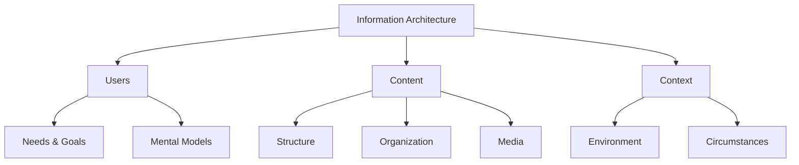
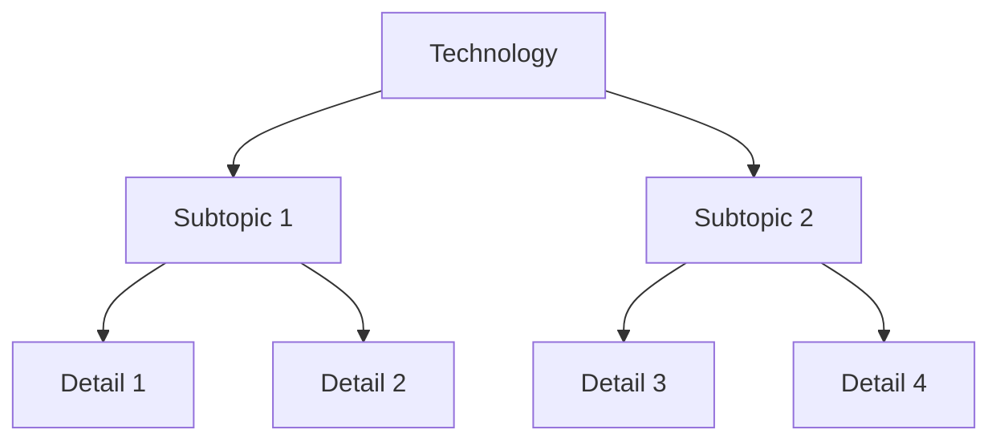
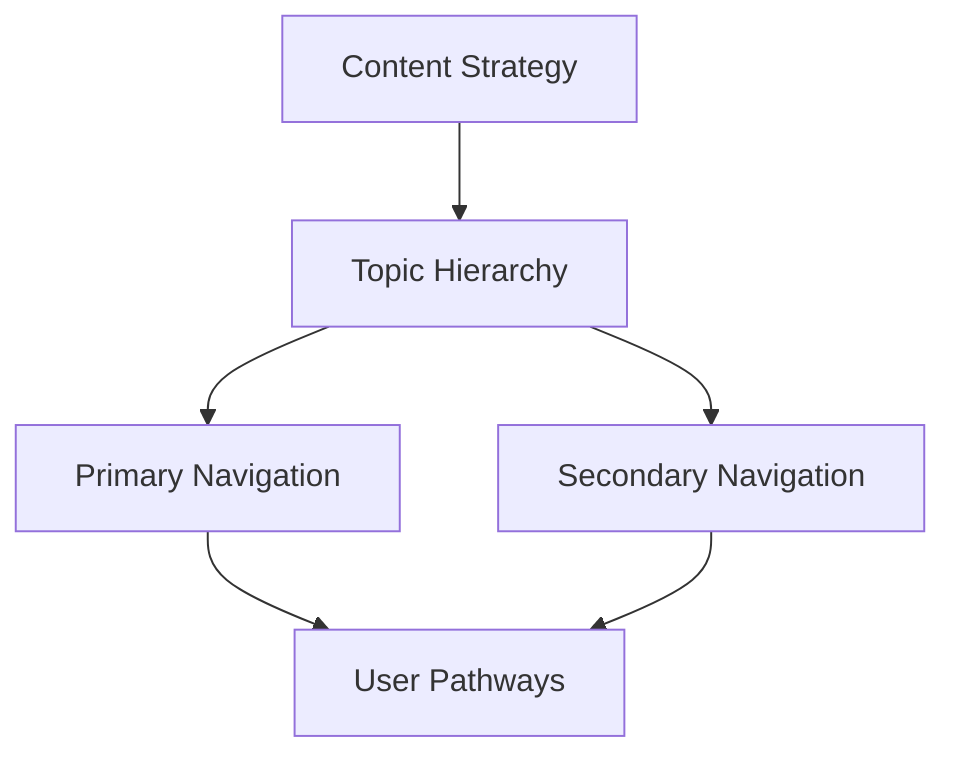
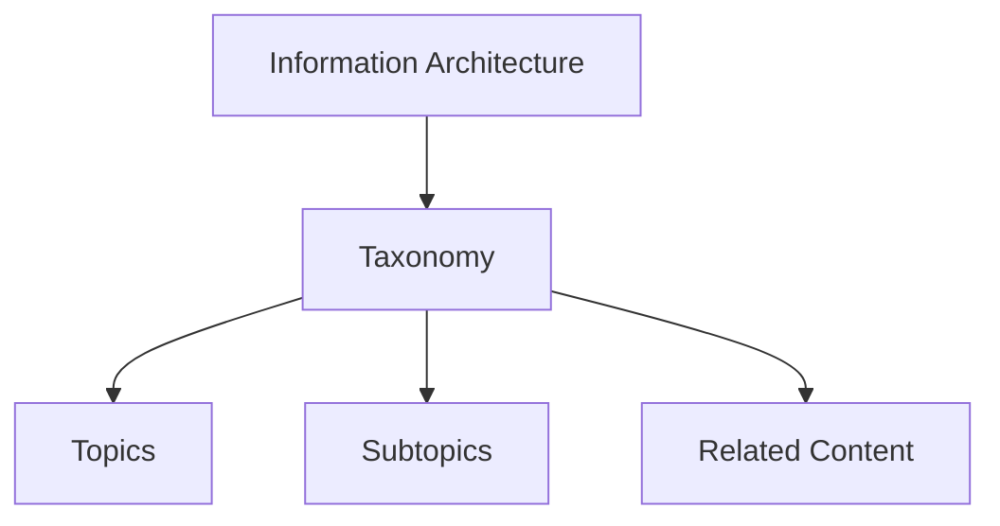
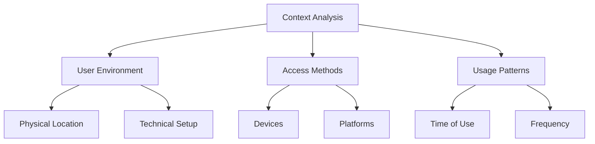
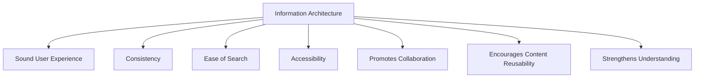
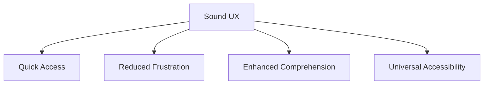

*Generated on 2025-07-14 21:38:12*

## Table of Contents

1. [Information Architecture in Technical Documentation](#information-architecture-in-technical-documentation)
2. [Table of Contents](#table-of-contents)
3. [What is Information Architecture](#what-is-information-architecture)
4. [Core Elements of IA](#core-elements-of-ia)
5. [Users](#users)
6. [Content](#content)
7. [Context](#context)
8. [Key Principles and Concepts](#key-principles-and-concepts)
9. [Role in Technical Documentation](#role-in-technical-documentation)
10. [Sound User Experience](#sound-user-experience)
11. [Consistency in Documentation](#consistency-in-documentation)
12. [Enhanced Searchability](#enhanced-searchability)
13. [Improved Accessibility](#improved-accessibility)
14. [Collaboration Benefits](#collaboration-benefits)
15. [Content Reusability](#content-reusability)
16. [Better Understanding for Users](#better-understanding-for-users)
17. [Understanding IA Taxonomy](#understanding-ia-taxonomy)
18. [Hierarchical Structure Principles](#hierarchical-structure-principles)
19. [Examples of Taxonomy in Practice](#examples-of-taxonomy-in-practice)
20. [Website Navigation](#website-navigation)
21. [E-commerce Platforms](#e-commerce-platforms)
22. [Documentation Systems](#documentation-systems)
23. [Benefits of Taxonomy](#benefits-of-taxonomy)
24. [Implementation Strategies](#implementation-strategies)
25. [Audience Analysis](#audience-analysis)
26. [Identifying User Roles](#identifying-user-roles)
27. [Technical Expertise Assessment](#technical-expertise-assessment)
28. [User Needs Analysis](#user-needs-analysis)
29. [Content Analysis and Organization](#content-analysis-and-organization)
30. [Existing Content Review](#existing-content-review)
31. [Gap Analysis](#gap-analysis)
32. [Content Mapping](#content-mapping)
33. [Information Hierarchy Development](#information-hierarchy-development)
34. [Category Creation](#category-creation)
35. [Labeling Systems](#labeling-systems)
36. [Navigation Structure](#navigation-structure)
37. [User-Centered Design Approach](#user-centered-design-approach)
38. [Navigation Design](#navigation-design)
39. [Content Organization Methods](#content-organization-methods)
40. [Labeling Best Practices](#labeling-best-practices)
41. [Search System Integration](#search-system-integration)
42. [Testing and Validation](#testing-and-validation)
43. [Documentation Strategy](#documentation-strategy)
44. [Content Management Systems](#content-management-systems)
45. [Version Control](#version-control)
46. [Updates and Maintenance](#updates-and-maintenance)
47. [Quality Assurance](#quality-assurance)
48. [User Feedback Integration](#user-feedback-integration)


---


## Information Architecture in Technical Documentation { #information-architecture-in-technical-documentation }

# Information Architecture in Technical Documentation

Information Architecture (IA) is the structural design of information spaces that enables efficient organization, labeling, and navigation of content. In technical documentation, IA serves as the foundation for creating accessible, usable, and comprehensible documentation systems.

## Core Components

Information Architecture consists of three fundamental elements:

1. **Users** - Understanding audience needs, behaviors, and mental models
2. **Content** - The information itself, including structure, organization, and media
3. **Context** - The environment and circumstances in which users access information



## Importance in Technical Documentation

### Usability Enhancement
- Creates logical information flow
- Enables intuitive navigation
- Reduces cognitive load for users
- Supports efficient information retrieval

### Documentation Quality
- Maintains consistency across documentation
- Promotes standardized terminology
- Enables effective content reuse
- Supports scalability of documentation

## Implementation Principles

### 1. Hierarchical Organization
Technical content should be organized in clear hierarchies:
- Primary categories
- Subcategories
- Related topics
- Cross-references

### 2. Taxonomy Development
Implement consistent taxonomies for:
- Topic classification
- Metadata tagging
- Navigation structures
- Search optimization

### 3. User-Centered Design
- Conduct user research
- Create [User Personas](#user-personas)
- Map user journeys
- Test navigation patterns

## Best Practices

1. **Clear Navigation**
   - Implement consistent menu structures
   - Provide breadcrumb navigation
   - Include search functionality
   - Use descriptive labels

2. **Content Modularity**
   - Design reusable content blocks
   - Implement content types
   - Create standardized templates
   - Maintain consistent formatting

3. **Accessibility**
   - Support assistive technologies
   - Provide alternative text
   - Ensure logical reading order
   - Maintain clear visual hierarchy

Information Architecture serves as the backbone of effective technical documentation, enabling users to find and understand information efficiently while supporting documentation teams in maintaining and scaling their content effectively.

---

## Table of Contents { #table-of-contents }

### 1. Fundamentals of Information Architecture

Information Architecture (IA) is the practice of organizing and structuring information in a way that is findable, manageable, and usable.  It focuses on creating a clear and intuitive experience for users interacting with digital products, services, and especially, documentation.  IA is not just about aesthetics; it's about ensuring that users can easily find the information they need, understand its context, and use it effectively.  As Peter Morville succinctly puts it, "Findability precedes usability; you can’t use what you can’t find." This principle highlights the critical role of IA in creating effective technical documentation.

IA involves several key components working together:

* **User:** Understanding the user's needs, goals, and mental models is paramount.  IA should align with how users think and search for information. This involves considering their prior knowledge, expectations, and common tasks.  User research, including user interviews and usability testing, can provide valuable insights into user behavior and preferences.
* **Content:** This encompasses the actual information being presented, including its structure, organization, labeling, and any accompanying media like images or videos.  Content strategy is crucial for ensuring that information is presented in a clear, concise, and consistent manner.  This includes defining content types, establishing editorial guidelines, and implementing a content management system.
* **Context:** The environment and circumstances in which users access information are also important considerations.  IA should ensure that the documentation is readily usable in different situations, whether on a desktop computer, mobile device, or in a specific software environment.  Contextual factors, such as user roles, access permissions, and available technologies, should be carefully considered.

**Importance of Information Architecture in Technical Documentation**

Well-designed IA delivers numerous benefits for technical documentation:

* **Sound User Experience:**  IA promotes a logical and intuitive structure, allowing users to quickly and efficiently locate the information they need. This reduces frustration and enhances user satisfaction.
* **Consistency:**  IA fosters consistency in vocabulary, formatting, and content style, improving the overall professionalism of the documentation and minimizing confusion. This is particularly important when dealing with complex technical concepts.
* **Ease of Search:**  Technical documentation often employs specialized jargon and complex terminology.  Effective IA, combined with a well-implemented search engine, metadata, and a glossary, allows users to easily find relevant information.
* **Content Reusability:**  IA encourages the creation of modular and reusable content chunks.  This streamlines the documentation process, reduces redundancy, and ensures consistency across different documentation formats.
* **Improved Comprehension:** By organizing information logically and sequentially, IA helps users understand the relationships and context between different sections of documentation.  This facilitates better comprehension and easier absorption of technical concepts.

**Information Architecture Taxonomy**

Taxonomy plays a crucial role in IA by providing a hierarchical structure for organizing and labeling content.  It defines how information is categorized and labeled within a shared information environment.  In technical documentation, taxonomy helps organize topics, subtopics, and related content within manuals and guides.

A simple example can be seen in an e-commerce site selling clothing. The main categories (Men's, Women's, Children's) represent the top level of the taxonomy. Within each category, further subcategories exist (Shirts, Pants, Shoes), and so on. This hierarchical structure allows users to easily navigate and find specific items.

The relationship between IA and taxonomy can be visualized as follows:

```
Information Architecture (Overall structure)
└── Taxonomy (Categorization and labeling within the structure)
    └── Category A
        └── Subcategory A1
        └── Subcategory A2
    └── Category B
        └── Subcategory B1
        └── Subcategory B2
```

By implementing a well-defined taxonomy, technical documentation becomes more findable, manageable, and ultimately, more usable for the intended audience.  [Information Architecture Principles](#information-architecture-principles) will further explore key principles to consider when designing IA for technical documentation.


---

## What is Information Architecture { #what-is-information-architecture }

## What is Information Architecture

Information Architecture (IA) is a critical discipline within the realm of technical documentation and digital content management. It involves organizing and labeling content in a way that is logical, sequential, and concise, thereby enhancing the usability and accessibility of digital products and services. Peter Morville, a prominent figure in the field, encapsulates the importance of IA by stating, "Findability precedes usability; you can’t use what you can’t find." This underscores the necessity of well-structured information in ensuring that technical documentation is both useful and easily navigable.

### Importance of Information Architecture in Technical Documentation

Effective information architecture is pivotal for several reasons:

- **Sound User Experience:** IA ensures that technical documentation is organized logically and intuitively, allowing users to quickly and efficiently access the information they need. This leads to greater user satisfaction and reduces frustration.
- **Consistency:** Good IA enhances the consistency of vocabulary, text formatting, and content style, thereby improving the document’s professionalism and reducing confusion, especially when dealing with complex technical concepts.
- **Ease of Search:** By implementing a well-structured information hierarchy and incorporating effective metadata and glossary terms, a well-executed search engine helps readers locate relevant information.
- **Encourages Content Reusability:** IA promotes the development of reusable and modular information pieces. This method simplifies the documentation process, reduces duplication, and guarantees uniformity across various forms of documentation.
- **Strengthens Understanding:** IA ensures that information is arranged logically and sequentially, facilitating readers’ comprehension of the connections and context between various documentation sections. This makes it easier for readers to absorb technical ideas.

### Information Architecture Taxonomy

In Information Architecture, taxonomy is crucial for organizing and labeling content using a hierarchical structure. It segments and labels information within a shared information environment, helping to organize topics, subtopics, and related content within manuals and guides.



For example, consider an e-commerce platform like Jumia. The main categories (such as "Fashion," "Electronics," and "Home & Office") represent the information architecture. Clicking on "Fashion" reveals subcategories like "WOMEN’S FASHION," "MEN’S FASHION," and "KID’S FASHION," demonstrating the taxonomy in action.

### How to Create an Information Architecture for Your Technical Documentation

Creating an effective IA involves several steps:

1. **Understand User Needs:** Conduct user research to understand their needs, goals, and mental models when seeking new information.
2. **Define Content Structure:** Organize content into logical categories and subcategories.
3. **Label Content:** Use clear and consistent labels that align with user expectations.
4. **Implement Navigation:** Develop intuitive navigation schemes that guide users through the content effortlessly.
5. **Test and Iterate:** Continuously test the IA with users and iterate based on feedback to improve usability.

### Information Architecture Principles to Consider when Drafting Your Technical Documentation

When drafting technical documentation, consider the following IA principles:

- **User-Centric Design:** Ensure that the IA aligns with users' ways of thinking and searching.
- **Consistency:** Maintain a consistent vocabulary, text formatting, and content style.
- **Hierarchical Structure:** Organize content in a clear hierarchy to facilitate navigation.
- **Modular Content:** Create reusable and modular information pieces to simplify the documentation process.
- **Effective Metadata:** Use metadata and glossary terms to enhance searchability.

By adhering to these principles, technical writers can create documentation that is not only informative but also easy to navigate and understand.

In conclusion, Information Architecture plays a vital role in enhancing the usability and accessibility of technical documentation. By organizing content logically and intuitively, IA ensures that users can quickly find and utilize the information they need, leading to a better overall user experience.

---

## Core Elements of IA { #core-elements-of-ia }

# Core Elements of Information Architecture

Information Architecture (IA) comprises several fundamental elements that work together to create effective and user-friendly documentation systems. This section explores the key components that form the foundation of successful IA implementation.

## Essential Components

### 1. User Experience Framework
The cornerstone of IA is creating a sound user experience that enables efficient information access. This includes:
- Logical organization of content
- Intuitive navigation paths
- Clear information hierarchy
- Seamless user flows

### 2. Content Structure and Hierarchy
Content hierarchy forms the backbone of IA through:
- Strategic topic organization
- Primary and secondary navigation
- Content grouping based on user needs
- Scalable information models

### 3. Consistency Management
Maintaining consistency across documentation through:
- Standardized vocabulary
- Uniform formatting
- Consistent style guidelines
- Clear content patterns

### 4. Search and Findability
Enhanced information discovery via:
- Robust search functionality
- Well-structured metadata
- Comprehensive glossaries
- Tagged content systems

### 5. Accessibility Features
Ensuring universal access through:
- Screen reader compatibility
- Clear labeling systems
- Alternative text for images
- Accessible navigation patterns

## Implementation Considerations

### Content Organization


### Best Practices
1. Implement clear navigation systems
2. Maintain consistent terminology
3. Create modular content structures
4. Design for scalability
5. Support multiple user personas

## Integration with Documentation Systems

The core elements should integrate seamlessly with:
- [Content Management Systems](#content-management-systems)
- [Technical Documentation](#technical-documentation)
- [User Interface Design](#user-interface-design)
- [Navigation Systems](#navigation-systems)

Successful IA implementation requires careful consideration of these core elements while maintaining focus on user needs and organizational goals. Regular assessment and refinement of these elements ensure continued effectiveness of the information architecture.

See also:
- [Information Design](#information-design)
- [User Experience](#user-experience)
- [Content Strategy](#content-strategy)

---

## Users { #users }

## Users

Users are central to the design and development of effective technical documentation and broader information architecture (IA).  Understanding user needs, behaviors, and contexts is crucial for creating documentation that is findable, accessible, and ultimately useful.  IA focuses on organizing and labeling content for easy access and usage, directly impacting the user experience.  Good IA translates to a positive user experience, achieved by connecting three core elements: the user, the context, and the content itself.

### Understanding User Needs

The first step in creating useful technical documentation is understanding the target audience. This involves considering several key factors:

* **Technical Expertise:**  A user's technical background significantly influences the language, complexity, and depth of information presented.  Documentation for novice users will require simpler explanations and definitions compared to documentation for experts. For example, explaining a coding concept to a beginner would necessitate a step-by-step breakdown, while experienced developers might benefit from a more concise, high-level overview.
* **Information Needed:** Identifying the specific information users seek is paramount.  This involves categorizing information into topics, subtopics, and related resources.  Prioritizing essential information based on user needs ensures that the most critical content is readily accessible. For instance, troubleshooting documentation should prioritize common errors and their solutions.
* **Context of Use:**  The environment in which users access documentation impacts its design.  Will users access it online, offline, on mobile devices, or in a specific software environment?  Considering the context of use ensures the documentation is formatted and structured appropriately. A mobile-first approach would prioritize concise content and streamlined navigation.
* **Expectations and User Preferences:** Understanding how users search for information (e.g., keywords, browsing) informs the design of search functionality and navigation.  Additionally, understanding the expected level of detail and preferred formatting (e.g., code examples, visuals) enhances usability.  User testing and feedback can reveal valuable insights into these preferences.
* **Method of Gathering Information:**  Gathering user information can be achieved through various methods, including reviewing existing documentation feedback, conducting user surveys, analyzing website analytics, and collaborating with subject matter experts (SMEs). These methods help validate assumptions and uncover unmet user needs.

### Mapping the User Journey

Mapping the user journey involves visualizing the steps a user takes when interacting with the documentation. This process helps identify potential pain points and ensures that the documentation provides solutions at key decision points.  Consider the following:

* **Walkthroughs:**  Simulating user interactions with the documentation reveals potential usability issues and areas for improvement.
* **Pain Points:** Identifying common problems users face allows writers to address these challenges directly within the documentation.
* **Decision Points:**  Highlighting key moments where users need to make decisions ensures the documentation provides the necessary information to guide them effectively.

### Structuring Content for Usability

Once user needs are understood, the documentation's structure and layout become critical. This involves:

* **Layout and Navigation:**  A clear visual hierarchy, utilizing headings, spacing, and visual elements, guides users and signals importance.  Balancing text with visuals like images, GIFs, and videos enhances comprehension and breaks up large blocks of text.  A user-friendly navigation system, potentially including a well-defined [Taxonomy](#taxonomy), is essential.
* **Information Density and Visual Hierarchy:**  Carefully managing the amount of information presented on each page and using visual cues to prioritize content prevents cognitive overload and improves readability.
* **Search Functionality:**  A robust search feature allows users to quickly locate specific information within the documentation using relevant keywords.
* **Content Inventory and Audit:**  A content inventory involves compiling all existing documentation and auditing it for accuracy, relevance, and completeness.  This process identifies gaps and areas for improvement.
* **Information Grouping and Classification:**  Organizing information into logical categories and subcategories simplifies navigation and ensures that related content is easily discoverable.  This is where a well-defined taxonomy becomes invaluable.

By focusing on these user-centric principles, technical writers can create documentation that is not only informative but also easy to use and navigate, ultimately leading to improved user satisfaction and greater product adoption.


---

## Content { #content }

## Content

### Overview
Content refers to the actual information that is organized and presented within the framework of Information Architecture (IA). It encompasses the structure, organization, labeling, images, and media used to convey information, ensuring it is accessible and user-friendly. Effective IA is crucial for streamlining complex information, making digital products and services more usable and accessible.

### Components of Content
Content within IA consists of several key components:

- **Content Structure**: The way information is organized and presented, ensuring logical flow and ease of navigation.
- **Labeling**: Clear and concise labeling of content to facilitate quick identification and retrieval.
- **Images and Media**: Visual elements that enhance understanding and engagement, such as images, videos, GIFs, and sketches.

### Role of IA in Technical Documentation
IA plays a pivotal role in technical documentation by:

- **Promoting Usability**: Helping technical writers create clear and concise documents that improve the usability of complex technical content.
- **Ensuring Consistency**: Maintaining consistency in vocabulary, text formatting, and content style, which enhances professionalism and reduces reader confusion.
- **Enhancing Accessibility**: Making technical documentation accessible to all users, including those with assistive technology, by anticipating diverse user needs.
- **Encouraging Content Reusability**: Promoting the development of reusable and modular information pieces, which simplifies the documentation process, reduces duplication, and guarantees uniformity.

### Taxonomy in IA
Taxonomy is a critical aspect of IA, organizing and labeling content using a hierarchical structure. It helps in segmenting and labeling information within a shared information environment, making it easier to organize topics, subtopics, and related content within manuals and guides.



### Steps to Create Effective Content in IA

1. **Identify User Needs**: Understand the specific information users need and categorize these needs into topics, subtopics, and related references.

2. **Analyze Existing Content**: Review all content items, topics, format, and organization. Identify gaps, overlaps, and redundant content based on user feedback.

3. **Card Sorting**: Understand how content items are grouped to determine categorization preferences.

4. **Create Content Hierarchy**: Think like a user and structure content in a way that aligns with how users search for information. Place essential topics at the top and group related content together for easy access.

5. **Define Layout and Navigation**:
   - **Information Density and Visual Hierarchy**: Use headings, spacings, and visual elements to guide users and signal importance. Balance text with visuals to break up content and aid understanding.
   - **Local Navigation**: Provide navigation for lengthy contents such as breadcrumbs, "jump to" links, and tables of contents.
   - **Search Functionality**: Implement a robust search feature for quick content delivery.

6. **Content Inventory**: Collate all existing articles on a particular topic and audit each one to gather insights on usefulness, accuracy, and what needs to be added or removed.

### Example: Technical Documentation on Hashnode
Consider a technical documentation article on “Navigating AWS IPV 4” on Hashnode. The content goal is clear, and the writer intentionally structures the content to enlighten readers effectively.

```markdown
### Table of Contents
1. Introduction
2. Understanding AWS IPV4
3. Configuring IPV4 Settings
4. Troubleshooting Common Issues
5. Conclusion
```

### Summary
Content within IA is the backbone of effective and user-friendly digital experiences. By organizing, labeling, and structuring content appropriately, IA enhances usability, accessibility, and consistency, making complex information more manageable and understandable for users. The process involves understanding user needs, analyzing existing content, creating a content hierarchy, and defining layout and navigation to ensure an optimal user experience.

---

## Context { #context }

# Context in Information Architecture

Context is a fundamental pillar of information architecture (IA) that focuses on understanding and optimizing the environment and circumstances in which users access and interact with technical documentation. This aspect is crucial for ensuring information remains accessible, useful, and relevant across different usage scenarios.

## Key Components of Context

### Environmental Factors
- **Physical Environment**: Where users typically access documentation (office, field, manufacturing floor)
- **Technical Environment**: Devices and platforms used (desktop, mobile, tablets)
- **Network Conditions**: Internet connectivity and bandwidth considerations
- **Time Constraints**: Usage during emergencies vs. Routine consultation

### Usage Scenarios
- **Online Access**: Real-time documentation through web browsers
- **Offline Usage**: Downloaded or printed documentation
- **Mobile Context**: On-the-go access requiring responsive design
- **Embedded Help**: Documentation integrated within software applications

## Context Analysis Framework



## Implementation Considerations

### Accessibility Adaptations
- Screen reader compatibility
- Alternative text for images
- Keyboard navigation support
- High contrast options

### Content Delivery
- **Progressive Loading**: For slower connections
- **Responsive Design**: Adapting to different screen sizes
- **Print-friendly Versions**: For offline reference
- **Search Optimization**: Context-aware search functionality

## Related Concepts
- [User Experience](#user-experience)
- [Information Architecture Principles](#information-architecture-principles)
- [Content Strategy](#content-strategy)
- [Technical Documentation](#technical-documentation)

## Best Practices
1. Conduct contextual inquiries to understand usage environments
2. Design for multiple access scenarios
3. Test documentation in various contexts
4. Maintain consistency across different delivery methods
5. Consider cultural and regional contexts

Understanding context helps technical writers create documentation that remains effective regardless of how, where, or when users access it. This understanding directly influences information organization, presentation methods, and delivery mechanisms.

---

## Key Principles and Concepts { #key-principles-and-concepts }

## Key Principles and Concepts

This section outlines the core principles and concepts underpinning effective information architecture (IA) for technical documentation.  Understanding these principles is crucial for creating documentation that is user-friendly, findable, and contributes to a positive user experience.

### User-Centric Design

The most fundamental principle of IA is user-centricity.  All decisions regarding content organization, labeling, and navigation should prioritize the needs and expectations of the target audience.  Consider their technical proficiency, common tasks, and preferred learning styles.  For example, a beginner's guide might benefit from a step-by-step tutorial approach, while experienced users might prefer a comprehensive reference guide.  User research methods like [Card Sorting](#card-sorting) can help understand user mental models and inform IA design.

### Structure and Organization

A well-defined structure is essential for clear and efficient navigation.  This involves breaking down complex information into smaller, manageable chunks, organized hierarchically.  A common approach is to use a tree structure, with broader topics branching into more specific subtopics.  This hierarchy should reflect the logical relationships between concepts. For instance, a documentation set for a software application might have top-level categories like "Installation," "Configuration," "Usage," and "Troubleshooting," each further subdivided into relevant subtopics.

### Consistency

Consistency across all aspects of documentation is paramount. This includes:

* **Terminology:** Use consistent terms and definitions throughout.  Avoid using synonyms for the same concept, as this can lead to confusion.  A [Glossary of Terms](#glossary-of-terms) can help ensure consistency.
* **Formatting:** Maintain a uniform style for headings, lists, code blocks, and other formatting elements.  This improves readability and professionalism. For example, always use `code` tags for code snippets:
  ```
  print("Hello, world!")
  ```
* **Style and Tone:**  Adopt a consistent writing style and tone that aligns with the target audience and the overall purpose of the documentation.

### Findability

Users should be able to quickly and easily find the information they need.  This requires:

* **Effective Search:** Implement a robust search functionality that handles technical jargon and complex vocabulary.
* **Clear Labeling:** Use concise and descriptive labels for categories, sections, and links.  Avoid ambiguous or overly technical terms.
* **Metadata and Tagging:**  Use metadata and tags to categorize content and improve search results.

### Accessibility

Technical documentation should be accessible to all users, including those with disabilities.  This involves:

* **Clear and Concise Language:** Use plain language and avoid complex sentence structures.
* **Alternative Text for Images:** Provide descriptive alt text for all images and diagrams.
* **Keyboard Navigation:** Ensure all interactive elements are accessible via keyboard.
* **Proper Heading Structure:** Use headings to structure content logically and enable screen reader navigation.

### Reusability and Maintainability

Design documentation for reusability and easy maintenance.  Modular content chunks can be reused across different sections or even in different documentation sets.  This reduces redundancy and ensures consistency.  A well-structured IA also simplifies updates and revisions, as changes can be made in one location and automatically reflected throughout the documentation.  Adopting a structured authoring approach, like using a component content management system, can further enhance reusability and maintainability.


---

## Role in Technical Documentation { #role-in-technical-documentation }

## Role in Technical Documentation

### 2. Benefits and Importance (≈800 words)

Information Architecture (IA) plays a pivotal role in technical documentation, ensuring that complex information is presented in a clear, accessible, and user-friendly manner. Effective IA improves the overall quality of documentation, enhancing user experience, consistency, and accessibility. Understanding the benefits and importance of IA in technical documentation is crucial for technical writers and stakeholders alike.

#### Importance of Information Architecture in Technical Documentation

Information Architecture is the backbone of technical documentation, providing structure and organization that make the content navigable and comprehensible. Peter Morville aptly summarizes the importance of IA by stating, "Findability precedes usability; you can’t use what you can’t find." This principle underscores the necessity of IA in creating technical documentation that users find useful.

##### Key Importance of Information Architecture

1. **Sound User Experience**
   - **Logical Organization**: IA ensures that technical documentation is organized logically and intuitively. This allows users to quickly and efficiently access the information they need.
   - **Intuitive Navigation**: A well-structured IA simplifies complex information by providing clear navigation paths, reducing user frustration and enhancing satisfaction.
   - **Example**: Consider a software manual where users can easily locate sections on installation, troubleshooting, and advanced features through a well-organized table of contents and index.

2. **Consistency**
   - **Vocabulary and Formatting**: Technical documentation with good IA appears consistent in terms of vocabulary, text formatting, and content style. This consistency improves the document’s professionalism and reduces confusion, especially when dealing with complex technical concepts.
   - **Example**: A consistent use of terminology and formatting across a user manual ensures that readers do not get confused by different styles or phrases used for the same concept.

3. **Ease of Search**
   - **Effective Metadata and Glossary**: By implementing a well-structured information hierarchy and incorporating effective metadata and glossary, a well-executed search engine helps readers locate relevant information.
   - **Example**: A comprehensive glossary and index in a technical manual allow users to quickly find definitions and explanations for technical terms.

4. **Accessibility**
   - **Inclusive Design**: Strong IA makes technical documentation accessible to everyone, including users with assistive technology. As a writer, anticipating readers with diverse needs empowers you to build content that caters to all user classes, creating clear, labeled, and well-structured documentation.
   - **Example**: Ensuring that all images have alt text and that the document can be navigated using screen readers makes the content accessible to visually impaired users.

5. **Promotes Collaboration**
   - **Unified Approach**: IA streamlines collaboration between technical writers and stakeholders, guaranteeing a unified approach to crafting user-centric documentation. This shared framework fosters cooperation and aligns contributions with the core objective.
   - **Example**: Using a common content template and style guide ensures that all contributors produce content that aligns with the overall documentation goals.

6. **Encourages Content Reusability**
   - **Modular Information**: IA promotes the development of reusable and modular information pieces. This method simplifies the documentation process, reduces duplication, and guarantees uniformity among various forms of documentation.
   - **Example**: Creating reusable sections on common procedures, such as login steps or basic troubleshooting, can be included in multiple documents without rewriting.

7. **Strengthens Understanding**
   - **Logical Sequence**: IA ensures information is arranged logically and sequentially, facilitating readers’ comprehension of the connections and context between various documentation sections. This facilitates understanding and makes it easier for readers to absorb technical ideas.
   - **Example**: A step-by-step guide that logically progresses from simple to complex tasks helps users understand the overall process better.

#### Roles and Responsibilities

To effectively implement IA in technical documentation, it is essential to understand the roles and responsibilities involved:

1. **User Analysis**
   - **Understanding Users’ Needs**: The first step to useful technical documentation is understanding the users’ needs, goals, and mental models when seeking new information. This ensures that the information structure aligns with users’ ways of thinking and searching.
   - **Context of Use**: Consider how users access the documentation, whether online, printed, or mobile, and the environment in which it would be used.

2. **Technical Expertise**
   - **User Knowledge and Experience**: The users' technical knowledge and experience will influence the terminology, complexity, and depth of information included in the documentation.
   - **Example**: For a beginner-level guide, the language and explanations should be simpler and more detailed compared to an advanced guide.

3. **Information Needs**
   - **Categorizing Needs**: You need to know the specific information your users need. Categorize these needs into topics, subtopics, related topics, and references to other articles that could fill a gap, especially for those needing a certain skill before they can grasp the content.
   - **Example**: A comprehensive FAQ section that addresses common user queries can be categorized under different topics for easy reference.

4. **User Preferences and Expectations**
   - **Search Methods**: Find out how users typically search for information, which could range from keywords to exploration. Understand what level of detail is expected and formatting preferences, if possible.
   - **Example**: Incorporating a robust search function with keyword suggestions can help users find information more efficiently.

5. **Method of Gathering Information**
   - **Feedback Review**: Review existing documentation feedback to know what users like and want as an improvement.
   - **Surveys and Analytics**: Conduct surveys and web analytics to gather insights. Collaborate with subject matter experts to validate assumptions.
   - **Example**: Regularly collecting user feedback through surveys and analyzing usage data can help identify areas for improvement in the documentation.

#### Conclusion

Information Architecture is indispensable in technical documentation, ensuring that complex information is structured, accessible, and user-friendly. By promoting sound user experience, consistency, ease of search, accessibility, collaboration, content reusability, and strengthened understanding, IA significantly enhances the quality and effectiveness of technical documentation. Understanding the roles and responsibilities involved in implementing IA helps in creating documentation that meets user needs and expectations, ultimately leading to greater user satisfaction and reduced frustration.

For further reading on the principles and benefits of Information Architecture, refer to [Information Architecture Principles](#information-architecture-principles).



By adhering to the principles of Information Architecture, technical writers can create documentation that is not only informative but also intuitive and user-centric, thereby maximizing its utility and effectiveness.

---

## Sound User Experience { #sound-user-experience }

# Sound User Experience
[Information Architecture](#information-architecture) plays a crucial role in creating a sound user experience (UX) through well-organized technical documentation and digital products. This section explores how proper information architecture contributes to an effective and satisfying user experience.

## Core Elements

### User-Centric Organization
Sound user experience relies on three fundamental elements:
- **User Understanding**: Analyzing users' needs, goals, and mental models
- **Contextual Awareness**: Considering the environment and circumstances of information access
- **Logical Structure**: Organizing content in an intuitive and accessible manner

### Key Benefits


## Implementation Strategies

### Information Hierarchy
Creating an effective information hierarchy involves:
- Prioritizing essential content
- Grouping related information
- Establishing clear navigation paths
- Using consistent terminology

### Accessibility Considerations
Sound UX ensures documentation is accessible to all users by:
- Supporting assistive technologies
- Providing clear labels and structure
- Maintaining consistent formatting
- Offering alternative content formats

## Best Practices

### Content Organization
1. Map user journeys through documentation
2. Analyze existing content for gaps
3. Create intuitive navigation systems
4. Balance information density

### User Research
Gathering user insights through:
```
- Feedback analysis
- Usage analytics
- User surveys
- SME consultation
```

## Technical Considerations

### Documentation Structure
- Implement clear hierarchical organization
- Use consistent formatting and terminology
- Include appropriate visual elements
- Provide cross-references to related content

### Navigation Design
- Create intuitive menu structures
- Implement effective search functionality
- Maintain consistent navigation patterns
- Offer multiple access paths to information

## Integration with Other Systems

Sound UX works in conjunction with other aspects of [Technical Documentation](#technical-documentation) and [User Interface Design](#user-interface-design) to create a comprehensive information system that serves users effectively while maintaining accessibility and usability standards.

Sound user experience forms the foundation for successful technical documentation and digital products, ensuring users can efficiently access and utilize information while maintaining high satisfaction levels.

---

## Consistency in Documentation { #consistency-in-documentation }

## Consistency in Documentation

Consistency is a cornerstone of high-quality documentation. It ensures a seamless and predictable user experience, fostering trust and understanding. Consistent documentation reduces cognitive load, allowing users to focus on the content rather than deciphering variations in style, terminology, or structure. This section explores the importance of consistency and provides practical strategies for achieving it.

### Types of Consistency

Consistency in documentation encompasses several aspects:

* **Style and Tone:** Maintaining a uniform voice and style throughout the documentation ensures a professional and cohesive presentation.  This includes consistent use of grammar, punctuation, capitalization, and sentence structure.  The tone should be appropriate for the target audience, whether formal or informal.  For instance, a user guide for a complex software application might adopt a more formal tone than a tutorial for a beginner-friendly game.

* **Terminology:**  Using consistent terminology is crucial for clarity and avoids confusion.  A glossary or style guide can help enforce consistent terminology, especially for technical terms or acronyms.  For example, if you use "user interface" in one section, avoid using "UI" or "user experience" (UX) interchangeably in other sections unless explicitly defined. Define terms upfront and adhere to those definitions throughout.

* **Formatting:**  Consistent formatting enhances readability and comprehension.  This includes consistent use of headings, subheadings, lists, tables, code blocks, and visual elements.  For example, always use `code blocks` for code snippets and adhere to a specific style for headings (e.g., using `##` for main headings, `###` for subheadings, etc.).

* **Structure and Organization:**  A consistent structure helps users navigate the documentation easily.  This can be achieved by using a standard template for different document types (e.g., tutorials, API references, troubleshooting guides) and following a logical hierarchy of information.  For instance, tutorials could consistently follow a structure of introduction, prerequisites, steps, and conclusion.

* **Platform and Medium:**  Maintaining consistency across different platforms and mediums (e.g., web, print, mobile) is essential for a unified user experience.  This includes ensuring consistent branding, navigation, and content presentation across all platforms.

### Achieving Consistency

Several strategies can help achieve consistency in documentation:

* **Style Guides:** A comprehensive style guide serves as a reference for writers, editors, and developers.  It defines standards for style, tone, terminology, formatting, and other aspects of documentation.

* **Templates:** Using templates for different document types ensures a consistent structure and format.

* **Automated Checks:**  Tools like linters and style checkers can automatically identify inconsistencies in code, text, and formatting.

* **Review Processes:** Implementing a thorough review process helps catch inconsistencies before they reach the end-user.

* **Version Control:**  Using a version control system like Git allows for tracking changes and reverting to previous versions if necessary.

* **Collaboration and Communication:**  Effective communication among team members is essential for maintaining consistency.  This includes regular meetings, shared style guides, and clear communication channels.

### Example: Consistent Formatting for Code Blocks

```python
# Consistent code block formatting
def greet(name):
    """Greets the user with a personalized message."""
    print(f"Hello, {name}!")

greet("World")
```

By adhering to these principles and strategies, organizations can create documentation that is clear, consistent, and user-friendly, ultimately improving user satisfaction and product adoption.  See [Information Architecture](#information-architecture) for further information on structuring documentation.


---

## Enhanced Searchability { #enhanced-searchability }

## Enhanced Searchability

Enhanced Searchability is a critical aspect of content management and user experience design, especially in the digital age. It involves various techniques and strategies aimed at making information easily discoverable and accessible to users. This section explores the importance of enhanced searchability, key methods to achieve it, and practical examples to illustrate these concepts.

### Importance of Enhanced Searchability

Enhanced searchability is crucial for several reasons:

1. **Improved User Experience**: Users can quickly find the information they need without frustration.
2. **Increased Engagement**: When users can easily locate relevant content, they are more likely to stay engaged with the platform.
3. **Efficient Information Retrieval**: Enhanced searchability ensures that valuable information is not buried under irrelevant content.

### Key Methods to Enhance Searchability

#### 1. **Structured Content**

Structuring content involves breaking down complex ideas into digestible pieces. This can be achieved through:

- **Appropriate Headings and Subheadings**: Use of clear and descriptive headings helps users quickly scan and locate relevant sections.
- **Bullet Points and Lists**: These elements make it easier to skim through content and find specific information.

Example:
```markdown
# Key Features of Our Product

## Interface Design
- User-friendly interface
- Customizable themes

## Performance
- Fast loading times
- High reliability
```

#### 2. **Metadata and Tags**

Metadata and tags provide additional context to content, making it easier to categorize and find.

Example:
```markdown
<meta name="description" content="This article explains the importance of enhanced searchability and provides key methods to achieve it.">
<meta name="keywords" content="searchability, content management, user experience, metadata, tags">
```

#### 3. **Search Engine Optimization (SEO)**

SEO techniques help improve the visibility of content on search engines. This includes:

- **Keyword Optimization**: Using relevant keywords throughout the content.
- **Internal Linking**: Linking to other relevant pages within the site.

Example:
```markdown
To learn more about [SEO best practices](#seo-best-practices), visit our comprehensive guide.
```

#### 4. **Effective Navigation**

A well-organized navigation system allows users to easily find what they are looking for. This can be achieved through:

- **Breadcrumbs**: Showing the user's current location within the site hierarchy.
- **Search Bars**: Providing a search function to quickly find specific content.

Example:
```markdown
Home > Blog > Enhanced Searchability
```

### Visual Elements and Data Visualization

Visual elements such as images, diagrams, and charts can significantly enhance searchability by making complex information more understandable at a glance.

#### Mermaid Chart Example

Using Mermaid charts can help visualize data and processes, making them easier to understand.

```mermaid
Graph TD;
    A[Start] --> B{Search Query};
    B -->|Results Found| C[Display Results];
    B -->|No Results| D[Suggest Related Content];
    C --> E[End];
    D --> E;
```

### Conclusion

Enhanced searchability is a multifaceted approach that involves structuring content, using metadata, optimizing for search engines, and providing effective navigation tools. By implementing these strategies, content can be made more accessible and user-friendly, ultimately leading to a better user experience.

For further reading, explore related topics such as [User Experience Design](#user-experience-design), [Content Management Systems](#content-management-systems), and [Information Architecture](#information-architecture).

---

## Improved Accessibility { #improved-accessibility }

# Improved Accessibility

Improved accessibility in technical documentation refers to the practice of creating content that is accessible to all users, regardless of their abilities or the assistive technologies they use. This section explores how proper Information Architecture (IA) enhances documentation accessibility and creates inclusive user experiences.

## Key Components

### Universal Design Principles

The implementation of improved accessibility relies on several universal design principles:

- **Clear Structure**: Hierarchical organization of content using proper heading levels (H 1-H 6)
- **Alternative Text**: Descriptive text for images and multimedia content
- **Semantic Markup**: Proper HTML elements that convey meaning and structure
- **Keyboard Navigation**: Support for users who cannot use a mouse
- **Color Contrast**: Sufficient contrast ratios for text and background colors

### Assistive Technology Support

Documentation must be compatible with various assistive technologies:

```html
<!-- Example of semantic HTML structure -->
<nav role="navigation" aria-label="Main navigation">
  <ul>
    <li><a href="#overview">Overview</a></li>
    <li><a href="#features">Features</a></li>
  </ul>
</nav>
```

## Implementation Strategies

### Content Organization

- Logical information hierarchy
- Clear and consistent navigation patterns
- Descriptive headings and subheadings
- Scannable content blocks
- [Information Architecture|Well-structured IA](#information-architecturewell-structured-ia)

### Technical Considerations

1. **ARIA Labels**: Implementation of proper ARIA (Accessible Rich Internet Applications) attributes
2. **Document Structure**: Use of semantic HTML elements
3. **Responsive Design**: Content adaptation for different devices and screen sizes
4. **Reading Order**: Logical flow of information for screen readers

```mermaid
Graph TD
    A[Accessibility Implementation] --> B[Content Structure]
    A --> C[Technical Features]
    B --> D[Clear Hierarchy]
    B --> E[Navigation Patterns]
    C --> F[ARIA Support]
    C --> G[Semantic Markup]
```

## Benefits

Improved accessibility provides several advantages:

- **Universal Access**: Ensures content is available to all users
- **Legal Compliance**: Meets accessibility regulations and standards
- **Enhanced Usability**: Benefits all users, not just those with disabilities
- **Better SEO**: Improved search engine optimization through structured content
- **Wider Reach**: Increases the potential audience for documentation

## Best Practices

1. Regular accessibility audits
2. User testing with assistive technologies
3. Maintaining accessibility documentation
4. Continuous improvement of accessibility features
5. Training content creators in accessibility principles

By implementing these accessibility improvements, technical documentation becomes more inclusive and useful for all users while maintaining professional standards and usability.

[Accessibility Guidelines](#accessibility-guidelines) | [User Experience](#user-experience) | [Technical Documentation Standards](#technical-documentation-standards)

---

## Collaboration Benefits { #collaboration-benefits }

## Collaboration Benefits

Collaboration, facilitated by a well-defined Information Architecture (IA), yields numerous benefits in the realm of technical documentation. IA provides a shared framework and a unified approach, fostering cooperation between technical writers, stakeholders, and other contributors. This shared understanding ensures everyone works towards a common goal: creating user-centric documentation that is findable, accessible, and understandable.  The benefits of this collaborative approach extend beyond the creation process and positively impact the final product and its users.

### Enhanced Communication and Shared Understanding

IA fosters a shared language and understanding among all involved parties. By establishing a clear structure and terminology for the documentation, IA minimizes ambiguity and misinterpretations. This shared understanding streamlines communication, reduces revisions, and ensures that everyone is on the same page. For example, using a controlled vocabulary and a standardized style guide ensures consistency across the documentation, regardless of who authored a specific section.

### Improved User Experience

A well-defined IA directly translates to a better user experience.  By organizing information logically and intuitively, readers can easily find the information they need.  This reduces frustration and improves user satisfaction.  Features like clear navigation, consistent labeling, and effective search functionality, all stemming from a solid IA, contribute to a seamless user experience.  For instance, imagine a user searching for troubleshooting steps for a specific error code.  A robust IA would ensure that this information is easily accessible through a search function or a clearly defined troubleshooting section within the documentation.

### Increased Efficiency and Productivity

Collaboration driven by a strong IA leads to increased efficiency in the documentation process.  By establishing clear roles and responsibilities, and by providing a shared framework for content creation, IA minimizes duplicated effort and streamlines workflows.  Reusable content components, enabled by a modular IA, further enhance efficiency by allowing writers to leverage existing materials and avoid recreating content. This saves time and resources, allowing teams to focus on creating high-quality documentation rather than redundant tasks.

### Content Consistency and Quality

IA promotes consistency across all documentation.  By adhering to a predefined structure, style guide, and terminology, the documentation maintains a uniform voice and appearance, regardless of the author.  This consistency enhances the professionalism and credibility of the documentation.  For example, using a consistent format for code examples throughout the documentation enhances readability and ensures a cohesive learning experience for developers.

### Streamlined Maintenance and Updates

A well-structured IA simplifies the ongoing maintenance and updating of documentation.  By organizing content into modular components, updates can be made efficiently and consistently.  Changes to one component can be easily propagated throughout the documentation, ensuring accuracy and minimizing the risk of inconsistencies.  This modular approach also simplifies the process of adding new content, as it can be seamlessly integrated into the existing IA.

### Fostering Innovation and Creativity

While IA provides structure and guidelines, it also fosters innovation and creativity.  By establishing a clear framework, writers can focus on creating compelling and engaging content, knowing that the overall structure is sound.  This allows them to explore new approaches to presenting information and to experiment with different content formats, ultimately enriching the user experience. For instance, incorporating interactive elements like diagrams, videos, or code sandboxes can enhance user engagement and understanding, all within the framework provided by the IA.


---

## Content Reusability { #content-reusability }

# Content Reusability

Content reusability is a strategic approach to organizing and managing information that promotes the efficient use of content across various platforms and formats. It is a key principle in [Information Architecture (IA)][Information Architecture], which streamlines complex information by organizing it logically, sequentially, and concisely. This section explores the role of content reusability in enhancing the usability, accessibility, and consistency of technical documentation.

## Understanding Content Reusability

Content reusability involves creating modular and reusable pieces of information that can be easily adapted and repurposed for different contexts. This method simplifies the documentation process, reduces duplication, and ensures uniformity among various forms of documentation. By breaking down content into smaller, reusable components, technical writers can save time and effort, while also maintaining consistency in vocabulary, text formatting, and content style.

### Benefits of Content Reusability

1. **Consistency**: Technical documentation with good information architecture appears more consistent, reducing confusion among readers, especially when dealing with complex technical concepts.
2. **Accessibility**: Strong IA makes technical documentation accessible to everyone, including users with assistive technology. By anticipating diverse user needs, writers can create clear, labeled, and well-structured documentation.
3. **Efficiency**: Modular content pieces can be easily updated, reducing the effort required to maintain documentation. This is particularly useful in dynamic environments where information frequently changes.
4. **Scalability**: Content reusability allows for the scalable creation of documentation, supporting the growth of content libraries without significant increases in effort.

### Implementing Content Reusability

To implement content reusability effectively, several steps and best practices should be followed:

#### Analyze Existing Content

Pay close attention to all content items, topics, format, and organization. Identify gaps and overlaps to determine if any topic is missing or needs better coverage based on user feedback. Also, identify any redundant content.

```mermaid
Graph TD;
    A[Analyze Existing Content] --> B[Identify Gaps];
    A --> C[Identify Overlaps];
    A --> D[Identify Redundancies];
```

#### Card Sorting

Understand how content items are grouped to understand categorization preferences. This helps in organizing topics, subtopics, and related content within manuals and guides.

#### Create Content Hierarchy

Think like a user and structure content as a user would think when searching for information. Place essential topics at the top of the hierarchy and group related content together for easy access. Consider future changes and growth when curating your content hierarchy.

```mermaid
Graph TD;
    A[Create Content Hierarchy] --> B[Place Essential Topics];
    A --> C[Group Related Content];
    A --> D[Consider Future Changes];
```

#### Define Layout and Navigation

Consider information density and visual hierarchy in your documentation. Use headings, spacings, and visual elements to guide users and signal importance. Balance text with visuals (gifs, sketches, videos, images) to break up content and aid understanding. A user-friendly navigation system should also be considered.

#### Local Navigation

Provide navigation for lengthy contents such as breadcrumbs, "jump to" links, and table of contents to enhance user experience.

#### Search Functionality

Implement a robust search feature for quick content delivery, ensuring users can easily find the information they need.

### Efficient Content Management

A well-defined taxonomy makes organizing and managing large amounts of content easier. This includes creating a content inventory where all existing articles on a particular topic are collated and audited to gather insights on the usefulness and accuracy of the information.

### Example of Content Reusability

Consider a technical documentation guide on "Navigating AWS IPV 4". The content goal is defined, and the content category is intentionally structured to enlighten readers. By breaking down the guide into modular sections such as "Introduction to AWS IPV 4", "Setting Up IPV 4", and "Troubleshooting IPV 4 Issues", each section can be reused and adapted for different documentation needs.

```markdown
## Table of Content

1. Introduction to AWS IPV 4
   - Overview
   - Benefits

1. Setting Up IPV 4
   - Configuration Steps
   - Best Practices

1. Troubleshooting IPV 4 Issues
   - Common Problems
   - Solutions
```

### Conclusion

Content reusability is a fundamental aspect of Information Architecture that enhances the usability, accessibility, and consistency of technical documentation. By creating modular and reusable content pieces, technical writers can streamline the documentation process, reduce duplication, and ensure uniformity across various formats. Implementing best practices such as analyzing existing content, creating content hierarchies, and defining layout and navigation can significantly improve the efficiency and effectiveness of content management.

For more information on [Information Architecture (IA)][Information Architecture], refer to the dedicated section.

[Information Architecture]: #Information-Architecture

---

## Better Understanding for Users { #better-understanding-for-users }

### 3. Taxonomy in Information Architecture

Taxonomy in information architecture (IA) represents the systematic organization and classification of content within a shared information environment. It serves as a fundamental framework for organizing, labeling, and structuring technical documentation to enhance user understanding and content discoverability.

#### Core Components of Taxonomy

The primary elements of taxonomic organization include:

- **Hierarchical Structure**: Content arranged in parent-child relationships
- **Categories and Labels**: Clear naming conventions for content grouping
- **Relationships**: Defined connections between related content pieces
- **Metadata**: Additional descriptive information that aids in classification

```mermaid
Graph TD
    A[Taxonomy Structure] --> B[Categories]
    A --> C[Labels]
    A --> D[Relationships]
    B --> E[Primary Categories]
    B --> F[Sub-categories]
    C --> G[Naming Conventions]
    C --> H[Terminology Standards]
    D --> I[Cross-references]
    D --> J[Content Dependencies]
```

#### Implementation in Technical Documentation

Effective taxonomy implementation requires:

1. **Content Analysis**
   - Audit existing documentation
   - Identify common themes and patterns
   - Map content relationships

2. **User-Centric Organization**
   - Align with [User Experience](#user-experience) principles
   - Consider mental models
   - Support intuitive navigation

3. **Consistent Labeling**
   - Use clear, unambiguous terms
   - Maintain standardized vocabulary
   - Apply consistent formatting

#### Benefits of Taxonomic Structure

Well-implemented taxonomy provides several advantages:

- **Improved Findability**: Users can locate information more efficiently
- **Enhanced Navigation**: Clear pathways through complex documentation
- **Better Content Management**: Simplified maintenance and updates
- **Scalability**: Easier integration of new content
- **SEO Optimization**: Improved search engine visibility

#### Best Practices

To maximize taxonomic effectiveness:

1. Keep categories mutually exclusive
2. Limit hierarchy depth to 3-4 levels
3. Use consistent naming conventions
4. Regularly review and update structure
5. Incorporate user feedback
6. Maintain clear relationship mapping

```markdown
Example Taxonomy Structure:
├── Product Documentation
│   ├── Getting Started
│   ├── User Guide
│   └── Advanced Features
├── API Reference
│   ├── Endpoints
│   ├── Authentication
│   └── Error Codes
└── Support Resources
    ├── Troubleshooting
    ├── FAQs
    └── Contact Information
```

By implementing proper taxonomy in technical documentation, organizations can create more accessible, usable, and maintainable content that better serves their users' needs while supporting long-term content strategy goals.

---

## Understanding IA Taxonomy { #understanding-ia-taxonomy }

## Understanding IA Taxonomy

In Information Architecture (IA), taxonomy plays a crucial role in organizing and labeling content using a hierarchical structure.  It defines how information is segmented and labeled within a shared information environment, enabling logical arrangement of topics, subtopics, and related content within documentation like manuals and guides.  A well-defined taxonomy is essential for creating user-friendly and easily navigable technical documentation.

### Benefits of Taxonomy in Technical Documentation

Taxonomy offers numerous benefits for technical documentation, contributing to improved user experience and efficient content management:

* **Strengthens Understanding:** IA, powered by a robust taxonomy, ensures information is presented logically and sequentially. This clarifies the connections and context between different sections, facilitating comprehension and making it easier for readers to absorb complex technical concepts.
* **Improved User Experience:** A clear taxonomy leads to a positive user experience by simplifying information discovery. Users can quickly find what they need and complete their tasks efficiently.  [User Experience](#user-experience)
* **Documentation Consistency:** Consistent taxonomy ensures similar information is always grouped together, promoting a predictable and understandable structure for users. This consistency strengthens the overall usability of the documentation.
* **Efficient Content Management:**  A well-defined taxonomy simplifies the organization and management of large volumes of content. It provides a framework for categorizing and tagging information, making it easier to update, maintain, and retrieve.
* **Enhanced Search Results:** Aligning the taxonomy with relevant search keywords improves search engine optimization (SEO) and ensures users find precise results when searching for specific information.  [Search Engine Optimization](#search-engine-optimization)

### Examples of Taxonomy in Action

Real-world examples illustrate the effectiveness of taxonomy:

* **The Atlantic:**  The website uses a broad category taxonomy (Technology, Business, Global, Health) to organize articles, making information discoverable and boosting SEO.  This high-level categorization allows users to quickly navigate to their areas of interest.
* **E-commerce Platforms (e.g., Jumia):**  E-commerce sites rely heavily on taxonomy to categorize products.  Broad categories (e.g., Fashion) branch into subcategories (e.g., Women's Fashion, Men's Fashion), enabling users to drill down and find specific items quickly.  This hierarchical structure is crucial for efficient product browsing and discovery.
* **Website Navigation Menus:**  Most website navigation menus function as a taxonomy.  Each menu item represents a category, often with sub-menus providing further categorization. This familiar structure helps users intuitively understand the website's organization and find the information they seek.

### Creating an Effective IA Taxonomy

Developing a robust IA taxonomy involves several key steps:

1. **Identify the Audience:** Understanding user needs, goals, and mental models is crucial.  The taxonomy should align with how users think about and search for information. [User Research](#user-research)
2. **Define Content Scope:** Determine the breadth and depth of the content to be included in the documentation.  This helps define the necessary categories and subcategories within the taxonomy.
3. **Develop a Hierarchical Structure:** Organize topics and subtopics in a logical hierarchy, moving from broader categories to more specific ones. This structure provides a clear path for users to navigate the information.
4. **Proper Labeling and Taxonomy:** Use clear, concise labels that are easily understood by the target audience. Avoid ambiguity and ensure consistency in terminology throughout the documentation.
5. **Define Layout and Navigation:** Consider information density, visual hierarchy, and navigation design.  Use headings, spacing, and visual elements to guide users and signal importance.  A user-friendly navigation system is essential for easy access to information.

By following these steps, you can create a taxonomy that organizes information logically, resonates with your target audience, and enhances the overall usability of your technical documentation.  [Information Architecture](#information-architecture)


---

## Hierarchical Structure Principles { #hierarchical-structure-principles }

## Hierarchical Structure Principles

Hierarchical structure principles are fundamental to creating effective and user-friendly technical documentation. These principles help organize complex information logically and intuitively, ensuring that users can access the required information quickly and efficiently. Understanding and applying these principles is essential for technical writers and readers alike, as they contribute to a sound user experience and improve the usability and accessibility of digital products and services.

### About Information Architecture

Information Architecture (IA) is the practice of organizing and labeling content in an effective and user-friendly manner. It streamlines complex information by structuring it logically, sequentially, and concisely. IA is crucial for improving the usability and accessibility of technical documentation, making it easier for users to navigate and find the information they need.

### Importance to Technical Writers and Readers

For technical writers, understanding the principles of hierarchical structure is essential for creating efficient documentation. By organizing content in a logical and intuitive manner, writers can ensure that users can quickly locate the information they need. This not only enhances user satisfaction but also reduces frustration, making the documentation more effective.

For readers, a well-structured hierarchical organization means they can easily navigate through complex information. It helps them understand the relationships between different topics and subtopics, making the learning process more efficient.

### Information Architecture Taxonomy and Its Importance

Taxonomy in IA refers to the classification and labeling of content using a hierarchical structure. It is how information is segmented and labeled within a shared information environment. Taxonomy helps organize topics, subtopics, and related content within manuals and guides, making it easier for users to find what they are looking for.

### How to Create Efficient Technical Documentation

#### Identify Key Concepts and Relationships

The first step in creating efficient technical documentation is to identify key concepts and their relationships. Break down the subject matter into topics and subtopics, forming a hierarchical tree structure. Consider how each topic relates to the others, such as parent-child relationships, parts of a topic, or sequential processes.

#### Create Content Hierarchy

To create a content hierarchy, think like a user and structure the content as a user would when searching for information. Place essential topics at the top of the hierarchy and group related content together for easy access. Also, consider future changes and growth when curating your content hierarchy.

#### Documentation Consistency

Using a consistent taxonomy ensures that similar information is always grouped together, making it easier for users to understand the overall structure of the information. Consistency in labeling and organization helps users navigate the documentation more effectively.

#### Define Hierarchy and Navigation Structure

Rank information based on its importance to the readers. A user who intends to read an article on a particular topic has a specific pain point they are trying to solve. The goal is to instinctively know what that information is and place it where it would serve them best. Consider the best navigation structure for your content, whether it is a table of contents or another navigation style, to serve users well without frustration.

### Key Principles Guiding Information Architecture

#### User-Centered Design

The first step to useful technical documentation is understanding the users’ needs, goals, and mental models when seeking new information. This ensures that the information structure aligns with users’ ways of thinking and searching.

```mermaid
Graph TD;
    A[Understand User Needs] --> B[Align Information Structure];
    B --> C[Improve User Experience];
```

#### Content Structure

Content structure consists of the actual information behind the Information Architecture. It includes content organization, labeling, images, and media used. A well-structured content hierarchy ensures that users can easily navigate and understand the documentation.

#### Context-Aware Design

Context focuses on the environment and circumstances where users access information. Ensuring that the technical article is readily usable in different situations improves the overall user experience.

#### Sound User Experience

Information Architecture ensures that technical documentation is organized logically and intuitively, allowing users to access the required information quickly and efficiently. It adds structure and intuitive navigation to simplify complex information for users, leading to greater user satisfaction and reduced frustration.

#### Ease of Search

Technical documentation frequently uses jargon and complicated vocabulary. By implementing a well-structured information hierarchy and incorporating effective metadata and glossary, a well-executed search engine helps readers locate relevant information.

#### Accessibility

Strong IA makes technical documentation accessible to everyone, including users with assistive technology. Anticipating readers with diverse needs and creating clear, labeled, and well-structured documentation ensures that the content is accessible to all users.

### Conclusion

Crafting effective information architecture is a disciplined process guided by established principles and methodologies. It starts with a deep understanding of the application, content, and organizational goals, followed by the consistent application of established principles throughout the process. By adhering to hierarchical structure principles, technical writers can create documentation that is logical, intuitive, and user-friendly, enhancing the overall experience for the readers.

For more information on related topics, see [Information Architecture](#information-architecture), [User-Centered Design](#user-centered-design), and [Accessibility in Technical Documentation](#accessibility-in-technical-documentation).

---

## Examples of Taxonomy in Practice { #examples-of-taxonomy-in-practice }

# Examples of Taxonomy in Practice

This section explores real-world implementations of taxonomies across different domains and platforms, demonstrating how hierarchical organization enhances user experience and content accessibility.

## Digital Platforms

### E-commerce Websites
E-commerce platforms provide excellent examples of practical taxonomy implementation. For instance:

- **Product Categories**: Sites like Amazon organize products in a hierarchical structure:
  ```
  Electronics
  ├── Computers
  │   ├── Laptops
  │   └── Desktops
  └── Smartphones
      ├── Android Devices
      └── iPhones
  ```

### News Websites
News organizations utilize taxonomy to categorize content effectively:

- **The Atlantic's Implementation**:
  - Primary categories: Technology, Business, Global, Health
  - Secondary categories: Industry-specific topics
  - Tertiary categories: Specific subject matter

## Technical Documentation

### Software Documentation
Technical documentation systems employ taxonomy for:

- **API Documentation**
  - Endpoints
  - Methods
  - Parameters
  - Response codes

- **User Guides**
  ```mermaid
  Graph TD
    A[Getting Started] --> B[Installation]
    A --> C[Configuration]
    B --> D[System Requirements]
    B --> E[Setup Process]
  ```

## Academic Classification

### Library Systems
Libraries implement taxonomy through:

- **Dewey Decimal System**
  - Main categories (000-999)
  - Subcategories
  - Specific topics

### Research Databases
Academic databases organize content using:

- **Subject Areas**
- **Fields of Study**
- **Research Topics**

## Best Practices

When implementing taxonomy:

1. Maintain consistent naming conventions
2. Limit hierarchy depth (3-4 levels recommended)
3. Use clear, unambiguous labels
4. Provide cross-references between related categories

## Related Concepts
- [Information Architecture](#information-architecture)
- [Content Strategy](#content-strategy)
- [User Experience Design](#user-experience-design)
- [Metadata Management](#metadata-management)

This structured approach to organizing information helps users navigate complex information systems efficiently while maintaining logical relationships between different content elements.

---

## Website Navigation { #website-navigation }

## Website Navigation

Website navigation refers to the structure and organization of a website's content, allowing users to easily browse and discover information. Effective website navigation is crucial for a positive [User Experience](#user-experience), enabling users to quickly and efficiently find what they need.  It involves carefully planning the [Information Architecture](#information-architecture) (IA) to ensure a logical flow of information through intelligent grouping and intuitive navigation mediums. This saves users considerable time and reduces frustration.  Good IA anticipates user needs and creates a seamless browsing experience.

### Principles of Website Navigation

Several key principles underpin effective website navigation:

* **Sound User Experience:**  A well-organized website ensures technical documentation is logically structured, allowing users to access information quickly and efficiently. This leads to greater user satisfaction and a more enjoyable browsing experience.
* **Consistency:** Consistent navigation elements, terminology, and visual cues create a sense of familiarity and predictability, making it easier for users to navigate the site.  This consistency improves the website's professionalism and reduces confusion, especially when dealing with complex topics.
* **Ease of Search:**  A well-implemented search functionality, combined with a robust [Information Hierarchy](#information-hierarchy), effective metadata, and a comprehensive glossary, allows users to quickly find specific information, even within large websites.
* **Accessibility:**  Accessible navigation ensures that users with disabilities, including those using assistive technologies, can navigate and interact with the website effectively.  Clear labels, well-structured content, and keyboard navigation support are crucial for accessibility.
* **Focused Navigation:**  Clear and consistent navigation design helps users understand the content structure and easily locate the information they need.  This principle emphasizes clarity and minimizes distractions.
* **The Principle of First Doors:**  Recognize that users may enter the website from various entry points, not just the homepage. Provide a welcoming experience at every point with relevant information and clear navigation to ensure accessibility.


### Navigation Methods

Different navigation methods cater to various website structures and user needs:

* **Global Navigation:**  A persistent navigation bar, typically located at the top of every page, provides access to the main sections of the website. This allows users to easily orient themselves and navigate to different areas regardless of their current location. The Kubernetes documentation website provides a good example of this, maintaining a visible global navigation bar throughout the site.  (See Figure 5 below.)

```
<nav class="global-nav">
  <a href="/">Home</a>
  <a href="/docs">Documentation</a>
  <a href="/blog">Blog</a>
  <a href="/community">Community</a>
</nav>
```

* **Local Navigation:**  Within specific sections or pages, local navigation aids users in exploring deeper levels of content.  Examples include breadcrumbs, "jump to" links within long pages, and tables of contents.  Kubernetes documentation also effectively utilizes local navigation, as seen in the highlighted "jump to" links in Figure 6.


### Structuring Content for Navigation

* **Define Hierarchy and Navigation Structure:**  Prioritize information based on user needs and create a clear hierarchy.  Anticipate user pain points and place crucial information prominently.  Choose the most effective navigation structure, such as a table of contents or other navigation styles, to suit the content and user expectations.

* **Define Layout and Navigation:**  Consider information density and visual hierarchy.  Use headings, spacing, and visual elements like images, GIFs, and videos to guide users and break up large blocks of text.  Balance text and visuals for optimal comprehension.

By adhering to these principles and employing appropriate navigation methods, websites can provide a user-friendly experience that facilitates easy access to information and promotes user engagement.


---

## E-commerce Platforms { #e-commerce-platforms }

# E-commerce Platforms

E-commerce platforms are digital marketplaces that facilitate the buying and selling of goods and services online. These platforms provide a comprehensive suite of tools and services that enable businesses to create, manage, and grow their online stores. This section explores the essential components, features, and examples of e-commerce platforms, with a focus on their information architecture and taxonomy.

## Overview of E-commerce Platforms

E-commerce platforms are designed to streamline the process of setting up an online store, managing inventory, processing payments, and handling shipping and logistics. They offer a range of features such as:

- **Product Management:** Tools for adding, editing, and organizing products.
- **Payment Gateways:** Integration with various payment methods to facilitate secure transactions.
- **Shipping Options:** Management of shipping carriers, rates, and fulfillment processes.
- **Marketing Tools:** SEO optimization, email marketing, social media integration, and analytics.
- **Customer Management:** Tools for managing customer data, orders, and communication.
- **Security:** Features to ensure the safety of customer data and transactions.

## Information Architecture in E-commerce Platforms

Information architecture (IA) is the way content is structured and presented on a website or platform. In e-commerce, effective IA is crucial for enhancing user experience, improving navigation, and increasing sales.

### Key Elements of Information Architecture

1. **User:** Understanding the audience, their roles, responsibilities, technical expertise, and information needs.
2. **Content:** Organizing content in a way that is easy to navigate and understand.
3. **Context:** Ensuring that the content is relevant to the user's context of use and expectations.
4. **Sound User Experience:** Creating a seamless and intuitive user experience.
5. **Consistency:** Maintaining a consistent look, feel, and functionality across the platform.
6. **Ease of Search:** Enabling users to find what they are looking for quickly.
7. **Accessibility:** Ensuring that the platform is accessible to users with disabilities.
8. **Promotes Collaboration:** Facilitating teamwork and communication.
9. **Encourages Content Reusability:** Allowing content to be reused in different contexts.
10. **Strengthens Understanding:** Enhancing the user's comprehension of the content.

### Example: Jumia

Jumia, an e-commerce platform, is a prime example of efficient use of taxonomy. The platform's information architecture is well-organized, with categories such as "Fashion," which further branches into subcategories like "WOMEN’S FASHION," "MEN’S FASHION," "KID’S FASHION," "WATCHES," "SUNGLASSES," and "TOP BRAND." This structure enables users to navigate and find products easily.

```mermaid
Graph TD;
    A[Fashion] --> B[WOMEN’S FASHION];
    A --> C[MEN’S FASHION];
    A --> D[KID’S FASHION];
    A --> E[WATCHES];
    A --> F[SUNGLASSES];
    A --> G[TOP BRAND];
```

## Importance of Information Architecture in Technical Documentation

Effective information architecture is critical in technical documentation as it ensures that users can easily find the information they need. This is particularly important in e-commerce platforms where users need quick access to product details, payment information, and support resources.

### Benefits of Taxonomy for Technical Documentation

1. **Improved User Experience:** Organizing content logically improves the user's ability to navigate and find information.
2. **Documentation Consistency:** A well-defined taxonomy ensures that documentation is consistent and coherent.
3. **Efficient Content Management:** Proper categorization helps in managing and updating content efficiently.
4. **Search Result:** A well-structured taxonomy improves search functionality, making it easier for users to find specific information.

## How to Create an Information Architecture for Your Technical Documentation

Creating an effective information architecture involves several steps:

1. **Identify the Audience:** Understand the background, roles, and responsibilities of your users.
2. **Map Out User Journey:** Create a flowchart of the user's journey through the platform.
3. **Create Content Categories:** Organize content into logical categories based on user needs.
4. **Analyze Existing Content:** Review and categorize existing content to fit the new structure.
5. **Card Sorting:** Use card sorting techniques to identify key concepts and relationships.
6. **Choose Category Labels:** Select clear and descriptive labels for each category.
7. **Create Content Hierarchy:** Organize categories into a hierarchy that makes sense for your users.
8. **Define Layout and Navigation:** Design the layout and navigation system to be intuitive and user-friendly.
9. **Global Navigation:** Implement a global navigation system that is accessible from every page.
10. **Search Functionality:** Ensure that the search function is robust and returns relevant results.

## Principles of Information Architecture

When drafting technical documentation, consider the following principles:

- **Principle of Objects:** Group related content together.
- **Principle of Choices:** Provide clear and limited choices to avoid overwhelming users.
- **Principle of Disclosure:** Reveal information progressively as the user navigates deeper.
- **Principle of Exemplars:** Use examples to clarify complex concepts.
- **Principle of Front Doors:** Ensure that the main navigation categories are clear and accessible.
- **Principle of Multiple Classification:** Allow content to be categorized in multiple ways to suit different user needs.
- **Principle of Focused Navigation:** Keep navigation focused and relevant to the user's current task.
- **Principle of Growth:** Design the architecture to be scalable as the platform grows.

## Example: Caisy, a Headless CMS Platform

Caisy is a headless CMS platform designed to provide a flexible and scalable solution for managing digital content. Unlike traditional CMS platforms, Caisy separates the content management backend from the frontend presentation layer, allowing developers to build highly customized and efficient web applications.

### Features of Caisy

- **Headless Architecture:** Decouples the backend from the frontend, enabling developers to use any frontend technology.
- **API-First Approach:** Provides robust APIs for accessing and managing content.
- **Scalability:** Designed to handle large volumes of content and high traffic.
- **Flexibility:** Supports multiple content types and structures.
- **Developer-Friendly:** Offers a range of tools and integrations for developers.
- **Security:** Ensures data security and compliance with best practices.

Caisy sets itself apart from other CMS platforms by offering a more developer-focused approach, allowing for greater flexibility and customization. This makes it an ideal choice for businesses looking to build complex and highly tailored digital experiences.

## Conclusion

E-commerce platforms play a vital role in the digital marketplace, facilitating online transactions and providing tools for businesses to manage their online presence effectively. Effective information architecture and taxonomy are crucial for enhancing user experience, improving navigation, and increasing sales. By understanding the key elements and principles of information architecture, businesses can create more user-friendly and efficient e-commerce platforms.

For more information on related topics, see [Information Architecture](#information-architecture), [Taxonomy](#taxonomy), and [User Experience in Technical Writing](#user-experience-in-technical-writing).

---

## Documentation Systems { #documentation-systems }

# Documentation Systems

Documentation systems are structured frameworks and methodologies used to create, organize, maintain, and deliver technical information to end users. These systems form the backbone of effective knowledge management and technical communication.

## Core Components

### Information Architecture
Information architecture (IA) serves as the fundamental structure of documentation systems, organizing content in an intuitive and accessible manner. Key elements include:

- Taxonomy and classification
- Navigation hierarchies
- Content relationships
- Metadata frameworks

### Content Management
Modern documentation systems typically incorporate [Content Management Systems](#content-management-systems) (CMS) that provide:

```mermaid
Graph TD
    A[Content Management] --> B[Version Control]
    A --> C[Collaboration Tools]
    A --> D[Publishing Workflow]
    A --> E[Asset Management]
```

## Types of Documentation Systems

### Traditional Systems
- Paper-based documentation
- PDF documentation
- Standalone help files
- Linear documentation structures

### Modern Documentation Platforms
- Wiki-based systems
- Static site generators
- API documentation tools
- Interactive documentation platforms

## Best Practices

### Organization
- Implement clear hierarchical structures
- Use consistent naming conventions
- Maintain logical content grouping
- Create comprehensive cross-references

### Accessibility
Documentation systems should prioritize:
- Screen reader compatibility
- Responsive design
- Multiple format support
- Search functionality

### Version Control
Essential features include:
```
- Document versioning
- Change tracking
- Revision history
- Collaborative editing
```

## Implementation Considerations

### Technical Requirements
- Server infrastructure
- Database management
- Authentication systems
- Backup solutions

### User Experience
- Intuitive navigation
- Search functionality
- Clear information hierarchy
- Responsive design

## Integration Capabilities

Modern documentation systems often integrate with:
- [Issue Tracking Systems](#issue-tracking-systems)
- [Knowledge Bases](#knowledge-bases)
- [Project Management Tools](#project-management-tools)
- [Version Control Systems](#version-control-systems)

This integration ensures seamless workflow and maintains documentation accuracy throughout the development lifecycle.

Documentation systems continue to evolve with technological advances, incorporating new features like artificial intelligence for content suggestions and automated updates. The focus remains on delivering accurate, accessible, and user-friendly technical information to end users.

---

## Benefits of Taxonomy { #benefits-of-taxonomy }

## Benefits of Taxonomy

Taxonomy, the science of classification, plays a crucial role in organizing information, particularly within the realm of [Information Architecture](#information-architecture).  A well-defined taxonomy provides numerous benefits for both content creators and consumers, especially in the context of technical documentation.  These benefits contribute to a more efficient, user-friendly, and maintainable information ecosystem.

### Enhanced Findability and Navigation

A clear hierarchical structure, as provided by a taxonomy, allows users to easily navigate complex information landscapes.  Just as a library uses the Dewey Decimal System to organize books, a website or technical documentation portal can use a taxonomy to categorize and sub-categorize content.  This allows users to quickly drill down to the specific information they need. For instance, a taxonomy for a software product might categorize content by feature, task, or user role, enabling users to quickly locate instructions relevant to their specific situation.  This structured approach eliminates the need for extensive searching and reduces user frustration.  Think of navigating an e-commerce site: a clear taxonomy allows users to quickly find "Women's Fashion" -> "Dresses" -> "Summer Dresses" rather than sifting through a disorganized catalog.

### Improved User Experience

A well-defined taxonomy directly contributes to a positive [User Experience](#user-experience).  By enabling users to quickly find the information they need, taxonomy minimizes cognitive load and streamlines task completion. This efficiency fosters user satisfaction and encourages engagement with the content.  For example, clear labeling and categorization in technical documentation allow users to easily troubleshoot issues, learn new features, or complete specific tasks, leading to a more positive experience with the product.

### Consistency and Standardization

Taxonomy promotes consistency in labeling and organization across the entire information architecture.  This consistency reduces ambiguity and ensures that users can easily understand the relationships between different pieces of content.  For example, using consistent terminology throughout technical documentation prevents confusion and ensures that users encounter the same terms regardless of the specific document they are accessing.  This standardized approach simplifies content creation and maintenance as well.

### Efficient Content Management

A robust taxonomy simplifies the process of managing large volumes of content.  By providing a clear framework for organizing and categorizing information, taxonomy makes it easier to add, update, and retire content. This structured approach also facilitates content reuse and reduces redundancy.  For example, a well-defined taxonomy for a knowledge base allows content creators to easily identify existing articles that can be reused or updated, rather than creating new content from scratch.

### Improved Search Results

A well-structured taxonomy can significantly enhance search functionality. By aligning the taxonomy with relevant keywords and search terms, content creators can improve the accuracy and relevance of search results.  This ensures that users find the information they need quickly and efficiently.  For example, tagging articles in a technical documentation portal with specific keywords based on the taxonomy can improve the visibility of those articles in search results.

### Example: E-commerce Platform

Consider an e-commerce platform like Jumia.  The top-level categories (e.g., "Electronics," "Fashion," "Home & Kitchen") represent the main branches of the taxonomy.  Within each category, subcategories further refine the organization (e.g., "Fashion" -> "Men's Fashion" -> "Shirts").  This hierarchical structure allows users to quickly navigate to the specific products they are looking for.


By implementing a well-defined taxonomy, organizations can create a more user-friendly, efficient, and maintainable information architecture.  This leads to improved user experiences, streamlined content management, and enhanced search functionality, ultimately contributing to the success of any information-rich platform.


---

## Implementation Strategies { #implementation-strategies }

### 4. Creating Information Architecture (≈1500 words)

Information Architecture (IA) is a critical component of technical documentation. It defines how content is organized, labeled, and presented to users, ensuring that information is both findable and usable. This section explores the essence of IA, its importance, and provides a detailed guide on creating an effective IA for technical documentation.

#### What is Information Architecture?

Information Architecture (IA) refers to the art and science of organizing and structuring content in a way that supports usability and findability. It involves the strategic arrangement of information within a digital space to ensure that users can easily navigate and access the content they need. IA is particularly crucial in technical documentation, where complex information must be presented in a straightforward and accessible manner.

#### Importance of Information Architecture in Technical Documentation

A well-designed IA is essential for creating effective technical documentation. Here are some key reasons why:

1. **Sound User Experience**: IA ensures that technical documentation is organized logically and intuitively, allowing users to access the required information quickly and efficiently. This leads to greater user satisfaction and reduces frustration.

2. **Consistency**: Technical documentation with good IA appears more consistent in terms of vocabulary, text formatting, and content style. This improves the document’s professionalism and reduces confusion among readers, particularly when dealing with complex technical concepts.

3. **Ease of Search**: Technical documentation frequently uses jargon and complicated vocabulary. By implementing a well-structured information hierarchy and incorporating effective metadata and glossary, a well-executed search engine helps readers locate relevant information.

4. **Accessibility**: Strong IA makes technical documentation accessible to everyone, including users with assistive technology. As a writer, anticipate readers with diverse needs. IA empowers you to build content by factoring in these user classes, and creating clear, labeled, and well-structured documentation for everyone.

5. **Encourages Content Reusability**: IA promotes the development of reusable and modular information pieces. This method simplifies the documentation process, reduces duplication, and guarantees uniformity among various forms of documentation.

6. **Strengthens Understanding**: IA ensures information is arranged logically and sequentially, facilitating readers’ comprehension of the connections and context between various documentation sections. This facilitates understanding and makes it easier for readers to absorb technical ideas easily.

#### Information Architecture Taxonomy

Taxonomy is a crucial element of IA, as it organizes and labels content using a hierarchical structure. It helps segment and label information within a shared information environment, making topics, subtopics, and related content easily discoverable.

For example, consider the taxonomy used by The Atlantic, which categorizes content into broad sections like "Technology," "Business," "Global," and "Health." This structure not only makes information easily discoverable but also strengthens SEO.

Think of IA as a clothing store; the taxonomy is the dedicated space where each shopper will find men's, ladies', children’s, and babies' shoes and accessories. Within each category, there are subcategories where dresses, pants, jackets, and shirts are found.

```mermaid
Graph TD
    A[Clothing Store] --> B[Men's]
    A --> C[Ladies']
    A --> D[Children's]
    A --> E[Babies']
    B --> F[Dresses]
    B --> G[Pants]
    B --> H[Jackets]
    B --> I[Shirts]
    C --> J[Dresses]
    C --> K[Pants]
    C --> L[Jackets]
    C --> M[Shirts]
```

#### How to Create an Information Architecture for Your Technical Documentation

Creating an effective IA for technical documentation involves several steps:

1. **Understanding User Needs**: The first step is to understand the users’ needs, goals, and mental models when seeking new information. This ensures that the information structure aligns with users’ ways of thinking and searching.

2. **Content Inventory**: Conduct a thorough inventory of all the content that needs to be included in the documentation. This includes text, images, and media.

3. **Grouping and Labeling**: Group related content together and label these groups intuitively. This helps users understand the structure and navigate through the documentation easily.

4. **Hierarchical Structure**: Organize the content in a hierarchical manner, with broader categories at the top and more specific subcategories underneath. This structure should be logical and sequential.

5. **Navigation**: Design intuitive navigation paths that guide users through the documentation. Use clear and consistent labels for navigation elements.

6. **Testing and Iteration**: Regularly test the IA with users to ensure it meets their needs and is easy to use. Be prepared to iterate and refine the IA based on user feedback.

#### Information Architecture Principles to Consider when Drafting Your Technical Documentation

When drafting your technical documentation, consider the following IA principles:

1. **User-Centered Design**: Always put the user first. Understand their needs, goals, and how they interact with the documentation. Design the IA to cater to these needs.

2. **Consistency**: Maintain consistency in vocabulary, formatting, and style. This helps users understand and navigate the documentation more easily.

3. **Modularity**: Break down complex information into smaller, modular pieces that can be reused across different sections of the documentation. This simplifies the documentation process and ensures uniformity.

4. **Contextual Relevance**: Ensure that the content is relevant to the context in which users will access it. This includes considering the environment and circumstances where users access the information.

5. **Accessibility**: Design the IA to be accessible to all users, including those with assistive technology. Use clear labels, well-structured content, and consider diverse user needs.

6. **Search Optimization**: Implement a well-structured information hierarchy and effective metadata to improve search functionality. This helps users find relevant information quickly.

#### Example of Information Architecture in Technical Documentation

Consider a technical documentation site for a software application. The IA might look like this:

```mermaid
Graph TD
    A[Home] --> B[Getting Started]
    A --> C[User Guide]
    A --> D[API Documentation]
    A --> E[FAQs]
    A --> F[Release Notes]
    B --> G[Installation]
    B --> H[Configuration]
    C --> I[Basic Usage]
    C --> J[Advanced Features]
    C --> K[Troubleshooting]
    D --> L[API Reference]
    D --> M[API Examples]
    E --> N[Common Issues]
    E --> O[Tips and Tricks]
    F --> P[Version 1.0]
    F --> Q[Version 1.1]
```

In this example, the home page acts as the starting point, with links to key sections such as "Getting Started," "User Guide," "API Documentation," "FAQs," and "Release Notes." Each section is further divided into subsections that provide detailed information relevant to that category.

#### Conclusion

Creating an effective Information Architecture for technical documentation is essential for ensuring that information is findable, usable, and accessible. By understanding user needs, organizing content logically, and implementing principles of consistency, modularity, and accessibility, you can create a documentation structure that enhances the user experience and improves the overall effectiveness of the documentation.

For more detailed guidance on specific aspects of Information Architecture, refer to the sections on [User-Centered Design](#user-centered-design), [Content Strategy](#content-strategy), and [Accessibility in Technical Documentation](#accessibility-in-technical-documentation).

---

## Audience Analysis { #audience-analysis }

# Audience Analysis

Audience analysis is a systematic process of evaluating and understanding the target audience for documentation, content, or technical communications. This critical step helps ensure that information is presented effectively and meets user needs.

## Key Components

### User Demographics
- **Roles and Responsibilities**: Understanding users' job functions, tasks, and workflows
- **Technical Expertise**: Assessing users' knowledge levels and experience
- **Information Needs**: Identifying specific content requirements and knowledge gaps

### Research Methods
Several approaches can be used to gather audience insights:
- Surveys and questionnaires
- User interviews
- Analytics data analysis
- Feedback collection
- Usage pattern monitoring

## Core Principles

### Progressive Disclosure
Information should be presented in layers, allowing users to:
- Access basic information immediately
- Dive deeper when needed
- Control their learning pace

### Multiple Entry Points
Users may access content through various channels:
- Direct navigation
- Search engines
- Internal links
- Reference materials

```mermaid
Graph TD
    A[Audience Analysis] --> B[Demographics]
    A --> C[Technical Level]
    A --> D[Information Needs]
    B --> E[Roles]
    B --> F[Responsibilities]
    C --> G[Beginner]
    C --> H[Intermediate]
    C --> I[Advanced]
```

## Best Practices

1. **User-Centric Approach**
   - Focus on user goals and objectives
   - Consider varying skill levels
   - Address specific use cases

2. **Content Adaptation**
   - Adjust terminology appropriately
   - Provide relevant examples
   - Include supplementary resources

3. **Continuous Assessment**
   - Monitor user engagement
   - Collect feedback regularly
   - Update content based on user needs

## Related Concepts
- [Information Architecture](#information-architecture)
- [Technical Writing](#technical-writing)
- [User Experience](#user-experience)
- [Content Strategy](#content-strategy)

Understanding your audience is fundamental to creating effective technical documentation that serves its intended purpose and provides value to users.

---

## Identifying User Roles { #identifying-user-roles }

## Identifying User Roles

Identifying user roles is a crucial step in designing effective [Information Architecture (IA)](#information-architecture-ia) for technical documentation and any user-centered design process. Understanding the diverse needs, goals, and behaviors of your target audience allows you to tailor the structure, content, and presentation of information to best suit their requirements.  This process directly contributes to a positive [User Experience](#user-experience), improved accessibility, and streamlined collaboration among stakeholders.

### Why Identify User Roles?

Defining user roles helps you anticipate how different individuals will interact with your documentation. This understanding allows you to:

* **Personalize Content:** Tailor the complexity, terminology, and depth of information to match the technical expertise of each user group.  For example, novice users might require more introductory explanations and step-by-step instructions, while expert users might prefer concise summaries and advanced troubleshooting tips.
* **Prioritize Information:** Ensure that the most essential information for each role is easily accessible and prominently displayed.  A support technician might prioritize troubleshooting guides, while a developer might prioritize API documentation.
* **Structure Content Logically:** Organize information in a way that aligns with the users' mental models and workflows. This facilitates efficient navigation and reduces cognitive load. For example, a task-oriented user might prefer a hierarchical structure organized by task, while a researcher might prefer a topic-based structure.
* **Improve Findability:** Optimize search functionality and navigation to help users quickly locate the specific information they need based on their role and context.
* **Enhance User Satisfaction:** By addressing the specific needs of each user role, you create a more positive and productive user experience, reducing frustration and increasing engagement.

### Methods for Identifying User Roles

Several methods can be employed to identify and understand user roles:

* **User Research:** Conduct user interviews, surveys, and usability testing to gather insights into user needs, behaviors, and preferences.
* **Stakeholder Collaboration:** Engage with subject matter experts, product managers, and support teams to gain a comprehensive understanding of the target audience.
* **Analytics Analysis:** Analyze website traffic, search queries, and user feedback to identify patterns and trends in user behavior.
* **Competitive Analysis:** Examine the documentation of competing products to understand how they address user needs and identify potential best practices.

### Defining User Roles

Once you've gathered sufficient information, you can define distinct user roles.  Each role should be described with the following characteristics:

* **Role Name:**  A descriptive name that clearly identifies the user group (e.g., System Administrator, End User, Developer).
* **Goals and Objectives:** What are the users trying to achieve when using the documentation?
* **Tasks and Workflows:**  What specific tasks do users perform, and what are their typical workflows?
* **Technical Expertise:** What is their level of technical knowledge and experience?
* **Information Needs:** What specific information do they require to accomplish their tasks?
* **Context of Use:** How and where do they access the documentation (e.g., online, mobile, offline)?
* **Pain Points:** What challenges or frustrations do they encounter when using the documentation?


### Example: User Roles for a Software Application

| Role Name | Goals | Tasks | Technical Expertise | Information Needs |
|---|---|---|---|---|
| End User | Use the software to complete daily tasks | Data entry, report generation | Low | Step-by-step instructions, tutorials, FAQs |
| System Administrator | Install, configure, and maintain the software | Server management, user account management | High |  Technical specifications, troubleshooting guides, API documentation |
| Developer | Integrate the software with other systems | API integration, custom development | High | API documentation, code samples, SDKs |


By clearly defining user roles and understanding their specific needs, you can create technical documentation that is truly user-centered and effective.  This leads to improved user satisfaction, increased productivity, and a more positive overall experience.


---

## Technical Expertise Assessment { #technical-expertise-assessment }

# Technical Expertise Assessment

**Technical Expertise Assessment** is a critical component of creating effective technical documentation. It involves evaluating the technical knowledge and experience of the target audience to ensure that the documentation meets their needs and capabilities. This assessment is essential for crafting user-centric documents that are easy to understand and navigate. This section will explore the importance of technical expertise assessment, its key considerations, and how to incorporate it into the information architecture (IA) of technical documentation.

## Importance of Technical Expertise Assessment

Assessing the technical expertise of your audience is crucial for several reasons:

1. **Terminology**: Understanding the users' technical expertise helps in selecting appropriate terminology. Using jargon that is too complex or too basic can confuse or alienate readers.
2. **Complexity**: The depth and complexity of the information provided should match the users' technical knowledge. Too much detail can overwhelm beginners, while too little can frustrate advanced users.
3. **Usability**: Technical expertise assessment ensures that the documentation is usable by the intended audience. It helps in creating a structure that aligns with the users' mental models and searching habits.

## Key Considerations for Technical Expertise Assessment

When assessing the technical expertise of your audience, consider the following factors:

### Roles and Responsibilities

Determine who will be using your technical documentation. Understand their job roles, the skills they intend to learn, and the tasks they will perform using the documentation. This information helps in structuring the content to meet their objectives and workflows.

### Technical Knowledge and Experience

Evaluate the users' current level of technical knowledge and experience. This assessment influences the terminology, complexity, and depth of information you include in the documentation.

```mermaid
Graph TD;
    A[Users' Job Roles] --> B[Skills to Learn];
    B --> C[Tasks to Perform];
    C --> D[Structure Information];
    E[Technical Knowledge] --> F[Terminology];
    F --> G[Complexity];
    G --> H[Depth of Information];
```

### Information Needed

Identify the specific information your users need. Categorize these needs into topics, subtopics, related topics, and references to other articles. This categorization is especially important for users who need to develop certain skills before they can grasp the content of the technical documentation.

## Incorporating Technical Expertise Assessment into Information Architecture

To effectively incorporate technical expertise assessment into your IA, follow these steps:

### Understand User Needs

The first step is to understand the users’ needs, goals, and mental models when seeking new information. This ensures that the information structure aligns with their ways of thinking and searching.

### Consider the Context

Focus on the environment and circumstances where users access information. This makes the technical article readily usable in different situations.

### Choose Category Labels

Ensure that the chosen terms are clear and concise. Avoid technical jargon that might be unfamiliar to some users. Clear labeling helps in creating an intuitive navigation structure.

### Gather Feedback and Iterate

Test your documentation with real users and fellow technical writers to gather insights on what works and what needs adjustment. Iterate based on the feedback obtained to improve the documentation continually.

### Example of Technical Documentation

Consider the example of technical documentation on Hashnode, such as an article on “Navigating AWS IPV 4.” The content goal has been defined, and the structure is designed to meet the needs of users with varying levels of technical expertise.

## Conclusion

Technical expertise assessment is a vital part of creating user-friendly and effective technical documentation. By understanding the users' roles, technical knowledge, and specific information needs, you can structure the documentation to be accessible, usable, and informative. Incorporating this assessment into the information architecture ensures that the documentation meets the needs of its intended audience, leading to greater user satisfaction and comprehension.

For more information on the importance of information architecture in technical documentation, refer to the [Information Architecture | Technical Writing Mentorship Program](#information-architecture--technical-writing-mentorship-program) section.

---

## User Needs Analysis { #user-needs-analysis }

# User Needs Analysis

User Needs Analysis is a systematic process of understanding and evaluating the requirements, preferences, and behaviors of target users when interacting with technical documentation, products, or systems. This critical component of [Information Architecture](#information-architecture) helps ensure that content and features align with user expectations and goals.

## Core Components

### 1. Audience Identification
The first step involves creating detailed profiles of intended users, considering:
- Technical expertise levels
- Professional backgrounds
- Usage contexts
- Language preferences
- Accessibility requirements

### 2. Information Requirements
Analysis of specific information needs includes:
- Primary content requirements
- Knowledge gaps to address
- Preferred depth of technical detail
- Supporting reference materials
- Prerequisites and related topics

```mermaid
Graph TD
    A[User Needs Analysis] --> B[Audience Identification]
    A --> C[Information Requirements]
    A --> D[Usage Context]
    B --> E[Technical Expertise]
    B --> F[Professional Background]
    C --> G[Content Depth]
    C --> H[Knowledge Gaps]
    D --> I[Access Methods]
    D --> J[Environmental Factors]
```

## Methods of Analysis

### Data Collection
- User surveys and questionnaires
- Interview sessions
- Usage analytics review
- Feedback analysis
- Subject matter expert consultations
- User journey mapping

### Content Assessment
Systematic evaluation of existing content includes:
1. Content inventory
2. Gap analysis
3. Redundancy identification
4. Terminology consistency check
5. Information hierarchy review

## Implementation Strategy

To effectively implement findings from user needs analysis:

1. **Prioritize Information**
   - Organize content based on user importance
   - Structure information hierarchically
   - Create clear navigation paths

2. **Consider Context**
   - Account for various access methods
   - Adapt to different usage environments
   - Support multiple device types

3. **Validate Assumptions**
   - Conduct user testing
   - Gather continuous feedback
   - Iterate based on user response

## Best Practices

- Maintain consistent terminology
- Design scalable information architectures
- Create clear content hierarchies
- Document user personas
- Regular review and updates
- Consider accessibility requirements
- Plan for future content expansion

User needs analysis forms the foundation for effective [Technical Documentation](#technical-documentation) and ensures that information systems meet their intended purpose while providing an optimal [User Experience](#user-experience).

---

## Content Analysis and Organization { #content-analysis-and-organization }

## Content Analysis and Organization

Content analysis and organization are crucial aspects of [Information Architecture (IA)](#information-architecture-ia), ensuring that information is structured logically, sequentially, and concisely for optimal user experience.  This process involves analyzing existing content, understanding user needs, and organizing information in a way that is easily accessible, navigable, and reusable.  Effective content analysis and organization improve the usability and accessibility of digital products and services, particularly in the realm of [Technical Documentation](#technical-documentation).

### Analyzing Existing Content

A thorough analysis of existing content is the foundation of effective IA. This process involves:

* **Content Inventory:**  Creating a comprehensive list of all existing content related to a specific topic. This inventory serves as a baseline for understanding the current state of information and identifying potential gaps or redundancies.  Each item in the inventory should be audited for accuracy, relevance, and usefulness to the target audience.  For example, a technical writer creating documentation for a software application might inventory all existing help articles, tutorials, and FAQs.

* **Identifying Gaps and Overlaps:** Analyzing the content inventory to determine if any topics are missing or require more comprehensive coverage.  User feedback is invaluable in this process, as it highlights areas where users struggle to find the information they need.  Conversely, identifying overlapping content allows for consolidation and streamlining.

* **Card Sorting:**  A user-centered research method used to understand how users categorize and group information.  Participants are given a set of content items (represented by cards) and asked to sort them into categories that make sense to them. This provides insights into users' mental models and informs the development of a user-friendly information hierarchy.

### Creating Content Hierarchy

Once existing content has been analyzed, the next step is to create a content hierarchy. This involves:

* **Understanding User Needs:**  Identifying the specific information users require and categorizing these needs into topics, subtopics, and related content.  This may involve creating references to other articles or resources that provide prerequisite knowledge.

* **Structuring Content Like a User:**  Organizing content based on how users would naturally search for information.  Essential topics should be placed prominently at the top of the hierarchy, with related content grouped together for easy access.

* **Considering Future Growth:**  Designing the content hierarchy with scalability in mind.  The structure should be flexible enough to accommodate future content additions and changes without requiring significant restructuring.

### Defining Layout and Navigation

The layout and navigation of content are critical for usability.  Key considerations include:

* **Information Density and Visual Hierarchy:**  Balancing text with visuals such as images, videos, and diagrams to improve comprehension and engagement.  Using headings, spacing, and visual cues effectively guides users and signals the importance of different content elements.

* **Navigation Systems:** Implementing user-friendly navigation systems, including:
    * **Local Navigation:**  Providing navigation aids within lengthy content, such as breadcrumbs, "jump to" links, and tables of contents.  For example, a lengthy tutorial might include a table of contents at the beginning, allowing users to quickly navigate to specific sections.
    * **Search Functionality:**  Integrating a robust search feature to enable users to quickly locate specific information.

* **Efficient Content Management:**  Utilizing a well-defined [Taxonomy](#taxonomy) facilitates the organization and management of large volumes of content. A taxonomy provides a hierarchical structure for classifying and labeling content, ensuring consistency and findability.


By following these principles of content analysis and organization, technical writers and IA professionals can create user-centered documentation and digital experiences that are easy to navigate, understand, and use.  This leads to increased user satisfaction, improved product adoption, and greater overall success.


---

## Existing Content Review { #existing-content-review }

## Existing Content Review

### Introduction

Existing Content Review is a critical component of maintaining and improving the quality of technical documentation. This process involves evaluating the current state of content to identify strengths, weaknesses, and areas for improvement. By systematically reviewing existing content, technical writers can enhance the usability, accessibility, and overall effectiveness of their documentation. This section outlines the key steps and considerations in performing an Existing Content Review.

### Purpose of Existing Content Review

The primary goal of an Existing Content Review is to ensure that the documentation remains relevant, accurate, and user-friendly. This process helps in identifying gaps, overlaps, and redundancies in the content, thereby improving the overall user experience. Additionally, it promotes consistency, accessibility, and content reusability, which are fundamental aspects of effective Information Architecture (IA).

### Steps in Existing Content Review

#### 1. Gather Information

Before reviewing the content, it is essential to gather information about the specific needs of your users. This can be achieved through various methods:

- **Review Existing Documentation Feedback:** Analyze user feedback to understand what they like and what they want improved.
- **Conduct Surveys:** Use surveys to gather insights directly from users.
- **Web Analytics:** Utilize web analytics tools to understand user behavior and preferences.
- **Collaborate with Subject Matter Experts:** Engage with experts to gather insights and validate assumptions.

```mermaid
Graph TD
    A[Gather Information] --> B[Review Feedback]
    A --> C[Conduct Surveys]
    A --> D[Web Analytics]
    A --> E[Collaborate with Experts]
```

#### 2. Analyze Existing Content

Once the information is gathered, the next step is to analyze the existing content thoroughly. This involves:

- **Identify Gaps and Overlaps:** Determine if any topics are missing or need better coverage based on user feedback. Also, identify any redundant content.
- **Card Sorting:** Understand how content items are grouped to understand categorization preferences.

```mermaid
Graph TD
    F[Analyze Existing Content] --> G[Identify Gaps and Overlaps]
    F --> H[Card Sorting]
```

#### 3. Create Content Hierarchy

Creating a content hierarchy is crucial for organizing information logically and sequentially. This can be done by:

- **Think Like a User:** Structure content as a user would think when searching for information.
- **Group Related Content:** Place essential topics at the top of the hierarchy and group related content together for easy access.
- **Consider Future Changes:** Anticipate future changes and growth when curating your content hierarchy.

```mermaid
Graph TD
    I[Create Content Hierarchy] --> J[Think Like a User]
    I --> K[Group Related Content]
    I --> L[Consider Future Changes]
```

#### 4. Define Layout and Navigation

The layout and navigation of the documentation play a significant role in user experience. Key considerations include:

- **Information Density and Visual Hierarchy:** Use headings, spacings, and visual elements to guide users and signal importance.
- **Balance Text with Visuals:** Incorporate visuals (gifs, sketches, videos, images) to break up content and aid understanding.
- **User-Friendly Navigation System:** Implement a navigation system that is intuitive and easy to use.

```mermaid
Graph TD
    M[Define Layout and Navigation] --> N[Information Density]
    M --> O[Balance Text with Visuals]
    M --> P[User-Friendly Navigation]
```

#### 5. Implement Local Navigation

For lengthy content, provide local navigation options such as:

- **Breadcrumbs:** Show the user's current location within the content structure.
- **"Jump to" Links:** Allow users to quickly navigate to specific sections.
- **Table of Contents:** Provide a comprehensive overview of the content for easy navigation.

```mermaid
Graph TD
    Q[Implement Local Navigation] --> R[Breadcrumbs]
    Q --> S[Jump to Links]
    Q --> T[Table of Contents]
```

#### 6. Implement Search Functionality

A robust search feature is essential for quick content delivery. Ensure that the search functionality is:

- **Accurate:** Returns relevant results based on user queries.
- **Efficient:** Provides results quickly to enhance user experience.

```mermaid
Graph TD
    U[Implement Search Functionality] --> V[Accurate]
    U --> W[Efficient]
```

#### 7. Efficient Content Management

A well-defined taxonomy makes organizing and managing large amounts of content easier. This involves:

- **Content Inventory:** Collate all existing articles on a particular topic and audit each one to gather insights on its usefulness and accuracy.
- **Future Proofing:** Consider the best navigation and layout strategies that can adapt to future changes.

```mermaid
Graph TD
    X[Efficient Content Management] --> Y[Content Inventory]
    X --> Z[Future Proofing]
```

### Conclusion

Existing Content Review is a systematic process that ensures the documentation remains relevant, accurate, and user-friendly. By following the steps outlined above, technical writers can enhance the usability, accessibility, and overall effectiveness of their documentation. This process not only improves the current state of the content but also prepares it for future changes and growth.

For more information on related topics, refer to [Information Architecture](#information-architecture), [Taxonomy](#taxonomy), and [User Experience](#user-experience).

---

## Gap Analysis { #gap-analysis }

# Gap Analysis

Gap analysis is a strategic evaluation method used to identify and assess the differences between current performance and desired future performance. This systematic approach helps organizations determine what steps need to be taken to achieve their objectives.

## Overview

A gap analysis involves comparing actual performance against potential or desired performance. It provides a foundation for:
- Identifying current state vs. Desired future state
- Measuring the magnitude of gaps
- Determining requirements for closing gaps
- Developing action plans

## Key Components

### 1. Current State Assessment
- Documentation of existing processes
- Performance metrics evaluation
- Resource utilization analysis
- [Capability Assessment|Current capabilities review](#capability-assessmentcurrent-capabilities-review)

### 2. Future State Definition
- Desired outcomes
- Performance targets
- Industry benchmarks
- Strategic objectives

### 3. Gap Identification

```mermaid
Graph LR
    A[Current State] --> B[Gap]
    B --> C[Future State]
    B --> D[Action Items]
```

## Methodology

### Analysis Process
1. Define parameters for measurement
2. Collect current performance data
3. Establish desired performance levels
4. Calculate performance gaps
5. Analyze root causes
6. Develop action plans

### Common Analysis Areas
- Skills and competencies
- Process efficiency
- Technology capabilities
- Market position
- Financial performance
- [Resource Management|Resource allocation](#resource-managementresource-allocation)

## Implementation

### Best Practices
1. Use quantifiable metrics where possible
2. Involve key stakeholders
3. Set realistic timeframes
4. Prioritize gaps based on impact
5. Develop detailed action plans

### Tools and Templates
- SWOT analysis matrices
- Performance scorecards
- Process mapping tools
- Capability maturity models
- [Project Management|Project tracking](#project-managementproject-tracking) systems

## Benefits

- Clear identification of improvement areas
- Data-driven decision making
- Focused resource allocation
- Improved strategic planning
- Enhanced performance monitoring
- Better alignment with objectives

## Challenges

- Data accuracy and availability
- Resource constraints
- Resistance to change
- Complex interdependencies
- Time limitations

## See Also
- [Strategic Planning](#strategic-planning)
- [Performance Management](#performance-management)
- [Business Analysis](#business-analysis)
- [Process Improvement](#process-improvement)

---

## Content Mapping { #content-mapping }

## Content Mapping

Content mapping is a crucial step in [Information Architecture (IA)](#information-architecture-ia) that ensures content is organized logically and effectively for users. It involves strategically planning and structuring content to meet user needs and achieve specific goals.  A well-defined content map serves as a blueprint, guiding content creation, organization, and navigation, ultimately enhancing the user experience.  It's a key component of effective technical documentation, ensuring clarity, consistency, and accessibility.

Content mapping begins with understanding the target audience and their information needs.  This involves identifying the specific information users seek, categorizing those needs into topics and subtopics, and linking related content.  This process resembles creating a detailed outline before writing a document, but on a larger scale, encompassing all the content related to a specific product, service, or platform.  For example, a software application's content map might include sections for installation, troubleshooting, features, and API documentation. Each section would then be further broken down into more specific topics.

### Key Steps in Content Mapping:

1. **Analyze Existing Content:**  This involves a thorough review of all current content, including its format, organization, and effectiveness. The goal is to identify gaps, overlaps, and redundancies. User feedback plays a vital role in this stage, highlighting areas needing improvement or expansion.  [Content Inventory](#content-inventory) is a helpful tool during this phase.

2. **Card Sorting:** This technique helps understand how users naturally categorize information.  Participants are given cards representing different content items and asked to group them in ways that make sense to them.  This provides valuable insights into user mental models and preferred categorization schemes.

3. **Create Content Hierarchy:** This step involves structuring the content in a hierarchical manner, reflecting how users would likely search for information. Essential topics are placed at the top of the hierarchy, with related content grouped together for easy access.  A clear hierarchy ensures users can quickly locate the information they need.  For example, a table of contents, as shown in Figure 4, illustrates a content hierarchy.

   ```
   Figure 4: Table of content showing content category for easy navigation
   ```

4. **Define Layout and Navigation:** This focuses on the visual presentation of the content and how users navigate through it.  Considerations include information density, visual hierarchy (using headings, spacing, and visual elements), and a user-friendly navigation system. Balancing text with visuals (images, videos, GIFs) enhances understanding and engagement. Figure 3 illustrates how IA and taxonomy contribute to effective content delivery.

   ```
   Figure 3: Information architecture and taxonomy working together to deliver content efficiently in an e-commerce platform
   ```

5. **Implement Navigation Features:**  This includes both global and local navigation.  Global navigation provides access to major sections of the content, while local navigation helps users navigate within lengthy documents. Examples of local navigation include breadcrumbs, "jump to" links, and a table of contents.  A robust search functionality is also essential for quick content retrieval.


### Benefits of Content Mapping:

* **Improved User Experience:** Clear and organized content makes it easier for users to find what they need, leading to a more positive experience.
* **Enhanced Content Findability:**  A logical structure and effective navigation improve content discoverability.
* **Consistency and Reusability:** Content mapping promotes consistency in terminology, style, and formatting, and encourages the creation of reusable content modules.
* **Efficient Content Management:**  A well-defined map simplifies content organization and management, especially for large volumes of information.
* **Stronger [Taxonomy](#taxonomy):** Content mapping informs the development of a robust taxonomy, facilitating efficient content organization and labeling.

By following these steps, content mapping ensures that information is presented in a clear, consistent, and accessible manner, ultimately contributing to a positive user experience and achieving organizational goals.  It is a foundational element of effective [Information Architecture](#information-architecture), impacting how users interact with and understand complex information.


---

## Information Hierarchy Development { #information-hierarchy-development }

# Information Hierarchy Development

## What is Information Architecture?

Information Architecture (IA) is the practice of organizing and structuring content in an effective and user-friendly manner. It streamlines complex information by arranging it logically, sequentially, and concisely. IA is crucial for improving the usability and accessibility of digital products and services, making it easier for users to find and utilize the information they need.

## Importance of Information Architecture in Technical Documentation

Information Architecture plays a vital role in technical documentation by ensuring that complex information is organized in a way that is intuitive and easy to navigate. This leads to a better user experience, consistency in documentation, easier searchability, content reusability, and stronger understanding of the material.

### Key Importance

1. **Sound User Experience**: IA ensures that technical documentation is organized logically and intuitively, allowing users to access the required information quickly and efficiently. This leads to greater user satisfaction and reduces frustration.

2. **Consistency**: Good IA ensures that technical documentation is consistent in terms of vocabulary, text formatting, and content style, which improves the document’s professionalism and reduces confusion among readers, particularly when dealing with complex technical concepts.

3. **Ease of Search**: Technical documentation often uses jargon and complicated vocabulary. By implementing a well-structured information hierarchy and incorporating effective metadata and glossary, a well-executed search engine helps readers locate relevant information.

4. **Encourages Content Reusability**: IA promotes the development of reusable and modular information pieces. This method simplifies the documentation process, reduces duplication, and guarantees uniformity among various forms of documentation.

5. **Strengthens Understanding**: IA ensures that information is arranged logically and sequentially, facilitating readers’ comprehension of the connections and context between various documentation sections. This makes it easier for readers to absorb technical ideas easily.

## Information Architecture Taxonomy

In Information Architecture, taxonomy is crucial for organizing and labeling content using a hierarchical structure. It is how information is segmented and labeled within a shared information environment. Taxonomy helps organize topics, subtopics, and related content within manuals and guides, making information easily discoverable and strengthening SEO.

### Example

Think of Information Architecture as a clothing store. The taxonomy is the dedicated space where each shopper will find men's, ladies', children’s, and babies' shoes and accessories. The clothing store will have other subcategories where dresses, pants, jackets, and shirts are found within the ladies' clothing section.

```mermaid
Graph TD
    A[Clothing Store] --> B[Men's]
    A --> C[Ladies']
    A --> D[Children's]
    A --> E[Babies']
    C --> F[Dresses]
    C --> G[Pants]
    C --> H[Jackets]
    C --> I[Shirts]
```

## How to Create an Information Architecture for Your Technical Documentation

Creating an effective Information Architecture for technical documentation involves several steps:

1. **Understand User Needs**: The first step is to understand the users’ needs, goals, and mental models when seeking new information. This ensures that the information structure aligns with users’ ways of thinking and searching.

2. **Organize Content**: Structure the content logically and sequentially. This includes organizing topics, subtopics, and related content within manuals and guides.

3. **Label Content**: Use clear and concise labels for each section of the documentation. This makes it easier for users to navigate and find the information they need.

4. **Consider Context**: Focus on the environment and circumstances where users access information so the technical article is readily usable in different situations.

## Information Architecture Principles to Consider when Drafting Your Technical Documentation

Peter Morville states, "Findability precedes usability; you can’t use what you can’t find." This underscores the importance of Information Architecture in curating technical documentation that readers find useful.

### Key Principles

1. **Anticipate User Needs**: Good IA anticipates user needs and ensures a logical flow of information through intelligent grouping and intuitive navigation.

2. **Logical Structure**: Organize content in a logical and sequential manner to facilitate understanding and absorption of technical ideas.

3. **Intuitive Navigation**: Ensure that navigation is intuitive, allowing users to quickly and easily find the information they need.

4. **Consistent Labeling**: Use consistent labels and vocabulary to reduce confusion and improve the professionalism of the documentation.

5. **Contextual Relevance**: Consider the context in which users will access the information to ensure it is readily usable in different situations.

### Example

Consider a technical documentation site for a software product. The Information Architecture might include sections for "Getting Started," "User Guide," "Troubleshooting," and "API Reference." Each section would be further divided into subtopics relevant to users at different stages of their journey with the software.

```mermaid
Graph TD
    A[Technical Documentation] --> B[Getting Started]
    A --> C[User Guide]
    A --> D[Troubleshooting]
    A --> E[API Reference]
    B --> F[Installation]
    B --> G[Quick Start]
    C --> H[Features]
    C --> I[Usage Examples]
    D --> J[Common Issues]
    D --> K[FAQs]
    E --> L[Endpoints]
    E --> M[Authentication]
```

By following these principles and steps, you can create an effective Information Architecture that enhances the usability and accessibility of your technical documentation.

---

## Category Creation { #category-creation }

# Category Creation

Category creation is a fundamental process in information architecture that involves organizing content into logical, intuitive groupings to enhance user navigation and content findability. This article explores the key principles and methodologies for effective category creation in technical documentation and content management systems.

## Core Principles

### Content Analysis
The first step in category creation involves thorough analysis of existing content:
- Inventory all content items
- Identify topics and formats
- Map content relationships
- Locate gaps and redundancies
- Review user feedback

### The Object Principle
Content should be treated as dynamic entities with:
- Unique characteristics
- Defined lifecycles
- Specific behaviors
- Distinct attributes
- Evolution paths (creation → publication → revision → retirement)

### Classification Methods

#### Card Sorting
A systematic approach to understand user categorization preferences:
1. Gather representative content items
2. Have users group items logically
3. Analyze grouping patterns
4. Validate category structures

#### Hierarchical Organization
Create clear parent-child relationships through:
- Topic hierarchies
- Related content links
- Sequential processes
- Nested categories

## Best Practices

### Label Selection
When choosing category names:
- Use clear, concise terminology
- Avoid technical jargon
- Ensure consistency
- Test with target users
- Consider localization needs

### Progressive Disclosure
Implement information layering:
```mermaid
Graph TD
    A[Overview] --> B[Basic Details]
    B --> C[Technical Specifics]
    C --> D[Advanced Information]
```

### Scalability
Design categories to accommodate growth:
- Leave room for expansion
- Create flexible structures
- Plan for content evolution
- Regular review and adjustment
- Maintain consistent naming conventions

## Related Concepts
- [Information Architecture](#information-architecture)
- [Content Strategy](#content-strategy)
- [User Experience Design](#user-experience-design)
- [Taxonomy Development](#taxonomy-development)

Categories should be regularly reviewed and updated to ensure they continue meeting user needs and organizational objectives. Effective category creation forms the foundation for successful content organization and discovery.

---

## Labeling Systems { #labeling-systems }

## Labeling Systems

Labeling systems are crucial for organizing and retrieving information efficiently within digital environments.  They form the backbone of effective [Information Architecture](#information-architecture), ensuring that content is easily discoverable and understandable for users.  A well-designed labeling system saves users time and frustration, contributing significantly to a positive user experience.  This applies to various platforms, from websites and applications to complex information systems.

### Key Components of Labeling Systems

Labeling systems encompass several key components:

* **Labels:**  These are the actual words or phrases used to represent categories, topics, and individual pieces of content.  Clear, concise, and unambiguous labels are essential.  For example, instead of using a generic label like "Tools," a more specific label like "Software Development Tools" improves clarity.
* **Taxonomy:**  Taxonomy provides the hierarchical structure for organizing labels and content. It defines the relationships between different categories and subcategories, creating a logical flow of information.  A website selling clothing might use a taxonomy like:  Clothing > Men's Clothing > Shirts > T-shirts.
* **Metadata:** Metadata provides additional information about the labeled content, facilitating search and filtering.  This can include keywords, descriptions, author information, and date created.

### Importance of Clear and Concise Labels

The effectiveness of a labeling system hinges on the clarity and conciseness of its labels.  Users should immediately understand the meaning of a label without having to guess.  Ambiguous labels lead to confusion and frustration.  Consider the following principles:

* **User-centricity:** Labels should reflect the users' mental models and terminology.  Understanding the target audience's language and how they conceptualize information is crucial.
* **Consistency:**  Maintain consistency in label formatting and terminology across the entire system.  This prevents confusion and creates a sense of order.  For example, consistently using title case for main categories and sentence case for subcategories.
* **Brevity:** Keep labels short and to the point.  Avoid jargon and overly technical terms unless the target audience is highly specialized.

### Examples of Effective Labeling Systems

Several prominent websites demonstrate effective labeling systems:

* **The Atlantic:** Uses clear category labels like "Politics," "Culture," and "Technology" to organize its articles.
* **Jumia:** Employs a hierarchical taxonomy for product categories, allowing users to easily navigate through different departments and subcategories.
* **Hashnode:**  Organizes content using tags and categories, making it easy to find articles on specific programming languages or development topics.
* **Kubernetes:**  Provides comprehensive documentation with a well-defined hierarchy and clear labels, making it accessible to users with varying levels of technical expertise.

### Creating a Labeling System

Developing a robust labeling system involves several steps:

1. **User Research:** Understand the target audience's needs, vocabulary, and mental models.
2. **Content Inventory:** Analyze existing content to identify key topics and themes.
3. **Card Sorting:** Utilize card sorting exercises to understand how users group and categorize information.
4. **Taxonomy Development:** Create a hierarchical structure that reflects the relationships between different categories.
5. **Label Creation:** Develop clear, concise, and user-friendly labels for each category and subcategory.
6. **Testing and Iteration:** Test the labeling system with real users and iterate based on feedback.


By following these principles and investing in a well-designed labeling system, organizations can significantly improve the usability and findability of their content, leading to a more positive user experience.


---

## Navigation Structure { #navigation-structure }

## Navigation Structure

### 5. Best Practices and Principles

Navigation structure is a critical component of Information Architecture (IA) that ensures technical documentation is organized logically, intuitively, and accessibly. Effective navigation enhances user experience by streamlining complex information, making it easier for users to locate and understand the content they need. This section explores the best practices and principles for creating an efficient navigation structure.

#### Understanding User Needs

The foundation of a successful navigation structure lies in understanding the users' needs, goals, and mental models. By aligning the information structure with users' ways of thinking and searching, you can ensure that the documentation meets their expectations. Conduct user research to identify how users typically search for information, their formatting preferences, and the level of detail they expect.

#### Content Organization

Content is the backbone of technical documentation. It includes the structure, organization, labeling, images, and media used. To create an effective navigation structure, break down the subject matter into topics and subtopics, forming a hierarchical tree structure. Consider how each topic relates to the others, such as parent-child relationships, parts of a topic, or sequential processes.

#### Creating a Content Hierarchy

To structure content effectively, think like a user. Place essential topics at the top of the hierarchy and group related content together for easy access. Consider future changes and growth when curating your content hierarchy. For example, a table of contents showing content categories can significantly enhance navigation.

```mermaid
Graph TD
    A[Introduction] --> B[Getting Started]
    A --> C[Installation]
    A --> D[Configuration]
    B --> E[Prerequisites]
    B --> F[Installation Steps]
    C --> G[System Requirements]
    C --> H[Setup Instructions]
    D --> I[Basic Settings]
    D --> J[Advanced Settings]
```

#### Defining Layout and Navigation

Information density and visual hierarchy are crucial in guiding users through the documentation. Use headings, spacings, and visual elements to signal importance. Balance text with visuals (GIFs, sketches, videos, images) to break up content and aid understanding. A user-friendly navigation system should be considered, including:

- **Global Navigation**: Use a clear and consistent global navigation bar at the top of every page. For example, the [Kubernetes documentation](https://kubernetes.io/docs/home/) employs a global navigation bar that remains visible as users scroll through the pages.

- **Local Navigation**: Provide navigation for lengthy contents such as breadcrumbs, "jump to" links, and a table of contents. Local navigation helps users quickly navigate to specific sections within a document.

#### Taxonomy and Consistency

Taxonomy is crucial in organizing and labeling content using a hierarchical structure. It helps segment and label information within a shared information environment, making it easier for users to understand the overall structure. Using a consistent taxonomy ensures that similar information is always grouped, enhancing user comprehension.

#### Search Functionality

Effective search functionality is essential for technical documentation that frequently uses jargon and complicated vocabulary. Implement a well-structured Information hierarchy and incorporate effective metadata and glossary to help readers locate relevant information. Aligning the taxonomy with search keywords ensures that users get more relevant results when they search for specific information.

#### Accessibility

Strong IA makes technical documentation accessible to everyone, including users with assistive technology. Anticipate readers with diverse needs and create clear, labeled, and well-structured documentation. Ensure that the navigation structure is designed to be accessible, with proper labeling and organization that supports screen readers and other assistive technologies.

#### Documentation Consistency

Consistency in documentation structure and navigation helps users become familiar with the layout and navigation patterns. Maintain a consistent taxonomy and navigation structure across all documentation to enhance user experience and reduce cognitive load.

#### Example: Kubernetes Documentation

The [Kubernetes documentation](https://kubernetes.io/docs/home/) is an excellent example of a well-structured navigation system. It employs a global navigation bar at the top of every page, making it easy for users to switch between different sections. Additionally, it uses local navigation elements such as breadcrumbs and "jump to" links to facilitate navigation within lengthy documents.

```mermaid
Graph TD
    A[Home] --> B[Getting Started]
    A --> C[Concepts]
    A --> D[Setup]
    A --> E[Tasks]
    B --> F[Install Kubernetes]
    B --> G[Set up a Cluster]
    C --> H[Overview]
    C --> I[Workloads]
    D --> J[Turnkey Solutions]
    D --> K[Custom Solutions]
    E --> L[Run Applications]
    E --> M[Manage Clusters]
```

By following these best practices and principles, you can create a navigation structure that enhances the usability, accessibility, and overall user experience of your technical documentation.

---

## User-Centered Design Approach { #user-centered-design-approach }

# User-Centered Design Approach

User-centered design (UCD) is a methodology that places users at the core of the design and development process for products, services, and documentation. This approach ensures that the final deliverable meets user needs, expectations, and contexts of use.

## Core Principles

### User Understanding
The foundation of UCD begins with comprehensive user research to understand:
- User needs and goals
- Technical expertise levels
- Information-seeking behaviors
- Usage contexts and environments
- Accessibility requirements

### Information Architecture
[Information Architecture](#information-architecture) plays a crucial role in UCD by organizing content in logical, intuitive structures that align with users' mental models. This includes:
- Content hierarchy
- Navigation systems
- Taxonomy development
- Information grouping

```mermaid
Graph TD
    A[User Research] --> B[User Needs Analysis]
    B --> C[Content Strategy]
    C --> D[Information Architecture]
    D --> E[Implementation]
    E --> F[User Testing]
    F --> A
```

## Implementation Process

### 1. User Research Methods
- Surveys and interviews
- Analytics review
- Existing documentation analysis
- Subject matter expert consultation
- User journey mapping

### 2. Content Strategy
- Prioritize essential information
- Define content hierarchy
- Establish consistent terminology
- Create clear navigation paths
- Plan for scalability

### 3. Accessibility Considerations
- Support for assistive technologies
- Clear labeling and structure
- Multiple format availability
- Device compatibility
- Environmental factors

## Best Practices

1. **Continuous Feedback Loop**
   - Regular user testing
   - Documentation feedback systems
   - Analytics monitoring
   - Iterative improvements

2. **Content Organization**
   - Logical grouping
   - Progressive disclosure
   - Clear relationships between topics
   - Consistent formatting

3. **Navigation Design**
   - Intuitive menu structures
   - Clear wayfinding
   - Search functionality
   - Related content links

## Benefits

- Enhanced user satisfaction
- Reduced support costs
- Improved adoption rates
- Better documentation ROI
- Streamlined collaboration
- Increased accessibility

The user-centered design approach ensures that technical documentation and products meet actual user needs while providing an optimal experience across different contexts and user groups.

---

## Navigation Design { #navigation-design }

## Navigation Design

Navigation design is a crucial aspect of [User Experience (UX)](#user-experience-ux) and [Information Architecture (IA)](#information-architecture-ia), focusing on how users browse and interact with content.  Effective navigation allows users to easily find the information they need, contributing to a positive and efficient user experience.  A good IA anticipates user needs and ensures a logical flow of information through intelligent grouping and intuitive navigation mediums. This results in a sound user experience, where technical documentation is organized logically and intuitively, allowing users to access required information quickly and efficiently. It adds structure and intuitive navigation, simplifying complex information and leading to greater user satisfaction and reduced frustration.  This section explores the key principles and best practices for designing effective navigation systems.

### Principles of Navigation Design

Several core principles guide effective navigation design:

* **Clarity and Consistency:** Navigation should be clear, predictable, and consistent throughout the entire website or application.  Users should be able to easily understand the navigation structure and predict where links will lead them.  For example, a website's main navigation menu should remain in the same location and have a consistent style across all pages. Kubernetes documentation exemplifies this with a persistent global navigation bar at the top of every page.  (See Figure 5: Global navigation system of kubernetes documentation website).

* **Information Hierarchy:**  Content should be organized hierarchically, reflecting its importance and relationship to other content.  This allows users to quickly grasp the overall structure and find specific information.  Ranking information based on user needs is crucial.  A user with a specific problem should be able to instinctively find the solution.  (See Figure 4: Table of content showing content category for easy navigation).

* **The Principle of First Doors:** Users may enter a website or application from various entry points, not just the homepage. Navigation should provide a welcoming experience regardless of the entry point, offering relevant information and clear pathways to other sections. This is especially important for users arriving via search engine results.

* **The Principle of Focused Navigation:**  This emphasizes clarity and consistency, helping readers understand the content structure and locate information easily.  A good example is a website navigation menu, where each option acts as a taxonomy, potentially containing sub-menus with related information. Another example is the navigation menu on your favorite website. Each menu option serves as the taxonomy, and it could consist of a sub-menu where users can find similar information that relates to each other.

### Navigation Methods

Several navigation methods can be employed to enhance user experience:

* **Global Navigation:**  Provides access to the main sections of a website or application, typically through a persistent menu or navigation bar.  (See Figure 5: Global navigation system of kubernetes documentation website).

* **Local Navigation:**  Facilitates navigation within a specific section or page, often using elements like breadcrumbs, "jump to" links, and tables of contents.  Kubernetes documentation uses highlighted text as "jump to" links within pages.  (See Figure 6: Local navigation and search functionality on kubernetes documentation website). While still on the Kubernetes documentation example used in Global navigation, from the image above, we can see those highlighted texts in blue. They serve as "jump to” links mentioned in the examples above.

* **Search Functionality:**  Allows users to quickly find specific information by using keywords or phrases.  (See Figure 6: Local navigation and search functionality on kubernetes documentation website).

### Implementing Effective Navigation

Consider the following when implementing navigation:

* **Define Layout and Navigation:**  Balance text with visuals (images, videos, GIFs, etc.) to improve comprehension and engagement. Use headings, spacing, and visual cues to guide users and highlight important information. Consider information density and visual hierarchy.

* **Define Hierarchy and Navigation Structure:**  Rank information based on its importance to the user.  Choose a navigation structure (e.g., table of contents, drop-down menus) that best suits the content and user needs.

By adhering to these principles and utilizing appropriate navigation methods, designers can create user-friendly experiences that empower users to easily navigate and access information.


---

## Content Organization Methods { #content-organization-methods }

# Content Organization Methods

Content organization is a critical aspect of creating effective and user-friendly digital products and services. It involves structuring and labeling information in a logical, sequential, and concise manner, which enhances usability and accessibility. This section outlines various methods and strategies for organizing content efficiently.

## Information Architecture (IA)

**Information Architecture (IA)** is the process of organizing and labeling content to improve accessibility and usability. It is essential for applications, websites, and information systems, saving users considerable time and effort. IA plays a crucial role in technical documentation by creating clear, concise, and comprehensible documents that promote usability and strengthen understanding of complex technical content.

### Key Components of IA

1. **Consistency**:
   - Consistency in vocabulary, text formatting, and content style improves professionalism and reduces confusion among readers.
   - Example: Using uniform terminology and formatting across all user manuals ensures clarity and minimizes misunderstandings.

2. **Accessibility**:
   - Strong IA makes technical documentation accessible to everyone, including users with assistive technology.
   - Example: Including alt text for images and ensuring proper heading structures to improve screen reader accessibility.

3. **Content Reusability**:
   - IA promotes the development of reusable and modular information pieces, simplifying the documentation process and reducing duplication.
   - Example: Creating reusable code snippets or tutorial sections that can be inserted into multiple documents.

### Taxonomy in IA

Taxonomy is crucial in IA as it organizes and labels content using a hierarchical structure. It helps segment and label information within a shared information environment, making it easier to navigate through topics, subtopics, and related content.

```mermaid
Graph TD;
    A[Information Architecture] --> B[Taxonomy];
    B --> C[Topics];
    B --> D[Subtopics];
    B --> E[Related Content];
```

## Content Organization Techniques

### Analyzing Existing Content

- **Identify Gaps and Overlaps**: Review all content items, topics, format, and organization to identify missing topics or those needing better coverage based on user feedback.
- **Redundant Content**: Identify and eliminate redundant content to streamline the documentation process.

### Card Sorting

- **Understand Categorization Preferences**: Use card sorting to understand how users group content items, which helps in creating intuitive categories.
- Example: Users might group articles on "Setting Up AWS" and "Configuring AWS" together under a broader category like "AWS Configuration".

### Creating Content Hierarchy

- **User-Centric Structure**: Structure content as a user would think when searching for information. Place essential topics at the top and group related content together.
- **Future-Proofing**: Consider future changes and growth when curating the content hierarchy.

### Defining Layout and Navigation

- **Information Density and Visual Hierarchy**: Use headings, spacings, and visual elements to guide users and signal importance. Balance text with visuals to break up content and aid understanding.
- **Navigation Methods**:
  - **Local Navigation**: Provide navigation for lengthy content, such as breadcrumbs, "jump to" links, and tables of contents.
  - **Search Functionality**: Implement a robust search feature for quick content delivery.

### Content Inventory

- **Audit Existing Articles**: Collate all existing articles on a particular topic and audit each one to gather insights on usefulness, accuracy, and gaps.
- Example: Auditing all articles on "Navigating AWS IPV 4" to ensure completeness and accuracy.

```mermaid
Graph TD;
    A[Content Inventory] --> B[Audit Articles];
    B --> C[Gather Insights];
    B --> D[Identify Gaps];
    B --> E[Ensure Accuracy];
```

## Conclusion

Effective content organization methods, grounded in strong Information Architecture, enhance the usability and accessibility of digital products. By analyzing existing content, using card sorting, creating a user-centric content hierarchy, and defining clear layout and navigation, organizations can deliver well-structured and accessible documentation that meets user needs.

For further reading, explore related topics such as [User Experience Design](#user-experience-design) and [Accessibility Best Practices](#accessibility-best-practices).

---

## Labeling Best Practices { #labeling-best-practices }

# Labeling Best Practices

Labeling is a crucial component of information architecture that involves creating clear, meaningful, and user-friendly names for content elements. Effective labeling helps users quickly understand and navigate through technical documentation.

## Core Principles

### Clarity and Conciseness
- Use clear, unambiguous terms that users can understand at first glance
- Avoid technical jargon unless specifically writing for technical audiences
- Keep labels brief while maintaining clarity
- Use consistent terminology throughout the documentation

### Hierarchy and Organization
Labels should reflect the logical hierarchy of information:
```
Main Topic
└── Subtopic
    └── Related Content
```

## Best Practices

### 1. User-Centered Labeling
- Consider the [User Mental Models](#user-mental-models) when choosing labels
- Use familiar terminology from the user's domain
- Test labels with actual users to verify understanding
- Avoid internal organizational terminology that may confuse external users

### 2. Consistency Framework
Maintain consistent labeling patterns across:
- Navigation elements
- Headers and subheaders
- Links and buttons
- Related content sections

### 3. SEO-Friendly Labels
- Include relevant keywords naturally
- Use descriptive phrases that align with search patterns
- Avoid generic labels like "Click Here" or "Learn More"

### 4. Accessibility Considerations
- Ensure labels are meaningful when read by screen readers
- Use proper heading hierarchy (H 1, H 2, H 3)
- Include descriptive alt text for any label images

## Label Testing and Validation

Before finalizing labels:
1. Conduct card sorting exercises with users
2. Perform A/B testing on alternative label options
3. Gather feedback through user interviews
4. Analyze search logs to understand user terminology

## Common Pitfalls to Avoid

- Overusing abbreviations
- Creating overly long labels
- Using ambiguous terms
- Inconsistent capitalization
- Technical jargon in general audience content

## Examples of Effective Labels

Good examples:
- "Getting Started Guide"
- "System Requirements"
- "Troubleshooting Steps"

Poor examples:
- "misc_docs"
- "info_pg 1"
- "click_here"

Regular review and refinement of labeling systems ensures continued effectiveness and relevance to users' needs. Consider implementing a systematic review process to maintain label quality over time.

[Information Architecture](#information-architecture) | [Content Strategy](#content-strategy) | [User Experience](#user-experience)

---

## Search System Integration { #search-system-integration }

## Search System Integration

Search system integration is the process of incorporating a search engine into a website, application, or information system to enable users to easily find specific content.  Effective search integration significantly improves user experience by providing a quick and efficient way to access relevant information within a potentially vast amount of data.  This process involves careful planning and execution, encompassing various aspects from understanding user needs to technical implementation.

### Key Considerations for Search Integration

Several key factors contribute to successful search system integration:

* **User Research:** Understanding the target audience is paramount.  [User Research](#user-research) involves analyzing user behavior, search patterns, preferred terminology ([Keywords](#keywords)), and expectations. This information informs the design of the search interface and the underlying information architecture.  For example, a technical documentation site might cater to both novice and expert users, requiring different levels of detail and jargon in search results.

* **Information Architecture (IA):**  A well-defined IA is crucial. It dictates how content is organized, labeled, and interconnected.  A logical [Content Hierarchy](#content-hierarchy) ensures that users can easily navigate the information landscape, whether through browsing or searching.  This involves grouping related content, using clear and consistent terminology, and creating a robust system of metadata and tagging.  For instance, a software documentation site might categorize content by feature, module, or use case.

* **Search Functionality:** The choice of search engine and its implementation are critical.  A robust search engine should offer features like fuzzy matching, stemming, and synonym recognition to handle variations in user queries.  The search interface should be prominently displayed and easy to use, allowing users to refine their searches with filters and facets.  [Search Result](#search-result) presentation is also important, with clear titles, snippets, and links to the full content.  Consider using a dedicated search page to display comprehensive results.  See Figure 6 for an example of local navigation and search functionality.

* **Content Optimization:** Content should be optimized for search. This includes using relevant keywords in titles, headings, and body text.  [Metadata](#metadata) such as tags and descriptions provide further context for the search engine.  A well-maintained glossary can also improve search accuracy by clarifying technical terms.

* **User Interface (UI) and User Experience (UX):**  The search interface should be seamlessly integrated into the overall UI/UX design.  It should be visually appealing, easy to navigate, and provide clear feedback to the user.  Features like auto-complete suggestions and search history can enhance the user experience.

### Benefits of Effective Search Integration

* **Improved User Experience:**  Users can quickly find the information they need, leading to increased satisfaction and reduced frustration.
* **Increased Engagement:**  Easy access to relevant content encourages users to explore more of the website or application.
* **Enhanced Productivity:**  Users can complete tasks more efficiently when they can quickly locate the necessary information.
* **Better Content Discoverability:**  Search reveals content that might otherwise be hidden deep within the information architecture.

### Example

Imagine integrating a search system into a complex technical documentation site for a software development kit (SDK).  User research reveals that developers often search for specific functions, classes, or error messages.  The IA is structured around the SDK's modules and API endpoints.  The search engine is configured to prioritize code examples and API documentation in the results.  The search interface includes filters for programming language and SDK version. This targeted approach ensures that developers can quickly find the information they need, regardless of their experience level.


---

## Testing and Validation { #testing-and-validation }

### Testing and Validation

Testing and validation are critical components of the documentation lifecycle, ensuring that the content meets the expectations and needs of its users. This section outlines the key aspects of testing and validation, including user expectations, methods of gathering information, the importance of taxonomy, proofreading, and editing for clarity, conciseness, and correctness.

#### User Expectations and Preferences

Understanding user expectations and preferences is crucial for creating effective documentation. Users typically search for information using keywords, exploration, or other methods. It is essential to determine the level of detail expected and any formatting preferences. For example, some users may prefer concise summaries, while others may need detailed explanations.

```mermaid
Graph TD;
    A[User Preferences] --> B[Keyword Search];
    A --> C[Exploration];
    B --> D[Detailed Explanations];
    C --> E[Concise Summaries];
```

#### Methods of Gathering Information

To gather information about user preferences, review existing documentation feedback to understand what users like and what improvements they desire. Conducting surveys and web analytics can also provide valuable insights. Collaborating with subject matter experts helps validate assumptions and gather additional insights.

**Example:**
- **Surveys:** Ask users about their preferred methods of searching for information and the level of detail they expect.
- **Web Analytics:** Analyze search queries and page visits to understand user behavior.

#### Mapping the User Journey

A user journey map outlines the steps users take when interacting with documentation. This helps in identifying pain points and areas for improvement. For instance, if users frequently search for specific keywords, ensuring that the taxonomy aligns with these keywords can enhance search results.

**Example:**
1. User searches for a keyword.
2. User reviews the search results.
3. User clicks on a relevant document.
4. User reads the document and finds the necessary information.

#### Importance of Taxonomy

A well-defined taxonomy improves user experience, ensures documentation consistency, and makes content management more efficient. Aligning the taxonomy with search keywords enhances search results, making it easier for users to find relevant information.

**Benefits of Taxonomy:**
- **Improved User Experience:** Facilitates easier navigation and task completion.
- **Documentation Consistency:** Ensures similar information is grouped together.
- **Efficient Content Management:** Simplifies organizing and managing large amounts of content.

#### Proofreading

Proofreading is the process of finding and correcting typographical errors, spelling mistakes, and other minor issues in the documentation. This step is crucial for maintaining the credibility of the content.

**Example of Proofreading:**
- **Before:** "The most valuable of all talents is that of never using two words when one will do."
- **After:** "The most valuable of all talents is that of never using two words when one will do."

#### Editing for Clarity, Conciseness, and Correctness

Editing ensures that the documentation is clear, concise, and accurate. This involves removing unnecessary words, simplifying sentence structures, and correcting factual errors.

**Editing for Clarity:**
- **Before:** "The process of editing involves making the content clear and easy to understand."
- **After:** "Editing makes the content clear and easy to understand."

**Editing for Conciseness:**
- **Before:** "It is very important to remove all unnecessary words from the document."
- **After:** "Remove all unnecessary words from the document."

**Editing for Correctness:**
- **Before:** "The sun rises in the west."
- **After:** "The sun rises in the east."

#### Benefits of Editing

Editing provides several benefits, including:
- **Error Prevention and Correction:** Identifies and rectifies mistakes.
- **Consistency in Style and Terminology:** Ensures uniformity throughout the documentation.
- **Alignment with Standards and Guidelines:** Adheres to established norms and regulations.
- **Enhancement of Readability and Accessibility:** Makes the content more readable and accessible.
- **Logical Organization of Information:** Structures the content in a logical manner.

#### Different Types of Editing

1. **Proofreading:** Focuses on correcting typographical and spelling errors.
2. **Copy Editing:** Ensures consistency in style and terminology.
3. **Substantive Editing:** Involves reorganizing and restructuring the content for clarity and coherence.

**Example of Substantive Editing:**
- **Before:** "The process of editing involves making the content clear and easy to understand. It is important to remove all unnecessary words from the document. This makes the content more concise and direct."
- **After:** "Editing involves making the content clear and easy to understand. Remove all unnecessary words to make the content more concise and direct."

In conclusion, testing and validation are essential for creating effective and user-friendly documentation. By understanding user expectations, gathering information through various methods, mapping the user journey, and ensuring a well-defined taxonomy, you can enhance the overall user experience. Additionally, proofreading and editing for clarity, conciseness, and correctness are crucial for maintaining the quality and credibility of the documentation.

---

## Documentation Strategy { #documentation-strategy }

# Documentation Strategy

A documentation strategy is a systematic approach to planning, creating, and maintaining technical documentation that effectively serves both user needs and organizational goals. This article explores the key components and best practices for developing an effective documentation strategy.

## Overview

Documentation strategy encompasses the planning, development, and maintenance of technical content while considering information architecture, user needs, and organizational objectives. It provides a framework for creating consistent, accessible, and user-focused documentation.

## Key Components

### Information Architecture

The foundation of any documentation strategy relies on strong [Information Architecture](#information-architecture) principles:

- **Logical Organization**: Content structured in an intuitive hierarchy
- **Consistent Taxonomy**: Standardized categorization and labeling
- **Findability**: Easy navigation and search capabilities
- **Accessibility**: Content accessible to all user types

### User-Centered Approach

Documentation strategy must prioritize user needs through:

1. User research and persona development
2. Task analysis and user journeys
3. Content mapping to user objectives
4. Regular feedback collection and iteration

```mermaid
Graph TD
    A[User Research] --> B[Content Planning]
    B --> C[Content Development]
    C --> D[User Testing]
    D --> E[Iteration]
    E --> B
```

## Implementation Guidelines

### Content Planning

- Define clear documentation objectives
- Identify target audiences
- Establish content types and formats
- Create content templates and style guides
- Plan for content maintenance and updates

### Technical Considerations

```markdown
# Documentation Structure Example
├── Getting Started
│   ├── Installation
│   └── Quick Start Guide
├── User Guide
│   ├── Basic Features
│   └── Advanced Topics
└── API Reference
    ├── Endpoints
    └── Authentication
```

### Quality Assurance

- Regular content reviews
- Version control implementation
- Consistency checks
- Accessibility testing
- User feedback integration

## Best Practices

1. Maintain consistent terminology
2. Use clear, concise language
3. Include relevant examples and code snippets
4. Implement proper versioning
5. Ensure regular updates
6. Incorporate user feedback
7. Monitor documentation effectiveness

## Measuring Success

Track documentation effectiveness through:

- User engagement metrics
- Search analytics
- Support ticket reduction
- User satisfaction surveys
- Time-to-completion for common tasks

By following these strategic guidelines, organizations can create and maintain documentation that effectively serves user needs while supporting business objectives.

---

## Content Management Systems { #content-management-systems }

## Content Management Systems (CMS)

A Content Management System (CMS) is a software application that enables users to create, manage, and modify digital content without requiring specialized technical knowledge.  It provides a user-friendly interface for managing various aspects of a website or other digital platform, such as text, images, videos, and other multimedia elements.  CMS platforms simplify the process of web publishing, allowing individuals and organizations to maintain a dynamic online presence without extensive coding skills.

A key feature of a CMS is its separation of content from presentation. This means the content itself is stored separately from the design and layout, allowing users to easily update or change the appearance of the website without altering the underlying content.  This modularity promotes [Content Reusability](#content-reusability) and simplifies website maintenance.  Furthermore, many CMS platforms offer built-in [Search Functionality](#search-functionality), facilitating quick and efficient content retrieval for both administrators and end-users.

### Core Components of a CMS

A typical CMS comprises several core components:

* **Content Management Application (CMA):** This is the backend interface where users create, edit, and manage content. It provides tools for formatting text, uploading images, and organizing content into different sections or categories.
* **Content Delivery Application (CDA):** This component takes the content from the CMA and compiles it into the final presentation format, applying the chosen template and styling. It then delivers this formatted content to the end-user.
* **Database:**  The database stores all the website's content, including text, images, and other multimedia files.  A well-structured database is essential for efficient [Content Management](#content-management) and retrieval.

### Types of CMS

Several types of CMS cater to different needs and technical expertise:

* **Traditional CMS:** These systems offer a comprehensive suite of features for managing all aspects of a website, from content creation to design and functionality. Examples include WordPress, Drupal, and Joomla.
* **Headless CMS:** These systems focus solely on content management, providing an API for delivering content to various platforms and devices.  They offer greater flexibility for developers but require more technical expertise.  Examples include Contentful and Strapi.
* **Decoupled CMS:**  A hybrid approach that combines aspects of both traditional and headless CMS, offering a balance between ease of use and flexibility.

### Benefits of Using a CMS

Implementing a CMS offers numerous advantages:

* **Simplified Content Creation and Management:**  CMS platforms provide intuitive interfaces that empower users to create and update content easily, without needing coding skills.
* **Improved Collaboration:** Multiple users can access and contribute to the content simultaneously, streamlining workflows and enhancing team collaboration.
* **Enhanced Security:** Reputable CMS platforms offer robust security features to protect against cyber threats and data breaches.
* **Search Engine Optimization (SEO) Friendliness:** Many CMS platforms include built-in SEO tools and features to improve website visibility in search engine results.
* **Cost-Effectiveness:** Using a CMS can significantly reduce website development and maintenance costs compared to building a website from scratch.


### Information Architecture and CMS

Effective [Information Architecture](#information-architecture) (IA) is critical for a successful CMS implementation.  A well-defined IA ensures that content is organized logically and intuitively, making it easy for users to find the information they need.  This involves creating a clear [Content Hierarchy](#content-hierarchy), defining [Navigation](#navigation) structures, and implementing a robust [Taxonomy](#taxonomy) system.  By aligning the CMS with the IA principles, organizations can create user-friendly and engaging digital experiences.  Analyzing existing content through techniques like [Card Sorting](#card-sorting) can inform the IA design and improve the overall usability of the CMS.  Furthermore, a well-defined IA promotes [Content Reusability](#content-reusability) within the CMS, simplifying content management and ensuring consistency across the platform.  Considerations for [Accessibility](#accessibility) should also be integrated into the IA design to ensure the content is usable by everyone, including those using assistive technologies.


---

## Version Control { #version-control }

## Version Control

Version control is a system that records changes to files over time, allowing multiple contributors to collaborate on the same project without overwriting each other's work. It is essential for software development, documentation, and any collaborative project where tracking changes is crucial. This section provides a comprehensive overview of version control, its benefits, different types of editing, and editing techniques for technical documentation.

### Benefits of Version Control

1. **Error Prevention and Correction**
   - Version control systems help in identifying and correcting typos, spelling errors, grammatical mistakes, and punctuation issues. They also facilitate cross-referencing and hyperlinks, ensuring the consistency of abbreviations and acronyms.

2. **Consistency in Style and Terminology**
   - Maintaining a consistent style and terminology is crucial for readability. Version control ensures that changes in style and tone are tracked and can be reviewed to maintain consistency.

3. **Alignment with Standards and Guidelines**
   - Adhering to standards and guidelines is essential for professional documentation. Version control helps in ensuring that the content meets these standards by tracking changes and allowing for reviews.

4. **Enhancement of Readability and Accessibility**
   - Improving readability and accessibility involves simplifying technical jargon, using active voice, and avoiding ambiguity. Version control helps in tracking these changes and ensuring that the document is accessible to all users.

5. **Logical Organization of Information**
   - Organizing information logically is crucial for understanding. Version control helps in tracking structural changes, ensuring that the information is well-organized and easy to follow.

### Different Types of Editing

#### Proofreading

**How Proofreading Works**
- Proofreading involves identifying and correcting typos, checking for spelling errors, correcting grammatical mistakes, addressing punctuation issues, cross-referencing, hyperlinks, formatting, and layout. It ensures consistency in abbreviations and acronyms.

**Example of Proofreading**
```
Original: The studnet's preformance on the experiment was exceelent, demnstrating a thorough understandng of the scientific methode.
Proofread Version: The student's performance in the experiment was excellent, demonstrating a thorough understanding of the scientific method.
```

#### Copy Editing

**How Copy Editing Works**
- Copy editing focuses on style and consistency, tone and voice, eliminating redundancy, conciseness and efficiency, sentence and paragraph structure, visual elements, and references and citations.

**Example of Copy Editing**
```
Original: The company's marketing strategy is good. They aim to reach a wide audience and their products are superior than others in the market.
Copy Edited Version: The company's marketing strategy is effective. They aim to reach a broad audience, and their products are superior to others in the market.
```

#### Substantive Editing

**How Substantive Editing Works**
- Substantive editing involves content evaluation, structural reorganization, content expansion or reduction, tone and voice adjustment, enhancing clarity, fact-checking and accuracy, consistency in terminology, cross-referencing and citations, visual elements, and usability and accessibility.

**Example of Substantive Editing**
```
Original: In this report, we discuss various aspects of climate change. The first section is about causes, the second is about effects, and the third is about solutions.
Substantive Edited Version: This report comprehensively explores climate change, covering its causes, effects, and potential solutions...
```

### Editing Technical Documentation for Clarity, Conciseness, and Correctness (Accuracy)

#### Clarity

**How to Edit for Clarity**
- Understand your audience, simplify technical jargon, ensure organization and structure, maintain consistency, use active voice, avoid ambiguity, use visual aids, provide examples and analogies, and iterate through revisions.

#### Conciseness

**How to Edit for Conciseness**
- Identify redundant information, remove unnecessary words, avoid wordiness, use active voice, cut down on qualifiers, condense lists, use abbreviations and acronyms judiciously, focus on key information, use bullet points and headings.

**Example of Editing for Conciseness**
```
Original: The company's marketing strategy is very good. It aims to reach a very wide audience and the products that they sell are much better than the products sold by other companies in the market.
Concise Version: The company's marketing strategy is effective. It aims to reach a broad audience, and their products are superior to others in the market.
```

#### Correctness (Accuracy)

**How to Edit for Correctness**
- Fact-checking, cross-referencing sources, checking technical details, ensuring grammar and syntax, and correcting spelling and typographical errors.

**Example of Editing for Correctness**
```
Original: The company's marketing strategy is good. They aim to reach a wide audience and their products are superior than others in the market.
Corrected Version: The company's marketing strategy is effective. They aim to reach a broad audience, and their products are superior to others in the market.
```

### Mermaid Chart for Different Types of Editing

```mermaid
Graph TD
    A[Version Control] --> B[Proofreading]
    A --> C[Copy Editing]
    A --> D[Substantive Editing]
    B --> B 1[Identifying and Correcting Typos]
    B --> B 2[Checking for Spelling Errors]
    B --> B 3[Correcting Grammatical Mistakes]
    B --> B 4[Addressing Punctuation Issues]
    B --> B 5[Cross-Referencing and Hyperlinks]
    B --> B 6[Formatting and Layout]
    B --> B 7[Consistency in Abbreviations and Acronyms]
    C --> C 1[Style and Consistency]
    C --> C 2[Tone and Voice]
    C --> C 3[Eliminating Redundancy]
    C --> C 4[Conciseness and Efficiency]
    C --> C 5[Sentence and Paragraph Structure]
    C --> C 6[Visual Elements]
    C --> C 7[References and Citations]
    D --> D 1[Content Evaluation]
    D --> D 2[Structural Reorganization]
    D --> D 3[Content Expansion or Reduction]
    D --> D 4[Tone and Voice Adjustment]
    D --> D 5[Enhancing Clarity]
    D --> D 6[Fact-Checking and Accuracy]
    D --> D 7[Consistency in Terminology]
    D --> D 8[Cross-Referencing and Citations]
    D --> D 9[Visual Elements]
    D --> D 10[Usability and Accessibility]
```

### Conclusion

Version control is a critical component of any collaborative project, ensuring that changes are tracked, reviewed, and maintained. Understanding the different types of editing and how to edit for clarity, conciseness, and correctness is essential for creating high-quality documentation. By following these guidelines, contributors can work together effectively, producing well-organized, consistent, and accurate content.

For more information, see [Editing Technical Documentation](#editing-technical-documentation) and [Benefits of Version Control](#benefits-of-version-control).

---

## Updates and Maintenance { #updates-and-maintenance }

# Updates and Maintenance

This section covers the essential aspects of maintaining and updating technical documentation to ensure its continued accuracy, relevance, and effectiveness.

## Content Management Systems

For web-based documentation, implementing a robust Content Management System (CMS) is crucial. Popular options include:

- **WordPress**: Ideal for blog-style documentation and small to medium projects
- **Drupal**: Suitable for enterprise-level documentation with complex workflows
- **Documentation-specific CMS**: Tools like [Document360](#document360) or [GitBook](#gitbook) designed specifically for technical documentation

## Regular Maintenance Schedule

Establish a systematic maintenance schedule that includes:

### Weekly Tasks
- Review recent changes and updates
- Check for broken links
- Monitor user feedback
- Update minor content corrections

### Monthly Tasks
- Conduct comprehensive content audits
- Update screenshots and visual aids
- Review and update code examples
- Verify API documentation accuracy

### Quarterly Tasks
- Perform major content revisions
- Update tool versions and compatibility information
- Review and update style guidelines
- Conduct user satisfaction surveys

## Version Control and Change Management

```mermaid
Graph TD
    A[Change Request] --> B[Review]
    B --> C[Approve/Reject]
    C --> D[Implementation]
    D --> E[Quality Check]
    E --> F[Publication]
    F --> G[User Notification]
```

Implement proper version control using:
- Git repositories for documentation source files
- Clear changelog maintenance
- Version tagging for major releases
- Documentation versioning aligned with product versions

## Monitoring and Analytics

Track documentation effectiveness through:

1. User engagement metrics
2. Search analytics
3. Page view statistics
4. User feedback collection
5. Error reporting

## Communication Channels

Maintain clear communication about updates through:

- Regular team meetings
- Email notifications
- [Slack](#slack) or [Microsoft Teams](#microsoft-teams) channels
- Release notes and change logs

## Security and Compliance

Ensure documentation maintenance includes:

- Regular security patches
- Compliance updates
- Privacy policy reviews
- Access control management

## Best Practices

1. Maintain a single source of truth
2. Document all changes thoroughly
3. Use automated testing where possible
4. Implement continuous integration
5. Regular backup procedures

## Tools and Resources

Essential maintenance tools include:

```
- Link checkers
- Spell checkers
- Grammar validators
- Accessibility checkers
- Version control systems
```

By following these maintenance guidelines, organizations can ensure their technical documentation remains current, accurate, and valuable to users while minimizing technical debt and reducing support costs.

[Documentation Strategy](#documentation-strategy) | [Content Management](#content-management) | [Quality Assurance](#quality-assurance)

---

## Quality Assurance { #quality-assurance }

## Quality Assurance

Quality assurance (QA) is a systematic process that ensures a product or service meets a certain level of quality and adheres to predefined standards. In the context of technical documentation, QA focuses on verifying that the documentation is accurate, complete, consistent, clear, concise, accessible, and appropriate for its intended audience.  A robust QA process is crucial for creating high-quality documentation that effectively supports users and contributes to a positive user experience.

### Editing and Proofreading

A core component of QA involves rigorous editing and proofreading. While often used interchangeably, these are distinct processes:

* **Proofreading:** This is the final stage of review, focusing on surface-level errors like typos, grammatical mistakes, punctuation inconsistencies, and formatting issues.  It requires a keen eye for detail and a strong command of language.  For example, proofreading would catch an error like "teh" instead of "the."

* **Editing:**  This is a more in-depth process that addresses the content, structure, and style of the documentation.  It encompasses several facets:

    * **Substantive Editing:**  This focuses on the accuracy, completeness, and logic of the information presented.  It ensures the documentation effectively communicates its intended message and meets the needs of the target audience. For example, substantive editing might involve restructuring a section to improve logical flow or adding clarifying information to a complex concept.

    * **Clarity, Conciseness, and Correctness (3 Cs):**  These are fundamental principles of effective technical writing.
        * **Clarity:**  Ensuring the content is easily understandable and free from ambiguity. Example: Replacing jargon with plain language.
        * **Conciseness:**  Expressing information efficiently, avoiding unnecessary words or redundancy. Example:  Changing "due to the fact that" to "because."
        * **Correctness:**  Verifying the accuracy of information, adhering to established standards and facts. Example: Ensuring all technical specifications are accurate.

```
# Example of editing for conciseness
Original: Due to the fact that the system was overloaded, the process terminated.
Revised: Because the system was overloaded, the process terminated.
```

### Collaboration and Feedback

Effective QA requires collaboration and feedback throughout the documentation development lifecycle.  Actively seeking input from stakeholders, including subject matter experts, technical writers, developers, and end-users, is vital.

* **Stakeholder Feedback:** Gathering feedback from various perspectives helps identify potential issues, uncover areas for improvement, and ensure the documentation meets the needs of all relevant parties. This can be achieved through reviews, surveys, or user testing.

### Adaptability and Resource Management

QA processes should be adaptable to the dynamic nature of software development.  Project requirements can change, unforeseen challenges may arise, and team availability may fluctuate.  Being flexible and prepared to adjust resource allocation is essential for maintaining project momentum and ensuring the quality of the documentation remains consistent.  This might involve re-prioritizing tasks, adjusting timelines, or reallocating resources based on evolving needs.  [Project Management](#project-management) principles can be applied to effectively manage resources and adapt to changes.


By implementing a robust QA process that encompasses these elements, technical documentation teams can create high-quality, user-friendly resources that effectively support users and contribute to the overall success of a product or service.


---

## User Feedback Integration { #user-feedback-integration }

# User Feedback Integration

User Feedback Integration is a critical component of developing and improving digital products and services. It involves systematically collecting, analyzing, and implementing feedback from users to enhance the usability, accessibility, and overall user experience of a product. This section explores the importance of user feedback integration, its benefits, and the various methods to effectively incorporate it into your development process.

## Importance of User Feedback Integration

User feedback is invaluable for understanding user needs, preferences, and pain points. By integrating user feedback, organizations can:

- **Improve User Experience**: Addressing user concerns and suggestions directly improves the usability and satisfaction of a product.
- **Enhance Product Quality**: Continuous feedback helps identify bugs, glitches, and areas for improvement, leading to a more polished product.
- **Stay Competitive**: Understanding user needs helps in staying ahead of market trends and competitors.
- **Build Customer Loyalty**: Users feel valued when their feedback is considered, fostering loyalty and advocacy.

## Benefits of User Feedback Integration

### Sound User Experience

User feedback integration ensures that the product is tailored to meet user expectations. By understanding user behavior and preferences, developers can create intuitive and user-friendly interfaces. This leads to greater user satisfaction and reduces frustration.

### Consistency

Incorporating user feedback helps maintain consistency in product features and functionalities. This consistency improves the professionalism of the product and reduces confusion among users, especially when dealing with complex technical concepts.

### Ease of Search

User feedback can highlight areas where users struggle to find information. By implementing a well-structured information hierarchy and incorporating effective metadata and glossary, search engines can help users locate relevant information more efficiently.

### Accessibility

Integrating user feedback ensures that the product is accessible to a diverse range of users, including those with disabilities. Anticipating diverse user needs and incorporating their feedback makes the product more inclusive.

### Promotes Collaboration

User feedback integration fosters collaboration between developers, designers, and stakeholders. A shared understanding of user needs helps align contributions with the core objective, ensuring a unified approach to crafting user-centric products.

### Encourages Content Reusability

User feedback can help identify reusable content and modular information pieces. This method simplifies the development process, reduces duplication, and guarantees uniformity among various forms of documentation.

### Strengthens Understanding

User feedback ensures that information is arranged logically and sequentially, facilitating readers’ comprehension of the connections and context between various sections. This makes it easier for users to absorb technical ideas.

## Methods of User Feedback Integration

### Surveys and Polls

Surveys and polls are effective tools for collecting quantitative and qualitative feedback. They can be distributed through email, social media, or embedded within the product.

```plaintext
Example Survey Question:
1. How would you rate the ease of use of our new feature?
2. What improvements would you suggest for our search functionality?
```

### User Interviews

Conducting one-on-one interviews with users provides in-depth insights into their experiences and expectations. Interviews can be conducted in person, over the phone, or via video calls.

### Usability Testing

Usability testing involves observing users as they interact with the product. This method helps identify usability issues and areas for improvement.

```plaintext
Example Usability Testing Scenario:
- Ask users to complete specific tasks and observe their actions and reactions.
- Collect feedback on the ease of completing the tasks and any challenges faced.
```

### Feedback Forms

Feedback forms embedded within the product allow users to provide feedback at any time. These forms can be customized to collect specific types of feedback.

```plaintext
Example Feedback Form:
- What do you like about our product?
- What do you dislike about our product?
- Any suggestions for improvement?
```

### Social Media and Forums

Monitoring social media platforms and forums can provide valuable insights into user opinions and feedback. These platforms often host candid discussions about product experiences.

### Analytics and Heatmaps

Analytics tools and heatmaps provide visual representations of user interactions with the product. These tools help identify popular features, areas of confusion, and user engagement patterns.

```plaintext
Example Analytics Tool:
- Google Analytics
- Hotjar
```

## Implementing User Feedback

### Prioritization

Not all feedback is equally important. Prioritize feedback based on its impact on user experience, frequency, and alignment with product goals.

### Action Plan

Develop an action plan for addressing user feedback. Assign responsibilities, set deadlines, and track progress to ensure timely implementation.

### Communication

Keep users informed about the status of their feedback. Transparent communication builds trust and shows that their input is valued.

### Iterative Improvement

User feedback integration is an ongoing process. Continuously collect and implement feedback to ensure the product evolves to meet changing user needs.

## Conclusion

User Feedback Integration is essential for creating products that meet user expectations and deliver a superior user experience. By systematically collecting, analyzing, and implementing user feedback, organizations can enhance product quality, build customer loyalty, and stay competitive in the market.

For more information on related topics, see [Information Architecture](#information-architecture), [Usability Testing](#usability-testing), and [User Experience Design](#user-experience-design).

---

## Keyword Index


Okay, here's the table with "#" added in front of each word:

| A             | C             | D             | E             | F           |
|---------------|---------------|---------------|---------------|-------------|
| #Access       | #Clear        | #Design       | #Easily       | #Feedback    |
| #Accessibility | #Consider     | #Different    | #Effective    |             |
| #Accessible    | #Consistency  | #Documentation | #Elements     |             |
| #Analysis      | #Consistent    |               | #Ensures      |             |
| #Architecture | #Content      |               | #Example      |             |
|               | #Create       |               | #Existing     |             |
|               | #Creating      |               | #Experience   |             |
|               | #Crucial       |               |               |             |

| H          | I             | L           | M            | N           |
|------------|---------------|-------------|--------------|-------------|
| #Helps     | #Information  | #Labeling    | #Management   | #Navigation |
| #Hierarchy | #Involves     |             |              | #Needs      |

| O             | P             | R          | S           | T           |
|---------------|---------------|------------|-------------|-------------|
| #Organization | #Principles   | #Related   | #Search     | #Taxonomy    |
|               | #Process      |            | #Specific    | #Technical   |
|               |               |            | #Structure   | #Their       |
|               |               |            | #Systems     | #Topics      |

| U             | W        |
|---------------|----------|
| #Understand   | #Within   |
| #Understanding |          |
| #Usability    |          |
| #Users        |          |
| #Using        |          |
