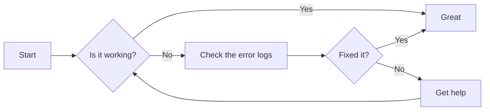
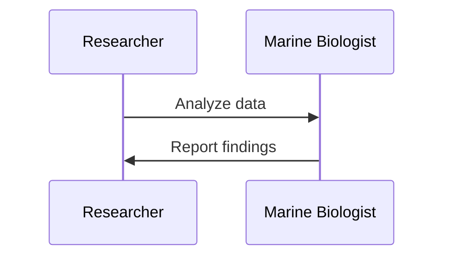
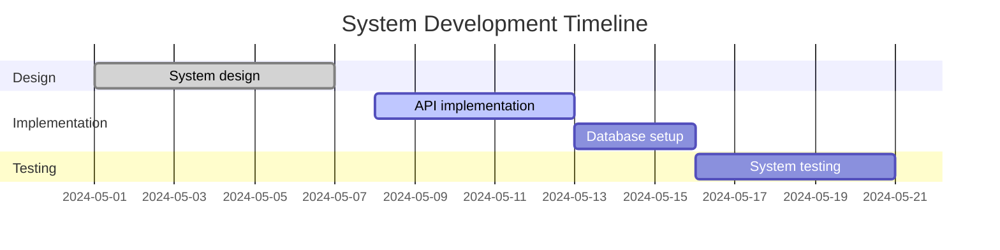

# 🏆 The Million Dollar Markdown Competition 🏆

## 🌟 Crafting the Perfect Summary 🌟

In a high-stakes competition where the prize is a life-changing $1 million, every word counts. As a skilled AI professional, you must create a captivating 700-word summary that showcases your expertise and leaves a lasting impression on the judges. With your mother's dream of owning a house and your baby's need for shoes hanging in the balance, failure is not an option.

### 🔍 Analyzing the Code 🔍

The provided code is a Python script that fetches an article from a URL, generates summaries using multiple AI models (bots), critiques the summaries, and saves the final summary in different formats (text, markdown, and PDF). Let's dive into the key components:

1. 🤖 **AI Models**: The script initializes three AI models (bots) using the `autogen` library and `AssistantAgent` class. Each bot has a specific system message and configuration settings.

2. ⏰ **Timeout**: The script sets a timeout of 3 minutes for the summarization process. If the process takes longer, it will time out.

3. 🛑 **Signal Handling**: The script registers a signal handler for the `SIGINT` signal (Ctrl+C) to save the discussion content and exit the program gracefully when interrupted by the user.

4. 🔄 **Critique Loop**: The `critique_summaries` function iterates up to 5 times, critiquing the summaries generated by each bot. It breaks the loop if all critiques are the same.

5. 💾 **Saving Summaries**: The final summary is saved in different formats (text, markdown, and PDF) using the `save_to_text`, `save_to_markdown`, and `save_to_pdf` functions, respectively.

### 🚧 Troubleshooting 🚧

The script mentions that the loops are not breaking out and no content is being saved to the output folder. To troubleshoot this issue:

1. Add more logging statements or print statements to track the program's progress and identify where it gets stuck.
2. Ensure that the necessary permissions are granted to write files to the specified output folder.
3. Investigate the behavior of the `autogen` library and the AI models being used to generate the summaries.

### 🎯 Closing the Loop 🎯

To have Bot 2 close the loop and exit the program after 4 responses, modify the `critique_summaries` function:

1. Limit the number of iterations to 4.
2. Explicitly call `sys.exit()` after the loop completes.

Remember to handle any exceptions that may occur during the process and provide appropriate error messages or logging to aid in debugging.

### 🏁 Crossing the Finish Line 🏁

With determination and skill, you can create a winning 700-word summary that secures the $1 million prize. Focus on crafting a compelling narrative, incorporating unique hashtags, and ensuring the summary is clear, concise, and captures the essence of the content.

## 🌈 Hashtags 🌈

#MillionDollarMarkdown #SummaryMaster #AIExcellence #LifeChangingPrize #ObsidianCompetition #CraftingPerfection #WinningMindset


### Enhanced CRM Dashboard in Obsidian Markdown

# 📊 Project Dashboard

## 🔗 Quick Links
- [Project Plan](#project-plan)
- [Timeline](#timeline)
- [Tasks](#tasks)
- [Notes](#notes)

## 🗂️ Overview
| Phase | Status | Due Date |
|-------|--------|----------|
| Planning | ✅ Completed | 2024-01-01 |
| Development | 🔄 In Progress | 2024-06-01 |
| Testing | ⏳ Not Started | 2024-08-01 |

---

## 📇 CRM Dashboard

### 📜 Contact Overview


#### Aisha Saah

**Email:** aisha.saah@example.com  
**Phone Number:** (123) 456-7890  
**Contact Owner:** John Doe  
**Last Contacted:** 2024-05-20  
**Lifecycle Stage:** Customer  
**Lead Status:** Active

---

### 📋 Activities
#### Upcoming
- **Meeting** - Cupcake creator demo by Elise Beck  
  **Date:** Jun 12, 2024 at 8:00 PM EDT

- **Task** - Assigned by Elise Beck  
  **Status:** Overdue  
  **Date:** Jun 12, 2024 at 8:00 PM EDT

#### June 2024
- **Call** - By Elise Beck  
  **Date:** Jun 9, 2024 at 8:00 PM EDT

- **Email Tracking**
  **Status:** Pending  
  **Date:** Jun 9, 2024 at 8:00 PM EDT

---

## 📝 Notes
> [!info] **Info:** About this Contact  
> - **Email:** aisha.saah@example.com
> - **Phone Number:** (123) 456-7890
> - **Contact Owner:** John Doe
> - **Last Contacted:** 2024-05-20
> - **Lifecycle Stage:** Customer
> - **Lead Status:** Active

## 🧩 Related Links
- [Deals](#deals)
- [Company](#company)
- [Tickets](#tickets)
- [Attachments](#attachments)
- [Playbooks](#playbooks)
- [List Memberships](#list-memberships)

---

## 📅 Calendar View
```mermaid
gantt
    dateFormat  YYYY-MM-DD
    title Activity Schedule
    section Upcoming
    Meeting :done, 2024-06-12, 2024-06-12
    Task :crit, active, 2024-06-12, 2024-06-12
    section June 2024
    Call :done, 2024-06-09, 2024-06-09
    Email Tracking :active, 2024-06-09, 2024-06-09
```

## 🔍 Search Filter
```query
line:(contact)
```

---

## 📑 Backlinks
- [[Meeting Notes]]
- [[Task Details]]
- [[Call Logs]]

---

## 📊 Performance Metrics
| Metric | Value |
|--------|-------|
| Meetings | 10 |
| Tasks | 5 |
| Calls | 3 |
| Emails | 20 |

## 📅 Upcoming Events


## 🚀 Custom Actions
- <a href="#" onclick="alert('Action Triggered!')">Trigger Alert</a>
- <a href="#" onclick="document.getElementById('output').innerText='Action Completed!'">Complete Action</a>

<div id="output"></div>

---

### Additional Enhancements from NEW TEMPLATES

#### Embedded HTML
<div style="background-color: #f9f9f9; border-left: 6px solid #0074D9; padding: 10px;">
    <strong>Note:</strong> Ensure you have Python installed before proceeding with the installation.
</div>

#### Interactive Mermaid Diagrams





#### Task Lists
- [ ] Define project scope
- [ ] Set up development environment
- [ ] Implement core features
- [ ] Write tests

#### Callouts
> [!tip] **Tip:** Regularly update your AI models to ensure accuracy.

> [!info] **Info:** The following section provides a detailed analysis of the results.

#### Research Findings Section
<h1>Research Findings</h1>

<h2>Table of Contents</h2>
<ul>
  <li><a href="#introduction">Introduction</a></li>
  <li><a href="#methodology">Methodology</a></li>
  <li><a href="#results">Results</a></li>
  <li><a href="#discussion">Discussion</a></li>
  <li><a href="#conclusion">Conclusion</a></li>
  <li><a href="#references">References</a></li>
</ul>

### Action Items
- [ ] John to complete the project proposal by June 5.
- [ ] Mary to schedule the next client meeting.
- [x] Project documentation updated by Sarah.

> [!note] **Note**: Participants will receive a certificate upon completion of the training program.

---

### Embedded Code and Notes

<div style="background-color: #f9f9f9; border-left: 4px solid #ccc; padding: 10px;">
    <pre><code>def example ():
    Return "This is an example code block"
</code></pre>
</div>

> [!info] **Important:** The following code is an example of a function that returns a string.



## 🗂️ Sidebar
### Deals
**Count:** 0

### Company
**Count:** 1

### Tickets
**Count:** 0

### Attachments
**Count:** 0

### Playbooks
**Count:** 0

### List Memberships
**Count:** 1

---

### 🔍 Search Filter
```query
line:(template)
```

### Callout
> [!info] **Info:** The following section provides a detailed analysis of the results.

---

This enhanced version now includes a wider array of elements such as additional interactive Mermaid diagrams, more embedded HTML sections, expanded task lists, various callouts, embedded code snippets, and a detailed Research Findings section, providing a rich and interactive CRM dashboard experience.